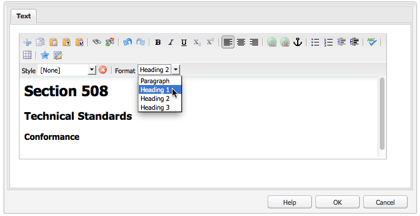
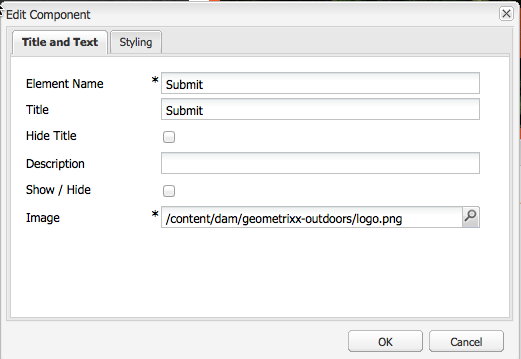
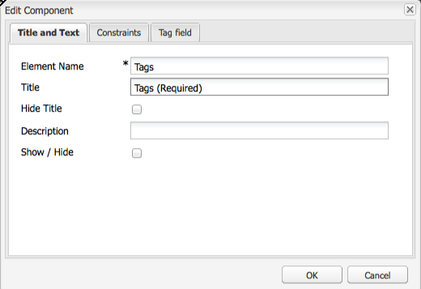

# Creazione di contenuto accessibile (conformità WCAG 2.0){#creating-accessible-content-wcag-conformance}

>[!CAUTION]
>
>Poiché l’interfaccia classica è stata dichiarata obsoleta in AEM 6.4, il contenuto di questa pagina non è stato aggiornato per WCAG 2.1.
>
>Per informazioni dettagliate su AEM e WCAG 2.1, consulta le pagine seguenti:
>
>* [Linee guida sull’accessibilità dei AEM e dei contenuti web](/help/managing/web-accessibility.md)
>* [Guida rapida alle linee guida WCAG 2.1](/help/managing/qg-wcag.md)
>* [Creazione di contenuto accessibile (conformità WCAG 2.1)](/help/sites-authoring/creating-accessible-content.md)


Le linee guida WCAG 2.0 sono costituite da un insieme di criteri di successo e linee guida che non dipendono dalla tecnologia in uso e hanno l’obiettivo di rendere i contenuti web accessibili e utilizzabili da persone con disabilità.

>[!NOTE]
>
>Consulta anche:
>
>* [Guida rapida alle linee guida WCAG 2.0](/help/managing/qg-wcag.md)
>* [Configurazione dell’editor Rich Text per generare contenuto accessibile](/help/sites-administering/rte-accessible-content.md)
>


Le presenti linee guida sono classificate in base a tre livelli di conformità: Livello A (il più basso), livello AA e livello AAA (il più alto). Brevemente, i livelli sono definiti come segue:

* **Livello A**: il sito ha raggiunto un livello minimo di accessibilità di base. Per arrivare a questo livello sono stati soddisfatti tutti i criteri di successo di livello A.
* **Livello AA:** Livello di accessibilità ideale da porsi come obiettivo, in cui il sito presenta un livello massimo di accessibilità che lo rende accessibile al maggior numero di persone nella maggior parte delle situazioni e con l’utilizzo di più tecnologie possibili. Per arrivare a questo livello sono stati soddisfatti tutti i criteri di successo di livello A e livello AA.
* **Livello AAA:** il sito ha raggiunto un livello molto alto di accessibilità. Per arrivare a questo livello sono stati soddisfatti tutti i criteri di successo di livello A, AA e AAA.

Quando si crea un sito, è necessario determinare il livello complessivo che si desidera ottenere.

Nella sezione seguente sono incluse le [linee guida WCAG 2.0](https://www.w3.org/TR/WCAG20/#guidelines) e i criteri di successo per i [livelli di conformità](https://www.w3.org/TR/UNDERSTANDING-WCAG20/conformance.html) A e AA.

>[!NOTE]
>
>Poiché non è possibile soddisfare tutti i criteri di successo AAA per alcuni tipi di contenuti, si sconsiglia di richiedere questo livello di conformità come criterio generale.

>[!NOTE]
>
>Questo documento utilizza quanto segue:
>
>* i nomi brevi per le [linee guida WCAG 2.0](https://www.w3.org/TR/WCAG20/#guidelines).
>* la numerazione utilizzata nelle [linee guida WCAG 2.0](https://www.w3.org/TR/WCAG20/#guidelines) per facilitare i riferimenti incrociati al sito web WCAG.
>


## Principio 1: Percepibilità  {#principle-perceivable}

[Principio 1: Percepibile - Informazioni e componenti dell’interfaccia utente devono essere presentati agli utenti con modalità da loro percepibili.](https://www.w3.org/TR/WCAG20/#perceivable)

### Alternative testuali (1.1)  {#text-alternatives}

[Linea guida 1.1 - Alternative testuali: fornire alternative testuali per qualsiasi contenuto non testuale in modo che possa essere convertito in altri formati richiesti, come la stampa a caratteri grandi, il Braille, la sintesi vocale, i simboli o un linguaggio più semplice.](https://www.w3.org/TR/WCAG20/#text-equiv)

### Contenuto non testuale (1.1.1) {#non-text-content}

* Criterio di successo 1.1.1
* Livello A
* Contenuto non testuale: tutto il contenuto non testuale presentato all’utente dispone di un’alternativa testuale che svolge la finalità equivalente, fatta eccezione per le situazioni elencate di seguito.

#### Finalità - Contenuto non testuale (1.1.1) {#purpose-non-text-content}

Le informazioni contenute in una pagina web possono essere fornite in diversi formati non testuali, ad esempio immagini, video, animazioni, grafici e grafici. Le persone non vedenti o con gravi disabilità visive non sono in grado di visualizzare contenuti non testuali, ma possono accedere al contenuto testuale tramite la lettura da parte di un assistente vocale o la presentazione in forma tattile da parte di un dispositivo di visualizzazione Braille. Pertanto, fornendo alternative testuali al contenuto in formato grafico, le persone che non possono vedere che il contenuto grafico può accedere a una versione equivalente delle informazioni fornite dal contenuto.

Un vantaggio aggiuntivo utile è che le alternative testuali consentono l’indicizzazione dei contenuti non testuali da parte della tecnologia dei motori di ricerca.

#### Come soddisfare il criterio - Contenuto non testuale (1.1.1) {#how-to-meet-non-text-content}

Per gli elementi grafici statici, il requisito fondamentale consiste nel fornire un&#39;alternativa testuale equivalente. Questo metodo viene eseguito nella **Testo Alt** campo:

>[!NOTE]
>
>Alcuni componenti pronti per l’uso, come **Carosello** e **Presentazione**, non consentono di aggiungere descrizioni di testo alternativo alle immagini. Quando implementi le versioni di questi componenti per l’istanza AEM, il team di sviluppo deve configurare tali componenti per supportare `alt` attributo. In questo modo gli autori possono aggiungerlo al contenuto (consulta [Aggiunta di supporto per elementi e attributi di HTML aggiuntivi](/help/sites-administering/rte-accessible-content.md#add-support-for-more-html-elements-and-attributes)).

La **Testo Alt** è disponibile nel campo **Avanzate** scheda delle proprietà dell’immagine **Immagine** finestra di dialogo del componente:


AEM aggiunge un **Testo Alt** alle immagini per impostazione predefinita. Per l’interfaccia classica, esistono due scenari diversi per la creazione dell’attributo predefinito, anche se il valore predefinito potrebbe non essere sufficiente come alternativa e probabilmente deve essere modificato nel **Avanzate** scheda proprietà immagine:

* File:

Un&#39;immagine viene caricata dal disco rigido dell&#39;utente. Se si aggiunge un componente immagine a una pagina e si sceglie un&#39;immagine dal disco rigido o da un&#39;altra origine, il valore predefinito per **Testo Alt** è `file`. Questo valore deve essere modificato nella **Avanzate** scheda delle proprietà dell’immagine. Anche in questo caso, questo valore non viene visualizzato nel **Testo Alt** ma quando il valore viene modificato, il nuovo valore viene visualizzato nel campo .

* Risorsa:

Un’immagine viene aggiunta dall’archivio delle risorse digitali. Se trascini un’immagine dall’archivio delle risorse digitali in una pagina web, la **Titolo** e **Testo Alt** i valori dell&#39;immagine vengono ricavati dai metadati dell&#39;immagine.

>[!NOTE]
>
>In entrambi gli scenari di cui sopra, il valore predefinito **Testo Alt** il valore non è visibile nel **Proprietà immagine avanzate** scheda . Per modificare il valore predefinito, è sufficiente immettere un nuovo valore nel **Testo Alt** campo .

>[!NOTE]
>
>Se l’immagine è puramente decorativa (consulta [Creazione di buone alternative testuali](#creating-good-text-alternatives)), puoi immettere uno spazio nel **Testo Alt** campo utilizzando la barra spaziatrice. In questo modo si crea un vuoto `alt` , che richiede a un assistente vocale di ignorare l&#39;immagine.

#### Creazione di buone alternative testuali  {#creating-good-text-alternatives}

Esistono varie forme di contenuti non testuali, di conseguenza il valore del testo alternativo dipende dal ruolo dell’elemento grafico all’interno della pagina Web. Alcune regole generali includono:

* Le alternative testuali dovrebbero essere succinte ma acquisire chiaramente le informazioni essenziali fornite dal contenuto non testuale.
* È necessario evitare descrizioni eccessivamente lunghe (oltre 100 caratteri). Se un testo alternativo richiede ulteriori dettagli:

   * fornisci una breve descrizione nel testo alternativo
   * e hanno una descrizione più lunga nel testo altrove sulla stessa pagina o in una pagina web separata. Collega a questa descrizione separata rendendo l’immagine un collegamento o posizionando un collegamento di testo accanto all’immagine.

* Il testo alternativo non deve replicare il contenuto fornito sotto forma di testo nella stessa pagina. Ricorda che molte immagini sono illustrazioni di punti già trattati nel testo di una pagina, pertanto potrebbe esistere già un’alternativa testuale dettagliata.
* Se il contenuto non testuale è un collegamento a un’altra pagina o documento e non esiste altro testo che faccia parte dello stesso collegamento, il testo alternativo per l’immagine deve indicare la destinazione del collegamento. Non deve descrivere l&#39;immagine.
* Se il contenuto non testuale è contenuto in un elemento pulsante e non esiste testo che faccia parte dello stesso pulsante, il testo alternativo dell’immagine deve indicare la funzionalità del pulsante e non descrivere l’immagine.
* È accettabile che a un’immagine venga assegnato un testo alternativo vuoto (null), ma solo se l’immagine non dispone di testo alternativo. Ad esempio, è un grafico puramente decorativo. Oppure, se il testo equivalente esiste già nel testo della pagina.

La [Bozza W3C: Tecniche di HTML5 per fornire alternative testuali utili](https://html.spec.whatwg.org/multipage/images.html#alt) dispone di ulteriori dettagli ed esempi di testi alternativi adeguati per immagini di tipi diversi.

Tipi specifici di contenuto non testuale che richiedono alternative testuali potrebbero includere:

* Foto illustrative:

Queste sono immagini di persone, oggetti o luoghi. Pensa al ruolo della foto nella pagina; è probabile che un equivalente testuale adeguato sia *Foto di [oggetto]*, ma può dipendere dal testo circostante.

* Icone:

Piccoli pittogrammi (grafici) che veicolano informazioni specifiche. Devono essere utilizzati in modo coerente in una pagina e in un sito. Tutte le istanze dell’icona in una pagina o in un sito devono avere lo stesso testo alternativo, breve e sintetico, a meno che ciò non comporti inutili duplicazioni del testo adiacente.

* Grafici e diagrammi:

In genere rappresentano dati numerici. Quindi un&#39;opzione per fornire un testo alternativo potrebbe essere quella di includere un breve riepilogo delle principali tendenze mostrate nel grafico o grafico. Se necessario, fornisci anche una descrizione più dettagliata nel testo utilizzando **Descrizione** nel campo **Avanzate** scheda delle proprietà dell’immagine. Inoltre, puoi fornire i dati di origine in formato tabulare altrove nella pagina o nel sito.


Per fornire un&#39;alternativa a questo grafico di esempio, aggiungi un conciso `alt` all&#39;immagine stessa e quindi seguire l&#39;immagine con un&#39;alternativa testuale completa.

```xml
<p></p>
<p> Figure 1. Distribution of Articles by Journal Category.
Pie chart: Language=68%, Education=14% and Science=18%.</p>
```

>[!NOTE]
>
>Lo snippet di cui sopra viene utilizzato solo per illustrare l’ordine. Utilizza la **Immagine** anziché il `img src` riferimento utilizzato sopra.

In AEM è possibile utilizzare una combinazione delle **Testo Alt** e **Descrizione** campi nella finestra di dialogo di configurazione dell’immagine, come in [Come soddisfare il criterio - Contenuto non testuale (1.1.1)](#how-to-meet-non-text-content).

* Mappe, diagrammi, diagrammi di flusso:

Per gli elementi grafici che forniscono dati spaziali (ad esempio, per descrivere le relazioni tra gli oggetti o un processo), assicurati che il messaggio chiave sia fornito in formato testo.  Per le mappe, potrebbe non risultare pratico fornire un equivalente di testo completo. Se la mappa ha lo scopo di aiutare le persone a individuare una posizione particolare, il testo alternativo dell’immagine della mappa può indicare brevemente *Mappa di X*, fornendo poi le indicazioni per tale posizione in un altro testo della pagina o attraverso il campo **Descrizione**, disponibile nella scheda **Avanzate** del componente **Immagine**.

* CAPTCHA:

Un CAPTCHA è un *Test di Turing Pubblico Completamente Automatizzato per dire computer e umani a parte*. Si tratta di un controllo di sicurezza utilizzato sulle pagine web per distinguere gli esseri umani da software dannoso, ma che può causare barriere di accessibilità. Si tratta di immagini che richiedono agli utenti di descrivere ciò che vedono per superare un test di sicurezza. Non è possibile fornire un’alternativa testuale per l’immagine, pertanto è necessario considerare soluzioni non grafiche alternative.

Il W3C offre diversi suggerimenti, ad esempio: Ognuno di questi approcci ha i propri meriti e svantaggi.

    * puzzle logici
    * Uso dell&#39;uscita audio invece delle immagini
    * Account a uso limitato e filtri anti-spam.

* Immagini di sfondo:

Queste immagini vengono ottenute utilizzando i CSS (Cascading Style Sheets, fogli di stile a cascata) anziché in HTML. Non è possibile specificare un valore di testo alternativo. Pertanto, le immagini di sfondo non devono fornire informazioni testuali importanti, se lo fanno, devono essere fornite anche nel testo della pagina.

Tuttavia, è importante che venga visualizzato uno sfondo alternativo quando l&#39;immagine non può essere visualizzata.

>[!NOTE]
>
>Dovrebbe essere previsto un livello adeguato di contrasto tra lo sfondo e il testo in primo piano. Questo contrasto viene discusso più dettagliatamente in [Contrasto (minimo) (1.4.3)](#contrast-minimum).

#### Ulteriori informazioni - Contenuto non testuale (1.1.1) {#more-information-non-text-content}

* [Comprendere i criteri di successo 1.1.1](https://www.w3.org/TR/UNDERSTANDING-WCAG20/text-equiv-all.html)
* [Come soddisfare i criteri di successo 1.1.1](https://www.w3.org/WAI/WCAG21/quickref/?versions=2.0#text-alternatives)
* [W3C: Tecniche di HTML5 per fornire alternative testuali utili](https://html.spec.whatwg.org/multipage/images.html#alt)
* [Spiegazione W3C dei CAPTCHA e relative alternative](https://www.w3.org/TR/turingtest/)

### Media temporizzati (1.2)  {#time-based-media}

[Linea guida 1.2 - Media temporizzati: fornire alternative per gli elementi multimediali temporizzati.](https://www.w3.org/TR/WCAG20/#text-equiv)

Queste informazioni si riferiscono al contenuto web *basato sul tempo*. Vengono trattati i contenuti che l’utente può riprodurre (come video, audio e contenuti animati) e che possono essere preregistrati o in streaming.

### Solo audio e solo video (preregistrato) (1.2.1)  {#audio-only-and-video-only-pre-recorded}

* Criterio di successo 1.2.1
* Livello A
* Solo audio e solo video (preregistrati): per gli elementi solo video e solo audio preregistrati vale quanto segue, tranne quando l’audio o il video sia un elemento alternativo per il testo, chiaramente indicato come tale:

   * Solo audio preregistrato: È disponibile un’alternativa per i contenuti multimediali temporizzati che presenta informazioni equivalenti ai contenuti solo audio preregistrati.
   * Solo video preregistrato: È disponibile un’alternativa per gli elementi multimediali temporizzati o una traccia audio che presenta informazioni equivalenti ai contenuti solo video preregistrati.

#### Finalità - Solo audio e solo video (preregistrato) (1.2.1)  {#purpose-audio-only-and-video-only-pre-recorded}

Problemi di accessibilità per audio e video possono essere riscontrati da:

* persone con disabilità visive in assenza di colonna sonora o la colonna sonora non è sufficiente per informarli di ciò che sta accadendo nel video o nell’animazione;
* persone con disabilità uditive o non udenti, che non possono sentire la colonna sonora;
* Persone che possono ascoltare la colonna sonora, ma non capiscono cosa si sta parlando (per esempio, perché si trova in una lingua che non capiscono).

Video o audio possono anche non essere disponibili per le persone che utilizzano browser o dispositivi che non supportano la riproduzione di contenuti in formati multimediali specifici, ad Adobe Flash.

Fornire queste informazioni in un formato diverso, ad esempio testo (o audio per video senza audio) può renderle accessibili alle persone che non possono accedere al contenuto originale.

#### Come soddisfare il criterio - Solo audio e solo video (preregistrato) (1.2.1)  {#how-to-meet-audio-only-and-video-only-pre-recorded}

* Se il contenuto è una traccia audio preregistrata senza video (come un podcast):

   * Fornisci un collegamento immediatamente prima o dopo il contenuto, a una trascrizione testuale del contenuto audio.

   La trascrizione deve essere una pagina HTML con un equivalente testuale di tutti i contenuti parlati e non parlati importanti. Dovrebbe inoltre indicare chi sta parlando, una descrizione dell&#39;ambientazione, le espressioni vocali e una descrizione di qualsiasi altro audio significativo.

* Se il contenuto è un&#39;animazione o un video preregistrato senza audio:

   * Fornisci un collegamento immediatamente prima o dopo il contenuto ad una descrizione testuale equivalente delle informazioni fornite dal video
   * Oppure una descrizione audio equivalente in un formato audio comunemente utilizzato come MP3.

>[!NOTE]
>
>Se il contenuto audio o video viene fornito come alternativa al contenuto presente in un altro formato in una pagina web, non è necessario soddisfare i requisiti di cui sopra. Ad esempio, se un video illustra un elenco di istruzioni testuali, questo video non richiede un’alternativa, in quanto le istruzioni testuali agiscono già come alternativa al video.

L’inserimento di contenuti multimediali, in particolare contenuti di Flash, nelle pagine web AEM è simile all’inserimento di un’immagine. Tuttavia, dato che il contenuto multimediale è molto più di un&#39;immagine fissa, esistono diverse impostazioni e opzioni per controllare come viene riprodotto il materiale multimediale.

>[!NOTE]
>
>Quando utilizzi elementi multimediali con contenuti informativi, è necessario creare anche collegamenti a contenuti alternativi. Ad esempio, per includere una trascrizione testuale, crea una pagina HTML per visualizzare la trascrizione e quindi aggiungi un collegamento accanto o sotto al contenuto audio.

#### Ulteriori informazioni - Solo audio e solo video (preregistrato) (1.2.1) {#more-information-audio-only-and-video-only-pre-recorded}

* [Comprendere i criteri di successo 1.2.1](https://www.w3.org/TR/UNDERSTANDING-WCAG20/media-equiv-av-only-alt.html)
* [Come soddisfare i criteri di successo 1.2.1](https://www.w3.org/WAI/WCAG21/quickref/?versions=2.0#time-based-media)

### Sottotitoli (preregistrati) (1.2.2)  {#captions-pre-recorded}

* Criterio di successo 1.2.2
* Livello A
* Sottotitoli (preregistrati): i sottotitoli vengono forniti per tutti i contenuti audio preregistrati negli elementi multimediali sincronizzati, fatta eccezione per il caso in cui l’elemento multimediale sia alternativo al testo e chiaramente indicato come tale.

#### Finalità - Sottotitoli (preregistrati) (1.2.2)  {#purpose-captions-pre-recorded}

Le persone non udenti o ipoudenti non possono accedere ai contenuti audio o hanno gravi difficoltà di accesso. I sottotitoli sono equivalenti testuali dell’audio parlato e non, visualizzati sullo schermo al momento opportuno durante il video. Permettono alle persone che non possono sentire l&#39;audio di capire cosa sta succedendo.

>[!NOTE]
>
>I sottotitoli non sono richiesti quando testo o equivalenti non testuali adeguati (che forniscono informazioni direttamente equivalenti) sono disponibili sulla stessa pagina del video o dell’animazione.

#### Come soddisfare il criterio - Sottotitoli (preregistrati) (1.2.2)  {#how-to-meet-captions-pre-recorded}

I sottotitoli possono essere:

* Sottotitoli non codificati: sempre visibili durante la riproduzione del video
* Sottotitoli codificati: possono essere attivati o disattivati dall’utente

Se possibile, utilizza i sottotitoli codificati. Consente agli utenti di scegliere se visualizzare o meno i sottotitoli.

Per i sottotitoli codificati, creare e fornire un file di sottotitoli sincronizzati nel formato appropriato, ad esempio [SMIL](https://www.w3.org/AudioVideo/), insieme al file video.

Consulta le esercitazioni in [Ulteriori informazioni - Sottotitoli (preregistrati) (1.2.2)](#more-information-captions-pre-recorded). Assicurati di fornire una nota per informare gli utenti che i sottotitoli sono disponibili per il video.

Se è necessario utilizzare didascalie aperte, incorpora il testo nella traccia video. Questo metodo si ottiene utilizzando applicazioni di editing video che consentono di sovrapporre i titoli al video.

#### Ulteriori informazioni - Sottotitoli (preregistrati) (1.2.2)  {#more-information-captions-pre-recorded}

* [Comprendere i criteri di successo 1.2.2](https://www.w3.org/TR/UNDERSTANDING-WCAG20/media-equiv-captions.html):
* [Come soddisfare i criteri di successo 1.2.2](https://www.w3.org/WAI/WCAG21/quickref/?versions=2.0#time-based-media)
* [W3C: File multimediali sincronizzati](https://www.w3.org/AudioVideo/)
* [Sottotitoli, trascrizioni e descrizioni audio, di WebAIM](https://webaim.org/techniques/captions/)

### Descrizione audio o elemento multimediale alternativo (preregistrato) (1.2.3)  {#audio-description-or-media-alternative-pre-recorded}

* Criterio di successo 1.2.3
* Livello A
* Audiodescrizione o tipo di media alternativo (preregistrato): viene fornita un’alternativa per gli elementi multimediali temporizzati o una descrizione audio del contenuto video preregistrato per gli elementi multimediali sincronizzati, fatta eccezione per il caso in cui l’elemento multimediale sia alternativo al testo, e chiaramente indicato come tale.

#### Finalità - Descrizione audio o file multimediale alternativo (preregistrato) (1.2.3)  {#purpose-audio-description-or-media-alternative-pre-recorded}

Le persone non vedenti o ipovedenti incontrano ostacoli nell’accesso facilitato se le informazioni contenute in un video o in un’animazione vengono fornite solo visivamente. Oppure, se la colonna sonora non fornisce informazioni sufficienti per consentire la comprensione di ciò che sta accadendo visivamente.

#### Come soddisfare il criterio - Descrizione audio o elemento multimediale alternativo (preregistrato) (1.2.3)  {#how-to-meet-audio-description-or-media-alternative-pre-recorded}

Per soddisfare questo criterio di successo è possibile adottare due approcci. È accettabile:

1. Includi una descrizione audio aggiuntiva per il contenuto video. Puoi eseguire questo approccio in uno dei tre modi seguenti:

   * Durante le pause nella finestra di dialogo esistente, fornisci informazioni sui cambiamenti della scena che non vengono presentati come parte della traccia audio esistente;
   * Fornisci una nuova traccia audio aggiuntiva e facoltativa contenente la colonna sonora originale, ma anche informazioni audio aggiuntive sui cambiamenti della scena.

      * Gli utenti possono passare dalla traccia audio esistente (che *non* contengono una descrizione audio) e la nuova traccia audio (che *does* contiene una descrizione audio).
      * Questo metodo evita interruzioni agli utenti che non necessitano della descrizione aggiuntiva.
   * Crea una seconda versione del contenuto video per consentire descrizioni audio estese. In questo modo si riducono le difficoltà associate alla fornitura di descrizioni audio dettagliate all&#39;interno degli spazi tra la finestra di dialogo esistente, mettendo temporaneamente in pausa audio e video nei punti appropriati. Di conseguenza, è possibile fornire una descrizione audio molto più lunga prima che l&#39;azione ricominci. Come nell’esempio precedente, questa funzione è fornita come traccia audio aggiuntiva opzionale per evitare interruzioni agli utenti che non necessitano della descrizione aggiuntiva.


1. Fornisci una trascrizione testuale che rappresenti un equivalente testuale adatto per gli elementi sonori e visivi del video o dell’animazione. Deve comprendere, se del caso, un&#39;indicazione su chi sta parlando, una descrizione dell&#39;ambientazione, le espressioni vocali. A seconda della lunghezza, è possibile posizionare la trascrizione sulla stessa pagina del video o dell’animazione o su una pagina separata; se scegli la seconda opzione, fornisci un collegamento alla trascrizione accanto al video o all’animazione.

I dettagli precisi sulle modalità di creazione di video con descrizione audio vanno oltre lo scopo di questa guida. La creazione di video e descrizioni audio può richiedere parecchio tempo, ma puoi ricorrere ad altri prodotti Adobe per facilitare l’esecuzione di tali attività. Se crei contenuto in Adobe Flash Professional, devi anche creare uno script per richiedere all’utente di scaricare il plug-in appropriato e fornire un testo alternativo attraverso l’elemento `<noscript>`.

#### Ulteriori informazioni - Descrizione audio o elemento multimediale alternativo (preregistrato) (1.2.3) {#more-information-audio-description-or-media-alternative-pre-recorded}

* [Comprendere i criteri di successo 1.2.3](https://www.w3.org/TR/UNDERSTANDING-WCAG20/media-equiv-audio-desc.html):
* [Come soddisfare i criteri di successo 1.2.3](https://www.w3.org/WAI/WCAG21/quickref/?versions=2.0#qr-media-equiv-audio-desc)
* [Adobe Encore CS5](https://helpx.adobe.com/premiere-pro/using/whats-new.html)

### Sottotitoli (dal vivo) (1.2.4)    {#captions-live}

* Criterio di successo 1.2.4
* Livello AA
* Sottotitoli (in tempo reale): i sottotitoli vengono forniti per tutti i contenuti audio dal vivo negli elementi multimediali sincronizzati.

#### Finalità - Sottotitoli (in tempo reale) (1.2.4)  {#purpose-captions-live}

Questo criterio di successo è identico a [Sottotitoli (preregistrati)](#captions-pre-recorded), in quanto riguarda la rimozione degli ostacoli di accessibilità per persone non udenti o ipoudenti, tranne per il fatto che questo criterio di successo è relativo a presentazioni in tempo reale, come i webcast.

#### Come soddisfare il criterio - Sottotitoli (in tempo reale) (1.2.4) {#how-to-meet-captions-live}

Seguire le indicazioni fornite [Sottotitoli (preregistrati)](#captions-pre-recorded) sopra. Tuttavia, a causa della natura live dei media, i sottotitoli devono essere creati il più rapidamente possibile e in risposta a ciò che sta accadendo. Pertanto, dovresti considerare l’utilizzo di strumenti per la creazione di sottotitoli in tempo reale o di speech-to-text.

Istruzioni dettagliate al riguardo vanno oltre lo scopo di questo documento, ma informazioni utili sono reperibili tramite le risorse seguenti:

* [WebAIM: aggiunta di sottotitoli in tempo reale](https://webaim.org/techniques/captions/realtime)
* [AccessIT (University of Washington): i sottotitoli possono essere generati automaticamente utilizzando il riconoscimento vocale?](https://www.washington.edu/doit/programs/accessit?1209)

#### Ulteriori informazioni - Sottotitoli (dal vivo) (1.2.4)  {#more-information-captions-live}

* [Comprendere i criteri di successo 1.2.4](https://www.w3.org/TR/UNDERSTANDING-WCAG20/media-equiv-real-time-captions.html)
* [Come soddisfare i criteri di successo 1.2.4](https://www.w3.org/WAI/WCAG21/quickref/?versions=2.0#qr-media-equiv-real-time-captions)

### Descrizione audio (preregistrato) (1.2.5)    {#audio-description-pre-recorded}

* Criterio di successo 1.2.5
* Livello AA
* Descrizione audio (preregistrato): La descrizione audio viene fornita per tutti i contenuti video preregistrati negli elementi multimediali sincronizzati.

#### Finalità - Descrizione audio (preregistrato) (1.2.5)  {#purpose-audio-description-pre-recorded}

Questo criterio di successo è identico a [Descrizione audio o elemento multimediale alternativo (preregistrato)](#audio-description-or-media-alternative-pre-recorded), tranne per il fatto che gli autori devono fornire una descrizione audio molto più dettagliata per adeguarsi al livello AA.

#### Come soddisfare il criterio - Descrizione audio (preregistrato) (1.2.5)  {#how-to-meet-audio-description-pre-recorded}

Segui le indicazioni fornite per [Descrizione audio o elemento multimediale alternativo (preregistrato)](#audio-description-or-media-alternative-pre-recorded).

#### Ulteriori informazioni - Descrizione audio (preregistrato) (1.2.5)  {#more-information-audio-description-pre-recorded}

* [Comprendere i criteri di successo 1.2.5](https://www.w3.org/TR/UNDERSTANDING-WCAG20/media-equiv-audio-desc-only.html)
* [Come soddisfare i criteri di successo 1.2.5](https://www.w3.org/WAI/WCAG21/quickref/?versions=2.0#qr-media-equiv-audio-desc-only)

### Adattabile (1.3)  {#adaptable}

[Linea guida 1.3 - Adattabile: creare contenuti che possano essere rappresentati in modalità differenti (ad esempio con un layout più semplice), senza perdere informazioni o struttura.](https://www.w3.org/TR/WCAG20/#content-structure-separation)

Questa linea guida copre i requisiti necessari per supportare le persone che:

* potrebbero non essere in grado di accedere alle informazioni presentate da un autore in un *standard* layout di pagina web colorato bidimensionale, a più colonne

* potrebbero utilizzare una visualizzazione solo audio o una alternativa, ad esempio testo di grandi dimensioni e a contrasto elevato.

### Informazioni e correlazioni (1.3.1)    {#info-and-relationships}

* Criterio di successo 1.3.1
* Livello A
* Informazioni e correlazioni: Le informazioni, la struttura e le relazioni veicolate attraverso la presentazione possono essere determinate a livello di programmazione o sono disponibili nel testo.

#### Finalità - Informazioni e correlazioni (1.3.1)  {#purpose-info-and-relationships}

Molte tecnologie per l’accessibilità utilizzate da persone con disabilità si basano su informazioni strutturali per visualizzare o generare contenuti in modo efficace. Queste informazioni strutturali possono assumere la forma di intestazioni di pagina, intestazioni di riga e colonna di tabella e tipi di elenco. Ad esempio, un’utilità di lettura dello schermo potrebbe consentire a un utente di spostarsi all’interno di una pagina passando da un’intestazione a un’altra. Tuttavia, quando la struttura del contenuto della pagina dipende esclusivamente da uno stile visivo, anziché dal codice HTML sottostante, non sono presenti informazioni strutturali utilizzabili dalle tecnologie per l’accessibilità, il che ne limita la capacità di supportare la navigazione facilitata.

Questo criterio di successo esiste per garantire che tali informazioni strutturali vengano fornite tramite HTML, in modo che i browser e le tecnologie per l’accessibilità possano accedere e sfruttare le informazioni.

#### Come soddisfare il criterio - Informazioni e correlazioni (1.3.1)  {#how-to-meet-info-and-relationships}

AEM facilita la creazione di pagine web utilizzando gli elementi HTML appropriati. Apri il contenuto della pagina nell’editor Rich Text (un componente di testo) e utilizza l’ **Formato** per specificare l’elemento strutturale appropriato (ad esempio paragrafo e intestazione).

L’immagine seguente mostra il testo che è stato formattato come testo di paragrafo; la visualizzazione del codice sorgente utilizzata mostra che l&#39;apertura e la chiusura sono corrette &lt;p> e &lt;/p> tag.


Assicurati che alle pagine web sia associata la struttura appropriata:

* **Utilizzando i titoli:**  

Se le funzioni di accessibilità dell’editor Rich Text sono abilitate (consulta [AEM e accessibilità](/help/sites-administering/rte-accessible-content.md)), AEM offre tre livelli di intestazione di pagina. Puoi utilizzarli per identificare sezioni e sottosezioni di contenuto. Titolo 1 rappresenta il livello di intestazione più alto, Titolo 3 quello più basso. L’amministratore di sistema può configurare il sistema per consentire l’utilizzo di più livelli di intestazione.

L’immagine seguente illustra un esempio dei diversi tipi di intestazioni.



* **Testo con enfasi**:

Utilizza l’elemento o per indicare l’enfasi. Non utilizzare le intestazioni per evidenziare il testo all’interno dei paragrafi.

    * Evidenziare il testo che si desidera evidenziare;
    * Fai clic sull’icona **B** (per &amp;lt;strong&amp;gt;) o sull’icona **I** (per &amp;lt;em&amp;gt;) visualizzata nel pannello **Properties* (assicurati che sia selezionato HTML).

>[!NOTE]
>
>L’editor Rich Text in un’installazione standard di AEM è configurato per utilizzare:
>
>* &lt;b> per &lt;strong>
* &lt;i> per &lt;em>
  >
Sono effettivamente uguali, ma e sono preferibili in quanto rappresentano un html corretto dal punto di vista semantico. Il team di sviluppo può configurare l’editor Rich Text in modo che utilizzi e (anziché e ) durante lo sviluppo dell’istanza di progetto.

* **Utilizzare gli elenchi**: è possibile utilizzare l’HTML per specificare tre diversi tipi di elenchi:

   * La `<ul>` viene utilizzato per *non ordinato* elenchi (puntati). Le singole voci dell’elenco sono identificate dall’elemento `<li>`. 

   nell’editor Rich Text, utilizza **Elenco puntato** icona.

   * L’elemento `<ol>`viene utilizzato per gli elenchi *numerati*. Le singole voci dell’elenco sono identificate dall’elemento `<li>`. 

   Nell’editor Rich Text, utilizza l’icona **Elenco numerato**.

Per modificare il contenuto esistente in un tipo di elenco specifico, evidenzia il testo appropriato e seleziona il tipo di elenco appropriato. Come nell’esempio precedente, che mostra come inserire il testo paragrafo, gli elementi elenco appropriati vengono aggiunti automaticamente al HTML, ma è possibile visualizzarli nella vista modifica sorgente.

>[!NOTE]
La `<dl>` l’elemento non è supportato dall’editor Rich Text.

* **Utilizzare le tabelle**:

Le tabelle di dati devono essere identificate utilizzando gli elementi della tabella di HTML:

    * uno `&lt;table>` element
    * a `&lt;tr>Elemento ` per ogni riga della tabella
    * a `&lt;th>Elemento ` per ogni intestazione di riga e colonna
    * a `&lt;td>Elemento ` per ogni cella di dati

>[!NOTE]
Le tabelle devono essere realizzate con **Tabella** componente. Anche se è possibile creare tabelle nel componente Testo, questa opzione non è consigliata.

Inoltre, le tabelle accessibili utilizzano i seguenti elementi e attributi:

    * `&lt;caption>L’elemento ` viene utilizzato per fornire una didascalia visibile per la tabella. Per impostazione predefinita, le didascalie vengono visualizzate centrate sopra la tabella, ma possono essere posizionate in modo appropriato utilizzando gli stili CSS. La didascalia è associata alla tabella a livello di programmazione, pertanto è un metodo utile per fornire un’introduzione al contenuto.
    * `&lt;h3 class=&quot;summary&quot;>L’elemento ` aiuta gli utenti non vedenti a comprendere più facilmente le informazioni presentate all’interno di una tabella, fornendo una sintesi di ciò che un utente vedente può vedere. Risulta particolarmente utile quando si utilizzano layout di tabella complessi o non convenzionali (l’attributo non viene visualizzato nel browser, ma viene letto solo alle tecnologie per l’accessibilità).
    * Attributo `scope` del `&lt;th>L&#39;elemento ` viene utilizzato per indicare se una cella rappresenta un&#39;intestazione per una particolare riga o colonna. Un approccio simile consiste nell’utilizzare gli attributi header e id in tabelle complesse, dove le celle di dati possono essere associate a una o più intestazioni.

>[!NOTE]
Per impostazione predefinita questi elementi e attributi non sono direttamente disponibili, anche se l’amministratore di sistema può aggiungere supporto per questi valori nella finestra di dialogo **Proprietà tabella** (consulta [Aggiunta di supporto per elementi e attributi HTML aggiuntivi](/help/sites-administering/rte-accessible-content.md#add-support-for-more-html-elements-and-attributes)).

Quando si aggiunge una **Tabella**, puoi configurare **Proprietà tabella** mediante la finestra di dialogo .

    * una **Didascalia* appropriata.
    * È consigliabile rimuovere eventuali valori predefiniti per **Larghezza**, **Altezza**, **Bordo**, **Margine celle**, **Spaziatura celle**. dato che queste proprietà possono essere impostate in un foglio di stile globale.


È quindi possibile utilizzare la **Proprietà cella** per scegliere se la cella è una cella di dati o di intestazione e, se si tratta di una cella di intestazione, se si tratta di una riga o di una colonna o entrambe:


* **Tabelle dati complesse:**

Talvolta, in presenza di tabelle complesse con due o più livelli di intestazioni, le proprietà di tabella di base potrebbero non essere sufficienti a fornire tutte le informazioni strutturali necessarie. Per questo tipo di tabelle complesse, è necessario creare relazioni dirette tra le intestazioni e le celle correlate utilizzando **header** e **id** attributi. Ad esempio, nella tabella seguente le intestazioni e gli ID vengono abbinati per creare un’associazione programmatica per gli utenti di tecnologie per l’accessibilità.

>[!NOTE]
L’attributo id non è disponibile in un’installazione standard. Può essere attivato configurando regole HTML e il serializzatore nell’editor Rich Text.

>[!NOTE]
Le tabelle devono essere realizzate con **Tabella** componente. Anche se è possibile creare tabelle nel componente Testo, questa opzione non è consigliata.

```xml
<table>
   <tr>
     <th rowspan="2" id="h">Homework</th>
     <th colspan="3" id="e">Exams</th>
     <th colspan="3" id="p">Projects</th>
   </tr>
   <tr>
     <th id="e1" headers="e">1</th>
     <th id="e2" headers="e">2</th>
     <th id="ef" headers="e">Final</th>
     <th id="p1" headers="p">1</th>
     <th id="p2" headers="p">2</th>
     <th id="pf" headers="p">Final</th>
   </tr>
   <tr>
    <td headers="h">15%</td>
    <td headers="e e1">15%</td>
    <td headers="e e2">15%</td>
    <td headers="e ef">20%</td>
    <td headers="p p1">10%</td>
    <td headers="p p2">10%</td>
    <td headers="p pf">15%</td>
   </tr>
  </table>
```

Per ottenere questo risultato in AEM, è necessario aggiungere il markup direttamente utilizzando la modalità di modifica sorgente.

>[!NOTE]
Questa funzionalità non è immediatamente disponibile in un’installazione standard. Richiede la configurazione dell’editor Rich Text; Regole di HTML e serializzatore.

#### Ulteriori informazioni - Informazioni e correlazioni (1.3.1)  {#more-information-info-and-relationships}

* [Comprendere i criteri di successo 1.3.1](https://www.w3.org/TR/UNDERSTANDING-WCAG20/content-structure-separation-programmatic.html)
* [Come soddisfare i criteri di successo 1.3.1](https://www.w3.org/WAI/WCAG21/quickref/?versions=2.0#qr-content-structure-separation-programmatic)

### Caratteristiche sensoriali (1.3.3)    {#sensory-characteristics}

* Criterio di successo 1.3.3
* Livello A
* Caratteristiche sensoriali: le istruzioni fornite per comprendere e intervenire sui contenuti non si basano unicamente su caratteristiche sensoriali dei componenti quali forma, dimensione, ubicazione visiva, orientamento o audio.

#### Finalità - Caratteristiche sensoriali (1.3.3)  {#purpose-sensory-characteristics}

Nel presentare le informazioni, i designer spesso si concentrano sulle caratteristiche di progettazione visiva come il colore, la forma, lo stile del testo o la posizione assoluta o relativa di un elemento di contenuto. Queste possono essere potenti tecniche di progettazione per veicolare le informazioni, ma le persone non vedenti o ipovedenti potrebbero non essere in grado di accedere alle informazioni che richiedono l’identificazione visiva di attributi quali posizione, colore o forma.

Allo stesso modo, le informazioni che richiedono di distinguere tra suoni diversi (ad esempio, contenuti parlati da voci maschili o femminili) presentano barriere di accessibilità per le persone con disabilità uditive, se non sono incluse in un testo alternativo per il contenuto audio.

>[!NOTE]
Per i requisiti relativi alle alternative al colore, consulta [Uso del colore](#use-of-color).

#### Come soddisfare il criterio - Caratteristiche sensoriali (1.3.3)  {#how-to-meet-sensory-characteristics}

Assicurati che anche tutte le informazioni che si basano sulle caratteristiche visive del contenuto della pagina siano presentate in un formato alternativo.

* Non fare affidamento sulla posizione visiva per fornire informazioni. Ad esempio, se desideri indirizzare gli utenti a un menu sul lato destro della pagina per l’accesso a ulteriori informazioni, non fare riferimento a *menu a destra*; al contrario, denomina il menu (ad esempio tramite un’intestazione) e fai riferimento a tale nome nel testo.
* Non fare affidamento sullo stile del testo (ad esempio, testo in grassetto o in corsivo) come unico modo per trasmettere le informazioni.

>[!NOTE]
L’utilizzo di termini descrittivi è accettabile se questi hanno un significato in un contesto non visivo. Ad esempio, utilizzando *sopra* e *di seguito* in genere è accettabile, in quanto si riferiscono rispettivamente al contenuto prima e dopo un particolare elemento di contenuto. Avrebbe ancora senso quando il contenuto viene parlato ad alta voce.

#### Ulteriori informazioni - Caratteristiche sensoriali (1.3.3) {#more-information-sensory-characteristics}

* [Comprendere i criteri di successo 1.3.3](https://www.w3.org/TR/UNDERSTANDING-WCAG20/content-structure-separation-understanding.html)
* [Come soddisfare i criteri di successo 1.3.3](https://www.w3.org/WAI/WCAG21/quickref/?versions=2.0#qr-content-structure-separation-understanding)

### Distinguibile (1.4)  {#distinguishable}

[Linea guida 1.4 - Distinguibile: facilitare agli utenti la visione e l’ascolto dei contenuti, separando gli elementi in primo piano dallo sfondo.](https://www.w3.org/TR/WCAG20/#visual-audio-contrast)

### Uso del colore (1.4.1)    {#use-of-color}

* Criterio di successo 1.4.1
* Livello A
* Uso del colore: il colore non è utilizzato come unica modalità visiva per rappresentare le informazioni, indicare un’azione, richiedere una risposta o distinguere un elemento visivo.

>[!NOTE]
Questo criterio di successo riguarda in particolare la percezione del colore. Altre forme di percezione sono coperte [Adattabile (1.3)](#adaptable); incluso l&#39;accesso programmatico al colore e ad altre codifiche di presentazione visiva.

#### Finalità - Uso del colore (1.4.1)  {#purpose-use-of-color}

Il colore è un modo efficace per migliorare il fascino estetico delle pagine web ed è utile anche per veicolare le informazioni. Tuttavia, ci sono una serie di disabilità visive, dalla cecità alla mancanza di visione del colore, il che significa che alcune persone non sono in grado di distinguere tra determinati colori. Questo problema rende la codifica dei colori un modo inaffidabile di fornire informazioni.

Ad esempio, qualcuno con carenza di vista a colori rosso-verde non è in grado di distinguere tra sfumature di verde e tonalità di rosso. Possono vedere entrambi i colori come un terzo colore (ad esempio, marrone), nel qual caso non sono in grado di distinguere tra rosso, verde e marrone.

Inoltre, il colore non può essere percepito da persone che utilizzano browser di sola lettura, dispositivi di visualizzazione monocromatici o che visualizzano una stampa in bianco e nero della pagina.

#### Come soddisfare il criterio - Uso del colore (1.4.1)  {#how-to-meet-use-of-color}

Qualunque colore sia utilizzato per trasmettere le informazioni, accertati che queste siano disponibili senza che sia necessario vedere il colore stesso.

Ad esempio, accertati che le informazioni fornite dal colore siano presenti in modo esplicito anche nel testo. L&#39;illustrazione seguente mostra come colore e testo indicano sia la disponibilità di posti a sedere per una performance:

<table>
 <tbody>
  <tr>
   <td><p><strong>Prestazioni</strong></p> </td>
   <td><p><strong>Disponibilità</strong></p> </td>
  </tr>
  <tr>
   <td><p>Martedì 16 marzo<sup>th</sup></p> </td>
   <td><p>POSTI DISPONIBILI</p> </td>
  </tr>
  <tr>
   <td><p>Mercoledì 17 marzo<sup>th</p> </td>
   <td><p>POSTI DISPONIBILI</p> </td>
  </tr>
  <tr>
   <td><p>Giovedì 18 marzo<sup>th</sup></p> </td>
   <td><p>VENDUTO</p> </td>
  </tr>
 </tbody>
</table>

Se il colore viene utilizzato come spunto per fornire informazioni, è necessario fornire un ulteriore segnale visivo, ad esempio la modifica dello stile (grassetto, corsivo) o del font. Questo aiuta le persone con problemi di vista o daltonismo a identificare le informazioni. Tuttavia, non può essere fatto interamente affidamento su di esso, in quanto non aiuta le persone che non possono vedere affatto la pagina.

#### Ulteriori informazioni - Uso del colore (1.4.1) {#more-information-use-of-color}

* [Comprendere i criteri di successo 1.4.1](https://www.w3.org/TR/2008/NOTE-WCAG20-TECHS-20081211/working-examples/G183/link-contrast.html)
* [Come soddisfare i criteri di successo 1.4.1](https://www.w3.org/TR/2008/NOTE-WCAG20-TECHS-20081211/working-examples/G183/link-contrast.html)
* [Indicazioni per ottenere un rapporto di contrasto 3:1, contenente un elenco di colori &quot;web safe&quot;](https://www.w3.org/TR/2008/NOTE-WCAG20-TECHS-20081211/working-examples/G183/link-contrast.html)

### Contrasto (minimo) (1.4.3)  {#contrast-minimum}

* Criterio di successo 1.4.3
* Livello AA
* Contrasto (minimo): La presentazione visiva di testo e immagini di testo ha un rapporto di contrasto di almeno 4,5:1, fatta eccezione per quanto segue:

   * Testo grande: Il testo su larga scala e le immagini di testo su larga scala hanno un rapporto di contrasto di almeno 3:1.
   * Incidentale: per il testo o per le immagini di testo che fanno parte di un componente dell’interfaccia inattivo, che sono puramente decorative, non visibili o che fanno parte di un’immagine che contiene altri contenuti visuali significativi, non è previsto alcun requisito di contrasto.
   * Logotipi: per il testo che fa parte di un logo o di un marchio non è previsto alcun requisito minimo di contrasto.

#### Finalità - Contrasto (minimo) (1.4.3)  {#purpose-contrast-minimum}

Le persone con determinate disabilità visive possono non essere in grado di distinguere tra alcune coppie di colori a basso contrasto. Queste persone possono riscontrare problemi di accessibilità se:

* Il testo contrasta poco con il relativo colore di sfondo.
* La codifica del colore del testo (come il testo di collegamento e il testo non di collegamento) è importante per distinguere le informazioni.

>[!NOTE]
Il testo utilizzato esclusivamente a scopo decorativo è escluso da questo criterio di successo.

#### Come soddisfare il criterio - Contrasto (minimo) (1.4.3)  {#how-to-meet-contrast-minimum}

Assicurati che il testo contrasti a sufficienza con il relativo sfondo. I rapporti di contrasto dipendono dalle dimensioni e dallo stile del testo:

* Per testi con dimensioni inferiori a 18 punti (o 14 se in grassetto), il rapporto di contrasto tra testo/immagini di testo e sfondo deve essere pari ad almeno 4,5:1.
* Per il testo con dimensioni almeno pari a 18 punti (o 14 se in grassetto), il rapporto di contrasto deve essere pari ad almeno 3:1.
* Se viene creato un motivo per uno sfondo, lo sfondo intorno a qualsiasi testo deve essere ombreggiato in modo da mantenere il rapporto 4.5:1 o 3:1.

Per controllare i rapporti di contrasto, utilizza uno strumento di contrasto del colore, ad esempio [Paciello Group Color Contrast Analyzer](https://www.paciellogroup.com/resources/contrast-analyser.html) o [Verifica del contrasto del colore di WebAIM](https://webaim.org/resources/contrastchecker/). Questi strumenti consentono di controllare le coppie di colori e segnalare eventuali problemi di contrasto.

In alternativa, se non sei preoccupato di specificare l’aspetto della pagina, puoi scegliere di non specificare i colori di sfondo e di testo in primo piano. Non è necessario alcun controllo del contrasto, in quanto il browser dell’utente determina i colori del testo e dello sfondo.

Se non è possibile soddisfare i livelli di contrasto consigliati, fornisci un collegamento a una versione alternativa equivalente della pagina (che non ha problemi di contrasto del colore). In alternativa, è possibile regolare il contrasto della combinazione di colori della pagina in base alle proprie esigenze.

#### Ulteriori informazioni - Contrasto (minimo) (1.4.3)  {#more-information-contrast-minimum}

* [Comprendere i criteri di successo 1.4.3](https://www.w3.org/TR/UNDERSTANDING-WCAG20/visual-audio-contrast-contrast.html)
* [Come soddisfare i criteri di successo 1.4.3](https://www.w3.org/WAI/WCAG21/quickref/?versions=2.0#qr-visual-audio-contrast-contrast)

### Immagini di testo (1.4.5)  {#images-of-text}

* Criterio di successo 1.4.5
* Livello AA
* Immagini di testo: se le tecnologie utilizzate consentono la presentazione visiva, per trasmettere informazioni viene utilizzato il testo, anziché le immagini di testo, con le seguenti eccezioni:

   * Personalizzabile: L&#39;immagine del testo può essere personalizzata visivamente in base alle esigenze dell&#39;utente;
   * Essenziale: Una particolare presentazione del testo è essenziale per le informazioni trasmesse.

>[!NOTE]
I logotipi (testo che fa parte di un logo o di un marchio) sono considerati essenziali.

#### Finalità - Immagini di testo (1.4.5)  {#purpose-images-of-text}

Le immagini di testo vengono spesso utilizzate quando si preferisce un particolare stile di testo; ad esempio un logotipo, o se il testo è stato generato da un’altra origine, ad esempio la scansione di un documento cartaceo. Tuttavia, rispetto al testo presentato in HTML e formattato tramite CSS, le immagini di testo non hanno la flessibilità di modificare le dimensioni o l’aspetto che potrebbe essere necessario per le persone con disabilità visive o difficoltà di lettura.

#### Come soddisfare il criterio - Immagini di testo (1.4.5) {#how-to-meet-images-of-text}

Se è necessario utilizzare le immagini di testo, utilizza CSS per sostituirle con testo equivalente in HTML, in modo che sia possibile personalizzare il testo. Ad esempio, vedi [C30: Utilizzo di CSS per sostituire il testo con immagini di testo e fornitura di controlli dell’interfaccia utente per passare a](https://www.w3.org/TR/2008/NOTE-WCAG20-TECHS-20081211/C30).

#### Ulteriori informazioni - Immagini di testo (1.4.5) {#more-information-images-of-text}

* [Comprendere i criteri di successo 1.4.5](https://www.w3.org/TR/UNDERSTANDING-WCAG20/visual-audio-contrast-text-presentation.html)
* [Come soddisfare i criteri di successo 1.4.5](https://www.w3.org/WAI/WCAG21/quickref/?versions=2.0#qr-visual-audio-contrast-text-presentation)

## Principio 2: Utilizzabile  {#principle-operable}

[Principio 2: Utilizzabile - I componenti dell’interfaccia e la navigazione devono essere operabili.](https://www.w3.org/TR/WCAG20/#operable)

### Sospendi, Arresta, Nascondi (2.2.2)    {#pause-stop-hide}

* Criterio di successo 2.2.2
* Livello A
* Pausa, stop, nascondi: per le informazioni in movimento, lampeggianti, scorrevoli o con aggiornamento automatico, vale quanto segue:

   * Spostamento, lampeggiamento, scorrimento: Per qualsiasi informazione in movimento, lampeggiante o scorrevole che (a) si avvia automaticamente, (b) duri più di cinque secondi e (c) sia presentata in parallelo con altri contenuti, esiste un meccanismo che consente all’utente di metterlo in pausa, fermarlo o nasconderlo, a meno che il movimento, il lampeggiamento o lo scorrimento non facciano parte di un’attività in cui è essenziale;
   * Aggiornamento automatico: Per ogni informazione con aggiornamento automatico che (a) si avvia automaticamente e (b) viene presentata in parallelo con altri contenuti, esiste un meccanismo che consente all’utente di metterlo in pausa, interromperlo o nasconderlo o di controllare la frequenza dell’aggiornamento, a meno che l’aggiornamento automatico non faccia parte di un’attività in cui è essenziale.

Punti da notare:

1. Per i requisiti relativi a contenuti che sfarfallano o lampeggiano, fai riferimento a [Non progettare contenuti con modalità che possano causare attacchi epilettici (2.3)](#seizures).
1. Dal momento che qualsiasi contenuto che non soddisfi questo criterio di successo può interferire con la capacità di un utente di utilizzare l’intera pagina, tutto il contenuto della pagina web (utilizzato per soddisfare altri criteri di successo o meno) deve rispondere a questo criterio. Consulta [Requisito di conformità 5: Non interferenza](https://www.w3.org/TR/WCAG20/#cc5).
1. I contenuti aggiornati periodicamente dal software o trasmessi in streaming all’agente utente non sono tenuti a conservare o presentare le informazioni generate o ricevute tra l’avvio della pausa e la ripresa della presentazione, in quanto ciò potrebbe non essere tecnicamente possibile e in molte situazioni potrebbe risultare fuorviante.
1. Un&#39;animazione che si verifica come parte di una fase di precaricamento o situazione simile può essere considerata essenziale se l&#39;interazione non può verificarsi durante quella fase per tutti gli utenti e se non indica l&#39;avanzamento può confondere gli utenti o far loro pensare che il contenuto sia bloccato o interrotto.

#### Finalità - Pausa, stop, nascondi (2.2.2)  {#purpose-pause-stop-hide}

Per alcuni utenti i contenuti in movimento potrebbero essere fonte di distrazione e impedire di concentrarsi su altre parti della pagina. Inoltre, tali contenuti possono risultare di difficile lettura per le persone che hanno difficoltà a tenere il passo con il testo in movimento.

#### Come soddisfare il criterio - Pausa, stop, nascondi (2.2.2)  {#how-to-meet-pause-stop-hide}

A seconda della natura del contenuto, è possibile applicare uno o più dei seguenti suggerimenti durante la creazione di pagine web contenenti contenuti in movimento, lampeggianti o lampeggianti:

* Fornisci un mezzo per mettere in pausa lo scorrimento dei contenuti in modo che gli utenti abbiano abbastanza tempo per leggerli. Ad esempio, un componente tipo telescrivente o un testo con aggiornamento automatico.
* Assicurati che il contenuto smetta di lampeggiare dopo cinque secondi.
* Utilizza tecnologie appropriate per visualizzare contenuto lampeggiante che possa essere disabilitato dal browser. Ad esempio, file Graphics Interchange Format (GIF) o Animated Portable Network Graphics (APNG).
* Includi un controllo modulo nella pagina web per consentire all’utente di disattivare tutti i contenuti lampeggianti nella pagina.
* Se nessuno degli accorgimenti di cui sopra è impossibile, fornisci un collegamento a una pagina contenente tutti i contenuti, ma senza effetti di lampeggiamento.

#### Ulteriori informazioni - Pausa, stop, nascondi (2.2.2)  {#more-information-pause-stop-hide}

* [Comprendere il criterio di successo 2.2.2](https://www.w3.org/TR/UNDERSTANDING-WCAG20/time-limits-pause.html)
* [Come soddisfare il criterio di successo 2.2.2](https://www.w3.org/WAI/WCAG21/quickref/?versions=2.0#qr-time-limits-pause)

### Attacchi epilettici (2.3)  {#seizures}

[Linea guida 2.3 - Attacchi epilettici: non progettare contenuti con modalità che possano causare attacchi epilettici.](https://www.w3.org/TR/WCAG20/#seizure)

### Tre lampeggiamenti o inferiore alla soglia (2.3.1)  {#three-flashes-or-below-threshold}

* Criterio di successo 2.3.1
* Livello A
* Tre Flash o inferiore alla soglia: Le pagine web non contengono elementi che lampeggiano più di tre volte in un secondo, oppure il flash è inferiore alle soglie di lampeggiamento generale e rosso.

>[!NOTE]
Poiché qualsiasi contenuto che non soddisfi questo criterio di successo può interferire con la capacità di un utente di utilizzare l’intera pagina, tutto il contenuto della pagina web (utilizzato per soddisfare altri criteri di successo o meno) deve soddisfare questo criterio di successo. Vedi [Requisito di conformità 5: Non interferenza](https://www.w3.org/TR/WCAG20/#cc5).

#### Finalità - Tre lampeggiamenti o inferiore alla soglia (2.3.1) {#purpose-three-flashes-or-below-threshold}

In alcuni casi i contenuti lampeggianti possono causare crisi epilettiche dovute a fotosensibilità. Questo criterio di successo consente agli utenti a rischio di accedere e utilizzare tutti i contenuti, senza preoccuparsi di eventuali contenuti lampeggianti.

#### Come soddisfare il criterio - Tre lampeggiamenti o inferiore alla soglia (2.3.1)  {#how-to-meet-three-flashes-or-below-threshold}

Adotta misure per assicurarsi che siano applicate le seguenti tecniche:

* Assicurati che i componenti non lampeggino per più di tre volte al secondo.
* Se la condizione di cui sopra non può essere soddisfatta, visualizza il contenuto lampeggiante all’interno di un *piccola area di sicurezza* in pixel sullo schermo. Quest&#39;area è calcolata utilizzando una formula complessa, coperta da [G176: Mantenere l&#39;area lampeggiante sufficientemente piccola](https://www.w3.org/TR/2008/NOTE-WCAG20-TECHS-20081211/G176), quindi questa tecnica deve essere seguita solo se è necessario lampeggiare il contenuto.

#### Ulteriori informazioni - Tre lampeggiamenti o inferiore alla soglia (2.3.1) {#more-information-three-flashes-or-below-threshold}

* [Comprendere il criterio di successo 2.3.1](https://www.w3.org/TR/UNDERSTANDING-WCAG20/seizure-does-not-violate.html)
* [Come soddisfare il criterio di successo 2.3.1](https://www.w3.org/WAI/WCAG21/quickref/?versions=2.0#seizure)

### Pagina con titolo (2.4.2)    {#page-titled}

* Criterio di successo 2.4.2
* Livello A
* Titolazione della pagina: alle pagine web sono associati titoli che ne descrivono argomento o finalità.

#### Finalità - Titolazione della pagina (2.4.2)  {#purpose-page-titled}

Questo criterio di successo consente a tutti gli utenti, indipendentemente da eventuali particolari disabilità, di identificare rapidamente il contenuto di una pagina web senza leggere completamente la pagina. Questa progettazione è utile quando più pagine web vengono aperte nelle schede del browser, in quanto il titolo della pagina viene visualizzato nella scheda e può quindi essere individuato rapidamente.

#### Come soddisfare il criterio - Titolazione della pagina (2.4.2)  {#how-to-meet-page-titled}

Quando crei una nuova pagina HTML in AEM, puoi specificare il titolo della pagina. Assicurati che il titolo descriva adeguatamente il contenuto della pagina, in modo che i visitatori possano identificare rapidamente se il contenuto è pertinente alle loro esigenze.

È inoltre possibile modificare il titolo della pagina quando la si modifica, attraverso **Barra laterale** - **Pagina** scheda - **Proprietà pagina..**

#### Ulteriori informazioni - Titolazione della pagina (2.4.2) {#more-information-page-titled}

* [Comprendere il criterio di successo 2.4.2](https://www.w3.org/TR/UNDERSTANDING-WCAG20/navigation-mechanisms-title.html)
* [Come soddisfare il criterio di successo 2.4.2](https://www.w3.org/WAI/WCAG21/quickref/?versions=2.0#qr-navigation-mechanisms-title)

### Scopo del collegamento (nel contesto) (2.4.4)    {#link-purpose-in-context}

* Criterio di successo 2.4.4
* Livello A
* Scopo del collegamento (nel contesto): Lo scopo di ciascun collegamento può essere determinato dal testo del collegamento, da solo o dal testo del collegamento, insieme al relativo contesto di collegamento definito a livello di programmazione. L&#39;eccezione è il caso in cui lo scopo del collegamento sia ambiguo per gli utenti in generale.

#### Finalità - Scopo del collegamento (nel contesto) (2.4.4)  {#purpose-link-purpose-in-context}

Per tutti gli utenti, indipendentemente da eventuali disabilità, è fondamentale indicare chiaramente la direzione di un collegamento tramite un testo di collegamento appropriato. Questa progettazione consente agli utenti di decidere se desiderano effettivamente seguire un collegamento. Per gli utenti vedenti, un testo di collegamento significativo è utile quando in una pagina sono presenti diversi collegamenti (in particolare se la pagina è ricca di testo), in quanto il testo di collegamento significativo fornisce un’indicazione più chiara delle funzionalità della pagina di destinazione. Mentre gli utenti di tecnologie per l’accessibilità, che possono generare un elenco di tutti i collegamenti su una singola pagina, possono comprendere più facilmente il testo del collegamento fuori dal contesto.

#### Come soddisfare il criterio - Scopo del collegamento (nel contesto) (2.4.4)  {#how-to-meet-link-purpose-in-context}

Soprattutto, fai in modo che lo scopo di un collegamento sia chiaramente descritto all’interno del testo di collegamento.

* Esempio di utilizzo non corretto:

   * Testo: Per i dettagli dei corsi serali per l&#39;autunno 2010, clicca qui.
   * Motivo: non indica in modo chiaro e senza ambiguità la destinazione.

* Esempio di utilizzo corretto:

   * Testo: I nostri corsi serali per l’autunno 2010 - Dettagli.
   * Motivo: modificando leggermente il testo e la posizione dell’elemento di collegamento è possibile migliorare il testo di collegamento:

I collegamenti dovrebbero essere formulati in modo coerente tra le pagine, in particolare per le barre di navigazione. Ad esempio, se un collegamento a una pagina specifica è denominato **Pubblicazioni** in una pagina, utilizza lo stesso testo anche nelle altre pagine per garantire la coerenza.

Tuttavia, al momento in cui scriviamo, l&#39;uso dei titoli presenta alcuni problemi:

* Il testo contenuto all’interno dell’attributo title è disponibile solo agli utenti del mouse come pop-up con la descrizione comando e non è accessibile tramite tastiera.
* Gli assistenti vocali possono leggere gli attributi del titolo, ma questa funzionalità potrebbe non essere abilitata per impostazione predefinita; gli utenti potrebbero ignorare l’esistenza di un attributo title.
* È difficile modificare l’aspetto del testo del titolo, il che significa che può essere difficile o impossibile leggere da parte di alcuni utenti.

Pertanto, anche se l’attributo title può essere utilizzato per fornire contesto aggiuntivo a un collegamento, è importante essere consapevoli dei suoi limiti e non utilizzarlo come alternativa al testo di collegamento appropriato.

Se il collegamento è costituito da un’immagine, accertati che il testo alternativo per l’immagine descriva la destinazione del collegamento. Ad esempio, se come collegamento alle pubblicazioni di un autore è impostata l’immagine di una libreria, il testo alternativo dovrebbe riportare **Pubblicazioni di John Smith** e non **Libreria**.

In alternativa, se l’ancoraggio del collegamento contiene testo che descrive lo scopo del collegamento in aggiunta all’elemento immagine (e quindi il testo viene visualizzato accanto all’immagine), utilizza un attributo alt vuoto per l’immagine:

```xml
<a href="publications.html">

John Smith's publications
</a>
```

>[!NOTE]
Lo snippet di cui sopra è un&#39;illustrazione, si consiglia di utilizzare il **Immagine** componente.

Anche se è opportuno fornire un testo di collegamento che identifichi lo scopo del collegamento senza necessità di ulteriore contesto, questo effettivamente non è sempre possibile. I collegamenti senza contesto possono essere utilizzati nei casi seguenti, di cui è possibile trovare esempi HTML in [Come soddisfare il criterio di successo 2.4.4](https://www.w3.org/WAI/WCAG21/quickref/?versions=2.0#qr-navigation-mechanisms-refs).

* Qualora il testo di collegamento sia parte di un elenco di collegamenti strettamente correlati, e la voce di elenco che racchiude il collegamento fornisca contesto sufficiente.
* Laddove lo scopo di un collegamento possa essere chiaramente identificato dal testo di paragrafo *che lo precede* (non che lo segue).
* Se il collegamento è contenuto all’interno di una tabella di dati e quindi lo scopo può essere chiaramente identificato dalle intestazioni associate.
* Se un elenco di collegamenti è contenuto all’interno di un insieme di intestazioni e l’intestazione stessa fornisce un contesto adeguato.
* Se un elenco di collegamenti è contenuto all’interno di un collegamento nidificato e la voce dell’elenco principale al di sopra del collegamento nidificato fornisce il contesto appropriato.

A volte, se in una pagina sono presenti diversi collegamenti (ciascuno dei quali fornisce la direzione di un collegamento con dettagli complessi ma necessari), può essere opportuno fornire una versione alternativa della pagina web che visualizzi esattamente lo stesso contenuto ma in cui il testo del collegamento non sia così dettagliato.

In alternativa, è possibile utilizzare gli script in modo che all’interno del collegamento sia fornita una quantità minima di testo. Ma quando si attiva un controllo appropriato posizionato nella parte superiore della pagina, il testo del collegamento è *espanso* ulteriori dettagli. Un approccio simile consiste nell’utilizzare CSS per *nascondere* il collegamento completo da parte di utenti vedenti, ma lo trasmette comunque in versione completa agli utenti di utilità di lettura dello schermo. Questo non rientra nell&#39;ambito di applicazione del presente documento, ma ulteriori informazioni su come ottenere questo risultato sono disponibili nella [Ulteriori informazioni - Scopo del collegamento (nel contesto) (2.4.4)](#more-information-link-purpose-in-context) sezione .

#### Ulteriori informazioni - Scopo del collegamento (nel contesto) (2.4.4) {#more-information-link-purpose-in-context}

* [Comprendere il criterio di successo 2.4.4](https://www.w3.org/TR/UNDERSTANDING-WCAG20/navigation-mechanisms-refs.html)
* [Come soddisfare il criterio di successo 2.4.4](https://www.w3.org/WAI/WCAG21/quickref/?versions=2.0#qr-navigation-mechanisms-refs)
* [C7: Utilizzo dei CSS per nascondere una parte del testo di collegamento](https://www.w3.org/TR/2008/NOTE-WCAG20-TECHS-20081211/C7)

## Principio 3: Comprensibilità  {#principle-understandable}

[Principio 3: Comprensibile - Le informazioni e le operazioni dell’interfaccia devono essere comprensibili.](https://www.w3.org/TR/WCAG20/#understandable)

### Rendere il testo leggibile e comprensibile (3.1)  {#make-text-content-readable-and-understandable}

[Linea guida 3.1 - Leggibile: rendere il testo leggibile e comprensibile.](https://www.w3.org/TR/WCAG20/#meaning)

### Lingua della pagina (3.1.1)  {#language-of-page}

* Criterio di successo 3.1.1
* Livello A
* Lingua della pagina: La lingua predefinita di ogni pagina web può essere determinata a livello di programmazione.

#### Finalità - Lingua della pagina (3.1.1)  {#purpose-language-of-page}

Lo scopo di questo criterio è fare in modo che il testo e gli altri contenuti linguistici siano resi correttamente. Per gli utenti di utilità di lettura dello schermo, questo garantisce che la pronuncia sia corretta, mentre i browser visivi saranno più propensi a visualizzare certi set di caratteri correttamente.

#### Come soddisfare il criterio - Lingua della pagina (3.1.1)  {#how-to-meet-language-of-page}

Per soddisfare questo criterio di successo, la lingua predefinita di una pagina web può essere identificata mediante l’attributo `lang` all’interno dell’elemento `<html>` nella parte superiore della pagina. Esempio:

* Se una pagina è scritta in inglese britannico, l’elemento `<html>` dovrebbe riportare:

`<html lang = "en-gb">`

* Una pagina che deve essere resa in inglese americano dovrebbe invece adottare il seguente standard:

`<html lang = "en-us">`

In AEM, la lingua predefinita della pagina è impostata durante la creazione, ma può anche essere modificata quando apporti cambiamenti alla pagina. Questa funzione è accessibile dal percorso **barra laterale** > scheda **Pagina** > **Proprietà pagina** > scheda **Avanzate**.

#### Ulteriori informazioni - Lingua della pagina (3.1.1) {#more-information-language-of-page}

* [Comprendere il criterio di successo 3.1.1](https://www.w3.org/TR/UNDERSTANDING-WCAG20/meaning-doc-lang-id.html)
* [Come soddisfare il criterio di successo 3.1.1](https://www.w3.org/WAI/WCAG21/quickref/?versions=2.0#qr-meaning-doc-lang-id)
* I codici sono basati su ISO 639-1. Un elenco più completo dei codici per ogni lingua è reperibile sul [sito W3 Schools](https://www.w3schools.com/tags/ref_language_codes.asp).

### Parti in lingua (3.1.2)    {#language-of-parts}

* Criterio di successo 3.1.2
* Livello AA
* Parti in lingua: la lingua di ogni passaggio o frase nel contenuto può essere determinata a livello di programmazione, fatta eccezione per nomi propri, termini tecnici, parole in lingue indeterminate e parole o frasi che sono diventate parte del gergo del testo immediatamente circostante.

#### Finalità - Parti in lingua (3.1.2)  {#purpose-language-of-parts}

Lo scopo di questo criterio di successo è simile al criterio di successo [Lingua della pagina](#language-of-page), tranne per le pagine web che contengono contenuti in più lingue su una singola pagina (ad esempio, a causa di citazioni o prestiti lessicali non comuni).

Le pagine che applicano questo criterio di successo consentono:

* Software di transizione Braille per inserire caratteri accentuati.
* Pronuncia corretta da parte degli assistenti vocali di quelle parole che non sono nella lingua predefinita.
* Traduzione corretta del contenuto da una lingua all’altra da parte di strumenti di traduzione come Google Traduttore.

#### Come soddisfare il criterio - Parti in lingua (3.1.2)  {#how-to-meet-language-of-parts}

La `lang` può essere utilizzato per identificare le modifiche nella lingua del contenuto. Ad esempio, una citazione in tedesco (codice ISO 639-1 “de”) può essere mostrata come segue:

```xml
<blockquote cite = "John F. Kennedy" lang = "de">
     <p>Ich bin ein Berliner</p>
 </blockquote>
```

>[!NOTE]
Gli elementi blockquote non sono supportati in un’istanza standard. Un componente personalizzato può essere sviluppato per supportare la funzione.

Analogamente, il browser può rappresentare correttamente un prestito lessicale non comune o una frase se l’elemento `span` viene utilizzato come segue:

```xml
<p>The only French phrase I know is <span lang = "fr">je ne sais quoi</span>.</p>
```

>[!NOTE]
Non è necessario seguire questo criterio di successo per nomi o città in lingue diverse, o quando si utilizzano prestiti lessicali o frasi diventati comuni nella lingua predefinita (come *schadenfreude* in inglese).

Per aggiungere l’elemento span con una lingua appropriata, è possibile modificare manualmente il codice HTML nella modalità di modifica sorgente dell’editor Rich Text, affinché venga letto come sopra indicato. In alternativa, l’attributo `lang` può essere incluso nell’editor Rich Text da un amministratore di sistema (consulta [ Aggiunta di supporto per elementi e attributi HTML aggiuntivi](/help/sites-administering/rte-accessible-content.md#add-support-for-more-html-elements-and-attributes)).

#### Ulteriori informazioni - Parti in lingua (3.1.2) {#more-information-language-of-parts}

* [Comprendere il criterio di successo 3.1.2](https://www.w3.org/TR/UNDERSTANDING-WCAG20/meaning-other-lang-id.html)
* [Come soddisfare il criterio di successo 3.1.2](https://www.w3.org/WAI/WCAG21/quickref/?versions=2.0#qr-meaning-other-lang-id)

### Aiutare gli utenti a evitare e correggere gli errori (3.3)  {#help-users-avoid-and-correct-mistakes}

[Linea guida 3.3 - Assistenza nell’inserimento: aiutare gli utenti a evitare e correggere gli errori.](https://www.w3.org/TR/WCAG20/#minimize-error)

### Etichette o istruzioni (3.3.2)  {#labels-or-instructions}

* Criterio di successo 3.3.2
* Livello A
* Etichette o istruzioni: Etichette o istruzioni vengono fornite quando il contenuto richiede l’input dell’utente.

#### Finalità - Etichette o istruzioni (3.3.2)  {#purpose-labels-or-instructions}

Fornire istruzioni per aiutare le persone a completare i moduli è una parte fondamentale delle buone pratiche nell’utilizzo dell’interfaccia. È utile per le persone con disabilità visive o cognitive che altrimenti potrebbero avere difficoltà a comprendere il layout di un modulo e il tipo di dati da fornire in un particolare campo del modulo.

In AEM, quando si aggiunge un componente modulo, viene aggiunta un’etichetta predefinita, ad esempio **Campo di testo** alla pagina . Questo titolo predefinito dipende dal tipo di componente. Puoi aggiungere un titolo personalizzato nella sezione **Titolo e testo** scheda della finestra di dialogo di modifica per quel campo. È importante assicurarsi che le etichette aiutino gli utenti a comprendere i dati associati a ciascun componente del modulo.


Il campo **Titolo** deve essere utilizzato per gli elementi di campo in quanto fornisce un’etichetta che è disponibile per la tecnologia per l’accessibilità. Scrivere semplicemente un’etichetta di testo accanto al campo non è sufficiente.

Per alcuni componenti modulo è inoltre possibile nascondere visivamente le etichette utilizzando la **Nascondi titolo** casella di controllo. Le etichette nascoste in questo modo sono ancora disponibili per la tecnologia di assistenza, ma non vengono visualizzate sullo schermo. Anche se questo può essere un buon approccio in alcune situazioni, è meglio includere un’etichetta visiva laddove possibile. Alcuni utenti potrebbero osservare una piccola sezione dello schermo (un campo alla volta) e dover utilizzare le etichette per identificare correttamente il campo.

#### Pulsanti immagine {#image-buttons}

Se utilizzi i pulsanti immagine (ad esempio, il componente **Pulsante immagine**), il campo **Titolo** nella scheda **Titolo e testo** della finestra di dialogo di modifica fornisce effettivamente il testo alt per l’immagine, anziché l’etichetta. Nell’esempio seguente, l’immagine con il testo `Submit` presenta il testo alt `Submit`, aggiunto dal campo **Titolo** della finestra di dialogo di modifica.



#### Gruppi di campi modulo {#groups-of-form-fields}

Se esiste un gruppo di controlli correlati, ad esempio **Gruppo pulsanti di scelta**, può essere necessario un titolo per il gruppo e per i singoli controlli. Quando si aggiunge un set di pulsanti di scelta in AEM, il campo **Titolo** fornisce il titolo del gruppo, mentre i singoli titoli vengono specificati durante la creazione dei pulsanti di scelta (**Elementi**).


Tuttavia, non esiste alcuna associazione programmatica tra il titolo del gruppo e i pulsanti di scelta. Gli editor di modelli devono racchiudere il titolo nel necessario `fieldset` e `legend` per creare questa associazione e questo può essere fatto solo modificando il codice sorgente della pagina. In alternativa, un amministratore di sistema può aggiungere il supporto di questi elementi affinché vengano visualizzati nella finestra di dialogo **Proprietà campo** (consulta [Aggiunta di supporto per elementi e attributi HTML aggiuntivi](/help/sites-administering/rte-accessible-content.md#add-support-for-more-html-elements-and-attributes)).

#### Considerazioni aggiuntive relative ai moduli {#additional-considerations-for-forms}

Se i dati devono essere immessi in un formato specifico, specificalo chiaramente nel testo dell’etichetta. Ad esempio, se una data deve essere inserita nel formato `DD-MM-YYYY`, indicala chiaramente come parte dell’etichetta. Ciò significa che, quando chi usa un’utilità di lettura dello schermo arriva al campo, l’etichetta viene annunciata automaticamente, insieme alle informazioni aggiuntive relative al formato.

Se l’input di un campo modulo è obbligatorio, specificalo integrando la parola “obbligatorio” nell’etichetta. AEM aggiunge un asterisco quando un campo è obbligatorio, ma sarebbe ideale includere la parola `required` nell’etichetta stessa (nel campo **Titolo** della finestra di dialogo di modifica).



Il posizionamento delle etichette è importante anche in quanto aiuta a individuare campi appropriati. Questo è di particolare importanza quando l’utente si trova di fronte a un modulo complesso. Segui la convenzione qui di seguito:

* Caselle di selezione o pulsanti di scelta:

Le etichette sono posizionate immediatamente a destra del campo .

* Tutti gli altri componenti del modulo (ad esempio caselle di testo, caselle combinate):

Le etichette sono posizionate immediatamente sopra o a sinistra del campo.

Nei moduli semplici con funzionalità limitata, etichettare in modo appropriato un `Submit` può fungere da etichetta per il campo adiacente (ad esempio `Search`). Ciò è utile in situazioni in cui potrebbe risultare difficile trovare spazio per il testo dell’etichetta.

#### Ulteriori informazioni - Etichette o istruzioni (3.3.2) {#more-information-labels-or-instructions}

* [Comprendere il criterio di successo 3.3.2](https://www.w3.org/TR/UNDERSTANDING-WCAG20/minimize-error-cues.html)
* [Come soddisfare il criterio di successo 3.3.2](https://www.w3.org/WAI/WCAG21/quickref/?versions=2.0#qr-minimize-error-cues)
