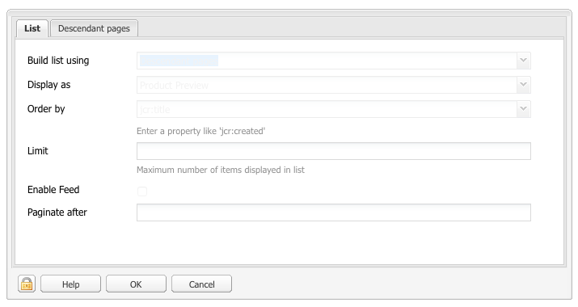

# Modifica del contenuto di una pagina{#editing-page-content}

Una volta creata la pagina (nuova o come parte di un lancio o una live copy) è possibile aggiornarla modificandone i contenuti.

Per aggiungere i contenuti si trascinano sulla pagina specifici [componenti](/help/sites-classic-ui-authoring/classic-page-author-default-components.md), in base al tipo di contenuto, che possono quindi essere modificati, spostati o eliminati.

>[!NOTE]
>
>Il tuo account ha bisogno di [diritti di accesso appropriati](/help/sites-administering/security.md) e [autorizzazioni](/help/sites-administering/security.md#permissions) per modificare le pagine, ad esempio aggiungendo, modificando o eliminando componenti, annotando o sbloccando.
>
>Nell’eventualità di problemi, rivolgiti al tuo amministratore di sistema.

## Sidekick {#sidekick}

La barra laterale è uno strumento chiave per la creazione delle pagine. Varia quando si crea una pagina, in modo che sia sempre visibile.

Sono disponibili diverse schede e icone, tra cui:

* Componenti
* Pagina
* Informazioni
* Controllo delle versioni
* Flusso di lavoro
* Modalità
* Scaffolding
* ClientContext
* Siti Web

Questi forniscono accesso a un’ampia selezione di funzionalità, tra cui:

* [selezione dei componenti](/help/sites-classic-ui-authoring/classic-page-author-env-tools.md#sidekick)
* [visualizzazione dei riferimenti](/help/sites-classic-ui-authoring/classic-page-author-env-tools.md#showing-references)
* [accesso al registro di controllo](/help/sites-classic-ui-authoring/classic-page-author-env-tools.md#audit-log)
* [modalità di commutazione](/help/sites-classic-ui-authoring/classic-page-author-env-tools.md#page-modes)
* [creazione](/help/sites-classic-ui-authoring/classic-page-author-work-with-versions.md#creating-a-new-version), [ripristino](/help/sites-classic-ui-authoring/classic-page-author-work-with-versions.md#restoring-a-page-version-from-sidekick) e [confronto](/help/sites-classic-ui-authoring/classic-page-author-work-with-versions.md#comparing-with-a-previous-version) versioni

* [pubblicazione](/help/sites-classic-ui-authoring/classic-page-author-publish-pages.md#publishing-a-page), [annullamento della pubblicazione](/help/sites-classic-ui-authoring/classic-page-author-publish-pages.md#unpublishing-a-page) una pagina

* [modifica delle proprietà di pagina](/help/sites-classic-ui-authoring/classic-page-author-edit-page-properties.md)

* [scaffolding](/help/sites-authoring/scaffolding.md)

* [contesto client](/help/sites-administering/client-context.md)

## Inserimento di un componente {#inserting-a-component}

### Inserimento di un componente {#inserting-a-component-1}

Dopo aver aperto la pagina, puoi iniziare ad aggiungere contenuti. A tale scopo, aggiungi dei componenti (denominati anche paragrafi).

Per inserire un nuovo componente:

1. Esistono diversi metodi per selezionare il tipo di paragrafo che si desidera inserire:

   * Fare doppio clic sull&#39;area etichettata **Trascina qui i componenti o le risorse...** - il **Inserisci nuovo componente** viene visualizzata la barra degli strumenti. Seleziona un componente e fai clic su **OK**.

   * Trascina un componente dalla barra degli strumenti mobile (barra laterale) per inserire un nuovo paragrafo.
   * Fare clic con il pulsante destro del mouse su un paragrafo esistente e selezionare **Nuovo...** - Viene visualizzata la barra degli strumenti Inserisci nuovo componente. Seleziona un componente e fai clic su **OK**.

   

1. Sia nella barra laterale che nella **Inserisci nuovo componente** sulla barra degli strumenti viene visualizzato un elenco dei componenti disponibili (tipi di paragrafo). Possono essere suddivise in varie sezioni (ad esempio Generale, Colonne e così via), che possono essere espanse in base alle esigenze.

   A seconda dell’ambiente di produzione, queste scelte possono essere diverse. Per informazioni complete sui componenti, vedi [Componenti predefiniti](/help/sites-classic-ui-authoring/classic-page-author-default-components.md).

1. Inserire il componente desiderato nella pagina. Fai doppio clic sul paragrafo per aprire una finestra che consente di configurare il paragrafo e aggiungere contenuto.

### Inserimento di un componente tramite Content Finder {#inserting-a-component-using-the-content-finder}

Puoi anche aggiungere un nuovo componente alla pagina trascinando una risorsa dal menu [Content Finder](/help/sites-classic-ui-authoring/classic-page-author-env-tools.md#the-content-finder). In questo modo viene creato automaticamente un componente del tipo appropriato contenente la risorsa.

Questa opzione è valida per i seguenti tipi di risorse (alcune dipenderanno dal sistema pagina/paragrafo):

| Tipo risorsa | Tipo di componente risultante |
|---|---|
| Immagine | Immagine |
| Documento | Scarica |
| Prodotto | Prodotto |
| Video | Flash |

>[!NOTE]
>
>Puoi configurare questo comportamento per l’installazione in uso. Consulta [Configurazione di un sistema di paragrafi in modo che il trascinamento di una risorsa crei un’istanza di componente](/help/sites-developing/developing-components.md#configuring-a-paragraph-system-so-that-dragging-an-asset-creates-a-component-instance) per ulteriori dettagli.

Per creare un componente trascinando uno dei tipi di risorsa indicati sopra:

1. Assicurati che la pagina sia in [**modalità Modifica**.](/help/sites-classic-ui-authoring/classic-page-author-env-tools.md#page-modes)
1. Apri [Content Finder](/help/sites-classic-ui-authoring/classic-page-author-env-tools.md#the-content-finder).
1. Trascina la risorsa richiesta nella posizione desiderata. Il [segnaposto componente](#componentplaceholder) mostra dove verrà posizionato il componente.

   Nella posizione richiesta verrà creato un componente appropriato per il tipo di risorsa, che conterrà la risorsa selezionata.

1. [Modifica](#editmovecopypastedelete) il componente, se necessario.

## Modifica di un componente (contenuto e proprietà) {#editing-a-component-content-and-properties}

Per modificare un paragrafo esistente, effettuate una delle seguenti operazioni:

* **Doppio clic** il paragrafo per aprirlo. Viene visualizzata la stessa finestra visualizzata quando hai creato il paragrafo con il contenuto esistente. Apporta le modifiche e fai clic su **OK**.

* **Clic con il pulsante destro** il paragrafo e fai clic su **Modifica**.

* **Clic** due volte sul paragrafo (un doppio clic lento) per accedere alla modalità di modifica diretta. Potrai modificare direttamente il testo sulla pagina, anziché all’interno di una finestra di dialogo. In questa modalità, ti verrà fornita una barra degli strumenti nella parte superiore della pagina. Apporta le modifiche e verranno salvate automaticamente.

## Spostamento di un componente {#moving-a-component}

Per spostare un paragrafo:

>[!NOTE]
>
>Per spostare un componente puoi anche utilizzare [Taglia e Incolla](#cut-copy-paste-a-component).

1. Selezionare il paragrafo da spostare:

   

1. Trascina il paragrafo nella nuova posizione: AEM indica dove è possibile spostare il paragrafo con un segno di spunta verde. Rilascialo nella posizione desiderata.
1. Il paragrafo è stato spostato:

   

## Eliminazione di un componente {#deleting-a-component}

Per eliminare un paragrafo:

1. Seleziona il paragrafo e **clic con il pulsante destro del mouse**:

   

1. Seleziona **Elimina** dal menu. WCM AEM richiede di confermare l’eliminazione del paragrafo, poiché questa azione non può essere annullata.
1. Fai clic su **OK**.

>[!NOTE]
>
>Se hai impostato [Proprietà utente per visualizzare la barra degli strumenti Modifica globale](/help/sites-classic-ui-authoring/author-env-user-props.md) è inoltre possibile eseguire determinate azioni sui paragrafi utilizzando **Copia**, **Taglia**, **Incolla**, **Elimina** pulsanti disponibili.
>
>Varie [scelte rapide da tastiera](/help/sites-classic-ui-authoring/classic-page-author-keyboard-shortcuts.md) sono inoltre disponibili.

## Tagliare, copiare e incollare un componente {#cut-copy-paste-a-component}

Come quando [Eliminazione di un componente](#deleting-a-component) è possibile utilizzare il menu di scelta rapida per copiare, tagliare e/o incollare un componente

>[!NOTE]
>
>Se hai impostato [Proprietà utente per visualizzare la barra degli strumenti Modifica globale](/help/sites-classic-ui-authoring/author-env-user-props.md) è inoltre possibile eseguire determinate azioni sui paragrafi utilizzando **Copia**, **Taglia**, **Incolla**, **Elimina** pulsanti disponibili.
>
>Varie [scelte rapide da tastiera](/help/sites-classic-ui-authoring/classic-page-author-keyboard-shortcuts.md) sono inoltre disponibili.

>[!NOTE]
>
>Il taglio, la copia e l’incollamento del contenuto sono supportati solo all’interno della stessa pagina.

## Componenti ereditati {#inherited-components}

I componenti ereditati possono essere il risultato di vari scenari, tra cui:

* [Gestione multisito](/help/sites-administering/msm.md); anche in combinazione con [scaffolding](/help/sites-classic-ui-authoring/classic-feature-scaffolding.md#scaffolding-with-msm-inheritance).

* [Lanci](/help/sites-classic-ui-authoring/classic-launches.md) (se basato su Live Copy).
* Componenti specifici, ad esempio il sistema paragrafo ereditato all&#39;interno di Geometrixx.

È possibile annullare l’ereditarietà, quindi riabilitarla. A seconda del componente, questo può essere disponibile da:

1. **Live Copy**

   Se un componente fa parte di una Live Copy o di un lancio, viene indicato da un’icona a forma di lucchetto. Puoi fare clic sul lucchetto per annullare l’ereditarietà.

   * L’icona del lucchetto viene visualizzata quando il componente è selezionato, ad esempio:

   

   * Il lucchetto viene visualizzato anche nella finestra di dialogo dei componenti; ad esempio:

   

1. **Un sistema di paragrafi ereditato**

   La finestra di dialogo di configurazione. Ad esempio, come con il sistema paragrafo ereditato all’interno di Geometrixx:

   

## Aggiunta di annotazioni {#adding-annotations}

[Annotazioni](/help/sites-classic-ui-authoring/classic-page-author-annotations.md) consenti ad altri autori di fornire feedback sui contenuti. Questo viene spesso utilizzato a scopo di revisione e convalida.

## Anteprima delle pagine {#previewing-pages}

Il bordo inferiore della barra laterale contiene due icone importanti per l&#39;anteprima delle pagine:

* L’icona a forma di matita mostra che al momento sei in modalità di modifica e puoi aggiungere, modificare, spostare o eliminare contenuti.

  

* L’icona della lente di ingrandimento consente di selezionare la modalità di anteprima in cui verrà visualizzata la pagina, così come verrà visualizzata nell’ambiente di pubblicazione (a volte è necessario anche un aggiornamento della pagina):

  

  In modalità anteprima la barra laterale viene ridotta, fai clic sull’icona freccia giù per tornare alla modalità di modifica:

  

## Trova e sostituisci {#find-replace}

Per modifiche su larga scala della stessa frase, **[Trova e sostituisci](/help/sites-classic-ui-authoring/author-env-search.md#find-and-replace)** opzione di menu consente di cercare e sostituire più istanze di una stringa, all’interno di una sezione del sito web.

## Blocco di una pagina   {#locking-a-page}

AEM consente di bloccare una pagina in modo che nessun altro possa modificarne il contenuto. Questa funzione è utile quando si apportano numerose modifiche a una pagina specifica o quando è necessario bloccarla per un breve periodo di tempo.

>[!CAUTION]
>
>Il blocco di una pagina deve essere utilizzato con cautela, in quanto l’unica persona in grado di sbloccarla è la persona che l’ha bloccata (o un account con privilegi di amministratore).

Per bloccare una pagina:

1. In **Siti Web** , selezionare la pagina da bloccare.
1. Fare doppio clic sulla pagina per aprirla per la modifica.
1. In **Pagina** scheda della barra laterale, seleziona **Blocca pagina**:

   

   Un messaggio mostra che la pagina è bloccata per altri utenti. Inoltre, nel riquadro a destra della sezione **Siti Web** , WCM per AEM visualizza la pagina come bloccata e indica quale utente ha bloccato la pagina.

   

## Sblocco di una pagina {#unlocking-a-page}

Per sbloccare una pagina:

1. In **Siti Web** , selezionare la pagina da sbloccare.
1. Fare doppio clic sulla pagina per aprirla.
1. In **Pagina** scheda della barra laterale, seleziona **Sblocca pagina**.

## Annullamento e ripristino di operazioni di modifica delle pagine {#undoing-and-redoing-page-edits}

Utilizza le seguenti scelte rapide da tastiera quando il frame del contenuto della pagina è attivo:

* Annulla: Ctrl+Z (Windows) o Comando+Z (Mac)
* Ripeti: Ctrl+Y (Windows) o Comando+Y (Mac)

Quando annullate o ripristinate la rimozione, l&#39;aggiunta o il trasferimento di uno o più paragrafi, il lampeggiamento (comportamento predefinito) evidenzia i paragrafi interessati.

>[!NOTE]
>
>Per informazioni sulle possibilità di annullare e ripristinare le modifiche apportate a una pagina, consulta [Annullamento e ripristino di operazioni di modifica delle pagine - La teoria](#undoing-and-redoing-page-edits-the-theory).

## Annullamento e ripristino di operazioni di modifica delle pagine - La teoria {#undoing-and-redoing-page-edits-the-theory}

>[!NOTE]
>
>L&#39;amministratore di sistema può [configurare vari aspetti delle funzioni Annulla/Ripristina](/help/sites-administering/config-undo.md) in base ai requisiti della tua istanza.

AEM memorizza una cronologia delle azioni eseguite e la sequenza in cui sono state eseguite. In questo modo, si annullano diverse azioni nell&#39;ordine in cui sono state eseguite. Quindi, potete utilizzare l&#39;opzione Ripristina (Redo) per riapplicare una o più azioni.

Se è selezionato un elemento nella pagina del contenuto, il comando Annulla e Ripristina si applica all’elemento selezionato, ad esempio a un componente testo.

Il comportamento dei comandi Annulla e Ripristina è simile a quello di altri programmi software. Utilizza i comandi per ripristinare lo stato recente della pagina web mentre prendi decisioni sul contenuto. Se ad esempio si sposta un paragrafo di testo altrove nella pagina, è possibile ricorrere al comando Annulla per riportarlo nella posizione originale. Se successivamente si decide di spostare nuovamente il paragrafo, utilizzare il comando Ripristina.

>[!NOTE]
>
>Operazioni disponibili:
>
>* ripristinare le azioni se non è stata apportata alcuna modifica alla pagina da quando è stato utilizzato il comando annulla.
>* annulla un massimo di 20 azioni di modifica (impostazione predefinita).
>* utilizza anche [Scelte rapide da tastiera](/help/sites-classic-ui-authoring/classic-page-author-keyboard-shortcuts.md) per annullare e ripetere.
>

I comandi Annulla e Ripristina possono essere utilizzati solo per i tipi di modifiche della pagina seguenti:

* Aggiunta, modifica, rimozione e spostamento di paragrafi
* Modifica locale del contenuto dei paragrafi
* Operazioni Copia, Taglia e Incolla per elementi all’interno di una pagina
* Copiare, tagliare e incollare elementi su più pagine
* Aggiunta, rimozione e modifica di file e immagini
* Aggiunta, rimozione e modifica di annotazioni e sketch
* Modifiche allo scaffold
* Aggiunta e rimozione di riferimenti
* Modifica dei valori delle proprietà nelle finestre di dialogo dei componenti.

I campi modulo di cui viene eseguito il rendering dei componenti modulo non devono avere valori specificati durante l’authoring delle pagine. Pertanto, i comandi Annulla e Ripristina non influiscono sulle modifiche apportate ai valori di questi tipi di componenti. Ad esempio, non è possibile annullare la selezione di un valore in un elenco a discesa.

>[!NOTE]
>
>Per annullare e ripristinare le modifiche apportate a file e immagini sono necessarie autorizzazioni speciali. Inoltre, la cronologia delle operazioni di annullamento per le modifiche apportate a file e immagini dura per un minimo di ore. Oltre tale limite, la possibilità di annullare le modifiche non è garantita. L’amministratore può fornire le autorizzazioni e modificare il tempo predefinito di dieci ore.
