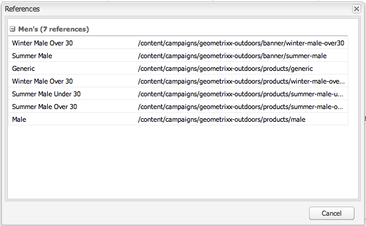

# Authoring: ambiente e strumenti {#authoring-the-environment-and-tools}

L’ambiente di authoring di AEM offre diversi metodi per organizzare e modificare i contenuti. Gli strumenti forniti sono accessibili dalle varie console ed editor di pagina.

## Amministrazione sito {#site-administration}

La console **Siti Web** consente di gestire e navigare nel sito Web. Utilizzando i due riquadri è possibile espandere la struttura del sito web e intraprendere azioni sull’elemento richiesto:

## Modifica del contenuto delle pagine {#editing-your-page-content}

È disponibile un editor di pagine separato con l’interfaccia utente classica, che utilizza Content Finder e la barra laterale:

`https://localhost:4502/cf#/content/geometrixx/en/products/triangle.html`

## Accedere all’Aiuto   {#accessing-help}

È possibile accedere direttamente a diverse risorse **Help** dall&#39;interno di AEM:

Oltre ad accedere alla [guida dalle barre degli strumenti della console](/help/sites-classic-ui-authoring/author-env-basic-handling.md#accessing-help), è possibile accedere alla guida dalla barra laterale (utilizzando ? ) durante la modifica di una pagina:

Oppure utilizzando il pulsante **Guida** nella finestra di dialogo per modifica di componenti specifici; in questo modo verrà visualizzata la Guida sensibile al contesto.

## Sidekick {#sidekick}

La scheda **Componenti** della barra laterale consente di sfogliare i componenti disponibili per l&#39;aggiunta alla pagina corrente. Il gruppo richiesto può essere espanso, quindi un componente può essere trascinato nella posizione desiderata sulla pagina.

## Content Finder {#the-content-finder}

Content Finder è un modo rapido e semplice per trovare risorse e/o contenuti all’interno dell’archivio durante la modifica di una pagina.

Puoi utilizzare Content Finder per individuare una serie di risorse. Se necessario, puoi trascinare un elemento in un paragrafo della pagina:

* [Immagini](#finding-images)
* [Documenti](#finding-documents)
* [Filmati](#finding-movies)
* [Browser Dynamic Medie](/help/sites-administering/scene7.md#scene7contentbrowser)
* [Pagine](#finding-pages)

* [Paragrafi](#referencing-paragraphs-from-other-pages)
* [Prodotti](#products)
* Oppure per [esplorare il sito Web in base alla struttura dell&#39;archivio](#the-content-finder)

Con tutte le opzioni puoi [cercare elementi specifici](#the-content-finder).

### Ricerca di immagini {#finding-images}

Questa scheda elenca tutte le immagini presenti nell’archivio.

Dopo aver creato un paragrafo Immagine sulla pagina, puoi trascinare un elemento nel paragrafo.

### Ricerca di documenti {#finding-documents}

Questa scheda elenca tutti i documenti del repository.

Dopo aver creato un paragrafo Scarica sulla pagina, puoi trascinare un elemento nel paragrafo.

### Ricerca di filmati {#finding-movies}

Questa scheda elenca tutti i filmati (ad esempio gli elementi di Flash) presenti nel repository.

Dopo aver creato un paragrafo appropriato, ad esempio Flash, nella pagina, è possibile trascinare un elemento e rilasciarlo nel paragrafo.

### Prodotti {#products}

Questa scheda elenca tutti i prodotti. Dopo aver creato un paragrafo appropriato (ad esempio, Prodotto) sulla pagina, puoi trascinare un elemento e rilasciarlo nel paragrafo.

### Ricerca di pagine {#finding-pages}

Questa scheda mostra tutte le pagine. Fare doppio clic su una pagina per aprirla per la modifica.

### Riferimento a paragrafi da altre pagine {#referencing-paragraphs-from-other-pages}

Questa scheda consente di cercare un’altra pagina. Verranno elencati tutti i paragrafi di quella pagina. È quindi possibile trascinare un paragrafo nella pagina corrente per creare un riferimento al paragrafo originale.

### Utilizzo della vista Archivio completo {#using-the-full-repository-view}

Questa scheda mostra tutte le risorse nell’archivio.

### Utilizzo della funzione Ricerca con il browser Contenuti {#using-search-with-the-content-browser}

In tutte le opzioni è possibile cercare elementi specifici. Vengono elencati tutti i tag e le risorse corrispondenti al modello di ricerca:

È inoltre possibile utilizzare i caratteri jolly per la ricerca. I caratteri jolly supportati sono:

* `*`
corrisponde a una sequenza di zero o più caratteri.

* `?`
corrisponde a un singolo carattere.

>[!NOTE]
>
>Esiste una pseudo proprietà &quot;name&quot; che deve essere utilizzata per eseguire una ricerca con caratteri jolly.

Ad esempio, se è disponibile un’immagine denominata:

`ad-nmvtis.jpg`

i seguenti modelli di ricerca lo troveranno (e qualsiasi altra immagine che corrisponde al modello):

* `name:*nmv*`
* `name:AD*`
la corrispondenza dei caratteri è *non* con distinzione tra maiuscole e minuscole.

* `name:ad?nm??is.*`
in una query è possibile utilizzare un numero qualsiasi di caratteri jolly.

>[!NOTE]
>
>È inoltre possibile utilizzare la ricerca [SQL2](https://helpx.adobe.com/experience-manager/6-5/sites/developing/using/reference-materials/javadoc/org/apache/jackrabbit/commons/query/sql2/package-summary.html).

## Visualizzazione dei riferimenti {#showing-references}

L’AEM consente di visualizzare le pagine collegate alla pagina su cui stai lavorando.

Per visualizzare i riferimenti diretti alle pagine:

1. Nella barra laterale, seleziona l&#39;icona della scheda **Pagina**.

   

1. Seleziona **Mostra riferimenti...** L&#39;AEM apre la finestra Riferimenti e visualizza le pagine che si riferiscono alla pagina selezionata, inclusi i relativi percorsi.

   

In alcune situazioni sono disponibili ulteriori azioni da parte del Sidekick, tra cui:

* [Lanci](/help/sites-classic-ui-authoring/classic-launches.md)
* [Live Copy](/help/sites-administering/msm.md)

* [Blueprint](/help/sites-administering/msm-best-practices.md)

Altre [relazioni tra pagine sono visibili nella console Siti Web](/help/sites-classic-ui-authoring/author-env-basic-handling.md#page-information-on-the-websites-console).

## Registro di controllo {#audit-log}

È possibile accedere al **Registro di controllo** dalla scheda **Informazioni** della barra laterale. Elenca le azioni recenti eseguite nella pagina corrente, ad esempio:

## Informazioni sulle pagine {#page-information}

La console del sito Web [fornisce inoltre informazioni sullo stato corrente della pagina](/help/sites-classic-ui-authoring/author-env-basic-handling.md#page-information-on-the-websites-console), ad esempio pubblicazione, modifica, blocco, Live Copy e così via.

## Modalità pagina   {#page-modes}

Durante la modifica di una pagina con l’interfaccia utente classica, è possibile accedere a diverse modalità utilizzando le icone nella parte inferiore della barra laterale:

La riga di icone nella parte inferiore del Sidekick consente di cambiare modalità per l&#39;utilizzo delle pagine:

* [Modifica](/help/sites-classic-ui-authoring/classic-page-author-edit-mode.md)
Questa è la modalità predefinita e consente di modificare la pagina, aggiungere o eliminare componenti ed effettuare altre modifiche.

* [Anteprima](/help/sites-classic-ui-authoring/classic-page-author-edit-content.md#previewing-pages)
Questa modalità ti consente di visualizzare in anteprima la pagina come se fosse visualizzata sul sito web nella sua forma finale.

* [Progettazione](/help/sites-classic-ui-authoring/classic-page-author-design-mode.md#main-pars-procedure-0)
In questa modalità, puoi modificare la progettazione della pagina configurando i componenti accessibili.

>[!NOTE]
>
>Sono inoltre disponibili altre opzioni:
>
>* [Scaffolding](/help/sites-classic-ui-authoring/classic-feature-scaffolding.md)
>* [ClientContext](/help/sites-administering/client-context.md)
>* Siti Web: apre la console Siti Web.
>* Ricarica: aggiorna la pagina.

## Scelte rapide da tastiera {#keyboard-shortcuts}

Sono disponibili alcune [scelte rapide da tastiera](/help/sites-classic-ui-authoring/classic-page-author-keyboard-shortcuts.md).
