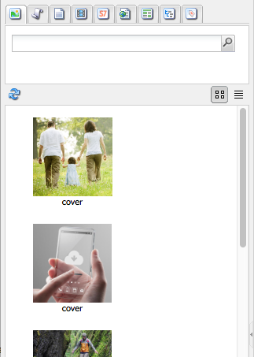

# Ambiente e strumenti di authoring {#authoring-the-environment-and-tools}

L’ambiente di authoring di AEM offre diversi metodi per organizzare e modificare i contenuti. Gli strumenti disponibili sono accessibili da varie console ed editor di pagina.

## Amministrazione del sito {#site-administration}

La console **Siti web** permette di gestire il sito web e navigare al suo interno. Puoi utilizzare i due pannelli per espandere la struttura del sito web e intervenire sull’elemento necessario:

## Modifica del contenuto delle pagine {#editing-your-page-content}

Nell’interfaccia classica è disponibile un editor di pagina con Content Finder e barra laterale:

`https://localhost:4502/cf#/content/geometrixx/en/products/triangle.html`

## Accedere all’Aiuto   {#accessing-help}

Dall’interno di AEM è possibile accedere direttamente a diverse risorse di **Aiuto**:

È possibile accedere all’[Aiuto dalle barre degli strumenti delle console](/help/sites-classic-ui-authoring/author-env-basic-handling.md#accessing-help) e tramite la barra laterale (mediante l’icona ?) durante la modifica di una pagina:

In alternativa, puoi utilizzare il pulsante **Aiuto** nella finestra di dialogo di modifica dei componenti specifici, che mostrerà le informazioni di aiuto in base al contesto.

## Barra laterale {#sidekick}

La scheda **Componenti** nella barra laterale consente di scorrere i componenti che possono essere aggiunti alla pagina corrente. Puoi espandere il gruppo richiesto, quindi trascinare un componente per portarlo nella posizione richiesta sulla pagina.

## Content Finder {#the-content-finder}

Content Finder è uno strumento semplice e veloce, che consente di trovare risorse e/o contenuti nell’archivio mentre si modifica una pagina.

Puoi utilizzare Content Finder per individuare diversi tipi di risorse. Puoi quindi trascinare un elemento e rilasciarlo in un paragrafo sulla pagina:

* [Immagini](#finding-images)
* [Documenti](#finding-documents)
* [Filmati](#finding-movies)
* [Browser Dynamic Media](/help/sites-administering/scene7.md#scene7contentbrowser)
* [Pagine](#finding-pages)

* [Paragrafi](#referencing-paragraphs-from-other-pages)
* [Prodotti](#products)
* Oppure per [sfogliare il sito web in base alla struttura dell’archivio](#the-content-finder)

Per tutte le opzioni è possibile [cercare elementi specifici](#the-content-finder).

### Ricerca di immagini {#finding-images}

In questa scheda vengono elencate tutte le immagini presenti nella directory archivio.

Dopo aver creato un paragrafo Immagine nella pagina, è possibile trascinarvi un elemento.

### Ricerca di documenti {#finding-documents}

In questa scheda vengono elencati tutti i documenti presenti nella directory archivio.

Dopo aver creato un paragrafo Scarica nella pagina, è possibile trascinarvi un elemento.

### Ricerca dei filmati {#finding-movies}

In questa scheda vengono elencati tutti i filmati (ad esempio, elementi Flash) presenti nella directory archivio.

Dopo aver creato sulla pagina un paragrafo appropriato (ad esempio, Flash), puoi trascinarvi un elemento.

### Prodotti {#products}

In questa scheda vengono elencati tutti i prodotti. Dopo aver creato sulla pagina un paragrafo appropriato (ad esempio, Prodotto), puoi trascinarvi un elemento.

### Ricerca di pagine {#finding-pages}

Questa scheda mostra tutte le pagine. Fai doppio clic su una pagina per aprirla in modalità di modifica.

### Riferimenti a paragrafi da altre pagine {#referencing-paragraphs-from-other-pages}

Questa scheda consente di ricercare un’altra pagina. Vengono elencati tutti i paragrafi presenti nella pagina. È quindi possibile trascinare un paragrafo nella pagina corrente. In questo modo si crea automaticamente un riferimento al paragrafo originale.

### Utilizzo della vista directory archivio {#using-the-full-repository-view}

In questa scheda vengono elencate tutte le risorse presenti nella directory archivio.

### Utilizzo della ricerca nel browser dei contenuti {#using-search-with-the-content-browser}

Per tutte le opzioni puoi cercare specifici elementi. Vengono elencati tutti i tag e le risorse corrispondenti al criterio di ricerca specificato:

Nella ricerca puoi inoltre usare i caratteri jolly. Sono supportati i seguenti caratteri jolly:

* `*`
restituisce una sequenza di zero o più caratteri.

* `?`
restituisce un singolo carattere.

>[!NOTE]
>
>Per eseguire una ricerca con carattere jolly è necessario utilizzare la pseudo-proprietà &quot;nome&quot;.

Ad esempio, se è disponibile un’immagine con il nome:

`ad-nmvtis.jpg`

tale immagine potrà essere rilevata mediante i seguenti pattern di ricerca (così come altre immagini che corrispondono al pattern):

* `name:*nmv*`
* `name:AD*`
La corrispondenza dei caratteri *non* fa distinzione tra maiuscole e minuscole.

* `name:ad?nm??is.*`
in una query è possibile utilizzare qualsiasi numero di caratteri jolly.

>[!NOTE]
>
>È inoltre possibile utilizzare [SQL2](https://helpx.adobe.com/experience-manager/6-5/sites/developing/using/reference-materials/javadoc/org/apache/jackrabbit/commons/query/sql2/package-summary.html) ricerca.

## Visualizzazione di riferimenti {#showing-references}

In AEM è possibile visualizzare le pagine collegate alla pagina su cui si sta lavorando.

Per visualizzare i riferimenti diretti alle pagine:

1. Nella barra laterale seleziona l’icona della scheda **Pagina**.

   

1. Seleziona **Mostra riferimenti...** AEM apre la finestra Riferimenti e visualizza le pagine che fanno riferimento a quella selezionata, complete di percorso.

   

In determinate situazioni sono disponibili ulteriori azioni dalla barra laterale, inclusi:

* [Lanci](/help/sites-classic-ui-authoring/classic-launches.md)
* [Live Copy](/help/sites-administering/msm.md)

* [Blueprint](/help/sites-administering/msm-best-practices.md)

Ulteriori [relazioni tra pagine sono visibili nella console Siti web](/help/sites-classic-ui-authoring/author-env-basic-handling.md#page-information-on-the-websites-console).

## Registro di controllo {#audit-log}

Il **Registro di controllo** è accessibile dalla scheda **Informazioni** della barra laterale. Tale registro include le azioni recenti eseguite nella pagina corrente, ad esempio:

## Informazioni sulle pagine {#page-information}

Anche la console Siti Web [fornisce informazioni sullo stato corrente della pagina](/help/sites-classic-ui-authoring/author-env-basic-handling.md#page-information-on-the-websites-console) come pubblicazione, modifica, blocco, Live Copy, ecc.

## Modalità pagina   {#page-modes}

Quando modificate una pagina nell’interfaccia classica, potete accedere a diverse modalità mediante le icone che si trovano nella parte inferiore della barra laterale:

La serie di icone visualizzata nella parte inferiore della barra laterale consente di cambiare la modalità di utilizzo delle pagine:

* [Modifica](/help/sites-classic-ui-authoring/classic-page-author-edit-mode.md) È la modalità predefinita. Consente di modificare la pagina, aggiungere o eliminare componenti e apportare altri cambiamenti.

* [Anteprima](/help/sites-classic-ui-authoring/classic-page-author-edit-content.md#previewing-pages) Consente di visualizzare un’anteprima della pagina, con l’aspetto definitivo che avrà nel sito web.

* [Progettazione](/help/sites-classic-ui-authoring/classic-page-author-design-mode.md#main-pars-procedure-0) Consente di modificare la progettazione della pagina configurando i componenti disponibili.

>[!NOTE]
>
>Sono inoltre disponibili altre opzioni:
>
>* [Scaffolding](/help/sites-classic-ui-authoring/classic-feature-scaffolding.md)
>* [ClientContext](/help/sites-administering/client-context.md)
>* Siti web, per aprire la console Siti web.
>* Ricarica, per aggiornare la visualizzazione della pagina.

## Scelte rapide da tastiera {#keyboard-shortcuts}

Sono disponibili alcune [scelte rapide da tastiera](/help/sites-classic-ui-authoring/classic-page-author-keyboard-shortcuts.md).
