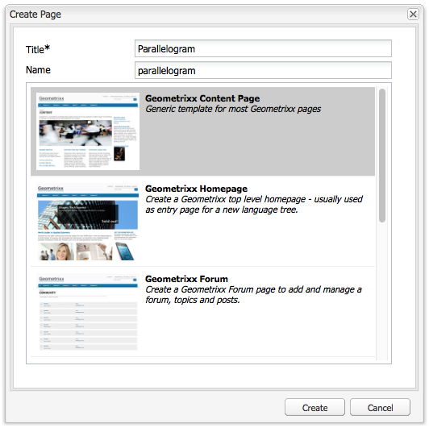
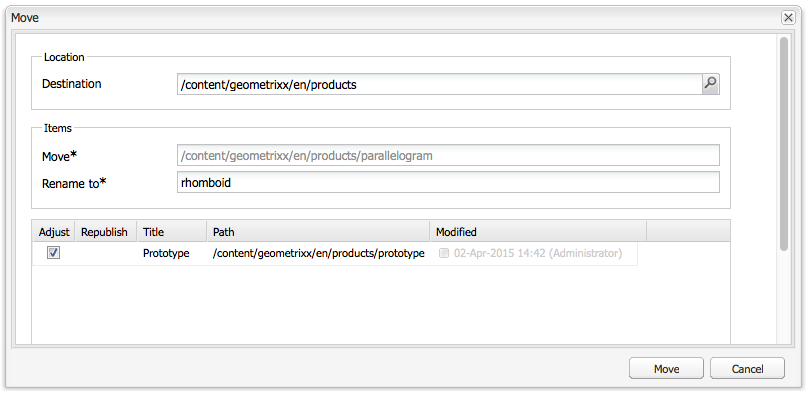

# Creazione e organizzazione delle pagine{#creating-and-organizing-pages}

Questa sezione descrive come creare e gestire le pagine con Adobe Experience Manager (AEM) in modo da poter [creare contenuti](/help/sites-classic-ui-authoring/classic-page-author-edit-content.md) su tali pagine.

>[!NOTE]
>
>Il tuo account ha bisogno di [diritti di accesso appropriati](/help/sites-administering/security.md) e [autorizzazioni](/help/sites-administering/security.md#permissions) per intervenire sulle pagine, ad esempio per creare, copiare, spostare, modificare, eliminare.
>
>Nell’eventualità di problemi, rivolgiti al tuo amministratore di sistema.

## Organizzazione del sito web {#organizing-your-website}

In qualità di autore, dovrai organizzare il tuo sito web all’interno dell’AEM. Ciò comporta la creazione e la denominazione delle pagine di contenuto in modo che:

* si trovano facilmente nell’ambiente di authoring
* i visitatori del sito possono facilmente sfogliarli nell’ambiente di pubblicazione

È inoltre possibile utilizzare le [cartelle](#creating-a-new-folder) per organizzare i contenuti.

La struttura di un sito web può essere considerata come *struttura ad albero* che contiene le pagine di contenuto. I nomi di queste pagine di contenuto vengono utilizzati per formare gli URL, mentre il titolo viene visualizzato quando viene visualizzato il contenuto della pagina.

Di seguito è riportato un estratto dal Geometrixx, in cui, ad esempio, `Triangle` La pagina sarà accessibile:

* Ambiente di authoring

  `http://localhost:4502/cf#/content/geometrixx/en/products/triangle.html`

* Ambiente di pubblicazione

  `http://localhost:4503/content/geometrixx/en/products/triangle.html`

  A seconda della configurazione dell’istanza, utilizza `/content` potrebbe essere facoltativo nell’ambiente di pubblicazione.

```xml
  /content
    /geometrixx
      /en
        /toolbar...
        /products
          /triangle
            /overview
            /features
          /square...
          /circle...
          /...
        /...
      /fr...
      /de...
      /es...
      /...
    /...
```

Questa struttura può essere visualizzata dalla console Siti web, che puoi utilizzare per [spostarsi nella struttura ad albero](/help/sites-classic-ui-authoring/author-env-basic-handling.md#main-pars-text-15).


### Convenzioni di denominazione delle pagine {#page-naming-conventions}

Durante la creazione di una nuova pagina sono disponibili due campi chiave:

* **[Titolo](#title)**:

   * Viene mostrato all’utente nella console ed è disponibile sopra il contenuto della pagina durante la modifica.
   * Questo campo è obbligatorio.

* **[Nome](#name)**:

   * Viene utilizzato per generare l’URI.
   * L’input dell’utente per questo campo è opzionale. Se non viene specificato, il nome deriva dal titolo.

Quando si crea una nuova pagina, l’AEM [convalida il nome della pagina in base alle convenzioni](/help/sites-developing/naming-conventions.md) imposto dall&#39;AEM e dal JCR.

L’implementazione e l’elenco dei caratteri consentiti varia leggermente a seconda dell’interfaccia utente (è più esteso per l’interfaccia touch), ma il minimo consentito è:

* Da &#39;a&#39; a &#39;z&#39;
* Da &#39;A&#39; a &#39;Z&#39;
* Da &#39;0&#39; a &#39;9&#39;
* _ (trattino basso)
* `-` (trattino/segno meno)

Utilizza solo questi caratteri per essere sicuro che siano accettati o utilizzati (per informazioni complete su tutti i caratteri consentiti, consulta [le convenzioni di denominazione](/help/sites-developing/naming-conventions.md)).

#### Titolo {#title}

Se specifichi solo il **titolo** della pagina quando crei una nuova pagina, AEM ne deriva il **nome** [da questa stringa e lo convalida in base alle convenzioni imposte da AEM e JCR. ](/help/sites-developing/naming-conventions.md) In entrambe le interfacce **Titolo** il campo contenente caratteri non validi verrà accettato, ma al nome derivato verranno sostituiti i caratteri non validi. Ad esempio:

| Titolo | Nome derivato |
|---|---|
| Schön | schoen.html |
| SC%&amp;&amp;ast;ç+ | sc---c-.html |

#### Nome {#name}

Se specifichi il **nome** della pagina quando crei una nuova pagina, AEM lo [convalida in base alle convenzioni](/help/sites-developing/naming-conventions.md) imposte da AEM e JCR.

Nell’interfaccia classica **impossibile immettere caratteri non validi** nel **Nome** campo.

>[!NOTE]
>Nell’interfaccia touch **impossibile inviare caratteri non validi** nel **Nome** campo. Quando l’AEM rileva caratteri non validi, il campo viene evidenziato e viene visualizzato un messaggio esplicativo per indicare i caratteri da rimuovere o sostituire.

>[!NOTE]
>
>È consigliabile evitare di utilizzare un codice a due lettere come definito dallo standard ISO-639-1, a meno che non si tratti di una directory principale della lingua.
>
>Consulta [Preparazione del contenuto per la traduzione](/help/sites-administering/tc-prep.md) per ulteriori informazioni.

### Modelli {#templates}

In AEM, un modello specifica un tipo di pagina specifico. Un modello verrà utilizzato come base per qualsiasi nuova pagina creata.

Il modello definisce la struttura di una pagina, incluse un’immagine di miniatura e altre proprietà. Ad esempio, puoi avere modelli separati per pagine di prodotti, sitemap e informazioni di contatto. I modelli sono costituiti da [componenti](#components).

L’AEM viene fornito con diversi modelli preconfigurati. I modelli disponibili dipendono dal singolo sito Web e le informazioni da fornire (al momento della creazione della nuova pagina) dipendono dall’interfaccia utente utilizzata. I campi chiave sono i seguenti:

* **Titolo**
Il titolo visualizzato nella pagina web risultante.

* **Nome**
Utilizzato per la denominazione della pagina.

* **Modello**
Elenco di modelli disponibili per la generazione della nuova pagina.

### Componenti {#components}

I componenti sono gli elementi forniti da AEM che consentono di aggiungere specifici tipi di contenuto. L’AEM viene fornito con una serie di componenti pronti all’uso che offrono funzionalità complete, tra cui:

* Testo
* Immagine
* Presentazione
* Video
* molti altri

Dopo aver creato e aperto una pagina è possibile: [aggiungi contenuto utilizzando i componenti](/help/sites-classic-ui-authoring/classic-page-author-edit-content.md#insertinganewparagraph), disponibile da [barra laterale](/help/sites-classic-ui-authoring/classic-page-author-env-tools.md#sidekick).

## Gestione delle pagine {#managing-pages}

### Creazione di una nuova pagina {#creating-a-new-page}

A meno che non siano state create tutte le pagine in anticipo, prima di poter iniziare a creare il contenuto devi creare una pagina:

1. Dalla sezione **Siti Web** , selezionare il livello in cui si desidera creare una nuova pagina.

   Nell&#39;esempio seguente, si sta creando una pagina sotto il livello **Prodotti** : visualizzato nel riquadro di sinistra; il riquadro di destra mostra le pagine già esistenti al livello in **Prodotti**.

   

1. In **Nuovo...** menu (fare clic sulla freccia accanto a **Nuovo...**), seleziona **Nuova pagina...**. Il **Crea pagina** viene visualizzata la finestra.

   Clic **Nuovo...** funge anche da scelta rapida per **Nuova pagina...** opzione.

1. Il **Crea pagina** consente di:

   * Fornisci un **Titolo**; questo viene visualizzato all’utente.
   * Fornisci un **Nome**; viene utilizzato per generare l’URI. Se non viene specificato, il nome verrà derivato dal titolo.

      * Se si specifica una pagina **Nome** quando si crea una nuova pagina, l’AEM [convalida il nome in base alle convenzioni](/help/sites-developing/naming-conventions.md) imposto dall’AEM e dal JCR.
      * Nell’interfaccia classica **impossibile immettere caratteri non validi** nel **Nome** campo.

   * Fare clic sul modello da utilizzare per creare la nuova pagina.

     Il modello viene utilizzato come base per la nuova pagina, ad esempio per determinare il layout di base di una pagina di contenuto.

   >[!NOTE]
   >
   >Consulta [Convenzioni di denominazione delle pagine](#page-naming-conventions).

   Le informazioni minime necessarie per creare una nuova pagina sono **Titolo** e il modello richiesto.

   

   >[!NOTE]
   >
   >Se desideri utilizzare caratteri Unicode negli URL, imposta l’alias ( `sling:alias`) proprietà ([proprietà pagina](/help/sites-classic-ui-authoring/classic-page-author-edit-page-properties.md)).

1. Clic **Crea** per creare la pagina. Torna a **Siti Web** in cui è possibile visualizzare una voce per la nuova pagina.

   La console fornisce informazioni sulla pagina (ad esempio, quando è stata modificata l’ultima volta e da chi) che viene aggiornata, se necessario.

   >[!NOTE]
   >
   >È inoltre possibile creare una pagina quando si modifica una pagina esistente. Utilizzo di **Crea pagina figlio **da **Pagina** della barra laterale, creerà una nuova pagina direttamente sotto la pagina in fase di modifica.

### Apertura di una pagina per la modifica {#opening-a-page-for-editing}

Puoi aprire la pagina in modo che [modificato](/help/sites-classic-ui-authoring/classic-page-author-edit-content.md#editing-a-component-content-and-properties) mediante uno dei metodi seguenti:

* Da **Siti Web** console, è possibile **fare doppio clic** la voce della pagina per aprirla per la modifica.

* Da **Siti Web** console, è possibile **clic con il pulsante destro del mouse** (menu di scelta rapida) l’elemento pagina, quindi seleziona **Apri** dal menu.

* Dopo aver aperto una pagina, è possibile passare ad altre pagine del sito (per modificarle) facendo clic sui collegamenti ipertestuali.

### Copiare e incollare una pagina    {#copying-and-pasting-a-page}

Durante la copia, puoi copiare:

* una singola pagina
* una pagina con tutte le relative pagine secondarie

1. Dalla sezione **Siti Web** , seleziona la pagina da copiare.

   >[!NOTE]
   >
   >In questa fase, è irrilevante se si desidera copiare una singola pagina o le relative sottopagine.

1. Clic **Copia**.

1. Passa alla nuova posizione e fai clic su:

   * **Incolla** - per incollare la pagina insieme a tutte le pagine secondarie
   * **Maiusc + Incolla** - per incollare solo la pagina selezionata

   Le pagine vengono incollate nella nuova posizione.

   >[!NOTE]
   >
   >Il nome della pagina può essere regolato automaticamente se una pagina esistente ha già lo stesso nome.

   >[!NOTE]
   >
   >Puoi anche utilizzare **Copia pagina** dal **Pagina** della barra laterale. Viene aperta una finestra di dialogo in cui puoi specificare la destinazione e così via.

### Spostamento o ridenominazione di una pagina {#moving-or-renaming-page}

>[!NOTE]
>
>La ridenominazione di una pagina è inoltre soggetta [Convenzioni di denominazione delle pagine](#page-naming-conventions) quando si specifica il nuovo nome della pagina.

La procedura per spostare o rinominare una pagina è la stessa. Con la stessa azione puoi:

* spostare una pagina in una nuova posizione
* rinominare una pagina nella stessa posizione
* spostare una pagina in una nuova posizione e rinominarla contemporaneamente

AEM offre la funzionalità di aggiornamento dei collegamenti interni alla pagina rinominata o spostata. Questa operazione può essere eseguita pagina per pagina per fornire la massima flessibilità.

Per spostare o rinominare una pagina:

1. Esistono diversi metodi per attivare uno spostamento:

   * Dalla sezione **Siti Web** , fai clic su per selezionare la pagina, quindi seleziona **Sposta...**
   * Dalla sezione **Siti Web** , puoi anche selezionare l&#39;elemento della pagina, quindi **clic con il pulsante destro del mouse** e seleziona **Sposta...**
   * Quando modifichi una pagina puoi selezionare **Sposta pagina** dal **Pagina** della barra laterale.

1. Il **Sposta** viene visualizzata una finestra in cui è possibile specificare una nuova posizione, un nuovo nome per la pagina o entrambi.

   

   Nella pagina sono inoltre elencate le pagine che fanno riferimento alla pagina spostata. A seconda dello stato della pagina di riferimento, è possibile regolare tali collegamenti e/o ripubblicare le pagine.

1. Compila i campi seguenti, a seconda dei casi:

   * **Destinazione**

     Utilizza la mappa del sito (disponibile tramite il selettore a discesa) per selezionare il percorso in cui spostare la pagina.

     Se rinomini solo la pagina, ignora questo campo.

   * **Sposta**

     Specifica la pagina da spostare: in genere viene compilata per impostazione predefinita, a seconda di come e dove hai avviato l’azione di spostamento.

   * **Rinomina in**

     L&#39;etichetta della pagina corrente viene visualizzata per impostazione predefinita. Se necessario, specifica la nuova etichetta della pagina.

   * **Regola**

     Aggiorna i collegamenti nella pagina elencata che puntano alla pagina spostata: ad esempio, se la pagina A contiene collegamenti alla pagina B, in caso di spostamento della pagina B l’AEM regola i collegamenti nella pagina A.

     Può essere selezionato/deselezionato per ogni singola pagina di riferimento.

   * **Ripubblica**

     Ripubblica la pagina di riferimento; anche in questo caso è possibile selezionarla per ogni singola pagina.

   >[!NOTE]
   >
   >Se la pagina è già stata attivata, lo spostamento la disattiverà automaticamente. Per impostazione predefinita, viene riattivato al termine dello spostamento, ma questo comportamento può essere modificato deselezionando la **Ripubblica** campo per la pagina in **Sposta** finestra.

1. Clic **Sposta**. Sarà necessaria la conferma. Clic **OK** per confermare.

   >[!NOTE]
   >
   >Il titolo della pagina non verrà aggiornato.

### Eliminazione di una pagina {#deleting-a-page}

1. Puoi eliminare una pagina da varie posizioni:

   * All&#39;interno del **Siti Web** , fai clic su per selezionare la pagina, quindi fai clic con il pulsante destro del mouse e seleziona **Elimina** dal menu risultante.
   * All&#39;interno del **Siti Web** , fai clic su per selezionare la pagina, quindi seleziona **Elimina** dal menu della barra degli strumenti.
   * All’interno della barra laterale utilizza **Pagina** scheda per selezionare **Elimina pagina** : questa operazione elimina la pagina attualmente aperta.

1. Dopo aver selezionato di eliminare una pagina, è necessario confermare la richiesta, in quanto l’azione non può essere annullata.

   >[!NOTE]
   >
   >Dopo l’eliminazione, se la pagina è stata pubblicata è possibile ripristinare la versione più recente (o specifica), ma questo potrebbe non avere esattamente lo stesso contenuto dell’ultima versione se sono state apportate ulteriori modifiche. Consulta [Come Ripristinare Le Pagine](/help/sites-classic-ui-authoring/classic-page-author-work-with-versions.md#restoringpages) per ulteriori dettagli.

>[!NOTE]
>
>Se una pagina è già attivata, verrà automaticamente disattivata prima dell’eliminazione.

### Blocco di una pagina   {#locking-a-page}

È possibile [bloccare/sbloccare una pagina](/help/sites-classic-ui-authoring/classic-page-author-edit-content.md#locking-a-page) da una console o quando si modifica una singola pagina. L’indicazione relativa al fatto che una pagina sia bloccata o meno è visualizzata in entrambe le posizioni.

### Creazione di una nuova cartella {#creating-a-new-folder}

>[!NOTE]
>
>Le cartelle sono inoltre soggette ai [Convenzioni di denominazione delle pagine](#page-naming-conventions) quando si specifica il nome della nuova cartella.

1. Apri **Siti Web** e passare alla posizione desiderata.
1. In **Nuovo...** menu (fare clic sulla freccia accanto a **Nuovo...**), seleziona **Nuova cartella...**.
1. Il **Crea cartella** viene aperta una finestra di dialogo. Nella finestra puoi immettere il **Nome** e il **Titolo**:

   

1. Seleziona **Crea** per creare la nuova cartella.
