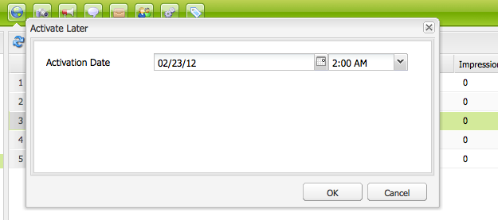

# Pubblicazione delle pagine{#publishing-pages}

Dopo aver creato e rivisto i contenuti nell’ambiente di authoring, li rende disponibili sul sito web pubblico (l’ambiente di pubblicazione).

Questa operazione è denominata pubblicazione della pagina. Quando si rimuove una pagina dall’ambiente di pubblicazione, si parla di annullamento della pubblicazione. Durante la pubblicazione e l’annullamento della pubblicazione la pagina rimane disponibile nell’ambiente di authoring per ulteriori modifiche fino a quando non la elimini.

Puoi anche pubblicare/annullare la pubblicazione di una pagina immediatamente o in una data/ora futura predefinita.

>[!NOTE]
>
>Alcuni termini relativi alla pubblicazione possono essere confusi:
>
>* **Pubblicare/Annullare la pubblicazione**
>  Termini principali per le azioni che consentono di rendere o meno i contenuti disponibili al pubblico nell’ambiente di pubblicazione.
>
>* **Attivare/Disattivare**
>  Sinonimi di pubblicare/annullare la pubblicazione.
>
>* **Replicare/Replica**
>  Questi sono i termini tecnici che descrivono lo spostamento di dati (ad esempio contenuto di una pagina, file, codice e commenti degli utenti) da un ambiente all’altro, ad esempio durante la pubblicazione o la replica inversa di commenti degli utenti.
>

>[!NOTE]
>
>Se non disponi dei privilegi necessari per la pubblicazione di una pagina specifica:
>
>* Verrà attivato un flusso di lavoro per notificare alla persona appropriata la richiesta di pubblicazione.
>* Verrà visualizzato un messaggio (per un breve periodo di tempo) per informarti di questo problema.
>

## Pubblicazione di una pagina {#publishing-a-page}

Esistono due metodi per attivare una pagina:

* [dalla console Siti Web](#activating-a-page-from-the-websites-console)
* [dalla barra laterale sulla pagina stessa](#activating-a-page-from-sidekick)

>[!NOTE]
>
>Puoi anche attivare una sottostruttura di più pagine utilizzando [Attiva albero](#howtoactivateacompletesectiontreeofyourwebsite) nella console Strumenti.

### Attivazione di una pagina dalla console Siti web {#activating-a-page-from-the-websites-console}

È possibile attivare le pagine nella console Siti Web. Dopo aver aperto una pagina e averne modificato il contenuto, si torna alla console Siti Web:

1. Nella console Siti Web selezionare la pagina da attivare.
1. Seleziona **Attiva**, dal menu principale o dal menu a discesa sulla voce di pagina selezionata.

   Per attivare il contenuto della pagina e di tutte le relative sottopagine, utilizza [**Strumenti** console](/help/sites-classic-ui-authoring/classic-page-author-publish-pages.md#howtoactivateacompletesectiontreeofyourwebsite).

   

   >[!NOTE]
   >
   >Se necessario, AEM richiede l’attivazione o la riattivazione di tutte le risorse collegate alla pagina. Puoi selezionare o deselezionare le caselle di controllo per attivare tali risorse.
   >
   >

1. Se necessario, AEM richiede l’attivazione o la riattivazione di tutte le risorse collegate alla pagina. Puoi selezionare o deselezionare le caselle di controllo per attivare tali risorse.

   

1. WCM per AEM attiva il contenuto selezionato. La pagina o le pagine pubblicate vengono visualizzate nel [Console Siti Web](/help/sites-classic-ui-authoring/author-env-basic-handling.md#page-information-on-the-websites-console) (contrassegnato in verde) con informazioni su chi ha attivato il contenuto e la data e l’ora di attivazione.

   

### Attivazione di una pagina da un Sidekick {#activating-a-page-from-sidekick}

Puoi anche attivare una pagina quando è aperta per la modifica.

Dopo aver aperto la pagina e averne modificato il contenuto:

1. Seleziona la **Pagina** nel Sidekick.
1. Clic **Attiva pagina**.
Nella parte superiore destra della finestra viene visualizzato un messaggio che conferma l’attivazione della pagina.

## Annullamento della pubblicazione di una pagina {#unpublishing-a-page}

Per rimuovere una pagina dall’ambiente di pubblicazione, disattivi il contenuto.

Per disattivare una pagina:

1. Nella console Siti Web selezionare la pagina che si desidera disattivare.
1. Seleziona **Disattiva**, dal menu principale o dal menu a discesa sulla voce di pagina selezionata. Ti viene chiesto di confermare l’eliminazione.

   

1. Aggiorna il [Console Siti Web](/help/sites-classic-ui-authoring/author-env-basic-handling.md#page-information-on-the-websites-console) e il contenuto è contrassegnato in rosso, a indicare che non è più pubblicato.

   

## Attiva/Disattiva più tardi {#activate-deactivate-later}

### Attiva più tardi {#activate-later}

Per pianificare l&#39;attivazione per un momento successivo:

1. Nella console Siti Web, vai a **Attiva** e selezionare **Attiva più tardi**.
1. Nella finestra di dialogo visualizzata, fornisci la data e l’ora dell’attivazione e fai clic su **OK**. In questo modo viene creata una versione della pagina che viene attivata al momento specificato.

   

Con l’attivazione in un secondo momento, viene avviato un flusso di lavoro per attivare questa versione della pagina alla data e all’ora specificate. Al contrario, la disattivazione in un secondo momento avvia un flusso di lavoro per disattivare questa versione della pagina in un momento specifico.

Se si desidera annullare questa attivazione/disattivazione, passare alla [Console flusso di lavoro](/help/sites-administering/workflows-administering.md#main-pars_title_3-yjqslz-refd) per terminare il flusso di lavoro corrispondente.

### Disattiva più tardi {#deactivate-later}

Per pianificare la disattivazione per un momento successivo:

1. Nella console Sito Web, vai al **Disattiva** e selezionare **Disattiva più tardi**.

1. Nella finestra di dialogo visualizzata, fornisci la data e l’ora della disattivazione e fai clic su **OK**.

   

**Disattivazione in ritardo** r avvia un flusso di lavoro per disattivare questa versione della pagina in un momento specifico.

Se si desidera annullare questa disattivazione, passare alla [Console flusso di lavoro](/help/sites-administering/workflows-administering.md#main-pars_title_3-yjqslz-refd) per terminare il flusso di lavoro corrispondente.

## Attivazione/disattivazione pianificata (ora di attivazione/disattivazione) {#scheduled-activation-deactivation-on-off-time}

È possibile pianificare l’ora di pubblicazione o annullamento della pubblicazione di una pagina utilizzando **Ora di attivazione** e **Ora di disattivazione** che possono essere definiti nel [Proprietà pagina](/help/sites-classic-ui-authoring/classic-page-author-edit-page-properties.md).

### Determinazione dello stato di pubblicazione della pagina {#determining-page-publication-status-classic-ui}

Lo stato può essere visualizzato dal menu [Console Siti Web](/help/sites-classic-ui-authoring/author-env-basic-handling.md#page-information-on-the-websites-console). I colori indicano lo stato della pubblicazione.

## Attivazione di una sezione completa (struttura) del sito Web {#activating-a-complete-section-tree-of-your-website}

Dalla sezione **Siti Web** è possibile attivare le singole pagine. Dopo aver inserito o aggiornato un numero considerevole di pagine di contenuto, tutte memorizzate nella stessa pagina principale, può essere più semplice attivare l’intera struttura in un’unica azione. Puoi anche eseguire un’esecuzione di prova per emulare un’attivazione ed evidenziare quali pagine verrebbero attivate.

1. Apri **Strumenti** dalla console selezionandola dalla **Benvenuti** e quindi fare doppio clic su **Replica** per aprire la console ( `https://localhost:4502/etc/replication.html`).

   

1. Il giorno **Replica** console, fai clic su **Attiva albero**.

   La seguente finestra ( `https://localhost:4502/etc/replication/treeactivation.html`).

   

1. Inserisci il **Percorso iniziale**. Specifica il percorso della directory principale della sezione da attivare (pubblicare). Questa pagina e tutte le pagine sottostanti vengono considerate per l&#39;attivazione (o utilizzate nell&#39;emulazione se è selezionata un&#39;opzione Esegui come prova).
1. Attiva i criteri di selezione come richiesto:

   * **Solo Modificato**: attiva solo le pagine che sono state modificate.
   * **Solo attivati**: attiva solo le pagine che sono (già) state attivate. Agisce come una forma di riattivazione.
   * **Ignora disattivato**: ignora le pagine disattivate.

1. Selezionare l&#39;azione che si desidera eseguire:

   1. Seleziona **Dry Run** se si desidera controllare quali pagine *sarebbe* essere attivato. Si tratta solo di un’emulazione, non verrà attivata alcuna pagina.

   1. Seleziona **Attiva** se desideri attivare le pagine.
