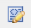

# Editor Rich Text {#rich-text-editor}

L’Editor Rich Text è un componente di base per l’immissione di contenuto testuale nell’AEM. Costituisce la base di varie componenti, tra cui:

* Testo
* Testo e immagine
* Tabella

## Editor Rich Text {#rich-text-editor-1}

La finestra di dialogo di modifica WYSIWYG offre un’ampia gamma di funzionalità:

>[!NOTE]
>
>Le funzioni disponibili possono essere configurate per singoli progetti, pertanto potrebbero variare a seconda dell’installazione.

## Modifica diretta {#in-place-editing}

Oltre alla modalità di modifica Rich Text basata sulla finestra di dialogo, AEM fornisce anche la modalità di modifica diretta, che consente di modificare direttamente il testo così come viene visualizzato nel layout della pagina.

Fai clic due volte su un paragrafo (con un doppio clic lento) per passare alla modalità di modifica diretta (il bordo del componente sarà ora arancione).

Potrai modificare direttamente il testo sulla pagina, anziché all’interno di una finestra di dialogo. Apporta le modifiche e verranno salvate automaticamente.

>[!NOTE]
>
>Se il Finder del contenuto è aperto, nella parte superiore della scheda (come sopra) viene visualizzata una barra degli strumenti con le opzioni di formattazione dell’Editor Rich Text.
>
>Se Content Finder non è aperto, la barra degli strumenti non viene visualizzata.

Attualmente, la modalità di modifica locale è abilitata per gli elementi di pagina generati dai componenti **Testo** e **Titolo**.

>[!NOTE]
>
>Il componente [!UICONTROL Titolo] è progettato per contenere un testo breve senza interruzioni di riga. Quando si modifica un titolo in modalità di modifica locale, l&#39;immissione di un&#39;interruzione di riga determina l&#39;apertura di un nuovo componente **Testo** sotto il titolo.

## Funzioni dell’editor Rich Text {#features-of-the-rich-text-editor}

L&#39;Editor Rich Text fornisce una serie di funzioni, [dipendono dalla configurazione](/help/sites-administering/rich-text-editor.md) del singolo componente. Le funzioni sono disponibili sia per l’interfaccia utente touch che per quella classica.

### Formati di caratteri di base {#basic-character-formats}

Qui puoi applicare la formattazione ai caratteri selezionati (evidenziati); alcune opzioni dispongono anche di tasti di scelta rapida:

* Grassetto (Ctrl-B)
* Corsivo (Ctrl-I)
* Sottolineato (Ctrl-U)
* Pedice
* Apice

Tutte funzionano come un interruttore, quindi la riselezione rimuoverà il formato.

### Stili e formati predefiniti {#predefined-styles-and-formats}

L&#39;installazione può includere stili e formati predefiniti. Questi sono disponibili con gli elenchi a discesa **[!UICONTROL Stile]** e **[!UICONTROL Formato]** e possono essere applicati al testo selezionato.

Uno stile può essere applicato a una stringa specifica (uno stile è correlato a CSS):

Mentre un formato viene applicato all’intero paragrafo di testo (un formato è basato su HTML ):

È possibile modificare solo un formato specifico (il valore predefinito è **[!UICONTROL Paragrafo]**).

È possibile rimuovere uno stile; posizionare il cursore all&#39;interno del testo a cui è stato applicato lo stile e fare clic sull&#39;icona di rimozione:

>[!CAUTION]
>
>Non riselezionare il testo a cui è stato applicato lo stile o l&#39;icona verrà disattivata.

### Taglia, Copia, Incolla {#cut-copy-paste}

Sono disponibili le funzioni standard di **[!UICONTROL Taglia]** e **[!UICONTROL Copia]**. Sono disponibili diverse versioni di **[!UICONTROL Incolla]** per gestire formati diversi.

* Taglia (Ctrl-X)
* Copia (Ctrl-C)
* Incolla
Questo è il meccanismo predefinito per incollare (Ctrl-V) per il componente; una volta installato, è configurato per essere [!UICONTROL Incolla da Word].

* Incolla come testo: elimina tutti gli stili e la formattazione per incollare solo il testo normale.

* Incolla da Word: in questo modo il contenuto viene incollato come HTML (con la necessaria riformattazione).

### Annulla, Ripristina {#undo-redo}

L’AEM tiene un registro delle ultime 50 azioni eseguite nel componente corrente, in ordine cronologico. Se necessario, queste azioni possono essere annullate (e quindi ripristinate) in ordine rigoroso.

>[!CAUTION]
>
>La cronologia viene mantenuta solo per la sessione di modifica corrente. Viene riavviato ogni volta che si apre il componente per la modifica.

>[!NOTE]
>
>Cinquanta è il numero predefinito di attività. Questo potrebbe essere diverso per l’installazione in uso.

### Allineamento {#alignment}

Il testo può essere allineato a sinistra, al centro o a destra.

### Rientro {#indentation}

Il rientro di un paragrafo può essere aumentato o diminuito. Il paragrafo selezionato verrà rientrato; il nuovo testo inserito manterrà il livello di rientro corrente.

### Elenchi {#lists}

È possibile creare elenchi puntati e numerati all&#39;interno del testo. Selezionare il tipo di elenco e iniziare a digitare o evidenziare il testo da convertire. In entrambi i casi, un feed di riga avvierà una nuova voce di elenco.

È possibile ottenere elenchi nidificati applicando un rientro a una o più voci di elenco.

Lo stile di un elenco può essere modificato semplicemente posizionando il cursore all’interno dell’elenco e selezionando l’altro stile. Un sottoelenco può avere anche uno stile diverso rispetto all&#39;elenco che lo contiene. Questa opzione può essere applicata una volta creato il sottoelenco (per rientro).

### Collegamenti {#links}

Un collegamento a un URL (all’interno del sito web o una posizione esterna) viene generato evidenziando il testo richiesto e facendo clic sull’icona del collegamento ipertestuale:

Una finestra di dialogo ti consente di specificare l’URL di destinazione e se deve essere aperto in una nuova finestra.

Operazioni disponibili:

* Digitare direttamente un URI
* Utilizza la mappa del sito per selezionare una pagina all’interno del sito web
* Immettere l&#39;URI, quindi aggiungere l&#39;ancoraggio di destinazione, ad esempio `www.TargetUri.org#AnchorName`
* Immettere solo un ancoraggio (per fare riferimento alla &quot;pagina corrente&quot;); ad esempio, `#anchor`
* Cerca una pagina nel Finder dei contenuti, quindi trascina l’icona della pagina nella finestra di dialogo Collegamento ipertestuale

>[!NOTE]
>
>All&#39;URI può essere aggiunto uno qualsiasi dei protocolli configurati per l&#39;installazione. In un&#39;installazione standard sono `https://`, `ftp://` e `mailto:`. I protocolli non configurati per l&#39;installazione verranno rifiutati e contrassegnati come non validi.

Per interrompere il collegamento, posizionare il cursore in un punto qualsiasi del testo del collegamento e fare clic sull&#39;icona [!UICONTROL Scollega]:

### Ancoraggi {#anchors}

È possibile creare un ancoraggio in qualsiasi punto del testo posizionando il cursore o selezionando del testo. Fai clic sull&#39;icona **Ancoraggio** per aprire la finestra di dialogo.

Immettere il nome dell&#39;ancoraggio, quindi fare clic su **OK** per salvare.

L’ancoraggio viene visualizzato quando il componente viene modificato e ora può essere utilizzato all’interno di una destinazione per i collegamenti.

### Trova e sostituisci {#find-and-replace}

AEM fornisce sia una funzione **Trova** che una funzione **Sostituisci** (trova e sostituisci).

Entrambi dispongono di un pulsante **Trova successivo** per cercare nel componente aperto il testo specificato. Puoi anche specificare se deve esistere una corrispondenza tra maiuscole e minuscole.

La ricerca inizierà sempre dalla posizione corrente del cursore all’interno del testo. Quando viene raggiunta la fine del componente, viene visualizzato un messaggio per informare che l’operazione di ricerca successiva inizierà dall’inizio.

L&#39;opzione **Sostituisci** consente di **Trovare**, quindi **Sostituire** una singola istanza con il testo specificato o di **Sostituire tutte** le istanze nel componente corrente.

### Immagini {#images}

Le immagini possono essere trascinate da Content Finder per aggiungerle al testo.

>[!NOTE]
>
>L&#39;AEM offre anche componenti specializzati per una configurazione dell&#39;immagine più dettagliata. Ad esempio, sono disponibili i componenti **Immagine** e **Immagine testo**.

### Controllo ortografia {#spelling-checker}

Il correttore ortografico controllerà tutto il testo nel componente corrente.

Eventuali errori ortografici verranno evidenziati:

>[!NOTE]
>
>Il correttore ortografico funziona nella lingua del sito Web utilizzando la proprietà language della sottostruttura o estraendo la lingua dall&#39;URL. Ad esempio, il ramo `en` verrà controllato per la lingua inglese e il ramo `de` per la lingua tedesca.

### Tabelle {#tables}

Le tabelle sono disponibili sia:

* Come componente **Tabella**

  

* Dal componente **Testo**

  

  >[!NOTE]
  >
  >Sebbene le tabelle siano disponibili nell&#39;editor Rich Text, si consiglia di utilizzare il componente **Tabella** durante la creazione di tabelle.

Sia nella tabella dei componenti **Text** che nella **Table** la funzionalità tabella è disponibile tramite il menu di scelta rapida, in genere il pulsante destro del mouse, su cui è stato fatto clic all&#39;interno della tabella, ad esempio:

>[!NOTE]
>
>Nel componente **Tabella** è disponibile anche una barra degli strumenti specializzata, che include diverse funzioni standard dell&#39;editor Rich Text e un sottoinsieme delle funzioni specifiche della tabella.

Le funzioni specifiche della tabella sono:

* [Proprietà tabella](#table-properties)
* [Proprietà cella](#cell-properties)
* [Aggiungi o elimina righe](#add-or-delete-rows)
* [Aggiungi o elimina colonne](#add-or-delete-columns)
* [Selezione di righe o colonne intere](#selecting-entire-rows-or-columns)
* [Unisci celle](#merge-cells)
* [Dividi celle](#split-cells)
* [Tabelle nidificate](#creating-nested-tables)
* [Rimuovi tabella](#remove-table)

#### Proprietà tabella {#table-properties}

È possibile configurare le proprietà di base della tabella prima di fare clic su **OK** per salvare:

* **Larghezza**: la larghezza totale della tabella.

* **Altezza**: altezza totale della tabella.

* **Bordo**: dimensione del bordo della tabella.

* **Spaziatura interna celle**: definisce lo spazio vuoto tra il contenuto della cella e i relativi bordi.

* **Spaziatura celle**: definisce la distanza tra le celle.

>[!NOTE]
>
>Alcune proprietà di cella, come Larghezza e Altezza, possono essere definite come pixel o come percentuali.

>[!CAUTION]
>
>L’Adobe consiglia di definire una larghezza per la tabella.

#### Proprietà cella {#cell-properties}

È possibile configurare le proprietà di una cella specifica o di una serie di celle:

* **Larghezza**
* **Altezza**
* **Allineamento orizzontale** - A sinistra, al centro o a destra
* **Allineamento verticale** - Superiore, Medio, Inferiore o Linea di base
* **Tipo di cella**- Dati o Intestazione
* **Applica a:** cella singola, riga intera, colonna intera

#### Aggiungi o elimina righe {#add-or-delete-rows}

Le righe possono essere aggiunte sopra o sotto la riga corrente.

È inoltre possibile eliminare la riga corrente.

#### Aggiungi o elimina colonne {#add-or-delete-columns}

Le colonne possono essere aggiunte a sinistra o a destra della colonna corrente.

È inoltre possibile eliminare la colonna corrente.

#### Selezione di righe o colonne intere {#selecting-entire-rows-or-columns}

Seleziona l&#39;intera riga o colonna corrente. Sono quindi disponibili azioni specifiche (ad esempio, unione).

#### Unisci celle {#merge-cells}

 

* Se è stato selezionato un gruppo di celle, è possibile unirle in un unico gruppo.
* Se è stata selezionata una sola cella, è possibile unirla alla cella a destra o sotto.

#### Dividi celle {#split-cells}

Selezionare una singola cella per dividerla:

* La divisione orizzontale di una cella genera una nuova cella a destra della cella corrente, all&#39;interno della colonna corrente.
* La divisione verticale di una cella genera una nuova cella al di sotto della cella corrente, ma all&#39;interno della riga corrente.

#### Creazione di tabelle nidificate {#creating-nested-tables}

La creazione di una tabella nidificata crea una tabella indipendente all&#39;interno della cella corrente.

>[!NOTE]
>
>Alcuni comportamenti aggiuntivi dipendono dal browser:
>
>* Windows IE: utilizzare Ctrl+pulsante principale del mouse-clic (in genere a sinistra) per selezionare più celle.
>* Firefox: trascina il puntatore per selezionare un intervallo di celle.

#### Rimuovi tabella {#remove-table}

Utilizza l&#39;opzione per rimuovere la tabella dal componente **[!UICONTROL Testo]**.

### Caratteri speciali {#special-characters}

È possibile rendere disponibili caratteri speciali per l’editor Rich Text, che possono variare a seconda dell’installazione.

Utilizza il passaggio del mouse per visualizzare una versione ingrandita del carattere, quindi fai clic su per includerlo nella posizione corrente nel testo.

### Modalità di modifica Source {#source-editing-mode}

La modalità di modifica della sorgente consente di visualizzare e modificare le HTML sottostanti del componente.

Quindi il testo:

Si presenta come segue in modalità sorgente (spesso la sorgente è molto più lunga, quindi è necessario scorrere):

>[!CAUTION]
>
>Quando si esce dalla modalità sorgente, l’AEM esegue alcuni controlli di convalida (ad esempio, per verificare che il testo sia contenuto correttamente o nidificato in blocchi). Questo può comportare modifiche alle tue modifiche.
