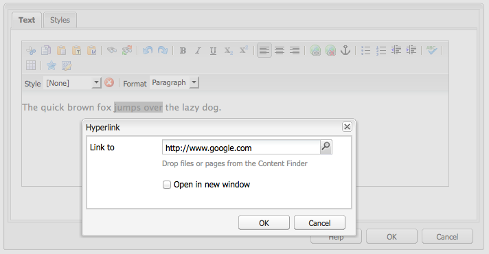
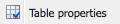

# Editor Rich Text {#rich-text-editor}

L’editor Rich Text è un componente di base per l’inserimento di contenuti di testo in AEM. Costituisce l’elemento base di vari componenti, quali:

* Testo
* Testo e immagine
* Tabella

## Editor Rich Text {#rich-text-editor-1}

La finestra di dialogo di modifica WYSIWYG fornisce un’ampia gamma di funzionalità:

>[!NOTE]
>
>Le funzioni disponibili possono essere configurate a livello di singolo progetto, pertanto potrebbero essere diverse nell’applicazione installata.

## Modifica diretta {#in-place-editing}

Oltre all’editor Rich Text basato su una finestra di dialogo, in AEM è disponibile anche una modalità che consente di modificare direttamente il testo visualizzato nel layout della pagina.

Per passare alla modalità di modifica diretta, fai due volte clic su un paragrafo (doppio clic lento). Il bordo del componente diventa di colore arancione.

Ora è possibile modificare il testo direttamente nella pagina, anziché all’interno di una finestra di dialogo. Le modifiche apportate vengono salvate automaticamente.

>[!NOTE]
>
>Con Content Finder aperto, una barra degli strumenti con le opzioni di formattazione dell’editor Rich Text verrà visualizzata nella parte superiore della scheda (come sopra).
>
>Se Content Finder non è aperto, la barra degli strumenti non verrà visualizzata.

La modalità di modifica diretta è attualmente abilitata per gli elementi della pagina generati dai componenti **Testo** e **Titolo**.

>[!NOTE]
>
>Il componente [!UICONTROL Titolo] può contenere un breve testo senza interruzioni di riga. Se si modifica un titolo in modalità di modifica diretta e si inserisce un’interruzione di riga, sotto al titolo viene inserito un nuovo componente **Testo**.

## Funzioni nell’editor Rich Text {#features-of-the-rich-text-editor}

L’Editor Rich Text fornisce una serie di funzioni: [dipende dalla configurazione](/help/sites-administering/rich-text-editor.md) del singolo componente. Le funzioni sono disponibili sia per l’interfaccia touch che per quella classica.

### Formati base dei caratteri {#basic-character-formats}

Questa finestra consente di formattare i caratteri selezionati (evidenziati). Alcune opzioni dispongono di tasti di scelta rapida:

* Grassetto (Ctrl+B)
* Corsivo (Ctrl+I)
* Sottolineato (Ctrl+U)
* Pedice
* Apice

Tutti i pulsanti attivano e disattivano la funzione, pertanto ripetendo la selezione si rimuove il formato.

### Stili e formati predefiniti {#predefined-styles-and-formats}

Nell’applicazione installata possono essere inclusi stili e formati predefiniti, disponibili negli elenchi a discesa **[!UICONTROL Stile]** e **[!UICONTROL Formato]** e che possono essere applicati al testo selezionato.

Uno stile può essere applicato a una stringa specifica (lo stile è correlato ai CSS):

Un formato viene invece applicato all’intero paragrafo di testo (il formato è basato su HTML):

I formati specifici possono essere solo modificati (quello predefinito è **[!UICONTROL Paragrafo]**).

Gli stili possono essere rimossi. A tale scopo, posiziona il cursore all’interno del testo a cui è stato applicato lo stile e fai clic sull’icona di rimozione:

>[!CAUTION]
>
>Non riselezionare il testo a cui è stato applicato lo stile, perché così facendo l’icona viene disattivata.

### Taglia, Copia, Incolla {#cut-copy-paste}

Sono disponibili le funzioni standard **[!UICONTROL Taglia]** e **[!UICONTROL Copia]**. Il comando **[!UICONTROL Incolla]** è disponibile in varie versioni, per consentire la gestione di formati diversi.

* Taglia (Ctrl+X)
* Copia (Ctrl+C)
* Incolla È il meccanismo di incolla predefinito (Ctrl+V) per il componente; quando installato out-of-the-box, questo è configurato per essere [!UICONTROL Incolla da Word].

* Incolla come testo: Elimina tutti gli stili e la formattazione per incollare solo il testo normale.

* Incolla da Word: Incolla il contenuto come HTML (eseguendo le operazioni di riformattazione necessarie).

### Annulla, Ripristina {#undo-redo}

In AEM vengono registrate le ultime 50 operazioni eseguite nel componente attuale, in ordine cronologico. Se necessario, tali operazioni possono essere annullate (e successivamente ripristinate) nell’ordine in cui sono state registrate.

>[!CAUTION]
>
>La cronologia viene mantenuta solo per la sessione di modifica corrente, e viene riavviata ogni volta che si apre il componente per la modifica.

>[!NOTE]
>
>Per impostazione predefinita vengono mantenute 50 attività, ma tale valore può variare da un’installazione all’altra.

### Allineamento {#alignment}

Il testo può essere allineato a sinistra, al centro o a destra.

### Rientro {#indentation}

È possibile aumentare o diminuire il rientro di un paragrafo. Il rientro viene applicato al paragrafo selezionato. Eventuale nuovo testo inserito mantiene il livello di rientro corrente.

### Elenchi {#lists}

All’interno del testo è possibile creare elenchi puntati e numerati. Seleziona il tipo di elenco e inizia a digitare oppure evidenzia il testo da convertire. In entrambi i casi, inserendo un carattere di avanzamento riga si crea una nuova voce di elenco.

È possibile creare elenchi nidificati applicando un rientro a una o più voci dell’elenco.

Per modificare lo stile di un elenco, posiziona il cursore all’interno dell’elenco e seleziona il nuovo stile. Dopo aver creato un sottoelenco (tramite un rientro), puoi applicarvi uno stile diverso da quello dell’elenco in cui si trova.

### Collegamenti {#links}

Per generare un collegamento a un URL (all’interno o all’esterno del sito web), evidenzia il testo desiderato e fai clic sull’icona del collegamento ipertestuale:

Viene visualizzata una finestra di dialogo che consente di impostare l’URL di destinazione e specificare se la pagina corrispondente deve essere aperta in una nuova finestra.

Operazioni disponibili:

* Digitare un URI direttamente
* Utilizza la mappa del sito per selezionare una pagina all’interno del sito web
* Inserire l’URI, quindi aggiungere l’ancoraggio di destinazione; ad esempio `www.TargetUri.org#AnchorName`
* Inserire solo un ancoraggio (per fare riferimento alla &quot;pagina corrente&quot;); Ad esempio: `#anchor`
* Cercare una pagina in Content Finder, quindi trascinare l’icona della pagina nella finestra di dialogo Collegamento ipertestuale

>[!NOTE]
>
>L’URI può essere preceduto da uno dei protocolli configurati per l’installazione. In un&#39;installazione standard questi sono `https://`, `ftp://`e `mailto:`. I protocolli non configurati per l’installazione in uso vengono rifiutati e contrassegnati come non validi.

Per interrompere il collegamento, posiziona il cursore all’interno del testo di collegamento e fai clic sull’icona [!UICONTROL Scollega]:

### Ancoraggi {#anchors}

Per creare un ancoraggio all’interno del testo, posiziona il cursore nel testo o seleziona parte del testo, quindi fai clic sull’icona **Ancoraggio** per aprire la finestra di dialogo corrispondente.

Inserisci il nome dell’ancoraggio e fai clic su **OK** per salvare.

L’ancoraggio viene visualizzato durante la modifica del componente e può essere utilizzato come destinazione per i collegamenti.

### Cerca e sostituisci {#find-and-replace}

In AEM sono disponibili le funzioni **Trova** e **Sostituisci** (ricerca e sostituzione).

Per entrambe è disponibile il pulsante **Trova successivo**, che consente di cercare il testo specificato nel componente aperto. È anche possibile specificare di distinguere tra maiuscole e minuscole.

La ricerca inizia sempre dalla posizione corrente del cursore all’interno del testo. Quando viene raggiunta la fine del componente, un messaggio segnala che la ricerca successiva verrà ripresa dall’inizio.

L’opzione **Sostituisci** consente di **trovare** e quindi **sostituire** una singola istanza con il testo specificato, oppure di **sostituire tutte** le istanze nel componente corrente.

### Immagini {#images}

È possibile trascinare immagini da Content Finder per aggiungerle al testo.

>[!NOTE]
>
>In AEM vengono inoltre forniti componenti specializzati per una configurazione più dettagliata delle immagini, ad esempio i componenti **Immagine** e **Testo e immagine.**

### Controllo ortografico {#spelling-checker}

Il correttore ortografico controlla tutto il testo nel componente corrente.

Eventuali errori di ortografia vengono evidenziati:

>[!NOTE]
>
>Il controllo ortografico viene eseguito nella stessa lingua del sito web, che viene determinata in base alla proprietà della lingua nella struttura ad albero secondaria o estraendola dall’URL. Ad esempio, il controllo ortografico viene eseguito in inglese nel ramo `en` e in tedesco nel ramo `de`.

### Tabelle {#tables}

Le tabelle sono disponibili:

* Come componente **Tabella**

   

* Internamente al componente **Testo**

   

   >[!NOTE]
   >
   >Anche se le tabelle sono disponibili nell’editor Rich Text, si consiglia di utilizzare la variabile **Tabella** durante la creazione di tabelle.

Sia nel componente **Testo** sia nel componente **Tabella** la funzionalità per le tabelle è disponibile dal menu di scelta rapida, in genere visualizzato facendo clic con il pulsante destro del mouse all’interno di una tabella, ad esempio:

>[!NOTE]
>
>Nel componente **Tabella** è disponibile anche una barra degli strumenti specializzata, che include varie funzioni standard dell’editor Rich Text e un sottoinsieme delle funzioni specifiche per tabelle.

Le funzioni specifiche delle tabelle sono:

* [Proprietà tabella](#table-properties)
* [Proprietà cella](#cell-properties)
* [Aggiungi/Elimina righe](#add-or-delete-rows)
* [Aggiungi/Elimina colonne](#add-or-delete-columns)
* [Selezione di righe o colonne intere](#selecting-entire-rows-or-columns)
* [Unisci celle](#merge-cells)
* [Dividi celle](#split-cells)
* [Tabelle nidificate](#creating-nested-tables)
* [Rimuovi tabella](#remove-table)

#### Proprietà tabella {#table-properties}

Prima di fare clic su **OK** per salvare, è possibile configurare le proprietà di base della tabella:

* **Larghezza**: Larghezza totale della tabella.

* **Altezza**: Altezza totale della tabella.

* **Bordo**: Dimensione del bordo della tabella.

* **Margine celle**: Definisce lo spazio vuoto tra il contenuto di una cella e i relativi bordi.

* **Spaziatura celle**: Definisce la distanza tra le celle.

>[!NOTE]
>
>Alcune proprietà delle celle, come Larghezza e Altezza, possono essere definite come pixel o come percentuali.

>[!CAUTION]
>
>Adobe consiglia di definire una larghezza per la tabella.

#### Proprietà cella {#cell-properties}

Per una cella o serie di celle specifiche è possibile configurare le seguenti proprietà:

* **Larghezza**
* **Altezza**
* **Allineamento orizzontale** - A sinistra, Centro o A destra
* **Allineamento verticale** - In alto, In mezzo, In basso o Linea di base
* **Tipo di cella**- Dati o intestazione
* **Applica a:** Cella singola, riga intera, colonna intera

#### Aggiungi/Elimina righe {#add-or-delete-rows}

Le righe possono essere aggiunte sopra o sotto la riga corrente.

È inoltre possibile eliminare la riga corrente.

#### Aggiungi/Elimina colonne {#add-or-delete-columns}

Le colonne possono essere aggiunte a destra o a sinistra della colonna corrente.

È inoltre possibile eliminare la colonna corrente.

#### Selezione di righe o colonne intere {#selecting-entire-rows-or-columns}

Consente di selezionare l’intera riga o colonna corrente per eseguire operazioni specifiche, ad esempio l’unione.

#### Unisci celle {#merge-cells}

 

* Se è selezionato un gruppo di celle, è possibile unirle in modo da formare una singola cella.
* Se è selezionata una sola cella, è possibile unirla con la cella a destra o con quella sotto.

#### Dividi celle {#split-cells}

Consente di selezionare una singola cella per dividerla:

* Se si divide la cella in orizzontale, nella colonna corrente viene generata una nuova cella a destra di quella attuale.
* Se si divide la cella in verticale, nella riga corrente viene generata una nuova cella sotto quella attuale.

#### Creazione di tabelle nidificate {#creating-nested-tables}

Quando si crea una tabella nidificata, viene creata una nuova tabella indipendente nella cella corrente.

>[!NOTE]
>
>Alcuni comportamenti aggiuntivi dipendono dal browser in uso:
>
>* Windows Internet Explorer: premi Ctrl e fai clic con il pulsante principale del mouse (in genere il sinistro) per selezionare più celle.
>* Firefox: Trascinare il puntatore per selezionare un intervallo di celle.

#### Rimuovi tabella {#remove-table}

Utilizza l’opzione per rimuovere la tabella dall’interno della **[!UICONTROL Testo]** componente.

### Caratteri speciali {#special-characters}

Nell’editor Rich Text è possibile rendere disponibili alcuni caratteri speciali, a seconda dell’installazione in uso.

Sposta il mouse su un carattere per visualizzarne una versione ingrandita, quindi fai clic su di esso per inserirlo nella posizione corrente all’interno del testo.

### Modalità di modifica dell’origine {#source-editing-mode}

La modalità di modifica dell’origine consente di visualizzare e modificare il codice HTML sottostante al componente.

Ad esempio, il testo:

avrà l’aspetto seguente nella modalità di modifica dell’origine (l’origine è spesso più lunga, pertanto sarà necessario scorrere la pagina):

>[!CAUTION]
>
>Quando si esce dalla modalità di modifica dell’origine, in AEM vengono eseguiti alcuni controlli di convalida, ad esempio per verificare che il testo sia correttamente incluso o nidificato nei blocchi. Le correzioni apportate possono essere pertanto modificate.
