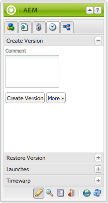
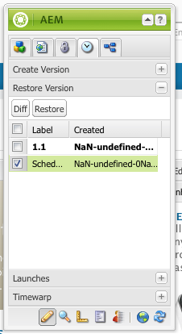
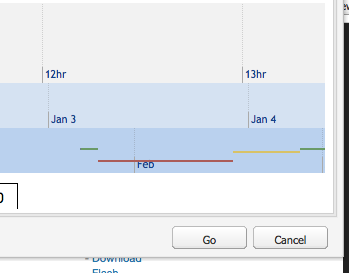

# Utilizzo delle versioni di una pagina  {#working-with-page-versions}

Il controllo delle versioni crea lo snapshot di una pagina in un determinato momento. Con il controllo delle versioni è possibile eseguire le azioni seguenti:

* Creare una versione di una pagina.
* Ripristina una pagina a una versione precedente per annullare una modifica apportata a una pagina.
* Confronta la versione corrente di una pagina con una versione precedente, evidenziando differenze nel testo e nelle immagini.

## Creazione di una versione {#creating-a-new-version}

Per creare una versione di una pagina:

1. Nel browser, apri la pagina per la quale desideri creare una versione.
1. Nel Sidekick, selezionare la scheda **Controllo delle versioni**, quindi la scheda secondaria **Crea versione**.

   

1. Immetti un **commento** (facoltativo).
1. Per impostare un&#39;etichetta per la versione (facoltativa), fare clic sul pulsante **Altro >>** e impostare **Etichetta** per denominare la versione. Se l’etichetta non è impostata, la versione è un numero incrementato automaticamente.
1. Fare clic su **Crea versione**. Sulla pagina viene visualizzato un messaggio in grigio, ad esempio:
Versione 1.2 creata per: Camicie.

>[!NOTE]
>
>Quando la pagina viene attivata, viene creata automaticamente una versione.

## Ripristino di una versione di pagina dal Sidekick {#restoring-a-page-version-from-sidekick}

Per ripristinare la pagina a una versione precedente:

1. Aprire la pagina per la quale si desidera ripristinare una versione precedente.
1. Nella barra laterale, selezionare la scheda **Controllo versioni**, quindi la scheda secondaria **Ripristina versione**.

   

1. Selezionare la versione da ripristinare e selezionare **Ripristina**.

## Ripristino di una versione di pagina dalla console {#restoring-a-page-version-from-the-console}

Questo metodo può essere utilizzato per ripristinare una versione della pagina. Può essere utilizzato anche per ripristinare pagine precedentemente eliminate:

1. Nella console **Siti Web**, passare alla pagina che si desidera ripristinare e selezionarla.
1. Dal menu principale, seleziona **Strumenti**, quindi **Ripristina**:

   

1. Selezionando **Ripristina versione...** vengono elencate le versioni dei documenti nella cartella corrente. Anche se una pagina è stata eliminata, viene elencata l’ultima versione:

   

1. Selezionare la versione da ripristinare e fare clic su **Ripristina**. AEM ripristina le versioni (o strutture) selezionate.

### Ripristino di una struttura dalla console {#restoring-a-tree-from-the-console}

Questo metodo può essere utilizzato per ripristinare una versione della pagina. Può essere utilizzato anche per ripristinare pagine precedentemente eliminate:

1. Nella console **Siti Web** individuare la cartella da ripristinare e selezionarla.
1. Dal menu principale, seleziona **Strumenti**, quindi **Ripristina**.
1. Se si seleziona **Ripristina struttura...**, verrà aperta la finestra di dialogo che consente di selezionare la struttura da ripristinare:

   

1. Fare clic su **Ripristina**. AEM ripristina la struttura selezionata.

## Confronto con una versione precedente {#comparing-with-a-previous-version}

Per confrontare la versione corrente della pagina con una versione precedente:

1. Nel browser, apri la pagina da confrontare con una versione precedente.
1. Nel Sidekick, selezionare la scheda **Controllo delle versioni**, quindi la scheda secondaria **Ripristina versione** n.

   

1. Selezionare la versione da confrontare e fare clic sul pulsante **Diff**.
1. Le differenze tra la versione corrente e la versione selezionata vengono visualizzate come segue:

   * Il testo eliminato è di colore rosso e barrato.
   * Il testo aggiunto è verde ed evidenziato.
   * Le immagini aggiunte o eliminate sono di colore verde.

   

1. Nel Sidekick, selezionare la scheda secondaria **Ripristina versione** e fare clic sul pulsante **&lt;&lt;Indietro** per visualizzare la versione corrente.

## Timewarp   {#timewarp}

Timewarp è una funzione progettata per simulare lo stato ***di pubblicazione*** di una pagina in specifici momenti nel passato.

Lo scopo è quello di consentire di tenere traccia del sito web pubblicato nel momento selezionato. In questo modo vengono utilizzate le attivazioni delle pagine per determinare lo stato dell’ambiente di pubblicazione.

Per effettuare questo collegamento:

* il sistema cerca la versione della pagina che era attiva al momento selezionato.
* In altre parole, la versione mostrata era stata creata/attivata *prima* del momento temporale selezionato in Timewarp.
* Viene eseguito anche il rendering quando si passa a una pagina che è stata eliminata, purché nell’archivio siano ancora disponibili le versioni precedenti della pagina.
* Se non viene trovata alcuna versione pubblicata, Timewarp ripristina lo stato corrente della pagina nell’ambiente di authoring, in modo da evitare un errore 404 di pagina non più visualizzabile.

>[!NOTE]
>
>Se le versioni vengono rimosse dall’archivio, Timewarp non può mostrare la visualizzazione corretta. Inoltre, se sono stati modificati alcuni elementi (come codice, css e immagini) per il rendering del sito web, la visualizzazione è diversa da come era all’origine, poiché per tali elementi non vengono conservate precedenti versioni nell’archivio.

### Utilizzo del calendario Timewarp {#using-the-timewarp-calendar}

Timewarp è disponibile dalla barra laterale.

La versione del calendario viene utilizzata se si dispone di un giorno specifico da visualizzare:

1. Apri la scheda **Controllo delle versioni** e fai clic su **Timewarp** (nella parte inferiore della barra laterale). Viene visualizzata la seguente finestra di dialogo:

   

1. Utilizzando i selettori di data e ora, specifica la data/ora desiderata e fai clic su **Vai**.

   Timewarp visualizza la pagina così come era nello stato di pubblicazione prima/alla data scelta.

   >[!NOTE]
   >
   >Timewarp funziona correttamente solo se la pagina è stata già pubblicata. In caso contrario viene mostrata la pagina corrente nell’ambiente di authoring.

   >[!NOTE]
   >
   >Se passi a una pagina che è stata rimossa o eliminata dall’archivio, questa viene riprodotta correttamente se nell’archivio sono ancora disponibili versioni precedenti della pagina.

   >[!NOTE]
   >
   >Non è possibile modificare la versione precedente della pagina. ma solo visualizzarla. Se desideri ripristinare la versione precedente, puoi farlo manualmente utilizzando [ripristina](/help/sites-classic-ui-authoring/classic-page-author-work-with-versions.md#restoring-a-page-version-from-sidekick).

1. Dopo aver visualizzato la pagina, fai clic su:

   * **Esci da Timewarp** per uscire e tornare alla pagina di authoring corrente.
   * [Mostra sequenza temporale](#using-the-timewarp-timeline) per visualizzarla.

   

### Utilizzo della timeline Timewarp {#using-the-timewarp-timeline}

La versione timeline viene utilizzata se desideri visualizzare una panoramica delle attività di pubblicazione nella pagina.

Se si desidera visualizzare la sequenza temporale del documento:

1. Per visualizzare la linea temporale, effettuate una delle seguenti operazioni:

   1. Apri la scheda **Controllo delle versioni**, quindi fai clic su **Timewarp** (nella parte inferiore della barra laterale).

   1. Utilizza la finestra di dialogo della barra laterale visualizzata dopo [l&#39;utilizzo del Calendario Timewarp](#using-the-timewarp-calendar).

1. Fare clic su **Mostra sequenza temporale**. Verrà visualizzata la sequenza temporale del documento, ad esempio:

   

1. Selezionare e spostare (tenere premuto e trascinare) la sequenza temporale per spostarla nella sequenza temporale del documento.

   * Tutte le righe indicano le versioni pubblicate.
Quando viene attivata una pagina, inizia una nuova riga. Ogni volta che il documento viene modificato, viene visualizzato un nuovo colore.
Nell’esempio seguente, la linea rossa indica che la pagina è stata modificata durante l’intervallo di tempo della versione verde iniziale. La linea gialla indica che la pagina è stata modificata durante la versione rossa e così via.

   

1. Fai clic su:

   1. **Vai** per visualizzare il contenuto della pagina pubblicata al momento selezionato.
   1. Quando visualizzi il contenuto, utilizza **Esci da Timewarp** per uscire e tornare alla pagina di authoring corrente.

### Limitazioni di Timewarp {#timewarp-limitations}

Timewarp semplifica al massimo la riproduzione di una pagina in un determinato momento. Tuttavia, a causa delle complessità dell’authoring continuo di contenuti in AEM, questo non è sempre possibile. Tieni presenti queste limitazioni quando utilizzi Timewarp.

* **Timewarp funziona in base alle pagine pubblicate**: Timewarp funziona correttamente solo se la pagina è stata già pubblicata. In caso contrario viene mostrata la pagina corrente nell’ambiente di authoring.
* **Timewarp utilizza le versioni di pagina**: se passi a una pagina che è stata rimossa o eliminata dall’archivio, questa verrà riprodotta correttamente se nell’archivio sono ancora disponibili versioni precedenti della pagina.
* **Le versioni rimosse influiscono su Timewarp**: se dalla directory archivio sono state rimosse delle versioni, Timewarp non può mostrare la visualizzazione corretta.

* **Timewarp è di sola lettura**: non è possibile modificare la versione precedente della pagina, ma solo visualizzarla. Se desideri ripristinare la versione precedente, puoi farlo manualmente utilizzando [ripristina](#main-pars-title-1).

* **Timewarp si basa solo sul contenuto della pagina**. Se sono stati modificati elementi quali codice, CSS e risorse immagine per il rendering del sito Web, la visualizzazione sarà diversa da quella originale. Il motivo è che tali elementi non dispongono del controllo delle versioni nell&#39;archivio.

>[!CAUTION]
>
>Timewarp è progettato per aiutare gli autori a comprendere e creare i loro contenuti. Non deve essere utilizzato come registro di controllo o per fini legali.
