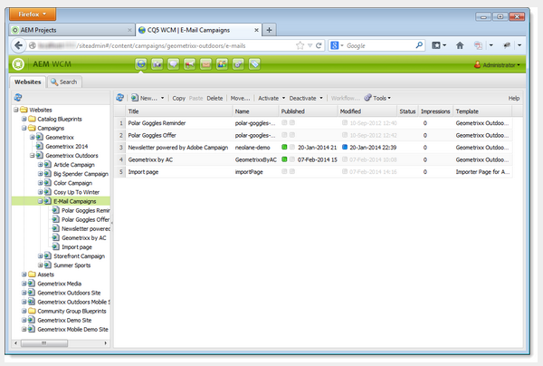
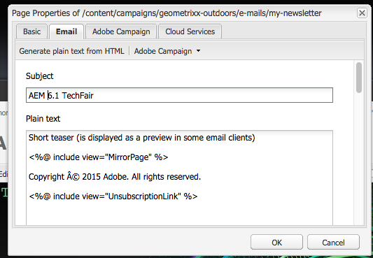

# Utilizzo di Adobe Campaign 6.1 e Adobe Campaign Standard{#working-with-adobe-campaign-and-adobe-campaign-standard}

Puoi creare contenuti e-mail in AEM ed elaborarli nelle e-mail di Adobe Campaign. Per farlo, devi:

1. Crea una nuova newsletter in AEM da un modello specifico di Adobe Campaign.
1. Seleziona [un servizio Adobe Campaign](#selectingtheadobecampaigncloudservice) prima di modificare il contenuto per accedere a tutte le funzionalità.
1. Modifica il contenuto.
1. Convalida il contenuto.

Il contenuto può quindi essere sincronizzato con una consegna in Adobe Campaign. Istruzioni dettagliate sono descritte in questo documento.

>[!NOTE]
>
>Prima di poter utilizzare questa funzionalità, devi configurare AEM per l’integrazione con [Adobe Campaign](/help/sites-administering/campaignonpremise.md) o [Adobe Campaign Standard](/help/sites-administering/campaignstandard.md).

## Invio di contenuti e-mail tramite Adobe Campaign {#sending-email-content-via-adobe-campaign}

Dopo aver configurato AEM e Adobe Campaign, puoi creare i contenuti di consegna e-mail direttamente nell’AEM e quindi elaborarli in Adobe Campaign.

Quando crei contenuti Adobe Campaign nell’AEM, devi collegare un servizio Adobe Campaign prima di modificarli per accedere a tutte le funzionalità.

Esistono due casi possibili:

* Il contenuto può essere sincronizzato con una consegna da Adobe Campaign. Questo consente di utilizzare contenuti AEM in una consegna.
* (Solo Adobe Campaign on-premise) Il contenuto può essere inviato direttamente ad Adobe Campaign, che genera automaticamente una nuova consegna e-mail. Questa modalità presenta limitazioni.

Istruzioni dettagliate sono descritte in questo documento.

### Creazione di nuovi contenuti e-mail {#creating-new-email-content}

>[!NOTE]
>
>Quando aggiungi modelli e-mail, assicurati di aggiungerli in **/content/campaigns** per renderle disponibili.

1. In AEM, selezionare **Siti Web** sfoglia l’explorer per individuare la posizione in cui vengono gestite le campagne e-mail. Nell’esempio seguente, il nodo interessato è **Siti Web** > **Campagne** > **Geometrixx Outdoors** > **Campagne e-mail**.

   >[!NOTE]
   >
   >[Gli esempi di e-mail sono disponibili solo in Geometrixx](/help/sites-developing/we-retail.md#weretail). Scarica i contenuti di esempio di Geometrixx da Condivisione pacchetti.

   

1. Seleziona **Nuovo** > **Nuova pagina** per creare nuovi contenuti e-mail.
1. Seleziona uno dei modelli disponibili specifici di Adobe Campaign, quindi specifica le proprietà generali della pagina. Per impostazione predefinita sono disponibili tre modelli:

   * **E-mail Adobe Campaign (AC 6.1)**: consente di aggiungere contenuto a un modello predefinito prima di inviarlo ad Adobe Campaign 6.1 per la consegna.
   * **E-mail Adobe Campaign (ACS)**: consente di aggiungere contenuto a un modello predefinito prima di inviarlo ad Adobe Campaign Standard per la consegna.

   

1. Clic **Crea** per creare l’e-mail o la newsletter.

### Selezione del servizio cloud Adobe Campaign e del modello {#selecting-the-adobe-campaign-cloud-service-and-template}

Per l’integrazione con Adobe Campaign, devi aggiungere alla pagina un servizio cloud Adobe Campaign. In questo modo puoi accedere alla personalizzazione e ad altre informazioni su Adobe Campaign.

Inoltre, potrebbe essere necessario selezionare il modello Adobe Campaign, modificare l’oggetto e aggiungere contenuto di testo normale per gli utenti che non visualizzeranno l’e-mail in HTML.

1. Seleziona la **Pagina** nella barra laterale, quindi seleziona **Proprietà pagina.**
1. In **Servizi cloud** nella finestra pop-up, seleziona **Aggiungi servizio** per aggiungere il servizio Adobe Campaign e fare clic su **OK**.

   

1. Seleziona la configurazione che corrisponde alla tua istanza di Adobe Campaign dall’elenco a discesa, quindi fai clic su **OK**.

   >[!NOTE]
   >
   >Tocca o fai clic su **OK** o **Applica** dopo l’aggiunta del servizio cloud. In questo modo è possibile **Adobe Campaign** per funzionare correttamente.

1. Se desideri applicare un modello di consegna e-mail specifico (da Adobe Campaign), diverso da quello predefinito **mail** modello, seleziona **Proprietà pagina** di nuovo. In **Adobe Campaign** , immetti il nome interno del modello di consegna e-mail nell’istanza di Adobe Campaign correlata.

   In Adobe Campaign Standard, il modello è **Consegna con contenuti AEM**. In Adobe Campaign 6.1, il modello è **Consegna e-mail con contenuti AEM**.

   Quando si seleziona il modello, l&#39;AEM abilita automaticamente **Newsletter Adobe Campaign** componenti.

### Modifica del contenuto delle e-mail {#editing-email-content}

Puoi modificare il contenuto delle e-mail nell’interfaccia utente classica o nell’interfaccia touch.

1. Inserisci l’oggetto e la versione del testo dell’e-mail selezionando **Proprietà pagina** > **E-mail** dalla casella degli strumenti.

   

1. Modifica il contenuto dell’e-mail aggiungendo gli elementi desiderati tra quelli disponibili nella barra laterale. Per eseguire questa operazione, trascinali. Quindi fai doppio clic sull’elemento da modificare.

   Ad esempio, puoi aggiungere testo contenente campi di personalizzazione.

   

   Consulta [Componenti di Adobe Campaign](/help/sites-classic-ui-authoring/classic-personalization-ac-components.md) per una descrizione dei componenti disponibili per le newsletter/campagne e-mail di Adobe Campaign.

   

### Inserimento della personalizzazione {#inserting-personalization}

Durante la modifica del contenuto, puoi inserire:

* Campi contestuali di Adobe Campaign. Si tratta di campi che puoi inserire nel testo e che verranno adattati in base ai dati del destinatario (ad esempio nome, cognome o qualsiasi dato della dimensione di destinazione).
* Blocchi di personalizzazione di Adobe Campaign. Si tratta di blocchi di contenuto predefinito non correlati ai dati del destinatario, ad esempio il logo di un brand o il collegamento a una pagina speculare.

Consulta [Componenti di Adobe Campaign](/help/sites-classic-ui-authoring/classic-personalization-ac-components.md) per una descrizione completa dei componenti di Campaign.

>[!NOTE]
>
>* Solo i campi di Adobe Campaign **Profili** viene presa in considerazione la dimensione di targeting.
>* Quando si visualizzano le proprietà da **Sites**, non hai accesso ai campi contestuali di Adobe Campaign. Puoi accedervi direttamente dall’e-mail durante la modifica.
>

1. Inserisci un nuovo **Newsletter** > **Testo e personalizzazione (Campaign)** componente.
1. Apri il componente facendo doppio clic su di esso. Il **Modifica** La finestra dispone di una funzionalità che consente di inserire gli elementi di personalizzazione.

   >[!NOTE]
   >
   >I campi di contesto disponibili corrispondono ai seguenti **Profili** dimensione di targeting in Adobe Campaign.
   >
   >Consulta [Collegamento di una pagina AEM a un’e-mail di Adobe Campaign](/help/sites-classic-ui-authoring/classic-personalization-ac-campaign.md#linkinganaempagetoanadobecampaignemail).

   

1. Seleziona **ClientContext** nella barra laterale per testare i campi di personalizzazione utilizzando i dati nei profili utente.

   

1. Viene visualizzata una finestra che consente di selezionare l’utente tipo desiderato. I campi di personalizzazione vengono sostituiti automaticamente dai dati del profilo selezionato.

   

### Anteprima di una newsletter {#previewing-a-newsletter}

Puoi visualizzare in anteprima come si presenterà la newsletter e la personalizzazione.

1. Aprire la newsletter che si desidera visualizzare in anteprima e fare clic su Anteprima (lente di ingrandimento) per ridurre la barra laterale.
1. Fai clic su una delle icone del client e-mail per visualizzare l’aspetto della newsletter in ogni client e-mail.

   

1. Espandi la barra laterale per iniziare di nuovo la modifica.

### Approvazione di contenuti in AEM {#approving-content-in-aem}

Al termine del contenuto, puoi avviare il processo di approvazione. Vai a **Flusso di lavoro** della casella degli strumenti e selezionare **Approva per Adobe Campaign** flusso di lavoro.

Questo flusso di lavoro preconfigurato prevede due passaggi: revisione e quindi approvazione oppure revisione e infine rifiuto. Tuttavia, questo flusso di lavoro può essere esteso e adattato a un processo più complesso.

Per approvare il contenuto per Adobe Campaign, applica il flusso di lavoro selezionando **Flusso di lavoro** nella barra laterale e selezionando **Approva per Adobe Campaign** e fai clic su **Avvia flusso di lavoro**. Segui i passaggi e approva il contenuto. Puoi anche rifiutare il contenuto selezionando **Rifiuta** invece di **Approva** nell’ultimo passaggio del flusso di lavoro.

Dopo l’approvazione, il contenuto viene visualizzato come approvato in Adobe Campaign. L’e-mail può quindi essere inviata.

In Adobe Campaign Standard:

In Adobe Campaign 6.1:

>[!NOTE]
>
>Il contenuto non approvato può essere sincronizzato con una consegna in Adobe Campaign, ma la consegna non può essere eseguita. Solo i contenuti approvati possono essere inviati tramite le consegne di Campaign.

## Collegamento dell’AEM con Adobe Campaign Standard e Adobe Campaign 6.1 {#linking-aem-with-adobe-campaign-standard-and-adobe-campaign}

>[!NOTE]
>
>Consulta [Collegamento dell’AEM con Adobe Campaign Standard e Adobe Campaign 6.1](/help/sites-authoring/campaign.md#linking-aem-with-adobe-campaign-standard-and-adobe-campaign-classic) in [Utilizzo di Adobe Campaign 6.1 e Adobe Campaign Standard](/help/sites-authoring/campaign.md) per ulteriori informazioni, consulta la documentazione sull’authoring standard.
