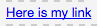

# Componenti di Adobe Campaign{#adobe-campaign-components}

Quando si esegue l’integrazione con Adobe Campaign, sono disponibili componenti per le newsletter e i moduli. Entrambi sono descritti in questo documento.

>[!CAUTION]
>
>I componenti e-mail AEM sono stati dichiarati obsoleti. A causa della natura dell’e-mail, che unisce contenuto e stile, i componenti e-mail forniti come predefiniti AEM diventano di uso limitato per i clienti a causa della necessità di implementare stili personalizzati in tutti i componenti necessari per i progetti.
>
>I componenti e-mail possono essere implementati a livello di progetto e i componenti e-mail AEM componenti e-mail obsoleti illustrano come ottenere questo risultato. Tuttavia, questi componenti obsoleti non devono essere utilizzati nei progetti.

## Componenti per newsletter di Adobe Campaign {#adobe-campaign-newsletter-components}

Tutti i componenti di Campaign seguono le best practice descritte in [Tecniche consigliate per i modelli e-mail](/help/sites-administering/best-practices-for-email-templates.md) e si basano sul linguaggio di markup Adobe [HTL](https://helpx.adobe.com/it/experience-manager/htl/using/overview.html).

Quando apri una newsletter/e-mail configurata per l’integrazione con Adobe Campaign, dovresti visualizzare i seguenti componenti nel **Newsletter Adobe Campaign** sezione:

* Intestazione (Campaign)
* Immagine (Campaign)
* Collegamento (Campagna)
* Modello immagini di Scene7 (Campaign)
* Riferimento di destinazione (Campaign)
* Testo e immagine (Campaign)
* Testo e personalizzazione (Campaign)

Una descrizione di questi componenti si trova nella sezione seguente.

### Intestazione (Campaign) {#heading-campaign}

Il componente di intestazione può:

* Visualizza il nome della pagina corrente lasciando **Titolo** campo vuoto.
* Visualizza un testo specificato nel **Titolo** campo .

È possibile modificare **Intestazione (Campaign)** componenti direttamente. Lascia vuoto per usare il titolo della pagina.

Puoi configurare quanto segue:

* **Titolo**
Se desideri utilizzare un nome diverso dal titolo della pagina, inseriscilo qui.

* **Livello di intestazione (1, 2, 3, 4)**
Il livello di intestazione basato sulle dimensioni da 1 a 4 del titolo HTML.

L’esempio seguente mostra come viene visualizzato un componente Intestazione (Campaign) .

### Immagine (Campaign) {#image-campaign}

Il componente Immagine (campagna) visualizza un’immagine e il relativo testo in base ai parametri specificati.

Puoi caricare un’immagine, quindi modificarla e manipolarla (ad esempio, ritagliarla, ruotarla, aggiungere un collegamento/titolo/testo).

Puoi caricare un’immagine, quindi modificarla e manipolarla (ad esempio ritagliarla, ruotarla, aggiungere un collegamento/titolo/testo). Puoi trascinare un’immagine da [Content Finder](/help/sites-authoring/author-environment-tools.md#thecontentfinderclassicui) direttamente sul componente o sulla relativa finestra di dialogo Modifica. È inoltre possibile fare doppio clic nell’area centrale della finestra di dialogo Modifica per sfogliare il file system locale e caricare un’immagine. Le due schede della finestra di dialogo Modifica controllano anche tutte le definizioni e le manipolazioni dell’immagine:

Quando un’immagine viene caricata, puoi configurare quanto segue:

* **Mappa**
Per mappare un’immagine, seleziona Mappa. È possibile specificare come si desidera creare la mappa immagine (rettangolare, poligonale e così via) e la destinazione dell’area.

* **Ritaglio**
Selezionate Ritaglia per ritagliare un’immagine. Utilizza il mouse per ritagliare l&#39;immagine.

* **Ruota**
Per ruotare un’immagine, selezionate Ruota. Utilizzare ripetutamente finché l&#39;immagine non viene ruotata nel modo desiderato.

* **Cancella**
Rimuovi l&#39;immagine corrente.

* Barra Zoom (solo interfaccia classica) Per ingrandire e ridurre l’immagine, utilizzate la barra di scorrimento al di sotto dell’immagine (sopra i pulsanti OK e Annulla)
* **Titolo**
Titolo dell’immagine.

* **Testo Alt**
Testo alternativo da utilizzare per la creazione di contenuto accessibile.

* **Collega a**
Crea un collegamento a risorse o altre pagine all’interno del sito web.

* **Descrizione**
Una descrizione dell’immagine.

* **Dimensione**
Imposta l’altezza e la larghezza dell’immagine.

>[!NOTE]
>
>È necessario immettere le informazioni nel **Testo Alt** nel campo **Avanzate** oppure l&#39;immagine non può essere salvata e viene visualizzato il seguente messaggio di errore:
>
>`Validation failed. Verify the values of the marked fields.`

L’esempio seguente mostra come viene visualizzato un componente Immagine (Campaign) .

### Collegamento (Campagna) {#link-campaign}

Il componente Collegamento (Campaign) consente di aggiungere un collegamento alla newsletter. Questo componente è disponibile solo nell’interfaccia classica, anche se è possibile aggiungerne uno nell’interfaccia touch e aprirlo in modalità compatibilità.

Puoi configurare quanto segue in **Visualizzazione**, **Informazioni URL** oppure **Avanzate** schede:

* **Didascalia collegamento**
Didascalia del collegamento. Testo visualizzato dagli utenti.

* **Descrizione dei collegamenti**
Aggiunge ulteriori informazioni su come utilizzare il collegamento.

* **LinkType**
Nell’elenco a discesa , seleziona tra 
**URL personalizzato** e **Documento adattivo**. Questo campo è obbligatorio. Se selezioni URL personalizzato, puoi fornire l’URL del collegamento. Se si seleziona Documento adattivo, è possibile specificare il percorso del documento.

* **Parametro URL aggiuntivo**
Aggiungi eventuali parametri URL aggiuntivi. Fai clic su Aggiungi elemento per aggiungere più elementi.

>[!NOTE]
>
>È necessario immettere le informazioni nel **Tipo di collegamento** nel campo **Informazioni URL** oppure il componente non può essere salvato e viene visualizzato il seguente messaggio di errore:
>
>`Validation failed. Verify the values of the marked fields.`

L’esempio seguente mostra come viene visualizzato il componente Collegamento (Campaign) .

### Riferimento di destinazione (Campaign) {#targeted-reference-campaign}

Il componente Riferimento di destinazione (Campaign) consente di creare un riferimento a un paragrafo di destinazione.

In questo componente, accedi al paragrafo di destinazione per selezionarlo.

Fai clic sul menu a discesa per passare al paragrafo a cui desideri fare riferimento. Al termine, fai clic su **OK**.

### Testo e immagine (Campaign) {#text-image-campaign}

Il componente Testo e immagine (Campaign) aggiunge un blocco di testo e un’immagine.

Come per i componenti Testo e personalizzazione (Campaign) e Immagine (Campaign), puoi configurare:

* **Testo**
Inserisci il testo. Utilizzare la barra degli strumenti per modificare la formattazione, creare elenchi e aggiungere collegamenti.

* **Immagine**
Trascina un’immagine da Content Finder oppure fai clic su per individuare un’immagine. Ritaglia o ruota come necessario.

* **Proprietà immagine** (**Proprietà immagine avanzate**) Consente di specificare quanto segue:

   * **Titolo**
il titolo del blocco; Il mouse viene visualizzato al passaggio del mouse.

   * **Testo Alt**
Testo alternativo che verrà mostrato qualora l’immagine non sia disponibile.

   * **Collega a**
Crea un collegamento a risorse o altre pagine all’interno del sito web.

   * **Descrizione**
Una descrizione dell’immagine.

   * **Dimensione**
Imposta l’altezza e la larghezza dell’immagine.

>[!NOTE]
>
>La **Testo Alt** nel campo **Avanzate** è necessaria una scheda oppure il componente non può essere salvato e viene visualizzato il seguente messaggio di errore:
>
>`Validation failed. Verify the values of the marked fields.`

L’esempio seguente mostra come viene visualizzato un componente Testo e immagine (Campaign) .

### Testo e personalizzazione (Campaign) {#text-personalization-campaign}

Il componente Testo e personalizzazione (Campaign) consente di inserire un blocco di testo utilizzando un editor WYSIWYG, con funzionalità fornite da [Editor Rich Text](/help/sites-authoring/rich-text-editor.md). Inoltre, questo componente consente di utilizzare i campi di contesto e i blocchi di personalizzazione disponibili in Adobe Campaign; vedere [Inserimento di personalizzazioni](/help/sites-classic-ui-authoring/classic-personalization-ac-campaign.md#inserting-personalization).

La selezione di icone consente di formattare il testo, con caratteristiche del font, allineamento, collegamenti, elenchi e rientri.

Aggiungi il testo normalmente nell’editor Rich Text. Aggiungi la personalizzazione selezionando il menu a discesa Adobe Campaign e selezionando i campi appropriati.

Puoi aggiungere il testo e i campi di contesto o i blocchi di personalizzazione per creare il contenuto. Quindi, seleziona il contesto client per testare i dati nei profili personali. Dopo aver selezionato una persona, i campi di personalizzazione vengono automaticamente sostituiti dai dati del profilo selezionato.

>[!NOTE]
>
>Solo i campi definiti nel **nms:seedMember** viene preso in considerazione lo schema o una delle sue estensioni. Attributi delle tabelle collegate a `nms:seedMember` non sono disponibili.

## Componenti per moduli di Adobe Campaign {#adobe-campaign-form-components}

I componenti di Adobe Campaign consentono di creare un modulo che gli utenti compilano per iscriversi a una newsletter, annullare l’iscrizione a una newsletter o aggiornare i profili utente. Vedi [Creazione di Adobe Campaign Forms](/help/sites-classic-ui-authoring/classic-personalization-ac-forms.md) per ulteriori informazioni.

Ogni campo componente può essere collegato a un campo del database Adobe Campaign. I campi disponibili variano a seconda del tipo di dati che contengono, come descritto nella sezione [Componenti e tipi di dati](#components-and-data-type). Se estendi lo schema dei destinatari in Adobe Campaign, i nuovi campi saranno disponibili nei componenti i cui tipi di dati corrispondono.

Quando si apre un modulo configurato per l’integrazione con Adobe Campaign, vengono visualizzati i seguenti componenti nel **Adobe Campaign** sezione:

* Casella di selezione (Campaign)
* Campo data (Campaign) e campo data/HTML5 (Campaign)
* Chiave principale crittografata (Campaign)
* Visualizzazione errori (Campaign)
* Chiave riconciliazione nascosta (Campaign)
* Campo numerico (Campaign)
* Campo opzione (Campaign)
* Lista di controllo delle iscrizioni (Campaign)
* Campo testo (Campaign)

Questa sezione descrive in dettaglio ogni componente.

### Componenti e tipi di dati {#components-and-data-type}

Nella tabella seguente sono descritti i componenti disponibili per visualizzare e modificare i dati del profilo Adobe Campaign. Ogni componente può essere mappato su un campo del profilo Adobe Campaign per visualizzarne il valore e aggiornare il campo quando il modulo viene inviato. I diversi componenti possono essere associati solo a campi di un tipo di dati appropriato.

<table>
 <tbody>
  <tr>
   <td>
<strong>Componente</strong>
 </td>
   <td>
<strong>Tipo di dati del campo Adobe Campaign</strong>
 </td>
   <td>
<strong>Campo di esempio</strong>
 </td>
  </tr>
  <tr>
   <td>
Casella di selezione (Campaign)
 </td>
   <td>
booleano
 </td>
   <td>
Nessun contatto (da qualsiasi canale)
 </td>
  </tr>
  <tr>
   <td>
Campo data (Campaign)
 
Campo data/HTML 5 (Campaign)
 </td>
   <td>
data
 </td>
   <td>
Data di nascita
 </td>
  </tr>
  <tr>
   <td>
Campo numerico (Campaign)
 </td>
   <td>
numerico (byte, breve, lungo, doppio)
 </td>
   <td>
Età
 </td>
  </tr>
  <tr>
   <td>
Campo opzione (Campaign)
 </td>
   <td>
byte con valori associati
 </td>
   <td>
Genere
 </td>
  </tr>
  <tr>
   <td>
Campo testo (Campaign)
 </td>
   <td>
stringa
 </td>
   <td>
E-mail
 </td>
  </tr>
 </tbody>
</table>

### Impostazioni comuni alla maggior parte dei componenti {#settings-common-to-most-components}

I componenti Adobe Campaign hanno impostazioni comuni a tutti i componenti (ad eccezione dei componenti Chiave principale crittografata e Chiave di riconciliazione nascosta).

Nella maggior parte dei componenti, puoi configurare quanto segue:

#### Titolo e testo {#title-and-text}

* **Titolo**
Se desideri utilizzare un nome diverso dal nome dell’elemento, inseriscilo qui.

* **Nascondi titolo**
Selezionare questa casella di controllo se non si desidera che il titolo sia visibile.

* **Descrizione**
Aggiungi una descrizione al campo per fornire ulteriori informazioni agli utenti.

* **Mostra solo valore**
Mostra solo il valore, se presente

#### Adobe Campaign {#adobe-campaign}

Puoi configurare quanto segue:

* **Mappatura**
Se appropriato, seleziona un campo di personalizzazione Adobe Campaign .

* **Chiave di riconciliazione**
Selezionare questa casella di controllo se il campo fa parte della chiave di riconciliazione.

#### Vincoli {#constraints}

* **Obbligatorio** - Selezionare questa casella di controllo per rendere obbligatorio questo componente; in altre parole, gli utenti devono immettere un valore.
* **Messaggio richiesto** - Se necessario, aggiungi un messaggio che indica che il campo è obbligatorio.

#### Attribuzione stile {#styling}

* **CSS**
Immetti le classi CSS da utilizzare per questo componente.

### Casella di selezione (Campaign) {#checkbox-campaign}

Il componente Casella di controllo (Campaign) consente all’utente di modificare i campi del profilo Adobe Campaign che sono di tipo dati booleano. Ad esempio, puoi avere un componente Casella di selezione (Campaign) che consente al destinatario di specificare che non desidera essere contattato tramite alcun canale.

È possibile [configurare le impostazioni comuni alla maggior parte dei componenti di Adobe Campaign](#settings-common-to-most-components) nel componente Casella di selezione (Campaign).

L’esempio seguente mostra come viene visualizzato un componente Casella di selezione (Campaign).

### Campo data (Campaign) e campo data/HTML 5 (Campaign) {#date-field-campaign-and-date-field-html-campaign}

Utilizza il campo data per consentire ai destinatari di impostare una data; ad esempio, puoi desiderare che i destinatari specifichino le rispettive date di nascita. Il formato della data corrisponde al formato utilizzato nella tua istanza Adobe Campaign.

Oltre a [impostazioni comuni alla maggior parte dei componenti di Adobe Campaign](#settings-common-to-most-components), puoi configurare quanto segue:

* **Vincoli - Vincolo** - È possibile selezionare - **Nessuno** o **Data** per aggiungere il vincolo di una data o nessun vincolo. Se si seleziona la data, le risposte inserite dagli utenti nel campo devono essere in un formato data.

* **Messaggio vincolo** - Inoltre, è possibile aggiungere un messaggio di vincolo in modo che gli utenti sappiano come formattare correttamente le risposte.
* **Stile - Larghezza** - Per regolare la larghezza del campo, tocca o fai clic sul pulsante **+** e **-** icone o immissione di un numero.

L’esempio seguente mostra come viene visualizzato un componente Campo data (Campaign) con la larghezza regolata.

### Chiave principale crittografata (Campaign) {#encrypted-primary-key-campaign}

Questo componente definisce il nome del parametro URL che conterrà l’identificatore di un profilo Adobe Campaign (**Identificatore risorsa principale** o **Chiave primaria crittografata** in Adobe Campaign Standard e 6.1, rispettivamente).

Visualizzazione e modifica dei dati del profilo Adobe Campaign in ciascun modulo **deve** include un componente Chiave principale crittografata.

Puoi configurare quanto segue nel componente Chiave principale crittografata (Campaign) :

* **Titolo e testo - Nome elemento** - Valori predefiniti di encrypk. È sufficiente modificare il nome dell’elemento quando è in conflitto con il nome di un altro elemento del modulo. Due campi modulo non possono avere lo stesso nome elemento.
* **Adobe Campaign - parametro URL** - Aggiungi il parametro URL per l’EPK. Ad esempio, puoi utilizzare il valore **epk**.

L’esempio seguente mostra la visualizzazione di un componente Chiave principale crittografata (Campaign).

### Visualizzazione errori (Campaign) {#error-display-campaign}

Questo componente consente di visualizzare gli errori di backend. Per il corretto funzionamento del componente, è necessario impostare la gestione degli errori del modulo su Inoltra .

L’esempio seguente mostra la visualizzazione di un componente Visualizzazione errori (Campaign).

### Chiave riconciliazione nascosta (Campaign) {#hidden-reconciliation-key-campaign}

Il componente Chiave riconciliazione nascosta (Campaign) consente di aggiungere a un modulo campi nascosti come parte della chiave di riconciliazione.

Puoi configurare quanto segue nel componente Chiave riconciliazione nascosta (Campaign) :

* **Titolo e testo - Nome elemento** - Valori predefiniti per reconcilKey. È sufficiente modificare il nome dell’elemento quando è in conflitto con il nome di un altro elemento del modulo. Due campi modulo non possono avere lo stesso nome elemento.
* **Adobe Campaign - Mappatura** - Mappa su un campo di personalizzazione Adobe Campaign.

L’esempio seguente mostra come viene visualizzato il componente Chiave riconciliazione nascosta (Campaign) .

### Campo numerico (Campaign) {#numeric-field-campaign}

Utilizza il campo numerico per consentire ai destinatari di immettere numeri, ad esempio la loro età.

Oltre a [impostazioni comuni alla maggior parte dei componenti di Adobe Campaign](#settings-common-to-most-components), puoi configurare quanto segue:

* **Vincoli - Vincolo** a discesa È possibile selezionare - **Nessuno** o **Numerico -** per aggiungere il vincolo di un numero o nessun vincolo. Se si seleziona un numero, le risposte inserite dagli utenti nel campo devono essere numeriche.

* **Messaggio vincolo** - Inoltre, è possibile aggiungere un messaggio di vincolo in modo che gli utenti sappiano come formattare correttamente le risposte.
* **Stile - Larghezza** - Per regolare la larghezza del campo, tocca o fai clic sul pulsante **+** e **-** icone o immissione di un numero.

L’esempio seguente mostra come viene visualizzato un componente Campo numerico (Campaign) con la larghezza configurata.

### Campo opzione (Campaign) {#option-field-campaign}

Questo elenco a discesa consente di selezionare un’opzione; ad esempio, il genere o lo stato di un destinatario.

È possibile [configurare le impostazioni comuni alla maggior parte dei componenti di Adobe Campaign](#settings-common-to-most-components) nel componente Campo opzione (Campaign). Per compilare l’elenco a discesa, seleziona il campo appropriato nei campi di personalizzazione Adobe Campaign toccando o facendo clic sul simbolo Adobe Campaign e passando al campo .

L’esempio seguente mostra come viene visualizzato un componente Campo opzione (Campaign) .

### Lista di controllo delle iscrizioni (Campaign) {#subscriptions-checklist-campaign}

Utilizza la **Lista di controllo delle iscrizioni (Campaign)** per modificare le sottoscrizioni associate a un profilo Adobe Campaign.

Quando viene aggiunto a un modulo, questo componente visualizza tutte le sottoscrizioni disponibili come caselle di controllo e consente all’utente di selezionare le sottoscrizioni desiderate. Quando gli utenti inviano il modulo, questo componente si abbona o annulla l’iscrizione dell’utente ai servizi selezionati a seconda del tipo di azione del modulo (**Adobe Campaign: Iscriviti ai servizi** o **Adobe Campaign: Annulla sottoscrizione a servizi**).

>[!NOTE]
>
>Il componente non controlla a quali servizi l’utente è già iscritto o ha annullato l’abbonamento.

È possibile [configurare le impostazioni comuni alla maggior parte dei componenti di Adobe Campaign](#settings-common-to-most-components) nel componente Lista di controllo delle iscrizioni (Campaign). Non sono disponibili configurazioni di Adobe Campaign per questo componente.

L’esempio seguente mostra come viene visualizzato il componente Lista di controllo delle iscrizioni (Campaign) .

### Campo testo (Campaign) {#text-field-campaign}

Il componente Campo di testo (Campaign) che consente di inserire dati di tipo stringa, ad esempio nome, cognome, indirizzo, indirizzo e-mail e così via.

Oltre a [impostazioni comuni alla maggior parte dei componenti di Adobe Campaign](#settings-common-to-most-components), puoi configurare quanto segue:

* **Vincoli - Vincolo** - a discesa - È possibile selezionare - **Nessuno**, **E-mail**, **Nome** (senza umlaut) per aggiungere il vincolo di un indirizzo e-mail, un nome o nessun vincolo. Se selezioni e-mail, le risposte inserite dagli utenti nel campo devono essere un indirizzo e-mail. Se selezioni il nome, deve essere un nome (gli umlaut non sono consentiti).

* **Messaggio vincolo** - Inoltre, è possibile aggiungere un messaggio di vincolo in modo che gli utenti sappiano come formattare correttamente le risposte.
* **Stile - Larghezza** - Per regolare la larghezza del campo, tocca o fai clic sul pulsante **+** e **-** icone o immissione di un numero.

L’esempio seguente mostra come viene visualizzato un componente Campo di testo (Campaign).

