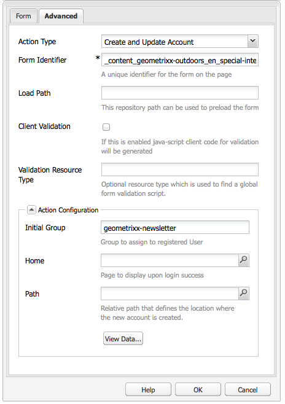

# Creazione di una pagina di destinazione efficace per la newsletter{#creating-an-effective-newsletter-landing-page}

Una pagina di destinazione efficace per la newsletter ti consente di iscrivere quante più persone possibile alla newsletter (o ad altre campagne di e-mail marketing). Per ottenere i lead, puoi utilizzare le informazioni raccolte dalle iscrizioni alle newsletter.

Per creare una pagina di destinazione efficace per la newsletter, devi effettuare le seguenti operazioni:

1. Crea un elenco per la newsletter in modo che le persone possano iscriversi alla newsletter.
1. Creare il modulo di registrazione. In questo caso, aggiungi un passaggio del flusso di lavoro che aggiunga automaticamente all’elenco dei lead la persona che si iscrive alla newsletter.
1. Crea una pagina di conferma che ringrazia gli utenti per la registrazione ed eventualmente offre loro una promozione.
1. Aggiungere teaser.

>[!NOTE]
>
>L’Adobe non prevede di migliorare ulteriormente questa funzionalità (Gestione di lead ed elenchi).
>Si consiglia di utilizzare [Adobe Campaign e l&#39;integrazione con AEM](/help/sites-administering/campaign.md).

## Creazione di un elenco per la newsletter {#creating-a-list-for-the-newsletter}

Crea un elenco, ad esempio **Newsletter di Geometrixx**, in MCM per la newsletter a cui gli utenti devono iscriversi. La creazione di elenchi è descritta in [Creazione di elenchi](/help/sites-classic-ui-authoring/classic-personalization-campaigns.md#creatingnewlists).

Di seguito è riportato un esempio di elenco:

## Creare un modulo di registrazione {#create-a-sign-up-form}

Crea un modulo di registrazione per newsletter che consenta agli utenti di iscriversi ai tag. Il Geometrixx Web di esempio include una pagina newsletter nella barra degli strumenti di Geometrixx in cui è possibile creare il modulo.

Per creare un modulo per newsletter personalizzato, consulta le informazioni sulla creazione di moduli nella [documentazione di Forms](/help/sites-authoring/default-components.md#form). La newsletter utilizza i tag della libreria Tag. Per aggiungere altri tag, vedere [Amministrazione tag](/help/sites-authoring/tags.md#tagadministration).

I campi nascosti nell’esempio seguente forniscono la quantità minima di informazioni (e-mail); inoltre, è possibile aggiungere altri campi in un secondo momento, ma questo influirà sul tasso di conversione.

L&#39;esempio seguente è un modulo creato in https://localhost:4502/cf#/content/geometrixx/en/toolbar/newsletter.html.

1. Crea il modulo.

   

1. Fai clic su **Modifica** nel componente Modulo per configurare il modulo in modo che passi a una pagina di ringraziamento (consulta [Creazione di pagine di ringraziamento](#creating-a-thank-you-page)).

   

1. Imposta l’azione Modulo (che si verifica quando invii il modulo) e configura il gruppo per assegnare gli utenti registrati all’elenco creato in precedenza (ad esempio, geometrixx-newsletter).

   

### Creazione di una pagina di ringraziamento {#creating-a-thank-you-page}

Quando gli utenti fanno clic su **Abbonati ora**, si desidera aprire automaticamente una pagina di ringraziamento. Crea la pagina di ringraziamento nella pagina Newsletter di Geometrixx. Dopo aver creato il modulo newsletter, modifica il componente Modulo e aggiungi il percorso alla pagina di ringraziamento.

L&#39;invio della richiesta porta l&#39;utente a una pagina di **ringraziamento** dopo la quale riceverà un&#39;e-mail. La pagina di ringraziamento è stata creata in /content/geometrixx/en/toolbar/newsletter/thank_you.

### Aggiunta di teaser {#adding-teasers}

Aggiungi [teaser](/help/sites-classic-ui-authoring/classic-personalization-campaigns.md#teasers) per indirizzare tipi di pubblico specifici. Ad esempio, puoi aggiungere teaser alla pagina di ringraziamento e alla pagina di iscrizione alla newsletter.

Per aggiungere teaser per creare una pagina di destinazione efficace per le newsletter:

1. Crea un paragrafo teaser per un regalo di iscrizione. Seleziona **First** come strategia e includi il testo che informa i destinatari del regalo che riceveranno.

   

1. Crea un paragrafo teaser per la pagina di ringraziamento. Seleziona **First** come strategia e includi il testo che indica che il regalo è in arrivo.

   

1. Crea una campagna con i due teaser: assegna un tag a business e uno a tutti e due.

### Invio di contenuti agli abbonati {#pushing-content-to-subscribers}

Invia le modifiche alle pagine tramite la funzionalità Newsletter in MCM. Dopodiché invii agli abbonati i contenuti aggiornati.

Consulta [Invio di newsletter](/help/sites-classic-ui-authoring/classic-personalization-campaigns.md#newsletters).
