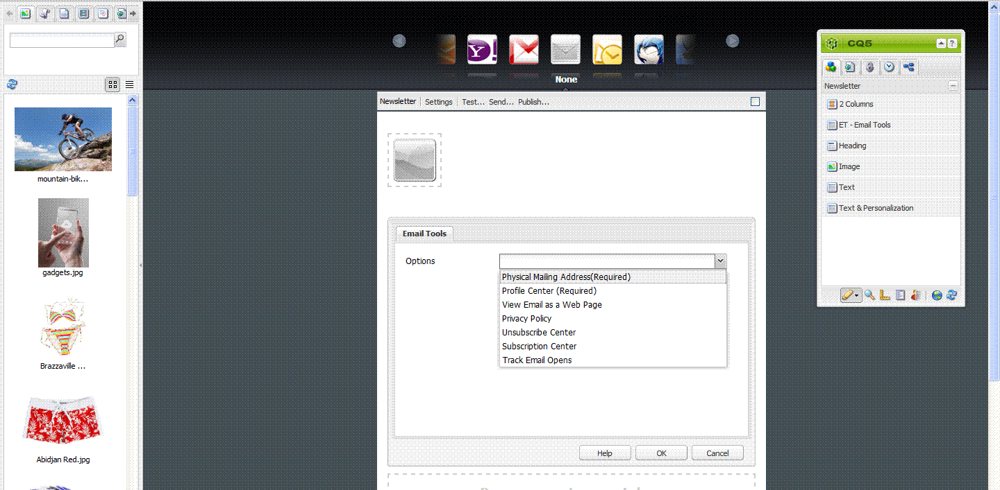
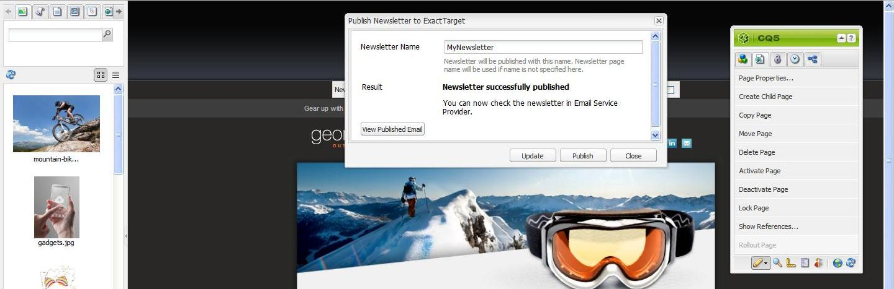

# Pubblicazione di un messaggio e-mail ai provider di servizi e-mail{#publishing-an-email-to-email-service-providers}

È possibile pubblicare newsletter in servizi di posta elettronica quali ExactTarget e Silverpop Engage. In questo documento viene descritto come configurare AEM per la pubblicazione di una newsletter in questi servizi di posta elettronica.

>[!NOTE]
>
>È necessario configurare il provider di servizi prima di creare e pubblicare un messaggio e-mail. Consulta [Configurazione di ExactTarget](/help/sites-administering/exacttarget.md) e [Configurazione di Silverpop Engage](/help/sites-administering/silverpop.md) per ulteriori informazioni.

Per pubblicare l’e-mail al provider di servizi e-mail, è necessario effettuare le seguenti operazioni:

1. Creare un messaggio e-mail.
1. Applica la configurazione del servizio e-mail all’e-mail.
1. Pubblica l’e-mail.

>[!NOTE]
>
>Se aggiorni i provider di posta elettronica, esegui un test di volo o invii una newsletter, queste operazioni non riusciranno se la newsletter non viene pubblicata prima nell’istanza Publish o se l’istanza Publish non è disponibile. Assicurati di pubblicare la newsletter e assicurati che l’istanza Publish sia attiva e in esecuzione.

## Creazione di un messaggio e-mail {#creating-an-email}

È possibile creare un’e-mail o un notiziario da pubblicare su un servizio di posta elettronica in una campagna utilizzando **Newsletter Geometrixx** modello. È inoltre possibile utilizzare **E-mail Geometrixx Outdoors** modello. Esempio di e-mail/newsletter basato su **E-mail Geometrixx Outdoors** I modelli sono disponibili all&#39;indirizzo `https://<hostname>:<port>/cf#/content/campaigns/geometrixx-outdoors/e-mails.html`.

Per creare un messaggio e-mail pubblicato nel servizio e-mail configurato:

1. Vai a **Siti Web** e poi **Campagne**. Seleziona una campagna.
1. Clic **Nuovo** per aprire **Crea pagina** finestra.
1. Inserisci il titolo, il nome e seleziona la **Newsletter Geometrixx** modello dall&#39;elenco dei modelli disponibili.
1. Fai clic su **Crea**.
1. Apri l’e-mail creata.
1. Passa alla modalità progettazione per selezionare i componenti da visualizzare nella barra laterale.
1. Passa alla modalità di modifica e inizia ad aggiungere contenuti (testo, immagini, [strumenti e-mail](#adding-exacttarget-email-tools-to-your-email), [variabili di personalizzazione](#adding-text-and-personalization-tool-to-your-e-mail)e così via).

### Aggiunta di strumenti e-mail ExactTarget all’e-mail {#adding-exacttarget-email-tools-to-your-email}

>[!NOTE]
>
>Questa sezione è specifica del servizio ExactTarget.

Il **Strumenti e-mail** Il componente per ExactTarget può aggiungere ulteriori funzionalità e-mail all’e-mail/newsletter.

1. Apri un’e-mail da pubblicare su ExactTarget.
1. Aggiungi il componente **ET - Strumenti e-mail** alla pagina utilizzando la barra laterale. Apri il componente in modalità Modifica.

   

1. Seleziona un’opzione dalla sezione **Opzioni** menu:

<table>
 <tbody>
  <tr>
   <td>Indirizzo postale (obbligatorio)</td>
   <td>Questo componente inserisce l’indirizzo postale fisico dell’organizzazione nell’e-mail.</td>
  </tr>
  <tr>
   <td>Centro profili (obbligatorio)</td>
   <td>Il centro profili è una pagina web in cui gli abbonati possono immettere e gestire le informazioni personali che si tengono su di loro.</td>
  </tr>
  <tr>
   <td>Visualizza e-mail come pagina Web</td>
   <td>Questo componente consente all’utente di visualizzare l’e-mail come pagina web.</td>
  </tr>
  <tr>
   <td>Informativa sulla privacy</td>
   <td>Questo componente inserisce il collegamento all’informativa sulla privacy nell’e-mail.  </td>
  </tr>
  <tr>
   <td>Centro per annullamento sottoscrizioni</td>
   <td>Consente all’utente di annullare l’iscrizione alla mailing list.</td>
  </tr>
  <tr>
   <td>Centro sottoscrizioni</td>
   <td>Un centro abbonamenti è una pagina web in cui un utente iscritto può controllare i messaggi ricevuti dalla tua organizzazione.</td>
  </tr>
  <tr>
   <td>Traccia aperture e-mail</td>
   <td>Componente nascosto che consente di utilizzare la funzione di tracciamento ExactTarget.  </td>
  </tr>
 </tbody>
</table>

>[!NOTE]
>
>Il **Opzioni** Il menu a discesa viene popolato solo se la configurazione ExactTarget viene applicata all’e-mail. Consulta [Applicazione della configurazione del servizio e-mail alle impostazioni e-mail](#applying-e-mail-service-configuration-to-e-mail-settings) per ulteriori informazioni.

1. Pubblica l’e-mail in ExactTarget.

   L’e-mail con gli strumenti e-mail è disponibile per l’utilizzo nell’account ExactTarget configurato.

>[!NOTE]
>
>* Gli URL all’interno degli strumenti e-mail vengono sostituiti (nell’e-mail ricevuta) dai rispettivi valori effettivi solo quando un’e-mail viene inviata utilizzando **Invio semplice** o **Invio guidato** ma non **Invia di prova**.
>
>* Sono necessari due degli strumenti e-mail: **Indirizzo postale (obbligatorio)** e **Centro profili (obbligatorio)**. Quando l’e-mail viene pubblicata su ExactTarget, per impostazione predefinita questi due strumenti e-mail vengono aggiunti al fondo di ogni e-mail.
>

### Aggiunta di testo e strumenti di personalizzazione alla posta elettronica {#adding-text-and-personalization-tool-to-your-e-mail}

Puoi aggiungere campi personalizzati in un messaggio e-mail aggiungendo il **Testo e personalizzazione** alla pagina:

1. Aprire il messaggio di posta elettronica da pubblicare nel servizio di posta elettronica.
1. Per abilitare il campo di personalizzazione dal servizio e-mail, aggiungi la configurazione del framework durante la configurazione del servizio e-mail. Consulta [configurazione di Silverpop Engage](/help/sites-administering/silverpop.md) e [configurazione di Exact Target](/help/sites-administering/exacttarget.md) per ulteriori informazioni.
1. Aggiungi il componente **Testo e personalizzazione** dalla barra laterale. Questo componente fa parte del gruppo newsletter. Apri questo componente in modalità di modifica.

   

1. Aggiungi il campo personalizzato richiesto al testo selezionando il campo dal menu a discesa e facendo clic su **Inserisci**.
1. Clic **OK** per terminare.

## Applicazione della configurazione del servizio di posta elettronica alle impostazioni di posta elettronica {#applying-e-mail-service-configuration-to-e-mail-settings}

Per applicare la configurazione del servizio di posta elettronica a una newsletter:

1. Creare una configurazione del servizio di posta elettronica.
1. Apri l’e-mail/newsletter.
1. Apri le impostazioni dell’e-mail/newsletter facendo clic su **Impostazioni** o facendo clic su **Proprietà pagina in** la spalla.
1. Clic **Aggiungi servizio** in **Cloud Service** scheda. Viene visualizzato l’elenco dei servizi. Seleziona la configurazione richiesta: **ExactTarget** o **Silverpop** - dall’elenco a discesa.

   

1. Fai clic su **OK**.

## Pubblicazione delle e-mail nel servizio e-mail {#publishing-emails-to-email-service}

Le e-mail/newsletter possono essere pubblicate nel servizio di posta elettronica seguendo questi passaggi:

1. Apri l’e-mail.
1. Prima di pubblicare un’e-mail, assicurati di aver applicato la configurazione corretta all’e-mail.
1. Fai clic su **Pubblica**. Verrà aperto il **Pubblica newsletter sul provider di servizi di posta elettronica** finestra.
1. Compila il **Nome newsletter** campo. L&#39;e-mail/newsletter viene pubblicata al provider del servizio di posta elettronica con questo nome. Se non viene fornito un nome e-mail, l’e-mail viene pubblicata utilizzando il nome della pagina della newsletter in AEM.
1. Fai clic su **Pubblica**.

   

   In caso di esito positivo, AEM conferma che puoi visualizzare l’e-mail in ExactTarget o Silverpop Engage.

   Se è presente ExactTarget, l’e-mail pubblicata può essere visualizzata facendo clic su **Visualizza e-mail pubblicata**. Questo ti porta direttamente alla newsletter pubblicata in ExactTarget ([https://members.exacttarget.com/](https://members.exacttarget.com/).).

>[!NOTE]
>
>Se viene pubblicata un’e-mail/newsletter con lo stesso nome di un’e-mail/newsletter già pubblicata, l’e-mail/newsletter precedente non viene sostituita. Viene invece creata una nuova e-mail/newsletter con lo stesso nome (gli ID di due newsletter sono tuttavia diversi).
>
>Quando si pubblica l’e-mail/newsletter per il provider di servizi di posta elettronica, l’e-mail/newsletter viene pubblicata anche nell’istanza di pubblicazione dell’AEM.
>

### Aggiornamento Di Un Messaggio Di Posta Elettronica Pubblicato {#updating-a-published-e-mail}

Il **Aggiorna** nella finestra di dialogo Pubblica consente di aggiornare una newsletter già pubblicata a un provider di servizi di posta elettronica. Nel caso in cui la newsletter non sia ancora stata pubblicata e **Aggiorna** clic, un pulsante **La newsletter non è pubblicata** viene visualizzato un messaggio.

Per aggiornare un messaggio e-mail pubblicato:

1. Apri l’e-mail/newsletter precedentemente pubblicata a un provider di servizi di posta elettronica che desideri ripubblicare dopo aver apportato modifiche all’e-mail/newsletter.
1. Fai clic su **Pubblica**. Il **Pubblica newsletter su Email Service Provider** viene visualizzata la finestra. Fai clic su **Aggiorna**.

   Per verificare se l’e-mail/newsletter è stata aggiornata su ExactTarget, fai clic su **Visualizza e-mail pubblicata**. In questo modo puoi passare all’e-mail pubblicata in ExactTarget.

   Per verificare se l&#39;e-mail/newsletter è stata aggiornata su Silverpop Email Service, visita il sito Silverpop Engage.
