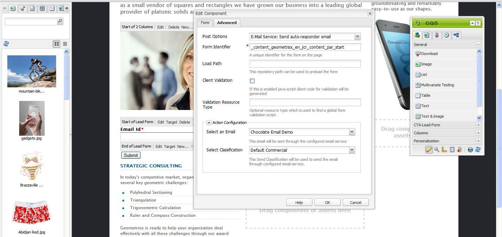

# Gestione delle sottoscrizioni{#managing-subscriptions}

>[!NOTE]
>
>Adobe non prevede di migliorare ulteriormente questa funzionalità (Gestione di lead ed elenchi).
>Si consiglia di utilizzare [Adobe Campaign e la sua integrazione con l’AEM](/help/sites-administering/campaign.md).

Agli utenti può essere richiesto di iscriversi a **Email Service Provider&#39;s** mailing list con l&#39;aiuto del **Modulo** componente utilizzato in una pagina web dell’AEM. Per preparare una pagina AEM con un modulo di iscrizione per l&#39;iscrizione alle mailing list del servizio di posta elettronica, è necessario applicare la configurazione del servizio corrispondente alla pagina AEM visitata dal potenziale abbonato.

## Applicazione della configurazione del servizio e-mail a una pagina {#applying-email-service-configuration-to-a-page}

Per configurare una pagina AEM:

1. Accedi a **Siti Web** scheda.
1. Seleziona la pagina da configurare per il servizio. Fai clic con il pulsante destro del mouse sulla pagina e seleziona **Proprietà**.

1. Seleziona **Cloud Service** allora **Aggiungi servizio**. Seleziona una configurazione dall’elenco delle configurazioni disponibili.

   

1. Fai clic su **OK**.

## Creazione di un modulo di iscrizione a una pagina AEM per iscriversi/annullare l’iscrizione agli elenchi {#creating-a-sign-up-form-on-an-aem-page-for-subscribing-unsubscribing-to-lists}

Per creare un modulo di iscrizione e configurarlo per gli abbonamenti alle mailing list del provider di servizi e-mail:

1. Apri la pagina dell’AEM che verrà visitata dall’utente.
1. Applica alla pagina la configurazione del provider di servizi e-mail.

1. Aggiungi un **Modulo** alla pagina trascinando il componente dalla barra laterale. Se il componente non è disponibile, passa alla modalità progettazione e abilita **Modulo** gruppo.
1. Clic **Modifica** nel **Inizio modulo** barra e passare alla **Avanzate** scheda.
1. In **Modulo** menu a discesa, seleziona **Servizio di posta elettronica: crea sottoscrittore** e aggiungi all&#39;elenco.
1. Nella parte inferiore della finestra di dialogo, apri **Configurazione azione** , che consente di selezionare uno o più elenchi di abbonamento.
1. In **Seleziona elenco**, seleziona l’elenco a cui desideri abbonare gli utenti. È possibile aggiungere più elenchi utilizzando il pulsante più (**Aggiungi elemento**).

   

   >[!NOTE]
   >
   >La finestra di dialogo può variare a seconda del provider di servizi di posta elettronica.

1. In **Modulo** , selezionare la pagina di ringraziamento alla quale si desidera che gli utenti accedano dopo aver inviato il modulo. Se il campo viene lasciato vuoto, il modulo verrà nuovamente visualizzato dopo l&#39;invio. Clic **OK**. Un **ID e-mail** Il componente viene visualizzato nel modulo, che consente di creare un modulo in cui gli utenti possono inviare i propri indirizzi e-mail per iscriversi o annullare l’iscrizione a una mailing list.
1. Aggiungi il **Invia** componente pulsante da **Modulo** sezione nella barra laterale.

   Modulo pronto. Pubblica la pagina configurata nei passaggi precedenti insieme alla **grazie** all’istanza Publish. Tutti i potenziali abbonati che visitano la pagina possono compilare il modulo e iscriversi all’elenco fornito nella configurazione.

   >[!NOTE]
   >
   >Per eseguire correttamente la funzione di abbonamento al modulo: [le chiavi di crittografia dell’autore devono essere esportate e importate nell’istanza Publish](#exporting-keys-from-author-and-importing-on-publish).

## Esportazione delle chiavi dall’ambiente di authoring e importazione al momento della pubblicazione {#exporting-keys-from-author-and-importing-on-publish}

Affinché l’abbonamento e l’annullamento dell’abbonamento al servizio di posta elettronica funzionino tramite il modulo di abbonamento nell’istanza di pubblicazione, è necessario seguire questi passaggi:

1. Nell’istanza di authoring, passa a Gestione pacchetti.
1. Crea un pacchetto. Imposta il filtro come `/etc/key`.
1. Genera e scarica il pacchetto.
1. Passa a Gestione pacchetti nell’istanza di pubblicazione e carica questo pacchetto.
1. Passa alla console OSGI Publish e riavvia il bundle denominato **Supporto Adobe per crittografia Granite**.

## Annullamento dell’iscrizione degli utenti agli elenchi {#unsubscribing-users-from-lists}

Per annullare l’iscrizione degli utenti agli elenchi:

1. Apri le proprietà della pagina dell’AEM contenente il modulo di iscrizione per annullare l’iscrizione di un lead.
1. Applica la configurazione del servizio alla pagina.
1. Crea un modulo di iscrizione sulla pagina.
1. Durante la configurazione del componente, seleziona l’azione **Servizio di posta elettronica**: **Annulla l’iscrizione dell’utente all’elenco.**
1. Dal menu a discesa, seleziona l’elenco appropriato da cui l’utente verrà rimosso al momento dell’annullamento dell’abbonamento.

   

1. Esporta le chiavi dall’autore alla pubblicazione.

## Configurazione delle e-mail di risposta automatica per il servizio e-mail {#configuring-auto-responder-emails-for-email-service}

Per configurare un messaggio e-mail di risposta automatica per un abbonato:

1. Apri le proprietà della pagina dell’AEM che dispongono del modulo di iscrizione per configurare il risponditore automatico per un lead.
1. Applica la configurazione ExactTarget alla pagina.

1. Aggiungi un **Modulo** alla pagina trascinando il componente dalla barra laterale. Se il componente non è disponibile, passa alla modalità progettazione e abilita **Modulo** gruppo.
1. Clic **Modifica** nel **Inizio modulo** barra e passare alla **Avanzate** scheda.
1. In **Modulo** menu a discesa, seleziona **Servizio e-mail: invia un messaggio e-mail di risposta automatica.**
1. **Seleziona un messaggio e-mail** (si tratta dell’e-mail inviata come messaggio di risposta automatica).

1. **Seleziona classificazione** (questa classificazione viene utilizzata per inviare l’e-mail).
1. Seleziona la **Grazie** pagina (la pagina a cui gli utenti vengono indirizzati dopo l’invio del modulo).

   In **Modulo** , selezionare la pagina di ringraziamento a cui si desidera che gli utenti accedano dopo aver inviato il modulo. Se non specificato, il modulo viene visualizzato nuovamente dopo l&#39;invio. Fai clic su **OK**.

1. Esporta le chiavi dall’autore alla pubblicazione.
1. Aggiungi il **Invia** componente pulsante da **Modulo** sezione nella barra laterale.

   Il modulo di iscrizione è pronto. Pubblica la pagina configurata nei passaggi precedenti insieme alla **grazie** all’istanza Publish. Tutti i potenziali abbonati che visitano la pagina possono compilare il modulo e all’invio del modulo il visitatore riceverà un’e-mail di risposta automatica sull’ID e-mail compilato nel modulo.

   >[!NOTE]
   >
   >Per garantire il corretto funzionamento dell&#39;abbonamento al modulo di iscrizione, [le chiavi di crittografia dell’autore devono essere esportate e importate nell’istanza Publish](#exporting-keys-from-author-and-importing-on-publish).

   
