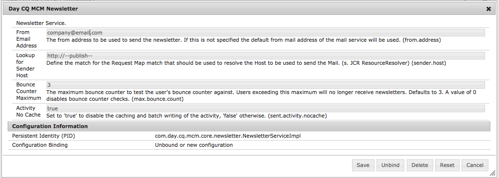

# Tracciamento delle e-mail non recapitate{#tracking-bounced-emails}

>[!NOTE]
>
>L’Adobe non prevede di migliorare ulteriormente il tracciamento delle e-mail aperte/non recapitate inviate dal servizio SMTP dell’AEM.
>
>Si consiglia di: [utilizzare Adobe Campaign e la sua integrazione con l’AEM](/help/sites-administering/campaign.md).

Quando invii una newsletter a molti utenti, solitamente sono presenti alcuni indirizzi e-mail non validi nell’elenco. L&#39;invio di newsletter a tali indirizzi viene reindirizzato. L’AEM può gestire tali mancati recapiti e interrompere l’invio di newsletter a tali indirizzi dopo il superamento del contatore dei mancati recapiti configurato. Per impostazione predefinita, la frequenza di mancato recapito è impostata su 3 ma è configurabile.

Per impostare l’AEM in modo da tenere traccia delle e-mail non consegnate, imposta l’AEM per eseguire il polling di una cassetta postale esistente in cui vengono ricevute le e-mail non consegnate. Di solito, questa posizione è l’indirizzo e-mail &quot;da&quot; che specifichi dove invii la newsletter. L’AEM esegue il polling di questa casella in entrata e importa tutte le e-mail al di sotto del percorso specificato nella configurazione di polling. Viene quindi attivato un flusso di lavoro per cercare gli indirizzi e-mail non recapitati all’interno degli utenti e aggiorna di conseguenza il valore della proprietà bounceCounter dell’utente. Una volta superato il numero massimo configurato di mancati recapiti, l’utente viene rimosso dall’elenco delle newsletter.

## Configurazione di Importazione feed {#configuring-the-feed-importer}

L’importazione dei feed consente di importare ripetutamente contenuti da origini esterne nell’archivio. Con questa configurazione dell’importazione feed, l’AEM controlla se nella cassetta postale del mittente sono presenti e-mail non consegnate.

Per configurare l’importazione feed per il tracciamento delle e-mail non recapitate, effettua le seguenti operazioni:

1. In entrata **Strumenti**, selezionare Importazione feed.

1. Clic **Aggiungi** per creare una configurazione.

   

1. Aggiungi una configurazione selezionando il tipo e aggiungendo informazioni all&#39;URL di polling in modo da poter configurare l&#39;host e la porta. Inoltre, aggiungi alcuni parametri specifici di posta e protocollo alla query URL. Imposta la configurazione per il polling almeno una volta al giorno.

   Tutte le configurazioni richiedono informazioni sui seguenti elementi nell’URL di polling:

   `username`: nome utente utilizzato per la connessione

   `password`: password utilizzata per la connessione

   Inoltre, a seconda del protocollo, è possibile configurare alcune impostazioni.

   **Proprietà di configurazione POP3:**

   `pop3.leave.on.server`: definisce se lasciare o meno i messaggi sul server. Impostare su true per lasciare i messaggi sul server, altrimenti su false. Impostazione predefinita: true.

   **Esempi POP3:**

   | pop3s://pop.gmail.com:995/INBOX?username=user&amp;password=secret | Utilizzo di pop3 su SSL per connettersi a GMail sulla porta 995 con utente/segreto, lasciando i messaggi sul server per impostazione predefinita |
   |---|---|
   | pop3s://pop.gmail.com:995/INBOX?username=user&amp;password=secret&amp;pop3.leave.on.server=false | pop3s://pop.gmail.com:995/INBOX?username=user&amp;password=secret&amp;pop3.leave.on.server=false |

   **Proprietà di configurazione IMAP:**

   Consente di impostare i flag per la ricerca.

   `imap.flag.SEEN`: imposta false per i messaggi nuovi/non visualizzati, true per i messaggi già letti

   Consulta [https://javaee.github.io/javamail/docs/api/index.html?javax/mail/Flags.Flag.html](https://javaee.github.io/javamail/docs/api/index.html?javax/mail/Flags.Flag.html) per l&#39;elenco completo dei flag.

   **Esempi di IMAP:**

   | imaps://imap.gmail.com:993/inbox?username=user&amp;password=secret | Utilizzo di IMAP su SSL per la connessione a GMail sulla porta 993 con user/secret. Ricezione di nuovi messaggi solo per impostazione predefinita. |
   |---|---|
   | imaps://imap.gmail.com:993/inbox?username=user&amp;password=secret&amp;imap.flag.SEEN=true | Utilizzo di IMAP su SSL per connettersi a GMail 993 con utente/segreto, visualizzando solo il messaggio già visualizzato. |
   | imaps://imap.gmail.com:993/inbox?username=user&amp;password=secret&amp;imap.flag.SEEN=true&amp;imap.flag.SEEN=false | Utilizzo di IMAP su SSL per la connessione a GMail 993 con utente/segreto, lettura già effettuata o nuovi messaggi. |

1. Salva la configurazione.

## Configurazione del componente del servizio newsletter {#configuring-the-newsletter-service-component}

Dopo aver configurato l’importazione feed, configura l’indirizzo Da e il contatore dei messaggi non recapitati.

Per configurare il servizio newsletter:

1. Nella console OSGi, vai a `<host>:<port>/system/console/configMgr`, passa a **Newsletter MCM**.

1. Al termine, configura il servizio e salva le modifiche.

   

   Per regolare il comportamento, è possibile impostare le seguenti configurazioni:

   | Numero massimo contatore rimbalzo (max.bounce.count) | Definisce il numero di mancati recapiti fino a quando un utente non viene omesso durante l’invio di una newsletter. Impostando questo valore su 0 si disabilita completamente il controllo dei messaggi non recapitati. |
   |---|---|
   | Attività senza cache (sent.activity.nocache) | Definisce l’impostazione della cache da utilizzare per l’attività di invio della newsletter |

   Una volta salvato, il servizio MCM per le newsletter esegue le seguenti operazioni:

   * Scrive un’attività agli utenti nascosti in seguito all’invio corretto di una newsletter.
   * Scrive un&#39;attività se viene rilevato un mancato recapito e il contatore di mancato recapito degli utenti cambia.
