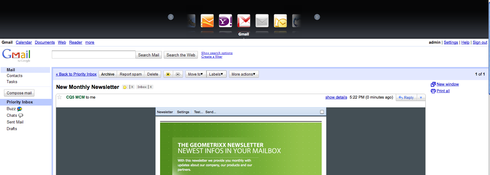
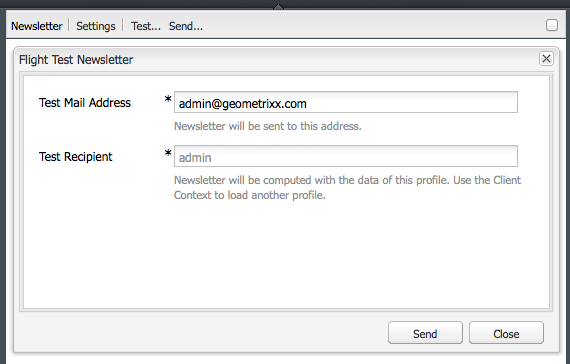

# E-mail marketing{#e-mail-marketing}

>[!NOTE]
>
>L’Adobe non prevede di migliorare ulteriormente il tracciamento dei messaggi e-mail di messaggi aperti/non recapitati (non consegnabili) inviati dal servizio SMTP dell’AEM.
>Si consiglia di utilizzare [Adobe Campaign e l&#39;integrazione con l&#39;AEM](/help/sites-administering/campaign.md).

Il marketing via e-mail (ad esempio le newsletter) è una parte importante di qualsiasi campagna di marketing, in quanto viene utilizzato per inviare contenuti ai lead. In AEM, puoi creare newsletter da contenuti AEM esistenti e aggiungere nuovi contenuti, specifici alle newsletter.

Una volta create, è possibile inviare newsletter a un gruppo specifico di utenti immediatamente o in un altro momento pianificato (tramite un flusso di lavoro). Inoltre, gli utenti possono iscriversi alle newsletter nel formato scelto.

AEM consente inoltre di gestire la funzionalità delle newsletter, inclusi la gestione di argomenti, l&#39;archiviazione di newsletter e la visualizzazione di statistiche sulle newsletter.

>[!NOTE]
>
>In Geometrixx, il modello di newsletter apre automaticamente l’editor e-mail. Puoi utilizzare l’editor e-mail in altri modelli in cui desideri inviare e-mail, ad esempio gli inviti. L’editor e-mail viene visualizzato ogni volta che una pagina viene ereditata da **mcm/components/newsletter/page**.

Questo documento descrive le nozioni di base sulla creazione di newsletter in AEM. Per informazioni più dettagliate su come utilizzare il marketing via posta elettronica, vedere i seguenti documenti:

* [Creazione di una pagina di destinazione efficace per la newsletter](/help/sites-classic-ui-authoring/classic-personalization-campaigns-email-landingpage.md)
* [Gestione delle sottoscrizioni](/help/sites-classic-ui-authoring/classic-personalization-campaigns-email-subscriptions.md)
* [Pubblicazione di un messaggio e-mail ai provider di servizi e-mail](/help/sites-classic-ui-authoring/classic-personalization-campaigns-email-newsletters.md)
* [Tracciamento delle e-mail non recapitate](/help/sites-classic-ui-authoring/classic-personalization-campaigns-email-tracking-bounces.md)

>[!NOTE]
>
>Se aggiorni i provider di posta elettronica, esegui un test di volo o invii una newsletter, queste operazioni non riusciranno se la newsletter non viene pubblicata prima nell’istanza Publish o se l’istanza Publish non è disponibile. Assicurati di pubblicare la newsletter e assicurati che l’istanza Publish sia attiva e in esecuzione.

## Creazione di un’esperienza newsletter {#creating-a-newsletter-experience}

>[!NOTE]
>
>Le notifiche e-mail devono essere configurate tramite la configurazione osgi. Consulta [Configurazione della notifica e-mail.](/help/sites-administering/notification.md)

1. Seleziona la nuova campagna nel riquadro a sinistra oppure fai doppio clic su di essa nel riquadro a destra.

1. Seleziona la vista a elenco, utilizzando l’icona:

   

1. Clic **Nuovo...**

   È possibile specificare **Titolo**, **Nome** e il tipo di esperienza da creare; in questo caso, Newsletter.

   

1. Fai clic su **Crea**.

1. Viene immediatamente visualizzata una nuova finestra di dialogo. Qui puoi immettere le proprietà per la newsletter.

   Il **Elenco destinatari predefiniti** è un campo obbligatorio in quanto costituisce il punto di contatto per la newsletter (consulta [Utilizzo degli elenchi](/help/sites-classic-ui-authoring/classic-personalization-campaigns.md#workingwithlists) per ulteriori informazioni sugli elenchi).

   

   * **Nome mittente**
Nome che deve apparire come mittente della newsletter.

   * **Indirizzo mittente**
Indirizzo e-mail che deve apparire come mittente della newsletter.

   * **Oggetto**
Oggetto della newsletter.

   * **Rispondi a**
Indirizzo e-mail a cui devono essere inviate le risposte per la newsletter inviata.

   * **Descrizione**
Descrizione della newsletter.

   * **Ora di attivazione**
L’ in tempo per l’invio della newsletter.

   * **Elenco destinatari predefiniti**
Elenco predefinito che deve ricevere la newsletter.

   Questi possono essere aggiornati in una fase successiva dal **Proprietà...** .

1. Clic **OK** per salvare.

## Aggiunta di contenuto alle newsletter {#adding-content-to-newsletters}

Puoi aggiungere contenuti, incluso il contenuto dinamico, alla newsletter come faresti in qualsiasi componente AEM. In Geometrixx, il modello Newsletter include alcuni componenti disponibili per aggiungere e modificare contenuti nelle newsletter.

1. In MCM, fai clic su **Campagne** e fai doppio clic sulla newsletter a cui desideri aggiungere o modificare contenuti. Viene visualizzata la newsletter.

1. Se i componenti non sono visibili, vai alla vista Progettazione e abilita i componenti necessari (ad esempio, i componenti Newsletter) prima di iniziare la modifica.
1. Inserisci il testo, le immagini o altri componenti nuovi, a seconda delle necessità. Geometrixx Nell’esempio sono disponibili 4 componenti: Testo, Immagine, Intestazione e 2 Colonne. La newsletter può contenere più o meno componenti a seconda della configurazione.

   >[!NOTE]
   >
   >Puoi personalizzare le newsletter utilizzando le variabili. Nella newsletter Geometrixx, le variabili sono disponibili nel componente Testo. I valori per le variabili vengono ereditati dalle informazioni nel profilo utente.

   

1. Per inserire delle variabili, selezionale dall’elenco e fai clic su **Inserisci**. Le variabili vengono compilate dal profilo.

## Personalizzazione delle newsletter {#personalizing-newsletters}

Per personalizzare le newsletter, inserisci variabili predefinite nel componente Testo delle newsletter in Geometrixx. I valori per le variabili vengono ereditati dalle informazioni nel profilo utente.

Puoi anche simulare il modo in cui una newsletter viene personalizzata utilizzando il contesto del cliente e caricando un profilo.

Per personalizzare una newsletter e simulare il suo aspetto:

1. Da MCM, apri la newsletter per la quale desideri personalizzare le impostazioni.

1. Apri il componente Testo che desideri personalizzare.

1. Posiziona il cursore nel punto in cui vuoi visualizzare la variabile, seleziona una variabile dall’elenco a discesa e fai clic su **Inserisci**. Esegui questa operazione per tutte le variabili necessarie e fai clic su **OK**.

   

1. Per simulare l&#39;aspetto della variabile inviata, premere CTRL+ALT+C per aprire il contesto del client e selezionare **Carica**. Seleziona l’utente dall’elenco di cui desideri caricare il profilo e fai clic su **OK**.

   Le informazioni del profilo caricato hanno popolato le variabili.

   

## Verifica delle newsletter in client di posta elettronica diversi {#testing-newsletters-in-different-e-mail-clients}

>[!NOTE]
>
>Prima di inviare le newsletter, controlla la configurazione OSGi di Day CQ Link Externalizer all’indirizzo `https://localhost:4502/system/console/configMgr`.
>
>Per impostazione predefinita, il valore del parametro è `localhost:4502` L&#39;operazione and non può essere completata se la porta per l&#39;istanza in esecuzione viene modificata.

Passa ai diversi client e-mail più diffusi per vedere come la newsletter verrà visualizzata dai lead. Per impostazione predefinita, la newsletter si apre senza che sia selezionato nessuno dei client di posta elettronica.

Attualmente è possibile visualizzare le newsletter nei seguenti client di posta elettronica:

* Yahoo mail
* Gmail
* Hotmail
* Thunderbird
* Microsoft Outlook 2007
* Apple Mail

Per passare da un client all&#39;altro, fare clic sull&#39;icona corrispondente per visualizzare la newsletter nel client di posta elettronica:

1. Da MCM, apri la newsletter per la quale desideri personalizzare le impostazioni.

1. Fai clic su un client di posta elettronica nella barra superiore per visualizzare l’aspetto della newsletter in tale client.

   

1. Ripetere questo passaggio per tutti i client di posta elettronica aggiuntivi che si desidera visualizzare.

   

## Personalizzazione delle impostazioni della newsletter {#customizing-newsletter-settings}

Anche se solo gli utenti autorizzati possono inviare una newsletter, è necessario personalizzare quanto segue:

* L’oggetto, in modo che gli utenti desiderino aprire l’e-mail e anche per garantire che la newsletter non venga contrassegnata come spam.
* L&#39;indirizzo del mittente, ad esempio `noreply@geometrixx.com`, in modo che gli utenti ricevano la posta elettronica da un indirizzo specificato.

Per personalizzare le impostazioni delle newsletter:

1. Da MCM, apri la newsletter per la quale desideri personalizzare le impostazioni.

   

1. Nella parte superiore della newsletter, fai clic su **Impostazioni**.

   
1. Inserisci il **Da** indirizzo e-mail

1. Modifica il **Oggetto** del messaggio di posta elettronica, se necessario.

1. Seleziona un **Elenco destinatari predefiniti** dall’elenco a discesa.

1. Fai clic su **OK**.

   Quando verifichi o invii la newsletter, i destinatari riceveranno e-mail con l’indirizzo e-mail e l’oggetto specificati.

## Newsletter di prova di volo {#flight-testing-newsletters}

Anche se il test di volo non è obbligatorio, prima di inviare una newsletter, è consigliabile verificarla per assicurarsi che venga visualizzata nel modo desiderato.

I test di volo consentono di effettuare le seguenti operazioni:

* Guarda la newsletter in [tutti i clienti previsti](#testing-newsletters-in-different-e-mail-clients).
* Verificare che il server di posta sia configurato correttamente.
* Determina se l’e-mail viene contrassegnata come spam. Assicurati di includere te stesso/a nell’elenco dei destinatari.

>[!NOTE]
>
>Se aggiorni i provider di posta elettronica, esegui un test di volo o invii una newsletter, queste operazioni non riusciranno se la newsletter non viene pubblicata prima nell’istanza Publish o se l’istanza Publish non è disponibile. Assicurati di pubblicare la newsletter e assicurati che l’istanza Publish sia attiva e in esecuzione.

Per visualizzare i notiziari di prova di volo:

1. Da MCM, apri la newsletter da testare e inviare.

1. Nella parte superiore della newsletter, fai clic su **Test** da verificare prima dell’invio.

   

1. Inserisci l’indirizzo e-mail del test in cui desideri inviare la newsletter e fai clic su **Invia**. Se desideri modificare il profilo, carica un altro profilo nel contesto client. A tale scopo, premere CTRL+ALT+C e selezionare Carica e carica un profilo.

## Invio di newsletter {#sending-newsletters}

>[!NOTE]
>
>L’Adobe non prevede di migliorare ulteriormente il tracciamento dei messaggi e-mail di messaggi aperti/non recapitati (non consegnabili) inviati dal servizio SMTP dell’AEM.
>Si consiglia di utilizzare [Adobe Campaign e l&#39;integrazione con l&#39;AEM](/help/sites-administering/campaign.md).

Puoi inviare una newsletter dalla newsletter o dall’elenco. Entrambe le procedure sono descritte.

>[!NOTE]
>
>Prima di inviare le newsletter, controlla la configurazione OSGi di Day CQ Link Externalizer all’indirizzo `https://localhost:4502/system/console/configMgr`.
>
>Per impostazione predefinita, il valore del parametro è `localhost:4502` L&#39;operazione and non può essere completata se la porta per l&#39;istanza in esecuzione viene modificata.

>[!NOTE]
>
>Se aggiorni i provider di posta elettronica, esegui un test di volo o invii una newsletter, queste operazioni non riusciranno se la newsletter non viene pubblicata prima nell’istanza Publish o se l’istanza Publish non è disponibile. Assicurati di pubblicare la newsletter e assicurati che l’istanza Publish sia attiva e in esecuzione.

### Invio di newsletter da una campagna {#sending-newsletters-from-a-campaign}

Per inviare una newsletter dall’interno della campagna:

1. Da MCM, apri la newsletter da inviare.

   >[!NOTE]
   >
   >Prima dell&#39;invio, assicurarsi di aver personalizzato l&#39;oggetto della newsletter e l&#39;indirizzo di posta elettronica di origine [personalizzazione delle impostazioni](#customizing-newsletter-settings).
   >
   >
   >[Prove di volo](#flight-testing-newsletters) si consiglia di inserire la newsletter prima dell’invio.

1. Nella parte superiore della newsletter, fai clic su **Invia**. Viene visualizzata la procedura guidata della newsletter.

1. Nell’elenco del destinatario, seleziona l’elenco che desideri ricevere la newsletter e fai clic su **Successivo**.

   

1. Il completamento dell&#39;installazione è confermato. Clic **Invia** per inviare effettivamente la newsletter.

   

   >[!NOTE]
   >
   >Assicurati di essere uno dei destinatari in modo da poter verificare che la newsletter sia stata ricevuta.

### Invio di newsletter da un elenco {#sending-newsletters-from-a-list}

Per inviare una newsletter da un elenco:

1. In MCM, fai clic su **Elenchi** nel riquadro a sinistra.

   >[!NOTE]
   >
   >Prima dell&#39;invio, assicurarsi di aver personalizzato l&#39;oggetto della newsletter e l&#39;indirizzo di posta elettronica di origine [personalizzazione delle impostazioni](#customizing-newsletter-settings). Non è possibile testare una newsletter inviandola dall&#39;elenco; è possibile [prova di volo](#flight-testing-newsletters) se lo invii dalla newsletter.

1. Selezionare la casella di controllo accanto all&#39;elenco dei lead a cui si desidera inviare una newsletter.

1. In **Strumenti** menu, seleziona **Invia newsletter**. Il **Invia newsletter** viene visualizzata la finestra.

   

1. In **Newsletter** , seleziona la newsletter da inviare e fai clic su **Successivo**.

   

1. Il completamento dell&#39;installazione è confermato. Clic **Invia** per inviare la newsletter selezionata all&#39;elenco di lead specificato.

   

   La newsletter viene inviata ai destinatari selezionati.

## Iscrizione a una newsletter {#subscribing-to-a-newsletter}

Questa sezione descrive come abbonarsi a una newsletter.

### Iscrizione a una newsletter {#subscribing-to-a-newsletter-1}

Per iscriversi a una newsletter (utilizzando il sito Web Geometrixx come esempio):

1. Clic **Siti Web** e passare alla Geometrixx **Barra degli strumenti** e aprilo.

   

1. Nella newsletter Geometrixx **Registrati** , immettere l&#39;indirizzo di posta elettronica e fare clic su **Registrati**. Sei abbonato alla newsletter.
