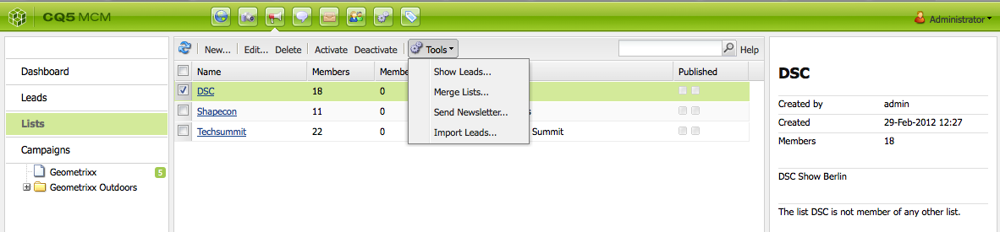

# E-mail marketing{#e-mail-marketing}

>[!NOTE]
>
>Adobe non intende migliorare ulteriormente il tracciamento di e-mail aperte o non recapitate inviate dal servizio SMTP di AEM.
>Si consiglia di utilizzare [Adobe Campaign e l’integrazione con AEM](/help/sites-administering/campaign.md).

Le comunicazioni di e-mail marketing, come le newsletter, sono una parte importante delle campagne marketing, in quanto utili a veicolare i contenuti verso i lead. In AEM è possibile creare newsletter a partire da contenuti AEM esistenti, nonché aggiungere nuovi contenuti specifici per le newsletter.

Una volta create, è possibile inviare le newsletter a un gruppo specifico di utenti immediatamente o in un altro orario pianificato (tramite un flusso di lavoro). Inoltre, gli utenti possono registrarsi alle newsletter nel formato di loro scelta.

AEM permette inoltre di amministrare la funzionalità newsletter e di effettuare operazioni quali la manutenzione dei topic, l’archiviazione delle newsletter e la visualizzazione delle relative statistiche.

>[!NOTE]
>
>In Geometrixx, il modello per newsletter apre automaticamente l’editor e-mail. Questo può essere utilizzato in altri modelli per l’invio di e-mail, ad esempio per inviti. L’editor e-mail viene visualizzato ogni volta che una pagina viene ereditata da **mcm/components/newsletter/page**.

Questo documento descrive le nozioni di base per la creazione di newsletter in AEM. Per informazioni più dettagliate su come lavorare con l’e-mail marketing, consulta i seguenti documenti:

* [Creazione di una pagina di destinazione efficace per una newsletter](/help/sites-classic-ui-authoring/classic-personalization-campaigns-email-landingpage.md)
* [Gestione delle registrazioni](/help/sites-classic-ui-authoring/classic-personalization-campaigns-email-subscriptions.md)
* [Pubblicazione di un’e-mail ai provider di servizi e-mail](/help/sites-classic-ui-authoring/classic-personalization-campaigns-email-newsletters.md)
* [Tracciamento dei messaggi e-mail non pervenuti a destinazione](/help/sites-classic-ui-authoring/classic-personalization-campaigns-email-tracking-bounces.md)

>[!NOTE]
>
>Se devi aggiornare i provider e-mail, eseguire un invio di prova o inviare una newsletter, queste operazioni non vanno a buon fine se la newsletter non viene prima pubblicata nell’istanza Pubblica o se l’istanza Pubblica non è disponibile. Assicurati di pubblicare la newsletter e che l’istanza Pubblica sia attiva e funzionante.

## Creazione di un’esperienza Newsletter {#creating-a-newsletter-experience}

>[!NOTE]
>
>Le notifiche e-mail devono essere configurate mediante la configurazione osgi. Consulta [Configurazione delle notifiche e-mail.](/help/sites-administering/notification.md)

1. Selezionate la nuova campagna nel riquadro a sinistra oppure fate doppio clic nel riquadro a destra.

1. Selezionate la vista Elenco tramite la relativa icona:

   

1. Fate clic su **Nuovo...**

   Potete specificare il **Titolo**, **Nome** e tipo di esperienza da creare, che in questo caso sarà Newsletter.

   

1. Fai clic su **Crea**.

1. Si apre automaticamente una nuova finestra di dialogo in cui puoi inserire le proprietà della newsletter.

   Il campo **Elenco destinatari predefiniti** è obbligatorio in quanto il modulo rappresenta il punto di contatto per la newsletter (consulta [Lavorare con gli elenchi](/help/sites-classic-ui-authoring/classic-personalization-campaigns.md#workingwithlists)).

   

   * **Nome mittente** Nome che deve apparire come mittente della newsletter.

   * **Indirizzo mittente** Indirizzo mail che deve apparire come mittente della newsletter.

   * **Oggetto** Oggetto della newsletter.

   * **Rispondi a** Indirizzo e-mail a cui saranno inviate le risposte dalla newsletter inviata.

   * **Descrizione** Descrizione della newsletter.

   * **Ora di attivazione** Il tempo necessario per l’invio della newsletter.

   * **Elenco destinatari predefiniti** Elenco predefinito che deve ricevere la newsletter.
   Questi potranno essere aggiornati successivamente dalla finestra di dialogo **Proprietà**.

1. Fate clic su **OK** per salvare. 

## Aggiunta di contenuti a una newsletter {#adding-content-to-newsletters}

Per aggiungere alla newsletter dei contenuti, compresi contenuti dinamici, si procede come per qualsiasi altro componente AEM. In Geometrixx, il modello Newsletter dispone di alcuni componenti disponibili per aggiungere e modificare contenuti nelle newsletter.

1. In MCM, fate clic sulla scheda **Campagne** e quindi fate doppio clic sulla newsletter a cui si desidera aggiungere del contenuto. Viene aperta la newsletter.

1. Se i componenti non sono visibili, prima di avviare la modifica passate alla vista Progettazione e attivate i componenti necessari (ad esempio, il componente Newsletter).
1. Inserisci il testo, le immagini e gli altri componenti richiesti. Nell’esempio di Geometrixx, sono disponibili 4 componenti: Testo, Immagine, Intestazione e 2 Colonne. La newsletter può essere composta di più o meno componenti in base a come viene impostata.

   >[!NOTE]
   >
   >Per personalizzare le newsletter si utilizzano le variabili. Nella newsletter di Geometrixx, le variabili sono disponibili nel componente Testo. I valori delle variabili vengono ereditati dalle informazioni presenti nel profilo utente.

   

1. Per inserire una variabile, selezionala dall’elenco e fai clic su **Inserisci**. Le variabili vengono popolate dai dati del profilo.

## Personalizzazione delle newsletter {#personalizing-newsletters}

Per personalizzare le newsletter si inseriscono delle variabili precedentemente definite nel componente Testo delle newsletter di Geometrixx. I valori delle variabili vengono ereditati dalle informazioni presenti nel profilo utente.

È inoltre possibile simulare il modo in cui una newsletter viene personalizzata mediante l’utilizzo di ClientContext e il caricamento di un profilo.

Per personalizzare una newsletter e simularne l’aspetto risultante:

1. In MCM, aprite la newsletter di cui desiderate personalizzare le impostazioni.

1. Aprite il componente Testo da personalizzare.

1. Portate il cursore dove deve comparire la variabile e selezionate quest’ultima dall’elenco a discesa, quindi fate clic su **Inserisci**. Ripeti questa operazione per tutte le variabili richieste, quindi fai clic su **OK**.

   

1. Per simulare l’aspetto della variabile quando inviata, premi CTRL+ALT+c per aprire il ClientContext e seleziona **Carica**. Selezionate dall’elenco l’utente di cui desiderate caricare il profilo e fate clic su **OK**.

   Le variabili vengono popolate con le informazioni presenti nel profilo caricato.

   

## Verifica delle newsletter in diversi client e-mail {#testing-newsletters-in-different-e-mail-clients}

>[!NOTE]
>
>Prima di inviare le newsletter, controlla la configurazione OSGi per Day CQ Link Externalizer all’indirizzo `https://localhost:4502/system/console/configMgr`.
>
>Per impostazione predefinita, il valore del parametro è `localhost:4502` e l’operazione non può essere completata se si cambia la porta per l’esecuzione dell’istanza.

Passa ai diversi client e-mail più diffusi per vedere come la newsletter verrà visualizzata dai lead. Per impostazione predefinita, la newsletter viene aperta senza che nessuno dei client e-mail sia selezionato.

Attualmente, è possibile visualizzare le newsletter con i seguenti client e-mail:

* Yahoo! Mail
* Gmail
* Hotmail
* Thunderbird
* Microsoft Outlook 2007
* Apple Mail

Per passare ai diversi client e visualizzare la newsletter nel client e-mail, fai clic sulla relativa icona:

1. In MCM, aprite la newsletter di cui desiderate personalizzare le impostazioni.

1. Fate clic su un client e-mail nella barra superiore per verificare come si presenterà la newsletter in tale client.

   

1. Ripetete questo passaggio per eventuali altri client e-mail.

   

## Personalizzazione delle impostazioni per newsletter {#customizing-newsletter-settings}

Benché solo gli utenti autorizzati possano inviare una newsletter, è utile personalizzare i parametri seguenti:

* L’oggetto, in modo che gli utenti siano invogliati a leggere il messaggio e-mail e per evitare che venga contrassegnato come spam.
* L’indirizzo Da, ad esempio noreply@geometrixx.com, in modo che gli utenti ricevano il messaggio e-mail dall’indirizzo specificato.

Per personalizzare le impostazioni della newsletter:

1. In MCM, aprite la newsletter di cui desiderate personalizzare le impostazioni.

   

1. Nella parte superiore della newsletter, fate clic su **Impostazioni**.

   
1. Inserite l’indirizzo e-mail **Da**.

1. Se necessario, modificate l’**Oggetto** del messaggio e-mail.

1. Seleziona un **Elenco destinatari predefiniti** dall’elenco a discesa.

1. Fai clic su **OK**.

   Quando si effettua una prova rapida della newsletter o la si invia, i destinatari ricevono un messaggio e-mail con l’indirizzo e-mail e l’oggetto specificati.

## Prova rapida della newsletter {#flight-testing-newsletters}

Benché la prova rapida non sia obbligatoria, prima di inviare una newsletter è utile verificare come si presenterà effettivamente al destinatario.

La prova rapida permette di effettuare le seguenti operazioni:

* Visualizzare la newsletter in [tutti i client a cui è destinata](#testing-newsletters-in-different-e-mail-clients).
* Convalidare l’impostazione del mail server.
* Determinare se il messaggio e-mail viene contrassegnato come spam. Accertati di includere te stesso nell’elenco dei destinatari.

>[!NOTE]
>
>Se devi aggiornare i provider e-mail, eseguire un invio di prova o inviare una newsletter, queste operazioni non vanno a buon fine se la newsletter non viene prima pubblicata nell’istanza Pubblica o se l’istanza Pubblica non è disponibile. Assicurati di pubblicare la newsletter e che l’istanza Pubblica sia attiva e funzionante.

Per effettuare una prova rapida della newsletter:

1. In MCM, aprite la newsletter da verificare e inviare.

1. Nella parte superiore della newsletter, fate clic su **Test** per effettuare un test prima dell’invio.

   

1. Inserisci l’indirizzo e-mail prova al quale inviare la newsletter come test e fai clic su **Invia**. Per cambiare il profilo, caricane un altro in ClientContext: premi CTRL+ALT+C, seleziona Carica e carica il profilo desiderato.

## Invio delle newsletter {#sending-newsletters}

>[!NOTE]
>
>Adobe non intende migliorare ulteriormente il tracciamento di e-mail aperte o non recapitate inviate dal servizio SMTP di AEM.
>Si consiglia di utilizzare [Adobe Campaign e l’integrazione con AEM](/help/sites-administering/campaign.md).

È possibile inviare una newsletter dalla newsletter o da un elenco. Di seguito sono descritte entrambe le procedure.

>[!NOTE]
>
>Prima di inviare le newsletter, controlla la configurazione OSGi per Day CQ Link Externalizer all’indirizzo `https://localhost:4502/system/console/configMgr`.
>
>Per impostazione predefinita, il valore del parametro è `localhost:4502` e l’operazione non può essere completata se si cambia la porta per l’esecuzione dell’istanza.

>[!NOTE]
>
>Se devi aggiornare i provider e-mail, eseguire un invio di prova o inviare una newsletter, queste operazioni non vanno a buon fine se la newsletter non viene prima pubblicata nell’istanza Pubblica o se l’istanza Pubblica non è disponibile. Assicurati di pubblicare la newsletter e che l’istanza Pubblica sia attiva e funzionante.

### Invio delle newsletter da una campagna {#sending-newsletters-from-a-campaign}

Per inviare una newsletter dalla campagna:

1. In MCM, apri la newsletter da inviare.

   >[!NOTE]
   >
   >Prima di inviarla, assicurati di aver personalizzato l’oggetto della newsletter e l’indirizzo e-mail del mittente mediante la [personalizzazione delle impostazioni](#customizing-newsletter-settings).
   >
   >
   >Prima di inviare la newsletter, si consiglia di effettuare una [prova rapida](#flight-testing-newsletters).

1. Nella parte superiore della newsletter, fai clic su **Invia** Si apre la procedura guidata Newsletter.

1. Nell’elenco dei destinatari, selezionate l’elenco a cui inviare la newsletter e fate clic su **Avanti**.

   

1. Viene confermato il completamento dell’impostazione. Fai clic su **Invia** per inviare effettivamente la newsletter.

   

   >[!NOTE]
   >
   >Accertatevi di essere tra i destinatari, in modo da verificare personalmente che la newsletter arrivi a destinazione.

### Invio delle newsletter da un elenco {#sending-newsletters-from-a-list}

Per inviare una newsletter da un elenco:

1. In MCM, fai clic su **Elenchi** nel riquadro a sinistra.

   >[!NOTE]
   >
   >Prima di inviarla, assicurati di aver personalizzato l’oggetto della newsletter e l’indirizzo e-mail del mittente mediante la [personalizzazione delle impostazioni](#customizing-newsletter-settings). Non è possibile effettuare una prova della newsletter inviata dall’elenco; la [prova rapida](#flight-testing-newsletters) è disponibile solo se la si invia dalla newsletter.

1. Selezionate la casella accanto all’elenco contenenti i lead a cui desiderate inviare la newsletter.

1. Nel menu **Strumenti**, seleziona **Invia newsletter**. Viene aperta la finestra **Invia newsletter**.

   

1. Nel campo **Newsletter**, selezionate la newsletter da inviare e fate clic su **Avanti**.

   

1. Viene confermato il completamento dell’impostazione. Fai clic su **Invia** per inviare la newsletter selezionata all’elenco di lead.

   

   La newsletter viene inviata ai destinatari selezionati.

## Registrazione a una newsletter {#subscribing-to-a-newsletter}

Questa sezione descrive come registrarsi ad una newsletter.

### Registrazione a una newsletter {#subscribing-to-a-newsletter-1}

Per effettuare la sottoscrizione a una newsletter (utilizzando come esempio il sito Web Geometrixx):

1. Fate clic su **Siti Web** e passate alla **Barra degli strumenti** di Geometrixx per aprirlo.

   

1. Nel campo **Registrati** della newsletter Geometrixx, inserisci l’indirizzo e-mail e fai clic su **Registrati**. La sottoscrizione alla newsletter viene attivata.
