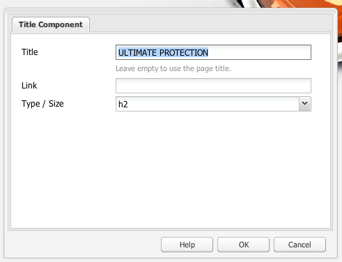
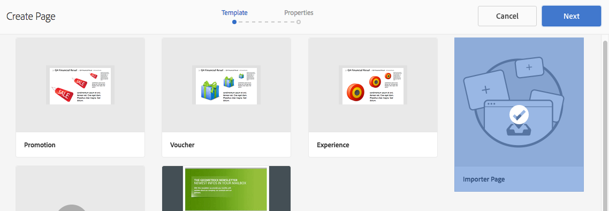

# Pagine di destinazione{#landing-pages}

La funzione delle pagine di destinazione consente di importare in modo rapido e semplice una progettazione e un contenuto direttamente in una pagina AEM. Uno sviluppatore web può preparare il HTML e le risorse aggiuntive che possono essere importate come pagina intera o solo come parte di una pagina. Questa funzionalità è utile per creare pagine di destinazione di marketing attive solo per un periodo di tempo limitato e che devono essere create rapidamente.

Questa pagina descrive quanto segue:

* aspetto delle pagine di destinazione in AEM, inclusi i componenti disponibili
* creare una pagina di destinazione e importare un pacchetto progettazione
* come utilizzare le pagine di destinazione in AEM
* come impostare pagine di destinazione mobili

La preparazione del pacchetto di progettazione per l&#39;importazione è descritta in [Estensione e configurazione di Importazione progettazione](/help/sites-administering/extending-the-design-importer-for-landingpages.md). L’integrazione con Adobe Analytics è descritta in [Integrazione delle pagine di destinazione con Adobe Analytics.](/help/sites-administering/integrating-landing-pages-with-adobe-analytics.md)

>[!CAUTION]
>
>Importazione progettazione, utilizzato per importare pagine di destinazione, [è stato dichiarato obsoleto con AEM 6.5](/help/release-notes/deprecated-removed-features.md#deprecated-features).

>[!CAUTION]
>
>Perché l&#39;Importazione progettazione richiede l&#39;accesso a `/apps`, non funzionerà in ambienti cloud in contenitori in cui `/apps` è immutabile.

## Cosa sono le pagine di destinazione? {#what-are-landing-pages}

Le pagine di destinazione sono siti singoli o multipagina che costituiscono l’&quot;endpoint&quot; di un’attività di marketing, ad esempio e-mail, adwords/banner e social media. Una pagina di destinazione può essere utile per vari scopi, ma tutti hanno una cosa in comune: il visitatore deve svolgere un’attività che definisce il successo di una pagina di destinazione.

La funzione Landing Pages (Pagine di destinazione) in AEM consente agli addetti al marketing di lavorare con web designer presso agenzie o team creativi interni per creare design di pagine che possano essere facilmente importati nell&#39;AEM e che possano essere comunque modificabili dagli addetti al marketing e pubblicati con la stessa governance degli altri siti basati sull&#39;AEM.

In AEM, puoi creare pagine di destinazione eseguendo i seguenti passaggi:

1. Crea una pagina in AEM che contenga l’area di lavoro delle pagine di destinazione. L’AEM viene fornito con un campione denominato **Pagina importazione**.

1. [Prepara il HTML e le risorse.](/help/sites-administering/extending-the-design-importer-for-landingpages.md)
1. Crea un pacchetto delle risorse in un file ZIP qui denominato pacchetto progettazione.
1. Importare il pacchetto progettazione nella pagina di importazione.
1. Modifica e pubblica la pagina.

### Pagine di destinazione desktop {#desktop-landing-pages}

Ecco un esempio di pagina di destinazione in AEM:

### Pagine di destinazione mobili {#mobile-landing-pages}

Una pagina di destinazione può anche avere una versione mobile della pagina. Per avere una versione mobile separata della pagina di destinazione, la progettazione di importazione deve avere due file html: *index.htm(l)* e *mobile.index.htm(l)*.

La procedura di importazione della pagina di destinazione è uguale a quella di una pagina di destinazione normale, la progettazione della pagina di destinazione presenta un file html aggiuntivo corrispondente alla pagina di destinazione mobile. Anche questo file html deve avere un’area di lavoro `div` con `id=cqcanvas` proprio come la pagina di destinazione del desktop html e supporta tutti i componenti modificabili descritti per la pagina di destinazione del desktop.

La pagina di destinazione mobile viene creata come pagina figlia della pagina di destinazione desktop. Per aprirla, passa alla pagina di destinazione in Siti web e apri la pagina figlio.

>[!NOTE]
>
>La pagina di destinazione mobile viene eliminata/disattivata insieme alla pagina di destinazione desktop se questa viene eliminata o disattivata.

## Componenti della pagina di destinazione {#landing-page-components}

Per rendere modificabili parti del HTML importato all’interno dell’AEM, puoi mappare direttamente il contenuto all’interno del HTML delle pagine di destinazione ai componenti dell’AEM. L’importazione di progetti comprende i seguenti componenti per impostazione predefinita:

* Testo, per qualsiasi testo
* Titolo, per il contenuto nei tag H1-6
* Immagine, per le immagini che devono essere rese scambiabili
* Inviti all&#39;azione:

   * Collegamento click-through
   * Collegamento grafico

* Modulo lead CTA, per acquisire informazioni utente
* Sistema paragrafo (Parsys), per consentire l&#39;aggiunta o la conversione di qualsiasi componente

Inoltre, è possibile estenderla e supportare componenti personalizzati. Questa sezione descrive in dettaglio i componenti.

### Testo {#text}

Il componente Testo consente di immettere un blocco di testo utilizzando un editor WYSIWYG. Consulta [Componente testo](/help/sites-authoring/default-components.md#text) per ulteriori informazioni.

Di seguito è riportato un esempio di un componente testo in una pagina di destinazione:

#### Titolo {#title}

Il componente Titolo consente di visualizzare un titolo e di configurare le dimensioni (h1-6). Consulta [Componente titolo](/help/sites-authoring/default-components.md#title) per ulteriori informazioni.

Di seguito è riportato un esempio di un componente titolo in una pagina di destinazione:

#### Immagine {#image}

Il componente Immagine visualizza un’immagine che puoi trascinare dal Finder dei contenuti o fare clic per caricarla. Consulta [componente immagine](/help/sites-authoring/default-components.md) per ulteriori informazioni.

Di seguito è riportato un esempio di un componente immagine in una pagina di destinazione:

#### Invito all’azione (CTA) {#call-to-action-cta}

La progettazione di una pagina di destinazione può contenere diversi collegamenti, alcuni dei quali possono essere intesi come &quot;Inviti all’azione&quot;.

Il CTA (Call to Action) viene utilizzato per fare in modo che il visitatore agisca immediatamente sulla pagina di destinazione, ad esempio &quot;Subscribe Now&quot;, &quot;view this video&quot; (Visualizza questo video), &quot;Limited Time Only&quot; (Solo a tempo limitato) e così via.

* Collegamento Click-through: consente di aggiungere un collegamento di testo che, se selezionato, porta il visitatore a un URL di destinazione.
* Collegamento grafico: consente di aggiungere un’immagine che, se selezionata, porta il visitatore a un URL di destinazione.

Entrambi i componenti CTA hanno opzioni simili. Il collegamento Click-through include opzioni di testo RTF aggiuntive. I componenti sono descritti in dettaglio nei paragrafi seguenti.

#### Collegamento Click-through {#click-through-link}

Questo componente CTA può essere utilizzato per aggiungere un collegamento di testo alla pagina di destinazione. È possibile fare clic su tale collegamento per indirizzare l’utente all’URL di destinazione specificato nelle proprietà del componente. Fa parte del gruppo &quot;Invito all&#39;azione&quot;.

**Etichetta** Il testo visualizzato dagli utenti. È possibile modificare la formattazione con l’editor Rich Text.

**URL di destinazione** Inserisci l’URI che desideri che gli utenti visitino facendo clic sul testo.

**Opzioni di rendering** Descrive le opzioni di rendering. Puoi scegliere tra le seguenti opzioni:

* Carica pagina in una nuova finestra browser
* Carica pagina nella finestra corrente
* Carica pagina nel frame padre
* Annulla tutti i frame e carica la pagina nella finestra del browser completa

**CSS** Nella scheda Stile immettere un percorso per il foglio di stile CSS.

**ID** Nella scheda Stile, immetti un ID per il componente per identificarlo in modo univoco.

Di seguito è riportato un esempio di collegamento click-through:

#### Collegamento grafico {#graphical-link}

Questo componente CTA può essere utilizzato per aggiungere qualsiasi immagine grafica con collegamento nella pagina di destinazione. L&#39;immagine può essere un semplice pulsante o qualsiasi immagine grafica come sfondo. Quando si fa clic sull’immagine, l’utente viene indirizzato all’URL di destinazione specificato nelle proprietà del componente. Fa parte del **Invito all&#39;azione** gruppo.

**Etichetta** Il testo visualizzato dagli utenti nell&#39;immagine. È possibile modificare la formattazione con l’editor Rich Text.

**URL di destinazione** Inserisci l’URI che desideri che gli utenti visitino facendo clic sull’immagine.

**Opzioni di rendering** Descrive le opzioni di rendering. Puoi scegliere tra le seguenti opzioni:

* Carica pagina in una nuova finestra browser
* Carica pagina nella finestra corrente
* Carica pagina nel frame padre
* Annulla tutti i frame e carica la pagina nella finestra del browser completa

**CSS** Nella scheda Stile immettere un percorso per il foglio di stile CSS.

**ID** Nella scheda Stile, immetti un ID per il componente per identificarlo in modo univoco.

Di seguito è riportato un esempio di collegamento grafico:

### Modulo lead CTA (Call to Action) {#call-to-action-cta-lead-form}

Un modulo lead è un modulo utilizzato per raccogliere le informazioni sul profilo di un visitatore/lead. Queste informazioni possono essere memorizzate e utilizzate in un secondo momento per effettuare un marketing efficace basato sulle informazioni. Queste informazioni generalmente includono titolo, nome, e-mail, data di nascita, indirizzo, interesse e così via. Fa parte del **Modulo lead CTA** gruppo.

Un esempio di modulo lead CTA è simile al seguente:

I moduli lead CTA sono costituiti da diversi componenti:

* **Modulo lead**
Il componente Modulo lead definisce l’inizio e la fine di un nuovo modulo lead in una pagina. Altri componenti possono quindi essere posizionati tra questi elementi, ad esempio ID e-mail, Nome e così via.

* **Campi ed elementi del modulo**
I campi e gli elementi del modulo possono includere caselle di testo, pulsanti di scelta, immagini e così via. L’utente spesso completa un’azione in un campo modulo, ad esempio digitando del testo. Per ulteriori informazioni, vedi singoli elementi del modulo.

* **Componenti del profilo**
I componenti profilo si riferiscono ai profili dei visitatori utilizzati per la collaborazione social e altre aree in cui è richiesta la personalizzazione del visitatore.

Il precedente mostra un modulo di esempio, composto dal **Modulo lead** componente (inizio e fine), con **Nome** e **ID e-mail** campi utilizzati per l’input e un **Invia** campo

Dalla barra laterale, sono disponibili i seguenti componenti per il modulo lead CTA:

#### Impostazioni comuni a molti componenti modulo lead {#settings-common-to-many-lead-form-components}

Sebbene ciascuno dei componenti della forma del lead abbia uno scopo diverso, molti sono composti da opzioni e parametri simili.

Durante la configurazione di uno dei componenti del modulo, nella finestra di dialogo sono disponibili le seguenti schede:

* **Titolo e testo**
Qui è necessario specificare le informazioni di base, ad esempio il titolo del componente ed eventuali testi allegati. Se appropriato, consente inoltre di definire altre informazioni chiave, ad esempio se il campo è multiselettibile e gli elementi disponibili per la selezione.

* **Valori iniziali**
Consente di specificare un valore predefinito.

* **Vincoli**
Qui puoi specificare se un campo è obbligatorio e se i vincoli di posizionamento si trovano su quel campo (ad esempio, deve essere numerico e così via).

* **Stile**
Indica le dimensioni e lo stile dei campi.

>[!NOTE]
>
>I campi visualizzati dipendono dal singolo componente.
>
>Non tutte le opzioni sono disponibili per tutti i componenti del modulo lead. Consulta Forms per ulteriori informazioni su questi [impostazioni comuni](/help/sites-authoring/default-components.md#formsgroup).

#### Componenti modulo lead {#lead-form-components}

Nella sezione seguente sono descritti i componenti disponibili per i moduli lead di invito all’azione.

**Informazioni su** Consente agli utenti di aggiungere informazioni.

**Campo indirizzo** Consente agli utenti di immettere informazioni sull&#39;indirizzo. Durante la configurazione di questo componente, devi immettere il Nome elemento nella finestra di dialogo. Nome elemento è il nome dell&#39;elemento modulo. Indica dove vengono memorizzati i dati nell’archivio.

**Data di nascita** Gli utenti possono inserire informazioni sulla data di nascita.

**ID e-mail** Consente agli utenti di immettere un indirizzo e-mail (identificazione).

**Nome** Fornisce un campo in cui gli utenti possono immettere il nome.

**Genere** Gli utenti possono selezionare il proprio genere da un elenco a discesa.

**Cognome** Gli utenti possono immettere le informazioni sul cognome.

**Modulo lead** Aggiungi questo componente per aggiungere un modulo lead alla pagina di destinazione. Un modulo lead contiene automaticamente i campi Inizio modulo lead e Fine modulo lead. Nel frattempo, aggiungi i componenti Modulo lead descritti in questa sezione.

Il componente Modulo lead definisce sia l’inizio che la fine di un modulo utilizzando **Inizio modulo** e **Fine modulo** elementi. Queste vengono sempre associate per garantire che il modulo sia definito correttamente.

Dopo aver aggiunto il modulo lead, puoi configurare l’inizio o la fine del modulo facendo clic su **Modifica** nella barra corrispondente.

**Inizio del modulo lead**

Sono disponibili due schede per la configurazione **Modulo** e **Avanzate**:

**Pagina di ringraziamento** La pagina a cui fare riferimento per ringraziare i visitatori che hanno fornito il loro contributo. Se non specificato, il modulo verrà nuovamente visualizzato dopo l&#39;invio.

**Avvia flusso di lavoro** Determina quale flusso di lavoro viene attivato dopo l’invio di un modulo lead.

**Opzioni post** Sono disponibili le seguenti opzioni di post:

* Crea lead
* Servizio e-mail: crea utente con sottoscrizione e aggiungi all’elenco - Da utilizzare se utilizzi un provider di servizi e-mail come ExactTarget.
* Servizio e-mail: invia un’e-mail con risposta automatica - Da utilizzare se utilizzi un provider di servizi e-mail come ExactTarget.
* Servizio e-mail: annulla l’iscrizione dell’utente all’elenco - Da utilizzare se utilizzi un provider di servizi e-mail come ExactTarget.
* Annulla iscrizione utente

**Identificatore modulo** L’identificatore del modulo identifica in modo univoco il modulo del lead. Utilizza l’identificatore del modulo se in una singola pagina sono presenti più moduli; assicurati che abbiano identificatori diversi.

**Percorso di caricamento** È il percorso delle proprietà del nodo utilizzato per caricare valori predefiniti nei campi del modulo lead.

Questo è un campo facoltativo che specifica il percorso di un nodo nell’archivio. Se le proprietà di questo nodo corrispondono ai nomi dei campi, i campi appropriati del modulo vengono precaricati con il valore di tali proprietà. Se non esiste alcuna corrispondenza, il campo contiene il valore predefinito.

**Convalida client** Indica se per questo modulo è necessaria la convalida del client (la convalida del server viene sempre eseguita). Ciò può essere ottenuto insieme al componente Forms Captcha.

**Tipo risorsa convalida** Definisce il tipo di risorsa di convalida del modulo se si desidera convalidare l&#39;intero modulo lead (anziché i singoli campi).

Se si convalida il modulo completo, includere anche uno dei seguenti elementi:

* Uno script per la convalida del client:
   ` /apps/<myApp>/form/<myValidation>/formclientvalidation.jsp`

* Uno script per la convalida sul lato server:
   ` /apps/<myApp>/form/<myValidation>/formservervalidation.jsp`

**Configurazione azione** A seconda della selezione in Opzioni post, la Configurazione azione cambia. Ad esempio, quando si seleziona Crea lead, è possibile configurare l&#39;elenco a cui il lead viene aggiunto.

* **Mostra pulsante Invia**
Indica se deve essere visualizzato o meno un pulsante Invia.

* **Invia nome**
Un identificatore se in un modulo si utilizzano più pulsanti di invio.

* **Titolo invio**
Nome visualizzato sul pulsante, ad esempio Invia o Invia.

* **Mostra pulsante Ripristina**
Selezionare la casella di controllo per rendere visibile il pulsante Reimposta.

* **Reimposta titolo**
Il nome visualizzato sul pulsante Reimposta.

* **Descrizione**
Informazioni visualizzate sotto il pulsante.

## Creazione di una pagina di destinazione {#creating-a-landing-page}

Quando crei una pagina di destinazione, devi eseguire tre passaggi:

1. Crea una pagina di importazione.
1. [Prepara le HTML per l’importazione.](/help/sites-administering/extending-the-design-importer-for-landingpages.md)
1. Importare il pacchetto progettazione.

### Utilizzo dell&#39;Importazione progettazione {#use-of-the-design-importer}

Poiché l’importazione di pagine comporta la preparazione di HTML, la verifica e il test delle pagine, l’importazione delle pagine di destinazione viene intesa come un’attività amministrativa. In qualità di amministratore, gli utenti che eseguono l’importazione devono disporre di autorizzazioni di lettura, scrittura, creazione ed eliminazione per `/apps`. Se l’utente non dispone di queste autorizzazioni, l’importazione non riuscirà.

>[!NOTE]
>
>Poiché l&#39;utilità di importazione progettazione è concepita come uno strumento di amministrazione che richiede autorizzazioni di lettura, scrittura, creazione ed eliminazione per `/apps`, Adobe sconsiglia di utilizzare l’importazione di progetti in produzione.

L’Adobe consiglia di utilizzare l’importazione progettazione in un’istanza di staging. In un’istanza di staging l’importazione può essere testata e convalidata da uno sviluppatore che è quindi responsabile della distribuzione del codice nell’istanza di produzione.

### Creazione di una pagina di importazione {#creating-an-importer-page}

Prima di poter importare la progettazione di una pagina di destinazione, è necessario creare una pagina di importazione, ad esempio in una campagna. Il modello Pagina importazione consente di importare la pagina di destinazione completa di HTML. La pagina contiene una casella di rilascio in cui è possibile importare il pacchetto di progettazione della pagina di destinazione tramite trascinamento.

>[!NOTE]
>
>Per impostazione predefinita, una pagina di importazione può essere creata solo in campagne, ma puoi anche sovrapporre questo modello per creare una pagina di destinazione in `/content/mysite`.

Per creare una nuova pagina di destinazione:

1. Vai a **Siti Web** console.
1. Seleziona la campagna nel riquadro a sinistra.
1. Clic **Nuovo** per aprire **Crea pagina** finestra.
1. Seleziona la **Pagina importazione** e aggiungere un titolo e, facoltativamente, un nome, quindi fare clic su **Crea**.

   

   Viene visualizzata la nuova pagina di importazione.

### Preparazione di HTML per l&#39;importazione {#preparing-the-html-for-import}

Prima di importare il pacchetto di progettazione, è necessario preparare il HTML. Consulta [Estensione e configurazione dell&#39;importazione della progettazione](/help/sites-administering/extending-the-design-importer-for-landingpages.md) per ulteriori informazioni.

### Importazione del pacchetto progettazione {#importing-the-design-package}

Dopo aver creato una pagina di importazione, è possibile importare un pacchetto di progettazione. I dettagli sulla creazione del pacchetto di progettazione e la struttura consigliata sono illustrati in [Estensione e configurazione dell&#39;importazione della progettazione](/help/sites-administering/extending-the-design-importer-for-landingpages.md).

Se il pacchetto di progettazione è pronto, i passaggi seguenti descrivono come importare il pacchetto di progettazione in una pagina di importazione.

1. Apri la pagina di importazione che hai [creato in precedenza](#creatingablankcanvaspage).

   

1. Trascinare e rilasciare il pacchetto di progettazione nella casella di rilascio. La freccia cambia direzione quando un pacchetto viene trascinato su di esso.
1. Trascinando la selezione, puoi visualizzare la pagina di destinazione al posto della pagina di importazione. La pagina di destinazione di HTML è stata importata correttamente.

   

>[!NOTE]
>
>Durante l’importazione, il markup viene bonificato per motivi di sicurezza e per evitare di importare e pubblicare markup non validi. Ciò presuppone che il markup solo HTML e tutti gli altri tipi di elementi, ad esempio SVG in linea o Componenti Web, vengano esclusi.

>[!NOTE]
>
>In caso di problemi durante l&#39;importazione del pacchetto di progettazione, vedere [Risoluzione dei problemi](/help/sites-administering/extending-the-design-importer-for-landingpages.md#troubleshooting).

## Utilizzo delle pagine di destinazione {#working-with-landing-pages}

La progettazione e le risorse di una pagina di destinazione vengono solitamente create da un designer possibilmente presso un’agenzia in strumenti a cui sono abituate, come Adobe Photoshop o Adobe Dreamweaver. Una volta completata la progettazione, la finestra di progettazione invia un file zip con tutte le risorse al marketing. Il contatto nel marketing è quindi responsabile della rimozione del file zip in AEM e della pubblicazione del contenuto.

Inoltre, potrebbe essere necessario apportare modifiche alla pagina di destinazione dopo l’importazione modificando o eliminando il contenuto e configurando i componenti di invito all’azione. Infine, l’addetto al marketing vorrà visualizzare in anteprima la pagina di destinazione e quindi attivare la campagna per assicurarsi che sia pubblicata.

Questa sezione descrive come effettuare le seguenti operazioni:

* Eliminare una pagina di destinazione
* Scaricare il pacchetto di progettazione
* Visualizza informazioni di importazione
* Reimpostare una pagina di destinazione
* [Configurare i componenti CTA e aggiungere contenuto alla pagina](#call-to-action-cta)
* Anteprima della pagina di destinazione
* Attivare/pubblicare una pagina di destinazione

Quando importate il pacchetto di progettazione, **Cancella progettazione** e **Scarica ZIP importato** sono disponibili nel menu delle impostazioni della pagina:

### Download del pacchetto di progettazione importato {#downloading-the-imported-design-package}

Il download del file zip ti consente di registrare quale file ZIP è stato importato con una particolare pagina di destinazione. Tieni presente che le modifiche apportate in una pagina non vengono aggiunte al file zip.

Per scaricare il pacchetto di progettazione importato, fare clic su **Scarica ZIP** sulla barra degli strumenti della pagina di destinazione.

### Visualizzazione delle informazioni di importazione {#viewing-import-information}

In qualsiasi momento, puoi visualizzare informazioni sull’ultima importazione facendo clic sul punto esclamativo blu nella parte superiore della pagina di destinazione nell’interfaccia utente classica.

Se il pacchetto di progettazione importato presenta alcuni problemi, ad esempio se fa riferimento a immagini/script che non esistono nel pacchetto e così via, l’importazione progettazione visualizza tali problemi sotto forma di elenco. Per visualizzare l’elenco dei problemi, nell’interfaccia utente classica fai clic sul collegamento problemi nella barra degli strumenti Pagina di destinazione. Nell’immagine seguente, fai clic su **Problemi** apre la finestra Import Issues (Problemi di importazione).

### Reimpostazione di una pagina di destinazione {#resetting-a-landing-page}

Per reimportare il pacchetto di progettazione della pagina di destinazione dopo aver apportato alcune modifiche, fai clic su per &quot;cancellare&quot; la pagina di destinazione **Cancella** nella parte superiore della pagina di destinazione nell’interfaccia utente classica o fai clic su Cancella nel menu delle impostazioni nell’interfaccia utente ottimizzata per il tocco. In questo modo viene eliminata la pagina di destinazione importata e viene creata una pagina importazione vuota.

Durante la cancellazione della pagina di destinazione, puoi rimuovere le modifiche al contenuto. Se si fa clic su **No**, le modifiche al contenuto vengono mantenute, ovvero la struttura in `jcr:content/importer`viene mantenuto e solo il componente pagina importazione e le risorse in `etc/design` vengono rimossi. Mentre, se fai clic su **Sì**, il `jcr:content/importer` viene rimosso.

>[!NOTE]
>
>Se decidi di rimuovere le modifiche al contenuto, tutte le modifiche apportate nella pagina di destinazione importata e tutte le proprietà di pagina andranno perse quando fai clic su **Cancella**.

### Modifica e aggiunta di componenti a una pagina di destinazione {#modifying-and-adding-components-on-a-landing-page}

Per modificare i componenti nella pagina di destinazione, fai doppio clic su di essi per aprirli e modificarli come faresti con qualsiasi altro componente.

Per aggiungere componenti nella pagina di destinazione, trascina i componenti fino alla pagina di destinazione, dalla barra laterale nell’interfaccia utente classica o dal riquadro Componenti nell’interfaccia utente ottimizzata per il tocco, e modificali in base alle esigenze.

>[!NOTE]
>
>Se un componente nella pagina di destinazione non può essere modificato, devi reimportare il file zip dopo [modifica del file HTML.](/help/sites-administering/extending-the-design-importer-for-landingpages.md) Ciò significa che durante l’importazione le parti non modificabili non sono state convertite in componenti AEM.

### Eliminazione di una pagina di destinazione {#deleting-a-landing-page}

L’eliminazione di una pagina di destinazione è simile all’eliminazione di una normale pagina AEM.

L’unica eccezione è che quando elimini una pagina di destinazione desktop, viene eliminata anche la pagina di destinazione mobile corrispondente (se presente) ma non viceversa.

### Pubblicazione di una pagina di destinazione {#publishing-a-landing-page}

Puoi pubblicare la pagina di destinazione e tutte le relative dipendenze, proprio come una pagina normale.

>[!NOTE]
>
>Quando si pubblica la pagina di destinazione del desktop, viene pubblicata anche la versione mobile corrispondente (se presente). Tuttavia, la pubblicazione di una pagina di destinazione mobile non comporta la pubblicazione della versione desktop.
