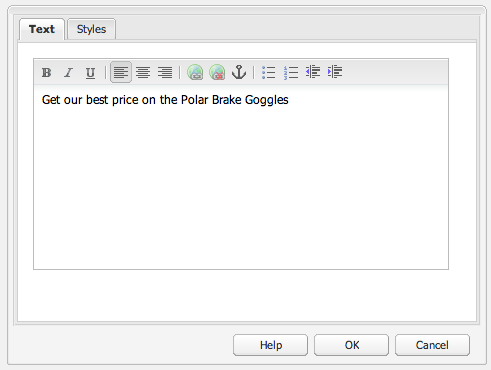
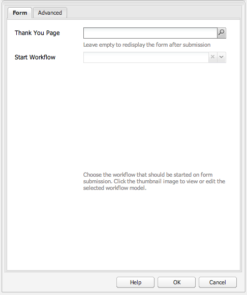
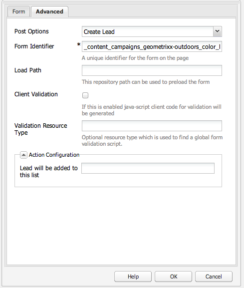
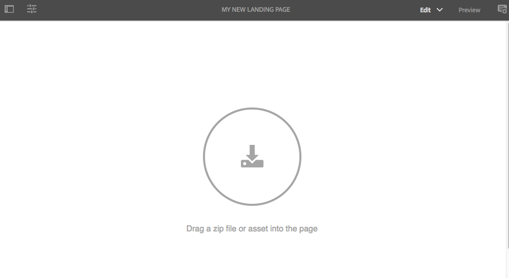

# Pagine di destinazione{#landing-pages}

Le pagine di destinazione consentono di importare rapidamente una progettazione o contenuti direttamente in una pagina AEM. Lo sviluppatore web può preparare il codice HTML e contenuti aggiuntivi da importare come pagina completa o come parte di una pagina. Questa funzione è utile per creare pagine di destinazione marketing che restano attive solo per un periodo di tempo limitato e che devono essere create rapidamente.

Questa pagina descrive quanto segue:

* Aspetto delle pagine di destinazione in AEM e relativi componenti disponibili
* Come creare una pagina di destinazione e come importare un pacchetto di progettazione
* Come utilizzare una pagina di destinazione in AEM
* Come impostare pagine di destinazione per dispositivi mobili

La preparazione del pacchetto di progettazione per l&#39;importazione è descritta in [Estensione e configurazione dell’Importazione di progettazione](/help/sites-administering/extending-the-design-importer-for-landingpages.md). L&#39;integrazione con Adobe Analytics è descritta in [Integrazione delle pagine di destinazione con Adobe Analytics.](/help/sites-administering/integrating-landing-pages-with-adobe-analytics.md)

>[!CAUTION]
>
>L’importazione di progettazione, usata per importare le pagine di destinazione, [è diventata obsoleta in AEM 6.5](/help/release-notes/deprecated-removed-features.md#deprecated-features).

>[!CAUTION]
>
>Poiché Importazione progettazione richiede l’accesso a `/apps`, non funzionerà in ambienti cloud containerizzati in cui `/apps` è immutabile.

## Cosa sono le pagine di destinazione? {#what-are-landing-pages}

Le pagine di destinazione sono siti composti di una o più pagine che rappresentano il “punto di arrivo” di un appello marketing, ad esempio tramite messaggio e-mail, annunci o banner e social media. Le pagine di destinazione possono essere utilizzate per vari scopi, ma sempre con una cosa in comune; il visitatore deve effettuare un’attività, da cui dipende il successo della pagina di destinazione stessa.

La funzione Pagine di destinazione di AEM consente ai professionisti del marketing di lavorare con i web designer presso agenzie o nei team creativi interni per realizzare pagine che possano essere facilmente importate in AEM, modificate dai professionisti di marketing e pubblicate con gli stessi criteri degli altri siti gestiti da AEM.

Per creare delle pagine di destinazione in AEM, esegui i passaggi seguenti:

1. Crea in AEM una pagina che contenga un elemento canvas per pagina di destinazione. AEM viene fornito con un campione chiamato **Pagina importazione**.

1. [Prepara l&#39;HTML e le risorse. ](/help/sites-administering/extending-the-design-importer-for-landingpages.md)
1. Crea un pacchetto con le risorse in un file ZIP al quale si fa riferimento come pacchetto di progettazione.
1. Importa il pacchetto progettazione nella pagina di importazione. 
1. Modificate e pubblicate la pagina.

### Pagine di destinazione desktop {#desktop-landing-pages}

Esempio di pagina di destinazione in AEM:

### Pagine di destinazione per dispositivi mobili {#mobile-landing-pages}

Una pagina di destinazione può disporre anche di una versione per dispositivi mobili. Per disporre di una versione mobile separata della pagina di destinazione, la progettazione di importazione deve disporre di due file html: *index.htm(l)* e *mobile.index.htm(l)*.

La procedura di importazione della pagina di destinazione è uguale a quella per una pagina di destinazione normale, ma contiene un file html aggiuntivo per dispositivi mobili. Anche questo file HTML deve disporre di un elemento canvas `div` con `id=cqcanvas` come il file HTML della versione per desktop. Inoltre supporta tutti i componenti modificabili descritti per la pagina di destinazione.

La pagina di destinazione per dispositivi mobili viene creata come pagina figlia della pagina di destinazione desktop. Per aprirla, passa alla pagina di destinazione in Siti web e apri la pagina figlia.

>[!NOTE]
>
>Se la pagina di destinazione desktop viene eliminata o disattivata, anche la pagina di destinazione per dispositivi mobili viene eliminata o disattivata con essa.

## Componenti per pagina di destinazione {#landing-page-components}

Affinché alcune parti dell’HTML importato possano essere modificate in AEM, puoi mappare i contenuti dell’HTML delle pagine di destinazione su componenti AEM. Importazione progettazione riconosce per impostazione predefinita i seguenti componenti:

* Testo, per qualsiasi testo
* Titolo, per contenuti con i tag h1-h6
* Immagine, per immagini che possono essere scambiate
* Inviti all’azione:

   * Collegamento ClickThrough
   * Collegamento grafico

* Modulo di Invito all&#39;azione, per acquisire informazioni sull&#39;utente
* Sistema paragrafo (Parsys), per consentire l’aggiunta di componenti o la conversione dei componenti sopraelencati

Inoltre, è possibile supportare componenti personalizzati. In questa sezione vengono descritti nel dettaglio questi componenti.

### Testo {#text}

Il componente Testo permette di inserire un blocco di testo mediante un editor WYSIWYG. Per ulteriori informazioni, consulta [Componente Testo](/help/sites-authoring/default-components.md#text).

Esempio di un componente Testo in una pagina di destinazione:

#### Titolo {#title}

Il componente Titolo consente di visualizzare un titolo e di configurarne la dimensione (h1-h6). Consulta [Componente Titolo](/help/sites-authoring/default-components.md#title) per ulteriori informazioni.

Esempio di un componente Titolo in una pagina di destinazione:

#### Immagine {#image}

Il componente Immagine visualizza un’immagine che può essere trascinata dal Content Finder o che puoi caricare mediante un clic. Per ulteriori informazioni, consulta [Componente di immagini](/help/sites-authoring/default-components.md).

Esempio di un componente Immagine in una pagina di destinazione:

#### Invito all’azione {#call-to-action-cta}

La progettazione di una pagina di destinazione può contenere diversi collegamenti, alcuni dei quali possono avere una funzione di “Invito all’azione”.

Con un invito all’azione si incoraggia l’utente a effettuare subito una particolare azione sulla pagina di destinazione, ad esempio “Registrati ora”, “Guarda il video”, “Offerta limitata” e così via.

* Collegamento ClickThrough: consente di aggiungere un collegamento testuale su cui il visitatore può fare clic per passare all’URL di destinazione.
* Collegamento grafico: consente di aggiungere un’immagine su cui il visitatore può fare clic per passare all’URL di destinazione.

Entrambi questi componenti di Invito all&#39;azione dispongono di opzioni simili. Per il collegamento ClickThrough sono inoltre disponibili funzioni rich text aggiuntive. I componenti sono descritti nel dettaglio nei paragrafi che seguono.

#### Collegamento ClickThrough {#click-through-link}

Questo componente di Invito all&#39;azione può essere usato per aggiungere un testo con collegamento sulla pagina di destinazione. L’utente può fare clic sul collegamento per passare all’URL di destinazione specificato dalla proprietà del componente. Fa parte del gruppo “Invito all’Azione”.

**Etichetta** Testo visualizzato dagli utenti. Puoi modificare la formattazione con l’editor Rich Text.

**URL di destinazione** Inserisci l’URI che gli utenti visitano se fanno clic sul testo.

**Opzioni di rendering** Descrive le opzioni di rendering. Puoi selezionare le seguenti opzioni:

* Carica pagina in una nuova finestra browser
* Carica pagina nella finestra corrente
* Carica la pagina nel frame padre/superiore
* Cancella tutti i frame e carica in finestra browser completa

**CSS** Nella scheda Stile, immetti un percorso al foglio di stile CSS.

**ID** Nella scheda Stile , inserisci un ID con cui identificare il componente in modo univoco.

Esempio di collegamento ClickThrough:

#### Collegamento grafico {#graphical-link}

Questo componente Invito all&#39;azione può essere usato per aggiungere un’immagine come collegamento sulla pagina di destinazione. L’immagine può essere un semplice pulsante o un’immagine grafica di sfondo. Quando un visitatore fa clic sull’immagine, viene portato all’URL di destinazione specificato nelle proprietà del componente. Appartiene al gruppo **Invito all’azione**.

**Etichetta** Testo visualizzato dagli utenti nell’immagine. Puoi modificare la formattazione con l’editor Rich Text.

**URL di destinazione** Inserisci l’URI che gli utenti visiteranno se fanno clic sull’immagine.

**Opzioni di rendering** Descrive le opzioni di rendering. Puoi selezionare le seguenti opzioni:

* Carica pagina in una nuova finestra browser
* Carica pagina nella finestra corrente
* Carica la pagina nel frame padre/superiore
* Cancella tutti i frame e carica in finestra browser completa

**CSS** Nella scheda Stile, immetti un percorso al foglio di stile CSS.

**ID** Nella scheda Stile , inserisci un ID con cui identificare il componente in modo univoco.

Esempio di collegamento grafico:

### Modulo lead Invito all&#39;azione {#call-to-action-cta-lead-form}

I moduli lead vengono utilizzati per raccogliere le informazioni profilo di un visitatore o lead. Tali informazioni vengono memorizzate e usate più tardi per attività di marketing basate su informazioni. Queste comprendono in genere qualifica, nome, indirizzo e-mail, data di nascita, interessi e così via. Appartengono al gruppo **Modulo lead Invito all&#39;azione**.

Esempio di modulo lead Invito all&#39;azione:

I moduli lead Invito all&#39;azione sono composti di diversi componenti distinti:

* **Modulo lead** Il componente Modulo lead definisce l’inizio e la fine di un nuovo modulo per lead sulla pagina. È possibile quindi inserire altri componenti tra tali elementi, ad esempio ID e-mail, Nome e così via.

* **Campi ed elementi modulo** I campi e gli elementi modulo possono includere caselle di testo, pulsanti di scelta, immagini e così via. L’utente spesso compie un’azione in un campo modulo, ad esempio la digitazione di testo. Per ulteriori informazioni, consulta le sezioni sui singoli elementi modulo.

* **Componenti profilo** I componenti profilo si riferiscono ai profili dei visitatori utilizzati per la collaborazione sui social network e in altre aree in cui è richiesta la personalizzazione in base al visitatore.

L’esempio precedente mostra un modulo di esempio; è costituito da **Modulo lead** componente (inizio e fine), con **Nome** e **ID e-mail** campi utilizzati per l’input e **Invia** field

Nella barra laterale sono disponibili i seguenti componenti per Modulo lead con Invito all’azione:

#### Impostazioni comuni a numerosi componenti per Modulo lead {#settings-common-to-many-lead-form-components}

Anche se i vari componenti per Modulo lead hanno funzioni diverse, molti di essi offrono opzioni e parametri simili.

Quando si configura un componente modulo, la finestra di dialogo presenta le seguenti schede:

* **Titolo e testo**
Qui si specificano le informazioni di base, ad esempio il titolo del componente ed eventuale testo di corredo. Se appropriato è inoltre possibile definire informazioni chiave, ad esempio se il campo consente una selezione multipla e quali voci possono essere selezionate.

* **Valori iniziali** Consente di specificare un valore predefinito.

* **Vincoli** Consente di specificare se un campo è obbligatorio ed eventuali vincoli associati al campo (ad esempio se il valore deve essere numerico e così via).

* **Attribuzione stile** Indica la dimensione e lo stile dei campi.

>[!NOTE]
>
>I campi disponibili variano in base al singolo componente.
>
>Non tutte le opzioni sono disponibili per tutti i componenti per modulo lead. Per ulteriori informazioni su queste [impostazioni comuni](/help/sites-authoring/default-components.md#formsgroup), Consulta i Moduli.

#### Componenti per Moduli lead {#lead-form-components}

Nella sezione di seguito vengono descritti i componenti disponibili per i Moduli lead con Invito all’azione.

**Informazioni** Consente agli utenti di aggiungere informazioni.

**Campo indirizzo** Consente agli utenti di inserire le informazioni relative all’indirizzo. Quando si configura questo componente, è necessario inserire il Nome elemento nella finestra di dialogo. Il Nome elemento è il nome assegnato all’elemento modulo. Indica dove vengono registrati i dati nella directory archivio.

**Data di nascita** Gli utenti possono inserire la data di nascita.

**ID e-mail** Consente agli utenti di inserire un indirizzo e-mail (identificazione).

**Nome** Fornisce un campo in cui gli utenti possono immettere il proprio nome.

**Genere** Gli utenti possono selezionare il proprio genere da un elenco a discesa.

**Cognome** Gli utenti possono immettere le informazioni sul cognome.

**Modulo lead** Aggiungi questo componente per aggiungere un modulo per lead alla pagina di destinazione. Un modulo lead contiene automaticamente i campi Inizio del modulo lead e Fine del modulo lead. Tra questi due campi puoi aggiungere i componenti per modulo lead descritti in questa sezione.

Il componente Modulo lead definisce sia l’inizio che la fine di un modulo utilizzando **Inizio modulo** e **Fine modulo** elementi. Questi sono sempre utilizzati in coppia per garantire la corretta definizione del modulo.

Una volta aggiunto il modulo lead, si possono configurare l’inizio o la fine del modulo facendo clic su **Modifica** nella barra corrispondente.

**Inizio del modulo lead**

Sono disponibili due schede di configurazione, **Modulo** e **Avanzato**:

**Pagina di ringraziamento** La pagina a cui viene fatto riferimento per ringraziare i visitatori dopo l’invio del modulo. Se lasciato vuoto, dopo l’invio viene visualizzato di nuovo il modulo.

**Avvia flusso di lavoro** Determina il flusso di lavoro che viene attivato dopo l’invio del modulo per lead.

**Opzioni post** Sono disponibili le seguenti opzioni di pubblicazione:

* Crea lead
* Servizio e-mail: crea utente con sottoscrizione e aggiungi all’elenco - Utilizza questa opzione se ti servi di un provider di servizi e-mail come ExactTarget.
* Servizio e-mail: Invia e-mail di risposta automatica: da utilizzare se utilizzi un provider di servizi e-mail come ExactTarget.
* Servizio e-mail: Annulla sottoscrizione a mailing list - Utilizza questa opzione se utilizzi un provider di servizi e-mail come ExactTarget.
* Annulla sottoscrizione utente

**Identificatore modulo** L’identificatore del modulo identifica il modulo per lead in modo univoco. Utilizza l’identificatore del modulo se sono presenti diversi moduli su una stessa pagina, avendo cura di utilizzare identificatori diversi per ciascun modulo.

**Percorso di caricamento** Percorso delle proprietà nodo utilizzato per caricare valori predefiniti nei campi del modulo per lead.

Si tratta di un campo facoltativo, per specificare il percorso di un nodo nella directory archivio. Quando alcune proprietà di questo nodo corrispondono ai nomi dei campi, i relativi campi del modulo vengono precompilati con il valore della proprietà corrispondente. In assenza di proprietà corrispondenti, il campo contiene il valore predefinito.

**Convalida client** Indica se il modulo richiede la convalida client (la convalida server viene sempre eseguita). Questo può essere ottenuto in combinazione con il componente Forms Captcha.

**Tipo di risorsa convalida** Definisce il tipo di risorsa per la convalida del modulo se si desidera convalidare l’intero modulo per lead (anziché i singoli campi).

Se si convalida l’intero modulo, occorre includere anche uno dei seguenti elementi:

* Uno script per la convalida client:
   ` /apps/<myApp>/form/<myValidation>/formclientvalidation.jsp`

* Uno script per la convalida lato server:
   ` /apps/<myApp>/form/<myValidation>/formservervalidation.jsp`

**Configurazione azione** A seconda della selezione in Opzioni post, la Configurazione azione cambia. Ad esempio, se si seleziona Crea lead è possibile configurare in quale elenco aggiungere il lead.

* **Mostra pulsante Invia** Indica se mostrare o meno un pulsante Invia.

* **Nome invio** Identificatore utilizzato qualora il modulo contiene più pulsanti Invia.

* **Titolo invio** Nome visualizzato sul pulsante, ad esempio Invia.

* **Mostra pulsante Ripristina** Seleziona la casella di selezione per rendere visibile il pulsante Ripristina.

* **Titolo ripristino** Nome visualizzato sul pulsante Ripristina.

* **Descrizione** Informazioni riportate sotto il pulsante.

## Creazione di una pagina di destinazione {#creating-a-landing-page}

Per creare una pagina di destinazione devi eseguire tre passaggi:

1. Crea una pagina di importazione.
1. [Prepara l&#39;HTML da importare. ](/help/sites-administering/extending-the-design-importer-for-landingpages.md)
1. Importa il pacchetto di progettazione.

### Utilizzo dell’importazione di progettazione {#use-of-the-design-importer}

Poiché l’importazione di pagine comporta la preparazione del codice HTML, la verifica e il test delle pagine, l’importazione delle pagine di destinazione è concepita come attività riservata agli amministratori. In qualità di amministratori, gli utenti che eseguono l’importazione devono disporre delle autorizzazioni necessarie per poter leggere, scrivere, creare ed eliminare i file in `/apps`. Se l’utente non dispone di queste autorizzazioni, l’importazione avrà esito negativo.

>[!NOTE]
>
>Poiché Importazione progettazione è inteso come strumento di amministrazione che richiede autorizzazioni di lettura, scrittura, creazione ed eliminazione su `/apps`, Adobe sconsiglia di utilizzare Importazione progettazione in produzione.

Adobe consiglia di utilizzare l’importazione di progettazione su un’istanza di pre-produzione. Su un’istanza di pre-produzione l’importazione può essere testata e convalidata da uno sviluppatore che diventa responsabile per la distribuzione del codice all’istanza di produzione.

### Creazione di una Pagina importazione {#creating-an-importer-page}

Prima di importare la progettazione della pagina di destinazione, occorre creare una pagina di importazione, ad esempio in una campagna. Il modello Pagina di importazione permette di importare l’intera pagina di destinazione HTML. La pagina contiene una casella di rilascio in cui puoi trascinare il pacchetto di progettazione della pagina di destinazione.

>[!NOTE]
>
>Per impostazione predefinita, una Pagina importazione può essere creata solo sotto le campagne, ma è anche possibile sovrapporre questo modello per creare una pagina di destinazione in `/content/mysite`.

Per creare una nuova pagina di destinazione:

1. Passa alla console **Siti Web**.
1. Seleziona la campagna nel riquadro a sinistra.
1. Fai clic su **Nuovo** per aprire la finestra **Crea pagina**.
1. Seleziona il modello **Pagina importazione**, aggiungi un titolo ed eventualmente un nome, quindi fai clic su **Crea**.

   

   La nuova pagina di importazione viene visualizzata.

### Preparazione dell’HTML per l’Importazione {#preparing-the-html-for-import}

Prima di importare il pacchetto di progettazione, occorre preparare l’HTML. Consulta [Estensione e configurazione dell&#39;importazione di progettazione](/help/sites-administering/extending-the-design-importer-for-landingpages.md) per ulteriori informazioni.

### Importazione del pacchetto di progettazione {#importing-the-design-package}

Una volta creata la pagina di importazione, puoi importare in essa un pacchetto di progettazione. Informazioni su come creare il pacchetto di progettazione e la relativa struttura consigliata sono disponibili in [Estensione e configurazione dell&#39;importazione di progettazione](/help/sites-administering/extending-the-design-importer-for-landingpages.md).

Presupponendo che il pacchetto di progettazione sia già pronto, i seguenti passaggi descrivono come importare il pacchetto di progettazione in una pagina di importazione.

1. Apri la pagina di importazione [creata in precedenza](#creatingablankcanvaspage).

   

1. Trascina il pacchetto di progettazione fino alla casella di rilascio. Osserva come la freccia cambia direzione quando un pacchetto di progettazione viene trascinato su di essa.
1. A seguito del trascinamento, la pagina di destinazione viene visualizzata al posto della pagina di importazione. La pagina di destinazione di HTML è stata importata correttamente.

   

>[!NOTE]
>
>Durante l’importazione il codice viene bonificato per motivi di sicurezza e per evitare di importare e pubblicare un codice non valido. Ciò presuppone che solo il codice HTML e tutte le altre forme di elementi, ad esempio i componenti web o SVG in linea, saranno esclusi dal filtro.

>[!NOTE]
>
>In caso di problemi durante l&#39;importazione del pacchetto progettazione, consulta [Risoluzione dei problemi](/help/sites-administering/extending-the-design-importer-for-landingpages.md#troubleshooting).

## Utilizzo delle Pagine di destinazione {#working-with-landing-pages}

La progettazione e i contenuti di una pagina di destinazione sono in genere creati da un designer, eventualmente presso un’agenzia, con strumenti quali Adobe Photoshop o Adobe Dreamweaver. Una volta completata la progettazione, il designer invia un file ZIP con tutti i contenuti al reparto marketing. L’addetto marketing diventa quindi responsabile per il rilascio del file ZIP in AEM e la pubblicazione dei contenuti.

Inoltre, il progettista può avere bisogno di apportare modifiche alla pagina di destinazione dopo l’importazione, modificando o eliminando il contenuto e configurando i componenti dell’invito all’azione. Infine, l’addetto marketing può visualizzare la pagina di destinazione in anteprima e quindi attivare la campagna per pubblicare la pagina di destinazione.

In questa sezione viene descritto come effettuare le seguenti operazioni:

* Eliminare una pagina di destinazione
* Scaricare il pacchetto di progettazione
* Visualizzare le informazioni di importazione
* Ripristinare una pagina di destinazione
* [Configura i componenti di Invito all&#39;azione e aggiungi contenuto alla pagina](#call-to-action-cta)
* Visualizzare in anteprima la pagina di destinazione
* Attivare e pubblicare una pagina di destinazione

Quando si importa il pacchetto di progettazione, **Cancella progettazione** e **Scarica ZIP importato** sono disponibili nel menu impostazioni della pagina:

### Scaricare il pacchetto di progettazione importato {#downloading-the-imported-design-package}

Quando si scarica il file ZIP, si registra quale file ZIP è stato importato con una particolare pagina di destinazione. Tieni presente che le modifiche apportate a una pagina non vengono aggiunte al file ZIP.

Per scaricare il pacchetto di progettazione importato, fai clic su **Scarica ZIP** nella barra degli strumenti della pagina di destinazione.

### Visualizzare le informazioni di importazione {#viewing-import-information}

In qualsiasi momento puoi visualizzare le informazioni sull’ultima importazione facendo clic sul punto esclamativo blu nella parte superiore della pagina di destinazione nell’interfaccia utente classica.

Qualora il pacchetto di progettazione importato presenti dei problemi, ad esempio se contiene riferimenti a immagini o script non disponibili nel pacchetto, tali problemi vengono elencati da Importazione progettazione. Per visualizzare un elenco dei problemi rilevati, nell’interfaccia utente classica fai clic sul collegamento dei problemi nella barra degli strumenti della Pagina di destinazione. Nell’immagine seguente, fai clic su **Problemi** apre la finestra Problemi di importazione.

### Reimpostare una pagina di destinazione {#resetting-a-landing-page}

Nel caso desideraste reimportare il pacchetto di progettazione della pagina di destinazione dopo aver apportato delle modifiche, puoi “cancellare” la pagina di destinazione facendo clic su **Cancella** nella parte superiore della pagina di destinazione nell’interfaccia utente classica o fare clic su Cancella nel menu impostazioni nell’interfaccia utente touch. In questo modo viene eliminata la pagina di destinazione importata e viene creata una nuova pagina di importazione vuota.

Quando cancelli la pagina di destinazione, puoi rimuovere le modifiche apportate ai contenuti. Se fai clic su **No**, quindi le modifiche al contenuto vengono mantenute, ovvero la struttura sotto `jcr:content/importer`viene mantenuto e solo il componente della pagina di importazione e le risorse in `etc/design` vengono rimossi. Considerando che, se fai clic su **Sì**, `jcr:content/importer` viene rimosso anche .

>[!NOTE]
>
>Se decidete di rimuovere le modifiche apportate ai contenuti, quando fate clic su **Cancella** vanno perdute tutte le modifiche apportate alla pagina di destinazione importata e tutte le proprietà pagina.

### Modificare e aggiungere componenti a una pagina di destinazione {#modifying-and-adding-components-on-a-landing-page}

Per modificare i componenti sulla pagina di destinazione, fai doppio clic su di essi per aprirli e modificarli, così come si fa per qualsiasi altro tipo di componente.

Per aggiungere componenti alla pagina di destinazione, trascinali e rilasciali nella pagina di destinazione, dall’assistente nell’interfaccia utente classica o dal riquadro Componenti nell’interfaccia utente touch, e apportate le modifiche necessarie.

>[!NOTE]
>
>Se un componente nella pagina di destinazione non può essere modificato, devi reimportare il file zip dopo [la modifica del file HTML.](/help/sites-administering/extending-the-design-importer-for-landingpages.md) Questo significa che durante l’importazione le parti non modificabili non erano state convertite in componenti AEM.

### Eliminare una pagina di destinazione {#deleting-a-landing-page}

L’eliminazione di una pagina di destinazione è come l’eliminazione di una normale pagina AEM.

L’unica differenza è che quando si elimina una pagina di destinazione desktop, viene eliminata anche la corrispondente pagina di destinazione per dispositivi mobili (se presente), ma non viceversa.

### Pubblicare una pagina di destinazione {#publishing-a-landing-page}

Puoi pubblicare la pagina di destinazione e tutte le relative dipendenze esattamente come per la pubblicazione di una pagina normale.

>[!NOTE]
>
>Quando si pubblica una pagina di destinazione desktop, viene pubblicata anche la corrispondente versione per dispositivi mobili (se presente). Tuttavia, quando si pubblica una pagina di destinazione per dispositivi mobili, non viene pubblicata anche la versione per desktop.
