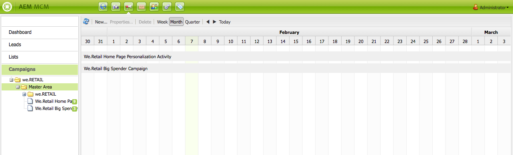
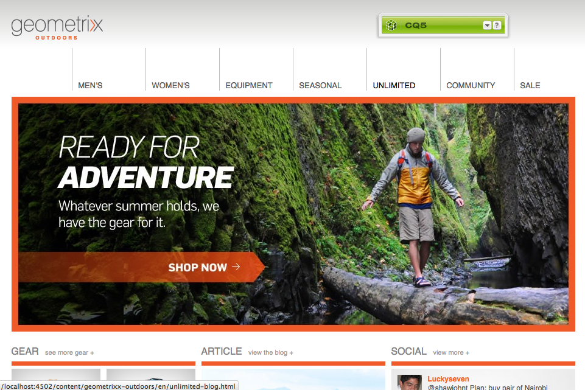

# Utilizzo del Marketing Campaign Manager{#working-with-the-marketing-campaign-manager}

In AEM, Marketing Campaign Manager (MCM) è una console che consente di gestire le campagne multicanale. Con questo software di automazione marketing puoi gestire tutti i tuoi marchi, campagne ed esperienze insieme ai relativi segmenti, elenchi, lead e rapporti.

MCM è accessibile da varie posizioni in AEM; ad esempio, la schermata di benvenuto, utilizzando l’icona Campagne o con l’URL:

`https://<hostname>:<port>/libs/mcm/content/admin.html`

Ad esempio:

`https://localhost:4502/libs/mcm/content/admin.html`

Da MCM è possibile accedere a:

* **[Dashboard](#dashboard)**
È diviso in quattro riquadri:

   * [Elenchi](#lists)
In questo riquadro vengono visualizzati gli elenchi già creati e il numero di lead presenti nell&#39;elenco. Da questo riquadro è possibile creare direttamente un nuovo elenco o importare lead per creare un nuovo elenco.
La selezione di un elenco specifico ti porterà al [Elenchi](#lists) sezione che mostra i dettagli dell’elenco.

   * [Segmenti](/help/sites-classic-ui-authoring/classic-personalization-campaigns.md#anoverviewofsegmentation)
In questo riquadro vengono visualizzati i segmenti definiti. I segmenti ti consentono di caratterizzare una raccolta di visitatori che condividono determinate caratteristiche.
Selezionando un segmento specifico si aprirà la pagina di definizione del segmento.

   * [Rapporti](/help/sites-administering/reporting.md)
AEM fornisce diversi rapporti per aiutarti ad analizzare e monitorare lo stato della tua istanza. In questo riquadro MCM sono elencati i report.
Selezionando un rapporto si aprirà la relativa pagina.

   * [Campagne](#campaigns)
In questo riquadro sono elencate le esperienze della campagna, ad esempio [newsletter](/help/sites-classic-ui-authoring/classic-personalization-campaigns.md#newsletters) e [teaser](/help/sites-classic-ui-authoring/classic-personalization-campaigns.md#teasers).

* **[Lead](#leads)**
Qui puoi gestire i lead. Puoi creare o importare lead, modificare dettagli specifici per singoli lead o eliminarli quando non sono più necessari. È inoltre possibile inserire lead in gruppi diversi, denominati Elenchi. **Nota:** Adobe non prevede di migliorare ulteriormente questa funzionalità.
Si consiglia di: [sfruttare Adobe Campaign e l’integrazione con l’AEM](/help/sites-administering/campaign.md).

* **[Elenchi](#lists)**
Qui puoi gestire i tuoi elenchi (di lead).**Nota:** Adobe non prevede di migliorare ulteriormente questa funzionalità.
Si consiglia di: [sfruttare Adobe Campaign e l’integrazione con l’AEM](/help/sites-administering/campaign.md).

* **[Campagne](#campaigns)**
Qui puoi gestire i tuoi marchi, campagne ed esperienze.

## Dashboard {#dashboard}

La dashboard mostra quattro riquadri che forniscono una panoramica degli elenchi (di lead), dei segmenti, dei rapporti e delle campagne. L’accesso alle funzionalità di base per questi è disponibile anche qui.

### Lead {#leads}

>[!NOTE]
>
>Adobe non prevede di migliorare ulteriormente questa funzionalità (Gestione dei lead).
>Si consiglia di sfruttare [Adobe Campaign e l&#39;integrazione con l&#39;AEM](/help/sites-administering/campaign.md).

In MCM AEM, puoi organizzare e aggiungere lead immettendoli manualmente o importando un elenco separato da virgole, ad esempio una mailing list. Ulteriori modi per generare i lead sono le iscrizioni a newsletter o le iscrizioni alla community (se configurate, possono attivare un flusso di lavoro che popola i lead). I lead vengono in genere suddivisi in categorie e inseriti in un elenco, in modo che in seguito sia possibile eseguire azioni sull’intero elenco, ad esempio l’invio di un’e-mail personalizzata a un determinato elenco.

Sotto **Lead** nel riquadro a sinistra puoi creare, importare, modificare ed eliminare i lead, quindi attivarli o disattivarli in base alle esigenze. È possibile aggiungere un lead a un elenco o vedere a quali elenchi appartiene già.

>[!NOTE]
>
>Consulta [Utilizzo dei lead](/help/sites-classic-ui-authoring/classic-personalization-campaigns.md#workingwithleads) per informazioni dettagliate su attività specifiche.

### Elenchi {#lists}

>[!NOTE]
>
>L’Adobe non prevede di migliorare ulteriormente questa funzionalità (Gestione degli elenchi).
>Si consiglia di sfruttare [Adobe Campaign e l&#39;integrazione con l&#39;AEM](/help/sites-administering/campaign.md).

Gli elenchi ti consentono di organizzare i lead in gruppi. Con gli elenchi, puoi indirizzare le tue campagne di marketing a un gruppo selezionato di persone; ad esempio, puoi inviare una newsletter mirata a un elenco.

Sotto **Elenchi**, è possibile gestire gli elenchi creando, importando, modificando, unendo ed eliminando gli elenchi che possono quindi essere attivati o disattivati in base alle esigenze. È inoltre possibile visualizzare i lead all&#39;interno di tale elenco, verificare se l&#39;elenco è un membro di un altro elenco o visualizzare la descrizione.

>[!NOTE]
>
>Consulta [Utilizzo degli elenchi](/help/sites-classic-ui-authoring/classic-personalization-campaigns.md#workingwithlists) per informazioni dettagliate su attività specifiche.

### Campagne {#campaigns}

>[!NOTE]
>
>Consulta [Teaser e strategie](/help/sites-classic-ui-authoring/classic-personalization-campaigns.md#workingwithlists), [Configurazione della campagna](/help/sites-classic-ui-authoring/classic-personalization-campaigns.md#settingupyourcampaign) e [Newsletter](/help/sites-classic-ui-authoring/classic-personalization-campaigns.md#newsletters) per informazioni dettagliate su attività specifiche.

Per accedere alle campagne esistenti, in MCM fai clic su **Campagne**.

* **Nel riquadro a sinistra**: è disponibile un elenco di tutti i brand e le campagne.
Un singolo clic su un marchio consente di:

   * espandi l’elenco per mostrare tutte le campagne correlate nel riquadro a sinistra; questo elenco mostra anche il numero di esperienze esistenti per ogni campagna.
   * apri panoramica del brand nel riquadro a destra.

* **Nel riquadro a destra**: vengono visualizzate le icone per ogni marchio (non verranno visualizzate le campagne storiche).
Puoi fare doppio clic su di essi per aprire la panoramica del brand.

#### Panoramica del marchio {#brand-overview}

Da qui è possibile:

* Visualizza il numero di campagne ed esperienze (numero visualizzato nel riquadro a sinistra) esistenti per questo brand.
* Creare un **Nuovo...** campagna per questo marchio.

* Modifica l’intervallo di tempo visualizzato; seleziona **Settimana**, **Mese** o **Trimestre**, utilizzare le frecce per selezionare periodi specifici o tornare a **Oggi**.

* Seleziona una campagna (nel riquadro a destra) per:

   * Modifica il **Proprietà...**
   * **Elimina** la campagna.

* Apri la panoramica della campagna (fai doppio clic su una campagna nel riquadro di destra o fai clic singolo nel riquadro di sinistra).

#### Panoramica di Campaign {#campaign-overview}

Per le singole campagne sono disponibili due visualizzazioni:

1. **Vista calendario**

   Utilizza l’icona:

   

   Questo presenta un elenco di tutti i punti di contatto (grigi) con un arco temporale orizzontale delle esperienze (verdi) connesse a quel punto di contatto:

   

   Da qui è possibile:

   * Modifica l’intervallo di tempo che stai visualizzando utilizzando le frecce, oppure torna a **Oggi**.

   * Utilizzare **Aggiungi punto di contatto...** per aggiungere un nuovo punto di contatto per un’esperienza esistente.

   * Fai clic su un teaser (nel riquadro a destra) per impostare **Ora di attivazione** e **Ora di disattivazione**.

1. **Vista a elenco**

   Utilizza l’icona:

   

   Elenca tutte le esperienze (ad esempio, teaser e newsletter) per la campagna selezionata:

   

   Da qui è possibile:

   * Creare un **Nuovo...** ad esempio offerte, teaser e newsletter di Adobe Target.
   * **Modifica** i dettagli di una pagina teaser o di una newsletter specifica (è inoltre possibile utilizzare un doppio clic).
   * Definisci il **Proprietà...** per una pagina teaser o una newsletter specifica.
   * **Simula** l’aspetto di un’esperienza (pagina teaser o newsletter).
Quando la pagina simulata è aperta, è possibile aprire la barra laterale per passare alla modalità di modifica per quella pagina.

   * **Analizza...** le impression generate per una pagina.

   * **Elimina** elementi quando non sono più necessari.
   * **Ricerca** per il testo (verrà cercata la sezione Titolo dell’esperienza).
   * Utilizzare **Avanzate** cerca per applicare i filtri alla ricerca.

### Simulazione delle esperienze di campagna {#simulating-your-campaign-experiences}

In MCM, fai clic su **Campagne**. Assicurati che la vista a elenco sia attiva, quindi seleziona l’esperienza della campagna richiesta e fai clic su **Simula**. Il punto di contatto (teaser o pagina della newsletter) verrà aperto per mostrare l’esperienza selezionata, come verrà visualizzata dal visitatore.

Da qui puoi anche aprire la barra laterale (fai clic sulla piccola freccia giù) per passare alla modalità di modifica per aggiornare la pagina.

### Analisi delle esperienze della campagna {#analyzing-your-campaign-experiences}

In MCM, fai clic su **Campagne**. Assicurati che la vista a elenco sia attiva, quindi seleziona l’esperienza della campagna richiesta e seleziona **Analizza...**. Verrà visualizzato un grafico delle impression della pagina nel tempo.

