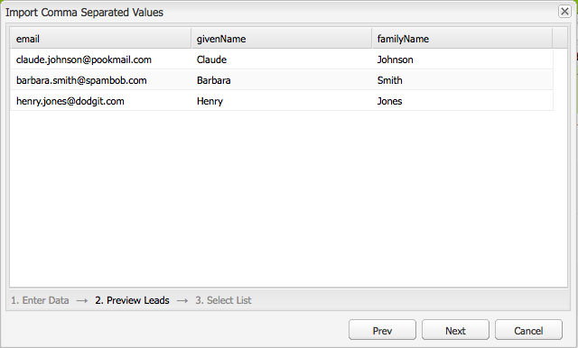

# Configurazione della campagna{#setting-up-your-campaign}

La configurazione di una nuova campagna include i seguenti passaggi (generici):

1. [Creare un brand](#creating-a-new-brand) per mantenere le campagne.
1. Se necessario, puoi [definire le proprietà per il nuovo brand](#defining-the-properties-for-your-new-brand).
1. [Creare una campagna](#creating-a-new-campaign) per memorizzare le esperienze, ad esempio pagine teaser o newsletter.
1. Se necessario, puoi [definire le proprietà per la nuova campagna](#defining-the-properties-for-your-new-campaign).

Quindi, a seconda del tipo di esperienze create, devi [creare un’esperienza](#creating-a-new-experience). I dettagli dell’esperienza e le azioni che seguono la sua creazione dipendono dal tipo di esperienza che desideri creare:

* Se crei un teaser:

   1. [Creare un’esperienza teaser](/help/sites-classic-ui-authoring/classic-personalization-campaigns.md#creatingateaserexperience).
   1. [Aggiungere contenuto al teaser](/help/sites-classic-ui-authoring/classic-personalization-campaigns.md#addingcontenttoyourteaser).
   1. [Creare un punto di contatto per il teaser](/help/sites-classic-ui-authoring/classic-personalization-campaigns.md#creatingatouchpointforyourteaser) (aggiungi il teaser a una pagina di contenuto).

* Durante la creazione di una newsletter:

   1. [Creare un’esperienza di newsletter](/help/sites-classic-ui-authoring/classic-personalization-campaigns.md#creatinganewsletterexperience).
   1. [Aggiungi contenuto alla newsletter.](/help/sites-classic-ui-authoring/classic-personalization-campaigns.md#addingcontenttonewsletters)
   1. [Personalizza la newsletter.](/help/sites-classic-ui-authoring/classic-personalization-campaigns.md#personalizingnewsletters)
   1. [Creare una pagina di destinazione interessante per le newsletter](/help/sites-classic-ui-authoring/classic-personalization-campaigns.md#settingupanewsletterlandingpage).
   1. [Inviare la newsletter](/help/sites-classic-ui-authoring/classic-personalization-campaigns.md#sendingnewsletters) agli abbonati o ai lead.

* Durante la creazione di un&#39;offerta Adobe Target (precedentemente Test&amp;Target):

   1. [Creare un’esperienza di offerta Adobe Target](/help/sites-classic-ui-authoring/classic-personalization-campaigns.md#creatingatesttargetofferexperience).
   1. [Procedi all’integrazione con Adobe Target](/help/sites-classic-ui-authoring/classic-personalization-campaigns.md#integratewithadobetesttarget)

>[!NOTE]
>
>Consulta [Segmentazione](/help/sites-administering/campaign-segmentation.md) per istruzioni dettagliate sulla definizione dei segmenti.

## Creazione di un nuovo marchio {#creating-a-new-brand}

1. Apri **MCM** e seleziona **Campagne** nel riquadro a sinistra.

1. Seleziona **Nuovo...** per inserire **Titolo** e **Nome** e modello da utilizzare per il nuovo brand:

   

1. Fai clic su **Crea**. Il nuovo brand viene visualizzato in MCM (con un’icona predefinita).

### Definizione delle proprietà per il nuovo marchio {#defining-the-properties-for-your-new-brand}

1. Da **Campagne** nel riquadro di sinistra, seleziona l’icona del nuovo brand nel riquadro di destra e fai clic su **Proprietà...**

   È possibile immettere un valore **Titolo**, **Descrizione** e un’immagine da utilizzare come icona.

   

1. Clic **OK** per salvare.

### Creazione di una nuova campagna {#creating-a-new-campaign}

1. Da **Campagne**, selezionare il nuovo brand nel riquadro di sinistra o fare doppio clic sull&#39;icona nel riquadro di destra.

   Viene visualizzata la panoramica (vuota se il brand è nuovo).

1. Clic **Nuovo...** e specificare **Titolo**, **Nome** e modello da utilizzare per la nuova campagna.

   

1. Fai clic su **Crea**. La nuova campagna viene visualizzata in MCM.

### Definizione delle proprietà per la nuova campagna {#defining-the-properties-for-your-new-campaign}

Configura le proprietà della campagna che controllano il comportamento:

* **Priorità:** La priorità di questa campagna rispetto ad altre campagne. Quando più campagne sono contemporaneamente attive, la campagna con priorità più alta controlla l’esperienza del visitatore.
* **Ora di attivazione e disattivazione:** Queste proprietà controllano il periodo di tempo in cui la campagna controlla l&#39;esperienza del visitatore. La proprietà On Time controlla il momento in cui la campagna inizia a controllare l’esperienza. La proprietà Off Time controlla quando le campagne non controllano più l’esperienza.
* **Immagine:** L&#39;immagine che rappresenta la campagna in AEM.
* **Cloud Service:** Le configurazioni di Cloud Service con cui è integrata la campagna. (vedere [Integrazione con Adobe Marketing Cloud](/help/sites-administering/marketing-cloud.md).)

* **Adobe Target:** Proprietà che configurano le campagne integrate con Adobe Target. (vedere [Integrazione con Adobe Target](/help/sites-administering/target.md).)

1. Da **Campagne**, seleziona il tuo marchio. Nel riquadro a destra, seleziona la campagna e fai clic su **Proprietà**.

   Puoi immettere varie proprietà, tra cui una **Titolo**, **Descrizione** e qualsiasi **Cloud Service** tu vuoi.

   

1. Clic **OK** per salvare.

### Creazione di una nuova esperienza {#creating-a-new-experience}

La procedura per la creazione di un’esperienza dipende dal tipo di esperienza:

* [Creazione di un teaser](/help/sites-classic-ui-authoring/classic-personalization-campaigns.md#creatingateaser)
* [Creazione di una newsletter](/help/sites-classic-ui-authoring/classic-personalization-campaigns.md#creatinganewsletter)
* [Creazione di un’offerta Adobe Target](/help/sites-classic-ui-authoring/classic-personalization-campaigns.md#creatingatesttargetoffer)

>[!NOTE]
>
>Come per le versioni precedenti, è ancora possibile creare l’esperienza come pagina in **Siti Web** (e tutte le pagine create nelle versioni precedenti sono ancora completamente supportate).
>
>Ora si consiglia di utilizzare MCM per creare le esperienze.

### Configurazione della nuova esperienza {#configuring-your-new-experience}

Dopo aver creato l’ossatura di base per l’esperienza, devi continuare con le seguenti azioni, a seconda del tipo di esperienza:

* [Teaser](/help/sites-classic-ui-authoring/classic-personalization-campaigns.md#teasers):

   * [Connetti la pagina del teaser ai segmenti dei visitatori.](/help/sites-classic-ui-authoring/classic-personalization-campaigns.md#applyingasegmenttoyourteaser)
   * [Creare un punto di contatto per il teaser](/help/sites-classic-ui-authoring/classic-personalization-campaigns.md#creatingatouchpointforyourteaser) (aggiungi il teaser a una pagina di contenuto).

* [Newsletter](/help/sites-classic-ui-authoring/classic-personalization-campaigns.md#newsletters):

   * [Aggiungi contenuto alla newsletter.](/help/sites-classic-ui-authoring/classic-personalization-campaigns.md#addingcontenttonewsletters)
   * [Personalizza la newsletter.](/help/sites-classic-ui-authoring/classic-personalization-campaigns.md#personalizingnewsletters)
   * [Inviare la newsletter](/help/sites-classic-ui-authoring/classic-personalization-campaigns.md#sendingnewsletters) agli abbonati o ai lead.
   * [Creare una pagina di destinazione interessante per le newsletter](/help/sites-classic-ui-authoring/classic-personalization-campaigns.md#settingupanewsletterlandingpage).

* [Offerta Adobe Target](/help/sites-classic-ui-authoring/classic-personalization-campaigns.md#testtargetoffers):

   * [Procedi all’integrazione con Adobe Target](/help/sites-administering/target.md)

### Aggiunta di un nuovo punto di contatto {#adding-a-new-touchpoint}

Se disponi di esperienze esistenti, puoi aggiungere un punto di contatto direttamente dalla vista Calendario di MCM:

1. Seleziona la vista calendario per la campagna.

1. Clic **Aggiungi punto di contatto...** per aprire la finestra di dialogo. Specifica l’esperienza da aggiungere:

   

1. Clic **OK** per salvare.

## Utilizzo dei lead {#working-with-leads}

>[!NOTE]
>
>Adobe non prevede di migliorare ulteriormente questa funzionalità (Gestione dei lead).
>Si consiglia di utilizzare [Adobe Campaign e l&#39;integrazione con l&#39;AEM](/help/sites-administering/campaign.md).

In AEM MCM, puoi organizzare e aggiungere lead immettendoli manualmente o importando un elenco separato da virgole, ad esempio una mailing list. Ulteriori modi per generare i lead sono dalle iscrizioni a newsletter o community (se configurate, possono attivare un flusso di lavoro che popola i lead).

I lead vengono generalmente suddivisi in categorie e inseriti in un elenco, in modo da poter eseguire successivamente azioni sull’intero elenco, ad esempio l’invio di un’e-mail personalizzata a un determinato elenco.

Nel dashboard, puoi accedere a tutti i lead facendo clic su **Lead** dal riquadro di sinistra. Puoi anche accedere ai lead da **Elenchi** riquadro.

>[!NOTE]
>
>Per aggiungere o modificare gli avatar degli utenti, apri il cloud di click-stream (Ctrl+Alt+c), carica il profilo e fai clic su **Modifica**.

### Creazione di nuovi lead {#creating-new-leads}

Dopo aver creato nuovi lead, assicurati di [attivali](#activating-or-deactivating-leads) in modo da poter tenere traccia della loro attività sull’istanza Publish e personalizzare la loro esperienza.

Per creare manualmente un lead:

1. In AEM, passa a MCM. Nel dashboard, fai clic su **Lead**.
1. Clic **Nuovo**. Il **Crea nuovo** viene visualizzata la finestra.

   

1. Immettere le informazioni nei campi, a seconda delle necessità. Fai clic su **Indirizzo** scheda.

   

1. Immettere le informazioni sull&#39;indirizzo, se necessario. Clic **Salva** per salvare il lead. Per aggiungere altri lead, fai clic su **Salva e nuovo**.

   Il nuovo lead viene visualizzato nel riquadro Lead. Quando si fa clic sulla voce, tutte le informazioni immesse vengono visualizzate nel riquadro di destra. Dopo aver creato un lead, è possibile aggiungerlo a un elenco.

   

### Attivazione o disattivazione di lead {#activating-or-deactivating-leads}

L’attivazione dei lead consente di tenere traccia della loro attività sull’istanza Publish e di personalizzare la loro esperienza. Se non desideri più tenere traccia della loro attività, puoi disattivarle.

Per i lead attivi o disattivi:

1. In AEM, passa a MCM e fai clic su **Lead**.

1. Selezionare i lead da attivare o disattivare e fare clic su **Attiva** o **Disattiva**.

   

   Come per le pagine dell’AEM, lo stato di pubblicazione è indicato nel **Pubblicato** colonna.

   

### Importazione di nuovi lead {#importing-new-leads}

Quando si importano nuovi lead, è possibile aggiungerli automaticamente a un elenco esistente o creare un elenco per includerli.

Per importare i lead da un elenco separato da virgole:

1. In AEM, passa a MCM e fai clic su **Lead**.

   >[!NOTE]
   >
   >In alternativa, è possibile importare i lead eseguendo una delle operazioni seguenti:
   >
   >* Nel dashboard, fai clic su **Importa lead** nel **Elenchi** riquadro
   >* Clic **Elenchi** e nella **Strumenti** menu, seleziona **Importa lead**.

1. In **Strumenti** menu, seleziona **Importa** **Lead**.

1. Immettere le informazioni come descritto in Dati di esempio. È possibile importare i campi seguenti: email,familyName,givenName,gender,aboutMe,city,country,phoneNumber,postalCode,region,streetAddress

   >[!NOTE]
   >
   >La prima riga nell’elenco CSV è costituita da etichette predefinite che devono essere scritte esattamente come nell’esempio:
   >
   >
   >`email,givenName,familyName` - se è redatto come `givenname`Ad esempio, il sistema non lo riconoscerà.
   >
   >

   

1. Fai clic su **Avanti**. Qui puoi visualizzare in anteprima i lead per assicurarti che siano accurati.

   

1. Fai clic su **Avanti**. Selezionare l&#39;elenco a cui si desidera che appartengano i lead. Se non desideri che appartengano a un elenco, elimina le informazioni nel campo. Per impostazione predefinita, AEM crea un nome di elenco che include la data e l’ora. Clic **Importa**.

   

   Il nuovo lead viene visualizzato nel riquadro Lead. Se si fa clic sulla voce, tutte le informazioni immesse vengono visualizzate nel riquadro di destra. Dopo aver creato un lead, è possibile aggiungerlo a un elenco.

### Aggiunta di lead agli elenchi {#adding-leads-to-lists}

Per aggiungere lead a elenchi preesistenti:

1. In MCM, fai clic su **Lead** per visualizzare tutti i lead disponibili.

1. Selezionare i lead da aggiungere a un elenco selezionando la casella di controllo accanto al lead. Puoi aggiungere tutti i lead che desideri.

   

1. In **Strumenti** menu, seleziona **Aggiungi all&#39;elenco....** Il **Aggiungi all&#39;elenco** viene visualizzata la finestra.

   

1. Seleziona l’elenco a cui desideri aggiungere i lead e fai clic su **OK**. I lead vengono aggiunti agli elenchi appropriati.

### Visualizzazione delle informazioni sul lead {#viewing-lead-information}

Per visualizzare le informazioni sul lead, in MCM fare clic sulla casella di controllo accanto al lead e viene visualizzato un riquadro a destra con tutte le informazioni sul lead visualizzate, inclusa l&#39;affiliazione a un elenco.

### Modifica dei lead esistenti {#modifying-existing-leads}

Per modificare le informazioni sui lead esistenti:

1. In MCM, fai clic su **Lead**. Dall&#39;elenco dei lead, selezionare la casella di controllo accanto al lead che si desidera modificare. Tutte le informazioni sul lead vengono visualizzate nel riquadro di destra.

   

   >[!NOTE]
   >
   >È possibile modificare un solo lead alla volta. Se è necessario modificare i lead che fanno parte dello stesso elenco, è possibile modificare l&#39;elenco.

1. Clic **Modifica**. Il **Modifica lead** viene visualizzata la finestra.

   

1. Apporta le modifiche necessarie e fai clic su **Salva** per salvare le modifiche.

   >[!NOTE]
   >
   >Per modificare l’avatar del lead, passa al profilo utenti. Per caricare il profilo nel cloud clickstream, premere CTRL+ALT+c e fare clic su **Carica**, quindi selezionare il profilo.

### Eliminazione di lead esistenti {#deleting-existing-leads}

Per eliminare i lead esistenti nel MCM, seleziona la casella di controllo accanto al lead e fai clic su **Elimina**. Il lead viene rimosso dall&#39;elenco dei lead e da tutti gli elenchi associati.

>[!NOTE]
>
>Prima di eliminarlo, AEM conferma che desideri eliminare il lead esistente. Una volta eliminato, non è più possibile recuperarlo.

## Utilizzo degli elenchi {#working-with-lists}

>[!NOTE]
>
>L’Adobe non prevede di migliorare ulteriormente questa funzionalità (gestione degli elenchi).
>Si consiglia di utilizzare [Adobe Campaign e l&#39;integrazione con l&#39;AEM](/help/sites-administering/campaign.md).

Gli elenchi ti consentono di organizzare i lead in gruppi. Con gli elenchi, puoi indirizzare le tue campagne di marketing a un gruppo selezionato di persone, ad esempio puoi inviare una newsletter mirata a un elenco. Gli elenchi sono visibili in MCM, nel dashboard o facendo clic su **Elenchi**. Entrambi ti forniscono il nome dell’elenco e il numero di membri.

Se si fa clic su **Elenchi**, è inoltre possibile verificare se l&#39;elenco è un membro di un altro elenco e visualizzare una descrizione.

### Creazione di nuovi elenchi {#creating-new-lists}

1. Nel dashboard MCM, fai clic su **Nuovo elenco...** o in **Elenchi**, fai clic su **Nuovo** ... Viene visualizzata la finestra Crea elenco.

   

1. Inserisci un nome (obbligatorio) e, se necessario, una descrizione e fai clic su **Salva**. L&#39;elenco viene visualizzato nel **Elenchi** riquadro.

   

### Modifica di elenchi esistenti {#modifying-existing-lists}

1. In MCM, fai clic su **Elenchi**.

1. Dall&#39;elenco, selezionare la casella di controllo accanto all&#39;elenco che si desidera modificare e fare clic su **Modifica**. Il **Modifica elenco** viene visualizzata la finestra.

   

   >[!NOTE]
   >
   >È possibile modificare un solo elenco alla volta.

1. Apporta le modifiche necessarie e fai clic su **Salva** per salvare le modifiche.

### Eliminazione di elenchi esistenti {#deleting-existing-lists}

Per eliminare gli elenchi esistenti, in MCM selezionare la casella di controllo accanto all&#39;elenco e fare clic su **Elimina**. L’elenco viene rimosso. I lead che erano affiliati all’elenco non vengono rimossi, ma solo l’affiliazione con l’elenco viene eliminata.

>[!NOTE]
>
>Prima di eliminarli, AEM conferma che desideri eliminare gli elenchi esistenti. Una volta eliminato, non è più possibile recuperarlo.

### Unione di elenchi {#merging-lists}

È possibile unire un elenco esistente con un altro elenco. In questo caso, l&#39;elenco che si sta unendo diventa un membro dell&#39;altro elenco. Esiste ancora come entità separata e non deve essere eliminata.

È possibile unire gli elenchi se si dispone della stessa conferenza in due posizioni diverse e si desidera unirli in un elenco dei partecipanti di tutte le conferenze.

Per unire gli elenchi esistenti:

1. In MCM, fai clic su **Elenchi**.

1. Selezionare l&#39;elenco con cui si desidera unire un altro elenco selezionando la casella di controllo accanto ad esso.

1. In **Strumenti** menu, seleziona **Unione elenco**.

   >[!NOTE]
   >
   >È possibile unire un solo elenco alla volta.

1. In **Unione elenco** selezionare l&#39;elenco con cui si desidera eseguire l&#39;unione e fare clic su **OK**.

   

   L&#39;elenco unito deve essere aumentato di un membro. Per verificare che l’elenco sia stato unito, seleziona l’elenco unito e nel **Strumenti** menu, seleziona **Mostra lead**.

1. Ripetere il passaggio fino a unire tutti gli elenchi desiderati.

   

>[!NOTE]
>
>La rimozione di un elenco unito dalla sua appartenenza è identica alla rimozione di un lead da un elenco. Apri **Elenchi** , selezionare l&#39;elenco che include l&#39;elenco unito e rimuovere l&#39;appartenenza facendo clic sul cerchio rosso accanto all&#39;elenco.

### Visualizzazione dei lead negli elenchi {#viewing-leads-in-lists}

In qualsiasi momento, è possibile visualizzare i lead che appartengono a un elenco specifico sfogliando o cercando i membri.

Per visualizzare i lead negli elenchi:

1. In MCM, fai clic su **Elenchi**.

1. Selezionare la casella di controllo accanto all&#39;elenco per il quale si desidera visualizzare i membri.

1. In **Strumenti** menu, seleziona **Mostra lead**. In AEM vengono visualizzati i lead che sono membri di tale elenco. È possibile sfogliare l&#39;elenco o cercare membri.

   >[!NOTE]
   >
   >È inoltre possibile eliminare i lead da un elenco selezionandoli e facendo clic su **Rimuovi appartenenza**.

   

1. Clic **Chiudi** per tornare a MCM.
