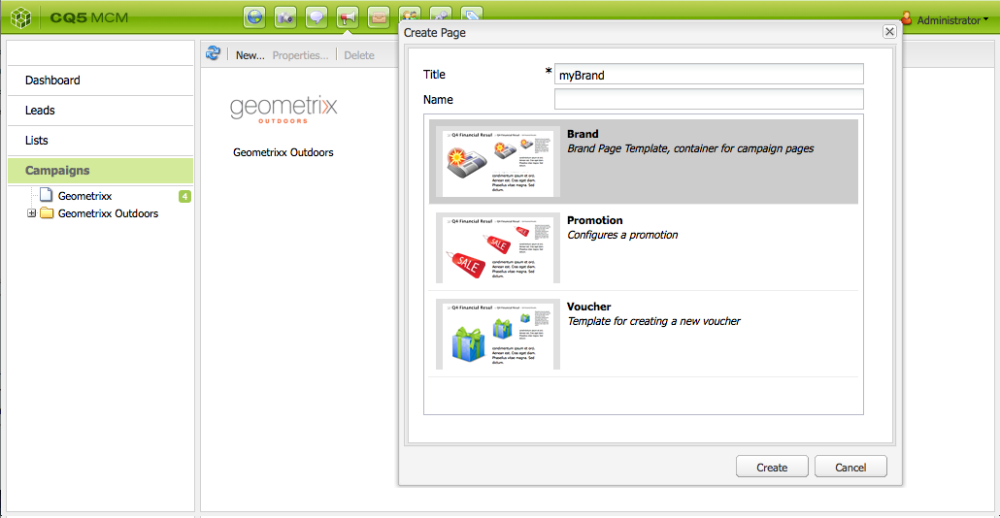

# Impostazione della campagna{#setting-up-your-campaign}

L’impostazione di una nuova campagna prevede i seguenti passaggi generali:

1. [Crea un marchio](#creating-a-new-brand) per le tue campagne.
1. Se necessario, puoi [definire le proprietà del nuovo marchio](#defining-the-properties-for-your-new-brand).
1. [Crea una campagna](#creating-a-new-campaign) a cui associare le esperienze, ad esempio pagine teaser o newsletter.
1. Se necessario puoi [definire le proprietà della nuova campagna](#defining-the-properties-for-your-new-campaign).

Quindi, a seconda del tipo di esperienza da creare, dovrai [creare un’esperienza](#creating-a-new-experience). I dettagli dell’esperienza e le azioni da eseguire dopo che sarà stata creata dipendono dal tipo di esperienza:

* Per la creazione di un teaser:

   1. [Crea un’esperienza teaser](/help/sites-classic-ui-authoring/classic-personalization-campaigns.md#creatingateaserexperience).
   1. [Aggiungi contenuti al teaser](/help/sites-classic-ui-authoring/classic-personalization-campaigns.md#addingcontenttoyourteaser).
   1. [Crea un punto di contatto per il teaser](/help/sites-classic-ui-authoring/classic-personalization-campaigns.md#creatingatouchpointforyourteaser) (aggiungi il teaser a una pagina di contenuto).

* Per la creazione di una newsletter:

   1. [Crea un’esperienza newsletter](/help/sites-classic-ui-authoring/classic-personalization-campaigns.md#creatinganewsletterexperience).
   1. [Aggiungi i contenuti alla newsletter.](/help/sites-classic-ui-authoring/classic-personalization-campaigns.md#addingcontenttonewsletters)
   1. [Personalizza la newsletter.](/help/sites-classic-ui-authoring/classic-personalization-campaigns.md#personalizingnewsletters)
   1. [Crea una pagina di destinazione accattivante per la newsletter](/help/sites-classic-ui-authoring/classic-personalization-campaigns.md#settingupanewsletterlandingpage).
   1. [Invia la newsletter](/help/sites-classic-ui-authoring/classic-personalization-campaigns.md#sendingnewsletters) a utenti abbonati o lead.

* Per la creazione di un’offerta Adobe Target (ex Test&amp;Target):

   1. [Crea un’esperienza offerta Adobe Target](/help/sites-classic-ui-authoring/classic-personalization-campaigns.md#creatingatesttargetofferexperience).
   1. [Procedi all’integrazione con Adobe Target](/help/sites-classic-ui-authoring/classic-personalization-campaigns.md#integratewithadobetesttarget)

>[!NOTE]
>
>Per istruzioni dettagliate sulla definizione dei segmenti, consulta [Segmentazione](/help/sites-administering/campaign-segmentation.md).

## Creazione di un nuovo marchio {#creating-a-new-brand}

Per creare un nuovo marchio:

1. Aprite **MCM** e selezionate **Campagne** nel riquadro a sinistra.

1. Selezionate **Nuovo...** per inserire il **Titolo** e il **Nome** e specificare il modello da usare per il marchio:

   

1. Fai clic su **Crea**. Il nuovo marchio verrà visualizzato in MCM (con un’icona predefinita).

### Definizione delle proprietà del nuovo marchio {#defining-the-properties-for-your-new-brand}

1. Da **Campagne** nel riquadro a sinistra, selezionate l’icona del nuovo marchio nel riquadro a destra e fate clic su **Proprietà...**

   Potete specificare il **Titolo**, la **Descrizione** e un’immagine da usare come icona.

   

1. Fate clic su **OK** per salvare. 

### Creazione di una nuova campagna {#creating-a-new-campaign}

Per creare una nuova campagna:

1. Da **Campagne**, selezionate il nuovo marchio nel riquadro a sinistra o fate doppio clic sull’icona nel riquadro a sinistra.

   Viene visualizzata la panoramica (vuota, in caso di nuovo marchio).

1. Fate clic su **Nuovo...** e specificate il **Titolo**, il **Nome** e il modello da usare per la nuova campagna.

   

1. Fai clic su **Crea**. La nuova campagna verrà mostrata in MCM.

### Definizione delle proprietà della nuova campagna {#defining-the-properties-for-your-new-campaign}

Configura le proprietà per le campagne che controllano il comportamento:

* **Priorità:** la priorità di questa campagna rispetto alle altre. Quando sono attive più campagne simultaneamente, la campagna con la priorità più elevata controlla l’esperienza del visitatore.
* **Tempo di attivazione e disattivazione:** queste proprietà consentono di controllare il periodo di tempo durante il quale la campagna controlla l’esperienza del visitatore. La proprietà Ora di attivazione controlla il momento in cui la campagna comincia a controllare l&#39;esperienza. La proprietà Ora di disattivazione controlla il momento in cui la campagna smette di controllare l&#39;esperienza.
* **Immagine:** l’immagine che rappresenta la campagna in AEM.
* **Servizi cloud:** le configurazioni del servizio cloud con cui la campagna è integrata. Vedi [Integrazione con Adobe Marketing Cloud](/help/sites-administering/marketing-cloud.md).

* **Adobe Target:** proprietà che consentono di configurare campagne integrate con Adobe Target. Vedi [Integrazione con Adobe Target](/help/sites-administering/target.md).

1. Da **Campagne**, seleziona il marchio. Nel riquadro a destra, seleziona la campagna e fai clic su **Proprietà**.

   Potete inserire varie proprietà, compresi un **Titolo**, una **Descrizione** ed eventuali **Servizi cloud**.

   

1. Fate clic su **OK** per salvare. 

### Creazione di una nuova esperienza {#creating-a-new-experience}

La procedura per la creazione di una nuova esperienza dipende dal tipo di esperienza:

* [Creazione di un teaser ](/help/sites-classic-ui-authoring/classic-personalization-campaigns.md#creatingateaser)
* [Creazione di una newsletter](/help/sites-classic-ui-authoring/classic-personalization-campaigns.md#creatinganewsletter)
* [Creazione di un’offerta Adobe Target](/help/sites-classic-ui-authoring/classic-personalization-campaigns.md#creatingatesttargetoffer)

>[!NOTE]
>
>Come nelle precedenti versioni, è ancora possibile creare l’esperienza come una pagina nella console **Siti web**. Sono inoltre supportate simili pagine create con le precedenti versioni.
>
>Ora, tuttavia, si consiglia di creare nuove esperienze mediante MCM.

### Configurazione della nuova esperienza {#configuring-your-new-experience}

Una volta creata la base dell’esperienza occorre effettuare le seguenti operazioni, a seconda del tipo di esperienza:

* [Teaser](/help/sites-classic-ui-authoring/classic-personalization-campaigns.md#teasers):

   * [Collega la pagina teaser ai segmenti di visitatori.](/help/sites-classic-ui-authoring/classic-personalization-campaigns.md#applyingasegmenttoyourteaser)
   * [Crea un punto di contatto per il teaser](/help/sites-classic-ui-authoring/classic-personalization-campaigns.md#creatingatouchpointforyourteaser) (aggiungi il teaser a una pagina di contenuto).

* [Newsletter](/help/sites-classic-ui-authoring/classic-personalization-campaigns.md#newsletters):

   * [Aggiungi i contenuti alla newsletter.](/help/sites-classic-ui-authoring/classic-personalization-campaigns.md#addingcontenttonewsletters)
   * [Personalizza la newsletter.](/help/sites-classic-ui-authoring/classic-personalization-campaigns.md#personalizingnewsletters)
   * [Invia la newsletter](/help/sites-classic-ui-authoring/classic-personalization-campaigns.md#sendingnewsletters) a utenti abbonati o lead.
   * [Crea una pagina di destinazione accattivante per la newsletter](/help/sites-classic-ui-authoring/classic-personalization-campaigns.md#settingupanewsletterlandingpage).

* [Offerta Adobe Target](/help/sites-classic-ui-authoring/classic-personalization-campaigns.md#testtargetoffers):

   * [Procedi all’integrazione con Adobe Target](/help/sites-administering/target.md)

### Aggiunta di un nuovo punto di contatto {#adding-a-new-touchpoint}

Se disponete di esperienze esistenti, potete aggiungere un nuovo punto di contatto direttamente dalla vista Calendario di MCM:

1. Selezionate la vista Calendario per la campagna.

1. Fate clic su **Aggiungi punto di contatto...** per aprire la finestra di dialogo. Specifica l’esperienza che desideri aggiungere:

   

1. Fate clic su **OK** per salvare. 

## Utilizzo dei lead {#working-with-leads}

>[!NOTE]
>
>Adobe non prevede ulteriori miglioramenti di questa funzionalità (gestione dei lead).
>Si consiglia di utilizzare [Adobe Campaign e l’integrazione con AEM](/help/sites-administering/campaign.md).

In MCM AEM è possibile organizzare e aggiungere i lead inserendoli manualmente oppure importando un elenco di voci separate da virgola, ad esempio una mailing list. I lead possono inoltre essere generati dalle registrazioni a newsletter o community (se configurate, queste possono avviare un workflow per la compilazione automatica dei lead).

In genere i lead sono organizzati per categorie e inseriti in un elenco in modo da consentire successive operazioni quali l’invio di messaggi e-mail personalizzati per un particolare gruppo.

Nel dashboard, potete accedere a tutti i lead facendo clic su **Lead** nel riquadro a sinistra. oppure accedendo dal riquadro **Elenchi**.

>[!NOTE]
>
>Per aggiungere o modificare gli avatar degli utenti, apri il cloud di clickstream (Ctrl+Alt+C), carica il profilo e fai clic su **Modifica**.

### Creazione di nuovi lead {#creating-new-leads}

Dopo aver creato nuovi lead, è necessario [attivarli](#activating-or-deactivating-leads) per poterne tracciare l’attività nell’istanza pubblicata e personalizzarne l’esperienza di utilizzo.

Per creare manualmente un nuovo lead:

1. In AEM, passa a MCM. Nella dashboard, fai clic su **Lead**.
1. Fai clic su **Nuovo**. Si apre la finestra **Crea nuovo**.

   

1. Inserisci le informazioni appropriate nei campi, quindi fai clic sulla scheda **Indirizzo**.

   

1. Inserisci i dati dell’indirizzo appropriati, quindi fai clic su **Salva** per salvare il lead. Per aggiungere altri lead, fai clic su **Salva e nuovo**.

   Il nuovo lead viene visualizzato nel riquadro Lead. Quando fai clic sulla voce, nel riquadro a destra vengono visualizzate tutte le informazioni inserite. Dopo aver creato un lead, è possibile aggiungerlo a un elenco.

   

### Attivazione o disattivazione dei lead {#activating-or-deactivating-leads}

L’attivazione dei lead consente di tenere traccia della loro attività nell’istanza pubblicata e di personalizzarne l’esperienza di utilizzo. Se non si desidera più tracciarne l’attività, è possibile disattivarli.

Per attivare o disattivare i lead:

1. In AEM, passa a MCM e fai clic su **Lead**.

1. Selezionate i lead da attivare o disattivare e fate clic su **Attiva** o **Disattiva**.

   

   Come per le pagine AEM, lo stato di pubblicazione è indicato nella colonna **Pubblicato**.

   

### Importazione di nuovi lead {#importing-new-leads}

Quando si importano nuovi lead, è possibile aggiungerli automaticamente a un elenco esistente oppure creare un nuovo elenco in cui includerli.

Per importare i lead da un elenco separato da virgole:

1. In AEM, passa a MCM e fai clic su **Lead**.

   >[!NOTE]
   >
   >In alternativa, importa i lead effettuando una delle seguenti operazioni:
   >
   >* Nel dashboard, fate clic su **Importa lead** nel riquadro **Elenchi**.
   >* Fate clic su **Elenchi** e, nel menu **Strumenti**, selezionate **Importa lead**.

1. Nel menu **Strumenti**, selezionate **Importa** **lead**.

1. Inserite le informazioni come descritto in Esempio di dati. È possibile importare i seguenti campi: email,familyName,givenName,gender,aboutMe,city,country,phoneNumber,postalCode,region,streetAddress

   >[!NOTE]
   >
   >La prima riga nell’elenco CSV contiene etichette predefinite che devono essere scritte esattamente come in questo esempio:
   >
   >
   >`email,givenName,familyName` - se scritto come `givenname`, ad esempio, il sistema non lo riconoscerà.

   

1. Fai clic su **Avanti**. Viene visualizzata un’anteprima dei lead per verificarne la correttezza.

   

1. Fai clic su **Avanti**. Seleziona l’elenco in cui inserire i lead. Se non desideri inserirli in alcun elenco, elimina le informazioni presenti nel campo. Per impostazione predefinita, in AEM viene creato un nome di elenco con data e ora. Fai clic su **Importa**.

   

   Il nuovo lead viene visualizzato nel riquadro Lead. Quando fai clic sulla voce, nel riquadro a destra vengono visualizzate tutte le informazioni inserite. Dopo aver creato un lead, è possibile aggiungerlo a un elenco.

### Aggiunta di lead a elenchi {#adding-leads-to-lists}

Per aggiungere i lead a elenchi esistenti:

1. In MCM, fate clic su **Lead** per visualizzare tutti i lead disponibili.

1. Per selezionare i lead da aggiungere a un elenco, attivate la casella di selezione accanto a ciascun lead. È possibile aggiungere un numero illimitato di lead.

   

1. Nel menu **Strumenti**, seleziona **Aggiungi all’elenco.** Viene aperta la finestra **Aggiungi all’elenco**.

   

1. Seleziona l’elenco a cui desideri aggiungere i lead e fai clic su **OK**. I lead vengono aggiunti ai relativi elenchi.

### Visualizzazione delle informazioni sui lead {#viewing-lead-information}

Per visualizzare le informazioni su un lead, in MCM fai clic sulla casella di selezione accanto al lead. Viene aperto un riquadro a destra contenente le informazioni sul lead, compresi gli elenchi a cui appartiene.

### Modifica di lead esistenti {#modifying-existing-leads}

Per modificare le informazioni di un lead:

1. In MCM, fate clic su **Lead**. Nell’elenco dei lead, seleziona la casella accanto al lead da modificare. Nel riquadro a destra vengono visualizzate tutte le informazioni del lead.

   

   >[!NOTE]
   >
   >È possibile modificare un solo lead alla volta. Per modificare i lead che appartengono a uno stesso elenco, modificate l’elenco stesso.

1. Fate clic su **Modifica**. Viene aperta la finestra **Modifica lead**.

   

1. Apportate le modifiche necessarie e fate clic su **Salva** per salvarle.

   >[!NOTE]
   >
   >Per cambiare l’avatar del lead, passate al profilo dell’utente. Per caricare il profilo in Client Context, premete CTRL+ALT+C, fate clic su **Carica**, quindi selezionate il profilo.

### Eliminazione di lead esistenti {#deleting-existing-leads}

Per eliminare i lead esistenti, in MCM seleziona la casella di selezione accanto al lead e fai clic su **Elimina**. Il lead viene rimosso dall’elenco dei lead e da tutti i relativi elenchi associati.

>[!NOTE]
>
>Prima di procedere all’eliminazione, viene chiesto di confermare se si desidera eliminare il lead esistente. Una volta eliminato non sarà più possibile ripristinarlo.

## Utilizzo degli elenchi {#working-with-lists}

>[!NOTE]
>
>Adobe non prevede ulteriori miglioramenti di questa funzionalità (gestione degli elenchi).
>Si consiglia di utilizzare [Adobe Campaign e l’integrazione con AEM](/help/sites-administering/campaign.md).

Gli elenchi consentono di organizzare i lead in gruppi. Tramite gli elenchi è possibile indirizzare una campagna di marketing a un determinato gruppo di utenti. Ad esempio, è possibile inviare una newsletter a un particolare elenco. Gli elenchi sono visibili in MCM, nella dashboard o facendo clic su **Elenchi**. Entrambi presentano il nome dell’elenco e il numero di membri.

Facendo clic su **Elenchi** è possibile vedere se l’elenco stesso è membro di un altro elenco e ottenerne una descrizione.

### Creazione di nuovi elenchi {#creating-new-lists}

Per creare un nuovo elenco (gruppo):

1. Nel dashboard di MCM, fate clic su **Nuovo elenco...**; oppure, in **Elenchi** fate clic su **Nuovo...**. Viene aperta la finestra Crea elenco.

   

1. Inserisci un nome (obbligatorio) e una descrizione (facoltativa), quindi fai clic su **Salva**. L’elenco viene visualizzato nel riquadro **Elenchi**.

   

### Modifica di elenchi esistenti {#modifying-existing-lists}

Per modificare un elenco esistente:

1. In MCM, fate clic su **Elenchi**.

1. Selezionate la casella accanto all’elenco da modificare e fate clic su **Modifica**. viene aperta la finestra **Modifica elenco**.

   

   >[!NOTE]
   >
   >È possibile modificare un solo elenco alla volta.

1. Apportate le modifiche necessarie e fate clic su **Salva** per salvarle.

### Eliminazione di elenchi esistenti {#deleting-existing-lists}

Per eliminare gli elenchi esistenti, in MCM seleziona la casella accanto all’elenco e fai clic su **Elimina**. L’elenco viene rimosso. Non vengono rimossi i lead che appartenevano all’elenco, ma solo l’associazione con l’elenco.

>[!NOTE]
>
>Prima di procedere all’eliminazione, viene chiesto di confermare se si desidera eliminare l’elenco esistente. Una volta eliminato non sarà più possibile ripristinarlo.

### Unione di elenchi {#merging-lists}

È possibile unire un elenco esistente a un altro elenco. Così facendo, l’elenco che viene unito diventa membro dell’altro elenco. Non viene eliminato e resta comunque disponibile come entità separata.

L’unione di elenchi è utile, ad esempio, se una stessa conferenza avrà luogo in due città diverse e si desidera ottenere un elenco unico per i partecipanti di entrambe le città.

Per unire elenchi esistenti:

1. In MCM, fate clic su **Elenchi**.

1. Selezionate l’elenco da unire a un altro elenco, selezionandone la casella.

1. Nel menu **Strumenti**, selezionate **Unisci elenco**.

   >[!NOTE]
   >
   >È possibile unire un solo elenco alla volta.

1. Nella finestra **Unisci elenco**, selezionate l’elenco di destinazione e fate clic su **OK**.

   

   Il numero di membri dell’elenco di destinazione viene incrementato di uno. Per verificare che l’elenco è stato unito, selezionate l’elenco di destinazione e, nel menu **Strumenti**, selezionate **Mostra lead**.

1. Ripetete questo passaggio per tutti gli elenchi da unire.

   

>[!NOTE]
>
>Per rimuovere un elenco unito dal suo elenco di destinazione si esegue la stessa procedura richiesta per rimuovere un lead da un elenco. Apri la scheda **Elenchi**, seleziona l’elenco che comprende l’elenco unito e rimuovi l’iscrizione facendo clic sul cerchio rosso accanto all’elenco.

### Visualizzazione dei lead negli elenchi {#viewing-leads-in-lists}

In qualsiasi momento è possibile vedere quali lead appartengono a uno specifico elenco tramite navigazione o ricerca dei membri.

Per vedere i lead che appartengono a un elenco:

1. In MCM, fate clic su **Elenchi**.

1. Selezionate la casella accanto all’elenco di interesse.

1. Nel menu **Strumenti**, seleziona **Mostra lead**. AEM visualizza i lead che fanno parte di tale elenco. È possibile sfogliare un elenco oppure ricercare i membri.

   >[!NOTE]
   >
   >Inoltre, è possibile eliminare i lead da un elenco selezionandoli e facendo clic su **Rimuovi appartenenza**.

   

1. Fai clic su **Chiudi** per tornare a MCM.
