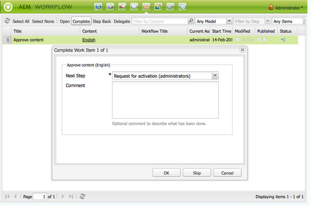

# Partecipazione ai flussi di lavoro{#participating-in-workflows}

In genere i flussi di lavoro includono passaggi che richiedono di eseguire un’attività su una pagina o una risorsa. Il flusso di lavoro seleziona un utente o un gruppo per eseguire l’attività e assegna un elemento di lavoro a tale persona o gruppo.

## Elaborazione degli elementi di lavoro {#processing-your-work-items}

Per elaborare un elemento di lavoro è possibile eseguire le azioni seguenti:

* **Completa**

  Quando si completa un elemento di lavoro, il flusso di lavoro procede al passaggio successivo.

* **Delega**

  Se ti è stato assegnato un passaggio, ma per qualche motivo non ti è possibile intervenire, puoi delegarlo a un altro utente o gruppo.

  Gli utenti disponibili per la delega dipendono dal tipo di assegnatario dell’elemento di lavoro:

   * Se l’elemento di lavoro è stato assegnato a un gruppo, sono disponibili i membri del gruppo.
   * Se l’elemento di lavoro è stato assegnato a un gruppo e poi è stato delegato a un utente, sono disponibili i membri del gruppo e il gruppo.
   * Se l’elemento di lavoro è stato assegnato a un singolo utente, l’elemento di lavoro non può essere delegato.

* **Indietro**

  Se scopri che un passaggio, o una serie di passaggi, deve essere ripetuto, puoi fare un passo indietro. Questo consente di selezionare un passaggio precedente nel flusso di lavoro, per la rielaborazione. Il flusso di lavoro ritorna al passaggio specificato, quindi procede da lì.

## Partecipazione a un flusso di lavoro {#participating-in-a-workflow}

### Notifiche delle azioni del flusso di lavoro assegnate {#notifications-of-assigned-workflow-actions}

Quando ti viene assegnato un elemento di lavoro (ad esempio, **Approva contenuto**) vengono visualizzati diversi avvisi e/o notifiche:

* La colonna **Stato** della console Siti Web indica quando una pagina si trova in un flusso di lavoro:

  

* Quando a te o a un gruppo a cui appartieni viene assegnato un elemento di lavoro come parte di un flusso di lavoro, l’elemento di lavoro viene visualizzato nella casella in entrata del flusso di lavoro AEM.

  

### Completamento di un passaggio partecipante {#completing-a-participant-step}

Dopo aver eseguito l’azione indicata, puoi completare l’elemento di lavoro, consentendo in tal modo la continuazione del flusso di lavoro. Per completare l&#39;elemento di lavoro, attenersi alla procedura descritta di seguito.

1. Seleziona il passaggio del flusso di lavoro e fai clic sul pulsante **Completa** nella barra di navigazione superiore.
1. Nella finestra di dialogo risultante, seleziona il **Passaggio successivo**, ovvero il passaggio da eseguire successivamente. Un elenco a discesa mostra tutte le destinazioni appropriate. È inoltre possibile immettere **Commento**.

   

   Il numero di passaggi elencati dipende dalla progettazione del modello di flusso di lavoro.

1. Fai clic su **OK** per confermare l&#39;azione.

### Delega di un passaggio partecipante {#delegating-a-participant-step}

Per delegare un elemento di lavoro, attenersi alla procedura descritta di seguito.

1. Fai clic sul pulsante **Delega** nella barra di navigazione superiore.
1. Nella finestra di dialogo, utilizza l&#39;elenco a discesa per selezionare l&#39;**utente** a cui delegare l&#39;elemento di lavoro. Puoi anche aggiungere un **Commento**.

   

1. Fai clic su **OK** per confermare l&#39;azione.

### Esecuzione di un passo indietro su un Passaggio Partecipante {#performing-step-back-on-a-participant-step}

Per tornare indietro, attenersi alla procedura descritta di seguito.

1. Fai clic sul pulsante Indietro nella barra di navigazione superiore.
1. Nella finestra di dialogo risultante, seleziona il passaggio precedente, ovvero il passaggio da eseguire successivamente, anche se si tratta di un passaggio precedente nel flusso di lavoro. Un elenco a discesa mostra tutte le destinazioni appropriate.

   

1. Fai clic su OK per confermare l’azione.
