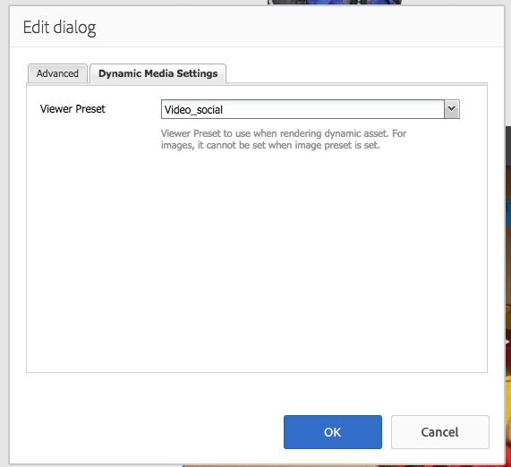

# Aggiunta di risorse Dynamic Media alle pagine{#adding-dynamic-media-assets-to-pages}

Per aggiungere la funzionalità Dynamic Medie alle risorse utilizzate nei siti Web, puoi aggiungere il componente **[!UICONTROL Dynamic Medie]** o **[!UICONTROL Interactive Media]** direttamente nella pagina. Attiva la modalità **[!UICONTROL Progettazione]** e abilita i componenti Dynamic Medie. Quindi, potrai aggiungere questi componenti alla pagina e fornire così risorse al componente. I componenti Dynamic Medie e gli elementi multimediali interattivi sono intelligenti: rilevano l’aggiunta di un’immagine o di un video e le opzioni disponibili cambiano di conseguenza.

Se utilizzi Adobe Experience Manager come WCM, puoi aggiungere direttamente alla pagina le risorse Dynamic Medie.

>[!NOTE]
>
>Per i banner a carosello sono disponibili mappe immagine pronte all’uso.

## Aggiungere un componente Dynamic Medie a una pagina {#adding-a-dynamic-media-component-to-a-page}

L&#39;aggiunta del componente [!UICONTROL Dynamic Medie] o [!UICONTROL Interactive Media] a una pagina equivale all&#39;aggiunta di un componente a qualsiasi pagina. I componenti [!UICONTROL Dynamic Medie] e [!UICONTROL Interactive Media] sono descritti in dettaglio nelle sezioni seguenti.

Per aggiungere un componente/visualizzatore Dynamic Medie a una pagina:

1. Ad Experience Manager, apri la pagina in cui desideri aggiungere il componente Dynamic Medie.
1. Se non è disponibile alcun componente di Dynamic Medie, selezionare il righello nel [!UICONTROL Sidekick] per accedere alla modalità **[!UICONTROL Progettazione]**.
1. Selezionare **[!UICONTROL Modifica]** parsys.
1. Seleziona **[!UICONTROL Dynamic Medie]** per rendere disponibili i componenti di Dynamic Medie.

   >[!NOTE]
   >
   >Per ulteriori informazioni, vedere [Configurazione dei componenti in modalità progettazione](/help/sites-authoring/default-components-designmode.md).

1. Torna alla modalità **[!UICONTROL Modifica]** facendo clic sull&#39;icona della matita nel [!UICONTROL Sidekick].
1. Trascina il componente **[!UICONTROL Dynamic Medie]** o **[!UICONTROL File multimediali interattivi]** dal gruppo **[!UICONTROL Other]** nella barra laterale nella pagina nella posizione desiderata.
1. Seleziona **[!UICONTROL Modifica]** per aprire il componente.
1. [Modificare il componente](#dynamic-media-component) in base alle esigenze.
1. Seleziona **[!UICONTROL OK]** per salvare le modifiche.

## Componenti Dynamic Medie {#dynamic-media-components}

[!UICONTROL Dynamic Medie] e [!UICONTROL Interactive Media] sono disponibili nel [!UICONTROL Sidekick] in **[!UICONTROL Dynamic Medie]**. Il componente **[!UICONTROL File multimediali interattivi]** viene utilizzato per qualsiasi risorsa interattiva, ad esempio video interattivo, immagini interattive o set carosello. Per tutti gli altri componenti di Dynamic Medie, utilizzare il componente **[!UICONTROL Dynamic Medie]**.

>[!NOTE]
>
>Questi componenti non sono disponibili per impostazione predefinita e devono essere selezionati in modalità Progettazione prima di utilizzare. [Dopo che sono stati resi disponibili in modalità Progettazione](/help/sites-authoring/default-components-designmode.md), puoi aggiungere i componenti alla pagina come faresti con qualsiasi altro componente di Experience Manager.

### Componente Dynamic Medie {#dynamic-media-component}

Il componente Dynamic Medie è intelligente: a seconda che si aggiunga un’immagine o un video, sono disponibili varie opzioni. Il componente supporta predefiniti per immagini, visualizzatori basati su immagini come set di immagini, set 360 gradi, set di file multimediali diversi e video. Inoltre, il visualizzatore è reattivo. In altre parole, le dimensioni dello schermo cambiano automaticamente in base alle dimensioni dello schermo. Tutti i visualizzatori sono basati su HTML5.

>[!NOTE]
>
>Quando aggiungi il componente [!UICONTROL Dynamic Medie] e **[!UICONTROL Impostazioni Dynamic Medie]** è vuoto o non puoi aggiungere una risorsa in modo corretto, verifica che:
>
>* Hai [abilitato Dynamic Medie](/help/assets/config-dynamic.md). Dynamic Medie è disabilitato per impostazione predefinita.
>* L&#39;immagine ha un file tiff piramidale. Le immagini importate prima dell&#39;attivazione di Dynamic Medie non dispongono di un file tiff piramidale.
>

#### Utilizzo delle immagini {#when-working-with-images}

Il componente [!UICONTROL Dynamic Medie] consente di aggiungere immagini dinamiche, inclusi set di immagini, set 360 gradi e set di file multimediali diversi. È possibile ingrandire, ridurre e, se applicabile, ruotare un&#39;immagine all&#39;interno di un set 360 gradi o selezionare un&#39;immagine da un altro tipo di set.

Puoi anche configurare il predefinito visualizzatore, il predefinito immagine o il formato immagine direttamente nel componente. Per rendere reattiva un’immagine, puoi impostare i punti di interruzione o applicare un predefinito per immagine reattiva.

È possibile modificare le impostazioni di Dynamic Medie seguenti facendo clic su **[!UICONTROL Modifica]** nel componente e quindi sulla scheda **[!UICONTROL Impostazioni Dynamic Medie]**.

>[!NOTE]
>
>Per impostazione predefinita, il componente immagine Dynamic Media è adattivo. Se vuoi impostarne una dimensione fissa, impostala nel componente nella scheda **[!UICONTROL Avanzate]** con le proprietà **[!UICONTROL Larghezza]** e **[!UICONTROL Altezza]**.

**[!UICONTROL Predefinito visualizzatore]** - Seleziona un predefinito visualizzatore esistente dal menu a discesa. Se il predefinito visualizzatore che stai cercando non è visibile, devi renderlo visibile. Vedere [Gestione dei predefiniti visualizzatore](/help/assets/managing-viewer-presets.md). Non è possibile selezionare un predefinito visualizzatore se si utilizza un predefinito immagine e viceversa.

Questa opzione è disponibile solo se vengono visualizzati set di immagini, set 360 gradi o set di file multimediali diversi. I predefiniti visualizzatore visualizzati sono intelligenti. In altre parole, vengono visualizzati solo i predefiniti visualizzatore rilevanti.

**[!UICONTROL Predefinito immagine]** - Seleziona un predefinito immagine esistente dal menu a discesa. Se il predefinito immagine che state cercando non è visibile, dovete renderlo visibile. Vedere [Gestione dei predefiniti immagine](/help/assets/managing-image-presets.md). Non è possibile selezionare un predefinito visualizzatore se si utilizza un predefinito immagine e viceversa.

Questa opzione non è disponibile se visualizzi set di immagini, set 360 gradi o set di file multimediali diversi.

**[!UICONTROL Modificatori immagine]** - È possibile modificare gli effetti immagine fornendo ulteriori comandi immagine. Questi comandi sono descritti in [Gestione dei predefiniti immagine](/help/assets/managing-viewer-presets.md) e nel [Riferimento comando](https://experienceleague.adobe.com/docs/dynamic-media-developer-resources/image-serving-api/image-serving-api/http-protocol-reference/command-reference/c-command-reference.html?lang=it).

Questa opzione non è disponibile se visualizzi set di immagini, set 360 gradi o set di file multimediali diversi.

**[!UICONTROL Punti di interruzione]** - Se utilizzi questa risorsa in un sito reattivo, devi aggiungere i punti di interruzione di pagina. I punti di interruzione delle immagini sono separati da virgole (,). Questa opzione funziona quando in un predefinito immagine non è definita alcuna altezza o larghezza.

Questa opzione non è disponibile se visualizzi set di immagini, set 360 gradi o set di file multimediali diversi.

Puoi modificare le [!UICONTROL Impostazioni avanzate] seguenti facendo clic su **[!UICONTROL Modifica]** nel componente.

**[!UICONTROL Titolo]** - Modifica il titolo dell&#39;immagine.

**[!UICONTROL Testo alternativo]** - Aggiungi un titolo all&#39;immagine per gli utenti che hanno la grafica disattivata.

Questa opzione non è disponibile se visualizzi set di immagini, set 360 gradi o set di file multimediali diversi.

**[!UICONTROL URL, Apri in]** - Puoi impostare una risorsa da per aprire un collegamento. Impostare **[!UICONTROL URL]** e **[!UICONTROL Apri in]** per indicare se si desidera aprirlo nella stessa finestra o in una nuova finestra.

Questa opzione non è disponibile se visualizzi set di immagini, set 360 gradi o set di file multimediali diversi.

**[!UICONTROL Larghezza e altezza]** - Immettere il valore in pixel se si desidera che l&#39;immagine abbia una dimensione fissa. Se si omettono questi valori, la risorsa diventa adattiva.

#### Quando si lavora con il video {#when-working-with-video}

Utilizza il componente **[!UICONTROL Dynamic Medie]** per aggiungere video dinamici alle pagine Web. Quando modifichi il componente, puoi scegliere di utilizzare un predefinito visualizzatore video predefinito per riprodurre il video sulla pagina.

Puoi modificare le [!UICONTROL Impostazioni Dynamic Medie] seguenti facendo clic su **[!UICONTROL Modifica]** nel componente.

>[!NOTE]
>
>Per impostazione predefinita, il componente video Dynamic Medie è adattivo. Se vuoi impostarne una dimensione fissa, impostala nel componente con **[!UICONTROL Larghezza]** e **[!UICONTROL Altezza]** nella scheda **[!UICONTROL Avanzate]**.

**[!UICONTROL Predefinito visualizzatore]** - Seleziona un predefinito visualizzatore video esistente dal menu a discesa. Se il predefinito visualizzatore che stai cercando non è visibile, devi renderlo visibile. Vedere [Gestione dei predefiniti visualizzatore](/help/assets/managing-viewer-presets.md).

Puoi modificare le seguenti impostazioni di [!UICONTROL Avanzate] facendo clic su **[!UICONTROL Modifica]** nel componente.

**[!UICONTROL Titolo]** - Modifica il titolo del video.

**[!UICONTROL Larghezza e altezza]** - Inserisci il valore in pixel se vuoi che il video abbia una dimensione fissa. Se si omettono questi valori, la variabile diventa adattiva.

#### Distribuire video sicuri {#how-to-delivery-secure-video}

Nell&#39;Experience Manager 6.2, quando installi [FP-13480](https://experience.adobe.com/#/downloads/content/software-distribution/en/aem.html?package=/content/software-distribution/en/details.html/content/dam/aem/public/adobe/packages/cq620/featurepack/cq-6.2.0-featurepack-13480), puoi controllare se un video viene distribuito tramite una connessione SSL protetta (HTTPS) o una connessione non sicura (HTTP). Per impostazione predefinita, il protocollo di consegna video viene ereditato automaticamente dal protocollo della pagina web in cui è incorporato. Se la pagina web viene caricata su HTTPS, anche il video viene distribuito su HTTPS. Al contrario, se la pagina web è su HTTP, il video viene distribuito su HTTP. In genere, questo comportamento predefinito va bene e non è necessario apportare modifiche alla configurazione. Tuttavia, puoi ignorare questo comportamento predefinito. Aggiungi `VideoPlayer.ssl=on` alla fine di un percorso URL o all&#39;elenco di altri parametri di configurazione del visualizzatore in un frammento di codice da incorporare. Entrambe le azioni impongono la distribuzione sicura dei video.

Per ulteriori informazioni sulla distribuzione video protetta e sull&#39;utilizzo dell&#39;attributo di configurazione `VideoPlayer.ssl` nel percorso URL, vedere [Distribuzione video protetta](https://experienceleague.adobe.com/docs/dynamic-media-developer-resources/library/viewers-aem-assets-dmc/video/c-html5-video-viewer-20-securevideodelivery.html?lang=it) nella Guida di riferimento visualizzatori. Oltre al visualizzatore video, per il visualizzatore di file multimediali diversi e per il visualizzatore di video interattivi è disponibile una distribuzione video protetta.

### Componente per contenuti multimediali interattivi {#interactive-media-component}

Il componente Contenuti multimediali interattivi è destinato alle risorse che presentano interattività, come punti attivi o mappe immagine. Se disponi di un&#39;immagine interattiva, di un video interattivo o di un banner a carosello, utilizza il componente **[!UICONTROL File multimediali interattivi]**.

Il componente [!UICONTROL File multimediali interattivi] è intelligente. A seconda che si aggiunga un&#39;immagine o un video, sono disponibili varie opzioni. Inoltre, il visualizzatore è reattivo. In altre parole, le dimensioni dello schermo cambiano automaticamente in base alle dimensioni dello schermo. Tutti i visualizzatori sono basati su HTML5.

Puoi modificare le seguenti impostazioni di **[!UICONTROL Generali]** facendo clic su **[!UICONTROL Modifica]** nel componente.

**[!UICONTROL Predefinito visualizzatore]** - Seleziona un predefinito visualizzatore esistente dal menu a discesa. Se il predefinito visualizzatore che stai cercando non è visibile, devi renderlo visibile. I predefiniti visualizzatore devono essere pubblicati prima di poter essere utilizzati. Consulta [Gestire i predefiniti visualizzatore](/help/assets/managing-viewer-presets.md).

**[!UICONTROL Titolo]** - Modifica il titolo del video.

**[!UICONTROL Larghezza e altezza]** - Inserisci il valore in pixel se vuoi che il video abbia una dimensione fissa. Se si omettono questi valori, la variabile diventa adattiva.

Puoi modificare le seguenti impostazioni di **[!UICONTROL Aggiungi al carrello]** facendo clic su **[!UICONTROL Modifica]** nel componente.

**[!UICONTROL Mostra risorsa prodotto]** - Per impostazione predefinita, questo valore è selezionato. La risorsa prodotto mostra un’immagine del prodotto come definito nel modulo Commerce. Per non visualizzare la risorsa del prodotto, deseleziona questa opzione.

**[!UICONTROL Mostra prezzo prodotto]** - Per impostazione predefinita, questo valore è selezionato. Nel campo Prezzo prodotto viene visualizzato il prezzo dell&#39;articolo definito nel modulo Commerce. Deselezionare il segno di spunta per non visualizzare il prezzo del prodotto.

**[!UICONTROL Mostra modulo prodotto]** - Per impostazione predefinita, questo valore non è selezionato. Il Modulo prodotto include qualsiasi variante di prodotto, ad esempio dimensioni e colore. Deseleziona il segno di spunta per non mostrare le varianti prodotto.
