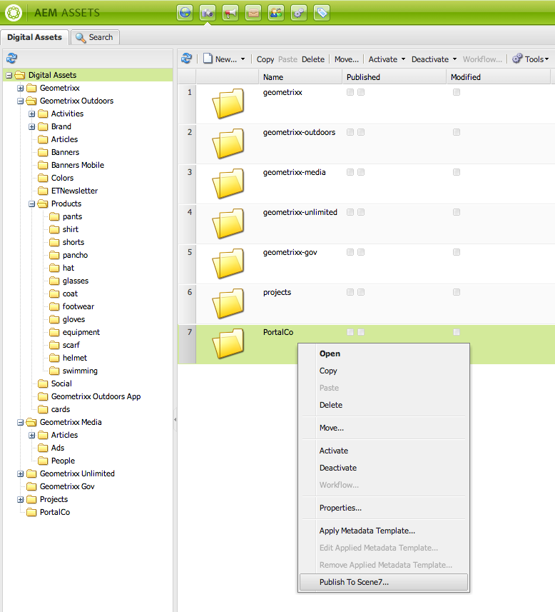
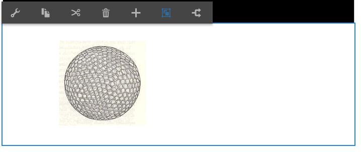
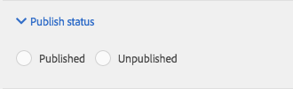

# Aggiungere funzionalità di Dynamic Media Classic (Scene7) alla pagina{#adding-scene-features-to-your-page}

[Adobe Dynamic Media Classic (Scene7)](https://experienceleague.adobe.com/docs/dynamic-media-classic/using/home.html) è una soluzione in hosting per la gestione, l’ottimizzazione, la pubblicazione e la distribuzione di risorse multimediali sul web, su dispositivi mobili, e-mail e su schermi collegati a Internet.

Puoi visualizzare le risorse di Experience Manager pubblicate in Dynamic Media Classic (Scene7) in diversi visualizzatori:

* Zoom
* A comparsa
* Video
* Modello immagini
* Immagine

Puoi pubblicare risorse digitali direttamente da Experience Manager a Dynamic Media Classic (Scene7) e da Dynamic Media Classic (Scene7) ad Experience Manager.

Questo documento descrive come pubblicare risorse digitali da Experience Manager a Dynamic Media Classic (Scene7) e viceversa. Sono inoltre descritti nel dettaglio i visualizzatori. Per informazioni sulla configurazione di Experience Manager per Dynamic Media Classic (Scene7), consulta [Integrazione di Dynamic Media Classic (Scene7) con Experience Manager](/help/sites-administering/scene7.md).

Vedi anche [Aggiungi mappe immagine](/help/assets/image-maps.md).

Per ulteriori informazioni sull’utilizzo dei componenti video con Experience Manager, consulta:

* [Video](/help/sites-classic-ui-authoring/manage-assets-classic-s7-video.md)

>[!NOTE]
>
>Se le risorse Dynamic Media Classic (Scene7) non vengono visualizzate correttamente, assicurati che Dynamic Media sia [disattivato](/help/assets/config-dynamic.md#disabling-dynamic-media) e quindi aggiorna la pagina.

## Pubblicazione manuale in Dynamic Media Classic (Scene7) da Assets {#manually-publishing-to-scene-from-assets}

Puoi pubblicare risorse digitali in Dynamic Media Classic (Scene7) dalla console Risorse nell’interfaccia classica o direttamente dalla risorsa.

>[!NOTE]
>
>Experience Manager pubblica in Dynamic Media Classic (Scene7) in modo asincrono. Dopo aver selezionato **[!UICONTROL Pubblica]** La pubblicazione della risorsa in Dynamic Media Classic (Scene7) potrebbe richiedere alcuni secondi.

### Pubblicazione dalla console Assets {#publishing-from-the-assets-console}

Puoi pubblicare su Dynamic Media Classic (Scene7) dalla console Risorse se le risorse si trovano in una cartella di destinazione di Dynamic Media Classic (Scene7).

1. Nell’interfaccia classica di Experience Manager, seleziona **[!UICONTROL Risorse digitali]** per accedere al manager di risorse digitali.

1. Seleziona la risorsa (o le risorse) o la cartella all’interno della cartella di destinazione da pubblicare in Dynamic Media Classic (Scene7), fai clic con il pulsante destro del mouse e seleziona **[!UICONTROL Pubblicare su Dynamic Media Classic (Scene7)]**. In alternativa, è possibile selezionare **[!UICONTROL Pubblicare su Dynamic Media Classic (Scene7)]** dal **[!UICONTROL Strumenti]** menu.

   

1. Vai su Dynamic Media Classic (Scene7) e conferma che le risorse sono disponibili.

   >[!NOTE]
   >
   >Se le risorse non si trovano in una cartella sincronizzata di Dynamic Media Classic (Scene7), **[!UICONTROL Pubblicare su Dynamic Media Classic (Scene7)]** in entrambi i menu è visibile ma disabilitato.

### Pubblicare da una risorsa {#publishing-from-an-asset}

Puoi pubblicare manualmente una risorsa purché si trovi all’interno della cartella sincronizzata Dynamic Media Classic (Scene7).

>[!NOTE]
>
>Se la risorsa non si trova nella cartella sincronizzata di Dynamic Media Classic (Scene7), il collegamento a **[!UICONTROL Pubblicare su Dynamic Media Classic (Scene7)]** non viene visualizzato.

Per pubblicare su Dynamic Media Classic (Scene7) direttamente da una risorsa digitale:

1. In Experience Manager, seleziona **[!UICONTROL Risorse digitali]** per accedere al manager di risorse digitali.

1. Fai doppio clic per aprire una risorsa.

1. Nel riquadro dei dettagli delle risorse, seleziona **[!UICONTROL Pubblicare su Dynamic Media Classic (Scene7)]**.

   

1. Il collegamento diventa **[!UICONTROL Pubblicazione...]** e quindi **[!UICONTROL Pubblicato]**. Vai su Dynamic Media Classic (Scene7) e conferma che la risorsa è disponibile.

   >[!NOTE]
   >
   >Se la risorsa non viene pubblicata correttamente in Dynamic Media Classic (Scene7), il collegamento diventa **[!UICONTROL Pubblicazione non riuscita]**. Se la risorsa è già stata pubblicata su Dynamic Media Classic (Scene7), il collegamento legge **[!UICONTROL Ripubblicazione in Dynamic Media Classic (Scene7)]**. La ripubblicazione consente di modificare le risorse in Experience Manager e ripubblicarle.

### Pubblicare risorse dall’esterno della cartella di destinazione CQ {#publishing-assets-from-outside-the-cq-target-folder}

Adobe consiglia di pubblicare le risorse in Dynamic Media Classic (Scene7) solo dalle risorse all’interno della cartella di destinazione Dynamic Media Classic (Scene7). Tuttavia, se devi caricare le risorse da una cartella esterna a quella di destinazione, puoi comunque farlo caricandole in una cartella on-demand su Dynamic Media Classic (Scene7). In primo luogo, configura la configurazione Cloud per la pagina in cui desideri visualizzare la risorsa. Quindi aggiungi un componente Dynamic Media Classic (Scene7) alla pagina e trascina e rilascia una risorsa sul componente. Dopo aver impostato le proprietà della pagina per quella pagina, un **[!UICONTROL Pubblicare su Dynamic Media Classic (Scene7)]** viene visualizzato un collegamento che, se selezionato, attiva il caricamento in Dynamic Media Classic (Scene7).

>[!NOTE]
>
>Le risorse presenti nella cartella on-demand non vengono visualizzate nel browser dei contenuti di Dynamic Media Classic (Scene7).

**Per pubblicare risorse dall’esterno della cartella di destinazione di CQ:**

1. Ad Experience Manager, nell’interfaccia classica, seleziona **[!UICONTROL Siti Web]** e passa alla pagina web alla quale desideri aggiungere una risorsa digitale non ancora pubblicata in Dynamic Media Classic (Scene7). (Si applicano le normali regole di ereditarietà delle pagine.)

1. Nella barra laterale, seleziona la **[!UICONTROL Pagina]** e seleziona **[!UICONTROL Proprietà pagina]**.

1. Seleziona **[!UICONTROL Cloud Services]**.
1. Seleziona **[!UICONTROL Aggiungi servizi]**.
1. Seleziona **[!UICONTROL Dynamic Media Classic (Scene7)]**.
1. In **[!UICONTROL Adobe Dynamic Media Classic (Scene7)]** elenco a discesa, seleziona la configurazione desiderata e seleziona **[!UICONTROL OK]**.

   

1. Nella pagina web, aggiungi un componente Dynamic Media Classic (Scene7) nella posizione desiderata sulla pagina.
1. Dal Content Finder, trascina una risorsa digitale sul componente. Viene visualizzato un collegamento a **[!UICONTROL Verifica lo stato di pubblicazione di Dynamic Media Classic (Scene7)]**.

   >[!NOTE]
   >
   >Se la risorsa digitale si trova nella cartella di destinazione di CQ, nessun collegamento a **[!UICONTROL Verifica lo stato di pubblicazione di Dynamic Media Classic (Scene7)]** appare. Le risorse vengono inserite nel componente .

   

1. Seleziona **[!UICONTROL Verifica lo stato di pubblicazione di Dynamic Media Classic (Scene7)]**. Se le risorse non vengono pubblicate, Experience Manager le pubblica in Dynamic Media Classic (Scene7). Dopo il caricamento, la risorsa si trova nella cartella on-demand. Per impostazione predefinita, la cartella on-demand si trova nella cartella **[!UICONTROL name_of_the_company/CQ5_adhoc]**. È possibile [configura la cartella on-demand, se necessario](#configuringtheadhocfolder).

   >[!NOTE]
   >
   >Se la risorsa non si trova in una cartella sincronizzata di Dynamic Media Classic (Scene7) e alla pagina corrente non è associata alcuna configurazione cloud di Dynamic Media Classic (Scene7), il caricamento non riesce.

## Componenti di Dynamic Media Classic (Scene7) {#scene-components}

I seguenti componenti Dynamic Media Classic (Scene7) sono disponibili in Experience Manager:

* Zoom
* Zoom a comparsa
* Modello immagini
* Immagine
* Video

>[!NOTE]
>
>Questi componenti non sono disponibili per impostazione predefinita e devono essere selezionati in modalità Progettazione prima dell’utilizzo.

Una volta resi disponibili in modalità Progettazione, puoi aggiungere i componenti alla pagina come qualsiasi altro componente di Experience Manager. Le risorse non ancora pubblicate in Dynamic Media Classic (Scene7) vengono pubblicate in Dynamic Media Classic (Scene7) se si trovano in una cartella sincronizzata, in una pagina o con una configurazione cloud Dynamic Media Classic (Scene7).

>[!NOTE]
>
>Se si creano e sviluppano visualizzatori S7 personalizzati e si utilizza Content Finder, è necessario aggiungere esplicitamente il `allowfullscreen` parametro .

### Avviso sulla fine del ciclo di vita dei visualizzatori Flash {#flash-viewers-end-of-life-notice}

Dal 31 gennaio 2017, Adobe Dynamic Media Classic (Scene7) ha ufficialmente terminato il supporto per la piattaforma di visualizzatori di Flash.

### Aggiungere un componente Dynamic Media Classic (Scene7) a una pagina {#adding-a-scene-component-to-a-page}

L’aggiunta di un componente Dynamic Media Classic (Scene7) a una pagina equivale all’aggiunta di un componente a qualsiasi pagina. I componenti di Dynamic Media Classic (Scene7) sono descritti in dettaglio nelle sezioni seguenti.

Per aggiungere un componente/visualizzatore Dynamic Media Classic (Scene7) a una pagina nell’interfaccia classica:

1. Ad Experience Manager, apri la pagina in cui desideri aggiungere il componente Dynamic Media Classic (Scene7).

1. Se non sono disponibili componenti Dynamic Media Classic (Scene7), seleziona il righello nella barra laterale per accedere a **Progettazione** modalità, seleziona **[!UICONTROL Modifica]** parsys, quindi selezionare tutti i **[!UICONTROL Dynamic Media Classic (Scene7)]** componenti per renderli disponibili.

1. Torna a **Modifica** selezionando la matita nella barra laterale.

1. Trascina un componente dal **[!UICONTROL Dynamic Media Classic (Scene7)]** nella barra laterale sulla pagina nella posizione desiderata.

1. Seleziona ***[!UICONTROL Modifica]** quindi potete aprire il componente.

1. Modifica il componente come necessario e seleziona **[!UICONTROL OK]** per salvare le modifiche.

### Aggiungere esperienze di visualizzazione interattive a un sito web reattivo {#adding-interactive-viewing-experiences-to-a-responsive-website}

La progettazione reattiva delle risorse consente alle risorse di adattarsi a seconda di dove vengono visualizzate. Grazie alla progettazione reattivo, le stesse risorse possono essere visualizzate in modo efficace su dispositivi diversi.

Per aggiungere un’esperienza di visualizzazione interattiva a un sito reattivo nell’interfaccia classica:

1. Accedi ad Experience Manager e assicurati di aver [Cloud Services Adobe Dynamic Media Classic (Scene7) configurati](/help/sites-administering/scene7.md#configuring-scene-integration) e che i componenti di Dynamic Media Classic (Scene7) sono disponibili.

   >[!NOTE]
   >
   >Se i componenti WCM di Dynamic Media Classic (Scene7) non sono disponibili, assicurati di abilitarli tramite la modalità Progettazione .

1. In un sito web con i componenti Dynamic Media Classic (Scene7) abilitati, trascina un **[!UICONTROL Immagine]** visualizzatore sulla pagina.
1. Modifica il componente e regola i punti di interruzione nel **[!UICONTROL Impostazioni di Dynamic Media Classic (Scene7)]** scheda .

   

1. Verifica che i visualizzatori si ridimensionino in modo reattivo e che tutte le interazioni siano ottimizzate per desktop, tablet e dispositivi mobili.

### Impostazioni comuni a tutti i componenti di Dynamic Media Classic (Scene7) {#settings-common-to-all-scene-components}

Anche se le opzioni di configurazione variano, quanto segue è comune a tutti i componenti di Dynamic Media Classic (Scene7):

* **File di riferimento**: consente di individuare un file a cui fare riferimento. Il riferimento al file mostra l’URL della risorsa e non necessariamente l’URL completo di Dynamic Media Classic (Scene7), inclusi i comandi e i parametri URL. Non è possibile aggiungere comandi e parametri URL di Dynamic Media Classic (Scene7) in questo campo. Devono invece essere aggiunti attraverso la funzionalità corrispondente nel componente.
* **Larghezza**: consente di impostare la larghezza.
* **Altezza**: consente di impostare l’altezza.

Per impostare queste opzioni di configurazione, apri (fai doppio clic) un componente Dynamic Media Classic (Scene7), ad esempio quando apri una **Zoom** componente:

### Zoom {#zoom}

Il componente Zoom HTML5 visualizza un’immagine più grande quando si preme il pulsante +.

La risorsa dispone di strumenti di zoom nella parte inferiore. Seleziona **[!UICONTROL +]** per ingrandire. Seleziona **[!UICONTROL -]** ridurre. Selezione della **[!UICONTROL x]** oppure la freccia di reimpostazione dello zoom riporta l’immagine alle dimensioni originali in cui era stata importata. Selezionare le frecce diagonali per renderle a schermo intero. Seleziona **[!UICONTROL Modifica]** così puoi configurare il componente. Con questo componente puoi configurare [impostazioni comuni a tutti i componenti di Dynamic Media Classic (Scene7)](#settings-common-to-all-scene-components).

### A comparsa {#flyout}

Nel componente A comparsa HTML5, la risorsa viene visualizzata come schermo diviso; a sinistra la risorsa nelle dimensioni specificate; a destra viene visualizzata la porzione di zoom. Seleziona **[!UICONTROL Modifica]** così puoi configurare il componente. Con questo componente puoi configurare [impostazioni comuni a tutti i componenti di Dynamic Media Classic (Scene7)](/help/sites-administering/scene7.md#settingscommontoallscene7components).

>[!NOTE]
>
>Se il componente A comparsa utilizza una dimensione personalizzata, viene utilizzata tale dimensione e la configurazione reattiva del componente viene disabilitata.
>
>Se il componente a comparsa utilizza le dimensioni predefinite, come impostato nella vista Progettazione, viene utilizzata la dimensione predefinita. Il componente si estende per adattarsi alle dimensioni del layout di pagina con l’impostazione reattiva del componente abilitata. Tieni presente, tuttavia, che esiste un limite alla configurazione reattiva del componente. Quando utilizzi il componente a comparsa con configurazione reattiva, non utilizzarlo con dilatazione pagina completa. In caso contrario, il riquadro a comparsa potrebbe estendersi oltre il bordo destro della pagina.

### Immagine {#image}

Il componente Immagine di Dynamic Media Classic (Scene7) consente di aggiungere funzionalità Dynamic Media Classic (Scene7) alle immagini, ad esempio modificatori Dynamic Media Classic (Scene7), predefiniti per immagini o visualizzatori e nitidezza. Il componente immagine Dynamic Media Classic (Scene7) è simile ad altri componenti immagine in Experience Manager con una speciale funzionalità Dynamic Media Classic (Scene7). In questo esempio, l’immagine ha il modificatore URL Dynamic Media Classic (Scene7), `&op_invert=1` applicato.

**Titolo, Testo Alt** - Nella scheda Avanzate , aggiungi un titolo all’immagine e il testo Alt per gli utenti che hanno disattivato la grafica.

**URL, Apri in** - Puoi impostare una risorsa da per aprire un collegamento. Imposta l’URL e in Apri in indica se desideri aprirlo nella stessa finestra o in una nuova finestra.

**Predefinito visualizzatore** - Seleziona un predefinito per visualizzatori esistente dal menu a discesa. Se il predefinito per visualizzatori che stai cercando non è visibile, devi renderlo visibile. Consulta Gestione dei predefiniti per visualizzatori. Non puoi selezionare un predefinito visualizzatore se utilizzi un predefinito immagine e viceversa.

**Configurazione Dynamic Media Classic (Scene7)** - Seleziona la configurazione Dynamic Media Classic (Scene7) da utilizzare per recuperare i predefiniti immagine attivi dall’SPS.

**Predefinito immagine** - Seleziona un predefinito per immagini dal menu a discesa. Se il predefinito immagine che cerchi non è visibile, devi renderlo visibile. Consulta Gestione dei predefiniti per immagini. Non puoi selezionare un predefinito visualizzatore se utilizzi un predefinito immagine e viceversa.

**Formato di uscita** - Selezionare il formato di output dell&#39;immagine, ad esempio jpeg. A seconda del formato di output selezionato, è possibile che siano disponibili ulteriori opzioni di configurazione. Consulta Best practice sui predefiniti per immagini.

**Nitidezza** - Selezionare la modalità di nitidezza dell&#39;immagine. La regolazione della nitidezza è descritta in dettaglio in Best practice sui predefiniti per immagini e Best practice sulla nitidezza.

**Modificatori URL** - È possibile modificare gli effetti immagine fornendo ulteriori comandi immagine S7. Questi comandi sono descritti in Predefiniti immagini e nel riferimento Comando .

**Punti di interruzione** - Se il sito web è reattivo, è necessario regolare i punti di interruzione. I punti di interruzione devono essere separati da virgole (,).

### Modello immagini {#image-template}

I modelli immagine di Dynamic Media Classic (Scene7) sono contenuti Photoshop a livelli importati in Dynamic Media Classic (Scene7), dove il contenuto e le proprietà sono stati parametrizzati per la variabilità. La **[!UICONTROL Modello immagini]** consente di importare le immagini e modificare dinamicamente il testo nell’Experience Manager. Inoltre, è possibile configurare il componente **[!UICONTROL Modello immagini]** in modo che utilizzi valori contestuali ClientContext, affinché ogni utente possa avere un’esperienza personalizzata dell’immagine.

Seleziona **[!UICONTROL Modifica]** - per configurare il componente. Puoi configurare [impostazioni comuni a tutti i componenti di Dynamic Media Classic (Scene7)](/help/sites-administering/scene7.md#settingscommontoallscene7components) e altre impostazioni descritte in questa sezione.

**Riferimento file, larghezza, altezza** - Vedi [impostazioni comuni a tutti i componenti di Dynamic Media Classic (Scene7)](/help/sites-administering/scene7.md#settingscommontoallscene7components).

>[!NOTE]
>
>I comandi e i parametri URL di Dynamic Media Classic (Scene7) non possono essere aggiunti direttamente all’URL di riferimento del file. Possono essere definiti solo nell’interfaccia utente del componente del pannello **[!UICONTROL Parametri]**.

**Titolo, Testo Alt** - Nella scheda Modello immagini Dynamic Media Classic (Scene7) , aggiungi un titolo all’immagine e il testo Alt per gli utenti che hanno disattivato la grafica.

**URL, Apri in** - Puoi impostare una risorsa da per aprire un collegamento. Imposta l’URL e in Apri in indica se desideri aprirlo nella stessa finestra o in una nuova finestra.

**Pannello Parametri** - Durante l’importazione di un’immagine, i parametri vengono precompilati con le informazioni provenienti dall’immagine. Se non vi sono contenuti modificabili dinamicamente, questa finestra è vuota.

#### Modifica dinamica del testo {#changing-text-dynamically}

Per modificare il testo in modo dinamico, immettere un nuovo testo nei campi e selezionare **[!UICONTROL OK]**. In questo esempio, il **Prezzo** è ora di $50 e la spedizione è di 99 centesimi.

Il testo nell’immagine cambia. Per ripristinare il testo al valore originale, seleziona **[!UICONTROL Reimposta]** accanto al campo .

#### Modificare il testo per riflettere il valore di un valore di contesto client {#changing-text-to-reflect-the-value-of-a-client-context-value}

Per collegare un campo a un valore di contesto client, seleziona **[!UICONTROL Seleziona]** per aprire il menu di scelta rapida ClientContext, seleziona ClientContext e seleziona **[!UICONTROL OK]**. In questo esempio, il nome cambia perché è collegato al nome formattato nel profilo.

Il testo si aggiorna con il nome dell’utente attualmente connesso. Per ripristinare il testo al valore originale, seleziona **[!UICONTROL Reimposta]** accanto al campo .

#### Rendi il modello di immagine Dynamic Media Classic (Scene7) un collegamento {#making-the-scene-image-template-a-link}

Puoi fare in modo che il componente Modello immagini Dynamic Media Classic (Scene7) diventi un collegamento cliccabile.

1. Nella pagina con il componente Modello immagini Dynamic Media Classic (Scene7), seleziona **[!UICONTROL Modifica]**.
1. Nel campo **[!UICONTROL URL]**, immetti l’URL a cui gli utenti verranno indirizzati quando fanno clic sull’immagine. In **[!UICONTROL Apri in]** selezionare se si desidera aprire la destinazione (una nuova finestra o una stessa finestra).

   

1. Seleziona **[!UICONTROL OK]**.

### Componente video {#video-component}

Dynamic Media Classic (Scene7) **[!UICONTROL Video]** Il componente (disponibile nella sezione Dynamic Media Classic (Scene7) della barra laterale) utilizza il rilevamento del dispositivo e della larghezza di banda per distribuire il video corretto a ogni schermata. Questo componente è un lettore video HTML5; è un singolo visualizzatore che può essere usato su più canali.

Può essere utilizzato per set video adattivi, per un singolo video MP4 o per un singolo video F4V.

Vedi [Video](/help/sites-classic-ui-authoring/manage-assets-classic-s7-video.md) per ulteriori informazioni sul funzionamento dei video con l’integrazione Dynamic Media Classic (Scene7). Inoltre, vedi come [la **Video Dynamic Media Classic (Scene7)** confronto tra il componente e la base **video** component](/help/sites-classic-ui-authoring/manage-assets-classic-s7-video.md).

### Limitazioni note per il componente video {#known-limitations-for-the-video-component}

Adobe DAM e WCM mostra se viene caricato un video sorgente principale. Non mostrano queste risorse proxy:

* Rappresentazioni codificate Dynamic Media Classic (Scene7)
* Set video adattivi Dynamic Media Classic (Scene7)

Quando si utilizza un set video adattivo con il componente video Dynamic Media Classic (Scene7), il componente deve essere ridimensionato per adattarsi alle dimensioni del video.

## Browser dei contenuti Dynamic Media Classic (Scene7) {#scene-content-browser}

Il browser dei contenuti di Dynamic Media Classic (Scene7) consente di visualizzare i contenuti da Dynamic Media Classic (Scene7) direttamente in Experience Manager. Per accedere al browser dei contenuti, in Content Finder seleziona **Dynamic Media Classic (Scene7)** nell’interfaccia touch o nella **S7** nell’interfaccia utente classica. La funzionalità è identica nelle due interfacce utente.

Se si dispone di più configurazioni, per impostazione predefinita l’Experience Manager visualizza la variabile [configurazione predefinita](/help/sites-administering/scene7.md#configuring-a-default-configuration). Puoi selezionare diverse configurazioni direttamente nel browser dei contenuti di Dynamic Media Classic (Scene7) nel menu a discesa.

>[!NOTE]
>
>* Le risorse nella cartella on-demand non vengono visualizzate nel browser dei contenuti di Dynamic Media Classic (Scene7).
>* Quando [Anteprima protetta abilitata](/help/sites-administering/scene7.md#configuring-the-state-published-unpublished-of-assets-pushed-to-scene), le risorse pubblicate e non pubblicate in Dynamic Media Classic (Scene7) vengono visualizzate nel browser dei contenuti di Dynamic Media Classic (Scene7).
>* Se non vedi **[!UICONTROL Dynamic Media Classic (Scene7)]** o **[!UICONTROL S7]** come opzione nel browser del contenuto, devi [configurare Dynamic Media Classic (Scene7) per l’utilizzo con Experience Manager](/help/sites-administering/scene7.md).
>* Per i video, il browser dei contenuti Dynamic Media Classic (Scene7) supporta:
   >   * Set di video adattivo: contenitore di tutte le rappresentazioni video necessarie per consentirne la riproduzione su diversi tipi di schermi
   >   * Singolo video MP4
   >   * Singolo video F4V

### Sfoglia contenuto {#browsing-content-in-the-classic-ui}

Sfoglia il contenuto in Dynamic Media Classic (Scene7) selezionando la **[!UICONTROL S7]** scheda .

Puoi modificare la configurazione a cui accedi selezionando la configurazione. Le cartelle cambiano a seconda della configurazione selezionata.

Come per il Content Finder di Assets, è possibile cercare le risorse e filtrare i risultati. Tuttavia, a differenza del finder di Assets, quando si immette una parola chiave nella scheda **S7**, il nome del file **inizia con** la stringa immessa, anziché **contenere** la parola chiave nel nome del file.

Per impostazione predefinita, le risorse vengono visualizzate per nome di file. Tuttavia, puoi anche filtrare i risultati per tipo di risorsa.

>[!NOTE]
>
>Per i video, il browser dei contenuti Dynamic Media Classic (Scene7) di WCM supporta:
>
>* Set di video adattivo: contenitore di tutte le rappresentazioni video necessarie per consentirne la riproduzione su diversi tipi di schermi
>* Singolo video MP4
>* Singolo video F4V
>

### Cercare risorse Dynamic Media Classic (Scene7) con il browser dei contenuti {#searching-for-scene-assets-with-the-content-browser}

La ricerca di risorse Dynamic Media Classic (Scene7) è simile alla ricerca di risorse Experience Manager. L’eccezione è che quando esegui una ricerca visualizzi effettivamente una visualizzazione remota delle risorse nel sistema Dynamic Media Classic (Scene7), anziché importarle direttamente in Experience Manager.

Per visualizzare e cercare le risorse è possibile utilizzare l’interfaccia touch o classica. A seconda dell’interfaccia, la modalità di ricerca è leggermente diversa.

Durante la ricerca in una qualsiasi delle interfacce utente, è possibile filtrare in base ai seguenti criteri (mostrati qui nell’interfaccia touch):

**Immetti le parole chiave** - È possibile cercare le risorse per nome. Durante la ricerca delle parole chiave, si immette il nome del file che inizia con. Ad esempio, se digiti la parola “nuoto” verranno cercati i nomi dei file delle risorse che iniziano con queste lettere, in questo ordine. Assicurati di selezionare Invio dopo aver digitato il termine per trovare la risorsa.

**Cartella/percorso** - Il nome della cartella si basa sulla configurazione selezionata. Per espandere i livelli inferiori, seleziona l’icona della cartella e seleziona una sottocartella, quindi fai clic sul segno di spunta per selezionarla.

Se si immette una parola chiave e si seleziona una cartella, Experience Manager cerca tale cartella ed eventuali sottocartelle. Tuttavia, se non si immettono parole chiave durante la ricerca, la selezione della cartella mostra solo le risorse presenti nella cartella e non include sottocartelle.

Per impostazione predefinita, Experience Manager cerca nella cartella selezionata e in tutte le sottocartelle.

**Tipo di risorsa** - Selezionare Dynamic Media Classic (Scene7) per sfogliare il contenuto Dynamic Media Classic (Scene7). Questa opzione è disponibile solo se è stato configurato Dynamic Media Classic (Scene7).

**Configurazione** - Se hai più di una configurazione Dynamic Media Classic (Scene7) definita in Cloud Services, puoi selezionarla qui. Di conseguenza, la cartella cambia in base alla configurazione scelta.

**Tipo di risorsa** - Nel browser Dynamic Media Classic (Scene7) puoi filtrare i risultati in modo da includere uno dei seguenti elementi: immagini, modelli, video e set video adattivi. Se non selezioni alcun tipo di risorsa, per impostazione predefinita, Experience Manager esegue la ricerca in tutti i tipi di risorsa.

>[!NOTE]
>
>* Nell’interfaccia classica, è anche possibile cercare **Flash** e **FXG**. Il filtro per questi due termini nell’interfaccia touch non è supportato.
>
>* Durante la ricerca di video, si cerca una singola rappresentazione. I risultati restituiscono il rendering originale (solo &#42;.mp4) e il rendering codificato.
>* Durante la ricerca di un set video adattivo, stai cercando la cartella e tutte le sottocartelle, ma solo se hai aggiunto una parola chiave alla ricerca. Se non è stata aggiunta una parola chiave, Experience Manager non esegue la ricerca nelle sottocartelle.
>

**Stato di pubblicazione** - Puoi filtrare le risorse in base allo stato di pubblicazione: Non pubblicato o pubblicato. Se non selezioni nessuno stato di pubblicazione, per impostazione predefinita l’Experience Manager esegue la ricerca in tutti gli stati di pubblicazione.

