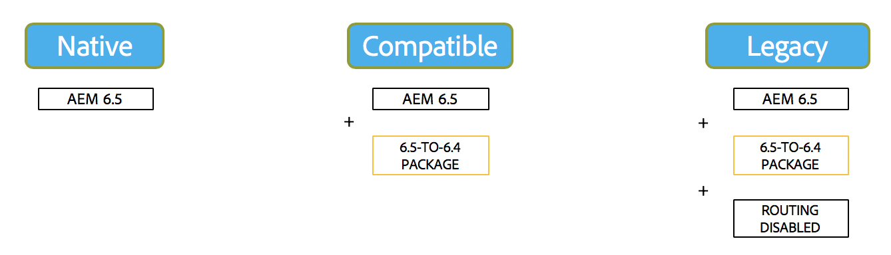

# Compatibilità con le versioni precedenti in AEM 6.5{#backward-compatibility-in-aem}

## Panoramica {#overview}

>[!NOTE]
>
>Per un elenco delle modifiche al contenuto e alla configurazione che non rientrano nell&#39;ambito del pacchetto di compatibilità, vedere [Ristrutturazione dell&#39;archivio in AEM](/help/sites-deploying/repository-restructuring.md).

In Adobe Experience Manager (AEM) 6.5, tutte le funzioni sono state sviluppate tenendo presente la compatibilità con le versioni precedenti.

In genere, i clienti che eseguono AEM 6.3 non devono essere tenuti a modificare il codice o le personalizzazioni durante l’aggiornamento. Per i clienti AEM 6.1 e 6.2, non vi sono ulteriori modifiche che causerebbero interruzioni rispetto a quelle che si avrebbero durante un aggiornamento a 6.3.

Per le eccezioni in cui le funzionalità non potevano essere mantenute compatibili con le versioni precedenti, è possibile ridurre i problemi di incompatibilità con le versioni precedenti per bundle e contenuto. A tale scopo, installa un pacchetto di compatibilità per la versione 6.4 (consulta la sezione su come configurare di seguito per informazioni dettagliate su dove scaricare). Questo pacchetto di compatibilità aiuta a ripristinare la compatibilità tp in genere per le applicazioni conformi a AEM 6.4.

Il pacchetto di compatibilità consente di eseguire AEM in modalità di compatibilità e di posticipare lo sviluppo personalizzato rispetto alle nuove funzioni AEM:

>[!NOTE]
>
>Il pacchetto di compatibilità è solo una soluzione temporanea per posticipare lo sviluppo necessario per la compatibilità con AEM 6.5. L’Adobe consiglia di utilizzarla come ultima opzione se non è possibile risolvere i problemi di compatibilità tramite lo sviluppo immediatamente dopo l’aggiornamento. Inoltre, l’Adobe consiglia di passare alla modalità nativa e disinstallare il pacchetto di compatibilità una volta che si decide di procedere con lo sviluppo personalizzato basato su 6.5 e di avvalersi della funzionalità 6.5 completa.

Il pacchetto di compatibilità dispone di due modalità: **Routing abilitato** e **Routing disabilitato**.

Questo consente a AEM 6.5 di funzionare in tre modalità:

**Modalità nativa:**

La modalità nativa è per i clienti che desiderano utilizzare tutte le nuove funzioni di AEM 6.5 e sono pronti a fare qualche sviluppo per far funzionare le loro personalizzazioni con tutte le nuove funzioni.

Ciò significa che è necessario regolare l’applicazione immediatamente dopo l’aggiornamento.

**Modalità di compatibilità: pacchetto di compatibilità installato con routing abilitato**

La modalità di compatibilità è rivolta ai clienti che dispongono di personalizzazioni di interfacce non compatibili con le versioni precedenti. Questo consente di eseguire AEM in modalità di compatibilità e di posticipare lo sviluppo personalizzato richiesto per le nuove funzionalità AEM non compatibili con alcuni codici personalizzati.

**Modalità legacy: pacchetto di compatibilità installato con routing disabilitato**

La modalità legacy è destinata ai clienti che dispongono di interfacce personalizzate basate su codice legacy o obsoleto proveniente da AEM che è stato spostato all’esterno del pacchetto di compatibilità.

## Configurazione {#how-to-set-up}

Il pacchetto di compatibilità per la versione 6.5 **di** AEM 6.4 può essere installato come pacchetto utilizzando Gestione pacchetti. È possibile scaricare [AEM 6.4 Compatibility Pack per 6.5 dal sito Software Distribution](https://experience.adobe.com/#/downloads/content/software-distribution/en/aem.html?fulltext=compat*&amp;orderby=%40jcr%3Acontent%2Fjcr%3AlastModified&amp;orderby.sort=desc&amp;layout=list&amp;p.offset=0&amp;p.limit=20&amp;package=%2Fcontent%2Fsoftware-distribution%2Fen%2Fdetails.html%2Fcontent%2Fdam%2Faem%2Fpublic%2Fadobe%2Fpackages%2Fcq650%2Fcompatpack%2Faem-compat-cq65-to-cq64).

Una volta installato il pacchetto di compatibilità, il routing può essere abilitato o disabilitato utilizzando uno switch nella configurazione OSGI, come illustrato di seguito:

Dopo aver installato e configurato il pacchetto di compatibilità, le funzioni vengono utilizzate in base alla modalità di compatibilità scelta.
