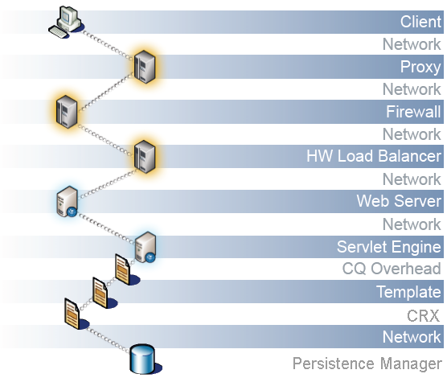

# Ottimizzazione delle prestazioni {#performance-optimization}

>[!NOTE]
>
>Per le linee guida generali sulle prestazioni, leggere la pagina [Linee guida sulle prestazioni](/help/sites-deploying/performance-guidelines.md) .
>
>Per ulteriori informazioni sulla risoluzione dei problemi di prestazioni e sulla risoluzione dei problemi, consulta anche la [Struttura delle prestazioni](/help/sites-deploying/performance-tree.md).
>
>È inoltre possibile esaminare un articolo della Knowledge Base su [Suggerimenti per l&#39;ottimizzazione delle prestazioni.](https://helpx.adobe.com/experience-manager/kb/performance-tuning-tips.html)

Un problema chiave è il tempo impiegato dal sito web per rispondere alle richieste dei visitatori. Anche se questo valore varia per ogni richiesta, è possibile definire un valore target medio. Una volta dimostrato che questo valore è raggiungibile e maneggevole, può essere utilizzato per monitorare le prestazioni del sito web e indicare lo sviluppo di potenziali problemi.

I tempi di risposta desiderati saranno diversi negli ambienti di authoring e pubblicazione, in base alle diverse caratteristiche del pubblico di destinazione:

## Ambiente di authoring {#author-environment}

Questo ambiente viene utilizzato dagli autori che immettono e aggiornano i contenuti. Deve essere adatto a un numero limitato di utenti che generano un numero elevato di richieste ad alte prestazioni durante l’aggiornamento delle pagine di contenuto e dei singoli elementi di tali pagine.

## Ambiente di pubblicazione {#publish-environment}

Questo ambiente contiene i contenuti che puoi rendere disponibili agli utenti. In questo caso il numero di richieste è ancora più elevato e la velocità è altrettanto vitale, ma poiché la natura delle richieste è meno dinamica, si possono applicare ulteriori meccanismi di miglioramento delle prestazioni; come la memorizzazione in cache del contenuto o il bilanciamento del carico.

>[!NOTE]
>
>* Dopo aver configurato per l&#39;ottimizzazione delle prestazioni, segui le procedure in [Tough Day](/help/sites-developing/tough-day.md) per testare l&#39;ambiente a carico pesante.
>* Vedere anche [Suggerimenti per l&#39;ottimizzazione delle prestazioni.](https://helpx.adobe.com/experience-manager/kb/performance-tuning-tips.html)


## Metodologia di ottimizzazione delle prestazioni {#performance-optimization-methodology}

Una metodologia di ottimizzazione delle prestazioni per AEM progetti può essere riassunta in cinque semplici regole che possono essere seguite per evitare problemi di prestazioni fin dall&#39;inizio:

1. [Pianificazione per l&#39;ottimizzazione](#planning-for-optimization)
1. [Simula realtà](#simulate-reality)
1. [Stabilire obiettivi solidi](#establish-solid-goals)
1. [Pertinente](#stay-relevant)
1. [Cicli di iterazione dell&#39;Agile](#agile-iteration-cycles)

Queste regole, in larga misura, si applicano ai progetti web in generale e sono pertinenti ai project manager e agli amministratori di sistema per garantire che i loro progetti non affrontino problemi di prestazioni al momento del lancio.

### Pianificazione per l&#39;ottimizzazione {#planning-for-optimization}


Circa il 10% dello sforzo del progetto dovrebbe essere pianificato per la fase di ottimizzazione delle prestazioni. Naturalmente, i requisiti effettivi di ottimizzazione delle prestazioni dipenderanno dal livello di complessità di un progetto e dall’esperienza del team di sviluppo. Anche se il progetto potrebbe (in ultima analisi) non richiedere tutto il tempo assegnato, è buona prassi pianificare sempre l’ottimizzazione delle prestazioni nell’area suggerita.

Laddove possibile, un progetto dovrebbe essere inizialmente soft-lanciato a un pubblico limitato per raccogliere esperienze reali ed eseguire ulteriori ottimizzazioni, senza la pressione aggiuntiva che segue un annuncio completo.

Una volta che sei &quot;live&quot;, l&#39;ottimizzazione delle prestazioni non è finita. Questo è il momento in cui si verifica il carico &quot;reale&quot; sul sistema. È importante pianificare ulteriori adeguamenti dopo il lancio.

Poiché il carico del sistema cambia e i profili di prestazioni del sistema si spostano nel tempo, è necessario pianificare una &quot;messa a punto&quot; delle prestazioni o un &quot;controllo dello stato di salute&quot; a intervalli di 6-12 mesi.

### Simula realtà {#simulate-reality}


Se vai in diretta con un sito web e scopri dopo il lancio che si verificano problemi di prestazioni, esiste un solo motivo per questo: I test di carico e prestazioni non simulavano la realtà abbastanza da vicino.

Simulare la realtà è difficile e quanto sforzo si può ragionevolmente investire per ottenere &quot;reale&quot; dipende dalla natura del vostro progetto. &quot;Reale&quot; significa non solo &quot;codice reale&quot; e &quot;traffico reale&quot;, ma anche &quot;contenuto reale&quot;, soprattutto per quanto riguarda la dimensione e la struttura dei contenuti. Tieni presente che i modelli possono comportarsi in modo completamente diverso a seconda delle dimensioni e della struttura dell’archivio.

### Stabilire obiettivi solidi {#establish-solid-goals}


Non va sottovalutata l&#39;importanza di stabilire in modo adeguato gli obiettivi prestazionali. Spesso, una volta che le persone si concentrano su obiettivi di prestazioni specifici è molto difficile cambiare questi obiettivi in seguito, anche se sono basati su ipotesi selvagge.

Stabilire buoni obiettivi di performance solidi è davvero una delle aree più difficili. Spesso è meglio raccogliere i registri e i benchmark reali da un sito web comparabile (ad esempio il predecessore del nuovo sito web).

### Pertinente {#stay-relevant}


È importante ottimizzare un collo di bottiglia alla volta. Se tenti di eseguire le operazioni in parallelo senza convalidare l’impatto dell’ottimizzazione unica, perderai traccia della misura di ottimizzazione effettivamente supportata.

### Cicli di iterazione dell&#39;Agile {#agile-iteration-cycles}


La regolazione delle prestazioni è un processo iterativo che richiede, misurare, analizzare, ottimizzare e convalidare fino a raggiungere l’obiettivo. Per tenere debitamente conto di questo aspetto, implementare un processo di convalida agile nella fase di ottimizzazione anziché un processo di test più pesante dopo ogni iterazione.

Questo significa in gran parte che lo sviluppatore che implementa l&#39;ottimizzazione deve avere un modo rapido per sapere se l&#39;ottimizzazione ha già raggiunto l&#39;obiettivo. Si tratta di informazioni preziose, perché quando l&#39;obiettivo viene raggiunto, l&#39;ottimizzazione è finita.

## Linee guida sulle prestazioni di base {#basic-performance-guidelines}

In generale, mantieni le richieste html non memorizzate nella cache a meno di 100 ms. Più specificamente, possono fungere da linea guida:

* Il 70% delle richieste di pagine deve rispondere in meno di 100 ms.
* Il 25% delle richieste per le pagine deve ricevere una risposta entro 100ms-300ms.
* Il 4% delle richieste di pagine deve ricevere una risposta entro 300ms-500ms.
* L’1% delle richieste di pagine deve ricevere una risposta entro 500 ms-1000 ms.
* Nessuna pagina deve rispondere più lentamente di 1 secondo.

I numeri di cui sopra presuppongono le seguenti condizioni:

* Misurato al momento della pubblicazione (nessun overhead correlato a un ambiente di authoring)
* Misurato sul server (senza sovraccarico di rete)
* Non memorizzato in cache (nessuna cache di output AEM, nessuna cache del Dispatcher)
* Solo per elementi complessi con molte dipendenze (HTML, JS, PDF, ...)
* Nessun altro carico sul sistema

Ci sono un certo numero di problemi che spesso contribuiscono a problemi di prestazioni. Questi ruotano principalmente intorno a:

* Inefficienza della memorizzazione in cache di Dispatcher
* L’utilizzo di query in normali modelli di visualizzazione.

La messa a punto a livello di JVM e del sistema operativo di solito non porta a grandi passi avanti nelle prestazioni e dovrebbe quindi essere eseguita alla fine del ciclo di ottimizzazione.

Anche il modo in cui è strutturato un archivio di contenuti può influire sulle prestazioni. Per ottenere prestazioni migliori, il numero di nodi figlio collegati a singoli nodi in un archivio di contenuti non deve superare 1.000 (come regola generale).

I tuoi migliori amici durante un normale esercizio di ottimizzazione delle prestazioni sono:

* Le azioni   `request.log`
* Temporizzazione basata su componenti
* Ultimo, ma non meno importante, profilatore java.

### Prestazioni durante il caricamento e la modifica di risorse digitali {#performance-when-loading-and-editing-digital-assets}

A causa del grande volume di dati coinvolti nel caricamento e nella modifica delle risorse digitali, le prestazioni possono diventare un problema.

Due fattori influiscono sulle prestazioni in questo caso:

* CPU: più core consentono un lavoro più fluido durante la transcodifica
* Disco rigido: dischi RAID paralleli raggiungono lo stesso livello

Per migliorare le prestazioni, considera quanto segue:

* Quante risorse verranno caricate al giorno? Una buona stima può basarsi su:


* Intervallo di tempo in cui verranno apportate le modifiche (in genere la durata della giornata lavorativa, più per le operazioni internazionali).
* La dimensione media in megabyte delle immagini caricate (e la dimensione delle rappresentazioni generate per immagine).
* Determinare la velocità media dei dati:


* L’80% di tutte le modifiche verrà effettuato nel 20% del tempo, quindi in fase di picco si avrà una velocità di dati 4 volte superiore alla media. Questo è l&#39;obiettivo delle tue prestazioni.

## Monitoraggio delle prestazioni {#performance-monitoring}

Le prestazioni (o l&#39;assenza) sono una delle prime cose che gli utenti notano, quindi, come con qualsiasi applicazione con un&#39;interfaccia utente, le prestazioni sono di importanza fondamentale. Per ottimizzare le prestazioni dell’installazione AEM è necessario monitorare vari attributi dell’istanza e il suo comportamento.

Per informazioni su come eseguire il monitoraggio delle prestazioni, vedere [Monitoraggio delle prestazioni](/help/sites-deploying/monitoring-and-maintaining.md#monitoring-performance).

I problemi che causano problemi di prestazioni sono spesso difficili da rintracciare, anche quando i loro effetti sono facili da vedere.

Un punto di partenza di base è una buona conoscenza del sistema quando funziona normalmente. A meno che tu non sappia come l’ambiente &quot;si presenta&quot; e &quot;si comporta&quot; quando funziona correttamente, può essere difficile individuare il problema in caso di deterioramento delle prestazioni. Ciò significa che devi dedicare un po&#39; di tempo a indagare sul sistema quando è in esecuzione senza problemi e assicurarti che la raccolta delle informazioni sulle prestazioni sia un&#39;attività continua. Questo ti fornirà una base per il confronto se le prestazioni soffrono.

Il diagramma seguente illustra il percorso che può seguire una richiesta di contenuto AEM e quindi il numero di elementi diversi che possono influire sulle prestazioni.



Le prestazioni sono anche un equilibrio tra volume e capacità:

* **Volume**  - La quantità di output elaborata e consegnata dal sistema.
* **Capacità** : la capacità del sistema di fornire il volume.

Questo può essere illustrato in varie posizioni in tutta la catena web.


Ci sono diverse aree funzionali che sono spesso responsabili dell&#39;impatto sulle prestazioni:

* Memorizzazione in cache
* Codice applicazione (progetto)
* Funzionalità di ricerca

### Regole di base sulle prestazioni {#basic-rules-regarding-performance}

Quando si ottimizzano le prestazioni, è necessario tenere presenti alcune regole:

* La regolazione delle prestazioni *deve* far parte di ogni progetto.
* Non ottimizzare all&#39;inizio del ciclo di sviluppo.
* Le prestazioni sono buone solo quanto il link più debole.
* Considera sempre la capacità rispetto al volume.
* Prima di tutto, ottimizza le cose importanti.
* Non ottimizzare mai senza obiettivi *realistici*.

>[!NOTE]
>
>Tieni presente che il meccanismo utilizzato per misurare le prestazioni spesso influisce esattamente su ciò che stai cercando di misurare. Devi sempre cercare di rendere conto di queste discrepanze ed eliminarne il più possibile gli effetti; in particolare, i plug-in del browser dovrebbero essere disattivati ogniqualvolta possibile.

## Configurazione per le prestazioni {#configuring-for-performance}

Alcuni aspetti di AEM (e/o dell’archivio sottostante) possono essere configurati per ottimizzare le prestazioni. Di seguito sono riportate le possibilità e i suggerimenti necessari per verificare se e come utilizzare la funzionalità in questione prima di apportare modifiche.

>[!NOTE]
>
>Per ulteriori informazioni, consulta l’ [articolo KB](https://helpx.adobe.com/experience-manager/kb/performance-tuning-tips.html).

### Indicizzazione ricerca {#search-indexing}

A partire da AEM 6.0, Adobe Experience Manager utilizza un’architettura dell’archivio basata su Oak.

Puoi trovare le informazioni di indicizzazione aggiornate qui:

* [Tecniche consigliate per query e indicizzazione](/help/sites-deploying/best-practices-for-queries-and-indexing.md)
* [Query e indicizzazione](/help/sites-deploying/queries-and-indexing.md)

### Elaborazione simultanea del flusso di lavoro {#concurrent-workflow-processing}

Per migliorare le prestazioni, limita il numero di processi di flusso di lavoro in esecuzione simultanea. Per impostazione predefinita, il motore del flusso di lavoro elabora in parallelo tutti i flussi di lavoro disponibili per la macchina virtuale Java. Quando i passaggi del flusso di lavoro richiedono grandi quantità di risorse di elaborazione (RAM o CPU), l’esecuzione in parallelo di diversi di questi flussi di lavoro può comportare un aumento delle richieste per le risorse del server disponibili.

Ad esempio, quando le immagini (o le risorse DAM in generale) vengono caricate, i flussi di lavoro importano automaticamente le immagini in DAM. Le immagini sono spesso ad alta risoluzione e possono facilmente richiedere centinaia di MB di heap per l&#39;elaborazione. La gestione parallela di queste immagini colloca un carico elevato sul sottosistema di memoria e sul Garbage Collector.

Il motore del flusso di lavoro utilizza le code di lavoro Apache Sling per la gestione e la pianificazione dell’elaborazione degli elementi di lavoro. I seguenti servizi della coda di lavoro sono stati creati per impostazione predefinita dalla fabbrica del servizio di configurazione della coda di lavoro Apache Sling per l&#39;elaborazione dei processi del flusso di lavoro:

* Coda flusso di lavoro Granite: La maggior parte dei passaggi del flusso di lavoro, ad esempio quelli che elaborano le risorse DAM, utilizza il servizio Coda flussi di lavoro Granite.
* Coda processi esterni flusso di lavoro Granite: Questo servizio viene utilizzato per i passaggi di flussi di lavoro esterni speciali tipicamente utilizzati per contattare un sistema esterno e per eseguire il polling dei risultati. Ad esempio, il passaggio Processo di estrazione di file multimediali InDesign viene implementato come processo esterno. Il motore del flusso di lavoro utilizza la coda esterna per elaborare il polling. (Vedere [com.day.cq.workflow.exec.WorkflowExternalProcess](https://helpx.adobe.com/experience-manager/6-5/sites/developing/using/reference-materials/javadoc/com/day/cq/workflow/exec/WorkflowExternalProcess.html).)

Configura questi servizi per limitare il numero massimo di processi di flusso di lavoro in esecuzione simultanea.

>[!NOTE]
>
>La configurazione di queste code di lavoro influisce su tutti i flussi di lavoro a meno che non sia stata creata una coda di lavoro per un modello di flusso di lavoro specifico (consulta [Configurare la coda per un modello di flusso di lavoro specifico](/help/sites-deploying/configuring-performance.md#configure-the-queue-for-a-specific-workflow) di seguito).

#### Configurazione nell’archivio {#configuration-in-the-repo}

Se stai configurando i servizi [utilizzando un nodo sling:OsgiConfig](/help/sites-deploying/configuring-osgi.md#adding-a-new-configuration-to-the-repository), devi trovare il PID dei servizi esistenti, ad esempio: org.apache.sling.event.jobs.QueueConfiguration.370aad73-d01b-4a0b-abe4-20198d85f705. Puoi scoprire il PID utilizzando la console Web.

Devi configurare la proprietà denominata `queue.maxparallel`.

#### Configurazione nella console Web {#configuration-in-the-web-console}

Per configurare questi servizi [utilizzando la console Web](/help/sites-deploying/configuring-osgi.md#osgi-configuration-with-the-web-console), individua gli elementi di configurazione esistenti sotto la factory del servizio di configurazione della coda di lavoro Apache Sling.

È necessario configurare la proprietà Maximum Parallel Jobs (Processi paralleli massimi).

### Configurare la coda per un flusso di lavoro specifico {#configure-the-queue-for-a-specific-workflow}

Crea una coda di lavoro per un modello di flusso di lavoro specifico in modo da poter configurare la gestione dei processi per quel modello di flusso di lavoro. In questo modo, le configurazioni influiscono sull&#39;elaborazione per un flusso di lavoro specifico, mentre la configurazione della coda predefinita del flusso di lavoro Granite controlla l&#39;elaborazione di altri flussi di lavoro.

Quando i modelli di flusso di lavoro vengono eseguiti, creano lavori Sling per un argomento specifico. Per impostazione predefinita, l&#39;argomento corrisponde agli argomenti configurati per la coda generale del flusso di lavoro Granite o per la coda del processo esterno del flusso di lavoro Granite:

* `com/adobe/granite/workflow/job*`
* `com/adobe/granite/workflow/external/job*`

Gli argomenti di lavoro effettivi generati dai modelli di flusso di lavoro includono il suffisso specifico per il modello. Ad esempio, il modello di flusso di lavoro **Aggiorna risorsa DAM** genera lavori con il seguente argomento:

`com/adobe/granite/workflow/job/etc/workflow/models/dam/update_asset/jcr_content/model`

Pertanto, puoi creare una coda di lavoro per l’argomento che corrisponde agli argomenti di lavoro del modello di flusso di lavoro. La configurazione delle proprietà relative alle prestazioni della coda influisce solo sul modello di flusso di lavoro che genera i lavori che corrispondono all’argomento della coda.

La procedura seguente crea una coda di lavoro per un flusso di lavoro, utilizzando come esempio il flusso di lavoro **Aggiorna risorsa DAM** .

1. Esegui il modello di flusso di lavoro per il quale desideri creare la coda dei processi, in modo che vengano generate le statistiche degli argomenti. Ad esempio, aggiungi un’immagine alle risorse per eseguire il flusso di lavoro **Aggiorna risorsa DAM** .
1. Apri la console Sling Jobs (`https://<host>:<port>/system/console/slingevent`).
1. Scopri gli argomenti relativi al flusso di lavoro nella console. Per DAM Update Asset, sono disponibili i seguenti argomenti:

   * `com/adobe/granite/workflow/external/job/etc/workflow/models/dam/update_asset/jcr_content/model`
   * `com/adobe/granite/workflow/job/etc/workflow/models/dam/update_asset/jcr_content/model`
   * `com/adobe/granite/workflow/job/etc/workflow/models/dam-xmp-writeback/jcr_content/model`

1. Crea una coda di lavoro per ciascuno di questi argomenti. Per creare una coda di lavoro, crea una configurazione di fabbrica per il servizio factory Apache Sling Job Queue.

   Le configurazioni di fabbrica sono simili alla coda del flusso di lavoro Granite descritta in [Elaborazione simultanea del flusso di lavoro](/help/sites-deploying/configuring-performance.md#concurrent-workflow-processing), tranne per il fatto che la proprietà Topics corrisponde all&#39;argomento dei lavori del flusso di lavoro.

### Servizio di sincronizzazione delle risorse DAM AEM {#cq-dam-asset-synchronization-service}

`AssetSynchronizationService` viene utilizzato per sincronizzare le risorse dai repository montati (tra cui LiveLink, Documentum, tra gli altri). Per impostazione predefinita, questo esegue un controllo regolare ogni 300 secondi (5 minuti), quindi se non si utilizzano archivi montati, è possibile disabilitare questo servizio.

A questo scopo, [configura il servizio OSGi](/help/sites-deploying/configuring-osgi.md) **CQ DAM Asset Synchronization Service** per impostare il **periodo di sincronizzazione** ( `scheduler.period`) su (un minimo di) 1 anno (definito in secondi).

### Più istanze DAM {#multiple-dam-instances}

La distribuzione di più istanze DAM può aiutare le prestazioni quando, ad esempio:

* Il carico è elevato a causa del caricamento regolare di un gran numero di risorse per l’ambiente di authoring; in questo caso è possibile dedicare un’istanza DAM separata all’authoring di servizi.
* Hai più team in sedi mondiali (ad esempio USA, Europa, Asia).

Considerazioni aggiuntive:

* Separazione del &quot;lavoro in corso&quot; sull&#39;autore da &quot;finale&quot; sulla pubblicazione
* Separazione degli utenti interni sull&#39;autore da visitatori/utenti esterni al momento della pubblicazione (ad esempio agenti, rappresentanti della stampa, clienti, studenti, ecc.).

## Best practice per la garanzia della qualità {#best-practices-for-quality-assurance}

Le prestazioni sono di importanza fondamentale per l’ambiente di pubblicazione. Pertanto, durante l’implementazione del progetto devi pianificare e analizzare attentamente i test delle prestazioni che effettuerai per l’ambiente di pubblicazione.

Questa sezione offre una panoramica standardizzata dei problemi relativi alla definizione di un concetto di test specifico per i test delle prestazioni nell&#39;ambiente *publish*. Questo è di particolare interesse per ingegneri QA, project manager e amministratori di sistema.

Di seguito viene illustrato un approccio standardizzato ai test delle prestazioni per un&#39;applicazione AEM nell&#39;ambiente *Publish*. Ciò comporta le seguenti 5 fasi:

* [Verifica della conoscenza](#verification-of-knowledge)
* [Definizione dell&#39;ambito di applicazione](#scope-definition)
* [Metodologie di test](#test-methodologies)
* [Definizione degli obiettivi di prestazione](#defining-the-performance-goals)
* [Ottimizzazione](#optimization)

Il controllo è un ulteriore processo onnicomprensivo - necessario ma non limitato ai test.

### Verifica della conoscenza {#verification-of-knowledge}

Un primo passaggio consiste nel documentare le informazioni di base che è necessario conoscere prima di poter iniziare il test:

* Architettura dell’ambiente di test
* Una mappa dell&#39;applicazione che descrive gli elementi interni che dovranno essere testati (sia in isolamento che in combinazione)

#### Architettura dei test {#test-architecture}

È necessario documentare chiaramente l’architettura dell’ambiente di test utilizzato per il test delle prestazioni.

Sarà necessaria una riproduzione dell’ambiente di produzione Publish pianificato, insieme a Dispatcher e Load Balancer.

#### Mappa applicazione {#application-map}

Per ottenere una panoramica chiara, puoi creare una mappa dell’intera applicazione (potrebbe essere presente dai test sull’ambiente di authoring).

una rappresentazione diagramma degli elementi interni dell&#39;applicazione può fornire una panoramica dei requisiti di prova; con la codifica a colori può anche fungere da base per la generazione di rapporti.

### Definizione ambito {#scope-definition}

In genere, un&#39;applicazione dispone di una selezione di casi d&#39;uso. Alcuni saranno molto importanti, altri meno così.

Per concentrare l’ambito del test delle prestazioni su publish, ti consigliamo di definire:

* Casi d&#39;uso più importanti per le aziende
* Casi d’uso tecnici più critici

Il numero di casi d’uso dipende dall’utente, ma deve essere limitato a un numero facilmente gestibile (ad esempio tra 5 e 10).

Una volta selezionati i casi d’uso chiave, è possibile definire per ogni caso gli indicatori prestazioni chiave (KPI, Key Performance Indicator) e gli strumenti utilizzati per misurarli. Esempi di KPI comuni includono:

* Tempo di risposta finale
* Tempo di risposta del servlet
* Tempo di risposta per un singolo componente
* Tempo di risposta per i servizi
* Numero di thread inattivi nel pool di thread
* Numero di connessioni gratuite
* Risorse di sistema come CPU e accesso I/O

### Metodologie di test {#test-methodologies}

Questo concetto presenta 4 scenari utilizzati per definire e testare gli obiettivi prestazionali:

* Test a componente singolo
* Prove a componenti combinati
* *Andare* Livescenario
* Scenari di errore

Basato sui seguenti principi.

#### Punti di interruzione dei componenti {#component-breakpoints}

* Ogni componente ha un punto di interruzione specifico relativo alle prestazioni. Ciò significa che un componente può mostrare buone prestazioni fino a quando non viene raggiunto un punto specifico, dopodiché le prestazioni si degradano rapidamente.
* Per ottenere una panoramica completa dell’applicazione, è innanzitutto necessario verificare i componenti per determinare quando viene raggiunto il punto di interruzione di ogni applicazione.
* Per trovare il punto di interruzione è possibile eseguire un test di carico in cui, in un periodo di tempo, si aumenta il numero di utenti per creare un carico crescente. Monitorando questo carico e la risposta dei componenti, si verifica un comportamento di prestazioni specifico quando viene raggiunto il punto di interruzione del componente. Il punto può essere qualificato in base al numero di transazioni simultanee al secondo e al numero di utenti simultanei (se il componente è sensibile a questo KPI).
* Queste informazioni possono quindi fungere da punto di riferimento per i miglioramenti, indicare l&#39;efficienza delle misure utilizzate e contribuire a definire gli scenari di test.

#### Transazioni {#transactions}

* Il termine transazione è utilizzato per rappresentare la richiesta di una pagina web completa, inclusa la pagina stessa e tutte le chiamate successive; ovvero la richiesta di pagina, le chiamate AJAX, le immagini e altri oggetti.**Richiesta drill-down**
* Per analizzare completamente ogni richiesta è possibile rappresentare ogni elemento dello stack di chiamate, quindi calcolare il tempo medio di elaborazione per ogni elemento.

### Definizione degli obiettivi di prestazioni {#defining-the-performance-goals}

Una volta definito l’ambito e i relativi KPI, è possibile impostare gli obiettivi prestazionali specifici. Ciò comporta l&#39;elaborazione di scenari di test insieme ai valori di target.

Sarà necessario testare le prestazioni sia in condizioni medie che di picco. Inoltre, sarà necessario Andare Live scenario test per garantire che si può soddisfare per aumentare l&#39;interesse nel tuo sito web quando è reso disponibile per la prima volta.

Qualsiasi esperienza, o statistiche raccolte da un sito web esistente può essere utile anche per determinare gli obiettivi futuri; ad esempio il traffico principale dal sito web live.

#### Test a componente singolo {#single-component-tests}

I componenti critici dovranno essere testati, sia in condizioni medie che di picco.

In entrambi i casi, è possibile definire il numero previsto di transazioni al secondo quando un numero predefinito di utenti utilizza il sistema.

| Component | Tipo di test | No. degli utenti | Tx/sec (previsto) | Tx/sec (testato) | Descrizione |
|---|---|---|---|---|---|
| Homepage Utente singolo | Media | 1 | 1 |  |  |
|  | Picco | 1 | 3 |  |  |
| Homepage 100 utenti | Media | 100 | 1 |  |  |
|  | Picco | 100 | 1 |  |

#### Test combinati dei componenti {#combined-component-tests}

Il test dei componenti in combinazione consente di riflettere meglio il comportamento delle applicazioni. Anche in questo caso le condizioni medie e di picco devono essere testate.

| Scenario | Componente | No. degli utenti | Tx/sec (previsto) | Tx/sec (testato) | Descrizione |
|---|---|---|---|---|---|
| Media mista | Home page | 10 | 1 |  |  |
|  | Ricerca | 10 | 1 |  |  |
|  | Notizie | 10 | 2 |  |  |
|  | Eventi | 10 | 1 |  |  |
|  | Activations | 10 | 1 |  | Simulazione del comportamento dell’autore. |
| Picco misto | Home page | 100 | 5 |  |  |
|  | Ricerca | 50 | 5 |  |  |
|  | Notizie | 100 | 10 |  |  |
|  | Eventi | 100 | 10 |  |  |
|  | Activations | 20 | 20 |  | Simulazione del comportamento dell’autore. |

#### Esecuzione di test live {#going-live-tests}

Nei primi giorni dalla disponibilità del sito web, è possibile aspettarsi un aumento del livello di interesse. Questo sarà probabilmente anche maggiore dei valori di picco per i quali hai effettuato il test. Si consiglia vivamente di testare gli scenari Go Live per garantire che il sistema possa soddisfare questa situazione.

| Scenario | Tipo di test | No. degli utenti | Tx/sec (previsto) | Tx/sec (testato) | Descrizione |
|---|---|---|---|---|---|
| Vai al picco live | Home page | 200 | 20 |  |  |
|  | Ricerca | 100 | 10 |  |  |
|  | Notizie | 200 | 20 |  |  |
|  | Eventi | 200 | 20 |  |  |
|  | Activations | 20 | 20 |  | Simulazione del comportamento dell’autore. |

#### Test dello scenario di errore {#error-scenario-tests}

È inoltre necessario testare gli scenari di errore per garantire che il sistema reagisca correttamente e in modo appropriato. Non solo nella gestione dell’errore stesso, ma anche nell’impatto che potrebbe avere sulle prestazioni. Esempio:

* Cosa succede quando l’utente tenta di inserire un termine di ricerca non valido nella casella di ricerca
* Cosa succede quando il termine di ricerca è così generale che restituisce un numero eccessivo di risultati

Quando si elaborano questi test, è opportuno ricordare che non tutti gli scenari si verificano regolarmente. Tuttavia, il loro impatto sull&#39;intero sistema è importante.

| Scenario di errore | Tipo errore | No. degli utenti | Tx/sec (previsto) | Tx/sec (testato) | Descrizione |
|---|---|---|---|---|---|
| Sovraccarico del componente di ricerca | Ricerca nei caratteri jolly globali (asterisco) | 10 | 1 |  | Solo &amp;ast;&amp;ast;&amp;ast; vengono cercate. |
|  | Interrompi parola | 20 | 2 |  | Ricerca di una parola di arresto. |
|  | Stringa vuota | 10 | 1 |  | Ricerca di una stringa vuota. |
|  | Caratteri speciali | 10 | 1 |  | Ricerca di caratteri speciali. |

#### Test di resistenza {#endurance-tests}

Determinati problemi saranno riscontrati solo dopo che il sistema è stato in funzione per un periodo di tempo continuo; siano ore o anche giorni. Si utilizza una prova di resistenza per testare un carico medio costante in un periodo di tempo richiesto. È quindi possibile analizzare qualsiasi degradazione delle prestazioni.

| Scenario | Tipo di test | No. degli utenti | Tx/sec (previsto) | Tx/sec (testato) | Descrizione |
|---|---|---|---|---|---|
| Prova di resistenza (72 ore) | Home page | 10 | 1 |  |  |
|  | Ricerca | 10 | 1 |  |  |
|  | Notizie | 20 | 2 |  |  |
|  | Eventi | 10 | 1 |  |  |
|  | Activations | 1 | 1 |  | Simulazione del comportamento dell’autore. |

### Ottimizzazione {#optimization}

Nelle fasi successive dell’implementazione sarà necessario ottimizzare l’applicazione per raggiungere/massimizzare gli obiettivi prestazionali.

Eventuali ottimizzazioni effettuate devono essere testate per garantire che:

* Funzionalità non interessate
* è stato verificato con le prove di carico prima del rilascio

È disponibile una selezione di strumenti per aiutarti con la generazione del carico, il monitoraggio delle prestazioni e/o l’analisi dei risultati:

* [JMeter](https://jakarta.apache.org/jmeter/)
* [Load Runner](https://www.microfocus.com/en-us/products/loadrunner-load-testing/overview)
* [](https://www.determyne.com/) DeterminareInsideApps
* [InfraRED](https://www.infraredsoftware.com/)
* [Profilo interattivo Java](https://jiprof.sourceforge.net/)
* molti altri...

Dopo l’ottimizzazione, dovrai eseguire di nuovo il test per confermare l’impatto.

### Generazione rapporti {#reporting}

Sarà necessario un reporting continuo per informare tutti sullo stato, come precedentemente indicato con la codifica dei colori, la mappa dell&#39;architettura può essere utilizzata per questo scopo.

Dopo aver completato tutti i test, dovrai creare un rapporto su:

* Errori critici rilevati
* Questioni non critiche che richiederanno ulteriori indagini
* Qualsiasi ipotesi fatta durante la prova
* Eventuali raccomandazioni derivanti dal test

## Ottimizzazione delle prestazioni quando si utilizza il Dispatcher {#optimizing-performance-when-using-the-dispatcher}

Il [Dispatcher](https://helpx.adobe.com/experience-manager/dispatcher/using/dispatcher.html) è lo strumento di memorizzazione in cache e/o di bilanciamento del carico di Adobe. Quando utilizzi il Dispatcher, prendi in considerazione l’ottimizzazione del sito web per le prestazioni della cache.

>[!NOTE]
>
>Le versioni di Dispatcher sono indipendenti da AEM, tuttavia la documentazione di Dispatcher è incorporata nella documentazione di AEM. Utilizza sempre la documentazione di Dispatcher incorporata nella documentazione della più recente versione di AEM.
>
>Potresti essere stato reindirizzato a questa pagina se hai seguito un collegamento alla documentazione di Dispatcher incorporato nella documentazione di una versione precedente di AEM.

Dispatcher offre una serie di meccanismi incorporati che è possibile utilizzare per ottimizzare le prestazioni se il sito web ne trae vantaggio. Questa sezione spiega come progettare il sito web per massimizzare i vantaggi del caching.

>[!NOTE]
>
>Può essere utile ricordare che Dispatcher memorizza la cache su un server web standard. Ciò significa che:
>
>* Può memorizzare in cache tutto ciò che può essere archiviato come pagina e richiedere utilizzando un URL
>* Non è possibile memorizzare altri elementi, ad esempio cookie, dati di sessione e dati del modulo.

>
>In generale, molte strategie di caching richiedono la selezione di URL validi e non utilizzano questi dati aggiuntivi.
>
>Con il Dispatcher versione 4.1.11 è anche possibile memorizzare in cache le intestazioni di risposta, consulta [Memorizzazione in cache delle intestazioni di risposta HTTP](https://helpx.adobe.com/experience-manager/dispatcher/using/dispatcher-configuration.html#configuring-the-dispatcher-cache-cache).

### Calcolo del rapporto della cache del Dispatcher {#calculating-the-dispatcher-cache-ratio}

La formula del rapporto cache stima la percentuale di richieste gestite dalla cache rispetto al numero totale di richieste che arrivano nel sistema. Per calcolare il rapporto della cache è necessario quanto segue:

* Numero totale di richieste. Queste informazioni sono disponibili in Apache `access.log`. Per ulteriori dettagli, consulta la [documentazione ufficiale di Apache](https://httpd.apache.org/docs/2.4/logs.html#accesslog).

* Il numero di richieste servite dall&#39;istanza Publish. Queste informazioni sono disponibili in `request.log` dell’istanza. Per ulteriori dettagli, consulta [Interpretazione del request.log](/help/sites-deploying/monitoring-and-maintaining.md#interpreting-the-request-log) e [Ricerca dei file di registro](/help/sites-deploying/monitoring-and-maintaining.md#finding-the-log-files).

La formula per calcolare il rapporto cache è:

* (Il numero totale di richieste **meno** il numero di richieste su Publish) **diviso** per il numero totale di richieste.

Ad esempio, se il numero totale di richieste è 129491 e il numero di richieste servite dall’istanza Publish è 58959 il rapporto cache è: **(129491 - 58959)/129491= 54,5%**.

Se non disponi di un’associazione tra un editore e un dispatcher, dovrai aggiungere insieme le richieste di tutti i dispatcher e gli editori per ottenere una misurazione accurata. Vedere anche [Implementazioni consigliate](/help/sites-deploying/recommended-deploys.md).

>[!NOTE]
>
>Per ottenere prestazioni ottimali, Adobe consiglia un rapporto cache tra il 90% e il 95%.

#### Utilizzo di una codifica coerente delle pagine {#using-consistent-page-encoding}

Con Dispatcher versione 4.1.11 è possibile memorizzare in cache le intestazioni di risposta. Se non si memorizzano nella cache le intestazioni di risposta in Dispatcher, possono verificarsi problemi se si memorizzano le informazioni di codifica della pagina nell’intestazione. In questa situazione, quando Dispatcher richiama una pagina dalla cache, per essa viene utilizzata la codifica predefinita del server web. Esistono due modi per evitare questo problema:

* Se utilizzi una sola codifica, accertati che la codifica utilizzata sul server web sia la stessa della codifica predefinita del sito web AEM.
* Utilizza un tag `<META>` nella sezione HTML `head` per impostare la codifica, come nell’esempio seguente:

```xml
        <META http-equiv="Content-Type" content="text/html; charset=EUC-JP">
```

#### Evita i parametri URL {#avoid-url-parameters}

Se possibile, evita i parametri URL per le pagine che vuoi memorizzare in cache. Ad esempio, se hai una galleria di immagini, il seguente URL non viene mai memorizzato in cache (a meno che Dispatcher non sia [configurato per farlo](https://helpx.adobe.com/experience-manager/dispatcher/using/dispatcher-configuration.html#configuring-the-dispatcher-cache-cache)):

```xml
www.myCompany.com/pictures/gallery.html?event=christmas&amp;page=1
```

Tuttavia, puoi inserire questi parametri nell’URL della pagina nel modo che segue:

```xml
www.myCompany.com/pictures/gallery.christmas.1.html
```

>[!NOTE]
>
>Questo URL richiama la stessa pagina e lo stesso modello del file `gallery.html`. Nella definizione del modello, è possibile specificare quale script esegue il rendering della pagina oppure utilizzare lo stesso script per tutte le pagine.

#### Personalizza in base all&#39;URL {#customize-by-url}

Se consenti agli utenti di modificare la dimensione del font (o di effettuare qualunque altra personalizzazione del layout), accertati che le diverse personalizzazioni siano poi riportate nell’URL.

Ad esempio, i cookie non vengono memorizzati in cache, quindi se memorizzi la dimensione del font in un cookie (o in un meccanismo simile), essa non viene mantenuta per la pagina memorizzata in cache. Di conseguenza, Dispatcher restituisce documenti con qualunque dimensione del font, a caso.

L’inclusione della dimensione del font nell’URL come selettore evita questo problema:

```xml
www.myCompany.com/news/main.large.html
```

>[!NOTE]
>
>Per la maggior parte degli aspetti del layout, è inoltre possibile utilizzare fogli di stile e/o script dal lato client. Questi di solito funzionano molto bene con il caching.
>
>Questa funzione è utile anche per la versione stampata, in cui è possibile utilizzare un URL come:
>
>`www.myCompany.com/news/main.print.html`
>
>Utilizzando il globbing dello script della definizione del modello, puoi specificare uno script separato che esegue il rendering delle pagine da stampare.

#### Annullamento della validità dei file di immagine utilizzati come titoli {#invalidating-image-files-used-as-titles}

Se esegui il rendering dei titoli di pagina, o di altro testo, come immagini, si consiglia di memorizzare i file in modo che vengano eliminati al momento di un aggiornamento del contenuto della pagina:

1. Posiziona il file di immagine nella stessa cartella della pagina.
1. Utilizza il seguente formato di denominazione per il file di immagine:

   `<page file name>.<image file name>`

Ad esempio, puoi memorizzare il titolo della pagina `myPage.html` in `file myPage.title.gif`. Questo file viene eliminato automaticamente, se la pagina viene aggiornata, quindi qualsiasi modifica al titolo della pagina viene automaticamente riportata nella cache.

>[!NOTE]
>
>Il file di immagine non esiste necessariamente come elemento fisico nell’istanza AEM. Puoi utilizzare uno script che crea il file di immagine in modo dinamico. Dispatcher memorizza quindi il file sul server web.

#### Annullamento della validità dei file di immagine utilizzati per la navigazione {#invalidating-image-files-used-for-navigation}

Se utilizzi le immagini per le voci di navigazione, il metodo è sostanzialmente lo stesso utilizzato per i titoli, anche se leggermente più complesso. Memorizza tutte le immagini di navigazione con le pagine di destinazione. Se utilizzi due immagini per la modalità normale e attiva, puoi utilizzare i seguenti script:

* Uno script che visualizza la pagina, come normale.
* Uno script che elabora le richieste “.normal” e restituisce l’immagine normale.
* Uno script che elabora le richieste “.active” e restituisce l’immagine attivata.

È importante creare queste immagini con lo stesso handle di denominazione della pagina, per avere la certezza che un aggiornamento del contenuto elimini queste immagini insieme alla pagina.

Per le pagine non modificate, le immagini rimangono comunque nella cache, sebbene le pagine stesse vengano di solito invalidate automaticamente.

#### Personalizzazione {#personalization}

Si consiglia di limitare la personalizzazione a dove necessario. Ecco il perché:

* Se utilizzi una pagina iniziale liberamente personalizzabile, questa pagina deve essere composta ogni volta che un utente la richiede.
* Se invece offri una scelta tra 10 pagine iniziali diverse, puoi memorizzare in cache ciascuna di esse, migliorando così le prestazioni.

>[!TIP]
>Per ulteriori dettagli sulla configurazione della cache del Dispatcher, consulta il [AEM Tutorial sulla cache del Dispatcher](https://experienceleague.adobe.com/docs/experience-manager-learn/dispatcher-tutorial/overview.html) e la relativa sezione su [Memorizzazione in cache del contenuto protetto.](https://experienceleague.adobe.com/docs/experience-manager-learn/dispatcher-tutorial/chapter-1.html#dispatcher-tips-and-tricks)

Se personalizza ogni pagina (ad esempio inserendo il nome dell’utente nella barra del titolo), può avere un impatto sulle prestazioni.

>[!TIP]
>Per la memorizzazione in cache dei contenuti protetti, consulta [Memorizzazione in cache di contenuti protetti](https://experienceleague.adobe.com/docs/experience-manager-dispatcher/using/configuring/permissions-cache.html) nella guida di Dispatcher.

Per quanto riguarda il mixaggio di contenuti pubblici e limitati su una pagina, è consigliabile prendere in considerazione una strategia che sfrutti gli include lato server in Dispatcher, o include lato client tramite Ajax nel browser.

>[!TIP]
>
>Per gestire contenuti pubblici misti e con restrizioni, consulta [Configurare Sling Dynamic Include.](https://experienceleague.adobe.com/docs/experience-manager-learn/foundation/development/set-up-sling-dynamic-include.html)

#### Connessioni permanenti {#sticky-connections}

[Le connessioni permanenti](https://helpx.adobe.com/experience-manager/dispatcher/using/dispatcher.html#the-benefits-of-load-balancing) garantiscono che di un utente siano composti tutti sullo stesso server. Se un utente esce da questa cartella e successivamente vi rientra, la connessione è ancora attiva. Definisci una cartella in modo che contenga tutti i documenti che richiedono connessioni permanenti per il sito web. Cerca di non avere altri documenti in quella cartella. Ciò impatta sul bilancimento del carico, se utilizzi pagine e dati di sessione personalizzati.

#### Tipi MIME {#mime-types}

Esistono due modi in cui un browser può determinare il tipo di file:

1. Con la sua estensione (ad es. `.html`, `.gif`, `.jpg`, ecc.)
1. In base al tipo MIME che il server invia con il file.

Per la maggior parte dei file, il tipo MIME è implicito nell’estensione del file. Ovvero:

1. Con la sua estensione (ad es. `.html`, `.gif`, `.jpg`, ecc.)
1. In base al tipo MIME che il server invia con il file.

Se il nome del file non ha estensione, viene visualizzato come testo normale.

Con Dispatcher versione 4.1.11 è possibile memorizzare in cache le intestazioni di risposta. Se non trovi nella cache le intestazioni di risposta su Dispatcher, tieni presente che il tipo MIME fa parte dell’intestazione HTTP. Di conseguenza, se l&#39;applicazione AEM restituisce file che non hanno una fine riconosciuta del file e si basano invece sul tipo MIME, questi file potrebbero essere visualizzati in modo non corretto.

Per avere la certezza i file siano memorizzati in cache correttamente, attieniti alle seguenti linee guida:

* Verifica che i file abbiano sempre l’estensione corretta.
* Evita gli script di server di file generici che hanno URL del tipo `download.jsp?file=2214`. Riscrittura dello script per utilizzare gli URL contenenti la specifica del file. Per l’esempio precedente questo sarebbe `download.2214.pdf`.

## Prestazioni di backup {#backup-performance}

Questa sezione presenta una serie di parametri utilizzati per valutare le prestazioni dei backup AEM e gli effetti dell&#39;attività di backup sulle prestazioni dell&#39;applicazione. I backup AEM presentano un carico significativo sul sistema durante l&#39;esecuzione, e lo misuriamo, così come gli effetti delle impostazioni di ritardo di backup che tentano di modulare questi effetti. L&#39;obiettivo è quello di fornire alcuni dati di riferimento sulle prestazioni previste dei backup in configurazioni realistiche e sulle quantità di dati di produzione e fornire indicazioni su come stimare i tempi di backup per i sistemi pianificati.

### Ambiente di riferimento {#reference-environment}

#### Sistema fisico {#physical-system}

I risultati riportati in questo documento sono stati ottenuti da benchmark eseguiti in un ambiente di riferimento con la seguente configurazione. Questa configurazione è progettata per essere simile a un ambiente di produzione tipico di un data center:

* H-P ProLiant DL380 G6, 8 CPU x 2.533 GHz
* Unità SCSI collegate seriali da 300 GB a 10.000 rpm
* Controller RAID hardware; 8 unità in un array RAID0+5
* CPU immagine VMware x 2 Intel Xeon E5540 a 2,53 GHz
* RedHat Linux 2.6.18-194.el5; Java 1.6.0_29
* Istanza Autore singola

Il sottosistema disco su questo server è abbastanza veloce, rappresentativo di una configurazione RAID ad alte prestazioni che potrebbe essere utilizzata in un server di produzione. Le prestazioni di backup possono essere sensibili alle prestazioni del disco e i risultati in questo ambiente riflettono le prestazioni su una configurazione RAID molto veloce. L&#39;immagine VMWare è configurata per avere un singolo grande volume di dischi che si trova fisicamente nello storage locale su disco, sull&#39;array RAID.

La configurazione AEM posiziona l&#39;archivio e il datastore sullo stesso volume logico, insieme a tutto il sistema operativo e AEM software. La directory di destinazione per i backup risiede anche in questo file system logico.

#### Volumi dei dati {#data-volumes}

La tabella seguente illustra le dimensioni dei volumi di dati utilizzati nei benchmark di backup. Il contenuto della linea di base iniziale viene prima installato, quindi vengono aggiunte ulteriori quantità note di dati per aumentare le dimensioni del contenuto di cui è stato eseguito il backup. I backup verranno creati a incrementi specifici per rappresentare un grande aumento dei contenuti e di ciò che può essere prodotto in un giorno. La distribuzione dei contenuti (pagine, immagini, tag) sarà approssimativamente basata su una composizione realistica delle risorse di produzione. Le pagine, le immagini e i tag possono essere limitati a un massimo di 800 pagine figlie. Ogni pagina includerà i componenti titolo, Flash, testo/immagine, video, presentazione, modulo, tabella, cloud e carosello. Le immagini verranno caricate da un pool di 400 file unici di dimensioni comprese tra 37 kB e 594 kB.

| Contenuto | Nodi | Pagine | Immagini | Tag |
|---|---|---|---|---|
| Installazione di base | 69.610 | 562 | 256 | 237 |
| Contenuti di piccole dimensioni per backup incrementale |  | +100 | +2 | +2 |
| Contenuti di grandi dimensioni per backup completo |  | +10 000 | +100 | +100 |

Il benchmark di backup viene ripetuto con i set di contenuti aggiuntivi aggiunti a ogni ripetizione.

#### Scenari di benchmark {#benchmark-scenarios}

I benchmark di backup coprono due scenari principali: backup quando il sistema è sottoposto a un carico significativo dell&#39;applicazione e backup quando il sistema è inattivo. Sebbene la raccomandazione generale sia che i backup vengano eseguiti quando il AEM è il più inattivo possibile, ci sono situazioni in cui è necessario che il backup venga eseguito quando il sistema è sotto carico.

* **Stato di inattività** : i backup vengono eseguiti senza alcuna altra attività in AEM.
* **Sotto Load**  - I backup vengono eseguiti mentre il sistema è sotto l&#39;80% di carico dai processi online. Il ritardo del backup è stato diverso per vedere l&#39;impatto sul caricamento.

I tempi di backup e le dimensioni del backup risultante sono ottenuti dai log del server AEM. In genere, si consiglia di pianificare i backup per le ore di inattività, ad esempio nel mezzo della notte, quando AEM è inattivo. Questo scenario è rappresentativo dell’approccio consigliato.

Il caricamento è costituito da creazione/eliminazione di pagine, traversate e query con la maggior parte del carico proveniente da attraversamenti di pagina e query. L’aggiunta e la rimozione di troppe pagine aumenta continuamente la dimensione dell’area di lavoro e impedisce il completamento del backup. La distribuzione del carico che lo script utilizzerà è l’attraversamento di pagine al 75%, il 24% delle query e l’1% delle creazioni di pagine (livello singolo senza sottopagine nidificata). Il picco medio di transazioni al secondo su un sistema inattivo viene raggiunto con 4 thread simultanei, che è ciò che verrà utilizzato durante il test di backup sotto carico.

L&#39;impatto del carico sulle prestazioni di backup può essere stimato dalla differenza tra le prestazioni con e senza questo carico dell&#39;applicazione. L&#39;impatto del backup sul throughput dell&#39;applicazione si riscontra confrontando il throughput dello scenario nelle transazioni all&#39;ora con e senza un backup simultaneo in corso e con i backup che funzionano con diverse impostazioni di &quot;ritardo del backup&quot;.

* **Impostazione ritardata** : per diversi scenari abbiamo anche modificato l&#39;impostazione del ritardo di backup, utilizzando valori di 10 ms (impostazione predefinita), 1 ms e 0 ms, per esplorare come questa impostazione influisce sulle prestazioni dei backup.
* **Tipo di backup** : tutti i backup erano backup esterni dell&#39;archivio effettuati in una directory di backup senza creare un file zip, tranne in un caso per il confronto in cui il comando tar è stato utilizzato direttamente. Poiché i backup incrementali non possono essere creati su un file zip o quando il backup completo precedente è un file zip, il metodo di directory di backup è il più utilizzato in situazioni di produzione.

### Riepilogo dei risultati {#summary-of-results}

#### Tempo e velocità di backup {#backup-time-and-throughput}

Il risultato principale di questi benchmark è quello di mostrare come i tempi di backup variano in funzione del tipo di backup e della quantità complessiva di dati. Il grafico seguente mostra il tempo di backup ottenuto utilizzando la configurazione di backup predefinita, in funzione del numero totale di pagine.


I tempi di backup su un&#39;istanza inattiva sono abbastanza coerenti, con una media di 0,608 MB/s indipendentemente dai backup completi o incrementali (vedi grafico qui sotto). Il tempo di backup è semplicemente una funzione della quantità di dati che viene sottoposta a backup. Il tempo necessario per completare un backup completo aumenta nettamente con il numero totale di pagine. Il tempo necessario per completare un backup incrementale aumenta anche con il numero totale di pagine, ma a una velocità molto inferiore. Il tempo necessario per completare il backup incrementale è molto più breve a causa della quantità relativamente ridotta di dati sottoposti a backup.

La dimensione del backup prodotto è il principale fattore determinante del tempo impiegato per completare un backup. Il grafico seguente mostra il tempo impiegato in funzione della dimensione finale del backup.


Questo grafico illustra che i backup incrementali e completi seguono un modello di dimensioni semplici rispetto al tempo che possiamo misurare come throughput. I tempi di backup su un&#39;istanza inattiva sono abbastanza coerenti, con una media di 0,61 MB/sec indipendentemente dai backup completi o incrementali sull&#39;ambiente di riferimento.

#### Ritardo backup {#backup-delay}

Il parametro di ritardo del backup viene fornito per limitare il livello di interferenza dei backup con i carichi di lavoro di produzione. Il parametro specifica un tempo di attesa in millisecondi, che viene interdiviso nell&#39;operazione di backup su base file per file. L’effetto complessivo dipende in parte dalle dimensioni dei file interessati. La misurazione delle prestazioni di backup in MB/sec offre un modo ragionevole per confrontare gli effetti di ritardo sul backup.

* L&#39;esecuzione simultanea di un backup con il normale caricamento dell&#39;applicazione avrà un impatto negativo sul throughput del carico regolare.
* L’impatto può essere leggero (fino al 5%) o potrebbe essere molto significativo, causando fino al 75% di riduzione del throughput, e questo probabilmente dipende più dall’applicazione.
* Il backup non è un carico pesante sulla CPU e quindi i carichi di lavoro di produzione ad alta intensità di CPU sarebbero meno interessati dal backup rispetto a quelli ad alta intensità di I/O.


Per confrontare il throughput ottenuto utilizzando un backup del filesystem (utilizzando &#39;tar&#39;) per eseguire il backup degli stessi file di archivio. Le prestazioni del tar sono paragonabili, ma leggermente superiori al backup con ritardo impostato a zero. L&#39;impostazione di un ritardo minimo riduce notevolmente il throughput di backup e il ritardo predefinito di 10 ms riduce notevolmente il throughput. In situazioni in cui i backup possono essere pianificati quando l&#39;utilizzo complessivo dell&#39;applicazione è molto basso o l&#39;applicazione può essere completamente inattiva, è probabilmente auspicabile ridurre il ritardo al di sotto del valore predefinito per consentire al backup di procedere più rapidamente.

L&#39;impatto effettivo del throughput dell&#39;applicazione di un backup continuo dipende dai dettagli dell&#39;applicazione e dell&#39;infrastruttura. La scelta del valore di ritardo dovrebbe essere effettuata mediante analisi empirica dell&#39;applicazione, ma dovrebbe essere scelta il più piccolo possibile, in modo che i backup possano essere completati il più rapidamente possibile. Poiché esiste solo una correlazione debole tra la scelta del valore di ritardo e l&#39;impatto sul throughput dell&#39;applicazione, la scelta del ritardo dovrebbe favorire tempi di backup complessivi più brevi, al fine di ridurre al minimo l&#39;impatto complessivo dei backup. Un backup che richiede 8 ore per essere completato, ma influisce sul throughput del -20% è probabile che abbia un impatto complessivo maggiore di quello che richiede 2 ore per essere completato, ma influisce sul throughput del -30%.

### Riferimenti {#references}

* [Amministrazione - Backup e ripristino](/help/sites-administering/backup-and-restore.md)
* [Gestione - Capacità e volume](/help/managing/best-practices-further-reference.md#capacity-and-volume)
