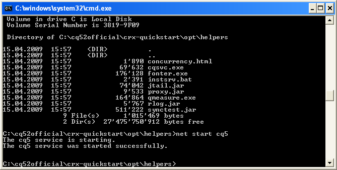

# Installazione autonoma personalizzata{#custom-standalone-install}

Questa sezione descrive le opzioni disponibili durante l’installazione di un’istanza AEM autonoma. Puoi anche leggere [Elementi di archiviazione](/help/sites-deploying/storage-elements-in-aem-6.md) per ulteriori informazioni sulla scelta del tipo di archiviazione back-end dopo l’installazione di AEM 6.

## Modifica del numero di porta rinominando il file {#changing-the-port-number-by-renaming-the-file}

La porta predefinita per AEM è 4502. Se tale porta non è disponibile o è già in uso, Quickstart si configura automaticamente per utilizzare il primo numero di porta disponibile come segue: 4502, 8080, 8081, 8082, 8083, 8084, 8085, 8888, 9362, `<*random*>`.

È inoltre possibile impostare il numero di porta rinominando il file jar quickstart, in modo che il nome del file includa il numero di porta, ad esempio `cq5-publish-p4503.jar` o `cq5-author-p6754.jar`.

Esistono varie regole da seguire quando si rinomina il file jar quickstart:

* Quando si rinomina il file, questo deve iniziare con `cq;` come in `cq5-publish-p4503.jar`.

* Si consiglia di: *sempre* aggiungi al numero di porta il prefisso -p; come in cq5-publish-p4503.jar o cq5-author-p6754.jar.

>[!NOTE]
>
>In questo modo, non dovrai preoccuparti di rispettare le regole utilizzate per l’estrazione del numero di porta:
>
>* il numero di porta deve essere composto da 4 o 5 cifre
>* queste cifre devono seguire un trattino
>* se il nome file contiene altre cifre, il numero di porta deve essere preceduto da `-p`
>* il prefisso &quot;cq5&quot; all’inizio del nome file viene ignorato
>

>[!NOTE]
>
>È inoltre possibile modificare il numero di porta utilizzando `-port` nel comando start.

### Considerazioni su Java 11 {#java-considerations}

Se si esegue Oracle Java 11 (o generalmente versioni di Java più recenti di 8), è necessario aggiungere opzioni aggiuntive alla riga di comando all&#39;avvio dell&#39;AEM.

* I seguenti elementi: `-add-opens` per evitare che i messaggi di avviso relativi all&#39;accesso ai dati di reflection vengano visualizzati in `stdout.log`

```shell
--add-opens=java.desktop/com.sun.imageio.plugins.jpeg=ALL-UNNAMED --add-opens=java.base/sun.net.www.protocol.jrt=ALL-UNNAMED --add-opens=java.naming/javax.naming.spi=ALL-UNNAMED --add-opens=java.xml/com.sun.org.apache.xerces.internal.dom=ALL-UNNAMED --add-opens=java.base/java.lang=ALL-UNNAMED --add-opens=java.base/jdk.internal.loader=ALL-UNNAMED --add-opens=java.base/java.net=ALL-UNNAMED -Dnashorn.args=--no-deprecation-warning
```

* Inoltre, è necessario utilizzare il `-XX:+UseParallelGC` per attenuare eventuali problemi di prestazioni.

Di seguito è riportato un esempio dell’aspetto dei parametri JVM aggiuntivi quando si avvia un AEM su Java 11:

```shell
-XX:+UseParallelGC --add-opens=java.desktop/com.sun.imageio.plugins.jpeg=ALL-UNNAMED --add-opens=java.base/sun.net.www.protocol.jrt=ALL-UNNAMED --add-opens=java.naming/javax.naming.spi=ALL-UNNAMED --add-opens=java.xml/com.sun.org.apache.xerces.internal.dom=ALL-UNNAMED --add-opens=java.base/java.lang=ALL-UNNAMED --add-opens=java.base/jdk.internal.loader=ALL-UNNAMED --add-opens=java.base/java.net=ALL-UNNAMED -Dnashorn.args=--no-deprecation-warning
```

Infine, se esegui un’istanza aggiornata da AEM 6.3, assicurati che la seguente proprietà sia impostata su **true** in `sling.properties`:

* `felix.bootdelegation.implicit`

## Modalità di esecuzione {#run-modes}

**Modalità di esecuzione** consente di regolare l’istanza AEM per uno scopo specifico, ad esempio authoring o pubblicazione, test, sviluppo, Intranet e così via. Queste modalità consentono inoltre di controllare l’utilizzo di contenuti campione. Questo contenuto di esempio viene definito prima della creazione del modulo quickstart e può includere pacchetti, configurazioni e così via. Questo può essere particolarmente utile per le installazioni pronte per la produzione quando si desidera mantenere l&#39;installazione snella e senza contenuti di esempio. Per ulteriori informazioni, consulta:

* [Modalità di esecuzione](/help/sites-deploying/configure-runmodes.md)

## Aggiunta di un provider di installazione file {#adding-a-file-install-provider}

Per impostazione predefinita, la cartella `crx-quickstart/install` viene controllato per i file.
Questa cartella non esiste, ma può essere semplicemente creata in fase di esecuzione.

Se un bundle, una configurazione o un pacchetto di contenuti viene inserito in questa directory, viene automaticamente raccolto e installato. Se viene rimossa, viene disinstallata.
È un altro modo per inserire nell’archivio bundle, pacchetti di contenuti o configurazioni.

Questo è particolarmente interessante per diversi casi d’uso:

* Durante lo sviluppo, potrebbe essere più facile inserire qualcosa nel file system.
* Se si verifica un errore, la console web e l’archivio non sono raggiungibili. Con questo è possibile inserire bundle aggiuntivi in questa directory e dovrebbero essere installati.
* Il `crx-quickstart/install` è possibile creare la cartella prima dell&#39;avvio rapido e inserire pacchetti aggiuntivi.

>[!NOTE]
>
>Vedi anche [Come installare automaticamente i pacchetti CRX all’avvio del server](https://helpx.adobe.com/experience-manager/kb/HowToInstallPackagesUsingRepositoryInstall.html) ad esempio.

## Installazione e avvio di Adobe Experience Manager as a Windows Service {#installing-and-starting-adobe-experience-manager-as-a-windows-service}

>[!NOTE]
>
>Durante l&#39;accesso come amministratore, assicurarsi di eseguire la procedura seguente o di avviare/eseguire la procedura utilizzando **Esegui come amministratore** selezione del menu di scelta rapida.
>
>Accesso come utente con privilegi di amministratore **insufficiente**. Se non si è connessi come Amministratore durante il completamento di questi passaggi si riceve **Accesso negato** errori.

Per installare e avviare AEM come servizio Windows:

1. Apri il file crx-quickstart\opt\helpers\instsrv.bat in un editor di testo.
1. Se si sta configurando un server Windows a 64 bit, sostituire tutte le istanze di prunsrv con uno dei seguenti comandi, in base al sistema operativo in uso:

   * prunsrv_amd64
   * prunsrv_ia64

   Questo comando richiama lo script appropriato che avvia il daemon del servizio Windows in Java a 64 bit anziché in Java a 32 bit.

1. Per evitare che il processo possa eseguire il forking in più processi, aumentare il parametro JVM PermGen. Individua il `set jvm_options` e impostare il valore come segue:

   `set jvm_options=-Xmx1792m`

1. Apri il prompt dei comandi, modifica la directory corrente nella cartella crx-quickstart/opt/helpers dell’installazione AEM e immetti il comando seguente per creare il servizio:

   `instsrv.bat cq5`

   Per verificare che il servizio sia stato creato, aprire Servizi nel pannello di controllo Strumenti di amministrazione o digitare `start services.msc` nel prompt dei comandi. Il servizio cq5 viene visualizzato nell’elenco.

1. Avviare il servizio eseguendo una delle operazioni seguenti:

   * Nel Pannello di controllo Servizi, fai clic su cq5 e poi su Avvia.

   

   * Nella riga di comando digitare net start cq5.

   

1. Il servizio è in esecuzione. L&#39;AEM viene avviato e l&#39;eseguibile prunsrv viene visualizzato in Gestione attività. Nel browser web, passa a AEM, ad esempio, `https://localhost:4502` per iniziare a usare AEM.

   

>[!NOTE]
>
>I valori delle proprietà nel file instsrv.bat vengono utilizzati durante la creazione del servizio Windows. Se si modificano i valori delle proprietà in instsrv.bat, è necessario disinstallare e reinstallare il servizio.

>[!NOTE]
>
>Quando installi AEM come servizio, devi fornire il percorso assoluto della directory dei registri in `com.adobe.xmp.worker.files.ncomm.XMPFilesNComm` da Configuration Manager.

Per disinstallare il servizio, fare clic su **Interrompi** nel **Servizi** pannello di controllo o nella riga di comando, passa alla cartella e digita `instsrv.bat -uninstall cq5`. Il servizio viene rimosso dall’elenco in **Servizi** pannello di controllo o dall’elenco nella riga di comando quando si digita `net start`.

## Ridefinizione della posizione della directory di lavoro temporanea {#redefining-the-location-of-the-temporary-work-directory}

Il percorso predefinito della cartella temporanea del computer Java è `/tmp`. AEM utilizza anche questa cartella, ad esempio, durante la creazione dei pacchetti.

Se desideri modificare la posizione della cartella temporanea (ad esempio, se hai bisogno di una directory con più spazio libero), definisci un * `<new-tmp-path>`* aggiungendo il parametro JVM:

`-Djava.io.tmpdir="/<*new-tmp-path*>"`

a:

* riga di comando di avvio del server
* il parametro di ambiente CQ_JVM_OPTS nello script serverctl o start

## Ulteriori opzioni disponibili nel file Quickstart {#further-options-available-from-the-quickstart-file}

Ulteriori opzioni e convenzioni di ridenominazione sono descritte nel file della guida Quickstart, disponibile tramite l&#39;opzione -help. Per accedere alla guida, digitare:

* `java -jar cq-quickstart-6.5.0.jar -help`

>[!CAUTION]
>
>Queste opzioni sono valide dalla versione originale di AEM 6.5 (6.5.0.0). Sono possibili modifiche nelle versioni successive degli SP.

```shell
Loading quickstart properties: default
Loading quickstart properties: instance
Setting properties from filename '/Users/Desktop/AEM/cq-quickstart-6.5.0.jar'
--------------------------------------------------------------------------------
Adobe Experience Manager Quickstart (build 20190328)                            
--------------------------------------------------------------------------------
Usage:                                                                          
 Use these options on the Quickstart command line.                              
--------------------------------------------------------------------------------

-help (--help,-h)
         Show this help message                                                 
-quickstart.server.port (-p,-port) <port>
         Set server port number                                                 
-contextpath (-c,-org.apache.felix.http.context_path) <contextpath>
         Set context path                                                       
-debug <port>
         Enable Java Debugging on port number; forces forking                   
-gui 
         Show GUI if running on a terminal                                      
-nobrowser (-quickstart.nobrowser)
         Do not open browser at startup                                         
-unpack
         Unpack installation files only, do not start the server (implies       
         -verbose)                                                              
-v (-verbose)
         Do not redirect stdout/stderr to files and do not close stdin          
-nofork
         Do not fork the JVM, even if not running on a console                  
-fork
         Force forking the JVM if running on a console, using recommended       
         default memory settings for the forked JVM.                            
-forkargs <args> [<args> ...]
         Additional arguments for the forked JVM, defaults to '-Xmx1024m        
         -XX:MaxPermSize=256m '.  Use -- to specify values starting with -,     
         example: '-forkargs -- -server'                                        
-a (--interface) <interface>
         Optional IP address (interface) to bind to                             
-pt <string>
         Process type (main/fork) - do not use directly, used when forking a    
         process                                                                
-r <string> [<string> [<string> [<string> [<string> [<string> [<string> [<string> [<string> [<string>]]]]]]]]]
         Runmode(s) - Use this to define the run mode(s)                        
-b <string>
         Base folder - defines the path under which the quickstart work folder  
         is created                                                             
-low-mem-action <string>
         Low memory action - what to do if memory is insufficient at startup    
-use-control-port
         Start a control port                                                   
-nointeractive
         Start with no interactivity                                            
-ll <level>
         Define launchpad log level (1 = error...4 = debug)                     
-n   
         Do not install shutdown hook                                           
-D<property>=<value>
         Additional framework properties.                                       
-listener-port <listener-port>
         Set listener port number                                               
-x <string>
         Run a Quickstart extension.                                            
  Options for executing Quickstart extensions:
                                                                                
    -xargs <arg> [<arg> ...]
         Construct an arguments list for a Quickstart extension (for example, -xargs -- 
         -arg1 val1 -arg2 val2).                                                
--------------------------------------------------------------------------------
Quickstart filename options                                                     
--------------------------------------------------------------------------------
Usage:                                                                          
 Rename the jar file, including one of the patterns shown below, to set the     
corresponding option. Command-line options have priority on these filename      
patterns.                                                                       
--------------------------------------------------------------------------------

-NNNN
         Include -NNNN.jar or -pNNNN in the renamed jar filename to run on port 
         NNNN, for example: quickstart-8085.jar                                 
-nobrowser
         Include -nobrowser in the renamed jar filename to avoid opening the    
         browser at startup, example: quickstart-nobrowser-8085.jar             
-publish
         Include -publish in the renamed jar filename to run in "publish" mode, 
         example: cq-publish-7502.jar                                           
-dynamicmedia
         Include -dynamicmedia in the renamed jar filename to run in            
         "dynamicmedia" mode, example: quickstart-dynamicmedia-4502.jar         
-dynamicmedia_scene7
         Include -dynamicmedia_scene7 in the renamed jar filename to run in     
         "dynamicmedia_scene7" mode, example:                                   
         quickstart-dynamicmedia_scene7-p4502.jar                               
--------------------------------------------------------------------------------
The license.properties file
--------------------------------------------------------------------------------
  The license.properties file stores licensing information, created from the    
  licensing form displayed on first startup and stored in the folder from where 
  Quickstart is run.                                                            
--------------------------------------------------------------------------------
Log files
--------------------------------------------------------------------------------
  Once Quickstart has been unpacked and started, log files can be found under   
  /Users/aemdocs/CQInstallationKits/AEM-65150-L8/crx-quickstart/logs.           
--------------------------------------------------------------------------------
```

## Installazione di AEM nell’ambiente Amazon EC2 {#installing-aem-in-the-amazon-ec-environment}

Quando si installa AEM su un’istanza Amazon Elastic Compute Cloud (EC2), se si installa sia Author che Publish sull’istanza EC2, l’istanza Author viene installata correttamente seguendo la procedura su [Installazione delle istanze di AEM Manager](#installinginstancesofaemmanager); tuttavia, l’istanza Publish diventa Author.

Prima di installare l’istanza Publish nell’ambiente EC2, effettua le seguenti operazioni:

1. Decomprimi il file jar per l’istanza Publish prima di avviare l’istanza per la prima volta. Per decomprimere il file, utilizzare il comando seguente:

   ```xml
   java -jar quickstart.jar -unpack
   ```

   >[!NOTE]
   >
   >Se si modifica la modalità **dopo** quando si avvia l’istanza per la prima volta, non è possibile modificare la modalità di esecuzione.

1. Avvia l’istanza eseguendo:

   ```xml
   java -jar quickstart.jar -r publish
   ```

   >[!CAUTION]
   >
   >Assicurati di eseguire l’istanza prima dopo averla decompressa eseguendo il comando precedente. In caso contrario, il riempimento quickstart.properties non verrà generato. Senza questo file, eventuali aggiornamenti futuri dell’AEM non riusciranno.

1. In **raccoglitore** cartella, apri la **inizio** crea uno script e controlla la seguente sezione:

   ```xml
   # runmode(s)
   if [ -z "$CQ_RUNMODE" ]; then
    CQ_RUNMODE='author'
   fi
   ```

1. Cambia la modalità di esecuzione in **pubblicare** e salva il file.

   ```xml
   # runmode(s)
   if [ -z "$CQ_RUNMODE" ]; then
    CQ_RUNMODE='publish'
   fi
   ```

1. Arrestare l’istanza e riavviarla eseguendo il comando **inizio** script.

## Verifica dell&#39;installazione {#verifying-the-installation}

I seguenti collegamenti possono essere utilizzati per verificare che l’installazione sia operativa (tutti gli esempi si basano sul fatto che l’istanza è in esecuzione sulla porta 8080 di localhost, che CRX sia installato in /crx e Launchpad in /):

* `https://localhost:8080/crx/de`
La console CRXDE Liti.

* `https://localhost:8080/system/console`
Console Web.

## Azioni dopo l&#39;installazione {#actions-after-installation}

Sebbene vi siano molte possibilità di configurare AEM WCM, è necessario intraprendere alcune azioni o almeno riesaminarle immediatamente dopo l’installazione:

* Consulta la [Elenco di controllo della sicurezza](/help/sites-administering/security-checklist.md) per le attività necessarie per garantire la protezione del sistema.
* Rivedi l’elenco degli utenti e dei gruppi predefiniti installati con WCM AEM. Verifica se desideri intervenire su altri account - consulta [Sicurezza e amministrazione degli utenti](/help/sites-administering/security.md) per ulteriori dettagli.

## Accesso a CRXDE Liti e alla console web {#accessing-crxde-lite-and-the-web-console}

Una volta avviato WCM per AEM, puoi anche accedere a:

* [CRXDE Liti](#accessing-crxde-lite) : utilizzato per accedere e gestire l’archivio
* [Console web](#accessing-the-web-console) : utilizzato per gestire o configurare i bundle OSGi (noti anche come console OSGi)

### Accesso a CRXDE Liti {#accessing-crxde-lite}

Per aprire CRXDE Liti puoi selezionare **CRXDE Liti** dalla schermata di benvenuto o utilizza il browser per passare a

```
 https://<<i>host</i>>:<<i>port</i>>/crx/de/index.jsp
```

Ad esempio:
`https://localhost:4502/crx/de/index.jsp`


#### Accesso alla console web {#accessing-the-web-console}

Per accedere alla console web di Adobe CQ puoi selezionare **Console OSGi** dalla schermata di benvenuto o utilizza il browser per passare a

```
 https://<host>:<port>/system/console
```

Ad esempio:
`https://localhost:4502/system/console`
o per la pagina Bundle
`https://localhost:4502/system/console/bundles`


Consulta [Configurazione OSGi con la console web](/help/sites-deploying/configuring-osgi.md#osgi-configuration-with-the-web-console) per ulteriori dettagli.

## Risoluzione dei problemi {#troubleshooting}

Per informazioni su come risolvere i problemi che possono verificarsi durante l&#39;installazione, vedere:

* [Risoluzione dei problemi](/help/sites-deploying/troubleshooting.md)

## Disinstallazione di Adobe Experience Manager {#uninstalling-adobe-experience-manager}

Poiché l&#39;AEM viene installato in un&#39;unica directory, non è necessario utilizzare un&#39;utilità di disinstallazione. La disinstallazione può essere semplice come l&#39;eliminazione dell&#39;intera directory di installazione, anche se il modo in cui si disinstalla AEM dipende da cosa si desidera ottenere e quale storage persistente si utilizza.

Se l&#39;archiviazione persistente è incorporata nella directory di installazione, ad esempio nell&#39;installazione TarPM predefinita, l&#39;eliminazione delle cartelle comporta anche la rimozione dei dati.

>[!NOTE]
>
>L’Adobe consiglia vivamente di eseguire il backup dell’archivio prima di eliminare l’AEM. Se si elimina l&#39;intero &lt;cq-installation-directory>, l’archivio verrà eliminato. Per conservare i dati del repository prima dell&#39;eliminazione, spostare o copiare &lt;cq-installation-directory>/crx-quickstart/repository in un&#39;altra cartella prima di eliminare le altre cartelle.

Se l’installazione dell’AEM utilizza uno storage esterno, ad esempio un server di database, la rimozione della cartella non rimuove automaticamente i dati, ma rimuove la configurazione di archiviazione, rendendo difficile il ripristino del contenuto JCR.
