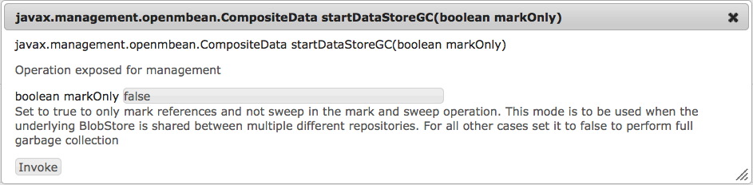

# Configurazione degli archivi di nodi e degli archivi di dati nel AEM 6{#configuring-node-stores-and-data-stores-in-aem}

## Introduzione {#introduction}

In Adobe Experience Manager (AEM), i dati binari possono essere memorizzati indipendentemente dai nodi di contenuto. I dati binari vengono memorizzati in un archivio dati, mentre i nodi di contenuto sono memorizzati in un archivio nodi.

È possibile configurare sia gli archivi di dati che gli archivi dei nodi utilizzando la configurazione OSGi. A ogni configurazione OSGi viene fatto riferimento utilizzando un identificatore permanente (PID).

## Passaggi di configurazione {#configuration-steps}

Per configurare sia l&#39;archivio nodi che l&#39;archivio dati, esegui questi passaggi:

1. Copia il file JAR AEM quickstart nella relativa directory di installazione.
1. Creare una cartella `crx-quickstart/install` nella directory di installazione.
1. Per prima cosa, configura l&#39;archivio nodi creando un file di configurazione con il nome dell&#39;opzione dell&#39;archivio nodi che desideri utilizzare nel `crx-quickstart/install` directory.

   Ad esempio, l&#39;archivio dei nodi Document (che è la base per AEM&#39;implementazione MongoMK) utilizza il file `org.apache.jackrabbit.oak.plugins.document.DocumentNodeStoreService.config`.

1. Modifica il file e imposta le opzioni di configurazione.
1. Crea un file di configurazione con il PID dell’archivio dati che desideri utilizzare. Modifica il file per impostare le opzioni di configurazione.

   >[!NOTE]
   >
   >Vedi [Configurazioni dell&#39;archivio nodi](#node-store-configurations) e [Configurazioni dell&#39;archivio dati](#data-store-configurations) per le opzioni di configurazione.

1. Inizia AEM.

## Configurazioni dell&#39;archivio nodi {#node-store-configurations}

>[!CAUTION]
>
>Le versioni più recenti di Oak utilizzano un nuovo schema e formato di denominazione per i file di configurazione OSGi. Il nuovo schema di denominazione richiede che il file di configurazione sia denominato **.config** e il nuovo formato richiede valori da digitare ed è [documentato qui](https://sling.apache.org/documentation/development/slingstart.html#default-configuration-format).
>
>Se esegui l’aggiornamento da una versione precedente di Oak, assicurati di effettuare un backup del `crx-quickstart/install`prima la cartella. Dopo l&#39;aggiornamento, ripristina il contenuto della cartella nell&#39;installazione aggiornata e modifica l&#39;estensione dei file di configurazione da **.cfg** a **.config**.
>
>Nel caso in cui tu legga questo articolo in preparazione di un aggiornamento da un **AEM 5.x** verificare di consultare [aggiornamento](https://docs.adobe.com/content/docs/en/aem/6-0/deploy/upgrade.html) prima la documentazione.

### Archivio dei nodi del segmento {#segment-node-store}

L’archivio dei nodi del segmento è la base dell’implementazione TarMK di Adobe in AEM6. Utilizza il `org.apache.jackrabbit.oak.segment.SegmentNodeStoreService` PID per la configurazione.

>[!CAUTION]
>
>Il PID per l’archivio dei nodi di segmento è stato modificato da `org.apache.jackrabbit.oak.plugins.segment.SegmentNodeStoreService in previous versions` del AEM da 6 a `org.apache.jackrabbit.oak.segment.SegmentNodeStoreService` in AEM 6.3. Assicurati di apportare le regolazioni di configurazione necessarie per riflettere questa modifica.

Puoi configurare le seguenti opzioni:

* `repository.home`: Percorso della home del repository in cui vengono archiviati i dati relativi al repository. Per impostazione predefinita, i file dei segmenti sono memorizzati nella `crx-quickstart/segmentstore` directory.

* `tarmk.size`: Dimensione massima di un segmento in MB. Il massimo predefinito è 256 MB.
* `customBlobStore`: Valore booleano che indica l&#39;utilizzo di un archivio dati personalizzato. Il valore predefinito è true per AEM 6.3 e versioni successive. Prima di AEM 6.3, il valore predefinito era false.

Di seguito è riportato un esempio `org.apache.jackrabbit.oak.segment.SegmentNodeStoreService.config` file:

```shell
#Path to repo
repository.home="crx-quickstart/repository"

#Max segment size
tarmk.size=I"256"

#Custom data store
customBlobStore=B"true"
```

#### Archiviazione dei nodi del documento {#document-node-store}

L&#39;archivio dei nodi del documento è la base dell&#39;implementazione AEM MongoMK. Utilizza il `org.apache.jackrabbit.oak.plugins.document.DocumentNodeStoreService`* *PID. Sono disponibili le seguenti opzioni di configurazione:

* `mongouri`: La [MongoURI](https://docs.mongodb.org/manual/reference/connection-string/) richiesto per la connessione al database Mongo. Il valore predefinito è `mongodb://localhost:27017`

* `db`: Nome del database Mongo. Il valore predefinito è **Oak** ``. However, new AEM 6 installations use **aem-author** ``come nome predefinito del database.

* `cache`: Dimensione della cache in MB. Questa viene distribuita tra le varie cache utilizzate in DocumentNodeStore. Il valore predefinito è `256`

* `changesSize`: Dimensioni in MB della raccolta limitata utilizzata in Mongo per memorizzare nella cache l&#39;output diff. Il valore predefinito è `256`

* `customBlobStore`: Valore booleano che indica che verrà utilizzato un archivio dati personalizzato. Il valore predefinito è `false`.

Di seguito è riportato un esempio `org.apache.jackrabbit.oak.plugins.document.DocumentNodeStoreService.config` file:

```shell
#Mongo server details
mongouri="mongodb://localhost:27017"

#Name of Mongo database to use
db="aem-author"

#Store binaries in custom BlobStore
customBlobStore=B"false"
```

## Configurazioni dell&#39;archivio dati {#data-store-configurations}

Quando si gestisce un numero elevato di binari, si consiglia di utilizzare un archivio dati esterno al posto degli archivi nodi predefiniti per massimizzare le prestazioni.

Ad esempio, se il progetto richiede un numero elevato di risorse multimediali, memorizzarle nel File o nell’archivio dati S3 consente di accedervi più rapidamente che archiviarle direttamente all’interno di un MongoDB.

Il File Data Store offre prestazioni migliori rispetto a MongoDB, e le operazioni di backup e ripristino Mongo sono anche più lente con un gran numero di risorse.

Di seguito sono descritti i dettagli sui diversi archivi di dati e configurazioni.

>[!NOTE]
>
>Per abilitare gli archivi dati personalizzati, assicurati che `customBlobStore` è impostato su `true` nel rispettivo file di configurazione Node Store ([archivio nodi segmento](/help/sites-deploying/data-store-config.md#segment-node-store) o [archivio nodi documento](/help/sites-deploying/data-store-config.md#document-node-store)).

### Archivio file di dati {#file-data-store}

Questa è l&#39;attuazione [FileDataStore](https://jackrabbit.apache.org/api/trunk/org/apache/jackrabbit/core/data/FileDataStore.html) presente in Jackrabbit 2. Fornisce un modo per memorizzare i dati binari come file normali sul file system. Utilizza il `org.apache.jackrabbit.oak.plugins.blob.datastore.FileDataStore` PID.

Sono disponibili le seguenti opzioni di configurazione:

* `repository.home`: Percorso della home dell&#39;archivio in cui vengono archiviati vari dati relativi all&#39;archivio. Per impostazione predefinita, i file binari vengono memorizzati in `crx-quickstart/repository/datastore` directory

* `path`: Percorso della directory in cui vengono archiviati i file. Se specificato, ha la precedenza su `repository.home` value

* `minRecordLength`: Dimensione minima in byte di un file archiviato nell&#39;archivio dati. Il contenuto binario inferiore a questo valore viene allineato.

>[!NOTE]
>
>Quando si utilizza un NAS per memorizzare gli archivi di dati dei file condivisi, assicurarsi di utilizzare solo dispositivi con prestazioni elevate per evitare problemi di prestazioni.

## Archivio dati Amazon S3 {#amazon-s-data-store}

AEM può essere configurato per memorizzare i dati in Amazon Simple Storage Service (S3). Utilizza il `org.apache.jackrabbit.oak.plugins.blob.datastore.S3DataStore.config` PID per la configurazione.

Per abilitare la funzionalità dell&#39;archivio dati S3, è necessario scaricare e installare un feature pack contenente il connettore S3 Datastore. Vai a [Archivio Adobe](https://repo1.maven.org/maven2/com/adobe/granite/com.adobe.granite.oak.s3connector/) e scarica l’ultima versione dalle versioni 1.10.x del feature pack (ad esempio, com.adobe.granite.oak.s3connector-1.10.0.zip). Inoltre, è necessario scaricare e installare l&#39;ultimo service pack AEM come elencato in [Note sulla versione di AEM 6.5](/help/release-notes/release-notes.md) pagina.

>[!NOTE]
>
>Quando utilizzi AEM con TarMK, i binari vengono memorizzati per impostazione predefinita in `FileDataStore`. Per utilizzare TarMK con il Datastore S3, è necessario iniziare a AEM utilizzando il `crx3tar-nofds` modalità runmode, ad esempio:

```shell
java -jar <aem-jar-file>.jar -r crx3tar-nofds
```

Una volta scaricato, è possibile installare e configurare il S3 Connector come segue:

1. Estrarre il contenuto del file zip del feature pack in una cartella temporanea.

1. Passa alla cartella temporanea e passa al seguente percorso:

   ```xml
   jcr_root/libs/system/install
   ```

   Copia tutti i contenuti dalla posizione precedente a `<aem-install>/crx-quickstart/install.`

1. Se AEM è già configurato per lavorare con l&#39;archivio Tar o MongoDB, rimuovi eventuali file di configurazione esistenti dal ***&lt;aem-install>***/*crx-quickstart*/*installare* prima di procedere. I file da rimuovere sono:

   * `For MongoMK: org.apache.jackrabbit.oak.plugins.document.DocumentNodeStoreService.config`
   * `For TarMK: org.apache.jackrabbit.oak.segment.SegmentNodeStoreService.config`

1. Torna alla posizione temporanea in cui è stato estratto il pacchetto di funzionalità e copia il contenuto della cartella seguente:

   * `jcr_root/libs/system/config`

   a

   * `<aem-install>/crx-quickstart/install`

   Assicurati di copiare solo i file di configurazione necessari per la configurazione corrente. Per un archivio dati dedicato e una configurazione dell&#39;archivio dati condivisa, copia il `org.apache.jackrabbit.oak.plugins.blob.datastore.S3DataStore.config` file.

   >[!NOTE]
   >
   >In una configurazione cluster, esegui i passaggi sopra descritti su tutti i nodi del cluster uno per uno. Inoltre, assicurati di utilizzare le stesse impostazioni S3 per tutti i nodi.

1. Modifica il file e aggiungi le opzioni di configurazione richieste dalla configurazione.
1. Inizia AEM.

## Aggiornamento a una nuova versione del connettore S3 1.10.x {#upgrading-to-a-new-version-of-the-s-connector}

Per effettuare l’aggiornamento a una nuova versione del connettore S3 1.10.x (ad esempio, da 1.10.0 a 1.10.4), effettua le seguenti operazioni:

1. Interrompi l&#39;istanza AEM.

1. Passa a `<aem-install>/crx-quickstart/install/15` nella cartella di installazione AEM e eseguire un backup del relativo contenuto.
1. Dopo il backup, elimina la vecchia versione del S3 Connector e le sue dipendenze eliminando tutti i file jar nel `<aem-install>/crx-quickstart/install/15` ad esempio:

   * **oak-blob-cloud-1.6.1.jar**
   * **aws-java-sdk-osgi-1.10.76.jar**

   >[!NOTE]
   >
   >I nomi di file sopra riportati sono utilizzati solo a scopo illustrativo.

1. Scarica la versione più recente del pacchetto di funzioni 1.10.x dal [Archivio Adobe](https://repo1.maven.org/maven2/com/adobe/granite/com.adobe.granite.oak.s3connector/).
1. Decomprimi il contenuto in una cartella separata, quindi accedi a `jcr_root/libs/system/install/15`.
1. Copia i file jar in **&lt;aem-install>**/crx-quickstart/install/15 nella cartella di installazione AEM.
1. Avvia AEM e controlla la funzionalità del connettore.

Puoi utilizzare il file di configurazione con le opzioni descritte di seguito.

<!--
* accessKey: The AWS access key.
* secretKey: The AWS secret access key. **Note:** When the `accessKey` or `secretKey` is not specified then the [IAM role](https://docs.aws.amazon.com/sdk-for-java/v1/developer-guide/java-dg-roles.html) is used for authentication.
* s3Bucket: The bucket name.
* s3Region: The bucket region.
* path: The path of the data store. The default is **&lt;AEM install folder&gt;/repository/datastore**
* minRecordLength: The minimum size of an object that should be stored in the data store. The minimum/default is **16KB.**
* maxCachedBinarySize: Binaries with size less than or equal to this size will be stored in memory cache. The size is in bytes. The default is **17408 **(17 KB).
* cacheSize: The size of the cache. The value is specified in bytes. The default is **64GB**.
* secret: Only to be used if using binaryless replication for shared datastore setup.
* stagingSplitPercentage: The percentage of cache size configured to be used for staging asynchronous uploads. The default value is **10**.
* uploadThreads: The number of uploads threads that are used for asynchronous uploads. The default value is **10**.
* stagingPurgeInterval: The interval in seconds for purging finished uploads from the staging cache. The default value is **300** seconds (5 minutes).
* stagingRetryInterval: The retry interval in seconds for failed uploads. The default value is **600** seconds (10 minutes).
-->

### Opzioni del file di configurazione del connettore S3 {#s3-connector-configuration-file-options}

>[!NOTE]
>
>Il connettore S3 supporta sia l’autenticazione utente IAM che l’autenticazione dei ruoli IAM. Per utilizzare l’autenticazione dei ruoli IAM, ometti il `accessKey` e `secretKey` dal file di configurazione. Il connettore S3 viene quindi impostato come predefinito [Ruolo IAM](https://docs.aws.amazon.com/sdk-for-java/v1/developer-guide/java-dg-roles.html) assegnato all&#39;istanza.

| Chiave | Descrizione | Predefiniti | Obbligatorio |
| --- | --- | --- | --- |
| accessKey | Accedi all’ID chiave per l’utente IAM con accesso al bucket . |  | Sì, quando non utilizzi i ruoli IAM. |
| secretKey | Chiave di accesso segreta per l’utente IAM con accesso al bucket. |  | Sì, quando non utilizzi i ruoli IAM. |
| cacheSize | Dimensione (in byte) della cache locale. | 64GB | No. |
| connectionTimeout | Impostare il tempo di attesa (in millisecondi) prima dell&#39;interruzione quando si stabilisce inizialmente una connessione. | 10000 | No. |
| maxCachedBinarySize | I file binari con dimensioni inferiori o uguali a questo valore (in byte) verranno memorizzati nella cache della memoria. | 17408 (17 KB) | No. |
| maxConnections | Imposta il numero massimo di connessioni HTTP aperte consentite. | 50 | No. |
| maxErrorRetry | Imposta il numero massimo di tentativi per richieste non riuscite (recuperabili). | 3 | No. |
| minRecordLength | Dimensione minima di un oggetto (in byte) che deve essere memorizzato nell&#39;archivio dati. | 16384 | No. |
| path | Percorso locale dell&#39;archivio dati AEM. | `crx-quickstart/repository/datastore` | No. |
| proxyHost | Imposta l&#39;host proxy opzionale attraverso il quale il client si connette. |  | No. |
| proxyPort | Imposta la porta proxy opzionale tramite la quale il client si connette. |  | No. |
| s3Bucket | Nome del bucket S3. |  | Sì |
| s3EndPoint | Endpoint API REST S3. |  | No. |
| s3Region | Area in cui si trova il bucket. Vedi questo [page](https://docs.aws.amazon.com/general/latest/gr/s3.html) per ulteriori dettagli. | Area geografica in cui è in esecuzione l’istanza di AWS. | No. |
| socketTimeout | Impostare il tempo di attesa (in millisecondi) per il trasferimento dei dati su una connessione aperta stabilita prima che la connessione si interrompa e venga chiusa. | 50000 | No. |
| stagingPurgeInterval | L&#39;intervallo (in secondi) per l&#39;eliminazione dei caricamenti completati dalla cache di staging. | 300 | No. |
| stagingRetryInterval | L&#39;intervallo (in secondi) per riprovare a caricare non è riuscito. | 600 | No. |
| stagingSplitPercentage | La percentuale di `cacheSize` da utilizzare per i caricamenti asincroni di staging. | 10 | No. |
| uploadThreads | Il numero di thread di caricamento utilizzati per i caricamenti asincroni. | 10 | No. |
| writeThreads | Numero di thread simultanei utilizzati per la scrittura tramite S3 Transfer Manager. | 10 | No. |

<!---
### Bucket region options {#bucket-region-options}

<table>
 <tbody>
  <tr>
   <td>US Standard</td>
   <td><code>us-standard</code></td>
  </tr>
  <tr>
   <td>US West</td>
   <td><code>us-west-2</code></td>
  </tr>
  <tr>
   <td>US West (Northern California)</td>
   <td><code>us-west-1</code></td>
  </tr>
  <tr>
   <td>EU (Ireland)<br /> </td>
   <td><code>EU</code></td>
  </tr>
  <tr>
   <td>Asia Pacific (Singapore)<br /> </td>
   <td><code>ap-southeast-1</code></td>
  </tr>
  <tr>
   <td>Asia Pacific (Sydney)<br /> </td>
   <td><code>ap-southeast-2</code></td>
  </tr>
  <tr>
   <td>Asia Pacific (Tokyo)</td>
   <td><code>ap-northeast-1</code></td>
  </tr>
  <tr>
   <td>South America (Sao Paolo)<br /> </td>
   <td><code>sa-east-1</code></td>
  </tr>
 </tbody>
</table>
-->

### Memorizzazione in cache del DataStore {#data-store-caching}

>[!NOTE]
>
>Implementazioni di DataStore di `S3DataStore`, `CachingFileDataStore` e `AzureDataStore` supporto della memorizzazione in cache del file system locale. La `CachingFileDataStore` L&#39;implementazione è utile quando DataStore è su NFS (Network File System).

Quando si esegue l’aggiornamento da un’implementazione precedente della cache (prima di Oak 1.6), c’è una differenza nella struttura della directory della cache del file system locale. Nella vecchia struttura della cache sia i file scaricati che quelli caricati sono stati messi direttamente sotto il percorso della cache. La nuova struttura separa i download e i caricamenti e li memorizza in due directory denominate `upload` e `download` nel percorso della cache. Il processo di aggiornamento dovrebbe essere senza soluzione di continuità e tutti i caricamenti in sospeso dovrebbero essere pianificati per il caricamento e tutti i file precedentemente scaricati nella cache verranno inseriti nella cache al momento dell&#39;inizializzazione.

Puoi anche aggiornare la cache offline utilizzando la `datastorecacheupgrade` comando di oak-run. Per informazioni dettagliate su come eseguire il comando, controlla la [leggimi](https://svn.apache.org/repos/asf/jackrabbit/oak/trunk/oak-run/README.md) per il modulo oak-run.

La cache ha un limite di dimensioni e può essere configurata utilizzando il parametro cacheSize.

#### Download {#downloads}

La cache locale verrà controllata per individuare il record del file/BLOB richiesto prima di accedervi dal DataStore. Quando la cache supera il limite configurato (vedi `cacheSize` (Parametro) durante l&#39;aggiunta di un file nella cache, alcuni dei file verranno eliminati per recuperare spazio.

#### Caricamento asincrono {#async-upload}

La cache supporta caricamenti asincroni in DataStore. I file vengono memorizzati localmente, nella cache (nel file system) e inizia un processo asincrono per caricare il file. Il numero di caricamenti asincroni è limitato dalle dimensioni della cache di staging. La dimensione della cache di staging viene configurata utilizzando il `stagingSplitPercentage` parametro . Questo parametro definisce la percentuale di dimensione della cache da utilizzare per la cache di staging. Inoltre, la percentuale di cache disponibile per i download viene calcolata come **(100 - `stagingSplitPercentage`) &#42;`cacheSize`**.

I caricamenti asincroni sono multithread e il numero di thread è configurato utilizzando il `uploadThreads` parametro .

I file vengono spostati nella cache di download principale al termine dei caricamenti. Quando la dimensione della cache di staging supera il limite, i file vengono caricati in modo sincrono nel DataStore fino a quando i caricamenti asincroni precedenti non sono completi e lo spazio è nuovamente disponibile nella cache di staging. I file caricati vengono rimossi dall’area di gestione temporanea da un processo periodico il cui intervallo è configurato dalla `stagingPurgeInterval` parametro .

I caricamenti non riusciti (ad esempio a causa di un’interruzione della rete) vengono messi in una coda di nuovi tentativi e riprovati periodicamente. L&#39;intervallo di esecuzione dei nuovi tentativi è configurato utilizzando la variabile `stagingRetryInterval parameter`.

#### Configurazione della replica binaryless con Amazon S3 {#configuring-binaryless-replication-with-amazon-s}

Per configurare la replica binaryless con S3, sono necessari i seguenti passaggi:

1. Installa le istanze di authoring e pubblicazione e assicurati che siano avviate correttamente.
1. Passa alle impostazioni dell’agente di replica, aprendo una pagina a *https://localhost:4502/etc/replication/agents.author/publish.html*.
1. Premere **Modifica** nel **Impostazioni** sezione .
1. Modificare la **Serializzazione** opzione digita in **Binario meno**.

1. Aggiungi il parametro &quot; `binaryless`= `true`&quot; nell&#39;uri di trasporto. Dopo la modifica, l’uri deve essere simile al seguente:

   *https://localhost:4503/bin/receive?sling:authRequestLogin=1&amp;binaryless=true*

1. Riavvia tutte le istanze di authoring e pubblicazione per rendere effettive le modifiche.

#### Creazione di un cluster utilizzando S3 e MongoDB {#creating-a-cluster-using-s-and-mongodb}

1. Estrai CQ quickstart utilizzando il seguente comando:

   `java -jar cq-quickstart.jar -unpack`

1. Dopo AEM essere stato decompresso, crea una cartella all’interno della directory di installazione *crx-quickstart*/*installare*.

1. Crea questi due file all&#39;interno del `crx-quickstart` cartella:

   * *org.apache.jackrabbit.oak.plugins.document.DocumentNodeStoreService*.*config*

   * *org.apache.jackrabbit.oak.plugins.blob.datastore.S3DataStore*.*config*

   Dopo aver creato i file, aggiungi le opzioni di configurazione necessarie.

1. Installa i due bundle necessari per l&#39;archivio dati S3 come spiegato sopra.
1. Assicurati che MongoDB sia installato e che un&#39;istanza di `mongod` è in esecuzione.
1. Inizia AEM con il seguente comando:

   `java -Xmx1024m -jar cq-quickstart.jar -r crx3,crx3mongo`

1. Ripetere i passaggi da 1 a 4 per la seconda istanza AEM.
1. Avvia la seconda istanza AEM.

#### Configurazione di un archivio dati condiviso {#configuring-a-shared-data-store}

1. Innanzitutto, crea il file di configurazione dell’archivio dati su ogni istanza necessaria per condividere l’archivio dati:

   * Se utilizzi un `FileDataStore`, crea un file denominato `org.apache.jackrabbit.oak.plugins.blob.datastore.FileDataStore.config` e inserirla nel `<aem-install>/crx-quickstart/install` cartella.

   * Se utilizzi S3 come archivio dati, crea un file denominato in `rg.apache.jackrabbit.oak.plugins.blob.datastore.S3DataStore.config` in `<aem-install>/crx-quickstart/install` come sopra.

1. Modifica i file di configurazione dell&#39;archivio dati in ogni istanza in modo che puntino allo stesso archivio dati. Per ulteriori informazioni, consulta [articolo](/help/sites-deploying/data-store-config.md#data-store-configurations).
1. Se l’istanza è stata clonata da un server esistente, devi rimuovere la `clusterId` della nuova istanza utilizzando lo strumento oak-run più recente mentre l&#39;archivio è offline. Il comando da eseguire è:

   ```xml
   java -jar oak-run.jar resetclusterid < repository path | Mongo URI >
   ```

   >[!NOTE]
   >
   >Se è configurato un archivio dei nodi di segmento, è necessario specificare il percorso del repository. Per impostazione predefinita, il percorso è `<aem-install-folder>/crx-quickstart/repository/segmentstore.` Se è configurato un archivio nodi documento, è possibile utilizzare un [URI stringa di connessione Mongo](https://docs.mongodb.org/manual/reference/connection-string/).

   >[!NOTE]
   >
   >Lo strumento Oak-run può essere scaricato da questo percorso:
   >
   >
   >[https://mvnrepository.com/artifact/org.apache.jackrabbit/oak-run/](https://mvnrepository.com/artifact/org.apache.jackrabbit/oak-run/)
   >
   >
   >Tieni presente che è necessario utilizzare diverse versioni dello strumento a seconda della versione Oak utilizzata con l’installazione di AEM. Prima di utilizzare lo strumento, controlla l’elenco dei requisiti di versione riportato di seguito:
   >
   >
   >
   >    * Per le versioni Oak **1.2.x** utilizzare Oak-run **1.2.12 o successivo**
   >    * Per le versioni Oak **più recente di quanto sopra**, utilizza la versione di Oak-run che corrisponde al nucleo Oak dell&#39;installazione di AEM.


1. Infine, convalida la configurazione. Per farlo, devi cercare un file univoco aggiunto all’archivio dati da ogni archivio che lo condivide. Il formato dei file è `repository-[UUID]`, dove l’UUID è un identificatore univoco di ciascun archivio.

   Pertanto, una configurazione corretta deve contenere tutti i file univoci quanti sono gli archivi che condividono l&#39;archivio dati.

   I file vengono memorizzati in modo diverso, a seconda dell&#39;archivio dati:

   * Per `FileDataStore` i file vengono creati nel percorso principale della cartella archivio dati.
   * Per `S3DataStore` i file vengono creati nel bucket S3 configurato sotto il `META` cartella.

## Archivio dati Azure {#azure-data-store}

AEM può essere configurato per memorizzare i dati nel servizio di archiviazione di Microsoft Azure. Utilizza il `org.apache.jackrabbit.oak.plugins.blob.datastore.AzureDataStore.config` PID per la configurazione.

Per abilitare la funzionalità dell’archivio dati di Azure, è necessario scaricare e installare un pacchetto di funzioni contenente il connettore di Azure. Vai a [Archivio Adobe](https://repo1.maven.org/maven2/com/adobe/granite/com.adobe.granite.oak.azureblobconnector/) e scarica l’ultima versione dalle versioni 1.6.x del feature pack (ad esempio, com.adobe.granite.oak.azureblobconnector-1.6.3.zip).

>[!NOTE]
>
>Quando si utilizza AEM con TarMK, i binari verranno memorizzati per impostazione predefinita nel FileDataStore. Per utilizzare TarMK con Azure DataStore, è necessario iniziare a AEM utilizzando il `crx3tar-nofds` modalità runmode, ad esempio:

```shell
java -jar <aem-jar-file>.jar -r crx3tar-nofds
```

Una volta scaricato, puoi installare e configurare il connettore di Azure come segue:

1. Estrarre il contenuto del file zip del feature pack in una cartella temporanea.

1. Vai alla cartella temporanea e copia il contenuto di `jcr_root/libs/system/install` al `<aem-install>crx-quickstart/install` cartella.
1. Se AEM è già configurato per lavorare con l&#39;archivio Tar o MongoDB, rimuovi eventuali file di configurazione esistenti dal `/crx-quickstart/install` prima di procedere. I file da rimuovere sono:

   ForMongoMK:

   `org.apache.jackrabbit.oak.plugins.document.DocumentNodeStoreService.config`

   Per TarMK:

   `org.apache.jackrabbit.oak.segment.SegmentNodeStoreService.config`

1. Torna alla posizione temporanea in cui è stato estratto il feature pack e copia il contenuto di `jcr_root/libs/system/config` al `<aem-install>/crx-quickstart/install` cartella.
1. Modifica il file di configurazione e aggiungi le opzioni di configurazione richieste dalla configurazione.
1. Inizia AEM.

Puoi utilizzare il file di configurazione con le seguenti opzioni:

* azureSas=&quot;&quot;: Nella versione 1.6.3 del connettore è stato aggiunto il supporto per la firma di accesso condiviso (SAS) di Azure. **Se nel file di configurazione sono presenti sia le credenziali SAS che di archiviazione, SAS ha priorità.** Per ulteriori informazioni su SAS, vedere la sezione [documentazione ufficiale](https://docs.microsoft.com/en-us/azure/storage/common/storage-dotnet-shared-access-signature-part-1). Assicurati che il carattere &#39;=&#39; sia preceduto da &#39;\=&#39;.

* azureBlobEndpoint=&quot;&quot;: Endpoint BLOB di Azure. Ad esempio, https://&lt;storage-account>.blob.core.windows.net.
* accessKey=&quot;&quot;: Nome dell&#39;account di archiviazione. Per ulteriori dettagli sulle credenziali di autenticazione di Microsoft Azure, consulta la [documentazione ufficiale](https://azure.microsoft.com/en-us/documentation/articles/storage-create-storage-account).

* secretKey=&quot;&quot;: Chiave di accesso allo storage. Assicurati che il carattere &#39;=&#39; sia preceduto da &#39;\=&#39;.
* container=&quot;&quot;: Nome del contenitore di archiviazione BLOB di Microsoft Azure. Il contenitore è un raggruppamento di un set di BLOB. Per ulteriori informazioni, consulta la sezione [documentazione ufficiale](https://msdn.microsoft.com/en-us/library/dd135715.aspx).
* maxConnections=&quot;&quot;: Numero simultaneo di richieste simultanee per operazione. Il valore predefinito è 1.
* maxErrorRetry=&quot;&quot;: Numero di tentativi per richiesta. Il valore predefinito è 3.
* socketTimeout=&quot;&quot;: Intervallo di timeout, in millisecondi, utilizzato per la richiesta. Il valore predefinito è 5 minuti.

Oltre alle impostazioni di cui sopra, è possibile configurare anche le seguenti impostazioni:

* percorso: Percorso dell&#39;archivio dati. Il valore predefinito è `<aem-install>/repository/datastore.`
* RecordLength: Dimensione minima di un oggetto che deve essere memorizzato nell&#39;archivio dati. Il valore predefinito è 16 KB.
* maxCachedBinarySize: I binari con dimensioni inferiori o uguali a queste dimensioni verranno memorizzati nella cache di memoria. La dimensione è espressa in byte. Il valore predefinito è 17408 (17 KB).
* cacheSize: Dimensione della cache. Il valore è specificato in byte. Il valore predefinito è 64 GB.
* segreto: Da utilizzare solo se si utilizza la replica binaryless per l&#39;impostazione di un archivio dati condiviso.
* stagingSplitPercentage: Percentuale di dimensioni della cache configurate da utilizzare per i caricamenti asincroni di staging. Il valore predefinito è 10.
* uploadThreads: Il numero di thread di caricamento utilizzati per i caricamenti asincroni. Il valore predefinito è 10.
* stagingPurgeInterval: Intervallo in secondi per lo svuotamento dei caricamenti completati dalla cache di staging. Il valore predefinito è 300 secondi (5 minuti).
* stagingRetryInterval: Intervallo dei tentativi in secondi per caricamenti non riusciti. Il valore predefinito è 600 secondi (10 minuti).

>[!NOTE]
>
>Tutte le impostazioni devono essere inserite tra virgolette, ad esempio:

```shell
accessKey="ASDASDERFAERAER"
secretKey="28932hfjlkwdo8fufsdfas\=\="
```

## Raccolta rifiuti dell&#39;archivio dati {#data-store-garbage-collection}

Il processo di raccolta degli oggetti inattivi dell&#39;archivio dati viene utilizzato per rimuovere i file non utilizzati nell&#39;archivio dati, liberando così spazio prezioso sul disco nel processo.

Puoi eseguire la raccolta degli oggetti inattivi dell&#39;archivio dati:

1. Andando alla console JMX che si trova in *https://&lt;serveraddress:port>/system/console/jmx*
1. Ricerca **RepositoryManagement.** Una volta trovato il MBean di Repository Manager, fai clic su di esso per visualizzare le opzioni disponibili.
1. Scorri fino alla fine della pagina e fai clic sul pulsante **startDataStoreGC(booleano markOnly)** link.
1. Nella finestra di dialogo seguente, immetti `false` per `markOnly` , quindi fai clic su **Richiama**:

   

   >[!NOTE]
   >
   >La `markOnly` Il parametro indica se la fase di sweep della raccolta degli oggetti inattivi verrà eseguita o meno.

## Raccolta rifiuti dell&#39;archivio dati per un archivio dati condiviso {#data-store-garbage-collection-for-a-shared-data-store}

>[!NOTE]
>
>Quando si esegue la raccolta oggetti inattivi in una configurazione dell’archivio dati in cluster o condiviso (con Mongo o Segment Tar), il registro potrebbe visualizzare avvisi sull’impossibilità di eliminare determinati ID BLOB. Questo accade perché gli ID BLOB eliminati in una precedente raccolta oggetti inattivi vengono erroneamente referenziati da altri nodi cluster o condivisi che non hanno informazioni sulle eliminazioni degli ID. Di conseguenza, quando si esegue la raccolta oggetti inattivi, viene registrato un avviso quando si tenta di eliminare un ID già eliminato nell’ultima esecuzione. Questo comportamento non influisce sulle prestazioni o sulle funzionalità.

>[!NOTE]
>
>Se utilizzi una configurazione del datastore condiviso e la raccolta degli oggetti inattivi del datastore è disabilitata, l&#39;esecuzione dell&#39;attività di pulizia binaria Lucene può improvvisamente aumentare lo spazio su disco utilizzato. Per evitare questo problema, devi disabilitare BlobTracker su tutte le istanze di authoring e pubblicazione come segue:
>
>1. Interrompi l&#39;istanza AEM.
>2. Aggiungi il `blobTrackSnapshotIntervalInSecs=L"0"` nel `crx-quickstart/install/org.apache.jackrabbit.oak.segment.SegmentNodeStoreService.config` file. Questo parametro richiede Oak 1.12.0, 1.10.2 o versione successiva.
>3. Riavvia l&#39;istanza AEM.


Con le versioni più recenti di AEM, la raccolta degli oggetti inattivi dell&#39;archivio dati può essere eseguita anche sugli archivi di dati condivisi da più di un archivio. Per poter eseguire la raccolta degli oggetti inattivi dell&#39;archivio dati in un archivio dati condiviso, procedi come segue:

1. Assicurati che tutte le attività di manutenzione configurate per la raccolta oggetti inattivi dell&#39;archivio dati siano disabilitate su tutte le istanze dell&#39;archivio che condividono l&#39;archivio dati.
1. Esegui i passaggi indicati in [Raccolta rifiuti binari](/help/sites-deploying/data-store-config.md#data-store-garbage-collection) singolarmente **tutto** istanze dell&#39;archivio che condividono l&#39;archivio dati. Tuttavia, assicurati di inserire `true` per `markOnly` prima di fare clic sul pulsante Invoke:

   

1. Dopo aver completato la procedura di cui sopra su tutte le istanze, esegui di nuovo la raccolta degli oggetti inattivi dell&#39;archivio dati da **qualsiasi** delle istanze:

   1. Vai alla console JMX e seleziona il Mbean di Repository Manager.
   1. Fai clic sul pulsante **Fai clic su startDataStoreGC(booleano markOnly)** link.
   1. Nella finestra di dialogo seguente, immetti `false` per `markOnly` di nuovo.
   In questo modo verranno raccolti tutti i file trovati utilizzando la fase di contrassegno utilizzata in precedenza ed eliminati gli altri file non utilizzati dall&#39;archivio dati.
