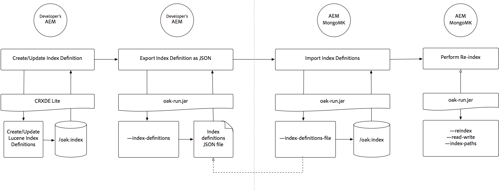

# Indicizzazione tramite Oak-run Jar {#indexing-via-the-oak-run-jar}

Oak-run supporta tutti i casi di utilizzo dell’indicizzazione sulla riga di comando senza dover operare dal livello JMX. I vantaggi dell’approccio oak-run sono:

1. Si tratta di un nuovo set di strumenti di indicizzazione per AEM 6.4
1. Riduce il tempo di reindicizzazione, che influisce positivamente sui tempi di reindicizzazione su archivi più grandi
1. Sta riducendo il consumo di risorse durante la reindicizzazione nell’AEM, il che si traduce in migliori prestazioni del sistema per altre attività dell’AEM
1. Oak-run fornisce supporto out-of-band: se le condizioni di produzione non consentono di eseguire la reindicizzazione sulle istanze di produzione, è possibile utilizzare un ambiente clonato per la reindicizzazione al fine di evitare un impatto critico sulle prestazioni.

Di seguito è riportato un elenco di casi d’uso che possono essere utilizzati quando si eseguono operazioni di indicizzazione tramite `oak-run` strumento.

## Controlli di coerenza indice {#indexconsistencychecks}

>[!NOTE]
>
>Per informazioni più dettagliate su questo scenario, consulta [Caso d’uso 1: verifica di coerenza dell’indice](/help/sites-deploying/oak-run-indexing-usecases.md#usercase1indexconsistencycheck).

* `oak-run.jar`determina rapidamente se gli indici Oak di Lucene sono danneggiati.
* È sicuro operare su un’istanza AEM in uso per i livelli di controllo di coerenza 1 e 2.

## Statistiche indice {#indexstatistics}

>[!NOTE]
>
>Per informazioni più dettagliate su questo scenario, consulta [Caso d’uso 2: statistiche dell’indice](/help/sites-deploying/oak-run-indexing-usecases.md#usecase2indexstatistics)

* `oak-run.jar` esegue il dump di tutte le definizioni di indice, delle statistiche di indice importanti e del contenuto dell&#39;indice per l&#39;analisi offline.
* L’esecuzione è sicura su un’istanza AEM in uso.

## Albero decisionale dell’approccio di reindicizzazione {#reindexingapproachdecisiontree}

Questo diagramma è un albero decisionale per specificare quando utilizzare i vari approcci di reindicizzazione.

## Reindicizzazione MongoMK/RDMBMK {#reindexingmongomk}

>[!NOTE]
>
>Per informazioni più dettagliate su questo scenario, consulta [Caso d’uso 3: reindicizzazione](/help/sites-deploying/oak-run-indexing-usecases.md#usecase3reindexing).

### Pre-estrazione del testo per SegmentNodeStore e DocumentNodeStore {#textpre-extraction}

[Pre-estrazione del testo](/help/sites-deploying/best-practices-for-queries-and-indexing.md#how-to-perform-text-pre-extraction) (una funzionalità già disponibile con AEM 6.3) può essere utilizzata per ridurre il tempo di reindicizzazione. La pre-estrazione del testo può essere utilizzata con tutti gli approcci di reindicizzazione.

A seconda della `oak-run.jar` Nell’approccio di indicizzazione, saranno disponibili vari passaggi su entrambi i lati del passaggio Esegui reindicizzazione nel diagramma seguente.

>[!NOTE]
>
>Arancione indica le attività in cui l’AEM deve trovarsi in una finestra di manutenzione.

### Reindicizzazione online per MongoMK o RDBMK tramite oak-run.jar {#onlinere-indexingformongomk}

>[!NOTE]
>
>Per informazioni più dettagliate su questo scenario, consulta [Reindicizza - DocumentNodeStore](/help/sites-deploying/oak-run-indexing-usecases.md#reindexdocumentnodestore).

Questo è il metodo consigliato per reindicizzare le installazioni di AEM MongoMK (e RDBMK). Non utilizzare altri metodi.

Eseguire questo processo solo su una singola istanza AEM nel cluster.

## Reindicizzazione TarMK {#re-indexingtarmk}

>[!NOTE]
>
>Per informazioni più dettagliate su questo scenario, consulta [Reindicizza - SegmentNodeStore](/help/sites-deploying/oak-run-indexing-usecases.md#reindexsegmentnodestore).

* **Considerazioni sulla modalità standby a freddo (TarMK)**

   * Non vi sono considerazioni speciali per lo standby a freddo; le istanze dello standby a freddo sincronizzano le modifiche come di consueto.

* **AEM Publish Farms (le farm di pubblicazione AE devono sempre essere TarMK)**

   * Per la farm di pubblicazione deve essere eseguita per tutti OPPURE eseguire i passaggi in un’unica pubblicazione e quindi clonare la configurazione per gli altri (seguendo tutte le consuete precauzioni durante la clonazione delle istanze AEM; sling.id - dovrebbe essere collegato a qualcosa qui)

### Reindicizzazione online per TarMK {#onlinere-indexingfortarmk}

>[!NOTE]
>
>Per informazioni più dettagliate su questo scenario, consulta [Reindicizzazione online - SegmentNodeStore](/help/sites-deploying/oak-run-indexing-usecases.md#onlinereindexsegmentnodestore).

Questo è il metodo utilizzato prima dell’introduzione delle nuove funzionalità di indicizzazione di oak-run.jar. Viene eseguita impostando `reindex=true` proprietà nell’indice Oak.

Questo approccio può essere utilizzato se gli effetti di indicizzazione in termini di tempo e prestazioni sono accettabili per il cliente. Questo è spesso il caso degli impianti AEM di piccole e medie dimensioni.

### Reindicizzazione online di TarMK tramite oak-run.jar {#onlinere-indexingtarmkusingoak-run-jar}

>[!NOTE]
>
>Per informazioni più dettagliate su questo scenario, consulta [Reindicizzazione online - SegmentNodeStore - L’istanza AEM è in esecuzione](/help/sites-deploying/oak-run-indexing-usecases.md#onlinereindexsegmentnodestoretheaeminstanceisrunning).

La reindicizzazione online di TarMK utilizzando oak-run.jar è più veloce della [Reindicizzazione online per TarMK](#onlinere-indexingfortarmk) descritto in precedenza. Tuttavia, richiede anche l’esecuzione durante una finestra di manutenzione; con la menzione che la finestra sarà più breve e sono necessari più passaggi per eseguire la reindicizzazione.

>[!NOTE]
>
>L&#39;arancione indica le operazioni in cui l&#39;AEM deve essere effettuato durante un periodo di mantenimento.

### Reindicizzazione offline di TarMK tramite oak-run.jar {#offlinere-indexingtarmkusingoak-run-jar}

>[!NOTE]
>
>Per informazioni più dettagliate su questo scenario, consulta [Reindicizzazione online - SegmentNodeStore - L’istanza AEM è chiusa](/help/sites-deploying/oak-run-indexing-usecases.md#onlinereindexsegmentnodestoreaeminstanceisdown).

La reindicizzazione offline di TarMK è la più semplice `oak-run.jar` basato sulla reindicizzazione per TarMK in quanto richiede un unico `oak-run.jar` commento. Tuttavia, richiede la chiusura dell’istanza AEM.

>[!NOTE]
>
>Il rosso indica le operazioni in cui l&#39;AEM deve essere interrotto.

### Reindicizzazione out-of-band di TarMK tramite oak-run.jar  {#out-of-bandre-indexingtarmkusingoak-run-jar}

>[!NOTE]
>
>Per informazioni più dettagliate su questo scenario, consulta [Reindicizzazione fuori banda - SegmentNodeStore](/help/sites-deploying/oak-run-indexing-usecases.md#outofbandreindexsegmentnodestore).

La reindicizzazione fuori banda riduce al minimo l’impatto della reindicizzazione sulle istanze AEM in uso.

>[!NOTE]
>
>Il rosso indica le operazioni in cui l’AEM può essere interrotto.

## Aggiornamento delle definizioni di indicizzazione {#updatingindexingdefinitions}

>[!NOTE]
>
>Per informazioni più dettagliate su questo scenario, consulta [Caso d&#39;uso 4: aggiornamento delle definizioni degli indici](/help/sites-deploying/oak-run-indexing-usecases.md#usecase4updatingindexdefinitions).

### Creazione e aggiornamento delle definizioni degli indici in TarMK tramite ACS Ensure Index {#creatingandupdatingindexdefinitionsontarmkusingacsensureindex}

>[!NOTE]
>
>ACS Ensure Index è un progetto supportato dalla community e non è supportato dal supporto Adobe.

Questo consente la definizione dell’indice di spedizione tramite il pacchetto di contenuti che in seguito determina la reindicizzazione impostando il flag di reindicizzazione su `true`. Questo funziona per configurazioni più piccole in cui la reindicizzazione non richiede molto tempo.

Per ulteriori informazioni, consulta [Documentazione di ACS Ensure Index](https://adobe-consulting-services.github.io/acs-aem-commons/features/ensure-oak-index/index.html) per i dettagli.

### Creazione e aggiornamento delle definizioni degli indici in TarMK tramite oak-run.jar {#creatingandupdatingindexdefinitionsontarmkusingoak-run-jar}

Se il tempo o le prestazioni influiscono sulla reindicizzazione utilizzando`oak-run.jar` metodi è troppo alto, i seguenti `oak-run.jar` L’approccio basato su può essere utilizzato per importare e reindicizzare le definizioni dell’indice Lucene in un’installazione AEM basata su TarMK.

### Creazione e aggiornamento delle definizioni degli indici in MonogMK tramite oak-run.jar {#creatingandupdatingindexdefinitionsonmonogmkusingoak-run-jar}

Se il tempo o le prestazioni influiscono sulla reindicizzazione utilizzando`oak-run.jar` metodi è troppo alto, i seguenti `oak-run.jar` L’approccio basato su può essere utilizzato per importare e reindicizzare le definizioni dell’indice di Lucene nelle installazioni AEM basate su MongoMK.

