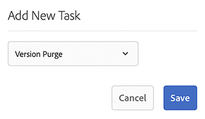
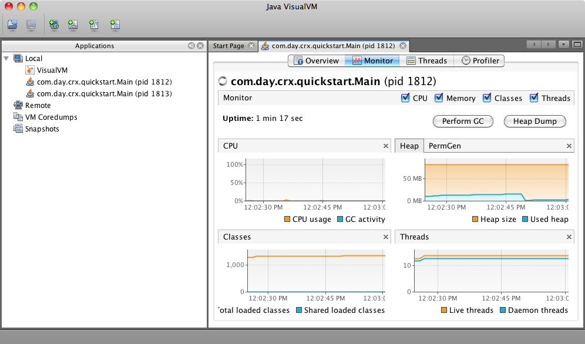

# Monitoraggio e manutenzione dell’istanza di Adobe Experience Manager{#monitoring-and-maintaining-your-aem-instance}

Dopo aver implementato le istanze AEM, è necessario monitorarne e mantenerne il funzionamento, le prestazioni e l’integrità.

Un fattore chiave in questo caso è che per riconoscere potenziali problemi è necessario conoscere l&#39;aspetto e il funzionamento del sistema in condizioni normali. Questa capacità è resa possibile al meglio monitorando il sistema e raccogliendo informazioni nel tempo.

| Verifica | Considerazioni | Commento/Azioni |
|---|---|---|
| Piano di backup. |  | Scopri come [Eseguire il backup dell&#39;istanza](/help/sites-deploying/monitoring-and-maintaining.md#backups). |
| Piano di disaster recovery. | Linee guida aziendali per il disaster recovery. |  |
| È disponibile un sistema di tracciamento degli errori per la segnalazione dei problemi. | Ad esempio, [Bugzilla](https://www.bugzilla.org/), [Jira](https://www.atlassian.com/software/jira) o uno dei tanti altri. |  |
| Monitoraggio dei file system. | L’archivio CRX si &quot;blocca&quot; se lo spazio disponibile su disco è insufficiente. Riprende quando lo spazio diventa disponibile. | &quot;È possibile visualizzare i messaggi &quot;`*ERROR* LowDiskSpaceBlocker`&quot; nel file di registro quando lo spazio disponibile è insufficiente. |
| [Monitoraggio dei file di registro](/help/sites-deploying/monitoring-and-maintaining.md#working-with-audit-records-and-log-files) in corso. |  |  |
| Il monitoraggio del sistema è (costantemente) in esecuzione in background. | Compreso l&#39;utilizzo di CPU, memoria, disco e rete. Ad esempio, utilizzando iostat / vmstat / perfmon. | I dati registrati vengono visualizzati e possono essere utilizzati per monitorare i problemi di prestazioni. Anche i dati non elaborati sono accessibili. |
| [Monitoraggio delle prestazioni di AEM in corso](/help/sites-deploying/monitoring-and-maintaining.md#monitoring-performance). | Inclusione di [contatori di richieste](/help/sites-deploying/monitoring-and-maintaining.md#request-counters) per monitorare i livelli di traffico. | Se si osserva una perdita significativa, o a lungo termine, di rendimento, è necessario effettuare un&#39;indagine dettagliata. |
| Stai monitorando i tuoi [agenti di replica](/help/sites-deploying/monitoring-and-maintaining.md#monitoring-your-replication-agents). |  |  |
| Eliminare regolarmente le istanze del flusso di lavoro. | Dimensioni dell’archivio e prestazioni del flusso di lavoro. | Vedi [Rimozione regolare delle istanze del flusso di lavoro](/help/sites-administering/workflows-administering.md#regular-purging-of-workflow-instances). |

## Backup {#backups}

È buona prassi eseguire il backup di:

* Installazione del software - prima/dopo modifiche significative alla configurazione
* Contenuto contenuto all’interno dell’archivio, regolarmente

È probabile che l&#39;azienda disponga di una politica di backup da seguire. Considerazioni aggiuntive su cosa e quando eseguire il backup sono le seguenti:

* la criticità del sistema e dei dati.
* la frequenza con cui vengono apportate modifiche al software o ai dati.
* volume di dati; la capacità può occasionalmente rappresentare un problema, così come il tempo per eseguire il backup.
* se è possibile eseguire il backup mentre gli utenti sono online e, se possibile, qual è l&#39;impatto sulle prestazioni.
* la distribuzione geografica degli utenti; ovvero, quando è il momento migliore per eseguire il backup (per ridurre al minimo l&#39;impatto)?
* criteri di ripristino di emergenza; esistono linee guida sulla posizione in cui devono essere archiviati i dati di backup (ad esempio, fuori sede e supporto specifico).

Spesso viene eseguito un backup completo a intervalli regolari (ad esempio, giornaliero, settimanale o mensile), con backup incrementali compresi tra (ad esempio, ogni ora, ogni giorno o ogni settimana).

>[!CAUTION]
>
>Durante l&#39;implementazione dei backup delle istanze di produzione, è necessario eseguire i test *1&rbrace; per verificare che sia possibile ripristinare correttamente il backup.*
>
>Senza questo test, il backup è potenzialmente inutile (scenario peggiore).

>[!NOTE]
>
>Per ulteriori informazioni sulle prestazioni di backup, leggere la sezione [Backup delle prestazioni](/help/sites-deploying/configuring-performance.md#backup-performance).

### Backup dell&#39;installazione del software {#backing-up-your-software-installation}

Dopo l&#39;installazione, o dopo modifiche significative della configurazione, creare un backup dell&#39;installazione del software.

Per eseguire questa attività, [esegui il backup dell&#39;intero archivio](#backing-up-your-repository), quindi:

1. Interrompi AEM.
1. Eseguire il backup dell&#39;intero `<cq-installation-dir>` dal file system.

>[!CAUTION]
>
>Se si utilizza un server applicazioni di terze parti, è possibile che altre cartelle si trovino in una posizione diversa e che sia necessario eseguirne il backup. Per informazioni sull&#39;installazione dei server applicazioni, vedere [Come installare AEM con un server applicazioni](/help/sites-deploying/application-server-install.md).

>[!CAUTION]
>
>È supportato il backup incrementale dell’archivio dati dei file; quando utilizzi il backup incrementale per altri componenti (come l’indice Lucene), assicurati che anche i file eliminati siano contrassegnati come eliminati nel backup.

>[!NOTE]
>
>Il mirroring del disco può essere utilizzato anche come meccanismo di backup.

### Backup dell’archivio {#backing-up-your-repository}

Nella sezione [Backup e ripristino](/help/sites-administering/backup-and-restore.md) della documentazione di CRX sono descritti tutti i problemi relativi ai backup dell&#39;archivio CRX.

Per informazioni dettagliate sull&#39;esecuzione di un backup &quot;a caldo&quot; online, vedere [Creazione di un backup online](/help/sites-administering/backup-and-restore.md#online-backup).

## Rimozione versione {#version-purging}

Lo strumento **Rimuovi versioni** è progettato per eliminare le versioni di un nodo o di una gerarchia di nodi nell&#39;archivio. Il suo scopo principale è quello di aiutare a ridurre le dimensioni dell’archivio rimuovendo le versioni precedenti dei nodi.

Questa sezione tratta le operazioni di manutenzione relative alla funzione di controllo delle versioni di AEM. Lo strumento **Rimuovi versione** è destinato all&#39;eliminazione delle versioni di un nodo o di una gerarchia di nodi nell&#39;archivio. Il suo scopo principale è quello di aiutare a ridurre le dimensioni dell’archivio rimuovendo le versioni precedenti dei nodi.

### Panoramica {#overview}

Lo strumento **Rimuovi versioni** è disponibile come attività di manutenzione settimanale. Prima di utilizzare per la prima volta, è necessario aggiungerlo e configurarlo. Successivamente può essere eseguito su richiesta o settimanalmente.

### Rimozione delle versioni di un sito Web {#purging-versions-of-a-web-site}

Per eliminare le versioni di un sito Web, procedere come segue:

1. Passa alla **[Strumenti](/help/sites-administering/tools-consoles.md)** **console**, seleziona **Operazione**, **Manutenzione**, quindi **Finestra manutenzione settimanale**.

1. Seleziona **+ Aggiungi** dalla barra degli strumenti superiore.

   

1. Selezionare **Rimozione versione** dall&#39;elenco a discesa nella finestra di dialogo **Aggiungi nuova attività**. Quindi **Salva**.

   

1. L&#39;attività **Pulizia versione** è stata aggiunta. Utilizza le azioni della scheda per:
   * Seleziona: mostra ulteriori azioni nella barra degli strumenti superiore
   * Esegui: per eseguire immediatamente l’eliminazione configurata
   * Configura: per configurare l’attività di eliminazione settimanale

   

1. Selezionare l&#39;azione **Configura** per aprire la console Web per l&#39;attività **di eliminazione versione di CQ WCM**, in cui è possibile configurare:

   

   * **Percorsi di eliminazione**
Impostare il percorso iniziale del contenuto da eliminare, ad esempio `/content/wknd`.

     >[!CAUTION]
     >
     >Adobe consiglia di definire più percorsi per ciascuno dei siti web.
     >
     >La definizione di un percorso con troppi elementi figlio può allungare notevolmente il tempo necessario per eseguire l&#39;eliminazione.

   * **Rimuovi versioni in modo ricorsivo**

      * Deseleziona questa opzione se desideri eliminare solo il nodo definito dal percorso.
      * Seleziona questa opzione per rimuovere il nodo definito dal percorso e dai relativi discendenti.

   * **Numero massimo di versioni**
Imposta il numero massimo di versioni (per ogni nodo) che desideri mantenere. Lascia vuoto per non usare questa impostazione.

   * **Numero minimo di versioni**
Imposta il numero minimo di versioni (per ogni nodo) che desideri mantenere. Lascia vuoto per non usare questa impostazione.

   * **Versione massima**
Imposta la validità massima della versione in giorni (per ogni nodo) che desideri mantenere. Lascia vuoto per non usare questa impostazione.

   Quindi **Salva**.

1. Passa/torna alla finestra **Finestra manutenzione settimanale** e seleziona **Esegui** per avviare il processo immediatamente.

>[!CAUTION]
>
>Puoi utilizzare la finestra di dialogo dell&#39;interfaccia classica per eseguire una [Dry Run](#analyzing-the-console) della configurazione:
>
>* http://localhost:4502/etc/versioning/purge.html
>
>I nodi eliminati non possono essere ripristinati senza ripristinare l’archivio. Assicurati di eseguire sempre un&#39;esecuzione di prova prima di eseguire l&#39;eliminazione.

#### Dry Run: analisi della console {#analyzing-the-console}

L&#39;interfaccia utente classica fornisce un&#39;opzione **Dry Run** da:

* http://localhost:4502/etc/versioning/purge.html

Il processo elenca tutti i nodi che sono stati elaborati. Durante il processo, un nodo può avere uno dei seguenti stati:

* `ignore (not versionnable)`: il nodo non supporta il controllo delle versioni e viene ignorato durante il processo.

* `ignore (no version)`: il nodo non ha alcuna versione e viene ignorato durante il processo.

* `retained`: nodo non eliminato.
* `purged`: nodo eliminato.

Inoltre, la console fornisce informazioni utili sulle versioni:

* `V 1.0`: numero di versione.
* `V 1.0.1`&#42;: la stella indica che la versione è la versione corrente (di base) e non può essere eliminata.

* `Thu Mar 15 2012 08:37:32 GMT+0100`: la data della versione.

Nell&#39;esempio seguente:

* Le versioni **[!DNL Shirts]** vengono eliminate perché la loro validità è superiore a due giorni.
* Le versioni **[!DNL Tonga Fashions!]** vengono eliminate perché il numero di versioni è maggiore di 5.


## Utilizzo dei record di controllo e dei file di registro {#working-with-audit-records-and-log-files}

I record di controllo e i file di registro relativi a Adobe Experience Manager (AEM) si trovano in varie posizioni. Di seguito viene fornita una panoramica di ciò che è possibile trovare e dove è possibile trovarlo.

### Utilizzo dei registri {#working-with-logs}

AEM WCM registra i registri dettagliati. Dopo aver decompresso e avviato Quickstart, puoi trovare i registri in:

* `<cq-installation-dir>/crx-quickstart/logs/`

* `<cq-installation-dir>/crx-quickstart/repository/`

#### Rotazione del file di registro {#log-file-rotation}

La rotazione del file di registro si riferisce al processo che limita la crescita del file creando periodicamente un file. In AEM, un file di registro denominato `error.log` viene ruotato una volta al giorno in base alle regole specificate:

* Il file `error.log` è stato rinominato in base al pattern `{original_filename}.yyyy-MM-dd`. Ad esempio, l&#39;11 luglio 2010 il file di registro corrente viene rinominato `error.log-2010-07-10`, quindi viene creato un nuovo `error.log`.

* I file di registro precedenti non vengono eliminati, pertanto è responsabilità dell&#39;utente pulire periodicamente i file di registro precedenti per limitare l&#39;utilizzo del disco.

>[!NOTE]
>
>Se aggiorni l’installazione di AEM, tutti i file di registro esistenti non più utilizzati da AEM rimangono sul disco. È possibile rimuoverli senza rischi. Tutte le nuove voci di registro vengono scritte nei nuovi file di registro.

### Ricerca dei file di registro {#finding-the-log-files}

Nel file server in cui è stato installato AEM sono presenti diversi file di registro:

* `<cq-installation-dir>/crx-quickstart/logs`

   * `access.log`
Tutte le richieste di accesso a AEM WCM e all’archivio vengono registrate qui.

   * `audit.log`
Le azioni di moderazione sono registrate qui.

   * `error.log`
I messaggi di errore (di diversi livelli di gravità) sono registrati qui.

   * [`ImageServer-<PortId>-yyyy>-<mm>-<dd>.log`](https://experienceleague.adobe.com/docs/dynamic-media-developer-resources/image-serving-api/image-serving-api/config-admin/server-logging/c-image-server-log.html)
Questo registro viene utilizzato solo se [!DNL Dynamic Media] è abilitato. Fornisce statistiche e informazioni analitiche utilizzate per analizzare il comportamento del processo interno ImageServer.

   * `request.log`
Ogni richiesta di accesso viene registrata qui insieme alla risposta.

   * [`s7access-<yyyy>-<mm>-<dd>.log`](https://experienceleague.adobe.com/docs/dynamic-media-developer-resources/image-serving-api/image-serving-api/config-admin/server-logging/c-access-log.html)
Questo registro viene utilizzato solo se [!DNL Dynamic Media] è abilitato. Il registro s7access registra ogni richiesta effettuata a [!DNL Dynamic Media] tramite `/is/image` e `/is/content`.

   * `stderr.log`
Contiene i messaggi di errore, di diverso livello di gravità, generati durante l&#39;avvio. Per impostazione predefinita, il livello di registro è impostato su `Warning` ( `WARN`)

   * `stdout.log`
Contiene i messaggi di registrazione che indicano gli eventi durante l&#39;avvio.

   * `upgrade.log`
Fornisce un registro di tutte le operazioni di aggiornamento eseguite dai pacchetti `com.day.compat.codeupgrade` e `com.adobe.cq.upgradesexecutor`.

* `<cq-installation-dir>/crx-quickstart/repository/segmentstore`

   * `journal.log`
Revisione delle informazioni del giornale di registrazione.

>[!NOTE]
>
>I registri di ImageServer e s7access non sono inclusi nel pacchetto **Download Full &#x200B;** generato dalla **pagina &#x200B;** system/console/status-Bundlelist&quot;. Per assistenza, se hai [!DNL Dynamic Media] problemi, aggiungi i registri di accesso ImageServer e s7access quando contatti l&#39;Assistenza clienti.

### Attivazione del livello di registro DEBUG {#activating-the-debug-log-level}

Il livello di registro predefinito ([Configurazione registrazione Sling di Apache](/help/sites-deploying/osgi-configuration-settings.md#apacheslingloggingconfiguration)) è Information, pertanto i messaggi di debug non vengono registrati.

Per attivare il livello di registro di debug per un logger, impostare la proprietà `org.apache.sling.commons.log.level` per eseguire il debug nell&#39;archivio. Ad esempio, il `/libs/sling/config/org.apache.sling.commons.log.LogManager` per configurare la [registrazione Apache Sling globale](/help/sites-deploying/osgi-configuration-settings.md#apacheslingloggingconfiguration).

>[!CAUTION]
>
>Non lasciare il registro a livello di registro di debug più a lungo del necessario, perché genera numerose voci di registro, con un consumo di risorse.

Una riga nel file di debug in genere inizia con DEBUG, quindi fornisce il livello del registro, l&#39;azione del programma di installazione e il messaggio del registro. Ad esempio:

```shell
DEBUG 3 WebApp Panel: WebApp successfully deployed
```

I livelli del registro sono i seguenti:

| 0 | Errore irreversibile | Azione non riuscita. Impossibile continuare l&#39;installazione. |
|---|---|---|
| 1 | Errore | Azione non riuscita. L&#39;installazione procede, ma una parte di AEM WCM non è stata installata correttamente e non funziona. |
| 2 | Avvertenza | L&#39;azione è stata completata ma si sono verificati problemi. AEM WCM potrebbe funzionare correttamente o meno. |
| 3 | Informazioni | Azione completata. |

### Creare un file di registro personalizzato {#create-a-custom-log-file}

>[!NOTE]
>
>Quando si lavora con Adobe Experience Manager, sono disponibili diversi metodi di gestione delle impostazioni di configurazione per tali servizi. Per ulteriori dettagli e procedure consigliate, vedere [Configurazione di OSGi](/help/sites-deploying/configuring-osgi.md).

In determinate circostanze, può essere opportuno creare un file di registro personalizzato con un livello di registro diverso. Nell’archivio, effettua le seguenti operazioni:

1. Se non esiste, creare una cartella di configurazione ( `sling:Folder`) per il progetto `/apps/<project-name>/config`.
1. In `/apps/<project-name>/config`, crea un nodo per la nuova configurazione del logger di registrazione [Apache Sling](/help/sites-deploying/osgi-configuration-settings.md#apacheslingloggingloggerconfigurationfactoryconfiguration):

   * Nome: `org.apache.sling.commons.log.LogManager.factory.config-<identifier>`

     Dove `<identifier>` è sostituito da testo libero che è necessario immettere per identificare l&#39;istanza (non è possibile omettere queste informazioni).

     Ad esempio `org.apache.sling.commons.log.LogManager.factory.config-MINE`

   * Tipo: `sling:OsgiConfig`

   >[!NOTE]
   >
   >Sebbene non si tratti di un requisito tecnico, è consigliabile rendere `<identifier>` univoco.

1. Imposta le seguenti proprietà su questo nodo:

   * Nome: `org.apache.sling.commons.log.file`

     Tipo: String

     Valore: specificare il file di log, ad esempio `logs/myLogFile.log`

   * Nome: `org.apache.sling.commons.log.names`

     Tipo: String[] (String + Multi)

     Valore: specifica i servizi OSGi per i quali il logger deve registrare i messaggi; ad esempio, tutti i seguenti:

      * `org.apache.sling`
      * `org.apache.felix`
      * `com.day`

   * Nome: `org.apache.sling.commons.log.level`

     Tipo: String

     Valore: specificare il livello di log richiesto ( `debug`, `info`, `warn` o `error`); ad esempio, `debug`

   * Configura gli altri parametri come richiesto:

      * Nome: `org.apache.sling.commons.log.pattern`

        Tipo: `String`

        Valore: specifica il pattern del messaggio di registro come richiesto; ad esempio,

        `{0,date,dd.MM.yyyy HH:mm:ss.SSS} *{4}* [{2}] {3} {5}`

   >[!NOTE]
   >
   >`org.apache.sling.commons.log.pattern` supporta fino a sei argomenti.
   >
   >{0} Timestamp di tipo `java.util.Date`
   >
   >{1} indicatore del registro
   >
   >{2} nome del thread corrente
   >
   >{3} nome del logger
   >
   >{4} livello di registro
   >
   >{5} il messaggio di registro
   >
   >Se la chiamata di registro include `Throwable`, la traccia dello stack viene aggiunta al messaggio.

   >[!CAUTION]
   >
   >org.apache.sling.commons.log.names deve avere un valore.

   >[!NOTE]
   >
   >I percorsi del writer di log sono relativi al percorso `crx-quickstart`.
   >
   >Pertanto, un file di registro specificato come:
   >
   >`logs/thelog.log`
   >
   >scrive in:
   >
   >`<cq-installation-dir>/crx-quickstart/logs/thelog.log`.
   >
   >E un file di registro specificato come:
   >
   >`../logs/thelog.log`
   >
   >scrive in una directory:
   >
   >`<cq-installation-dir>/logs/`\
   >(ovvero, accanto a `<cq-installation-dir>/crx-quickstart/`)

1. Questo passaggio è necessario solo quando è necessario un nuovo processo di scrittura, ovvero con una configurazione diversa da quella predefinita.

   >[!CAUTION]
   >
   >È necessaria una nuova configurazione di Logging Writer solo se il valore predefinito esistente non è adatto.
   >
   >Se non è configurato alcun processo di scrittura esplicito, il sistema genera automaticamente un processo di scrittura implicito in base all&#39;impostazione predefinita.

   In `/apps/<project-name>/config`, crea un nodo per la nuova [configurazione di Apache Sling Logging Writer](/help/sites-deploying/osgi-configuration-settings.md#apacheslingloggingwriterconfigurationfactoryconfiguration):

   * Nome: `org.apache.sling.commons.log.LogManager.factory.writer-<identifier>` (autore)

     Come per il Logger, `<identifier>` è sostituito dal testo libero che è necessario immettere per identificare l&#39;istanza (non è possibile omettere queste informazioni). Ad esempio `org.apache.sling.commons.log.LogManager.factory.writer-MINE`

   * Tipo: `sling:OsgiConfig`

   >[!NOTE]
   >
   >Sebbene non si tratti di un requisito tecnico, è consigliabile rendere `<identifier>` univoco.

   Imposta le seguenti proprietà su questo nodo:

   * Nome: `org.apache.sling.commons.log.file`

     Tipo: `String`

     Valore: specifica il file di registro in modo che corrisponda al file specificato nel logger;

     per questo esempio, `../logs/myLogFile.log`.

   * Configura gli altri parametri come richiesto:

      * Nome: `org.apache.sling.commons.log.file.number`

        Tipo: `Long`

        Valore: specificare il numero di file di log che si desidera mantenere, ad esempio `5`

      * Nome: `org.apache.sling.commons.log.file.size`

        Tipo: `String`

        Valore: specifica come necessario per controllare la rotazione del file in base a dimensione/data; ad esempio, `'.'yyyy-MM-dd`

   >[!NOTE]
   >
   >`org.apache.sling.commons.log.file.size` controlla la rotazione del file di log impostando:
   >
   >* una dimensione file massima
   >* una pianificazione data/ora
   >
   >per indicare quando viene creato un nuovo file (e il file esistente viene rinominato in base al pattern del nome).
   >
   >* È possibile specificare un limite di dimensione con un numero. Se non viene fornito alcun indicatore di dimensione, verrà considerato come il numero di byte oppure sarà possibile aggiungere uno degli indicatori di dimensione: `KB`, `MB` o `GB` (il case verrà ignorato).
   >* È possibile specificare una pianificazione di data/ora come modello `java.util.SimpleDateFormat`. Definisce il periodo di tempo dopo il quale il file viene ruotato. Inoltre, il suffisso aggiunto al file ruotato (per l’identificazione).
   >
   >Il valore predefinito è &#39;.&#39;dd/MM/yyyy (per la rotazione giornaliera dei log).
   >
   >Ad esempio, a mezzanotte del 20 gennaio 2010 (o quando il primo messaggio di registro dopo questa data è preciso), ../logs/error.log viene rinominato ../logs/error.log.2010-01-20. La registrazione per il 21 gennaio viene generata in (nuovo e vuoto) ../logs/error.log fino al suo rollover al cambio di giorno successivo.
   >
   >| `'.'yyyy-MM` | Rotazione all’inizio di ogni mese |
   >|---|---|
   >| `'.'yyyy-ww` | Rotazione al primo giorno di ogni settimana (a seconda delle impostazioni internazionali). |
   >| `'.'yyyy-MM-dd` | Rotazione ogni giorno a mezzanotte. |
   >| `'.'yyyy-MM-dd-a` | Rotazione a mezzanotte e a mezzogiorno di ogni giorno. |
   >| `'.'yyyy-MM-dd-HH` | Rotazione all’inizio di ogni ora. |
   >| `'.'yyyy-MM-dd-HH-mm` | Rotazione all&#39;inizio di ogni minuto. |
   >
   >Nota: quando si specifica un&#39;ora/data:
   >
   >1. È necessario &quot;sfuggire&quot; al testo letterale all&#39;interno di una coppia di virgolette singole (&#39; &#39;);
   >
   >    Evita che alcuni caratteri vengano interpretati come lettere pattern.
   >
   >1. Utilizza solo i caratteri consentiti per un nome file valido in qualsiasi punto dell’opzione.

1. Leggi il nuovo file di registro con lo strumento scelto.

   Il file di log creato da questo esempio è `../crx-quickstart/logs/myLogFile.log`.

La console Felix fornisce anche informazioni sul supporto del registro Sling in `../system/console/slinglog`; ad esempio, `https://localhost:4502/system/console/slinglog`.

### Ricerca dei record di audit {#finding-the-audit-records}

I registri di audit sono tenuti per fornire una registrazione di chi ha fatto cosa e quando. Vengono generati record di audit diversi per gli eventi AEM WCM e OSGi.

#### Record di controllo WCM di AEM visualizzati durante l’authoring delle pagine {#aem-wcm-audit-records-shown-when-page-authoring}

1. Apri una pagina.
1. Dalla barra laterale puoi selezionare la scheda con l&#39;icona del lucchetto, quindi fai doppio clic su **Registro di controllo...**
1. Viene visualizzata una nuova finestra che mostra l’elenco dei record di audit per la pagina corrente.

   

1. Fare clic su **OK** per chiudere la finestra.

#### Record di AEM WCM Auditing all’interno dell’archivio {#aem-wcm-auditing-records-within-the-repository}

All&#39;interno della cartella `/var/audit`, i record di controllo vengono mantenuti in base alla risorsa. È possibile espandere la visualizzazione fino a visualizzare i singoli record e le informazioni in essi contenute.

Queste voci contengono le stesse informazioni visualizzate durante la modifica di una pagina.

#### Record di controllo OSGi dalla console Web {#osgi-audit-records-from-the-web-console}

Gli eventi OSGi generano inoltre record di controllo che possono essere visualizzati dalla scheda **Stato configurazione** > **File di registro** nella console Web AEM:


## Monitoraggio degli agenti di replica {#monitoring-your-replication-agents}

È possibile monitorare le [code di replica](/help/sites-deploying/replication.md) per rilevare quando una coda è inattiva o bloccata, il che potrebbe a sua volta indicare un problema con un&#39;istanza di pubblicazione o un sistema esterno:

* tutte le code richieste sono abilitate?
* sono ancora necessarie code disattivate?
* tutte le code `enabled` devono avere lo stato `idle` o `active`, che indica il normale funzionamento; nessuna coda deve essere `blocked`, che spesso è un segno di problemi sul lato riceventi.

* se la dimensione della coda aumenta nel tempo, può indicare una coda bloccata.

Per monitorare un agente di replica:

1. Accedi alla scheda **Strumenti** in AEM.
1. Fare clic su **Replica**.
1. Fare doppio clic sul collegamento agli agenti per l&#39;ambiente appropriato (sul riquadro sinistro o destro), ad esempio **Agenti sull&#39;autore**.

   La finestra risultante mostra una panoramica di tutti gli agenti di replica per l’ambiente di authoring, inclusi la destinazione e lo stato.

1. Fai clic sul nome dell’agente appropriato (che è un collegamento) per visualizzare informazioni dettagliate su tale agente:

   

   È possibile:

   * Verifica se l’agente è abilitato.
   * Visualizza la destinazione di qualsiasi replica.
   * Verifica se la coda di replica è attiva (abilitata).
   * Verifica se sono presenti elementi nella coda.
   * **Aggiorna** o **Cancella** per aggiornare la visualizzazione delle voci della coda. Questa operazione consente di visualizzare gli elementi che entrano ed escono dalla coda.
   * **Visualizza registro** per accedere al registro di tutte le azioni eseguite dall&#39;agente di replica.
   * **Verifica connessione** all&#39;istanza di destinazione.
   * **Forza nuovo tentativo** su qualsiasi elemento della coda, se necessario.

   >[!CAUTION]
   >
   >Non utilizzare il collegamento &quot;Prova connessione&quot; per la cartella Posta in uscita di replica inversa in un&#39;istanza pubblicata.
   >
   >Se viene eseguito un test di replica per una coda Posta in uscita, tutti gli elementi precedenti alla replica del test vengono rielaborati con ogni replica inversa.
   >
   >Se tali elementi sono presenti in una coda, è possibile trovarli con la seguente query XPath JCR e devono essere rimossi.
   >
   >`/jcr:root/var/replication/outbox//*[@cq:repActionType='TEST']`

È possibile sviluppare una soluzione per rilevare tutti gli agenti di replica (che si trovano in `/etc/replication/author` o `/etc/replication/publish`), quindi controllare lo stato dell&#39;agente ( `enabled`, `disabled`) e la coda sottostante ( `active`, `idle`, `blocked`).

## Monitoraggio delle prestazioni {#monitoring-performance}

[Ottimizzazione delle prestazioni](/help/sites-deploying/configuring-performance.md) è un processo interattivo che viene attivato durante lo sviluppo. Dopo la distribuzione, viene rivisto dopo intervalli o eventi specifici.

I metodi utilizzati durante la raccolta delle informazioni per l’ottimizzazione possono essere utilizzati anche per il monitoraggio continuo.

>[!NOTE]
>
>È inoltre possibile controllare [configurazioni specifiche disponibili per migliorare le prestazioni](/help/sites-deploying/configuring-performance.md#configuring-for-performance).

Di seguito sono elencati i problemi di prestazioni comuni che si verificano, insieme a proposte su come individuarli e contrastarli.

| Area | Sintomo | Per aumentare la capacità... | Per ridurre il volume... |
|---|---|---|---|
| Client | Utilizzo intensivo di CPU client. | Installare un CPU client con prestazioni più elevate. | Semplifica il layout (HTML). |
|   | Basso utilizzo di CPU server. | Esegui l’aggiornamento a un browser più veloce. | Miglioramento della cache lato client. |
|   | Alcuni clienti sono veloci, altri lenti. |  |  |
| Server |  |  |  |
| Rete | Utilizzo di CPU basso sia sui server che sui client. | Rimuovere eventuali colli di bottiglia della rete. | Migliora/ottimizza la configurazione della cache client. |
|   | La navigazione locale sul server è (comparativamente) veloce. | Aumentare la larghezza di banda di rete. | Riduci il &quot;peso&quot; delle pagine web (ad esempio, meno immagini, HTML ottimizzato). |
| Server web | L’utilizzo di CPU sul server web è elevato. | Crea un cluster per i server web. | Riduci gli hit per pagina (visita). |
|   |  | Utilizzare un load balancer hardware. |  |
| Applicazione | L&#39;utilizzo di CPU server è elevato. | Crea un cluster per le istanze AEM. | Cercare ed eliminare i CPU e gli hog di memoria (utilizzare la revisione del codice e l&#39;output di temporizzazione). |
|   | Elevato consumo di memoria. |  | Migliora la memorizzazione nella cache a tutti i livelli. |
|   | Tempi di risposta ridotti. |  | Ottimizza modelli e componenti (ad esempio struttura, logica). |
| Archivio |  |  |  |
| Cache |  |  |  |

I problemi di prestazioni possono derivare da varie cause che non hanno nulla a che fare con il sito web, tra cui rallentamenti temporanei della velocità di connessione, caricamento del CPU e molto altro.

Inoltre, può influire su tutti i visitatori o solo su un sottoinsieme di essi.

Tutte queste informazioni devono essere ottenute, ordinate e analizzate prima di poter ottimizzare le prestazioni generali o risolvere problemi specifici.

* Prima di riscontrare un problema di prestazioni:

   * raccogliere quante più informazioni possibili per sviluppare una buona conoscenza operativa del sistema in circostanze normali

* Quando si verifica un problema di prestazioni:

   * prova a replicarlo con un browser web standard (o preferibilmente più), su un client diverso che sai avere buone prestazioni generali e/o sul server stesso (se possibile)
   * verifica se qualcosa (relativo al sistema) è cambiato entro uno spazio di tempo appropriato e se una qualsiasi di queste modifiche potrebbe avere influito sulle prestazioni
   * poni domande quali:

      * il problema si verifica solo in momenti specifici?
      * il problema si verifica solo su pagine specifiche?
      * sono interessate altre richieste?

   * raccogliere quante più informazioni possibili per confrontarle con la propria conoscenza del sistema in circostanze normali:

### Strumenti per il monitoraggio e l&#39;analisi delle prestazioni {#tools-for-monitoring-and-analyzing-performance}

Di seguito viene fornita una breve panoramica di alcuni degli strumenti disponibili per il monitoraggio e l&#39;analisi delle prestazioni.

Alcuni di questi strumenti dipendono dal sistema operativo.

<table>
 <tbody>
  <tr>
   <td>Strumento </td>
   <td>Utilizzato per analizzare...</td>
   <td>Utilizzo / Ulteriori informazioni...</td>
  </tr>
  <tr>
   <td>request.log</td>
   <td>Tempi di risposta e concorrenza.</td>
   <td><a href="#interpreting-the-request-log">Interpretazione di request.log</a>.</td>
  </tr>
  <tr>
   <td>traliccio/cinghia</td>
   <td>Caricamenti pagina</td>
   <td><p>Comandi Unix/Linux per tracciare chiamate e segnali di sistema. Aumentare il livello di registro a <code>INFO</code>.</p> <p>Analizza il numero di caricamenti di pagina per richiesta e quali pagine.</p> </td>
  </tr>
  <tr>
   <td>Thread dump</td>
   <td>Osservare i thread JVM. Identifica conflitti, blocchi e long runner.</td>
   <td><p>Dipende dal sistema operativo:<br /> - Unix/Linux: <code>kill -QUIT &lt;<em>pid</em>&gt;</code><br /> - Windows (modalità console): Ctrl-Break<br /> </p> <p>Sono inoltre disponibili strumenti di analisi, ad esempio <a href="https://github.com/irockel/tda">TDA</a>.<br /> </p> </td>
  </tr>
  <tr>
   <td>Dump heap</td>
   <td>Memoria insufficiente che causa rallentamento delle prestazioni.</td>
   <td><p>Aggiungere l'opzione:<br /> <code>-XX:+HeapDumpOnOutOfMemoryError</code><br /> alla chiamata Java™ che va ad AEM.</p> <p>Consulta la <a href="https://docs.oracle.com/javase/8/docs/technotes/guides/troubleshoot/prepapp002.html#CEGBHDFH">pagina Opzioni/flag per la risoluzione dei problemi JVM</a>.</p> </td>
  </tr>
  <tr>
   <td>Chiamate di sistema</td>
   <td>Identificare i problemi relativi alla tempistica.</td>
   <td><p>Chiamate a <code>System.currentTimeMillis()</code> o <code>com.day.util</code>. La tempistica viene utilizzata per generare marche temporali dal codice o tramite <a href="#html-comments">commenti-HTML</a>.</p> <p><strong>Nota:</strong> implementa questi elementi in modo che possano essere attivati o disattivati come richiesto. Quando un sistema funziona senza problemi, il sovraccarico della raccolta delle statistiche non è necessario.</p> </td>
  </tr>
  <tr>
   <td>Apache Bench</td>
   <td>Identificare le perdite di memoria e analizzare in modo selettivo i tempi di risposta.</td>
   <td><p>utilizzo di base:</p> <p><code>ab -k -n &lt;<em>requests</em>&gt; -c &lt;<em>concurrency</em>&gt; &lt;<em>url</em>&gt;</code></p> <p>Per informazioni dettagliate, vedere <a href="#apache-bench">Apache Bench</a> e la <a href="https://httpd.apache.org/docs/2.4/programs/ab.html?lang=it">ab man page</a>.</p> </td>
  </tr>
  <tr>
   <td>Ricerca analisi</td>
   <td> </td>
   <td>Eseguire query di ricerca non in linea, identificare il tempo di risposta della query, il test e il set di risultati di conferma.<br /> </td>
  </tr>
  <tr>
   <td>JMeter</td>
   <td>Test di carico e funzionali.</td>
   <td><a href="https://jmeter.apache.org/">https://jmeter.apache.org/</a></td>
  </tr>
  <tr>
   <td>JProfiler</td>
   <td>Profilatura approfondita di CPU e memoria.</td>
   <td><a href="https://www.ej-technologies.com/">https://www.ej-technologies.com/</a></td>
  </tr>
  <tr>
   <td>Registratore di volo Java™</td>
   <td>Java™ Flight Recorder (JFR) è uno strumento per la raccolta di dati diagnostici e di profilatura su un'applicazione Java™ in esecuzione.</td>
   <td><a href="https://docs.oracle.com/javase/8/docs/technotes/guides/troubleshoot/tooldescr004.html#BABJJEEE">https://docs.oracle.com/javase/8/docs/technotes/guides/troubleshoot/tooldescr004.html#BABJJEEE</a></td>
  </tr>
  <tr>
   <td>JConsole</td>
   <td>Osservare metriche e thread JVM.</td>
   <td><p>Utilizzo: jconsole</p> <p>Consulta <a href="https://docs.oracle.com/javase/8/docs/technotes/guides/management/jconsole.html">jconsole</a> e <a href="#monitoring-performance-using-jconsole">Monitoraggio delle prestazioni tramite JConsole</a>.</p> <p><strong>Nota:</strong> con JDK 1.8, JConsole è estensibile con i plug-in; ad esempio, Top o TDA (Thread Dump Analyzer).</p> </td>
  </tr>
  <tr>
   <td>Java™ VisualVM</td>
   <td>Osserva le metriche JVM, i thread, la memoria e la profilatura.</td>
   <td><p>Sintassi: visualvm o visualvm<br /> </p> <p>Consulta <a href="https://docs.oracle.com/javase/8/docs/technotes/guides/visualvm/">visualvm</a> e <a href="#monitoring-performance-using-j-visualvm">Monitoraggio delle prestazioni tramite (J)VisualVM</a>.</p> <p><strong>Nota:</strong> con JDK 1.8, VisualVM è estensibile con i plug-in. VisualVM viene interrotto dopo JDK 9. Utilizza invece il registratore di volo Java™.</p> </td>
  </tr>
  <tr>
   <td>traliccio/cinghia, lsof</td>
   <td>Chiamata del kernel approfondita e analisi dei processi (UNIX®).</td>
   <td>Comandi Unix/Linux.</td>
  </tr>
  <tr>
   <td>Statistiche temporali</td>
   <td>Consulta le statistiche sui tempi per il rendering della pagina.</td>
   <td><p>Per visualizzare le statistiche sugli intervalli per il rendering della pagina, puoi utilizzare <strong>Ctrl-Maiusc-U</strong> insieme a <code>?debugClientLibs=true</code> impostato nell'URL.</p> </td>
  </tr>
  <tr>
   <td>Strumento di profilatura di CPU e memoria<br /> </td>
   <td><a href="#interpreting-the-request-log">Utilizzato per l'analisi di richieste lente durante lo sviluppo</a>.</td>
   <td>Ad esempio, <a href="https://www.yourkit.com/">YourKit</a>. o il registratore di volo <a href="https://docs.oracle.com/javase/8/docs/technotes/guides/troubleshoot/tooldescr004.html#BABJJEEE">Java™</a>.</td>
  </tr>
  <tr>
   <td><a href="#information-collection">Raccolta di informazioni</a></td>
   <td>Stato corrente dell'installazione.</td>
   <td>Conoscere il più possibile l'installazione può inoltre essere utile per tenere traccia di ciò che potrebbe aver causato un cambiamento nelle prestazioni e per verificare se tali modifiche sono giustificate. Raccogli queste metriche a intervalli regolari in modo da poter vedere facilmente cambiamenti significativi.</td>
  </tr>
 </tbody>
</table>

### Interpretazione di request.log {#interpreting-the-request-log}

Questo file registra le informazioni di base su ogni richiesta effettuata ad AEM. Da ciò si possono trarre conclusioni preziose.

`request.log` offre una modalità incorporata per ottenere un&#39;idea di quanto tempo richiedono le richieste. A scopo di sviluppo, è utile `tail -f` `request.log` e tenere d&#39;occhio i tempi di risposta lenti. Per analizzare un `request.log` più grande, Adobe consiglia l&#39;[utilizzo di `rlog.jar` che consente di ordinare e filtrare per i tempi di risposta](#using-rlog-jar-to-find-requests-with-long-duration-times).

Adobe consiglia di isolare le pagine &quot;lente&quot; da `request.log`, quindi di regolarle singolarmente per ottenere prestazioni migliori. Includere metriche delle prestazioni per componente o utilizzare uno strumento di analisi delle prestazioni quale ` [yourkit](https://www.yourkit.com/)`.

#### Monitoraggio del traffico sul sito web {#monitoring-traffic-on-your-website}

Il registro delle richieste registra ogni richiesta effettuata, insieme alla risposta fornita:

```xml
09:43:41 [66] -> GET /author/y.html HTTP/1.1
09:43:41 [66] <- 200 text/html 797ms
```

Calcolando il totale di tutte le voci di GET in periodi specifici (ad esempio, in vari periodi di 24 ore), puoi fare dichiarazioni sul traffico medio sul tuo sito web.

#### Monitoraggio dei tempi di risposta con request.log {#monitoring-response-times-with-the-request-log}

Un buon punto di partenza per l’analisi delle prestazioni è il registro delle richieste:

`<cq-installation-dir>/crx-quickstart/logs/request.log`

Il registro si presenta come segue (le righe sono abbreviate per semplicità):

```xml
31/Mar/2009:11:32:57 +0200 [379] -> GET /path/x HTTP/1.1
31/Mar/2009:11:32:57 +0200 [379] <- 200 text/html 33ms
31/Mar/2009:11:33:17 +0200 [380] -> GET /path/y HTTP/1.1
31/Mar/2009:11:33:17 +0200 [380] <- 200 application/json 39ms
```

Questo registro contiene una riga per richiesta o risposta:

* La data in cui è stata effettuata ogni richiesta o risposta.
* Numero della richiesta, tra parentesi quadre. Questo numero corrisponde per la richiesta e la risposta.
* Una freccia che indica se si tratta di una richiesta (freccia che punta a destra) o di una risposta (freccia a sinistra).
* Per le richieste, la riga contiene:

   * il metodo (in genere, GET, HEAD o POST)
   * la pagina richiesta
   * il protocollo

* Per le risposte, la riga contiene:

   * il codice di stato (200 significa &quot;successo&quot;, 404 significa &quot;pagina non trovata&quot;
   * il tipo MIME
   * il tempo di risposta

Utilizzando piccoli script, è possibile estrarre le informazioni richieste dal file di log e assemblare le statistiche desiderate. Da queste statistiche, puoi vedere quali pagine o tipi di pagine sono lenti e se le prestazioni complessive sono soddisfacenti.

#### Monitoraggio dei tempi di risposta delle ricerche con request.log {#monitoring-search-response-times-with-the-request-log}

Le richieste di ricerca vengono registrate anche nel file di registro:

```xml
31/Mar/2009:11:35:34 +0200 [338] -> GET /author/playground/en/tools/search.html?query=dilbert&size=5&dispenc=utf-8 HTTP/1.1
31/Mar/2009:11:35:34 +0200 [338] <- 200 text/html 1562ms
```

Quindi, come sopra, puoi utilizzare gli script per estrarre le informazioni rilevanti e creare statistiche.

Tuttavia, dopo aver determinato il tempo di risposta, analizza il motivo per cui la richiesta sta impiegando il tempo richiesto e cosa si può fare per migliorare la risposta.

#### Monitoraggio del numero e dell&#39;impatto di utenti simultanei {#monitoring-the-number-and-impact-of-concurrent-users}

Anche in questo caso `request.log` può essere utilizzato per monitorare la concorrenza e la reazione del sistema ad essa.

È necessario eseguire dei test per determinare quanti utenti simultanei il sistema è in grado di gestire prima che si verifichi un impatto negativo. Di nuovo, gli script possono essere utilizzati per estrarre i risultati dal file di registro:

* monitora quante richieste vengono effettuate in un intervallo di tempo specifico, ad esempio un minuto.
* verifica gli effetti di un numero specifico di utenti che presentano tutte le stesse richieste nello stesso momento (il più vicino possibile). Ad esempio, 30 utenti che fanno clic contemporaneamente su **Salva**.

```xml
31/Mar/2009:11:45:29 +0200 [333] -> GET /author/libs/Personalize/content/statics.close.gif HTTP/1.1
31/Mar/2009:11:45:29 +0200 [334] -> GET /author/libs/Personalize/content/statics.detach.gif HTTP/1.1
31/Mar/2009:11:45:30 +0200 [335] -> GET /author/libs/CFC/content/imgs/logo.rZMNURccynWcTpCxyuBNiTCoiBMmw000.default.gif HTTP/1.1
31/Mar/2009:11:45:32 +0200 [335] <- 304 text/html 0ms
31/Mar/2009:11:45:33 +0200 [334] <- 200 image/gif 31ms
31/Mar/2009:11:45:38 +0200 [333] <- 200 image/gif 31ms
31/Mar/2009:11:45:42 +0200 [336] -> GET /author/libs/CFC/content/imgs/logo.rZMNURccynWcTZRXunQbbQtvuuCMbRRBuWXz0000.default.gif HTTP/1.1
31/Mar/2009:11:45:43 +0200 [337] -> GET /author/titlebar_bg.gif HTTP/1.1
31/Mar/2009:11:45:43 +0200 [336] <- 304 text/html 0ms
31/Mar/2009:11:45:44 +0200 [337] <- 304 text/html 0ms
```

### Utilizzo di rlog.jar per trovare richieste con tempi di durata prolungata {#using-rlog-jar-to-find-requests-with-long-duration-times}

AEM include diversi strumenti di supporto nei seguenti elementi:
`<cq-installation-dir>/crx-quickstart/opt/helpers`

Uno di questi strumenti, `rlog.jar`, può essere utilizzato per ordinare rapidamente `request.log` in modo che le richieste vengano visualizzate per durata, da quella più lunga a quella più breve.

Il comando seguente mostra i possibili argomenti:

```shell
$java -jar rlog.jar
Request Log Analyzer Version 21584 Copyright 2005 Day Management AG
Usage:
  java -jar rlog.jar [options] <filename>
Options:
  -h               Prints this usage.
  -n <maxResults>  Limits output to <maxResults> lines.
  -m <maxRequests> Limits input to <maxRequest> requests.
  -xdev            Exclude POST request to CRXDE.
```

Ad esempio, puoi eseguirlo specificando `request.log` file come parametro e visualizzare le dieci prime richieste con la durata più lunga:

```shell
$ java -jar ../opt/helpers/rlog.jar -n 10 request.log
*Info * Parsed 464 requests.
*Info * Time for parsing: 22ms
*Info * Time for sorting: 2ms
*Info * Total Memory: 1mb
*Info * Free Memory: 1mb
*Info * Used Memory: 0mb
------------------------------------------------------
     18051ms 31/Mar/2009:11:15:34 +0200 200 GET /content/geometrixx/en/company.html text/ html
      2198ms 31/Mar/2009:11:15:20 +0200 200 GET /libs/cq/widgets.js application/x-javascript
      1981ms 31/Mar/2009:11:15:11 +0200 200 GET /libs/wcm/content/welcome.html text/html
      1973ms 31/Mar/2009:11:15:52 +0200 200 GET /content/campaigns/geometrixx.teasers..html text/html
      1883ms 31/Mar/2009:11:15:20 +0200 200 GET /libs/security/cq-security.js application/x-javascript
      1876ms 31/Mar/2009:11:15:20 +0200 200 GET /libs/tagging/widgets.js application/x-javascript
      1869ms 31/Mar/2009:11:15:20 +0200 200 GET /libs/tagging/widgets/themes/default.js application/x-javascript
      1729ms 30/Mar/2009:16:45:56 +0200 200 GET /libs/wcm/content/welcome.html text/html; charset=utf-8
      1510ms 31/Mar/2009:11:15:34 +0200 200 GET /bin/wcm/contentfinder/asset/view.json/ content/dam?_dc=1238490934657&query=&mimeType=image&_charset_=utf-8 application/json
      1462ms 30/Mar/2009:17:23:08 +0200 200 GET /libs/wcm/content/welcome.html text/html; charset=utf-8
```

Concatenare i singoli file `request.log` se è necessario eseguire questa operazione su un campione di dati di grandi dimensioni.

### Apache Bench {#apache-bench}

Per ridurre al minimo l&#39;impatto di casi speciali (ad esempio la raccolta di oggetti inattivi), si consiglia di utilizzare uno strumento come `apachebench` (ad esempio, [ab](https://httpd.apache.org/docs/2.4/programs/ab.html?lang=it) per ulteriore documentazione) per identificare eventuali perdite di memoria e analizzare in modo selettivo i tempi di risposta.

Apache Bench può essere utilizzato nel modo seguente:

```shell
$ ab -c 5 -k -n 1000 "https://localhost:4503/content/geometrixx/en/company.html"
This is ApacheBench, Version 2.3 <$Revision: 655654 $>
Copyright 1996 Adam Twiss, Zeus Technology Ltd, https://www.zeustech.net/
Licensed to The Apache Software Foundation, https://www.apache.org/

Benchmarking localhost (be patient)
Completed 100 requests
Completed 200 requests
Completed 300 requests
Completed 400 requests
Completed 500 requests
Completed 600 requests
Completed 700 requests
Completed 800 requests
Completed 900 requests
Completed 1000 requests
Finished 1000 requests

Server Software: Day-Servlet-Engine/4.1.52
Server Hostname: localhost
Server Port: 4503

Document Path: /content/geometrixx/en/company.html
Document Length: 24127 bytes

Concurrency Level: 5
Time taken for tests: 69.766 seconds
Complete requests: 1000
Failed requests: 998
(Connect: 0, Receive: 0, Length: 998, Exceptions: 0)
Write errors: 0
Keep-Alive requests: 0
Total transferred: 24160923 bytes
HTML transferred: 24010923 bytes
Requests per second: 14.33 /sec (mean)
Time per request: 348.828 [ms] (mean)
Time per request: 69.766 [ms] (mean, across all concurrent requests)
Transfer rate: 338.20 [Kbytes/sec] received

Connection Times (ms)
min mean[+/-sd] median max
Connect: 0 1 3.9 0 58
Processing: 138 347 568.5 282 8106
Waiting: 137 344 568.1 281 8106
Total: 139 348 568.4 283 8106

Percentage of the requests served within a certain time (ms)
50% 283
66% 323
75% 356
80% 374
90% 439
95% 512
98% 1047
99% 1132
100% 8106 (longest request)
```

I numeri riportati sopra sono ricavati da un notebook standard MAcBook Pro (metà 2010) che accede alla pagina della società di Geometrixx, come incluso in un&#39;installazione predefinita di AEM. La pagina è semplice, ma non ottimizzata per le prestazioni.

`apachebench` visualizza anche il tempo per richiesta come media, in tutte le richieste simultanee; vedi `Time per request: 54.595 [ms]` (media, in tutte le richieste simultanee). È possibile modificare il valore del parametro di concorrenza `-c` (numero di richieste multiple da eseguire alla volta) per visualizzare eventuali effetti.

### Contatori richieste {#request-counters}

Le informazioni sul traffico delle richieste (numero di richieste durante un periodo di tempo specifico) forniscono un’indicazione del carico sull’istanza. Queste informazioni possono essere estratte da [request.log](#interpreting-the-request-log), anche se l&#39;utilizzo dei contatori automatizza la raccolta dei dati per consentirti di visualizzare:

* differenze significative nell’attività (ovvero, distinguere tra &quot;molte richieste&quot; e &quot;bassa attività&quot;)
* quando non viene utilizzata un’istanza
* qualsiasi riavvio (i contatori vengono azzerati)

Per automatizzare la raccolta delle informazioni, è inoltre possibile installare RequestFilter per incrementare un contatore a ogni richiesta. È possibile utilizzare più contatori per diversi periodi di tempo.

Le informazioni raccolte possono essere utilizzate per indicare:

* cambiamenti significativi nelle attività
* un&#39;istanza ridondante
* qualsiasi riavvio (contatore azzerato su 0)

### Commenti HTML {#html-comments}

È consigliabile che ogni progetto includa `html comments` per le prestazioni del server. Si possono trovare molti buoni esempi pubblici. Seleziona una pagina, apri l’origine della pagina da visualizzare e scorri verso il basso. È possibile visualizzare un codice come il seguente:

```xml
</body>
 </html>
        <!--
        Page took 58 milliseconds to be rendered by server
         -->
```

### Monitoraggio delle prestazioni tramite JConsole {#monitoring-performance-using-jconsole}

Il comando dello strumento `jconsole` è disponibile con JDK.

1. Avvia l’istanza di AEM.
1. Esegui `jconsole.`
1. Seleziona la tua istanza di AEM e **Connetti**.

1. Dall&#39;applicazione `Local`, fare doppio clic su `com.day.crx.quickstart.Main`. La panoramica viene visualizzata come predefinita:

   

   Ora puoi selezionare altre opzioni.

### Monitoraggio delle prestazioni tramite (J)VisualVM {#monitoring-performance-using-j-visualvm}

Per JDK 6-8, è disponibile il comando dello strumento `visualvm`. Dopo aver installato un JDK, puoi effettuare le seguenti operazioni:

1. Avvia l’istanza di AEM.

   >[!NOTE]
   >
   >Se si utilizza Java™ 5, è possibile aggiungere l&#39;argomento `-Dcom.sun.management.jmxremote` alla riga di comando Java™ che avvia JVM. JMX è abilitato per impostazione predefinita con Java™ 6.

1. Esegui una delle seguenti operazioni:

   * `jvisualvm`: nella cartella JDK 1.6 bin (versione testata)
   * `visualvm`: scaricabile da [VisualVM](https://docs.oracle.com/javase/8/docs/technotes/guides/visualvm/) (versione Edge sanguinante)

1. Dall&#39;applicazione `Local`, fare doppio clic su `com.day.crx.quickstart.Main`. L’impostazione predefinita è Panoramica:

   

   Ora puoi selezionare altre opzioni, tra cui Monitor:

   

Puoi utilizzare questo strumento per generare immagini thread e immagini head della memoria. Queste informazioni vengono spesso richieste dal team di supporto tecnico.

### Raccolta di informazioni {#information-collection}

Conoscere il più possibile le informazioni sull&#39;installazione può essere utile per tenere traccia di ciò che potrebbe aver causato un cambiamento nelle prestazioni e per verificare se tali modifiche sono giustificate. Raccogli queste metriche a intervalli regolari in modo da poter vedere facilmente cambiamenti significativi.

Le seguenti informazioni possono essere utili:

* [Quanti autori lavorano con il sistema?](#how-many-authors-are-working-with-the-system)
* [Qual è il numero medio di attivazioni di pagina al giorno?](#what-is-the-average-number-of-page-activations-per-day)
* [Quante pagine sono attualmente gestite in questo sistema?](#how-many-pages-do-you-currently-maintain-on-this-system)
* [Se utilizzi MSM, qual è la media del numero di rollout al mese?](#if-you-use-msm-what-is-the-average-number-of-rollouts-per-month)
* [Qual è il numero medio di Live Copy al mese?](#what-is-the-average-number-of-live-copies-per-month)
* [Se utilizzi AEM Assets, quante risorse gestisci attualmente in Assets?](#ifyouusecqdamhowmanyassetsdoyoucurrentlymaintainincqdam)
* [Qual è la dimensione media delle risorse?](#what-is-the-average-size-of-the-assets)
* [Quanti modelli vengono attualmente utilizzati?](#how-many-templates-are-currently-used)
* [Quanti componenti sono attualmente utilizzati?](#how-many-components-are-currently-used)
* [Quante richieste all’ora hai nel sistema di authoring al momento di picco?](#how-many-requests-per-hour-do-you-have-on-the-author-system-at-peak-time)
* [Quante richieste all’ora hai sul sistema di pubblicazione al momento di picco?](#how-many-requests-per-hour-do-you-have-on-the-publish-system-at-peak-time)

#### Quanti autori lavorano con il sistema? {#how-many-authors-are-working-with-the-system}

Per visualizzare il numero di autori che hanno utilizzato il sistema dall&#39;installazione, utilizzare la riga di comando:

```shell
cd <cq-installation-dir>/crx-quickstart/logs
cut -d " " -f 3 access.log | sort -u | wc -l
```

Per visualizzare il numero di autori che lavorano in una data specifica:

```shell
grep "<date>" access.log | cut -d " " -f 3 | sort -u | wc -l
```

#### Qual è il numero medio di attivazioni di pagina al giorno? {#what-is-the-average-number-of-page-activations-per-day}

Per visualizzare il numero totale di attivazioni di pagina dall’installazione del server, utilizza una query dell’archivio; tramite CRXDE - Strumenti - Query:

* **Tipo** `XPath`

* **Percorso** `/`

* **Query** `//element(*, cq:AuditEvent)[@cq:type='Activate']`

Quindi calcola il numero di giorni trascorsi dall’installazione per calcolare la media.

#### Quante pagine sono attualmente gestite in questo sistema? {#how-many-pages-do-you-currently-maintain-on-this-system}

Per visualizzare il numero di pagine attualmente sul server utilizza una query dell’archivio; tramite CRXDE - Strumenti - Query:

* **Tipo** `XPath`

* **Percorso** `/`

* **Query** `//element(*, cq:Page)`

#### Se utilizzi MSM, qual è la media del numero di rollout al mese? {#if-you-use-msm-what-is-the-average-number-of-rollouts-per-month}

Per determinare il numero totale di rollout dall’installazione, utilizza una query dell’archivio; tramite CRXDE - Strumenti - Query:

* **Tipo** `XPath`

* **Percorso** `/`

* **Query** `//element(*, cq:AuditEvent)[@cq:type='PageRolledOut']`

Calcolare il numero di mesi trascorsi dall&#39;installazione per calcolare la media.

#### Qual è il numero medio di Live Copy al mese? {#what-is-the-average-number-of-live-copies-per-month}

Per determinare il numero totale di Live Copy effettuate dall’installazione, utilizza una query dell’archivio; tramite CRXDE - Strumenti - Query:

* **Tipo** `XPath`

* **Percorso** `/`

* **Query** `//element(*, cq:LiveSyncConfig)`

Utilizzare nuovamente il numero di mesi trascorsi dall&#39;installazione per calcolare la media.

#### Se utilizzi AEM Assets, quante risorse gestisci attualmente in Assets? {#if-you-use-aem-assets-how-many-assets-do-you-currently-maintain-in-assets}

Per visualizzare quante risorse DAM sono attualmente gestite, utilizza una query dell’archivio; tramite CRXDE - Strumenti - Query:

* **Tipo** `XPath`
* **Percorso** `/`
* **Query** `/jcr:root/content/dam//element(*, dam:Asset)`

#### Qual è la dimensione media delle risorse? {#what-is-the-average-size-of-the-assets}

Per determinare la dimensione totale della cartella `/var/dam`:

1. Utilizzare WebDAV per mappare l&#39;archivio al file system locale.

1. Utilizza la riga di comando:

   ```shell
   cd /Volumes/localhost/var
   du -sh dam/
   ```

   Per ottenere la dimensione media, dividi la dimensione globale per il numero totale di risorse in `/var/dam` (ottenuto sopra).

#### Quanti modelli vengono attualmente utilizzati? {#how-many-templates-are-currently-used}

Per visualizzare il numero di modelli attualmente sul server utilizza una query dell’archivio; tramite CRXDE - Strumenti - Query:

* **Tipo** `XPath`
* **Percorso** `/`
* **Query** `//element(*, cq:Template)`

#### Quanti componenti sono attualmente utilizzati? {#how-many-components-are-currently-used}

Per visualizzare il numero di componenti attualmente sul server utilizza una query dell’archivio; tramite CRXDE - Strumenti - Query:

* **Tipo** `XPath`
* **Percorso** `/`
* **Query** `//element(*, cq:Component)`

#### Quante richieste all’ora hai nel sistema di authoring al momento di picco? {#how-many-requests-per-hour-do-you-have-on-the-author-system-at-peak-time}

Per determinare le richieste all’ora disponibili nel sistema di authoring al momento di picco:

1. Per determinare il numero totale di richieste dall’installazione, utilizza la riga di comando:

   ```shell
   cd <cq-installation-dir>/crx-quickstart/logs
   grep -R "\->" request.log | wc -l
   ```

1. Per determinare le date di inizio e di fine:

   ```shell
   vim request.log
   G / 1G: for the last/first lines
   ```

   Utilizzare questi valori per calcolare il numero di ore trascorse dall&#39;installazione, quindi il numero medio di richieste all&#39;ora.

#### Quante richieste all’ora hai sul sistema di pubblicazione al momento di picco? {#how-many-requests-per-hour-do-you-have-on-the-publish-system-at-peak-time}

Ripeti la procedura precedente sull’istanza di pubblicazione.

## Analisi di scenari specifici {#analyzing-specific-scenarios}

Di seguito è riportato un elenco di suggerimenti su cosa controllare se si verificano alcuni problemi di prestazioni. L&#39;elenco non è (purtroppo) completo.

>[!NOTE]
>
>Per ulteriori informazioni, consulta anche i seguenti articoli:
>
>* [Immagini thread](https://experienceleague.adobe.com/docs/experience-cloud-kcs/kbarticles/KA-17452.html)
>* [Analisi dei problemi di memoria](https://experienceleague.adobe.com/docs/experience-cloud-kcs/kbarticles/KA-17482.html)
>* [Analizza utilizzando il profiler incorporato](https://experienceleague.adobe.com/docs/experience-cloud-kcs/kbarticles/KA-17499.html)
>

### Memoria insufficiente {#out-of-memory}

Anche se tali errori devono essere rilevati durante lo sviluppo e il test, alcuni scenari possono slittare.

Se la memoria del sistema è quasi esaurita, il problema può essere rilevato in vari modi, tra cui il deterioramento delle prestazioni e messaggi di errore, incluso il testo secondario:

`java.lang.OutOfMemoryError`

In questi casi verificare:

* Impostazioni JVM utilizzate per [avviare AEM](/help/sites-deploying/deploy.md#getting-started)
* Knowledge Base:

* [Analizzare i problemi di memoria](https://experienceleague.adobe.com/docs/experience-cloud-kcs/kbarticles/KA-17482.html)

### I/O disco {#disk-i-o}

Se il sistema sta esaurendo lo spazio su disco o si notano problemi di accesso al disco, vedere:

* Se la raccolta delle informazioni di debug è stata disattivata, è possibile configurarla in varie posizioni, tra cui le seguenti:

   * [Gestore script Apache Sling JSP](/help/sites-deploying/osgi-configuration-settings.md#apacheslingjspscripthandler)
   * [Gestore JavaScript Apache Sling](/help/sites-deploying/osgi-configuration-settings.md#apacheslingjavascripthandler)
   * [Configurazione registrazione Apache Sling](/help/sites-deploying/osgi-configuration-settings.md#apacheslingloggingconfiguration)
   * [CQ HTML Library Manager](/help/sites-deploying/osgi-configuration-settings.md#daycqhtmllibrarymanager)
   * [Filtro di debug CQ WCM](/help/sites-deploying/osgi-configuration-settings.md#daycqwcmdebugfilter)
   * [Logger](/help/sites-deploying/monitoring-and-maintaining.md#activating-the-debug-log-level)

* Indica se e come hai configurato [Rimozione versione](/help/sites-deploying/version-purging.md)
* Knowledge Base:

   * [Troppi file aperti]&#x200B;(https://experienceleague.adobe.com/docs/experience-cloud-kcs/kbarticles/KA-17470.html)

### Degradazione delle prestazioni regolare {#regular-performance-degradation}

Se le prestazioni dell’istanza si deteriorano dopo ogni riavvio (a volte una settimana o più tardi), è possibile controllare quanto segue:

* [Memoria insufficiente](#outofmemory)
* Knowledge Base:

   * [Risolutore risorse non chiuso](https://experienceleague.adobe.com/en/docs/experience-cloud-kcs/kbarticles/ka-23761)

### Ottimizzazione JVM {#jvm-tuning}

La Java™ Virtual Machine (JVM) è migliorata per quanto riguarda la messa a punto (soprattutto da Java™ 7). Di conseguenza, spesso è opportuno specificare una dimensione JVM fissa ragionevole e utilizzare le impostazioni predefinite.

Se le impostazioni predefinite non sono adatte, è importante stabilire un metodo per monitorare e valutare le prestazioni di GC. Eseguire questa operazione prima di tentare di ottimizzare la JVM. Questo processo può includere fattori di monitoraggio, tra cui la dimensione dell’heap, l’algoritmo e altri aspetti.

Alcune scelte comuni sono:

* Controllo catalogo dettagliato:

  ```
  -verbose:gc \
   -Xloggc:$LOGS/verbosegc.log \
   -XX:+PrintGCDetails \
   -XX:+PrintGCDateStamps
  ```

Il registro risultante può essere acquisito da un visualizzatore GC come:

` [https://www.ibm.com/developerworks/library/j-ibmtools2/](https://www.ibm.com/developerworks/library/j-ibmtools2/)`

Oppure JConsole:

* Queste impostazioni sono per una connessione JMX &quot;wide open&quot;:

  ```
  -Dcom.sun.management.jmxremote \
   -Dcom.sun.management.jmxremote.port=8889 \
   -Dcom.sun.management.jmxremote.authenticate=false \
   -Dcom.sun.management.jmxremote.ssl=false
  ```

* Quindi collegarsi alla JVM con JConsole; vedere quanto segue:
  ` [https://docs.oracle.com/javase/8/docs/technotes/guides/management/jconsole.html](https://docs.oracle.com/javase/8/docs/technotes/guides/management/jconsole.html)`

È possibile vedere la quantità di memoria utilizzata, gli algoritmi GC utilizzati, il tempo necessario per l&#39;esecuzione e l&#39;effetto di questo processo sulle prestazioni dell&#39;applicazione. Senza di esso, la messa a punto è solo &quot;manopole che girano casualmente&quot;.

>[!NOTE]
>
>Per la VM di Oracle, sono inoltre disponibili informazioni su:
>
>[https://docs.oracle.com/javase/8/docs/technotes/guides/vm/server-class.html](https://docs.oracle.com/javase/8/docs/technotes/guides/vm/server-class.html)
