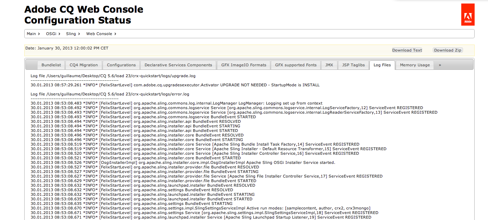
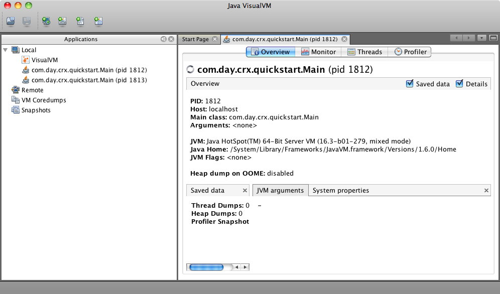

# Monitoraggio e manutenzione dell’istanza AEM{#monitoring-and-maintaining-your-aem-instance}

Dopo la distribuzione delle istanze AEM, saranno necessarie alcune attività per monitorare e mantenere il funzionamento, le prestazioni e l’integrità delle istanze.

Un fattore chiave in questo caso è che per riconoscere potenziali problemi è necessario conoscere l&#39;aspetto e il comportamento dei sistemi in condizioni normali. Il modo migliore per farlo è monitorare il sistema e raccogliere informazioni in un periodo di tempo.

| Seleziona | Considerazioni | Commento/Azioni |
|---|---|---|
| Piano di backup. |  | Scopri come [Eseguire il backup dell&#39;istanza](/help/sites-deploying/monitoring-and-maintaining.md#backups). |
| Piano di ripristino di emergenza. | Le linee guida aziendali sul disaster recovery. |  |
| È disponibile un sistema di tracciamento degli errori per segnalare i problemi. | Ad esempio, [bugzilla](https://www.bugzilla.org/), [jira](https://www.atlassian.com/software/jira/) o uno dei tanti altri. |  |
| I file system vengono monitorati. | L&#39;archivio CRX si &quot;blocca&quot; se lo spazio libero su disco è insufficiente. Lo spazio riprende quando lo spazio diventa disponibile. | I messaggi &quot; `*ERROR* LowDiskSpaceBlocker`&quot; possono essere visualizzati nel file di log quando lo spazio libero diventa basso. |
| [Monitoraggio ](/help/sites-deploying/monitoring-and-maintaining.md#working-with-audit-records-and-log-files) dei file di registro in corso. |  |  |
| Il monitoraggio del sistema viene eseguito (costantemente) in background. | Compresi CPU, memoria, disco e utilizzo della rete. Utilizzando, ad esempio, iostat / vmstat / perfmon. | I dati registrati vengono visualizzati e possono essere utilizzati per tenere traccia dei problemi di prestazioni. Anche i dati non elaborati sono accessibili. |
| [Le prestazioni AEM vengono monitorate](/help/sites-deploying/monitoring-and-maintaining.md#monitoring-performance). | Incluso [Richiedi contatori](/help/sites-deploying/monitoring-and-maintaining.md#request-counters) per monitorare i livelli di traffico. | Se si riscontra una perdita significativa o a lungo termine dei risultati, occorre procedere a un&#39;indagine approfondita. |
| Stai monitorando i [agenti di replica](/help/sites-deploying/monitoring-and-maintaining.md#monitoring-your-replication-agents). |  |  |
| Eliminare regolarmente le istanze del flusso di lavoro. | Dimensione dell’archivio e prestazioni del flusso di lavoro. | Consulta [Rimozione regolare delle istanze del flusso di lavoro](/help/sites-administering/workflows-administering.md#regular-purging-of-workflow-instances). |

## Backup {#backups}

È buona prassi effettuare backup di:

* Installazione del software - prima/dopo modifiche significative nella configurazione
* Il contenuto all’interno dell’archivio - regolarmente

La tua azienda avrà probabilmente una politica di backup che sarà necessario seguire, considerazioni aggiuntive su cosa eseguire il backup e quando includere:

* quanto sono critici il sistema e i dati.
* la frequenza con cui vengono apportate modifiche al software o ai dati.
* volume dei dati; occasionalmente può essere un problema, così come il tempo necessario per eseguire il backup.
* se è possibile eseguire il backup mentre gli utenti sono online; e, se possibile, qual è l&#39;impatto sulle prestazioni.
* la distribuzione geografica degli utilizzatori; Ad esempio, quando è il momento migliore per il backup (per ridurre al minimo l&#39;impatto)?
* la sua politica di ripristino di emergenza; esistono linee guida su dove devono essere archiviati i dati di backup (ad esempio fuori sede, supporto specifico, ecc.).

Spesso il backup completo viene eseguito a intervalli regolari (ad esempio quotidianamente, settimanalmente o mensilmente), con backup incrementali intermedi (ad esempio a cadenza oraria, giornaliera o settimanale).

>[!CAUTION]
>
>Quando si implementano i backup delle istanze di produzione, è necessario eseguire i test *per garantire il corretto ripristino del backup.*
>
>Senza questo, il backup è potenzialmente inutile (scenario peggiore).

>[!NOTE]
>
>Per ulteriori informazioni sulle prestazioni di backup, consulta la sezione [Prestazioni di backup](/help/sites-deploying/configuring-performance.md#backup-performance) .

### Backup dell&#39;installazione software {#backing-up-your-software-installation}

Dopo l&#39;installazione, o modifiche significative nella configurazione, eseguire un backup dell&#39;installazione del software.

A questo scopo, è necessario eseguire il backup dell&#39;intero archivio ](#backing-up-your-repository) e quindi:[

1. AEM.
1. Esegui il backup dell&#39;intero `<cq-installation-dir>` dal file system.

>[!CAUTION]
>
>Se si utilizza un server applicazioni di terze parti, è possibile che altre cartelle si trovino in una posizione diversa e che sia necessario eseguire il backup. Per informazioni sull&#39;installazione dei server applicazioni, vedere [Come installare AEM con un server applicazioni](/help/sites-deploying/application-server-install.md) .

>[!CAUTION]
>
>È supportato il backup incrementale dell’archivio dati del file; quando utilizzi il backup incrementale per altri componenti (come l&#39;indice Lucene), assicurati che anche i file eliminati siano contrassegnati come eliminati nel backup.

>[!NOTE]
>
>Il mirroring del disco può essere utilizzato anche come meccanismo di backup.

### Backup dell&#39;archivio {#backing-up-your-repository}

La sezione [Backup e ripristino](/help/sites-administering/backup-and-restore.md) della documentazione CRX riguarda tutti i problemi relativi ai backup dell&#39;archivio CRX.

Per informazioni dettagliate su come effettuare un backup &quot;a caldo&quot; online, vedere [Creazione di un backup online](/help/sites-administering/backup-and-restore.md#online-backup).

## Rimozione delle versioni {#version-purging}

Lo strumento **Purge Versions** è destinato a eliminare le versioni di un nodo o di una gerarchia di nodi nel tuo archivio. Il suo scopo principale è quello di aiutarti a ridurre le dimensioni dell’archivio rimuovendo le vecchie versioni dei nodi.

Questa sezione tratta le operazioni di manutenzione relative alla funzione di controllo delle versioni di AEM. Lo strumento **Elimina versione** è destinato a eliminare le versioni di un nodo o di una gerarchia di nodi nel tuo archivio. Il suo scopo principale è quello di aiutarti a ridurre le dimensioni dell’archivio rimuovendo le vecchie versioni dei nodi.

### Panoramica {#overview}

Lo strumento **Elimina versioni** è disponibile nella console **[Strumenti](/help/sites-administering/tools-consoles.md)** in **Gestione versioni** o direttamente da:

`https://<server>:<port>/etc/versioning/purge.html`


**Percorso iniziale** Percorso assoluto su cui eseguire l&#39;eliminazione. È possibile selezionare il Percorso iniziale facendo clic sul navigatore della struttura dell&#39;archivio.

**** RicorsivoDurante l’eliminazione dei dati è possibile scegliere se eseguire l’operazione su un nodo o su un’intera gerarchia selezionando Ricorsivo. Nell&#39;ultimo caso il percorso specificato definisce il nodo principale della gerarchia.

**Numero massimo di versioni da** mantenereIl numero massimo di versioni da mantenere per un nodo. Quando questo numero supera questo valore, le versioni meno recenti vengono eliminate.

**Massima** età versioneL&#39;età massima della versione di un nodo. Quando l’età di una versione supera questo valore, viene eliminata.

**Dry** RunPoiché la rimozione di versioni del contenuto è definita e non può essere ripristinata senza il ripristino di un backup, lo strumento Purge Versions fornisce una modalità di esecuzione a secco che consente di visualizzare in anteprima le versioni eliminate. Per avviare una prova del processo di eliminazione, fare clic su Prova.

**** PurgeLaunch l&#39;eliminazione delle versioni sul nodo definito dal Percorso iniziale.

### Rimozione di versioni di un sito Web {#purging-versions-of-a-web-site}

Per eliminare le versioni di un sito Web, procedere come segue:

1. Passa alla **[Strumenti](/help/sites-administering/tools-consoles.md)** **console**, seleziona **Gestione versioni** e fai doppio clic su **Elimina versioni.**
1. Imposta il percorso iniziale del contenuto da eliminare (ad es. `/content/geometrixx-outdoors`).

   * Per eliminare solo il nodo definito dal percorso, deselezionare **Ricorsivo**.
   * Se desideri eliminare il nodo definito dal percorso e dai relativi discendenti, seleziona **Ricorsivo**.

1. Imposta il numero massimo di versioni (per ogni nodo) che desideri mantenere. Lascia vuoto per non utilizzare questa impostazione.

1. Imposta l&#39;età massima della versione in giorni (per ogni nodo) che desideri mantenere. Lascia vuoto per non utilizzare questa impostazione.

1. Fai clic su **Esegui prova** per visualizzare un&#39;anteprima del processo di eliminazione.
1. Fai clic su **Elimina** per avviare il processo.

>[!CAUTION]
>
>I nodi eliminati non possono essere ripristinati senza il ripristino dell&#39;archivio. È necessario prendersi cura della configurazione, quindi si consiglia di eseguire sempre una prova prima di eliminare.

### Analisi della console {#analyzing-the-console}

I processi **Esegui prova** e **Elimina** elencano tutti i nodi che sono stati elaborati. Durante il processo, un nodo può avere uno dei seguenti stati:

* `ignore (not versionnable)`: il nodo non supporta il controllo delle versioni e viene ignorato durante il processo.

* `ignore (no version)`: il nodo non ha alcuna versione e viene ignorato durante il processo.

* `retained`: il nodo non viene eliminato.
* `purged`: il nodo viene eliminato.

Inoltre, la console fornisce utili informazioni sulle versioni:

* `V 1.0`: il numero di versione.
* `V 1.0.1`*: la stella indica che la versione è quella corrente.

* `Thu Mar 15 2012 08:37:32 GMT+0100`: la data della versione.

Nell’esempio seguente:

* Le versioni **[!DNL Shirts]** vengono eliminate perché la loro età di versione è superiore a 2 giorni.
* Le versioni **[!DNL Tonga Fashions!]** vengono eliminate perché il loro numero di versioni è maggiore di 5.


## Utilizzo dei record di controllo e dei file di registro {#working-with-audit-records-and-log-files}

I record e i file di registro di controllo relativi ad Adobe Experience Manager (AEM) si trovano in varie posizioni. Di seguito viene fornita una panoramica di ciò che è possibile trovare.

### Utilizzo dei registri {#working-with-logs}

AEM WCM registra i registri dettagliati. Dopo aver decompresso e avviato Quickstart, puoi trovare i log in:

* `<cq-installation-dir>/crx-quickstart/logs/`

* `<cq-installation-dir>/crx-quickstart/repository/`

#### Rotazione dei file di registro {#log-file-rotation}

La rotazione del file di registro si riferisce al processo che limita la crescita del file creando periodicamente un nuovo file. In AEM, un file di registro denominato `error.log` viene ruotato una volta al giorno in base alle regole specificate:

* Il file `error.log` viene rinominato in base al pattern {original_filename} `.yyyy-MM-dd`. Ad esempio, l’11 luglio 2010, il file di registro corrente viene rinominato `error.log-2010-07-10`, quindi viene creato un nuovo `error.og`.

* I file di log precedenti non vengono eliminati, quindi è tua responsabilità pulire i vecchi file di log periodicamente per limitare l&#39;utilizzo del disco.

>[!NOTE]
>
>Se aggiorni l&#39;installazione AEM, tieni presente che qualsiasi file di registro esistente non più utilizzato da AEM rimarrà sul disco. Puoi rimuoverli senza rischi. Tutte le nuove voci di registro verranno scritte nei nuovi file di registro.

### Ricerca dei file di registro {#finding-the-log-files}

Sul file server in cui è stato installato AEM vengono memorizzati diversi file di registro:

* `<cq-installation-dir>/crx-quickstart/logs`

   * `access.log`
Tutte le richieste di accesso a AEM WCM e all’archivio sono registrate qui.

   * `audit.log`
Le azioni di moderazione sono registrate qui.

   * `error.log`
I messaggi di errore (con diversi livelli di gravità) sono registrati qui.

   * [ `ImageServer-<PortId>-yyyy>-<mm>-<dd>.log`](https://experienceleague.adobe.com/docs/dynamic-media-developer-resources/image-serving-api/image-serving-api/config-admin/server-logging/c-image-server-log.html)
Questo registro viene utilizzato solo se  [!DNL Dynamic Media] è abilitato. Fornisce informazioni statistiche e analitiche utilizzate per analizzare il comportamento del processo interno ImageServer.

   * `request.log`
Ogni richiesta di accesso viene registrata qui insieme alla risposta.

   * [ `s7access-<yyyy>-<mm>-<dd>.log`](https://experienceleague.adobe.com/docs/dynamic-media-developer-resources/image-serving-api/image-serving-api/config-admin/server-logging/c-access-log.html)
Questo registro viene utilizzato solo se  [!DNL Dynamic Media] è abilitato. Il registro s7access registra ogni richiesta effettuata a [!DNL Dynamic Media] attraverso `/is/image` e `/is/content`.

   * `stderr.log`
Contiene i messaggi di errore, generati durante l&#39;avvio, di nuovo con diversi livelli di gravità. Per impostazione predefinita, il livello di registro è impostato su 
`Warning` ( `WARN`)

   * `stdout.log`
Blocca i messaggi di registrazione che indicano gli eventi durante l&#39;avvio.

   * `upgrade.log`
Fornisce un registro di tutte le operazioni di aggiornamento eseguite da 
`com.day.compat.codeupgrade` e  `com.adobe.cq.upgradesexecutor` pacchetti.

* `<cq-installation-dir>/crx-quickstart/repository`

   * `revision.log`
Informazioni sulla registrazione delle revisioni.

>[!NOTE]
>
>I registri ImageServer e s7access non sono inclusi nel pacchetto **Scarica completo **generato dalla pagina **system/console/status-Bundlelist **a. A scopo di supporto, in caso di problemi [!DNL Dynamic Media], aggiungi anche i registri di accesso a ImageServer e s7access quando contatti l’Assistenza clienti.

### Attivazione del livello di registro DEBUG {#activating-the-debug-log-level}

Il livello di registro predefinito ([Configurazione registrazione Sling Apache](/help/sites-deploying/osgi-configuration-settings.md#apacheslingloggingconfiguration)) è Information, quindi i messaggi di debug non vengono registrati.

Per attivare il livello di log di debug per un logger, impostare la proprietà `org.apache.sling.commons.log.level` per eseguire il debug nell&#39;archivio. Ad esempio, su `/libs/sling/config/org.apache.sling.commons.log.LogManager` per configurare il [Global Apache Sling Logging](/help/sites-deploying/osgi-configuration-settings.md#apacheslingloggingconfiguration).

>[!CAUTION]
>
>Non lasciare il registro a livello di log di debug più a lungo del necessario, in quanto genera molte voci di log, consumando quindi risorse.

Una riga nel file di debug solitamente inizia con DEBUG, quindi fornisce il livello di log, l&#39;azione di installazione e il messaggio di log. Esempio:

```shell
DEBUG 3 WebApp Panel: WebApp successfully deployed
```

I livelli di log sono i seguenti:

| 0 | Errore irreversibile | L&#39;azione non è riuscita e non è possibile continuare l&#39;installazione. |
|---|---|---|
| 1 | Errore | L&#39;azione non è riuscita. L&#39;installazione continua, ma una parte di AEM WCM non è stata installata correttamente e non funzionerà. |
| 2 | Avvertenza | L&#39;azione è riuscita ma si sono verificati problemi. AEM WCM potrebbe funzionare correttamente o meno. |
| 3 | Informazioni | L&#39;azione è riuscita. |

### Creare un file di registro personalizzato {#create-a-custom-log-file}

>[!NOTE]
>
>Quando si lavora con Adobe Experience Manager, esistono diversi metodi per gestire le impostazioni di configurazione per tali servizi; per ulteriori dettagli e pratiche consigliate, consulta [Configurazione di OSGi](/help/sites-deploying/configuring-osgi.md) .

In alcune circostanze è possibile creare un file di registro personalizzato con un livello di registro diverso. Puoi eseguire questa operazione nell’archivio:

1. Se non esiste già, crea una nuova cartella di configurazione ( `sling:Folder`) per il progetto `/apps/<project-name>/config`.
1. In `/apps/<project-name>/config`, crea un nodo per la nuova [configurazione del logger di registrazione Apache Sling](/help/sites-deploying/osgi-configuration-settings.md#apacheslingloggingloggerconfigurationfactoryconfiguration):

   * Nome: `org.apache.sling.commons.log.LogManager.factory.config-<identifier>` (in quanto si tratta di un logger)

      Dove `<identifier>` viene sostituito da testo libero che è necessario immettere per identificare l’istanza (non è possibile omettere tali informazioni).

      Esempio, `org.apache.sling.commons.log.LogManager.factory.config-MINE`

   * Tipo: `sling:OsgiConfig`
   >[!NOTE]
   >
   >Sebbene non sia un requisito tecnico, è consigliabile rendere `<identifier>` univoco.

1. Imposta le seguenti proprietà su questo nodo:

   * Nome: `org.apache.sling.commons.log.file`

      Tipo: Stringa

      Valore: specificare il file di registro; ad esempio, `logs/myLogFile.log`

   * Nome: `org.apache.sling.commons.log.names`

      Tipo: String[] (String + Multi)

      Valore: specifica i servizi OSGi per i quali il logger registra i messaggi; ad esempio, tutti gli elementi seguenti:

      * `org.apache.sling`
      * `org.apache.felix`
      * `com.day`
   * Nome: `org.apache.sling.commons.log.level`

      Tipo: Stringa

      Valore: specificare il livello di log richiesto ( `debug`, `info`, `warn` o `error`); ad esempio `debug`

   * Configura gli altri parametri come richiesto:

      * Nome: `org.apache.sling.commons.log.pattern`

         Tipo: `String`

         Valore: specificare il pattern del messaggio di log come richiesto; ad esempio,

         `{0,date,dd.MM.yyyy HH:mm:ss.SSS} *{4}* [{2}] {3} {5}`
   >[!NOTE]
   >
   >`org.apache.sling.commons.log.pattern` supporta fino a sei argomenti.
   >
   >{0} La marca temporale di tipo `java.util.Date`
   >
   >{1} indicatore di registro
   >
   >{2} nome del thread corrente
   >
   >{3} nome del logger
   >
   >{4} livello di registro
   >
   >{5} messaggio di log
   >
   >Se la chiamata di registro include un `Throwable` lo stacktrace viene aggiunto al messaggio.

   >[!CAUTION]
   >
   >org.apache.sling.commons.log.names deve avere un valore.

   >[!NOTE]
   >
   >I percorsi degli autori di log sono relativi alla posizione `crx-quickstart`.
   >
   >Pertanto, un file di registro specificato come:
   >
   >`logs/thelog.log`
   >
   >scrive su:
   >
   >`<cq-installation-dir>/crx-quickstart/logs/thelog.log`.
   >
   >E un file di registro specificato come:
   >
   >`../logs/thelog.log`
   >
   >scrive in una directory:
   >
   >`<cq-installation-dir>/logs/`\
   >(ovvero accanto a `<cq-installation-dir>/crx-quickstart/`)

1. Questo passaggio è necessario solo quando è necessario un nuovo Writer (ad esempio con una configurazione diversa da quella predefinita di Writer).

   >[!CAUTION]
   >
   >È necessaria una nuova configurazione di Registratore solo quando il valore predefinito esistente non è adatto.
   >
   >Se non è configurato alcun writer esplicito, il sistema genererà automaticamente un writer implicito in base al valore predefinito.

   In `/apps/<project-name>/config`, crea un nodo per la nuova [Configurazione di Apache Sling Logging Writer](/help/sites-deploying/osgi-configuration-settings.md#apacheslingloggingwriterconfigurationfactoryconfiguration):

   * Nome: `org.apache.sling.commons.log.LogManager.factory.writer-<identifier>` (in quanto si tratta di un processo di scrittura)

      Come per il logger, `<identifier>` viene sostituito da testo libero che è necessario immettere per identificare l’istanza (non è possibile omettere queste informazioni). Esempio, `org.apache.sling.commons.log.LogManager.factory.writer-MINE`

   * Tipo: `sling:OsgiConfig`
   >[!NOTE]
   >
   >Sebbene non sia un requisito tecnico, è consigliabile rendere `<identifier>` univoco.

   Imposta le seguenti proprietà su questo nodo:

   * Nome: `org.apache.sling.commons.log.file`

      Tipo: `String`

      Valore: specifica il file di registro in modo che corrisponda al file specificato nel logger;

      per questo esempio, `../logs/myLogFile.log`.

   * Configura gli altri parametri come richiesto:

      * Nome: `org.apache.sling.commons.log.file.number`

         Tipo: `Long`

         Valore: specificare il numero di file di registro che si desidera conservare; ad esempio, `5`

      * Nome: `org.apache.sling.commons.log.file.size`

         Tipo: `String`

         Valore: specificare come necessario per controllare la rotazione dei file per dimensione/data; ad esempio, `'.'yyyy-MM-dd`
   >[!NOTE]
   >
   >`org.apache.sling.commons.log.file.size` controlla la rotazione del file di log impostando:
   >
   >* una dimensione massima del file
   >* una pianificazione di ora/data

   >
   >per indicare quando verrà creato un nuovo file (e il file esistente verrà rinominato in base al pattern del nome).
   >
   >* È possibile specificare un limite di dimensione con un numero. Se non viene fornito alcun indicatore di dimensione, questo viene preso come numero di byte, oppure è possibile aggiungere uno degli indicatori di dimensione - `KB`, `MB`, o `GB` (il caso viene ignorato).
   >* È possibile specificare una pianificazione di ora/data come pattern `java.util.SimpleDateFormat`. Definisce il periodo di tempo dopo il quale il file verrà ruotato; anche il suffisso aggiunto al file ruotato (per l&#39;identificazione).

   >
   >Il valore predefinito è &#39;.&#39;aaaa-MM-gg (per la rotazione giornaliera del registro).
   >
   >Ad esempio, a mezzanotte del 20 gennaio 2010 (o quando si verifica per precisione il primo messaggio di log), ../logs/error.log verrà rinominato in ../logs/error.log.2010-01-20. La registrazione per il 21 gennaio verrà trasmessa a (un nuovo e vuoto) ../logs/error.log fino a quando non viene effettuata il rollover al cambio di giorno successivo.
   >
   >| `'.'yyyy-MM` | Rotazione all&#39;inizio di ogni mese |
   >|---|---|
   >| `'.'yyyy-ww` | La rotazione al primo giorno di ogni settimana (dipende dalle impostazioni internazionali). |
   >| `'.'yyyy-MM-dd` | Rotazione a mezzanotte ogni giorno. |
   >| `'.'yyyy-MM-dd-a` | Rotazione a mezzanotte e mezzogiorno di ogni giorno. |
   >| `'.'yyyy-MM-dd-HH` | Rotazione nella parte superiore di ogni ora. |
   >| `'.'yyyy-MM-dd-HH-mm` | Rotazione all&#39;inizio di ogni minuto. |
   >
   >Nota: Quando si specifica un’ora/data:
   > 1. È necessario eseguire l’escape del testo letterale all’interno di una coppia di virgolette singole (&#39; &#39;);
      >
      >     
      per evitare che determinati caratteri vengano interpretati come lettere del pattern.
      >
      >  
   1. Utilizza solo i caratteri consentiti per un nome di file valido in qualsiasi punto dell’opzione .


1. Leggere il nuovo file di log con lo strumento scelto.

   Il file di registro creato da questo esempio sarà `../crx-quickstart/logs/myLogFile.log`.

La console Felix fornisce anche informazioni sul supporto per i log Sling all&#39;indirizzo `../system/console/slinglog`; ad esempio `https://localhost:4502/system/console/slinglog`.

### Ricerca dei record di audit {#finding-the-audit-records}

I record di audit sono tenuti per fornire un registro di chi ha fatto cosa e quando. Vengono generati record di controllo diversi per gli eventi WCM e OSGi AEM.

#### AEM dei record di controllo WCM visualizzati durante l’authoring delle pagine {#aem-wcm-audit-records-shown-when-page-authoring}

1. Apri una pagina.
1. Dalla barra laterale potete selezionare la scheda con l’icona a forma di lucchetto, quindi fare doppio clic su **Registro di controllo...**
1. Viene visualizzata una nuova finestra che mostra l’elenco dei record di controllo per la pagina corrente.

   

1. Fare clic su **OK** per chiudere la finestra.

#### AEM i record di WCM Auditing all’interno dell’archivio {#aem-wcm-auditing-records-within-the-repository}

All’interno della cartella `/var/audit`, i record di controllo vengono conservati in base alla risorsa. È possibile approfondire la ricerca fino a visualizzare i singoli record e le informazioni che contengono.

Queste voci contengono le stesse informazioni visualizzate durante la modifica di una pagina.

#### Record di controllo OSGi dalla console Web {#osgi-audit-records-from-the-web-console}

Gli eventi OSGi generano anche record di controllo che possono essere visti dalla scheda **Stato di configurazione** -> **File di registro** nella AEM console Web:



## Monitoraggio degli agenti di replica {#monitoring-your-replication-agents}

Puoi monitorare le [code di replica](/help/sites-deploying/replication.md) per rilevare quando una coda è inattiva o bloccata, il che potrebbe a sua volta indicare un problema con un&#39;istanza di pubblicazione o con un sistema esterno:

* tutte le code richieste sono abilitate?
* sono ancora richieste code per disabili?
* tutte le code `enabled` devono avere lo stato `idle` o `active` che indica il normale funzionamento; nessuna coda deve essere `blocked`, che è spesso un segno di problemi sul lato ricevitori.

* se le dimensioni della coda aumentano nel tempo, ciò può indicare una coda bloccata.

Per monitorare un agente di replica:

1. Accedi alla scheda **Strumenti** in AEM.
1. Fate clic su **Replica**.
1. Fare doppio clic sul collegamento agli agenti per l’ambiente appropriato (nel riquadro a sinistra o a destra); ad esempio **Agenti su author**.

   La finestra risultante mostra una panoramica di tutti gli agenti di replica per l’ambiente di authoring, inclusi la destinazione e lo stato.

1. Fai clic sul nome dell&#39;agente appropriato (che è un collegamento) per visualizzare informazioni dettagliate su tale agente:

   

   È possibile:

   * Controlla se l&#39;agente è abilitato.
   * Visualizza il target di qualsiasi replica.
   * Controlla se la coda di replica è attualmente attiva (abilitata).
   * Controlla se ci sono elementi nella coda.
   * **** Aggiorna o  **** cancella per aggiornare la visualizzazione delle voci della coda; questo consente di vedere gli elementi entrare e uscire dalla coda.

   * **Visualizza** Logper accedere al registro di eventuali azioni dell’agente di replica.
   * **Testa** la connessione all&#39;istanza target.
   * **Se necessario, forza** ritrasmettere gli elementi della coda.

   >[!CAUTION]
   >
   >Non utilizzare il collegamento &quot;Prova connessione&quot; per la casella in uscita Replicazione inversa in un&#39;istanza di pubblicazione.
   >
   >Se viene eseguito un test di replica per una coda in uscita, tutti gli elementi più vecchi della replica di test verranno rielaborati con ogni replica inversa.
   >
   >Se tali elementi esistono già in una coda, possono essere trovati con la seguente query XPath JCR e devono essere rimossi.
   >
   >`/jcr:root/var/replication/outbox//*[@cq:repActionType='TEST']`

Anche in questo caso è possibile sviluppare una soluzione per rilevare tutti gli agenti di replica (situati sotto `/etc/replication/author` o `/etc/replication/publish`), quindi controllare lo stato dell&#39;agente ( `enabled`, `disabled`) e la coda sottostante ( `active`, `idle`, `blocked`).

## Monitoraggio delle prestazioni {#monitoring-performance}

[Performance ](/help/sites-deploying/configuring-performance.md) Optimization è un processo interattivo che viene messo a fuoco durante lo sviluppo. Dopo la distribuzione viene in genere rivisto dopo intervalli o eventi specifici.

I metodi utilizzati per la raccolta delle informazioni per l&#39;ottimizzazione possono essere utilizzati anche per il monitoraggio continuo.

>[!NOTE]
>
>È inoltre possibile controllare configurazioni specifiche [disponibili per migliorare le prestazioni](/help/sites-deploying/configuring-performance.md#configuring-for-performance).

Di seguito sono elencati i problemi di prestazioni comuni che si verificano, nonché le proposte su come individuarli e contrastarli.

| Area | Sintomi | Per aumentare la capacità... | Per ridurre il volume... |
|---|---|---|---|
| Client | Utilizzo elevato della CPU client. | Installa una CPU client con prestazioni migliori. | Semplifica il layout (HTML). |
|  | Utilizzo ridotto della CPU del server. | Effettua l’aggiornamento a un browser più veloce. | Migliorare la cache lato client. |
|  | Alcuni clienti veloci, un po&#39; lenti. |  |  |
| Server |  |  |  |
| Rete | Utilizzo ridotto della CPU sia sui server che sui client. | Rimuovere i colli di bottiglia della rete. | Migliorare/ottimizzare la configurazione della cache client. |
|  | La navigazione locale sul server è (relativamente) veloce. | Aumento della larghezza di banda della rete. | Riduci il &quot;peso&quot; delle pagine web (ad esempio, meno immagini, HTML ottimizzato). |
| Server web | L&#39;utilizzo della CPU sul server web è elevato. | Cluster dei server web. | Riduci gli hit per pagina (visita). |
|  |  | Utilizzare un load-balancer hardware. |  |
| Applicazione | L&#39;utilizzo della CPU del server è elevato. | Cluster delle istanze AEM. | Cerca ed elimina i log della CPU e della memoria (utilizza la revisione del codice, l&#39;output di temporizzazione, ecc.). |
|  | Consumo elevato di memoria. |  | Migliorare la memorizzazione in cache a tutti i livelli. |
|  | Tempi di risposta ridotti. |  | Ottimizza modelli e componenti (ad esempio struttura, logica). |
| Archivio |  |  |  |
| Cache |  |  |  |

I problemi di prestazioni possono derivare da una serie di cause che non hanno nulla a che fare con il sito web, inclusi rallentamenti temporanei nella velocità di connessione, nel carico della CPU e molto altro.

Può anche avere un impatto su tutti i visitatori, o solo su un sottoinsieme di essi.

Tutte queste informazioni devono essere ottenute, ordinate e analizzate prima di poter ottimizzare le prestazioni generali o risolvere problemi specifici.

* Prima di riscontrare un problema di prestazioni:

   * raccogliere il maggior numero possibile di informazioni per acquisire una buona conoscenza operativa del sistema in circostanze normali

* Quando si verifica un problema di prestazioni:

   * prova a replicarlo con uno (o preferibilmente più) browser web standard, su un client diverso che sai avere buone prestazioni generali e/o sul server stesso (se possibile)
   * controlla se qualcosa (correlato al sistema) è cambiato entro uno spazio di tempo appropriato e se una di queste modifiche potrebbe avere influenzato le prestazioni
   * poni domande quali:

      * il problema si verifica solo in momenti specifici?
      * il problema si verifica solo su pagine specifiche?
      * sono interessate altre richieste?
   * raccogliere il maggior numero possibile di informazioni da confrontare con la vostra conoscenza del sistema in circostanze normali:


### Strumenti per il monitoraggio e l’analisi delle prestazioni {#tools-for-monitoring-and-analyzing-performance}

Di seguito viene fornita una breve panoramica di alcuni degli strumenti disponibili per il monitoraggio e l’analisi delle prestazioni.

Alcune dipenderanno dal sistema operativo in uso.

<table>
 <tbody>
  <tr>
   <td>Strumento</td>
   <td>Utilizzato per analizzare...</td>
   <td>Utilizzo / Ulteriori informazioni..</td>
  </tr>
  <tr>
   <td>request.log</td>
   <td>Tempi di risposta e concorrenza.</td>
   <td><a href="#interpreting-the-request-log">Interpretazione del request.log</a>.</td>
  </tr>
  <tr>
   <td>tronco/tratto</td>
   <td>Caricamento pagina</td>
   <td><p>Comandi Unix/Linux per tracciare chiamate di sistema e segnali. Aumenta il livello del registro a <code>INFO</code>.</p> <p>Analizza il numero di caricamenti di pagina per richiesta, quali pagine, ecc.</p> </td>
  </tr>
  <tr>
   <td>Immagini di thread</td>
   <td>Osserva i thread JVM. Identificare le contese, le serrature e i corridori lunghi.</td>
   <td><p>Dipendente dal sistema operativo:<br /> - Unix/Linux: <code>kill -QUIT &lt;<em>pid</em>&gt;</code><br /> - Windows (modalità console): Ctrl-Pausa<br /> </p> <p>Sono disponibili anche strumenti di analisi, ad esempio <a href="https://java.net/projects/tda/">TDA</a>.<br /> </p> </td>
  </tr>
  <tr>
   <td>Dump heap</td>
   <td>Problemi di memoria esauriti che causano prestazioni lente.</td>
   <td><p>Aggiungi l'opzione:<br /> <code>-XX:+HeapDumpOnOutOfMemoryError</code><br /> alla chiamata java a AEM.</p> <p>Consulta la <a href="https://java.sun.com/javase/6/webnotes/trouble/TSG-VM/html/clopts.html#gbzrr">Guida alla risoluzione dei problemi per Java SE 6 con HotSpot VM</a>.</p> </td>
  </tr>
  <tr>
   <td>Chiamate di sistema</td>
   <td>Identifica i problemi di temporizzazione.</td>
   <td><p>Le chiamate a <code>System.currentTimeMillis()</code> o <code>com.day.util</code>.Timing vengono utilizzate per generare marche temporali dal codice o tramite <a href="#html-comments">HTML-comments</a>.</p> <p><strong>Nota:</strong> queste devono essere implementate in modo che possano essere attivate o disattivate come necessario; quando un sistema funziona senza problemi, il sovraccarico della raccolta delle statistiche non sarà necessario.</p> </td>
  </tr>
  <tr>
   <td>Banco Apache</td>
   <td>Identifica le perdite di memoria, analizza in modo selettivo il tempo di risposta.</td>
   <td><p>utilizzo di base:</p> <p><code>ab -k -n &lt;<em>requests</em>&gt; -c &lt;<em>concurrency</em>&gt; &lt;<em>url</em>&gt;</code></p> <p>Per informazioni dettagliate, consulta <a href="#apache-bench">Apache Bench</a> e la <a href="https://httpd.apache.org/docs/2.2/programs/ab.html">ab man page</a> .</p> </td>
  </tr>
  <tr>
   <td>Analisi della ricerca</td>
   <td> </td>
   <td>Esegui le query di ricerca offline, identifica il tempo di risposta della query, verifica e conferma il set di risultati.<br /> </td>
  </tr>
  <tr>
   <td>JMeter</td>
   <td>Prove di carico e di funzionamento.</td>
   <td><a href="https://jakarta.apache.org/jmeter/">https://jakarta.apache.org/jmeter/</a></td>
  </tr>
  <tr>
   <td>JProfiler</td>
   <td>Profondità della CPU e del profiling della memoria.</td>
   <td><a href="https://www.ej-technologies.com/">https://www.ej-technologies.com/</a></td>
  </tr>
  <tr>
   <td>JConsole</td>
   <td>Osserva le metriche e i thread JVM.</td>
   <td><p>Utilizzo: jconsole</p> <p>Consulta <a href="https://java.sun.com/developer/technicalArticles/J2SE/jconsole.html">jconsole</a> e <a href="#monitoring-performance-using-jconsole">Monitoraggio delle prestazioni con JConsole</a>.</p> <p><strong>Nota:</strong> con JDK 1.6, JConsole è estensibile con i plug-in; ad esempio, Top o TDA (Thread Dump Analyzer).</p> </td>
  </tr>
  <tr>
   <td>Java VisualVM</td>
   <td>Osserva le metriche, i thread, la memoria e il profiling di JVM.</td>
   <td><p>Utilizzo: jvisualvm o visualvm<br /> </p> <p>Vedere <a href="https://java.sun.com/javase/6/docs/technotes/tools/share/jvisualvm.html">jvisualvm</a>, <a href="https://visualvm.dev.java.net/">visualvm</a> e <a href="#monitoring-performance-using-j-visualvm">Monitoraggio delle prestazioni utilizzando (J)VisualVM</a>.</p> <p><strong>Nota:</strong> con JDK 1.6, VisualVM è estensibile con i plug-in.</p> </td>
  </tr>
  <tr>
   <td>truss/strass, lsof</td>
   <td>Analisi approfondita del processo e della chiamata del kernel (Unix).</td>
   <td>Comandi Unix/Linux.</td>
  </tr>
  <tr>
   <td>Statistiche di temporizzazione</td>
   <td>Vedi le statistiche di temporizzazione per il rendering della pagina.</td>
   <td><p>Per visualizzare le statistiche sui tempi per il rendering della pagina è possibile utilizzare <strong>Ctrl-Maiusc-U</strong> insieme a <code>?debugClientLibs=true</code> impostato nell’URL.</p> </td>
  </tr>
  <tr>
   <td>Strumento di profilazione della CPU e della memoria<br /> </td>
   <td><a href="#interpreting-the-request-log">Utilizzato durante l’analisi delle richieste lente durante lo sviluppo</a>.</td>
   <td>Ad esempio, <a href="https://www.yourkit.com/">YourKit</a>.</td>
  </tr>
  <tr>
   <td><a href="#information-collection">Raccolta informazioni</a></td>
   <td>Lo stato in corso dell'installazione.</td>
   <td>Conoscere il più possibile l'installazione può anche aiutarti a tracciare cosa potrebbe aver causato un cambiamento delle prestazioni e se queste modifiche sono giustificate. Queste metriche devono essere raccolte a intervalli regolari per poter vedere facilmente cambiamenti significativi.</td>
  </tr>
 </tbody>
</table>

### Interpretazione del request.log {#interpreting-the-request-log}

Questo file registra informazioni di base su ogni richiesta effettuata a AEM. Da queste preziose conclusioni si possono trarre.

Il `request.log` offre un modo integrato per vedere quanto tempo richiedono le richieste. A scopo di sviluppo è utile per `tail -f` il `request.log` e guardare per tempi di risposta lenti. Per analizzare un `request.log` più grande, si consiglia l’ [uso di `rlog.jar` che consente di ordinare e filtrare i tempi di risposta](#using-rlog-jar-to-find-requests-with-long-duration-times).

Consigliamo di isolare le pagine &quot;lente&quot; dal `request.log`, quindi di ottimizzarle singolarmente per ottenere prestazioni migliori. In genere questo viene fatto includendo le metriche delle prestazioni per componente o utilizzando uno strumento di profilazione delle prestazioni come ` [yourkit](https://www.yourkit.com/)`.

#### Monitoraggio del traffico sul sito web {#monitoring-traffic-on-your-website}

Il registro delle richieste registra ogni richiesta effettuata, unitamente alla risposta effettuata:

```xml
09:43:41 [66] -> GET /author/y.html HTTP/1.1
09:43:41 [66] <- 200 text/html 797ms
```

Sommando tutte le voci del GET in un determinato periodo (ad esempio per diversi periodi di 24 ore) è possibile fare dichiarazioni sul traffico medio del sito web.

#### Monitoraggio dei tempi di risposta con request.log {#monitoring-response-times-with-the-request-log}

Un buon punto di partenza per l’analisi delle prestazioni è il registro delle richieste:

`<cq-installation-dir>/crx-quickstart/logs/request.log`

Il log si presenta come segue (le linee sono abbreviate per semplicità):

```xml
31/Mar/2009:11:32:57 +0200 [379] -> GET /path/x HTTP/1.1
31/Mar/2009:11:32:57 +0200 [379] <- 200 text/html 33ms
31/Mar/2009:11:33:17 +0200 [380] -> GET /path/y HTTP/1.1
31/Mar/2009:11:33:17 +0200 [380] <- 200 application/json 39ms
```

Questo registro ha una riga per richiesta o risposta:

* Data in cui è stata effettuata ogni richiesta o risposta.
* Numero della richiesta, tra parentesi quadre. Questo numero corrisponde alla richiesta e alla risposta.
* Una freccia che indica se si tratta di una richiesta (freccia rivolta verso destra) o di una risposta (freccia verso sinistra).
* Per le richieste, la riga contiene:

   * il metodo (in genere, GET, HEAD o POST)
   * la pagina richiesta
   * il protocollo

* Per le risposte, la riga contiene:

   * il codice di stato (200 significa &quot;successo&quot;, 404 significa &quot;pagina non trovata&quot;
   * il tipo MIME
   * il tempo di risposta

Utilizzando script di piccole dimensioni, è possibile estrarre le informazioni richieste dal file di registro e assemblare le statistiche desiderate. Da queste, puoi vedere quali pagine o tipi di pagine sono lenti e se le prestazioni complessive sono soddisfacenti.

#### Monitoraggio dei tempi di risposta della ricerca con request.log {#monitoring-search-response-times-with-the-request-log}

Le richieste di ricerca sono anche registrate nel file di registro:

```xml
31/Mar/2009:11:35:34 +0200 [338] -> GET /author/playground/en/tools/search.html?query=dilbert&size=5&dispenc=utf-8 HTTP/1.1
31/Mar/2009:11:35:34 +0200 [338] <- 200 text/html 1562ms
```

Quindi, come sopra, puoi usare gli script per estrarre le informazioni rilevanti e generare statistiche.

Tuttavia, una volta determinato il tempo di risposta, potrebbe essere necessario analizzare il motivo per cui la richiesta prende il tempo e cosa può essere fatto per migliorare la risposta.

#### Monitoraggio del numero e dell’impatto degli utenti simultanei {#monitoring-the-number-and-impact-of-concurrent-users}

Anche in questo caso, il `request.log` può essere utilizzato per monitorare la concorrenza e la reazione del sistema.

È necessario eseguire dei test per determinare quanti utenti simultanei il sistema può gestire prima di vedere un impatto negativo. Anche in questo caso gli script possono essere utilizzati per estrarre i risultati dal file di log:

* monitorare quante richieste vengono effettuate entro un intervallo di tempo specifico, ad esempio un minuto
* verificare gli effetti di un numero specifico di utenti che presentano contemporaneamente le stesse richieste (il più vicino possibile); Ad esempio, 30 utenti che hanno fatto clic su **Salva** contemporaneamente.

```xml
31/Mar/2009:11:45:29 +0200 [333] -> GET /author/libs/Personalize/content/statics.close.gif HTTP/1.1
31/Mar/2009:11:45:29 +0200 [334] -> GET /author/libs/Personalize/content/statics.detach.gif HTTP/1.1
31/Mar/2009:11:45:30 +0200 [335] -> GET /author/libs/CFC/content/imgs/logo.rZMNURccynWcTpCxyuBNiTCoiBMmw000.default.gif HTTP/1.1
31/Mar/2009:11:45:32 +0200 [335] <- 304 text/html 0ms
31/Mar/2009:11:45:33 +0200 [334] <- 200 image/gif 31ms
31/Mar/2009:11:45:38 +0200 [333] <- 200 image/gif 31ms
31/Mar/2009:11:45:42 +0200 [336] -> GET /author/libs/CFC/content/imgs/logo.rZMNURccynWcTZRXunQbbQtvuuCMbRRBuWXz0000.default.gif HTTP/1.1
31/Mar/2009:11:45:43 +0200 [337] -> GET /author/titlebar_bg.gif HTTP/1.1
31/Mar/2009:11:45:43 +0200 [336] <- 304 text/html 0ms
31/Mar/2009:11:45:44 +0200 [337] <- 304 text/html 0ms
```

### Utilizzo di rlog.jar per trovare le richieste con tempi lunghi {#using-rlog-jar-to-find-requests-with-long-duration-times}

AEM include vari strumenti di supporto in:
`<cq-installation-dir>/crx-quickstart/opt/helpers`

Uno di questi, `rlog.jar`, può essere utilizzato per ordinare rapidamente `request.log` in modo che le richieste vengano visualizzate per durata, dal tempo più lungo al più breve.

Il comando seguente mostra gli argomenti possibili:

```shell
$java -jar rlog.jar
Request Log Analyzer Version 21584 Copyright 2005 Day Management AG
Usage:
  java -jar rlog.jar [options] <filename>
Options:
  -h               Prints this usage.
  -n <maxResults>  Limits output to <maxResults> lines.
  -m <maxRequests> Limits input to <maxRequest> requests.
  -xdev            Exclude POST request to CRXDE.
```

Ad esempio, puoi eseguirlo specificando il file `request.log` come parametro e mostrare le 10 prime richieste con la durata più lunga:

```shell
$ java -jar ../opt/helpers/rlog.jar -n 10 request.log
*Info * Parsed 464 requests.
*Info * Time for parsing: 22ms
*Info * Time for sorting: 2ms
*Info * Total Memory: 1mb
*Info * Free Memory: 1mb
*Info * Used Memory: 0mb
------------------------------------------------------
     18051ms 31/Mar/2009:11:15:34 +0200 200 GET /content/geometrixx/en/company.html text/ html
      2198ms 31/Mar/2009:11:15:20 +0200 200 GET /libs/cq/widgets.js application/x-javascript
      1981ms 31/Mar/2009:11:15:11 +0200 200 GET /libs/wcm/content/welcome.html text/html
      1973ms 31/Mar/2009:11:15:52 +0200 200 GET /content/campaigns/geometrixx.teasers..html text/html
      1883ms 31/Mar/2009:11:15:20 +0200 200 GET /libs/security/cq-security.js application/x-javascript
      1876ms 31/Mar/2009:11:15:20 +0200 200 GET /libs/tagging/widgets.js application/x-javascript
      1869ms 31/Mar/2009:11:15:20 +0200 200 GET /libs/tagging/widgets/themes/default.js application/x-javascript
      1729ms 30/Mar/2009:16:45:56 +0200 200 GET /libs/wcm/content/welcome.html text/html; charset=utf-8
      1510ms 31/Mar/2009:11:15:34 +0200 200 GET /bin/wcm/contentfinder/asset/view.json/ content/dam?_dc=1238490934657&query=&mimeType=image&_charset_=utf-8 application/json
      1462ms 30/Mar/2009:17:23:08 +0200 200 GET /libs/wcm/content/welcome.html text/html; charset=utf-8
```

Potrebbe essere necessario concatenare i singoli file `request.log` se è necessario eseguire questa operazione su un esempio di dati di grandi dimensioni.

### Banco Apache {#apache-bench}

Per ridurre al minimo l’impatto dei casi speciali (come la raccolta di rifiuti, ecc.), si consiglia di utilizzare uno strumento come `apachebench` (vedi ad esempio [ab](https://httpd.apache.org/docs/2.2/programs/ab.html) per ulteriori informazioni) per identificare le perdite di memoria e analizzare in modo selettivo il tempo di risposta.

Apache Bench può essere utilizzato nel modo seguente:

```shell
$ ab -c 5 -k -n 1000 "https://localhost:4503/content/geometrixx/en/company.html"
This is ApacheBench, Version 2.3 <$Revision: 655654 $>
Copyright 1996 Adam Twiss, Zeus Technology Ltd, https://www.zeustech.net/
Licensed to The Apache Software Foundation, https://www.apache.org/

Benchmarking localhost (be patient)
Completed 100 requests
Completed 200 requests
Completed 300 requests
Completed 400 requests
Completed 500 requests
Completed 600 requests
Completed 700 requests
Completed 800 requests
Completed 900 requests
Completed 1000 requests
Finished 1000 requests

Server Software: Day-Servlet-Engine/4.1.52
Server Hostname: localhost
Server Port: 4503

Document Path: /content/geometrixx/en/company.html
Document Length: 24127 bytes

Concurrency Level: 5
Time taken for tests: 69.766 seconds
Complete requests: 1000
Failed requests: 998
(Connect: 0, Receive: 0, Length: 998, Exceptions: 0)
Write errors: 0
Keep-Alive requests: 0
Total transferred: 24160923 bytes
HTML transferred: 24010923 bytes
Requests per second: 14.33 /sec (mean)
Time per request: 348.828 [ms] (mean)
Time per request: 69.766 [ms] (mean, across all concurrent requests)
Transfer rate: 338.20 [Kbytes/sec] received

Connection Times (ms)
min mean[+/-sd] median max
Connect: 0 1 3.9 0 58
Processing: 138 347 568.5 282 8106
Waiting: 137 344 568.1 281 8106
Total: 139 348 568.4 283 8106

Percentage of the requests served within a certain time (ms)
50% 283
66% 323
75% 356
80% 374
90% 439
95% 512
98% 1047
99% 1132
100% 8106 (longest request)
```

I numeri riportati sopra sono tratti da un laptop standard MAcBook Pro (metà 2010) che accede alla pagina aziendale geometrixx, come incluso in un&#39;installazione AEM predefinita. La pagina è molto semplice, ma non ottimizzata per le prestazioni.

`apachebench` visualizza anche il tempo per richiesta come media, in tutte le richieste simultanee; vedi  `Time per request: 54.595 [ms]` (media, in tutte le richieste simultanee). È possibile modificare il valore del parametro di concorrenza `-c` (numero di richieste multiple da eseguire alla volta) per visualizzare eventuali effetti.

### Contatori richieste {#request-counters}

Informazioni sul traffico della richiesta (numero di richieste durante un periodo di tempo specifico) forniscono un’indicazione del carico sull’istanza. Queste informazioni possono essere estratte da [request.log](#interpreting-the-request-log), anche se l&#39;uso di contatori automatizza la raccolta dati per consentirti di vedere:

* differenze significative nell’attività (ossia distinguere tra &quot;molte richieste&quot; e &quot;scarsa attività&quot;)
* quando un&#39;istanza non viene utilizzata
* eventuali riavvii (i contatori vengono reimpostati su 0)

Per automatizzare la raccolta di informazioni è inoltre possibile installare RequestFilter per incrementare un contatore per ogni richiesta. È possibile utilizzare più contatori per diversi periodi di tempo.

Le informazioni raccolte possono essere utilizzate per indicare:

* cambiamenti significativi nell&#39;attività
* un&#39;istanza ridondante
* eventuali riavvii (reimpostazione del contatore su 0)

### Commenti HTML {#html-comments}

È consigliabile che ogni progetto includa `html comments` per le prestazioni del server. Si possono trovare molti buoni esempi pubblici; seleziona una pagina, apri l’origine della pagina per la visualizzazione e scorri verso il basso, facendo clic sul codice seguente:

```xml
</body>
 </html>
        <!--
        Page took 58 milliseconds to be rendered by server
         -->
```

### Monitoraggio delle prestazioni tramite JConsole {#monitoring-performance-using-jconsole}

Il comando dello strumento `jconsole` è disponibile con JDK.

1. Avvia la tua istanza AEM.
1. Esegui `jconsole.`
1. Seleziona l&#39;istanza AEM e **Connetti**.

1. Dall&#39;interno dell&#39;applicazione `Local`, fai doppio clic su `com.day.crx.quickstart.Main`; la Panoramica verrà visualizzata come predefinita:

   

   Dopo questo è possibile selezionare altre opzioni.

### Monitoraggio delle prestazioni utilizzando (J)VisualVM {#monitoring-performance-using-j-visualvm}

A partire da JDK 1.6, il comando dello strumento `jvisualvm` è disponibile. Dopo aver installato JDK 1.6 è possibile:

1. Avvia la tua istanza AEM.

   >[!NOTE]
   >
   >Se utilizzi Java 5 puoi aggiungere l’argomento `-Dcom.sun.management.jmxremote` alla riga di comando java che avvia la tua JVM. JMX è abilitato per impostazione predefinita con Java 6.

1. Esegui:

   * `jvisualvm`: nella cartella JDK 1.6 bin (versione testata)
   * `visualvm`: può essere scaricato da  [VisualVM](https://visualvm.dev.java.net/)  (versione perimetrale antirumore)

1. Dall&#39;interno dell&#39;applicazione `Local`, fai doppio clic su `com.day.crx.quickstart.Main`; la Panoramica verrà visualizzata come predefinita:

   

   Dopo di questo, puoi selezionare altre opzioni, tra cui Monitor:

   

Puoi usare questo strumento per generare immagini di thread e immagini di testina di memoria. Queste informazioni sono spesso richieste dal team di assistenza tecnica.

### Raccolta informazioni {#information-collection}

Conoscere il più possibile l&#39;installazione può aiutarti a tracciare cosa potrebbe aver causato un cambiamento delle prestazioni e se queste modifiche sono giustificate. Queste metriche devono essere raccolte a intervalli regolari per poter vedere facilmente cambiamenti significativi.

Le seguenti informazioni possono essere utili:

* [Quanti autori lavorano con il sistema?](#how-many-authors-are-working-with-the-system)
* [Qual è il numero medio di attivazioni di pagina al giorno?](#what-is-the-average-number-of-page-activations-per-day)
* [Quante pagine si gestiscono attualmente in questo sistema?](#how-many-pages-do-you-currently-maintain-on-this-system)
* [Se utilizzi MSM, qual è il numero medio di rollout al mese?](#if-you-use-msm-what-is-the-average-number-of-rollouts-per-month)
* [Qual è il numero medio di Live Copy al mese?](#what-is-the-average-number-of-live-copies-per-month)
* [Se utilizzi AEM Assets, quante risorse gestisci attualmente in Assets?](#ifyouusecqdamhowmanyassetsdoyoucurrentlymaintainincqdam)
* [Qual è la dimensione media delle risorse?](#what-is-the-average-size-of-the-assets)
* [Quanti modelli sono attualmente utilizzati?](#how-many-templates-are-currently-used)
* [Quanti componenti sono attualmente utilizzati?](#how-many-components-are-currently-used)
* [Quante richieste all&#39;ora hai sul sistema di authoring in fase di picco?](#how-many-requests-per-hour-do-you-have-on-the-author-system-at-peak-time)
* [Quante richieste all&#39;ora sul sistema di pubblicazione in fase di picco?](#how-many-requests-per-hour-do-you-have-on-the-publish-system-at-peak-time)

#### Quanti autori lavorano con il sistema? {#how-many-authors-are-working-with-the-system}

Per visualizzare il numero di autori che hanno utilizzato il sistema dopo l’installazione, utilizza la riga di comando:

```shell
cd <cq-installation-dir>/crx-quickstart/logs
cut -d " " -f 3 access.log | sort -u | wc -l
```

Per visualizzare il numero di autori che lavorano a una data specifica:

```shell
grep "<date>" access.log | cut -d " " -f 3 | sort -u | wc -l
```

#### Qual è il numero medio di attivazioni di pagina al giorno? {#what-is-the-average-number-of-page-activations-per-day}

Per visualizzare il numero totale di attivazioni di pagina dall&#39;installazione del server utilizzando una query del repository; via CRXDE - Strumenti - Query:

* **Tipo** `XPath`

* **Percorso** `/`

* **Query** `//element(*, cq:AuditEvent)[@cq:type='Activate']`

Calcolare quindi il numero di giorni trascorsi dall&#39;installazione per calcolare la media.

#### Quante pagine si gestiscono attualmente in questo sistema? {#how-many-pages-do-you-currently-maintain-on-this-system}

Per visualizzare il numero di pagine attualmente presenti sul server, utilizzare una query del repository; via CRXDE - Strumenti - Query:

* **Tipo** `XPath`

* **Percorso** `/`

* **Query** `//element(*, cq:Page)`

#### Se utilizzi MSM, qual è il numero medio di rollout al mese? {#if-you-use-msm-what-is-the-average-number-of-rollouts-per-month}

Per determinare il numero totale di rollout dall&#39;installazione utilizzando una query del repository; via CRXDE - Strumenti - Query:

* **Tipo** `XPath`

* **Percorso** `/`

* **Query** `//element(*, cq:AuditEvent)[@cq:type='PageRolledOut']`

Calcolare il numero di mesi trascorsi dall&#39;installazione per calcolare la media.

#### Qual è il numero medio di Live Copy al mese? {#what-is-the-average-number-of-live-copies-per-month}

Per determinare il numero totale di Live Copy effettuate dall’installazione utilizzando una query dell’archivio; via CRXDE - Strumenti - Query:

* **Tipo** `XPath`

* **Percorso** `/`

* **Query** `//element(*, cq:LiveSyncConfig)`

Utilizzare nuovamente il numero di mesi trascorsi dall&#39;installazione per calcolare la media.

#### Se utilizzi AEM Assets, quante risorse gestisci attualmente in Assets? {#if-you-use-aem-assets-how-many-assets-do-you-currently-maintain-in-assets}

Per vedere quante risorse DAM si gestiscono attualmente, utilizza una query dell’archivio; via CRXDE - Strumenti - Query:

* **Tipo** `XPath`
* **Percorso** `/`
* **Query** `/jcr:root/content/dam//element(*, dam:Asset)`

#### Qual è la dimensione media delle risorse? {#what-is-the-average-size-of-the-assets}

Per determinare la dimensione totale della cartella `/var/dam`:

1. Utilizzare WebDAV per mappare l&#39;archivio sul file system locale.

1. Utilizzare la riga di comando:

   ```shell
   cd /Volumes/localhost/var
   du -sh dam/
   ```

   Per ottenere la dimensione media, dividi la dimensione globale per il numero totale di risorse in `/var/dam` (ottenuto sopra).

#### Quanti modelli sono attualmente utilizzati? {#how-many-templates-are-currently-used}

Per visualizzare il numero di modelli attualmente sul server utilizzare una query del repository; via CRXDE - Strumenti - Query:

* **Tipo** `XPath`
* **Percorso** `/`
* **Query** `//element(*, cq:Template)`

#### Quanti componenti sono attualmente utilizzati? {#how-many-components-are-currently-used}

Per visualizzare il numero di componenti attualmente presenti sul server, utilizzare una query del repository; via CRXDE - Strumenti - Query:

* **Tipo** `XPath`
* **Percorso** `/`
* **Query** `//element(*, cq:Component)`

#### Quante richieste all&#39;ora hai sul sistema di authoring in fase di picco? {#how-many-requests-per-hour-do-you-have-on-the-author-system-at-peak-time}

Per determinare le richieste all’ora sul sistema di authoring in fase di picco:

1. Per determinare il numero totale di richieste dall&#39;installazione, utilizzare la riga di comando:

   ```shell
   cd <cq-installation-dir>/crx-quickstart/logs
   grep -R "\->" request.log | wc -l
   ```

1. Per determinare le date di inizio e di fine:

   ```shell
   vim request.log
   G / 1G: for the last/first lines
   ```

   Utilizzare questi valori per calcolare il numero di ore trascorse dall&#39;installazione, quindi il numero medio di richieste all&#39;ora.

#### Quante richieste all&#39;ora sul sistema di pubblicazione in fase di picco? {#how-many-requests-per-hour-do-you-have-on-the-publish-system-at-peak-time}

Ripeti la procedura descritta sopra sull’istanza di pubblicazione.

## Analisi di scenari specifici {#analyzing-specific-scenarios}

Di seguito è riportato un elenco di suggerimenti su come verificare se si iniziano a riscontrare alcuni problemi di prestazioni. L&#39;elenco non è (purtroppo) del tutto completo.

>[!NOTE]
>
>Per ulteriori informazioni, consulta anche i seguenti articoli:
>
>* [Immagini di thread](https://helpx.adobe.com/experience-manager/kb/TakeThreadDump.html)
>* [Analizzare i problemi di memoria](https://helpx.adobe.com/experience-manager/kb/AnalyzeMemoryProblems.html)
>* [Analisi tramite profiler incorporato](https://helpx.adobe.com/experience-manager/kb/AnalyzeUsingBuiltInProfiler.html)
>* [Analizzare i processi lenti e bloccati](https://helpx.adobe.com/experience-manager/kb/AnalyzeSlowAndBlockedProcesses.html)

>


### CPU al 100% {#cpu-at}

Se la CPU del sistema è costantemente in esecuzione al 100%, vedi:

* La Knowledge Base:

   * [Analizzare i processi lenti e bloccati](https://helpx.adobe.com/experience-manager/kb/AnalyzeSlowAndBlockedProcesses.html)

### Memoria esaurita {#out-of-memory}

Anche se tali errori devono essere rilevati durante lo sviluppo e i test, alcuni scenari possono scivolare nel vuoto.

Se la memoria del sistema è esaurita, questo può essere visualizzato in vari modi, tra cui degradazione delle prestazioni e messaggi di errore, tra cui il sottotesto:

`java.lang.OutOfMemoryError`

In questi casi controlla:

* Impostazioni JVM utilizzate per [avviare AEM](/help/sites-deploying/deploy.md#getting-started)
* La Knowledge Base:

   * [Analisi dei problemi di memoria](https://helpx.adobe.com/experience-manager/kb/AnalyzeMemoryProblems.html)

### I/O disco {#disk-i-o}

Se il sistema è a corto di spazio su disco o se noti che il disco sta battendo all&#39;inizio vedi:

* Se la raccolta delle informazioni di debug è stata disabilitata; può essere configurato in varie posizioni, tra cui:

   * [Apache Sling JSP Script Handler](/help/sites-deploying/osgi-configuration-settings.md#apacheslingjspscripthandler)
   * [Apache Sling Java Script Handler](/help/sites-deploying/osgi-configuration-settings.md#apacheslingjavascripthandler)
   * [Configurazione della registrazione Apache Sling](/help/sites-deploying/osgi-configuration-settings.md#apacheslingloggingconfiguration)
   * [Gestione libreria HTML CQ](/help/sites-deploying/osgi-configuration-settings.md#daycqhtmllibrarymanager)
   * [Filtro di debug CQ WCM](/help/sites-deploying/osgi-configuration-settings.md#daycqwcmdebugfilter)
   * [Loggers](/help/sites-deploying/monitoring-and-maintaining.md#activating-the-debug-log-level)

* Se e come hai configurato [Version Purging](/help/sites-deploying/version-purging.md)
* La Knowledge Base:

   * [Troppi file aperti](https://helpx.adobe.com/experience-manager/kb/TooManyOpenFiles.html)
   * [Journal consuma troppo spazio su disco](https://helpx.adobe.com/experience-manager/kb/JournalTooMuchDiskSpace.html)

### Degradazione regolare delle prestazioni {#regular-performance-degradation}

Se si verifica un deterioramento delle prestazioni dell&#39;istanza dopo ogni riavvio (a volte una settimana o più tardi), è possibile controllare quanto segue:

* [Memoria esaurita](#outofmemory)
* La Knowledge Base:

   * [Sessioni non chiuse](https://helpx.adobe.com/experience-manager/kb/AnalyzeUnclosedSessions.html)

### Ottimizzazione JVM {#jvm-tuning}

Java Virtual Machine (JVM) è notevolmente migliorata per quanto riguarda la messa a punto (soprattutto da Java 7). Per questo motivo, spesso è opportuno specificare una dimensione JVM fissa ragionevole e utilizzare i valori predefiniti.

Se le impostazioni predefinite non sono adatte, è importante stabilire un metodo per monitorare e valutare le prestazioni GC prima di tentare di regolare la JVM; questo può includere fattori di monitoraggio, tra cui le dimensioni dell&#39;heap, l&#39;algoritmo e altri aspetti.

Alcune scelte comuni sono:

* VerboseGC:

   ```
   -verbose:gc \
    -Xloggc:$LOGS/verbosegc.log \
    -XX:+PrintGCDetails \
    -XX:+PrintGCDateStamps
   ```

Il registro risultante può essere acquisito da un visualizzatore GC, ad esempio:

` [https://www.ibm.com/developerworks/library/j-ibmtools2/](https://www.ibm.com/developerworks/library/j-ibmtools2/)`

Oppure JConsole:

* Queste impostazioni sono per una connessione JMX &quot;wide open&quot;:

   ```
   -Dcom.sun.management.jmxremote \
    -Dcom.sun.management.jmxremote.port=8889 \
    -Dcom.sun.management.jmxremote.authenticate=false \
    -Dcom.sun.management.jmxremote.ssl=false
   ```

* Quindi collegarsi alla JVM con la JConsole; vedi:
   ` [https://docs.oracle.com/javase/6/docs/technotes/guides/management/jconsole.html](https://docs.oracle.com/javase/6/docs/technotes/guides/management/jconsole.html)`

Questo ti aiuterà a vedere quanta memoria viene utilizzata, quali algoritmi GC vengono utilizzati, quanto tempo ci vuole per l&#39;esecuzione e quale effetto ha sulle prestazioni dell&#39;applicazione. Senza questo, sintonizzarsi è solo &quot;manopole casuali di aggancio&quot;.

>[!NOTE]
>
>Per la VM di Oracle sono disponibili anche le informazioni all&#39;indirizzo:
>
>[https://docs.oracle.com/javase/7/docs/technotes/guides/vm/server-class.html](https://docs.oracle.com/javase/7/docs/technotes/guides/vm/server-class.html)
