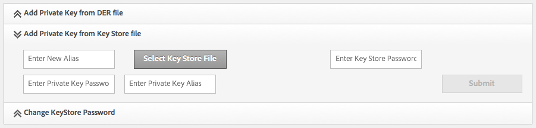
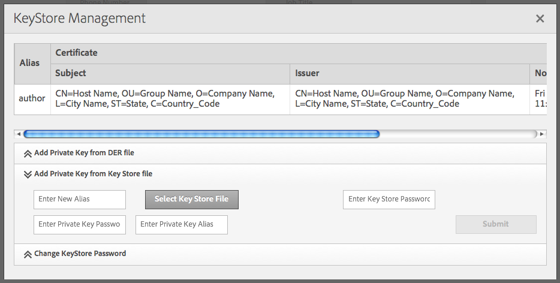

# Replicazione con SSL reciproco{#replicating-using-mutual-ssl}

Configura AEM in modo che un agente di replica nell’istanza di authoring utilizzi SSL reciproco (MSSL) per connettersi all’istanza di pubblicazione. Utilizzando MSSL, l’agente di replica e il servizio HTTP sull’istanza di pubblicazione utilizzano i certificati per autenticarsi a vicenda.

La configurazione di MSSL per la replica comporta l’esecuzione dei seguenti passaggi:

1. Crea o ottieni chiavi private e certificati per le istanze di authoring e pubblicazione.
1. Installa le chiavi e i certificati sulle istanze di authoring e pubblicazione:

   * Autore: Chiave privata dell’autore e certificato di pubblicazione.
   * Pubblicazione: Chiave privata di Publish e certificato di Autore. Il certificato è associato all’account utente autenticato con l’agente di replica.

1. Configura il servizio HTTP Jetty-Based sull&#39;istanza Publish.
1. Configura le proprietà di trasporto e SSL dell’agente di replica.


È necessario determinare quale account utente sta eseguendo la replica. Quando installi il certificato di authoring affidabile nell’istanza di pubblicazione, il certificato è associato a questo account utente.

## Ottenimento o creazione di credenziali per MSSL {#obtaining-or-creating-credentials-for-mssl}

È necessaria una chiave privata e un certificato pubblico per le istanze di authoring e pubblicazione:

* Le chiavi private devono essere contenute nel formato pkcs#12 o JKS.
* I certificati devono essere contenuti nel formato pkcs#12 o JKS. È inoltre possibile aggiungere al Granite Truststore anche il certificato contenuto nel formato &quot;CER&quot;.
* I certificati possono essere autofirmati o firmati da una CA riconosciuta.

### Formato JKS {#jks-format}

Genera una chiave privata e un certificato in formato JKS. La chiave privata viene memorizzata in un file KeyStore e il certificato viene memorizzato in un file TrustStore. Utilizzo [Java `keytool`](https://docs.oracle.com/javase/7/docs/technotes/tools/solaris/keytool.html) per creare entrambi.

Esegui i seguenti passaggi utilizzando Java `keytool` per creare la chiave privata e la credenziale:

1. Generare una coppia di chiavi pubblica-privata in un KeyStore.
1. Crea o ottieni il certificato:

   * Autoscritto: Esporta il certificato dal KeyStore.
   * Firma CA: Generare una richiesta di certificato e inviarla alla CA.

1. Importa il certificato in un TrustStore.

Segui la procedura seguente per creare una chiave privata e un certificato autofirmato sia per le istanze di authoring che per quelle di pubblicazione. Utilizzare valori diversi per le opzioni di comando di conseguenza.

1. Aprire una finestra o un terminale della riga di comando. Per creare la coppia di chiavi privata-pubblica, immettere il comando seguente utilizzando i valori delle opzioni della tabella seguente:

   ```shell
   keytool -genkeypair -keyalg RSA -validity 3650 -alias alias -keystore keystorename.keystore  -keypass key_password -storepass  store_password -dname "CN=Host Name, OU=Group Name, O=Company Name,L=City Name, S=State, C=Country_ Code"
   ```

   | Opzione | Autore | Pubblicazione |
   |---|---|---|
   | -alias | author | pubblicazione |
   | -keystore | author.keystore | publish.keystore |

1. Per esportare il certificato, immetti il comando seguente utilizzando i valori delle opzioni della tabella seguente:

   ```shell
   keytool -exportcert -alias alias -file cert_file -storetype jks -keystore keystore -storepass store_password
   ```

   | Opzione | Autore | Pubblicazione |
   |---|---|---|
   | -alias | author | pubblicazione |
   | -file | author.cer | publish.cer |
   | -keystore | author.keystore | publish.keystore |

### pkcs#12 Formato {#pkcs-format}

Genera una chiave privata e un certificato in formato pkcs#12. Utilizzo [openSSL](https://www.openssl.org/) per generarli. Segui la procedura seguente per generare una chiave privata e una richiesta di certificato. Per ottenere il certificato, firma la richiesta con la tua chiave privata (certificato autofirmato) o invia la richiesta a una CA. Quindi, genera l’archivio pkcs#12 che contiene la chiave privata e il certificato.

1. Aprire una finestra o un terminale della riga di comando. Per creare la chiave privata, immetti il comando seguente, utilizzando i valori delle opzioni della tabella seguente:

   ```shell
   openssl genrsa -out keyname.key 2048
   ```

   | Opzione | Autore | Pubblicazione |
   |---|---|---|
   | -out | author.key | publish.key |

1. Per generare una richiesta di certificato, immetti il comando seguente utilizzando i valori delle opzioni della tabella seguente:

   ```shell
   openssl req -new -key keyname.key -out key_request.csr
   ```

   | Opzione | Autore | Pubblicazione |
   |---|---|---|
   | -key | author.key | publish.key |
   | -out | author_request.csr | publish_request.csr |

   Firma la richiesta del certificato o invia la richiesta a una CA.

1. Per firmare la richiesta di certificato, immetti il comando seguente, utilizzando i valori delle opzioni della tabella seguente:

   ```shell
   openssl x509 -req -days 3650 -in key_request.csr -signkey keyname.key -out certificate.cer
   ```

   | Opzione | Autore | Pubblicazione |
   |---|---|---|
   | -signkey | author.key | publish.key |
   | -in | author_request.csr | publish_request.csr |
   | -out | author.cer | publish.cer |

1. Per aggiungere la chiave privata e il certificato firmato a un file pkcs#12, immetti il comando seguente, utilizzando i valori delle opzioni della tabella seguente:

   ```shell
   openssl pkcs12 -keypbe PBE-SHA1-3DES -certpbe PBE-SHA1-3DES -export -in certificate.cer -inkey keyname.key -out pkcs12_archive.pfx -name "alias"
   ```

   | Opzione | Autore | Pubblicazione |
   |---|---|---|
   | -inkey | author.key | publish.key |
   | -out | author.pfx | publish.pfx |
   | -in | author.cer | publish.cer |
   | -name | author | pubblicazione |

## Installare la chiave privata e TrustStore sull’autore {#install-the-private-key-and-truststore-on-author}

Installa i seguenti elementi nell&#39;istanza di authoring:

* Chiave privata dell’istanza di authoring.
* Il certificato dell&#39;istanza di pubblicazione.

Per eseguire la seguente procedura, devi aver effettuato l’accesso come amministratore dell’istanza di authoring.

### Installare la chiave privata dell’autore {#install-the-author-private-key}

1. Apri la pagina Gestione utente per l’istanza di authoring. ([http://localhost:4502/libs/granite/security/content/useradmin.html](http://localhost:4502/libs/granite/security/content/useradmin.html))
1. Per aprire le proprietà dell’account utente, tocca o fai clic sul nome utente.
1. Se nell&#39;area Impostazioni account viene visualizzato il collegamento Crea KeyStore , fai clic sul collegamento. Configura una password e fai clic su OK.
1. Nell&#39;area Impostazioni account, fai clic su Gestisci archivio chiavi.

   

1. Fai Clic Su Aggiungi Chiave Privata Dal File Dell&#39;Archivio Chiave.

   

1. Fai clic su Seleziona file archivio chiavi, quindi cerca e seleziona il file author.keystore o il file author.pfx se utilizzi pkcs#12, quindi fai clic su Apri.
1. Immetti un alias e la password per l&#39;archivio chiavi. Immettere l&#39;alias e la password della chiave privata, quindi fare clic su Invia.
1. Chiudere la finestra di dialogo KeyStore Management.

   

### Installare il certificato di pubblicazione {#install-the-publish-certificate}

1. Apri la pagina Gestione utente per l’istanza di authoring. ([http://localhost:4502/libs/granite/security/content/useradmin.html](http://localhost:4502/libs/granite/security/content/useradmin.html))
1. Per aprire le proprietà dell’account utente, tocca o fai clic sul nome utente.
1. Se nell&#39;area Impostazioni account viene visualizzato il collegamento Crea TrustStore, fare clic sul collegamento, creare una password per il TrustStore e fare clic su OK.
1. Nell&#39;area Impostazioni account fare clic su Gestisci TrustStore.
1. Fare clic su Aggiungi certificato da file CER.

   

1. Deseleziona l’opzione Mappa certificato a utente . Fai clic su Seleziona file certificato, seleziona publish.cer e fai clic su Apri.
1. Chiudere la finestra di dialogo Gestione TrustStore.

   

## Installa la chiave privata e TrustStore su Publish {#install-private-key-and-truststore-on-publish}

Installa i seguenti elementi nell&#39;istanza di pubblicazione:

* Chiave privata dell&#39;istanza di pubblicazione.
* Il certificato dell’istanza di authoring. Associa il certificato all’utente utilizzato per eseguire le richieste di replica.

Per eseguire la seguente procedura, devi aver effettuato l’accesso come amministratore dell’istanza di pubblicazione.

### Installare la chiave privata di pubblicazione {#install-the-publish-private-key}

1. Apri la pagina Gestione utente per l’istanza di pubblicazione. ([http://localhost:4503/libs/granite/security/content/useradmin.html](http://localhost:4503/libs/granite/security/content/useradmin.html))
1. Per aprire le proprietà dell’account utente, tocca o fai clic sul nome utente.
1. Se nell&#39;area Impostazioni account viene visualizzato il collegamento Crea KeyStore , fai clic sul collegamento. Configura una password e fai clic su OK.
1. Nell&#39;area Impostazioni account, fai clic su Gestisci archivio chiavi.
1. Fai Clic Su Aggiungi Chiave Privata Dal File Dell&#39;Archivio Chiave.
1. Fai clic su Seleziona file archivio chiavi, quindi cerca e seleziona il file publish.keystore o il file publish.pfx se usi pkcs#12, quindi fai clic su Apri.
1. Immetti un alias e la password per l&#39;archivio chiavi. Immettere l&#39;alias e la password della chiave privata, quindi fare clic su Invia.
1. Chiudere la finestra di dialogo KeyStore Management.

### Installare il certificato di authoring {#install-the-author-certificate}

1. Apri la pagina Gestione utente per l’istanza di pubblicazione. ([http://localhost:4503/libs/granite/security/content/useradmin.html](http://localhost:4503/libs/granite/security/content/useradmin.html))
1. Individua l’account utente utilizzato per eseguire richieste di replica e tocca o fai clic sul nome utente.
1. Se nell&#39;area Impostazioni account viene visualizzato il collegamento Crea TrustStore, fare clic sul collegamento, creare una password per il TrustStore e fare clic su OK.
1. Nell&#39;area Impostazioni account fare clic su Gestisci TrustStore.
1. Fare clic su Aggiungi certificato da file CER.
1. Assicurati che l’opzione Mappa certificato all’utente sia selezionata. Fai clic su Seleziona file certificato, seleziona author.cer e fai clic su Apri.
1. Fare clic su Invia, quindi chiudere la finestra di dialogo Gestione TrustStore.

## Configurare il servizio HTTP in Pubblica {#configure-the-http-service-on-publish}

Configura le proprietà del servizio HTTP Apache Felix Jetty Based sull&#39;istanza di pubblicazione in modo che utilizzi HTTPS durante l&#39;accesso a Granite Keystore. Il PID del servizio è `org.apache.felix.http`.

Nella tabella seguente sono elencate le proprietà OSGi da configurare per l’utilizzo della console Web.

| Nome proprietà nella console Web | Nome proprietà OSGi | Valore |
|---|---|---|
| Abilita HTTPS | org.apache.felix.https.enable | vero |
| Abilita HTTPS per utilizzare Granite KeyStore | org.apache.felix.https.use.granite.keystore | vero |
| Porta HTTPS | org.osgi.service.http.port.secure | 8443 (o altra porta desiderata) |
| Certificato client | org.apache.felix.https.clientcertificate | &quot;Certificato client desiderato&quot; |

## Configurare l’agente di replica sull’autore {#configure-the-replication-agent-on-author}

Configura l’agente di replica nell’istanza di authoring per utilizzare il protocollo HTTPS quando ti connetti all’istanza di pubblicazione. Per informazioni complete sulla configurazione degli agenti di replica, vedi [Configurazione degli agenti di replica](/help/sites-deploying/replication.md#configuring-your-replication-agents).

Per abilitare MSSL, configura le proprietà nella scheda Trasporto in base alla tabella seguente:

<table>
 <tbody>
  <tr>
   <th>Proprietà</th>
   <th>Valore</th>
  </tr>
  <tr>
   <td>URI</td>
   <td><p>https://server_name:SSL_port/bin/receive?sling:authRequestLogin=1</p> <p>Esempio:</p> <p>http://localhost:8443/bin/receive?sling:authRequestLogin=1</p> </td>
  </tr>
  <tr>
   <td>User</td>
   <td>Nessun valore</td>
  </tr>
  <tr>
   <td>Password</td>
   <td>Nessun valore</td>
  </tr>
  <tr>
   <td>SSL</td>
   <td>Autenticazione client</td>
  </tr>
 </tbody>
</table>


Dopo aver configurato l’agente di replica, verifica la connessione per determinare se MSSL è configurato correttamente.

```xml
29.08.2014 14:02:46 - Create new HttpClient for Default Agent
29.08.2014 14:02:46 - * HTTP Version: 1.1
29.08.2014 14:02:46 - * Using Client Auth SSL configuration *
29.08.2014 14:02:46 - adding header: Action:Test
29.08.2014 14:02:46 - adding header: Path:/content
29.08.2014 14:02:46 - adding header: Handle:/content
29.08.2014 14:02:46 - deserialize content for delivery
29.08.2014 14:02:46 - No message body: Content ReplicationContent.VOID is empty
29.08.2014 14:02:46 - Sending POST request to http://localhost:8443/bin/receive?sling:authRequestLogin=1
29.08.2014 14:02:46 - sent. Response: 200 OK
29.08.2014 14:02:46 - ------------------------------------------------
29.08.2014 14:02:46 - Sending message to localhost:8443
29.08.2014 14:02:46 - >> POST /bin/receive HTTP/1.0
29.08.2014 14:02:46 - >> Action: Test
29.08.2014 14:02:46 - >> Path: /content
29.08.2014 14:02:46 - >> Handle: /content
29.08.2014 14:02:46 - >> Referer: about:blank
29.08.2014 14:02:46 - >> Content-Length: 0
29.08.2014 14:02:46 - >> Content-Type: application/octet-stream
29.08.2014 14:02:46 - --
29.08.2014 14:02:46 - << HTTP/1.1 200 OK
29.08.2014 14:02:46 - << Connection: Keep-Alive
29.08.2014 14:02:46 - << Server: Day-Servlet-Engine/4.1.64
29.08.2014 14:02:46 - << Content-Type: text/plain;charset=utf-8
29.08.2014 14:02:46 - << Content-Length: 26
29.08.2014 14:02:46 - << Date: Fri, 29 Aug 2014 18:02:46 GMT
29.08.2014 14:02:46 - << Set-Cookie: login-token=3529326c-1500-4888-a4a3-93d299726f28%3ac8be86c6-04bb-4d18-80d6-91278e08d720_98797d969258a669%3acrx.default; Path=/; HttpOnly; Secure
29.08.2014 14:02:46 - << Set-Cookie: cq-authoring-mode=CLASSIC; Path=/; Secure
29.08.2014 14:02:46 - <<
29.08.2014 14:02:46 - << R
29.08.2014 14:02:46 - << eplicationAction TEST ok.
29.08.2014 14:02:46 - Message sent.
29.08.2014 14:02:46 - ------------------------------------------------
29.08.2014 14:02:46 - Replication (TEST) of /content successful.
Replication test succeeded
```
