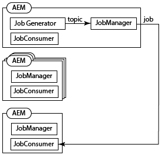
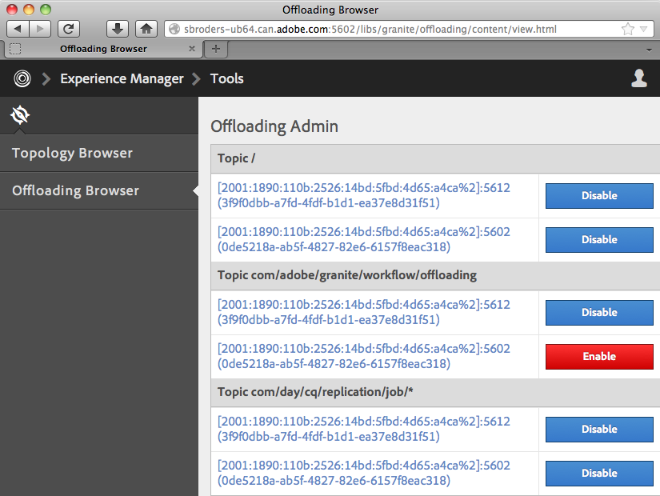

# Offload dei processi{#offloading-jobs}

## Introduzione {#introduction}

Lo scaricamento distribuisce le attività di elaborazione tra le istanze di Experience Manager in una topologia. Con lo scaricamento, è possibile utilizzare istanze di Experience Manager specifiche per eseguire tipi specifici di elaborazione. L&#39;elaborazione specializzata consente di ottimizzare l&#39;utilizzo delle risorse server disponibili.

Lo scaricamento è basato sulle funzioni [Apache Sling Discovery](https://sling.apache.org/documentation/bundles/discovery-api-and-impl.html) e Sling JobManager. Per utilizzare lo scaricamento, è necessario aggiungere cluster di Experience Manager a una topologia e identificare gli argomenti del processo che il cluster elabora. I cluster sono costituiti da una o più istanze di Experience Manager, in modo che una singola istanza sia considerata un cluster.

Per informazioni sull&#39;aggiunta di istanze a una topologia, consulta [Amministrazione di topologie](/help/sites-deploying/offloading.md#administering-topologies).

### Distribuzione dei processi {#job-distribution}

Sling JobManager e JobConsumer consentono la creazione di processi elaborati in una topologia:

* JobManager: Servizio che crea lavori per argomenti specifici.
* JobConsumer: Servizio che esegue lavori di uno o più argomenti. È possibile registrare più servizi JobConsumer per lo stesso argomento.

Quando JobManager crea un processo, il framework Offloading seleziona un cluster di Experience Manager nella topologia per eseguire il processo:

* Il cluster deve includere una o più istanze che eseguono un JobConsumer registrato per l&#39;argomento del processo.
* L&#39;argomento deve essere abilitato per almeno un&#39;istanza nel cluster.

Per informazioni sul miglioramento della distribuzione dei processi, consulta [Configurazione del consumo di argomenti](/help/sites-deploying/offloading.md#configuring-topic-consumption) .

Quando il framework di offload seleziona un cluster per eseguire un processo e il cluster è composto da più istanze, Sling Distribution determina quale istanza nel cluster esegue il processo.

### Payload processo {#job-payloads}

Il framework di offload supporta i payload dei processi che associano i processi alle risorse nell’archivio. I payload dei processi sono utili quando vengono creati processi per l’elaborazione delle risorse e il processo viene scaricato in un altro computer.

Al momento della creazione di un processo, è garantito che il payload si trovi solo nell’istanza che crea il processo. Durante lo scaricamento del processo, gli agenti di replica assicurano che il payload venga creato nell’istanza che alla fine consuma il processo. Al termine dell&#39;esecuzione del processo, la replica inversa fa sì che il payload venga copiato nuovamente nell&#39;istanza che ha creato il processo.

## Amministrazione delle topologie {#administering-topologies}

Le topologie sono cluster di Experienci Manager ad accoppiamento approssimativo che partecipano allo scarico. Un cluster è costituito da una o più istanze del server Experience Manager (una singola istanza è considerata un cluster).

Ogni istanza di Experience Manager esegue i seguenti servizi relativi allo scaricamento:

* Servizio di individuazione: Invia richieste a un connettore della topologia per unirsi alla topologia.
* Connettore topologia: Riceve le richieste di join e accetta o rifiuta ogni richiesta.

Il servizio di individuazione di tutti i membri della topologia punta al connettore topologia su uno dei membri. Nelle sezioni che seguono, questo membro è denominato membro principale.

Ogni cluster nella topologia contiene un&#39;istanza riconosciuta come leader. Il cluster leader interagisce con la topologia per conto degli altri membri del cluster. Quando il riempimento iniziale lascia il cluster, viene automaticamente scelto un nuovo riempimento iniziale per il cluster.

### Visualizzazione della topologia {#viewing-the-topology}

Utilizza Browser topologia per esplorare lo stato della topologia a cui partecipa l’istanza di Experience Manager. Browser topologia mostra i cluster e le istanze della topologia.

Per ogni cluster viene visualizzato un elenco di membri del cluster che indica l&#39;ordine in cui ciascun membro è stato incluso nel cluster e quale membro è il membro Leader. La proprietà Current indica l&#39;istanza attualmente amministrata.

Per ogni istanza del cluster, puoi vedere diverse proprietà relative alla topologia:

* Un elenco consentiti di argomenti per il consumer di lavoro dell&#39;istanza.
* Endpoint esposti per la connessione con la topologia.
* Gli argomenti del processo per i quali l&#39;istanza è registrata per lo scaricamento.
* Gli argomenti del processo elaborati dall&#39;istanza.

1. Utilizzando l’interfaccia utente touch, fai clic sulla scheda Strumenti . ([http://localhost:4502/tools.html](http://localhost:4502/tools.html))
1. Nell&#39;area Operazioni Granite fare clic su Scaricare il browser.
1. Nel pannello di navigazione fare clic su Browser topologia.

   Vengono visualizzati i cluster che partecipano alla topologia.

   

1. Fai clic su un cluster per visualizzare un elenco delle istanze nel cluster e il relativo ID, stato corrente e stato iniziale.
1. Fai clic su un ID istanza per visualizzare le proprietà più dettagliate.

È inoltre possibile utilizzare la console Web per visualizzare informazioni sulla topologia. La console fornisce ulteriori informazioni sui cluster di topologia:

* Quale istanza è l&#39;istanza locale.
* I servizi Connettore topologia utilizzati da questa istanza per connettersi alla topologia (in uscita) e i servizi che si connettono a questa istanza (in entrata).
* Modificare la cronologia per la topologia e le proprietà dell&#39;istanza.

Utilizzare la procedura seguente per aprire la pagina Gestione topologia della console Web:

1. Apri la Web Console nel browser. ([http://localhost:4502/system/console](http://localhost:4502/system/console))
1. Fare clic su Principale > Gestione topologia.

   

### Configurazione dell&#39;appartenenza alla topologia {#configuring-topology-membership}

Il servizio di individuazione basata sulle risorse Apache Sling viene eseguito su ogni istanza per controllare il modo in cui le istanze di Experience Manager interagiscono con una topologia.

Il servizio Discovery invia richieste periodiche di POST (heartbeat) ai servizi del connettore topologia per stabilire e mantenere connessioni con la topologia. Il servizio Connettore topologia gestisce un elenco consentiti di indirizzi IP o nomi host che possono essere aggiunti alla topologia:

* Per unire un&#39;istanza a una topologia, specifica l&#39;URL del servizio Connettore topologia del membro principale.
* Per consentire a un&#39;istanza di unirsi a una topologia, aggiungi l&#39;istanza all&#39;elenco consentiti del servizio Connettore topologia del membro principale.

Utilizza la Console web o un nodo sling:OsgiConfig per configurare le seguenti proprietà del servizio org.apache.sling.discovery.impt.Config:

<table>
 <tbody>
  <tr>
   <th>Nome proprietà</th>
   <th>Nome OSGi</th>
   <th>Descrizione</th>
   <th>Valore predefinito</th>
  </tr>
  <tr>
   <td>Timeout Heartbeat (secondi)</td>
   <td>heartbeatTimeout</td>
   <td>Tempo in secondi di attesa di una risposta heartbeat prima che l'istanza di destinazione venga considerata non disponibile. </td>
   <td>20</td>
  </tr>
  <tr>
   <td>Intervallo Heartbeat (secondi)</td>
   <td>heartbeatInterval</td>
   <td>La quantità di tempo in secondi tra gli heartbeat.</td>
   <td>15</td>
  </tr>
  <tr>
   <td>Ritardo minimo dell’evento (secondi)</td>
   <td>minEventDelay</td>
   <td>
Quando si verifica una modifica alla topologia, il tempo necessario per ritardare la modifica dello stato da TOPOLOGY_CHANGING a TOPOLOGY_CHANGED. Ogni modifica che si verifica quando lo stato è TOPOLOGY_CHANGING aumenta il ritardo di questo periodo di tempo.
 
Questo ritardo impedisce agli ascoltatori di essere inondati da eventi. 
 
Per non utilizzare ritardi, specificare 0 o un numero negativo.
 </td>
   <td>3</td>
  </tr>
  <tr>
   <td>URL del connettore topologico</td>
   <td>topologyConnectorUrl</td>
   <td>URL dei servizi Connettore topologia per l'invio di messaggi heartbeat.</td>
   <td>http://localhost:4502/libs/sling/topology/connector</td>
  </tr>
  <tr>
   <td>Elenco consentiti del connettore topologico</td>
   <td>topologyConnectorWhitelist</td>
   <td>Elenco di indirizzi IP o nomi host consentiti dal servizio locale Connettore topologia nella topologia. </td>
   <td>
localhost
 
127.0.0.1
 </td>
  </tr>
  <tr>
   <td>Nome descrittore archivio</td>
   <td>leaderElectionRepositoryDescriptor</td>
   <td> </td>
   <td>&lt;nessun valore&gt;</td>
  </tr>
 </tbody>
</table>

Segui la procedura seguente per collegare un&#39;istanza CQ al membro principale di una topologia. La procedura indirizza l&#39;istanza all&#39;URL del connettore topologia del membro della topologia principale. Eseguire questa procedura su tutti i membri della topologia.

1. Apri la Web Console nel browser. ([http://localhost:4502/system/console](http://localhost:4502/system/console))
1. Fare clic su Principale > Gestione topologia.
1. Fare clic su Configura servizio di individuazione.
1. Aggiungi un elemento alla proprietà URL del connettore topologia e specifica l&#39;URL del servizio Connettore topologia del membro della topologia principale. L’URL si trova nel modulo https://rootservername:4502/libs/sling/topology/connector.

Eseguire la procedura seguente sul membro principale della topologia. La procedura aggiunge i nomi degli altri membri della topologia al relativo elenco consentiti di Discovery Service.

1. Apri la Web Console nel browser. ([http://localhost:4502/system/console](http://localhost:4502/system/console))
1. Fare clic su Principale > Gestione topologia.
1. Fare clic su Configura servizio di individuazione.
1. Per ciascun membro della topologia, aggiungere un elemento alla proprietà elenco consentiti Connettore topologia e specificare il nome host o l&#39;indirizzo IP del membro della topologia.

## Configurazione del consumo dell&#39;argomento {#configuring-topic-consumption}

Utilizza il browser di offload per configurare il consumo di argomenti per le istanze di Experience Manager nella topologia. Per ogni istanza, puoi specificare gli argomenti che consuma. Ad esempio, per configurare la topologia in modo che una sola istanza utilizzi argomenti di un tipo specifico, disattiva l’argomento su tutte le istanze tranne una.

I processi vengono distribuiti tra le istanze per le quali l’argomento associato è abilitato mediante logica di tipo round robin.

1. Utilizzando l’interfaccia utente touch, fai clic sulla scheda Strumenti . ([http://localhost:4502/tools.html](http://localhost:4502/tools.html))
1. Nell&#39;area Operazioni Granite fare clic su Scaricare il browser.
1. Nel pannello di navigazione, fai clic su Scaricare il browser.

   Vengono visualizzati gli argomenti di scaricamento e le istanze del server che possono utilizzare gli argomenti.

   

1. Per disabilitare il consumo di un argomento per un&#39;istanza, sotto il nome dell&#39;argomento fai clic su Disattiva accanto all&#39;istanza.
1. Per configurare il consumo di tutti gli argomenti per un&#39;istanza, fai clic sull&#39;identificatore di istanza sotto qualsiasi argomento.

   

1. Fai clic su uno dei pulsanti seguenti accanto a un argomento per configurare il comportamento di consumo per l’istanza, quindi fai clic su Salva:

   * Abilitato: Questa istanza consuma i lavori di questo argomento.
   * Disabilitata: Questa istanza non utilizza lavori di questo argomento.
   * Esclusivo: Questa istanza utilizza solo i lavori di questo argomento.

   **Nota:** quando selezioni Esclusivo per un argomento, tutti gli altri argomenti vengono automaticamente impostati su Disabilitato.

### Consumatori di lavoro installati {#installed-job-consumers}

Diverse implementazioni JobConsumer sono installate con Experience Manager. Gli argomenti per i quali questi JobConsumers sono registrati vengono visualizzati in Offloading Browser. Gli argomenti aggiuntivi visualizzati sono quelli registrati da JobConsumers personalizzati. Nella tabella seguente viene descritto il valore predefinito JobConsumers.

| Argomento del lavoro | PID di servizio | Descrizione |
|---|---|---|
| / | org.apache.sling.event.impl.jobs.deprecated.EventAdminBridge | Installato con Apache Sling. Elabora i processi generati dall’amministratore dell’evento OSGi per garantire la compatibilità con le versioni precedenti. |
| com/day/cq/replication/job/&amp;ast; | com.day.cq.replication.impl.AgentManagerImpl | Agente di replica che replica i payload del processo. |

<!--
| com/adobe/granite/workflow/offloading |com.adobe.granite.workflow.core.offloading.WorkflowOffloadingJobConsumer |Processes jobs that the DAM Update Asset Offloader workflow generates. |
-->

### Disabilitazione e abilitazione degli argomenti per un&#39;istanza {#disabling-and-enabling-topics-for-an-instance}

Il servizio Apache Sling Job Consumer Manager fornisce proprietà di elenco consentiti e elenco Bloccati degli argomenti. Configura queste proprietà per abilitare o disabilitare l&#39;elaborazione di argomenti specifici in un&#39;istanza di Experience Manager.

**Nota:** se l&#39;istanza appartiene a una topologia, puoi anche utilizzare Offloading Browser in qualsiasi computer della topologia per abilitare o disabilitare gli argomenti.

La logica che crea prima l’elenco degli argomenti abilitati consente tutti gli argomenti presenti nell’elenco consentiti e quindi rimuove gli argomenti presenti nell’elenco Bloccati. Per impostazione predefinita, tutti gli argomenti sono abilitati (il valore elenco consentiti è `*`) e non vengono disabilitati argomenti (l’elenco Bloccati non ha alcun valore).

Utilizza la console Web o un nodo `sling:OsgiConfig` per configurare le seguenti proprietà. Per i nodi `sling:OsgiConfig`, il PID del servizio Job Consumer Manager è org.apache.sling.event.impl.jobs.JobConsumerManager.

| Nome proprietà nella console Web | OSGi ID | Descrizione |
|---|---|---|
| Elenco consentiti argomento | job.consumermanager.whitelist | Elenco di argomenti elaborati dal servizio JobManager locale. Valore predefinito di &amp;ast; causa l&#39;invio di tutti gli argomenti al servizio TopicConsumer registrato. |
| elenco Bloccati argomento | job.consumermanager.blacklist | Elenco di argomenti che il servizio JobManager locale non elabora. |

## Creazione di agenti di replica per lo scaricamento {#creating-replication-agents-for-offloading}

Il framework di offload utilizza la replica per trasportare le risorse tra autore e lavoratore. Il framework di offload crea automaticamente agenti di replica quando le istanze si uniscono alla topologia. Gli agenti vengono creati con valori predefiniti. È necessario modificare manualmente la password utilizzata dagli agenti per l’autenticazione.

>[!CAUTION]
>
>Un problema noto con gli agenti di replica generati automaticamente richiede la creazione manuale di nuovi agenti di replica. Segui la procedura descritta in [Problemi relativi all&#39;utilizzo degli agenti di replica generati automaticamente](/help/sites-deploying/offloading.md#problems-using-the-automatically-generated-replication-agents) prima di creare gli agenti per lo scaricamento.

Creare gli agenti di replica che trasportano i payload di lavoro tra le istanze per lo scaricamento. L’illustrazione seguente mostra gli agenti necessari per scaricare dall’autore a un’istanza di lavoro. L’autore ha un Sling ID di 1 e l’istanza di lavoro ha un Sling ID di 2:

Questa configurazione richiede i tre agenti seguenti:

1. Un agente in uscita sull&#39;istanza dell&#39;autore che si replica nell&#39;istanza di lavoro.
1. Un agente inverso sull&#39;istanza di authoring che estrae dalla casella in uscita sull&#39;istanza di processo di lavoro.
1. Un agente in uscita sull&#39;istanza di lavoro.

Questo schema di replica è simile a quello utilizzato tra le istanze di authoring e pubblicazione. Tuttavia, per la situazione di scarico, tutte le istanze coinvolte sono istanze di authoring.

>[!NOTE]
>
>Il framework di offload utilizza la topologia per ottenere gli indirizzi IP delle istanze di offload. Il framework crea quindi automaticamente gli agenti di replica in base a questi indirizzi IP. Se in seguito gli indirizzi IP delle istanze di scaricamento cambiano, la modifica viene propagata automaticamente sulla topologia dopo il riavvio dell&#39;istanza. Tuttavia, il framework di offload non aggiorna automaticamente gli agenti di replica per riflettere i nuovi indirizzi IP. Per evitare questa situazione, utilizza indirizzi IP fissi per tutte le istanze della topologia.

### Denominazione degli agenti di replica per lo scaricamento {#naming-the-replication-agents-for-offloading}

Utilizzare un formato specifico per la proprietà ***Name*** degli agenti di replica in modo che il framework di offload utilizzi automaticamente l&#39;agente corretto per istanze di lavoro specifiche.

**Denominazione dell&#39;agente in uscita sull&#39;istanza dell&#39;autore:**

`offloading_<slingid>`, dove  `<slingid>` è l’ID Sling dell’istanza di lavoro.

Esempio: `offloading_f5c8494a-4220-49b8-b079-360a72f71559`

**Denominazione dell’agente inverso nell’istanza di authoring:**

`offloading_reverse_<slingid>`, dove  `<slingid>` è l’ID Sling dell’istanza di lavoro.

Esempio: `offloading_reverse_f5c8494a-4220-49b8-b079-360a72f71559`

**Denominazione della casella in uscita nell&#39;istanza di lavoro:**

`offloading_outbox`

### Creazione dell&#39;agente in uscita {#creating-the-outgoing-agent}

1. Crea un **Agente di replica** sull&#39;autore. (Vedi la [documentazione relativa agli agenti di replica](/help/sites-deploying/replication.md)). Specificare un **Titolo**. Il **Nome** deve seguire la convenzione di denominazione.
1. Crea l&#39;agente utilizzando le seguenti proprietà:

   | Proprietà | Valore |
   |---|---|
   | Impostazioni > Tipo di serializzazione | Predefiniti |
   | Transport >Transport URI | https://*`<ip of target instance>`*:*`<port>`*`/bin/receive?sling:authRequestLogin=1` |
   | Trasporto >utente di trasporto | Utente di replica sull&#39;istanza di destinazione |
   | Transport >Transport Password | Password utente di replica nell&#39;istanza di destinazione |
   | Extended > HTTP, metodo | POST |
   | Triggers > Ignora impostazioni predefinite | Vero |

### Creazione dell&#39;agente inverso {#creating-the-reverse-agent}

1. Crea un **Agente di replica inversa** sull&#39;autore. (Vedi la documentazione [per gli agenti di replica](/help/sites-deploying/replication.md).) Specificare un **Titolo**. Il **Nome** deve seguire la convenzione di denominazione.
1. Crea l&#39;agente utilizzando le seguenti proprietà:

   | Proprietà | Valore |
   |---|---|
   | Impostazioni > Tipo di serializzazione | Predefiniti |
   | Transport >Transport URI | https://*`<ip of target instance>`*:*`<port>`*`/bin/receive?sling:authRequestLogin=1` |
   | Trasporto >utente di trasporto | Utente di replica sull&#39;istanza di destinazione |
   | Transport >Transport Password | Password utente di replica nell&#39;istanza di destinazione |
   | Extended > HTTP, metodo | GET |

### Creazione dell&#39;agente della casella in uscita {#creating-the-outbox-agent}

1. Crea un **Agente di replica** sull&#39;istanza di lavoro. (Vedi la documentazione [per gli agenti di replica](/help/sites-deploying/replication.md).) Specificare un **Titolo**. Il **Nome** deve essere `offloading_outbox`.
1. Crea l&#39;agente utilizzando le seguenti proprietà.

   | Proprietà | Valore |
   |---|---|
   | Impostazioni > Tipo di serializzazione | Predefiniti |
   | Transport >Transport URI | repo://var/replication/outbox |
   | Trigger > Ignora predefinito | Vero |

### Ricerca dell&#39;ID Sling {#finding-the-sling-id}

Ottieni l’ID Sling di un’istanza di Experience Manager utilizzando uno dei seguenti metodi:

* Apri la console Web e, nelle impostazioni Sling, trova il valore della proprietà Sling ID ([http://localhost:4502/system/console/status-slingsettings](http://localhost:4502/system/console/status-slingsettings)). Questo metodo è utile se l’istanza non fa ancora parte della topologia.
* Utilizza il browser Topologia se l’istanza fa già parte della topologia.

<!--
## Offloading the Processing of DAM Assets {#offloading-the-processing-of-dam-assets}

Configure the instances of a topology so that specific instances perform the background processing of assets that are added or updated in DAM.

By default, Experience Manager executes the [!UICONTROL DAM Update Asset] workflow when a DAM asset changes or one is added to DAM. Change the default behavior so that Experience Manager instead executes the [!UICONTROL DAM Update Asset Offloader] workflow. This workflow generates a JobManager job that has a topic of `com/adobe/granite/workflow/offloading`. Then, configure the topology so that the job is offloaded to a dedicated worker.

>[!CAUTION]
>
>No workflow should be transient when used with workflow offloading. For example, the [!UICONTROL DAM Update Asset] workflow must not be transient when used for asset offloading. To set/unset the transient flag on a workflow, see [Transient Workflows](/help/assets/performance-tuning-guidelines.md#workflows).

The following procedure assumes the following characteristics for the offloading topology:

* One or more Experience Manager instance are authoring instances that users interact with for adding or updating DAM assets.
* Users to do not directly interact with one or more Experience Manager instances that process the DAM assets. These instances are dedicated to the background processing of DAM assets.

1. On each Experience Manager instance, configure the Discovery Service so that it points to the root Topography Connector. (See [Configuring Topology Membership](#title4).)
1. Configure the root Topography Connector so that the connecting instances are on the allow list.
1. Open Offloading Browser and disable the `com/adobe/granite/workflow/offloading` topic on the instances with which users interact to upload or change DAM assets.

   

1. On each instance that users interact with to upload or change DAM assets, configure workflow launchers to use the [!UICONTROL DAM Update Asset Offloading] workflow:

    1. Open the Workflow console.
    1. Click the Launcher tab.
    1. Locate the two Launcher configurations that execute the [!UICONTROL DAM Update Asset] workflow. One launcher configuration event type is Node Created, and the other type is Node Modified.
    1. Change both event types so that they execute the [!UICONTROL DAM Update Asset Offloading] workflow. (For information about launcher configurations, see [Starting Workflows When Nodes Change](/help/sites-administering/workflows-starting.md).)

1. On the instances that perform the background processing of DAM assets, disable the workflow launchers that execute the [!UICONTROL DAM Update Asset] workflow.
-->

## Ulteriori letture {#further-reading}

Oltre ai dettagli presentati in questa pagina, puoi anche leggere quanto segue:

* Per informazioni sull&#39;utilizzo delle API Java per creare posti di lavoro e consumatori di lavoro, consulta [Creazione e consumo di processi per lo scaricamento](/help/sites-developing/dev-offloading.md).
