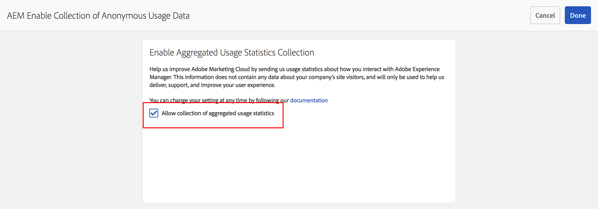

# Accesso alla raccolta di statistiche di utilizzo aggregate{#opting-into-aggregated-usage-statistics-collection}

## Introduzione {#introduction}

Puoi contribuire a migliorare Adobe Experience Cloud inviando statistiche Adobi su come interagisci con Adobe Experience Manager (AEM). Queste informazioni non contengono dati sui visitatori del sito della tua azienda e vengono utilizzate solo per aiutare Adobe a fornire, supportare e migliorare l’esperienza utente.

Puoi partecipare alla raccolta delle statistiche di utilizzo utilizzando l’interfaccia utente touch o la console web.

>[!NOTE]
>
>Esistono varie normative sulla protezione dei dati e sulla privacy; tra cui, ad esempio, RGPD e CCPA. AEM Sites è pronta ad aiutare i clienti a rispettare gli obblighi in materia di protezione dei dati e privacy. Questa pagina guida i clienti attraverso le procedure per il consenso (o la rinuncia) alla raccolta di statistiche di utilizzo aggregate.
>
>Per ulteriori informazioni, consulta anche [Centro per la privacy di Adobe](https://www.adobe.com/it/privacy.html).

>[!NOTE]
>
>Puoi rinunciare in qualsiasi momento utilizzando [Console web](/help/sites-deploying/opt-in-aggregated-usage-statistics.md#opt-in-by-using-the-web-console) oppure non selezionando l&#39;opzione di consenso nella schermata di consenso AEM.

## Consenso tramite l’interfaccia utente touch {#opt-in-by-using-the-touch-ui}

La prima volta che avvii l’AEM, puoi dare il consenso utilizzando l’interfaccia utente touch come segue:

1. Nella schermata di navigazione AEM, fai clic su **Casella in entrata** (campana).

   

1. Nell’elenco a discesa, fai clic su &quot;&quot;**Abilita raccolta dati di utilizzo aggregati**&quot;.

   

1. Nella schermata di consenso, seleziona &quot;**Consenti la raccolta di statistiche di utilizzo aggregate**&quot;.

   

1. Fai clic su &quot;**Fine**&quot;.

## Consenso tramite la console web {#opt-in-by-using-the-web-console}

Puoi acconsentire (o rinunciare) utilizzando la console web come segue:

1. Nella schermata di navigazione AEM, fai clic su **Strumenti** e poi **Operazioni**.

   

1. Nella finestra Operazioni fare clic su **Console web**.

   

1. Cerca &quot;**Raccolta di statistiche di utilizzo aggregate**&quot;.
1. Fai clic su **Modifica** icona.

   

1. Seleziona la casella di controllo **Abilitato.** In alternativa, è possibile deselezionare la casella di controllo se si desidera rinunciare alla raccolta delle statistiche di utilizzo.

   

1. Fai clic su **Salva**.
