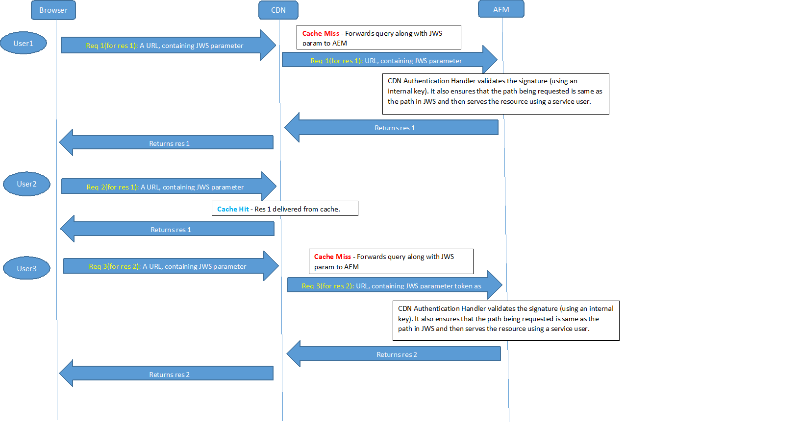

# Impostazioni di configurazione OSGi{#osgi-configuration-settings}

[](https://www.osgi.org/) OSGiè un elemento fondamentale nello stack tecnologico di AEM. Viene utilizzato per controllare i bundle compositi di AEM e la loro configurazione.

OSGi &quot;*fornisce le primitive standardizzate che consentono di costruire applicazioni da componenti piccoli, riutilizzabili e collaborativi. Questi componenti possono essere composti in un&#39;applicazione e distribuiti*&quot;.

Questo consente una facile gestione dei bundle in quanto possono essere arrestati, installati, avviati individualmente. Le interdipendenze vengono gestite automaticamente. Ogni componente OSGi (vedi la [specifica OSGi](https://www.osgi.org/Specifications/HomePage)) è contenuto in uno dei vari bundle. Quando lavori con AEM esistono diversi metodi per gestire le impostazioni di configurazione per tali bundle; per ulteriori dettagli e pratiche consigliate, consulta [Configurazione di OSGi](/help/sites-deploying/configuring-osgi.md) .

Le seguenti impostazioni di configurazione OSGi (elencate in base al bundle) sono rilevanti per l&#39;implementazione del progetto. Non tutte le impostazioni elencate devono essere regolate, alcune sono menzionate per aiutarti a capire come funziona AEM.

>[!CAUTION]
>
>L’elenco è inteso come linea guida e non è esaustivo. Non tutti i bundle sono elencati, né tutti i parametri per alcuni dei bundle che sono.
>
>La configurazione necessaria varia da progetto a progetto.
>
>Per i valori utilizzati e per informazioni dettagliate sui parametri, consultate la console Web .

>[!NOTE]
>
>Lo strumento OSGi Configuration Diff, parte di [AEM Tools](https://helpx.adobe.com/experience-manager/kb/tools/aem-tools.html), può essere utilizzato per elencare le configurazioni OSGi predefinite.

>[!NOTE]
>
>Possono essere necessari ulteriori bundle per aree specifiche di funzionalità all&#39;interno di AEM. In questi casi, i dettagli di configurazione si trovano sulla pagina in relazione alla funzionalità appropriata.

**AEM** Listener eventi di replicaConfigura:

* Le **Modalità di esecuzione**, in cui gli eventi di replica verranno distribuiti agli ascoltatori. Ad esempio, se definito come autore, questo è il sistema che &quot;avvia&quot; la replica.

* È necessario aggiungere la modalità di esecuzione **publish** se il codice del progetto elabora eventi di replica (replica inversa) in un ambiente di pubblicazione. Ad esempio, quando il dispatcher viene utilizzato per lo scaricamento dall’ambiente di pubblicazione o quando si verifica la replica standard ad altre istanze di pubblicazione.

**AEM** Listener di modifica del repositoryConfigure:

* Le posizioni **Percorsi** per ascoltare gli eventi del repository pronti per la distribuzione.

**CRX Sling Client** RepositoryConfigura l&#39;accesso all&#39;archivio dei contenuti sottostante.

* Dopo l&#39;installazione, **Admin Password** deve essere modificata per garantire la [sicurezza](/help/sites-administering/security-checklist.md) dell&#39;istanza.
* Altre modifiche non dovrebbero essere necessarie e occorre prestare attenzione in quanto possono influenzare l’accesso all’archivio.

**Wiki Mail** ServiceConfigura le impostazioni e-mail per le e-mail inviate da un wiki.

**Console di gestione Apache Felix OSGi** Configura:

* **Plug-in**, gli elementi di navigazione principali (plugin console) da rendere disponibili nelle voci di menu di livello superiore  **Apache Felix Web Management** Consoleas. Disabilita le risorse e gli spazi necessari per ciascuna operazione non necessaria.

>[!CAUTION]
>
>Assicurati di configurare quanto segue:
>
>**Nome utente** e  **password**, le credenziali per l&#39;accesso alla console di gestione Web Apache Felix stessa.
>La password deve essere modificata dopo l&#39;installazione iniziale per garantire la [sicurezza](/help/sites-administering/security-checklist.md) dell&#39;istanza.

>[!NOTE]
>
>Questa configurazione deve essere effettuata utilizzando la console Felix come necessario all&#39;avvio, prima che l&#39;archivio sia disponibile.

**Apache Sling** Registratore dati di richiesta personalizzabileConfigure:

* **Logger** Name e  **Log** Fortutto configurano la posizione e il formato della richiesta e della registrazione degli accessi (impostazione predefinita:  `request.log`). Questo file di registro è essenziale per l’analisi delle prestazioni o delle funzionalità di debug correlate alla catena web.
Questa funzione è associata al [logger di richiesta Apache Sling](#apacheslingrequestlogger).

Per ulteriori informazioni, consulta [AEM Logging](/help/sites-deploying/configure-logging.md) e [Sling Logging](https://sling.apache.org/site/logging.html).

**Apache Sling Event Thread** PoolConfigure:

* **Dimensione min pool** e Dimensione  **massima pool**, la dimensione del pool utilizzato per contenere i thread evento.

* **Dimensione** coda, la dimensione massima della coda del thread se il pool è esaurito.
Il valore consigliato è `-1` in quanto imposta la coda su illimitato; se viene fissato un limite, le perdite potrebbero verificarsi in caso di superamento.

* La modifica di queste impostazioni può migliorare le prestazioni in scenari con un numero elevato di eventi; ad esempio, un utilizzo intensivo di DAM o Workflow AEM.
* I valori specifici dello scenario devono essere stabiliti utilizzando i test.
* Queste impostazioni possono influire sulle prestazioni dell&#39;istanza, pertanto non modificarle senza motivo e con la dovuta considerazione.

**Apache Sling GET** ServletConfigura alcuni aspetti del rendering:

* **Auto** Indexto per abilitare/disabilitare il rendering della directory per la navigazione.
* **Abilita**  (o disabilita) le rappresentazioni predefinite, ad esempio  **HMTL**,  **Testo normale**,  **** JSONo  **XML**.
Non devi disabilitare JSON.

>[!NOTE]
>
>Questa impostazione viene configurata automaticamente per le istanze di produzione se esegui AEM in [Modalità pronta per la produzione](/help/sites-administering/production-ready.md).

**Apache Sling Java Script** HandlerConfigura le impostazioni per la compilazione di file .java come script (servlets).

Alcune impostazioni possono influire sulle prestazioni, che devono essere disattivate ove possibile, in particolare per un&#39;istanza di produzione.

* S **Origine VM** e **Target VM**, definisci la versione JDK come utilizzata come JVM di runtime

* per le istanze di produzione:

   * disattiva **Genera informazioni di debug**

**Apache Sling JCR** InstallerQuesti parametri probabilmente non richiedono la configurazione, ma possono essere utili per sapere quando si sviluppano o si esegue il debug. Ad esempio, le cartelle di installazione possono essere utili per il check-in/out o la creazione di un pacchetto.

* **Nome delle cartelle di installazione** regexpand  **Profondità massima della gerarchia delle cartelle di installazione**  - specificare dove e a quale profondità vengono cercate le risorse da installare nelle cartelle di repository. Quando viene utilizzato un carattere jolly (come in .*/install) verranno cercate tutte le corrispondenze appropriate, ad esempio `/libs/sling/install` e `/libs/cq/core/install`.

* **Percorso di ricerca**, elenco di percorsi in cui jcrinstall cerca le risorse da installare, insieme a un numero che indica il fattore di ponderazione per quel percorso.

**Apache Sling Job Event** HandlerConfigura parametri che gestiscono la pianificazione dei processi:

* **Intervallo** tentativi,  **Numero massimo tentativi**,  **Numero massimo di processi paralleli**, Tempo di attesa di  **** riconoscimento, tra gli altri.

* La modifica di queste impostazioni può migliorare le prestazioni in scenari con un numero elevato di posti di lavoro; ad esempio, un utilizzo intensivo di DAM AEM e flussi di lavoro.
* I valori specifici dello scenario devono essere stabiliti utilizzando i test.
* Non modificare queste impostazioni senza motivo, ma solo dopo aver tenuto in debita considerazione.

**Apache Sling JSP Script** HandlerConfigura le impostazioni relative alle prestazioni per il gestore di script JSP. Per migliorare le prestazioni è necessario disattivare il più possibile.

In particolare per le istanze di produzione:

* disattiva **Genera informazioni di debug**
* disattiva **Mantieni Java generato**
* disattiva **Contenuto mappato**
* disattiva **Visualizza frammenti di origine**

>[!NOTE]
>
>Questa impostazione viene configurata automaticamente per le istanze di produzione se esegui AEM in [Modalità pronta per la produzione](/help/sites-administering/production-ready.md).

**Configurazione** della registrazione Sling ApacheConfigure:

* **Log** Leveland  **Log File**, per definire la posizione e il livello di log della configurazione di log centrale (error.log). Il livello può essere impostato su uno tra `DEBUG`, `INFO`, `WARN`, `ERROR` e `FATAL`.

* **Numero di** file di registro e  **soglia file di registro** per definire le dimensioni e la rotazione della versione del file di registro.

* **Modelli di messaggio** definisce il formato dei messaggi di log.

Per ulteriori informazioni, consulta [AEM Logging](/help/sites-deploying/configure-logging.md#global-logging) e [Sling Logging](https://sling.apache.org/site/logging.html).

**Configurazione del logger di registrazione Apache Sling (configurazione di fabbrica)** Configura:

* **Livello di log**,  **File** di log e  **Messaggio** Fortutto definiscono i dettagli del file di log e dei messaggi.

* **** Loggerto per definire la categoria; ad esempio, registra solo per com.day.cq.

* Utilizzando **Configurazioni di fabbrica**, è possibile aggiungere un numero qualsiasi di configurazioni aggiuntive per soddisfare i vari livelli di registro e categorie necessari.
* Tali configurazioni sono utili durante lo sviluppo; ad esempio, per registrare i messaggi di TRACE per un servizio specifico in un file di registro specifico.
* Tali configurazioni sono utili in un ambiente di produzione; ad esempio, per avere messaggi su un servizio specifico registrati in un singolo file di log per un monitoraggio più semplice.

Per ulteriori informazioni, consulta [AEM Logging](/help/sites-deploying/configure-logging.md) e [Sling Logging](https://sling.apache.org/site/logging.html).

**Configurazione di Apache Sling Logging Writer (Configurazione di fabbrica)** :

* **File di registro per definire** l’esistenza di un file di registro.
* **Numero di** file di registro per definire la rotazione della versione.

* Il writer può essere utilizzato da una configurazione **Apache Sling Logging Logger Configuration**.

* Tali configurazioni sono utili durante lo sviluppo; ad esempio, per registrare i messaggi di TRACE per un servizio specifico in un file di registro specifico.
* Tali configurazioni sono utili in un ambiente di produzione; ad esempio, per avere messaggi su un servizio specifico registrati in un singolo file di log per un monitoraggio più semplice.

Per ulteriori informazioni, consulta [AEM Logging](/help/sites-deploying/configure-logging.md) e [Sling Logging](https://sling.apache.org/site/logging.html).

**Apache Sling Main** ServletConfigure:

* **Numero di chiamate per** richiesta e  **profondità di** ricorsione per proteggere il sistema da infinite chiamate di script e ricorsività.

**Apache Sling MIME Type** ServiceConfigure:

* **Tipi MIME** da aggiungere al sistema quelli richiesti dal progetto. Questo consente a una richiesta `GET` su un file di impostare l&#39;intestazione corretta del tipo di contenuto per il collegamento del tipo di file e dell&#39;applicazione.

**Filtro di riferimento Apache Sling** Per risolvere problemi di sicurezza noti con Cross-Site Request Forgery (CSRF) in CRX WebDAV e Apache Sling è necessario configurare il filtro di riferimento.

Il servizio filtro referrer è un servizio OSGi che consente di configurare:

* quali metodi http devono essere filtrati
* se è consentita un&#39;intestazione referrer vuota
* e un elenco di server da consentire oltre all&#39;host del server.

Per ulteriori informazioni, consulta la [Lista di controllo protezione - Problemi con il forgiato di richiesta cross-site](/help/sites-administering/security-checklist.md#protect-against-cross-site-request-forgery) .

>[!NOTE]
>
>Il filtro di riferimento Apache Sling dipende dall&#39;installazione di un pacchetto di correzione rapida.

**Apache Sling Request** LoggerConfigure:

* vari parametri per definire la modalità di registrazione delle richieste.
* **Abilita il registro** richieste per abilitare o disabilitare.

* **Abilita il registro** di accesso per abilitare o disabilitare.

Questa funzione è associata al [logger dati di richiesta personalizzabile Apache Sling](#apacheslingcustomizablerequestdatalogger).

Per ulteriori informazioni, consulta [AEM Logging](/help/sites-deploying/configure-logging.md) e [Sling Logging](https://sling.apache.org/site/logging.html).

**Apache Sling Resource Resolver** FactoryConfigura gli aspetti centrali della risoluzione delle risorse Sling:

* **Percorso di ricerca risorse**, aggiungi eventuali percorsi specifici del progetto (ma non rimuovi  `/libs` o  `/apps`).

* **URL virtuali** per definire le mappature degli URL personalizzati.

* **mappature URL** per definire eventuali alias; ad esempio da  `/content` a  `/`.

* **Mapping Location** (Posizione mappatura), la configurazione mappatura esternalizzata in  `/etc/map`.

* Utilizzare l&#39;installazione locale (ad esempio, utilizzare `https://localhost:4502/system/console/jcrresolver`) per determinare quale Resource Resolver è attivo.

Per ulteriori informazioni, consulta: [https://cwiki.apache.org/confluence/display/SLING/Flexible+Resource+Resolution](https://cwiki.apache.org/confluence/display/SLING/Flexible+Resource+Resolution).

>[!CAUTION]
>
>In particolare queste opzioni devono essere configurate nell’archivio.
>
>In caso contrario, le modifiche apportate a **Mappature URL** utilizzando la console Felix potrebbero essere sovrascritte da AEM al prossimo avvio.

**Apache Sling Servlet/Script Resolver e Error** HandlerIl servlet e il risolutore script Sling ha più attività:

1. Viene utilizzato come `ServletResolver` per selezionare il Servlet o lo Script da chiamare per gestire la richiesta.

1. Funge da `SlingScriptResolver`.

1. Gestisce la gestione degli errori implementando l’interfaccia `ErrorHandler` utilizzando lo stesso algoritmo per selezionare i servlet e gli script di gestione degli errori utilizzati per risolvere i servlet e gli script di elaborazione delle richieste.

È possibile impostare diversi parametri, tra cui:

* **Percorsi di esecuzione** elenca i percorsi per la ricerca di script eseguibili; configurando percorsi specifici è possibile limitare gli script eseguibili. Se non è configurato alcun percorso, viene utilizzato il valore predefinito ( `/` = root), che consente l&#39;esecuzione di tutti gli script.
Se un valore del percorso configurato termina con una barra, viene eseguita la ricerca nell’intero sottoalbero. Senza una tale barra finale lo script verrà eseguito solo se si tratta di una corrispondenza esatta.

* **Utente script** : questa proprietà opzionale può specificare l&#39;account utente del repository utilizzato per la lettura degli script. Se non viene specificato alcun account, l&#39;utente `admin` viene utilizzato per impostazione predefinita.

* **Estensioni predefiniteElenco di estensioni per le quali verrà utilizzato il comportamento predefinito.** Questo significa che l’ultimo segmento del percorso del tipo di risorsa può essere utilizzato come nome dello script.

**Day Commons Carattere GFX** HelperQuando esegui il rendering di elementi grafici, puoi utilizzare DrawText per incorporare il testo. Per questo è anche possibile installare i propri font:

* Definisci il **Percorso font** in cui cercare i font specifici del progetto.
Esempio, `/apps/myapp/fonts`.

**Configurazione proxy** configurazioneProxy dei componenti HTTP Apache per tutto il codice che utilizza il client HTTP Apache, utilizzato quando si effettua un HTTP; ad esempio in caso di replica.

Durante la creazione di una nuova configurazione, non apportare modifiche alla configurazione di fabbrica, ma creare una nuova configurazione di fabbrica per questo componente utilizzando il gestore di configurazione disponibile qui: **https://localhost:4502/system/console/configMgr/**. La configurazione proxy è disponibile in **org.apache.http.proxyconfigurator.**

>[!NOTE]
>
>In AEM 6.0 e versioni precedenti il proxy era configurato nel client HTTP Day Commons. A partire da AEM 6.1 e versioni successive, la configurazione proxy è stata spostata nella configurazione proxy &quot;Apache HTTP Components Proxy Configuration&quot; invece della configurazione &quot;Day Commons HTTP Client&quot;.

**Day CQ** AntispamConfigura il servizio anti-spam (Akismet) utilizzato. A tal fine è necessario registrare i seguenti dati:

* **Provider**
* **Chiave API**
* **URL registrato**

**Adobe Granite HTML Library** ManagerConfigura questo elemento per controllare la gestione delle librerie client (css o js); incluso, ad esempio, il modo in cui viene vista la struttura sottostante.

* Per le istanze di produzione:

   * abilita **Minify** (per rimuovere CRLF e caratteri di spazio vuoto).
   * abilita **Gzip** (per consentire l&#39;gzip dei file e l&#39;accesso con una richiesta).
   * disattiva **Debug**
   * disattiva **Timing**

* Per lo sviluppo JS (in particolare quando si esegue il firebugging/debug):

   * disattiva **minimizza**
   * abilita **Debug** per separare i file per il debug e l&#39;utilizzo con firebug.
   * abilita **Timing** in caso di interesse nei tempi.
   * abilita la console **Debug** per visualizzare i messaggi di log della console JS.

>[!CAUTION]
>
>Quando modifichi l&#39;impostazione per **Minify** o **Gzip** dovrai anche eliminare il contenuto di `/var/clientlibs`. Si tratta di una versione cache delle clientlibs e verrà ricreata quando richiesto.

>[!NOTE]
>
>Questa impostazione viene configurata automaticamente per le istanze di produzione se esegui AEM in [Modalità pronta per la produzione](/help/sites-administering/production-ready.md).

**Day CQ HTTP Header Authentication** HandlerImpostazioni a livello di sistema per il metodo di autenticazione di base della richiesta HTTP.

Quando utilizzi [gruppi di utenti chiusi](/help/sites-administering/cug.md) puoi configurare (tra gli altri):

* **realm HTTP**
* La **pagina di accesso predefinita**

**Day CQ Link Checker** ServiceCheck e, se necessario, configura:

* **Intervallo di pianificazione** per definire l’intervallo in cui i collegamenti esterni devono essere controllati automaticamente.

* Controlla **Intervallo di tolleranza dei collegamenti non validi** per il periodo in cui un collegamento esterno non riuscito viene considerato non valido.
* **Controlla i pattern di sostituzione dei collegamenti**, per definire eventuali percorsi da escludere dal controllo dei collegamenti.

**Day CQ Link Checker** TaskConfigura le impostazioni per un singolo link checker attività (un&#39;attività che controlla un link esterno):

* Controlla gli intervalli definiti in **Intervallo di test dei collegamenti buoni** e **Intervallo di test dei collegamenti non validi**

* I vari parametri relativi ai proxy per l’accesso a Internet e NTLM che sono necessari per l’accesso esterno durante il controllo di un collegamento.

**Day CQ Mail** ServiceConfigura il nome host e i dettagli di accesso per il server di posta. Consulta la sezione Configurazione del servizio e-mail .

**Day CQ MCM** NewsletterConfigura le varie impostazioni utilizzate con la newsletter.

**Day CQ Root** MappingConfigure:

* **Percorso di destinazione** per definire a dove verrà reindirizzata una richiesta a &quot;  `/`&quot;.

Sono disponibili due interfacce in AEM:

* l’interfaccia touch è l’interfaccia standard
* e l&#39;interfaccia classica obsoleta è ancora completamente operativa

Utilizzando AEM mappatura principale puoi configurare l’interfaccia utente che desideri usare come predefinita per l’istanza:

* Per abilitare l’interfaccia utente touch come interfaccia utente predefinita, il percorso di destinazione **Target** deve puntare a:

   ```
      /projects.html
   ```

* Per usare l&#39;interfaccia classica come interfaccia predefinita, il percorso di destinazione **Target** deve puntare a:

   ```
      /welcome.html
   ```

>[!NOTE]
>
>Con un’installazione standard, l’interfaccia touch è l’interfaccia predefinita.

**Adobe** Handler autenticazione SSO GraniteConfigura i dettagli Single Sign On (SSO); sono spesso necessarie nelle configurazioni dell&#39;autore aziendale, spesso in combinazione con LDAP.

Sono disponibili diverse proprietà di configurazione:

* ****
PathPath per il quale questo gestore di autenticazione è attivo. Se questo parametro viene lasciato vuoto, il gestore di autenticazione viene disabilitato. Ad esempio, il percorso / fa sì che il gestore di autenticazione sia utilizzato per l&#39;intero archivio.

* **Il valore di Service**
RankingOSGi Framework Service Ranking viene utilizzato per indicare l&#39;ordine utilizzato per chiamare questo servizio. Questo è un 
`int` in cui i valori superiori indicano una precedenza superiore.
Il valore predefinito è `0`.

* **Nomi**
delle intestazioniI nomi delle intestazioni che potrebbero contenere un ID utente.

* **Nomi**
dei cookieI nomi dei cookie che potrebbero contenere un ID utente.

* **Nomi**
dei parametriI nomi dei parametri di richiesta che potrebbero fornire l&#39;ID utente.

* **User**
MapPer gli utenti selezionati, il nome utente estratto dalla richiesta HTTP può essere sostituito con uno diverso nell&#39;oggetto credentials. La mappatura è definita qui. Se il nome utente 
`admin` viene visualizzata su entrambi i lati della mappa, la mappatura verrà ignorata. Tieni presente che il carattere &quot;=&quot; deve essere annullato con un carattere iniziale &quot;\&quot;.

* ****
FormatoIndica il formato in cui viene fornito l’ID utente. Utilizzo:

   * `Basic` se l&#39;ID utente è codificato nel formato di autenticazione HTTP Basic
   * `AsIs` se l&#39;ID utente viene fornito in testo normale o se un valore di espressione regolare applicata deve essere utilizzato così com&#39;è o qualsiasi espressione regolare

**Day CQ WCM Debug** FilterQuesto è utile quando si sviluppa in quanto consente l&#39;uso di suffissi come ?debug=layout quando si accede a una pagina. Ad esempio, https://localhost:4502/cf#/content/geometrixx/en/support.html?debug=layout fornirà informazioni sul layout di potenziale interesse per lo sviluppatore.

* Disabilita questa opzione nelle istanze di produzione per garantire prestazioni e sicurezza.

**Day CQ WCM** FilterConfigure:

* **Modalità WCM **per definire il modo predefinito.
* In un&#39;istanza dell&#39;autore, potrebbe essere `edit`, `disable,preview` o `analytics`.
È possibile accedere alle altre modalità dalla barra laterale oppure utilizzare il suffisso `?wcmmode=disabled` per emulare un ambiente di produzione.

* In un’istanza di pubblicazione, deve essere impostato su `disabled` per garantire che nessun’altra modalità sia accessibile.

>[!NOTE]
>
>Questa impostazione viene configurata automaticamente per le istanze di produzione se esegui AEM in [Modalità pronta per la produzione](/help/sites-administering/production-ready.md).

**Day CQ WCM Link Checker** ConfiguratorConfigure:

* **Elenco di** configurazioni di riscrittura per specificare un elenco di posizioni per le configurazioni del linkchecker basato su contenuti. Le configurazioni possono essere basate sulla modalità di esecuzione; questo è importante per distinguere tra ambienti di authoring e di pubblicazione, in quanto le impostazioni del linkchecker possono variare.

**Day CQ WCM Page** ProcessorConfigure:

* **Percorsi**, un elenco di posizioni in cui il sistema ascolta le modifiche di pagina prima di attivare un  `jcr:Event`.

**Adobe Impression pagina** TrackerPer un&#39;istanza dell&#39;autore configura:

* **sling.auth.requirements**: imposta il valore di questa proprietà su  `-/libs/wcm/stats/tracker`

>[!CAUTION]
>
>Questa configurazione consentirà richieste anonime al servizio di tracciamento.

>[!NOTE]
>
>Per ulteriori informazioni, consulta [Impressioni pagina](/help/sites-deploying/configuring.md#enabling-page-impressions) .

**Day CQ WCM Page** StatisticsPer un&#39;istanza di pubblicazione configurare:

* **URL per inviare** i dati, configura l’URL utilizzato per monitorare le statistiche della pagina (è vitale se una richiesta di tracciamento passa attraverso il dispatcher); ad esempio, il valore predefinito è  `https://localhost:4502/libs/wcm/stats/tracker`.

* **Script di tracciamento** abilitato per abilitare (  `true`) o disabilitare (  `false`) l’inclusione dello script di tracciamento nelle pagine. Il valore predefinito è `false`.

>[!NOTE]
>
>Per ulteriori informazioni, consulta [Impressioni pagina](/help/sites-deploying/configuring.md#enabling-page-impressions) .

**Day CQ WCM Version** ManagerControl se e come vengono gestite le versioni nel sistema:

* **Crea versione su attivazione**, abilitata in un’installazione standard
* **Abilita eliminazione**

* **Percorsi** di eliminazione, percorsi in cui un’azione di ricerca eseguirà la ricerca
* **Percorsi** di controllo delle versioni impliciti, i percorsi in cui è attivo il controllo delle versioni implicite.

* **Età** massima della versione, età massima (in giorni) di una versione

* **Numero massimo di versioni**, il numero massimo di versioni da mantenere

Per ulteriori informazioni, consulta [Version Purging](/help/sites-deploying/version-purging.md) .

**Day CQ Workflow Email Notification** ServiceConfigura le impostazioni e-mail per le notifiche inviate da un flusso di lavoro.

**Day CQSE HTTP** ServiceControllare il CQ Servlet Engine:

* **NIO per HTTP, **Usare o meno NIO per HTTP. Valori predefiniti per true. Utilizzato solo se HTTP è abilitato.
* **Timeout connessione, **Timeout connessione in millisecondi. Questa proprietà si applica sia alle connessioni HTTP che HTTPS. Il valore predefinito è 60 secondi.

* **Abilita HTTPS,** se HTTPS è abilitato o meno. Predefinito su false.
* **Timeout sessione**, durata predefinita di una sessione HTTP specificata in minuti. Se il timeout è pari a 0 o inferiore, le sessioni non si timeout. Il valore predefinito è 10 minuti.
* **Debug Logging**, se scrivere o meno messaggi a livello di DEBUG. Predefinito su false.
* **Dimensione** buffer richieste, Dimensione del buffer per le richieste in byte. Il valore predefinito è 8 KB.
* **Numero massimo di thread**, Numero massimo di thread da utilizzare per gestire le richieste. Il valore predefinito è 200.

Le seguenti proprietà si applicano solo se HTTPS è abilitato.

* **Porta** HTTPS, porta per ascoltare la richiesta HTTPS. Valore predefinito 433.
* **NIO per HTTPS**, da utilizzare o meno NIO per HTTP. Predefinito al valore della proprietà NIO per HTTP .
* **Registro chiavi**, percorso assoluto dell&#39;archivio chiavi da utilizzare per HTTPS. Obbligatorio se HTTPS è abilitato.
* **Password** keystore, password per accedere al Keystore.
* **Alias** chiave, alias della chiave segreta nel Registro chiavi.
* **Password** chiave, password per sbloccare la chiave segreta nel Registro chiavi.
* **Certificato client**: requisito per il cliente di fornire un certificato valido. Il valore predefinito è Nessuno.

Per informazioni sulle opzioni relative a SSL e su come abilitare HTTPS per CQSE, consulta anche [Abilitazione di HTTP su SSL](/help/sites-administering/ssl-by-default.md) .

**CQ Rewriter HTML Parser Factory**

Controlla il parser HTML per il rewriter CQ.

* **Tag aggiuntivi da elaborare** : è possibile aggiungere o rimuovere tag HTML da elaborare dal parser. Per impostazione predefinita, vengono elaborati i seguenti tag: A,IMG,AREA,MODULO,BASE,COLLEGAMENTO,SCRIPT,CORPO,HEAD.
* **Custodia camel**  - Per impostazione predefinita, il parser HTML converte gli attributi in cammello case (ad esempio eBay) in minuscolo (ad esempio ebay). È possibile disattivarlo per mantenere gli attributi della maiuscola. Questa funzione è utile quando si utilizzano framework frontend come l’Angular 2.

**Day Commons JDBC Connections** PoolConfigura l&#39;accesso a un database esterno utilizzato come origine per il contenuto.

Questa è una configurazione di fabbrica, quindi è possibile configurare più istanze.

**Sessioni DPS di Adobe CQ Media** ServiceGestione sessioni DPS da utilizzare con le pubblicazioni.

In particolare, puoi definire `dps.session.service.url.name`: il valore predefinito è impostato su [https://dpsapi2.digitalpublishing.acrobat.com/webservices/sessions](https://dpsapi2.digitalpublishing.acrobat.com/webservices/sessions)

**CDN** RewriterLa comunicazione tra AEM e una rete CDN deve essere assicurata in modo che le risorse/i file binari siano consegnati all’utente finale in modo sicuro. Sono necessarie due attività:

* Accedere alla risorsa da AEM tramite la rete CDN la prima volta (o dopo la sua scadenza nella cache).
* Accedere alla risorsa memorizzata nella cache CDN in modo sicuro poiché una volta che la risorsa è memorizzata nella cache CDN, la richiesta non verrà visualizzata in AEM e tutti gli utenti che hanno accesso a tale risorsa su dovranno essere serviti da CDN.

AEM fornisce un rewriter per riscrivere gli URL delle risorse interne in URL CDN esterni. Riscrive i collegamenti da trasmettere alla rete CDN, inclusa una firma JWS, e scade il tempo necessario per consentire l’accesso sicuro alla risorsa. Questa funzione deve essere utilizzata nelle istanze di authoring.

Il flusso complessivo è il seguente:

1. L’utente si autentica con AEM e richiede una pagina con risorse.
1. La pagina richiesta contiene una risorsa simile a `/content/dam/geometrixx-media/articles/paladin_trailer.jpg/jcr:content/renditions/cq5dam.thumbnail.319.319.png`
1. Rewriter trasforma il collegamento a un URL CDN contenente una firma JWS:
   `CDN_domain/content/dam/geometrixx-media/articles/paladin_trailer.jpg/_jcr_content/renditions/cq5dam.thumbnail.319.319.png?cdn_sign=JWS_SIGNATURE`

1. Il browser dell’utente inoltra quindi la richiesta di risorse al server CDN
1. CDN deve essere configurato per inoltrare la richiesta a AEM insieme al parametro `cdn_sign` .
1. Un gestore di autenticazione convalida il parametro `cdn_sign` e restituisce la risorsa a CDN che viene quindi consegnata all’utente

Il flusso tra il browser dell’utente, la CDN e la AEM può essere visualizzato come segue.



>[!NOTE]
>
>Al momento questa funzione è abilitata solo per AEM istanze dell’autore.

**** Configurazioni CDN CDNConfigServiceImplFornisce

La funzione di riscrittura del CDN può essere attivata fornendo **il nome di dominio di distribuzione CDN** nella configurazione per com.adobe.cq.cdn.rewriter.impl.CDNConfigServiceImpl.

Il servizio contiene anche altre opzioni di configurazione come l&#39;attivazione/disattivazione della riscrittura CDN, i prefissi di percorso per i quali viene eseguita la riscrittura CDN, i valori TTL e il protocollo (HTTP o HTTPS).

**** CDNRewriterUn rewriter per la riscrittura degli URL immagine interni agli URL CDN

È possibile definire il valore **Tag Attributes** in com.adobe.cq.cdn.rewriter.impl.CDNRewriter in modo che vengano riscritti solo i collegamenti immagine selettivi.
