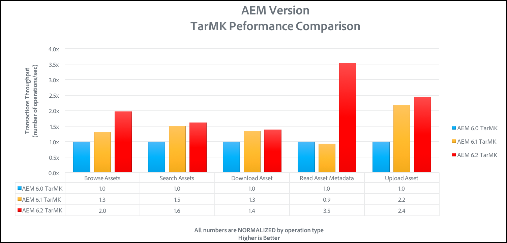

# Linee guida sulle prestazioni{#performance-guidelines}

Questa pagina fornisce linee guida generali su come ottimizzare le prestazioni della distribuzione di AEM. Se non hai ancora AEM, passa alle pagine seguenti prima di iniziare a leggere le linee guida sulle prestazioni:

* [AEM Concetti di base](/help/sites-deploying/deploy.md#basic-concepts)
* [Panoramica dello storage in AEM](/help/sites-deploying/storage-elements-in-aem-6.md#overview-of-storage-in-aem)
* [Implementazioni consigliate](/help/sites-deploying/recommended-deploys.md)
* [Requisiti tecnici](/help/sites-deploying/technical-requirements.md)

Di seguito sono illustrate le opzioni di distribuzione disponibili per AEM (scorri per visualizzare tutte le opzioni):

<table>
 <tbody>
  <tr>
   <td>
<strong>AEM</strong>
 
<strong>Prodotto</strong>
 </td>
   <td>
<strong>Topologia</strong>
 </td>
   <td>
<strong>Sistema operativo</strong>
 </td>
   <td>
<strong>Server applicazioni</strong>
 </td>
   <td>
<strong>JRE</strong>
 </td>
   <td>
<strong>Sicurezza</strong>
 </td>
   <td>
<strong>Micro Kernel</strong>
 </td>
   <td>
<strong>Datastore</strong>
 </td>
   <td>
<strong>Indicizzazione</strong>
 </td>
   <td>
<strong>Server web</strong>
 </td>
   <td>
<strong>Browser</strong>
 </td>
   <td>
<strong>Marketing Cloud</strong>
 </td>
  </tr>
  <tr>
   <td>
Sites
 </td>
   <td>
Non HA
 </td>
   <td>
Windows
 </td>
   <td>
CQSE
 </td>
   <td>
Oracle
 </td>
   <td>
LDAP
 </td>
   <td>
Tar
 </td>
   <td>
Segmento
 </td>
   <td>
Proprietà
 </td>
   <td>
Apache
 </td>
   <td>
Bordo
 </td>
   <td>
Destinazione
 </td>
  </tr>
  <tr>
   <td>
Assets
 </td>
   <td>
Publish-HA
 </td>
   <td>
Solaris
 </td>
   <td>
WebLogic
 </td>
   <td>
IBM
 </td>
   <td>
SAML
 </td>
   <td>
MongoDB
 </td>
   <td>
File
 </td>
   <td>
Lucene
 </td>
   <td>
IIS
 </td>
   <td>
IE
 </td>
   <td>
Analytics
 </td>
  </tr>
  <tr>
   <td>
Communities
 </td>
   <td>
Autore-CS
 </td>
   <td>
Cappello rosso
 </td>
   <td>
WebSphere
 </td>
   <td>
HP
 </td>
   <td>
Oauth
 </td>
   <td>
RDB/Oracle
 </td>
   <td>
S3/Azure
 </td>
   <td>
Solr
 </td>
   <td>
iPlanet
 </td>
   <td>
FireFox
 </td>
   <td>
Campaign
 </td>
  </tr>
  <tr>
   <td>
Forms
 </td>
   <td>
Author-Offload
 </td>
   <td>
HP-UX
 </td>
   <td>
Tomcat
 </td>
   <td>
 
 </td>
   <td>
 
 </td>
   <td>
RDB/DB2
 </td>
   <td>
MongoDB
 </td>
   <td>
 
 </td>
   <td>
 
 </td>
   <td>
Chrome
 </td>
   <td>
Social network
 </td>
  </tr>
  <tr>
   <td>
Mobile
 </td>
   <td>
Autore-cluster
 </td>
   <td>
IBM AIX
 </td>
   <td>
JBoss
 </td>
   <td>
 
 </td>
   <td>
 
 </td>
   <td>
RDB/MySQL
 </td>
   <td>
RDBMS
 </td>
   <td>
 
 </td>
   <td>
 
 </td>
   <td>
Safari
 </td>
   <td>
Pubblico
 </td>
  </tr>
  <tr>
   <td>
Sito multiplo
 </td>
   <td>
ASRP
 </td>
   <td>
SOSPENDERE
 </td>
   <td>
 
 </td>
   <td>
 
 </td>
   <td>
 
 </td>
   <td>
RDB/SQLServer
 </td>
   <td>
 
 </td>
   <td>
 
 </td>
   <td>
 
 </td>
   <td>
 
 </td>
   <td>
Risorse
 </td>
  </tr>
  <tr>
   <td>
Commerce
 </td>
   <td>
MSRP
 </td>
   <td>
Apple OS
 </td>
   <td>
 
 </td>
   <td>
 
 </td>
   <td>
 
 </td>
   <td>
 
 </td>
   <td>
 
 </td>
   <td>
 
 </td>
   <td>
 
 </td>
   <td>
 
 </td>
   <td>
Attivazione
 </td>
  </tr>
  <tr>
   <td>
Dynamic Media
 </td>
   <td>
JSRP
 </td>
   <td>
 
 </td>
   <td>
 
 </td>
   <td>
 
 </td>
   <td>
 
 </td>
   <td>
 
 </td>
   <td>
 
 </td>
   <td>
 
 </td>
   <td>
 
 </td>
   <td>
 
 </td>
   <td>
Mobile
 </td>
  </tr>
  <tr>
   <td>
Brand Portal
 </td>
   <td>
J2E
 </td>
   <td>
 
 </td>
   <td>
 
 </td>
   <td>
 
 </td>
   <td>
 
 </td>
   <td>
 
 </td>
   <td>
 
 </td>
   <td>
 
 </td>
   <td>
 
 </td>
   <td>
 
 </td>
   <td>
 
 </td>
  </tr>
  <tr>
   <td>
AoD
 </td>
   <td>
 
 </td>
   <td>
 
 </td>
   <td>
 
 </td>
   <td>
 
 </td>
   <td>
 
 </td>
   <td>
 
 </td>
   <td>
 
 </td>
   <td>
 
 </td>
   <td>
 
 </td>
   <td>
 
 </td>
   <td>
 
 </td>
  </tr>
  <tr>
   <td>
LiveFyre
 </td>
   <td>
 
 </td>
   <td>
 
 </td>
   <td>
 
 </td>
   <td>
 
 </td>
   <td>
 
 </td>
   <td>
 
 </td>
   <td>
 
 </td>
   <td>
 
 </td>
   <td>
 
 </td>
   <td>
 
 </td>
   <td>
 
 </td>
  </tr>
  <tr>
   <td>
Screens
 </td>
   <td>
 
 </td>
   <td>
 
 </td>
   <td>
 
 </td>
   <td>
 
 </td>
   <td>
 
 </td>
   <td>
 
 </td>
   <td>
 
 </td>
   <td>
 
 </td>
   <td>
 
 </td>
   <td>
 
 </td>
   <td>
 
 </td>
  </tr>
  <tr>
   <td>
Sicurezza dei documenti
 </td>
   <td>
 
 </td>
   <td>
 
 </td>
   <td>
 
 </td>
   <td>
 
 </td>
   <td>
 
 </td>
   <td>
 
 </td>
   <td>
 
 </td>
   <td>
 
 </td>
   <td>
 
 </td>
   <td>
 
 </td>
   <td>
 
 </td>
  </tr>
  <tr>
   <td>
Mgt del processo
 </td>
   <td>
 
 </td>
   <td>
 
 </td>
   <td>
 
 </td>
   <td>
 
 </td>
   <td>
 
 </td>
   <td>
 
 </td>
   <td>
 
 </td>
   <td>
 
 </td>
   <td>
 
 </td>
   <td>
 
 </td>
   <td>
 
 </td>
  </tr>
  <tr>
   <td>
App desktop 
 </td>
   <td>
 
 </td>
   <td>
 
 </td>
   <td>
 
 </td>
   <td>
 
 </td>
   <td>
 
 </td>
   <td>
 
 </td>
   <td>
 
 </td>
   <td>
 
 </td>
   <td>
 
 </td>
   <td>
 
 </td>
   <td>
 
 </td>
  </tr>
 </tbody>
</table>

>[!NOTE]
>
>Le linee guida sulle prestazioni si applicano principalmente ad AEM Sites.

## Quando utilizzare le linee guida sulle prestazioni {#when-to-use-the-performance-guidelines}

Utilizza le linee guida sulle prestazioni nelle situazioni seguenti:

* **Prima implementazione**: Quando prevedi di distribuire AEM Sites o Assets per la prima volta, è importante comprendere le opzioni disponibili per la configurazione del Micro Kernel, del Node Store e del Data Store (rispetto alle impostazioni predefinite). Ad esempio, la modifica delle impostazioni predefinite di Data Store per TarMK in File Data Store.
* **Aggiornamento a una nuova versione**: Quando esegui l’aggiornamento a una nuova versione, è importante comprendere le differenze di prestazioni rispetto all’ambiente in esecuzione. Ad esempio, l&#39;aggiornamento da AEM 6.1 a 6.2 o da AEM 6.0 CRX2 a 6.2 OAK.
* **Il tempo di risposta è lento**: Quando l’architettura del nodestore selezionato non soddisfa le tue esigenze, è importante comprendere le differenze di prestazioni rispetto ad altre opzioni di topologia. Ad esempio, distribuire TarMK invece di MongoMK o utilizzare un archivio dati file invece di un archivio dati di Amazon S3 o Microsoft Azure.
* **Aggiunta di altri autori**: Quando la topologia TarMK consigliata non soddisfa i requisiti di prestazioni e l’upsize del nodo Autore ha raggiunto la capacità massima disponibile, è importante comprendere le differenze di prestazioni rispetto all’utilizzo di MongoMK con tre o più nodi Autore. Ad esempio, distribuisci MongoMK invece di TarMK.
* **Aggiunta di altro contenuto**: Quando l’architettura consigliata dell’archivio dati non soddisfa i requisiti, è importante comprendere le differenze di prestazioni rispetto ad altre opzioni dell’archivio dati. Esempio: utilizzo dell’archivio dati di Amazon S3 o Microsoft Azure invece di un archivio dati file.

## Introduzione {#introduction}

Questo capitolo offre una panoramica generale dell&#39;architettura AEM e dei suoi componenti più importanti. Fornisce inoltre linee guida di sviluppo e descrive gli scenari di test utilizzati nei test di benchmark TarMK e MongoMK.

### Piattaforma AEM {#the-aem-platform}

La piattaforma AEM è costituita dai seguenti componenti:

Per ulteriori informazioni sulla piattaforma AEM, consulta [AEM](/help/sites-deploying/deploy.md#what-is-aem).

### Architettura AEM {#the-aem-architecture}

Sono disponibili tre importanti elementi di base per una distribuzione AEM. La **Istanza autore** utilizzato da autori di contenuti, editor e approvatori per creare e rivedere contenuti. Quando il contenuto viene approvato, viene pubblicato in un secondo tipo di istanza denominato **Pubblica istanza** da dove è accessibile agli utenti finali. Il terzo elemento costitutivo è il **Dispatcher** che è un modulo che gestisce la memorizzazione in cache e il filtro URL e viene installato sul server web. Per ulteriori informazioni sull’architettura AEM, consulta [Scenari di implementazione tipici](/help/sites-deploying/deploy.md#typical-deployment-scenarios).

### Micro Kernel {#micro-kernels}

I micro kernel agiscono come gestori di persistenza in AEM. Esistono tre tipi di Micro Kernel utilizzati con AEM: TarMK, MongoDB e database relazionale (con supporto limitato). La scelta di un MicroKernel adatto alle tue esigenze dipende dallo scopo della tua istanza e dal tipo di implementazione che prevedi di effettuare. Per ulteriori informazioni sui Micro Kernel, consulta la sezione [Implementazioni consigliate](/help/sites-deploying/recommended-deploys.md) pagina.

### Nodestore {#nodestore}

In AEM, i dati binari possono essere memorizzati indipendentemente dai nodi di contenuto. La posizione in cui vengono memorizzati i dati binari è indicata come **Archiviazione dati**, mentre la posizione dei nodi e delle proprietà del contenuto è denominata **Archiviazione dei nodi**.

>[!NOTE]
>
>Adobe consiglia a TarMK di essere la tecnologia di persistenza predefinita utilizzata dai clienti sia per le istanze di authoring AEM che per quelle di pubblicazione.

>[!CAUTION]
>
>Supporto limitato per il Micro Kernel del database relazionale. Contatto [Adobe Customer Care](https://helpx.adobe.com/it/marketing-cloud/contact-support.html) prima di utilizzare questo tipo di Micro Kernel.

### Archiviazione dati {#data-store}

Quando si gestisce un numero elevato di binari, si consiglia di utilizzare un archivio dati esterno al posto degli archivi nodi predefiniti per massimizzare le prestazioni. Ad esempio, se il progetto richiede un numero elevato di risorse multimediali, memorizzarle nel file o nell’archivio dati di Azure/S3 renderà l’accesso più rapido rispetto all’archiviazione diretta all’interno di un MongoDB.

Per ulteriori dettagli sulle opzioni di configurazione disponibili, vedi [Configurazione di nodi e archivi dati](/help/sites-deploying/data-store-config.md).

>[!NOTE]
>
>Adobe consiglia di scegliere l’opzione di distribuire AEM su Azure o Amazon Web Services (AWS) utilizzando Adobe Managed Services, in cui i clienti potranno beneficiare di un team che dispone dell’esperienza e delle competenze necessarie per distribuire e operare AEM in questi ambienti cloud computing. Consulta la nostra [documentazione aggiuntiva su Adobe Managed Services](https://www.adobe.com/marketing-cloud/enterprise-content-management/managed-services-cloud-platform.html?aemClk=t).
>
>Per raccomandazioni su come distribuire AEM su Azure o AWS, al di fuori di Adobe Managed Services, si consiglia vivamente di lavorare direttamente con il provider cloud o con uno dei nostri partner per supportare la distribuzione di AEM nell’ambiente cloud desiderato. Il fornitore o partner cloud selezionato è responsabile delle specifiche di dimensionamento, della progettazione e dell&#39;implementazione dell&#39;architettura che supporterà per soddisfare i requisiti specifici di prestazioni, carico, scalabilità e sicurezza.
>
>Per ulteriori dettagli consulta anche la sezione [requisiti tecnici](/help/sites-deploying/technical-requirements.md#supported-platforms) pagina.

### Ricerca {#search-features}

In questa sezione sono elencati i provider di indice personalizzati utilizzati con AEM. Per ulteriori informazioni sull&#39;indicizzazione, vedi [Query e indicizzazione Oak](/help/sites-deploying/queries-and-indexing.md).

>[!NOTE]
>
>Per la maggior parte delle distribuzioni, Adobe consiglia di utilizzare l&#39;Indice Lucene. Utilizza Solr solo per la scalabilità in implementazioni specializzate e complesse.

### Linee guida per lo sviluppo {#development-guidelines}

Si dovrebbe sviluppare per AEM mirare **prestazioni e scalabilità**. Di seguito sono riportate alcune best practice che puoi seguire:

**ANNULLA**

* Applicare la separazione di presentazione, logica e contenuto
* Utilizza le API AEM esistenti (ad esempio: Sling) e utensili (ad esempio: Replica)
* Sviluppare nel contesto dei contenuti effettivi
* Sviluppare una capacità di memorizzazione ottimale
* Riduci al minimo il numero di salvataggi (ad esempio: utilizzando flussi di lavoro transitori)
* Assicurati che tutti i punti finali HTTP siano RESTful
* Limitare il campo di applicazione dell&#39;osservazione JCR
* Presta attenzione al thread asincrono

**NON**

* Non utilizzare direttamente le API JCR, se puoi
* Non modificare /libs, ma utilizzare le sovrapposizioni
* Non utilizzare le query laddove possibile
* Non utilizzare i binding Sling per ottenere i servizi OSGi nel codice Java, ma utilizza piuttosto:

   * @Riferimento in un componente DS
   * @Inserisci in un modello Sling
   * sling.getService() in una classe Sightly Use
   * sling.getService() in un JSP
   * a ServiceTracker
   * accesso diretto al registro del servizio OSGi

Per ulteriori dettagli sullo sviluppo su AEM, leggi [Sviluppo - Nozioni di base](/help/sites-developing/the-basics.md). Per ulteriori best practice, consulta [Tecniche consigliate per lo sviluppo](/help/sites-developing/best-practices.md).

### Scenari di benchmark {#benchmark-scenarios}

>[!NOTE]
>
>Tutti i test di riferimento visualizzati in questa pagina sono stati eseguiti in un ambiente di laboratorio.

Gli scenari di test descritti di seguito sono utilizzati per le sezioni di riferimento dei capitoli TarMK, MongoMk e TarMK rispetto a MongoMk. Per vedere quale scenario è stato utilizzato per un particolare test di benchmark, leggi il campo Scenario dal [Specifiche tecniche](/help/sites-deploying/performance-guidelines.md#tarmk-performance-benchmark) tabella.

**Scenario di prodotto singolo**

AEM Assets:

* Interazioni utente: Sfoglia risorse / Cerca risorse / Scarica risorsa / Leggi metadati risorsa / Aggiorna metadati risorsa / Carica risorsa / Esegui flusso di lavoro di caricamento risorsa
* Modalità di esecuzione: utenti simultanei, interazione singola per utente

**Scenario di prodotti misti**

AEM Sites + Risorse:

* Interazioni utente su Sites: Pagina Leggi Articolo / Pagina Leggi / Crea Paragrafo / Modifica Paragrafo / Crea Pagina Contenuto / Attiva Pagina Contenuto / Ricerca Autore
* Interazioni utente delle risorse: Sfoglia risorse / Cerca risorse / Scarica risorsa / Leggi metadati risorsa / Aggiorna metadati risorsa / Carica risorsa / Esegui flusso di lavoro di caricamento risorsa
* Modalità di esecuzione: utenti simultanei, interazioni miste per utente

**Scenario d&#39;uso verticale**

File multimediali:

* Pagina Leggi Articolo (27.4%), Pagina di lettura (10.9%), Crea sessione (2.6%), Attiva pagina contenuto (1.7%), Crea pagina contenuto (0.4%), Crea paragrafo (4.3%), Modifica paragrafo (0.9%), Componente immagine (0.9%), Sfoglia risorse (20%), Leggi metadati risorsa (8.5%), Scarica risorsa (4,2%), Ricerca risorse (0,2%), Aggiorna metadati risorsa (2,4%), Carica risorse (1,2%), Sfoglia progetto (4,9%), Leggi progetto (6,6%), Progetto Aggiungi risorsa (1,2%), Progetto Aggiungi sito (1,2%), Crea progetto (0,1%), Ricerca autore (0,4%)
* Modalità di esecuzione: utenti simultanei, interazioni miste per utente

## TarMK {#tarmk}

Questo capitolo fornisce linee guida generali sulle prestazioni per TarMK che specificano i requisiti minimi di architettura e la configurazione delle impostazioni. Sono inoltre previste prove di riferimento per ulteriori chiarimenti.

Adobe consiglia a TarMK di essere la tecnologia di persistenza predefinita utilizzata dai clienti in tutti gli scenari di implementazione, sia per le istanze di authoring AEM che per quelle di pubblicazione.

Per ulteriori informazioni su TarMK, vedi [Scenari di distribuzione](/help/sites-deploying/recommended-deploys.md#deployment-scenarios) e [Archiviazione Tar](/help/sites-deploying/storage-elements-in-aem-6.md#tar-storage).

### Linee guida sull’architettura minima TarMK {#tarmk-minimum-architecture-guidelines}

>[!NOTE]
>
>Le linee guida di architettura minima presentate di seguito sono per gli ambienti di produzione e i siti a traffico elevato. Questi sono **not** la [specifiche minime](/help/sites-deploying/technical-requirements.md#prerequisites) necessaria per eseguire AEM.

Per stabilire buone prestazioni quando si utilizza TarMK, è necessario partire dalla seguente architettura:

* Un’istanza Author
* Due istanze di pubblicazione
* Due dispatcher

Di seguito sono illustrate le linee guida dell’architettura per AEM siti e AEM Assets.

>[!NOTE]
>
>La replica senza binario deve essere attivata **ON** se File Datastore è condiviso.

**Linee guida sull’architettura Tar per AEM Sites**

**Linee guida sull’architettura Tar per AEM Assets**

### Linee guida sulle impostazioni TarMK {#tarmk-settings-guideline}

Per ottenere prestazioni ottimali, segui le linee guida sulle impostazioni illustrate di seguito. Per istruzioni su come modificare le impostazioni, [vedere questa pagina](https://helpx.adobe.com/experience-manager/kb/performance-tuning-tips.html).

<table>
 <tbody>
  <tr>
   <td><strong>Impostazione</strong></td>
   <td><strong>Parametro</strong></td>
   <td><strong>Valore</strong></td>
   <td><strong>Descrizione</strong></td>
  </tr>
  <tr>
   <td>Code di lavoro Sling</td>
   <td><code>queue.maxparallel</code></td>
   <td>Imposta il valore a metà del numero di core della CPU. </td>
   <td>Per impostazione predefinita, il numero di thread simultanei per coda di lavoro è uguale al numero di core della CPU.</td>
  </tr>
  <tr>
   <td>Coda flusso di lavoro transitorio di Granite</td>
   <td><code>Max Parallel</code></td>
   <td>Imposta il valore a metà del numero di core della CPU</td>
   <td> </td>
  </tr>
  <tr>
   <td>Parametri JVM</td>
   <td>
<code>Doak.queryLimitInMemory</code>
 
<code>Doak.queryLimitReads</code>
 
<code>Dupdate.limit</code>
 
<code>Doak.fastQuerySize</code>
 </td>
   <td>
500000
 
100000
 
250000
 
Vero
 </td>
   <td>Aggiungi questi parametri JVM nello script di avvio AEM per evitare che le query espansive sovraccarichino i sistemi.</td>
  </tr>
  <tr>
   <td>Configurazione dell'indice Lucene</td>
   <td>
<code>CopyOnRead</code>
 
<code>CopyOnWrite</code>
 
<code>Prefetch Index Files</code>
 </td>
   <td>
Abilitato
 
Abilitato
 
Abilitato
 </td>
   <td>Per maggiori dettagli sui parametri disponibili, vedi <a href="https://jackrabbit.apache.org/oak/docs/query/lucene.html">questa pagina</a>.</td>
  </tr>
  <tr>
   <td>Archivio dati = Datastore S3</td>
   <td>
<code>maxCachedBinarySize</code>
 
<code>cacheSizeInMB</code>
 </td>
   <td>
1048576 (1 MB) o inferiore
 
2-10% della dimensione massima dell'heap
 </td>
   <td>Vedi anche <a href="/help/sites-deploying/data-store-config.md#data-store-configurations">Configurazioni dell'archivio dati</a>.</td>
  </tr>
  <tr>
   <td>Flusso di lavoro Aggiorna risorsa DAM</td>
   <td><code>Transient Workflow</code></td>
   <td>spuntato</td>
   <td>Questo flusso di lavoro gestisce l'aggiornamento delle risorse.</td>
  </tr>
  <tr>
   <td>Writeback di metadati DAM</td>
   <td><code>Transient Workflow</code></td>
   <td>spuntato</td>
   <td>Questo flusso di lavoro gestisce XMP write-back del binario originale e imposta l'ultima data modificata in JCR.</td>
  </tr>
 </tbody>
</table>

### Benchmark delle prestazioni di TarMK {#tarmk-performance-benchmark}

#### Specifiche tecniche {#technical-specifications}

Le prove di riferimento sono state eseguite sulle seguenti specifiche:

|  | **Nodo autore** |
|---|---|
| Server | Hardware a metallo nudo (HP) |
| Sistema operativo | RedHat Linux |
| CPU/core | CPU Intel(R) Xeon(R) E5-2407 @2,40 GHz, 8 core |
| RAM | 32 GB |
| Disco | Magnetico |
| Java | Oracle JRE versione 8 |
| Heap JVM | 16 GB |
| Prodotto | AEM 6.2 |
| Nodestore | TarMK |
| Datastore | File DS |
| Scenario | Prodotto singolo: Risorse / 30 thread simultanei |

#### Risultati del benchmark delle prestazioni {#performance-benchmark-results}

>[!NOTE]
>
>I numeri riportati di seguito sono stati normalizzati a 1 come linea di base e non sono i numeri effettivi della velocità effettiva.

 

## MongoMK {#mongomk}

La ragione principale per scegliere il backend di persistenza MongoMK su TarMK è la scalabilità orizzontale delle istanze. Ciò significa che due o più istanze di authoring attive vengono sempre in esecuzione e utilizzano MongoDB come sistema di storage di persistenza. La necessità di eseguire più di un&#39;istanza dell&#39;autore deriva generalmente dal fatto che la CPU e la capacità di memoria di un singolo server, che supportano tutte le attività di authoring simultanee, non sono più sostenibili.

Per ulteriori informazioni su TarMK, vedi [Scenari di distribuzione](/help/sites-deploying/recommended-deploys.md#deployment-scenarios) e [Archiviazione Mongo](/help/sites-deploying/storage-elements-in-aem-6.md#mongo-storage).

### Linee guida sull’architettura minima MongoMK {#mongomk-minimum-architecture-guidelines}

Per stabilire buone prestazioni quando si utilizza MongoMK, è necessario partire dalla seguente architettura:

* Tre istanze di authoring
* Due istanze di pubblicazione
* Tre istanze MongoDB
* Due dispatcher

>[!NOTE]
>
>Negli ambienti di produzione, MongoDB verrà sempre utilizzato come set di repliche con un database primario e due secondari. Le letture e le scritture vanno al primo e le letture possono andare ai secondi. Se lo spazio di archiviazione non è disponibile, è possibile sostituire uno dei secondari con un arbitro, ma i set di repliche MongoDB devono sempre essere composti da un numero dispari di istanze.

>[!NOTE]
>
>La replica senza binario deve essere attivata **ON** se File Datastore è condiviso.

### Linee guida sulle impostazioni MongoMK {#mongomk-settings-guidelines}

Per ottenere prestazioni ottimali, segui le linee guida sulle impostazioni illustrate di seguito. Per istruzioni su come modificare le impostazioni, [vedere questa pagina](https://helpx.adobe.com/experience-manager/kb/performance-tuning-tips.html).

<table>
 <tbody>
  <tr>
   <td><strong>Impostazione</strong></td>
   <td><strong>Parametro</strong></td>
   <td><strong>Valore (predefinito)</strong></td>
   <td><strong>Descrizione</strong></td>
  </tr>
  <tr>
   <td>Code di lavoro Sling</td>
   <td><code>queue.maxparallel</code></td>
   <td>Imposta il valore a metà del numero di core della CPU. </td>
   <td>Per impostazione predefinita, il numero di thread simultanei per coda di lavoro è uguale al numero di core della CPU.</td>
  </tr>
  <tr>
   <td>Coda flusso di lavoro transitorio di Granite</td>
   <td><code>Max Parallel</code></td>
   <td>Imposta il valore a metà del numero di core della CPU.</td>
   <td> </td>
  </tr>
  <tr>
   <td>Parametri JVM</td>
   <td>
<code>Doak.queryLimitInMemory</code>
 
<code>Doak.queryLimitReads</code>
 
<code>Dupdate.limit</code>
 
<code>Doak.fastQuerySize</code>
 
<code>Doak.mongo.maxQueryTimeMS</code>
 </td>
   <td>
500000
 
100000
 
250000
 
Vero
 
60000
 </td>
   <td>Aggiungi questi parametri JVM nello script di avvio AEM per evitare che le query espansive sovraccarichino i sistemi.</td>
  </tr>
  <tr>
   <td>Configurazione dell'indice Lucene</td>
   <td>
<code>CopyOnRead</code>
 
<code>CopyOnWrite</code>
 
<code>Prefetch Index Files</code>
 </td>
   <td>
Abilitato
 
Abilitato
 
Abilitato
 </td>
   <td>Per ulteriori dettagli sui parametri disponibili, vedi <a href="https://jackrabbit.apache.org/oak/docs/query/lucene.html">questa pagina</a>.</td>
  </tr>
  <tr>
   <td>Archivio dati = Datastore S3</td>
   <td>
<code>maxCachedBinarySize</code>
 
<code>cacheSizeInMB</code>
 </td>
   <td>
1048576 (1 MB) o inferiore
 
2-10% della dimensione massima dell'heap
 </td>
   <td>Vedi anche <a href="/help/sites-deploying/data-store-config.md#data-store-configurations">Configurazioni dell'archivio dati</a>.</td>
  </tr>
  <tr>
   <td>DocumentNodeStoreService</td>
   <td>
<code>cache</code>
 
<code>nodeCachePercentage</code>
 
<code>childrenCachePercentage</code>
 
<code>diffCachePercentage</code>
 
<code>docChildrenCachePercentage</code>
 
<code>prevDocCachePercentage</code>
 
<code>persistentCache</code>
 </td>
   <td>
2048
 
35 (25)
 
20 (10)
 
30
 
(3)
 
4
 
./cache,size=2048,binary=0,-compact,-compress
 </td>
   <td>
La dimensione predefinita della cache è impostata su 256 MB.
 
Ha un impatto sul tempo necessario per eseguire l’annullamento della validità della cache.
 </td>
  </tr>
  <tr>
   <td>osservazione della quercia</td>
   <td>
<code>thread pool</code>
 
<code>length</code>
 </td>
   <td>
min &amp; max = 20
 
50000
 </td>
   <td> </td>
  </tr>
 </tbody>
</table>

### Benchmark delle prestazioni MongoMK {#mongomk-performance-benchmark}

### Specifiche tecniche {#technical-specifications-1}

Le prove di riferimento sono state eseguite sulle seguenti specifiche:

|  | **Nodo autore** | **Nodo MongoDB** |
|---|---|---|
| Server | Hardware a metallo nudo (HP) | Hardware a metallo nudo (HP) |
| Sistema operativo | RedHat Linux | RedHat Linux |
| CPU/core | CPU Intel(R) Xeon(R) E5-2407 @2,40 GHz, 8 core | CPU Intel(R) Xeon(R) E5-2407 @2,40 GHz, 8 core |
| RAM | 32 GB | 32 GB |
| Disco | Magnetico - >1k IOPS | Magnetico - >1k IOPS |
| Java | Oracle JRE versione 8 | N/D |
| Heap JVM | 16 GB | N/D |
| Prodotto | AEM 6.2 | MongoDB 3.2 WiredTiger |
| Nodestore | MongoMK | N/D |
| Datastore | File DS | N/D |
| Scenario | Prodotto singolo: Risorse / 30 thread simultanei | Prodotto singolo: Risorse / 30 thread simultanei |

### Risultati del benchmark delle prestazioni {#performance-benchmark-results-1}

>[!NOTE]
>
>I numeri riportati di seguito sono stati normalizzati a 1 come linea di base e non sono i numeri effettivi della velocità effettiva.

 

## TarMK vs MongoMK {#tarmk-vs-mongomk}

La regola di base di cui tenere conto nella scelta tra i due è che TarMK è progettato per le prestazioni, mentre MongoMK è utilizzato per la scalabilità. Adobe consiglia a TarMK di essere la tecnologia di persistenza predefinita utilizzata dai clienti in tutti gli scenari di implementazione, sia per le istanze di authoring AEM che per quelle di pubblicazione.

La ragione principale per scegliere il backend di persistenza MongoMK su TarMK è la scalabilità orizzontale delle istanze. Ciò significa che due o più istanze di authoring attive vengono sempre in esecuzione e utilizzano MongoDB come sistema di storage di persistenza. La necessità di eseguire più di un’istanza di authoring generalmente deriva dal fatto che la CPU e la capacità di memoria di un singolo server, che supportano tutte le attività di authoring simultanee, non sono più sostenibili.

Per maggiori dettagli su TarMK vs MongoMK, vedi [Implementazioni consigliate](/help/sites-deploying/recommended-deploys.md#microkernels-which-one-to-use).

### Linee guida per TarMK e MongoMk {#tarmk-vs-mongomk-guidelines}

**Vantaggi di TarMK**

* Progettato appositamente per le applicazioni di gestione dei contenuti
* I file sono sempre coerenti e possono essere sottoposti a backup utilizzando qualsiasi strumento di backup basato su file
* Fornisce un meccanismo di failover - vedi [Standby a freddo](/help/sites-deploying/tarmk-cold-standby.md) per ulteriori dettagli
* Offre prestazioni elevate e un&#39;archiviazione affidabile dei dati con costi operativi minimi
* TCO ridotto (costo totale di proprietà)

**Criteri per la scelta di MongoMK**

* Numero di utenti denominati connessi in un giorno: in migliaia o più
* Numero di utenti simultanei: a centinaia o più
* Volume di ingestioni di risorse al giorno: a centinaia di migliaia o più
* Volume di modifiche alla pagina al giorno: a centinaia di migliaia o più
* Volume di ricerche al giorno: a decine di migliaia o più

### Benchmark TarMK vs MongoMK {#tarmk-vs-mongomk-benchmarks}

>[!NOTE]
>
>I numeri riportati di seguito sono stati normalizzati a 1 come linea di base e non sono numeri effettivi del throughput.

### Scenario 1 Specifiche tecniche {#scenario-technical-specifications}

<table>
 <tbody>
  <tr>
   <td><strong> </strong></td>
   <td><strong>Nodo OAK autore</strong></td>
   <td><strong>Nodo MongoDB</strong></td>
   <td> </td>
  </tr>
  <tr>
   <td>Server</td>
   <td>Hardware a metallo nudo (HP)</td>
   <td>Hardware a metallo nudo (HP)</td>
   <td> </td>
  </tr>
  <tr>
   <td>Sistema operativo</td>
   <td>RedHat Linux</td>
   <td>RedHat Linux</td>
   <td> </td>
  </tr>
  <tr>
   <td>CPU/core</td>
   <td>CPU Intel(R) Xeon(R) E5-2407 @2,40 GHz, 8 core</td>
   <td>CPU Intel(R) Xeon(R) E5-2407 @2,40 GHz, 8 core</td>
   <td> </td>
  </tr>
  <tr>
   <td>RAM</td>
   <td>32 GB</td>
   <td>32 GB</td>
   <td> </td>
  </tr>
  <tr>
   <td>Disco</td>
   <td>Magnetico - &gt;1k IOPS</td>
   <td>Magnetico - &gt;1k IOPS</td>
   <td> </td>
  </tr>
  <tr>
   <td>Java</td>
   <td>Oracle JRE versione 8</td>
   <td>N/D</td>
   <td> </td>
  </tr>
  <tr>
   <td>Heap JVM da 16 GB</td>
   <td>16 GB</td>
   <td>N/D</td>
   <td> </td>
  </tr>
  <tr>
   <td>Prodotto </td>
   <td>AEM 6.2</td>
   <td>MongoDB 3.2 WiredTiger</td>
   <td> </td>
  </tr>
  <tr>
   <td>Nodestore</td>
   <td>TarMK o MongoMK</td>
   <td>N/D</td>
   <td> </td>
  </tr>
  <tr>
   <td>Datastore</td>
   <td>File DS </td>
   <td>N/D</td>
   <td> </td>
  </tr>
  <tr>
   <td>Scenario</td>
   <td>
  Prodotto singolo: Risorse / 30 thread simultanei per esecuzione
 </td>
   <td> </td>
   <td> </td>
  </tr>
 </tbody>
</table>

### Risultati del benchmark delle prestazioni dello scenario 1 {#scenario-performance-benchmark-results}

### Scenario 2 Specifiche tecniche {#scenario-technical-specifications-1}

>[!NOTE]
>
>Per abilitare lo stesso numero di autori con MongoDB come con un sistema TarMK è necessario un cluster con due nodi AEM. Un cluster MongoDB a quattro nodi può gestire 1,8 volte il numero di autori rispetto a un&#39;istanza TarMK. Un cluster MongoDB a otto nodi può gestire 2,3 volte il numero di autori rispetto a un&#39;istanza TarMK.

<table>
 <tbody>
  <tr>
   <td><strong> </strong></td>
   <td><strong>Nodo TarMK autore</strong></td>
   <td><strong>Nodo MongoMK autore</strong></td>
   <td><strong>Nodo MongoDB</strong></td>
  </tr>
  <tr>
   <td>Server</td>
   <td>AWS c3.8xlarge</td>
   <td>AWS c3.8xlarge</td>
   <td>AWS c3.8xlarge</td>
  </tr>
  <tr>
   <td>Sistema operativo</td>
   <td>RedHat Linux</td>
   <td>RedHat Linux</td>
   <td>RedHat Linux</td>
  </tr>
  <tr>
   <td>CPU/core</td>
   <td>32</td>
   <td>32</td>
   <td>32</td>
  </tr>
  <tr>
   <td>RAM</td>
   <td>60 GB</td>
   <td>60 GB</td>
   <td>60 GB</td>
  </tr>
  <tr>
   <td>Disco</td>
   <td>SSD - 10.000 IOPS</td>
   <td>SSD - 10.000 IOPS</td>
   <td>SSD - 10.000 IOPS</td>
  </tr>
  <tr>
   <td>Java</td>
   <td>Oracle JRE versione 8</td>
   <td>  Oracle JRE versione 8</td>
   <td>N/D</td>
  </tr>
  <tr>
   <td>Heap JVM da 16 GB</td>
   <td>30 GB</td>
   <td>30 GB</td>
   <td>N/D</td>
  </tr>
  <tr>
   <td>Prodotto </td>
   <td>AEM 6.2</td>
   <td>AEM 6.2</td>
   <td>  MongoDB 3.2 WiredTiger</td>
  </tr>
  <tr>
   <td>Nodestore</td>
   <td>TarMK </td>
   <td>MongoMK</td>
   <td>  N/D</td>
  </tr>
  <tr>
   <td>Datastore</td>
   <td>File DS </td>
   <td>  File DS</td>
   <td>  N/D</td>
  </tr>
  <tr>
   <td>Scenario</td>
   <td>
    Caso di utilizzo verticale: Thread simultanei di Media / 2000
 </td>
   <td></td>
   <td></td>
  </tr>
 </tbody>
</table>

### Risultati di benchmark delle prestazioni dello scenario 2 {#scenario-performance-benchmark-results-1}

### Linee guida per la scalabilità dell’architettura per AEM Sites e Assets {#architecture-scalability-guidelines-for-aem-sites-and-assets}

## Riepilogo delle linee guida sulle prestazioni  {#summary-of-performance-guidelines}

Le linee guida presentate in questa pagina possono essere riassunte come segue:

* **TarMK con archivio dati file** è l’architettura consigliata per la maggior parte dei clienti:

   * Topologia minima: un’istanza Author, due istanze Publish, due istanze Dispatcher
   * Replica senza binario attivata se File Datastore è condiviso

* **MongoMK con archivio dati file** è l’architettura consigliata per la scalabilità orizzontale del livello di authoring:

   * Topologia minima: tre istanze Autore, tre istanze MongoDB, due istanze Publish, due istanze Dispatcher
   * Replica senza binario attivata se File Datastore è condiviso

* **Nodestore** deve essere memorizzato sul disco locale, non su un NAS (Network Attached Storage)
* Quando utilizzi **Amazon S3**:

   * Il datastore Amazon S3 è condiviso tra il livello Author e Publish
   * La replica senza binario deve essere attivata
   * La raccolta oggetti inattivi del datastore richiede una prima esecuzione su tutti i nodi Author e Publish, quindi una seconda esecuzione su Author

* **L&#39;indice personalizzato deve essere creato in aggiunta all&#39;indice preconfigurato** in base alle ricerche più comuni

   * Gli indici Lucene devono essere utilizzati per gli indici personalizzati

* **La personalizzazione del flusso di lavoro può migliorare notevolmente le prestazioni**, ad esempio, rimuovendo il passaggio video nel flusso di lavoro &quot;Aggiorna risorsa&quot;, disabilitando gli ascoltatori che non vengono utilizzati, ecc.

Per ulteriori dettagli, consulta anche il [Implementazioni consigliate](/help/sites-deploying/recommended-deploys.md) pagina.
