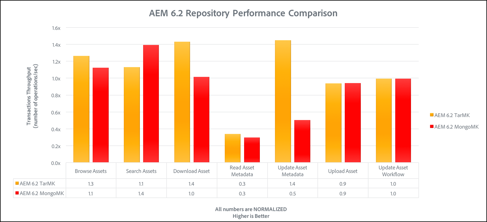

# Linee guida sulle prestazioni{#performance-guidelines}

Questa pagina fornisce linee guida generali su come ottimizzare le prestazioni della distribuzione AEM. Se hai poca esperienza con AEM, consulta le pagine seguenti prima di iniziare a leggere le linee guida sulle prestazioni:

* [Concetti di base dell’AEM](/help/sites-deploying/deploy.md#basic-concepts)
* [Panoramica sulla conservazione nell’AEM](/help/sites-deploying/storage-elements-in-aem-6.md#overview-of-storage-in-aem)
* [Distribuzioni consigliate](/help/sites-deploying/recommended-deploys.md)
* [Requisiti tecnici](/help/sites-deploying/technical-requirements.md)

Di seguito sono illustrate le opzioni di implementazione disponibili per l’AEM (scorri per visualizzare tutte le opzioni):

<table>
 <tbody>
  <tr>
   <td>
<strong>AEM</strong>
 
<strong>Prodotto</strong>
 </td>
   <td>
<strong>Topologia</strong>
 </td>
   <td>
<strong>Sistema operativo</strong>
 </td>
   <td>
<strong>Server applicazioni</strong>
 </td>
   <td>
<strong>JRE</strong>
 </td>
   <td>
<strong>Sicurezza</strong>
 </td>
   <td>
<strong>Microkernel</strong>
 </td>
   <td>
<strong>Archivio dati</strong>
 </td>
   <td>
<strong>Indicizzazione</strong>
 </td>
   <td>
<strong>Server web</strong>
 </td>
   <td>
<strong>Browser</strong>
 </td>
   <td>
<strong>Experience Cloud</strong>
 </td>
  </tr>
  <tr>
   <td>
Sites
 </td>
   <td>
Non HA
 </td>
   <td>
Windows
 </td>
   <td>
CQSE
 </td>
   <td>
Oracle
 </td>
   <td>
LDAP
 </td>
   <td>
TAR
 </td>
   <td>
Segmento
 </td>
   <td>
Proprietà
 </td>
   <td>
Apache
 </td>
   <td>
Edge
 </td>
   <td>
Destinazione
 </td>
  </tr>
  <tr>
   <td>
Risorse
 </td>
   <td>
Publish-HA
 </td>
   <td>
Solaris™
 </td>
   <td>
WebLogic
 </td>
   <td>
IBM®
 </td>
   <td>
SAML
 </td>
   <td>
MongoDB
 </td>
   <td>
File
 </td>
   <td>
Lucene
 </td>
   <td>
IIS
 </td>
   <td>
IE
 </td>
   <td>
Analisi
 </td>
  </tr>
  <tr>
   <td>
Communities
 </td>
   <td>
Author-CS
 </td>
   <td>
Cappello rosso®
 </td>
   <td>
WebSphere®
 </td>
   <td>
HP
 </td>
   <td>
Oauth
 </td>
   <td>
RDB/Oracle
 </td>
   <td>
S3/Azure
 </td>
   <td>
Solr
 </td>
   <td>
iPlanet
 </td>
   <td>
FireFox
 </td>
   <td>
Campaign
 </td>
  </tr>
  <tr>
   <td>
Moduli
 </td>
   <td>
Author-Offload
 </td>
   <td>
HP-UX
 </td>
   <td>
Tomcat
 </td>
   <td>
 
 </td>
   <td>
 
 </td>
   <td>
RDB/DB2
 </td>
   <td>
MongoDB
 </td>
   <td>
 
 </td>
   <td>
 
 </td>
   <td>
Chrome
 </td>
   <td>
Social network
 </td>
  </tr>
  <tr>
   <td>
Mobile
 </td>
   <td>
Author-Cluster
 </td>
   <td>
IBM® AIX®
 </td>
   <td>
JBoss®
 </td>
   <td>
 
 </td>
   <td>
 
 </td>
   <td>
RDB/MySQL
 </td>
   <td>
RDBMS
 </td>
   <td>
 
 </td>
   <td>
 
 </td>
   <td>
Safari
 </td>
   <td>
Pubblico
 </td>
  </tr>
  <tr>
   <td>
Multi-sito
 </td>
   <td>
ASRP
 </td>
   <td>
SUSE®
 </td>
   <td>
 
 </td>
   <td>
 
 </td>
   <td>
 
 </td>
   <td>
RDB/SQLServer
 </td>
   <td>
 
 </td>
   <td>
 
 </td>
   <td>
 
 </td>
   <td>
 
 </td>
   <td>
Risorse
 </td>
  </tr>
  <tr>
   <td>
Commerce
 </td>
   <td>
MSRP
 </td>
   <td>
APPLE OS
 </td>
   <td>
 
 </td>
   <td>
 
 </td>
   <td>
 
 </td>
   <td>
 
 </td>
   <td>
 
 </td>
   <td>
 
 </td>
   <td>
 
 </td>
   <td>
 
 </td>
   <td>
Attivazione
 </td>
  </tr>
  <tr>
   <td>
Dynamic Media
 </td>
   <td>
JSRP
 </td>
   <td>
 
 </td>
   <td>
 
 </td>
   <td>
 
 </td>
   <td>
 
 </td>
   <td>
 
 </td>
   <td>
 
 </td>
   <td>
 
 </td>
   <td>
 
 </td>
   <td>
 
 </td>
   <td>
Mobile
 </td>
  </tr>
  <tr>
   <td>
Brand Portal
 </td>
   <td>
J2E
 </td>
   <td>
 
 </td>
   <td>
 
 </td>
   <td>
 
 </td>
   <td>
 
 </td>
   <td>
 
 </td>
   <td>
 
 </td>
   <td>
 
 </td>
   <td>
 
 </td>
   <td>
 
 </td>
   <td>
 
 </td>
  </tr>
  <tr>
   <td>
AoD
 </td>
   <td>
 
 </td>
   <td>
 
 </td>
   <td>
 
 </td>
   <td>
 
 </td>
   <td>
 
 </td>
   <td>
 
 </td>
   <td>
 
 </td>
   <td>
 
 </td>
   <td>
 
 </td>
   <td>
 
 </td>
   <td>
 
 </td>
  </tr>
  <tr>
   <td>
LiveCopy
 </td>
   <td>
 
 </td>
   <td>
 
 </td>
   <td>
 
 </td>
   <td>
 
 </td>
   <td>
 
 </td>
   <td>
 
 </td>
   <td>
 
 </td>
   <td>
 
 </td>
   <td>
 
 </td>
   <td>
 
 </td>
   <td>
 
 </td>
  </tr>
  <tr>
   <td>
Screens
 </td>
   <td>
 
 </td>
   <td>
 
 </td>
   <td>
 
 </td>
   <td>
 
 </td>
   <td>
 
 </td>
   <td>
 
 </td>
   <td>
 
 </td>
   <td>
 
 </td>
   <td>
 
 </td>
   <td>
 
 </td>
   <td>
 
 </td>
  </tr>
  <tr>
   <td>
Sicurezza documento
 </td>
   <td>
 
 </td>
   <td>
 
 </td>
   <td>
 
 </td>
   <td>
 
 </td>
   <td>
 
 </td>
   <td>
 
 </td>
   <td>
 
 </td>
   <td>
 
 </td>
   <td>
 
 </td>
   <td>
 
 </td>
   <td>
 
 </td>
  </tr>
  <tr>
   <td>
Gestione processi
 </td>
   <td>
 
 </td>
   <td>
 
 </td>
   <td>
 
 </td>
   <td>
 
 </td>
   <td>
 
 </td>
   <td>
 
 </td>
   <td>
 
 </td>
   <td>
 
 </td>
   <td>
 
 </td>
   <td>
 
 </td>
   <td>
 
 </td>
  </tr>
  <tr>
   <td>
app desktop
 </td>
   <td>
 
 </td>
   <td>
 
 </td>
   <td>
 
 </td>
   <td>
 
 </td>
   <td>
 
 </td>
   <td>
 
 </td>
   <td>
 
 </td>
   <td>
 
 </td>
   <td>
 
 </td>
   <td>
 
 </td>
   <td>
 
 </td>
  </tr>
 </tbody>
</table>

>[!NOTE]
>
>Le linee guida sulle prestazioni si applicano principalmente ad AEM Sites.

## Quando utilizzare le linee guida sulle prestazioni {#when-to-use-the-performance-guidelines}

Utilizzare le linee guida sulle prestazioni nelle situazioni seguenti:

* **Prima distribuzione**: quando si pianifica di distribuire AEM Sites o Assets per la prima volta, è importante comprendere le opzioni disponibili. In particolare durante la configurazione di Micro Kernel, Node Store e Data Store (rispetto alle impostazioni predefinite). Ad esempio, modificando le impostazioni predefinite dell’archivio dati di TarMK in Archivio dati file.
* **Aggiornamento a una nuova versione**: durante l&#39;aggiornamento a una nuova versione, è importante comprendere le differenze di prestazioni rispetto all&#39;ambiente in esecuzione. Ad esempio, l’aggiornamento da AEM 6.1 a 6.2 o da AEM 6.0 CRX2 a 6.2 OAK.
* **Il tempo di risposta è lento**: quando l&#39;architettura Nodestore selezionata non soddisfa i requisiti, è importante comprendere le differenze di prestazioni rispetto ad altre opzioni di topologia. Ad esempio, distribuendo TarMK al posto di MongoMK oppure utilizzando un archivio dati di file al posto di un archivio dati di Amazon S3 o Microsoft® Azure.
* **Aggiunta di altri autori**: quando la topologia TarMK consigliata non soddisfa i requisiti di prestazioni e l&#39;upsize del nodo di authoring ha raggiunto la capacità massima disponibile, comprendere le differenze di prestazioni. Confronta con l’utilizzo di MongoMK con tre o più nodi Author. Ad esempio, distribuendo MongoMK invece di TarMK.
* **Aggiunta di altro contenuto**: quando l&#39;architettura dell&#39;archivio dati consigliata non soddisfa le tue esigenze, è importante comprendere le differenze di prestazioni rispetto ad altre opzioni dell&#39;archivio dati. Esempio: utilizzo dell’archivio dati di Amazon S3 o Microsoft® Azure invece di un archivio dati file.

## Introduzione {#introduction}

Questo capitolo offre una panoramica generale dell’architettura dell’AEM e dei suoi componenti più importanti. Fornisce inoltre linee guida per lo sviluppo e descrive gli scenari di test utilizzati nei test di benchmark TarMK e MongoMK.

### Piattaforma AEM {#the-aem-platform}

La piattaforma AEM è costituita dai seguenti elementi:

Per ulteriori informazioni sulla piattaforma AEM, vedere [Informazioni sull&#39;AEM](/help/sites-deploying/deploy.md#what-is-aem).

### Architettura dell’AEM {#the-aem-architecture}

L’attuazione dell’AEM si basa su tre importanti elementi costitutivi. **Istanza di authoring** utilizzata da autori, editor e approvatori di contenuti per creare e rivedere i contenuti. Quando il contenuto viene approvato, viene pubblicato in un secondo tipo di istanza denominato **Istanza di Publish** da cui gli utenti finali accedono. Il terzo blocco predefinito è **Dispatcher**, un modulo che gestisce il caching e il filtro degli URL e che è installato nel server Web. Per ulteriori informazioni sull&#39;architettura AEM, vedere [Scenari di distribuzione tipici](/help/sites-deploying/deploy.md#typical-deployment-scenarios).

### Microkernel {#micro-kernels}

I micro kernel fungono da gestori della persistenza nell&#39;AEM. Esistono tre tipi di micro kernel utilizzati con AEM: TarMK, MongoDB e Relational Database (con supporto limitato). La scelta di un tipo di implementazione adatto alle tue esigenze dipende dallo scopo dell’istanza e dal tipo di implementazione che stai prendendo in considerazione. Per ulteriori informazioni sui micro kernel, vedere la pagina [Distribuzioni consigliate](/help/sites-deploying/recommended-deploys.md).

### Nodestore {#nodestore}

In AEM, i dati binari possono essere memorizzati indipendentemente dai nodi di contenuto. Il percorso in cui vengono archiviati i dati binari è indicato come **Archivio dati**, mentre il percorso dei nodi di contenuto e delle proprietà è denominato **Archivio nodi**.

>[!NOTE]
>
>L’Adobe consiglia di utilizzare TarMK come tecnologia di persistenza predefinita utilizzata dai clienti sia per le istanze Autore AEM che per quelle di Publish.

>[!CAUTION]
>
>Il supporto del micro kernel del database relazionale è limitato. Contatta [l&#39;Assistenza clienti Adobe](https://experienceleague.adobe.com/?support-solution=General&amp;support-tab=homehome?lang=it#support) prima di utilizzare questo tipo di micro kernel.

### Archivio dati {#data-store}

Quando si tratta di un numero elevato di file binari, si consiglia di utilizzare un archivio dati esterno invece degli archivi nodi predefiniti per massimizzare le prestazioni. Ad esempio, se il progetto richiede molte risorse multimediali, la loro memorizzazione nel file o nell’archivio dati di Azure/S3 rende l’accesso più rapido rispetto alla loro memorizzazione direttamente in un MongoDB.

Per ulteriori dettagli sulle opzioni di configurazione disponibili, vedere [Configurazione di nodi e archivi dati](/help/sites-deploying/data-store-config.md).

>[!NOTE]
>
>Adobe consiglia di scegliere l’opzione di distribuzione dell’AEM in Azure o Amazon Web Services (AWS) utilizzando Adobe Managed Services. I clienti traggono vantaggio da un team con l’esperienza e le competenze necessarie per implementare e utilizzare AEM in questi ambienti di cloud computing. Consulta la [documentazione aggiuntiva su Adobe Managed Services](https://business.adobe.com/products/experience-manager/managed-services.html?aemClk=t).
>
>Per raccomandazioni su come distribuire l’AEM in Azure o AWS, al di fuori di Adobe Managed Services, Adobe consiglia di lavorare direttamente con il provider cloud. Oppure, collabora con uno dei partner di Adobe che supportano l’implementazione dell’AEM nell’ambiente cloud desiderato. Il fornitore o partner cloud selezionato è responsabile delle specifiche di dimensionamento, della progettazione e dell&#39;implementazione dell&#39;architettura supportata per soddisfare requisiti specifici di prestazioni, carico, scalabilità e sicurezza.
>
>>Consulta anche la pagina [requisiti tecnici](/help/sites-deploying/technical-requirements.md#supported-platforms).

### Ricerca {#search-features}

In questa sezione sono elencati i provider di indice personalizzati utilizzati con AEM. Per ulteriori informazioni sull&#39;indicizzazione, vedere [Query e indicizzazione Oak](/help/sites-deploying/queries-and-indexing.md).

>[!NOTE]
>
>Per la maggior parte delle distribuzioni, Adobe consiglia di utilizzare l’indice Lucene. Utilizza Solr solo per la scalabilità in implementazioni specializzate e complesse.

### Linee guida per lo sviluppo {#development-guidelines}

Sviluppo per AEM con obiettivo di **prestazioni e scalabilità**. Di seguito sono riportate le best practice che è possibile seguire:

**DO**

* Applicare la separazione di presentazione, logica e contenuto
* Utilizzare le API AEM esistenti (ad es. Sling) e gli strumenti (ad es. Replication)
* Sviluppa nel contesto di contenuti effettivi
* Sviluppo per una migliore capacità di memorizzazione in cache
* Riduci al minimo il numero di salvataggi (ad esempio, utilizzando flussi di lavoro transitori)
* Assicurati che tutti gli endpoint HTTP siano RESTful
* Limitare l’ambito dell’osservazione JCR
* Presta attenzione al thread asincrono

**NON**

* Non utilizzare direttamente le API JCR, se possibile
* Non modificare /libs, ma utilizzare le sovrapposizioni
* Non utilizzare le query dove possibile
* Non utilizzare le associazioni Sling per ottenere i servizi OSGi nel codice Java™, ma utilizza:

   * @Reference in un componente DS
   * @Inject in un modello Sling
   * sling.getService() in una classe Sightly Use
   * sling.getService() in una JSP
   * a ServiceTracker
   * accesso diretto al registro del servizio OSGi

Per ulteriori dettagli sullo sviluppo in AEM, leggere [Sviluppo - Nozioni di base](/help/sites-developing/the-basics.md). Per ulteriori best practice, consulta [Best practice per lo sviluppo](/help/sites-developing/best-practices.md).

### Scenari di benchmark {#benchmark-scenarios}

>[!NOTE]
>
>Tutti i test di benchmark mostrati in questa pagina sono stati eseguiti in laboratorio.

Gli scenari di test dettagliati di seguito sono utilizzati per le sezioni di benchmark dei capitoli TarMK, MongoMk e TarMK vs MongoMk. Per visualizzare lo scenario utilizzato per un particolare test di benchmark, leggere il campo Scenario dalla tabella [Specifiche tecniche](/help/sites-deploying/performance-guidelines.md#tarmk-performance-benchmark).

**Scenario per singolo prodotto**

AEM Assets:

* Interazioni utente: Sfoglia Assets / Cerca Assets / Scarica risorsa / Leggi metadati risorsa / Aggiorna metadati risorsa / Carica risorsa / Esegui il flusso di lavoro Carica risorsa
* Modalità di esecuzione: utenti simultanei, singola interazione per utente

**Scenario prodotti misti**

AEM Sites + Assets:

* Interazioni utente su Sites: leggi pagina articolo / leggi pagina / crea paragrafo / modifica paragrafo / crea pagina contenuto / attiva pagina contenuto / crea ricerca
* Interazioni degli utenti di Assets: Sfoglia Assets / Cerca Assets / Scarica risorsa / Leggi metadati risorsa / Aggiorna metadati risorsa / Carica risorsa / Esegui il flusso di lavoro Carica risorsa
* Modalità di esecuzione: utenti simultanei, interazioni miste per utente

**Scenario di utilizzo verticale**

Contenuti multimediali:

* `Read Article Page (27.4%), Read Page (10.9%), Create Session (2.6%), Activate Content Page (1.7%), Create Content Page (0.4%), Create Paragraph (4.3%), Edit Paragraph (0.9%), Image Component (0.9%), Browse Assets (20%), Read Asset Metadata (8.5%), Download Asset (4.2%), Search Asset (0.2%), Update Asset Metadata (2.4%), Upload Asset (1.2%), Browse Project (4.9%), Read Project (6.6%), Project Add Asset (1.2%), Project Add Site (1.2%), Create Project (0.1%), Author Search (0.4%)`
* Modalità di esecuzione: utenti simultanei, interazioni miste per utente

## TarMK {#tarmk}

Questo capitolo fornisce le linee guida generali sulle prestazioni per TarMK specificando i requisiti minimi dell’architettura e la configurazione delle impostazioni. Vengono inoltre fornite prove comparative per ulteriori chiarimenti.

L’Adobe consiglia di utilizzare TarMK come tecnologia di persistenza predefinita utilizzata dai clienti in tutti gli scenari di implementazione, sia per le istanze di creazione AEM che per quelle di Publish.

Per ulteriori informazioni su TarMK, vedere [Scenari di distribuzione](/help/sites-deploying/recommended-deploys.md#deployment-scenarios) e [Archiviazione Tar](/help/sites-deploying/storage-elements-in-aem-6.md#tar-storage).

### Linee guida sull’architettura minima di TarMK {#tarmk-minimum-architecture-guidelines}

>[!NOTE]
>
>Le linee guida dell’architettura minima presentate di seguito si riferiscono agli ambienti di produzione e ai siti con traffico elevato. Queste linee guida sono **not** le [specifiche minime](/help/sites-deploying/technical-requirements.md#prerequisites) per eseguire AEM.

Per stabilire buone prestazioni quando si utilizza TarMK, è necessario partire dalla seguente architettura:

* Un’istanza Autore
* Due istanze di Publish
* Due dispatcher

Di seguito sono illustrate le linee guida sull’architettura dei siti AEM e AEM Assets.

>[!NOTE]
>
>La replica senza binario deve essere attivata **ON** se l&#39;archivio dati file è condiviso.

**Linee guida sull&#39;architettura Tar per AEM Sites**

**Linee guida sull&#39;architettura Tar per AEM Assets**

### Linee guida per le impostazioni TarMK {#tarmk-settings-guideline}

Per ottenere prestazioni ottimali, attieniti alle linee guida per le impostazioni riportate di seguito. Per istruzioni su come modificare le impostazioni, [consulta questa pagina](https://experienceleague.adobe.com/docs/experience-manager-65/deploying/configuring/configuring-performance.html?lang=it).

<table>
 <tbody>
  <tr>
   <td><strong>Impostazione</strong></td>
   <td><strong>Parametro</strong></td>
   <td><strong>Valore</strong></td>
   <td><strong>Descrizione</strong></td>
  </tr>
  <tr>
   <td>Code processi Sling</td>
   <td><code>queue.maxparallel</code></td>
   <td>Impostare il valore su metà del numero di core della CPU. </td>
   <td>Per impostazione predefinita, il numero di thread simultanei per coda processi è uguale al numero di core CPU.</td>
  </tr>
  <tr>
   <td>Coda del flusso di lavoro transitorio Granite</td>
   <td><code>Max Parallel</code></td>
   <td>Imposta il valore su metà del numero di core della CPU</td>
   <td> </td>
  </tr>
  <tr>
   <td>Parametri JVM</td>
   <td>
<code>Doak.queryLimitInMemory</code>
 
<code>Doak.queryLimitReads</code>
 
<code>Dupdate.limit</code>
 
<code>Doak.fastQuerySize</code>
 </td>
   <td>
500000
 
100000
 
250000
 
Vero
 </td>
   <td>Per evitare che query estese sovraccarichi i sistemi, aggiungi questi parametri JVM nello script iniziale dell’AEM.</td>
  </tr>
  <tr>
   <td>Configurazione dell’indice Lucene</td>
   <td>
<code>CopyOnRead</code>
 
<code>CopyOnWrite</code>
 
<code>Prefetch Index Files</code>
 </td>
   <td>
Abilitato
 
Abilitato
 
Abilitato
 </td>
   <td>Per ulteriori dettagli sui parametri disponibili, vedere <a href="https://jackrabbit.apache.org/oak/docs/query/lucene.html">questa pagina</a>.</td>
  </tr>
  <tr>
   <td>Archivio dati = Archivio dati S3</td>
   <td>
<code>maxCachedBinarySize</code>
 
<code>cacheSizeInMB</code>
 </td>
   <td>
1048576 (1 MB) o inferiore
 
2-10% della dimensione heap massima
 </td>
   <td>Vedi anche <a href="/help/sites-deploying/data-store-config.md#data-store-configurations">Configurazioni archivio dati</a>.</td>
  </tr>
  <tr>
   <td>Flusso di lavoro Aggiorna risorsa DAM</td>
   <td><code>Transient Workflow</code></td>
   <td>selezionato</td>
   <td>Questo flusso di lavoro gestisce l’aggiornamento delle risorse.</td>
  </tr>
  <tr>
   <td>Writeback di metadati DAM</td>
   <td><code>Transient Workflow</code></td>
   <td>selezionato</td>
   <td>Questo flusso di lavoro gestisce il write-back dell’XMP nel file binario originale e imposta la data dell’ultima modifica in JCR.</td>
  </tr>
 </tbody>
</table>

### Benchmark delle prestazioni TarMK {#tarmk-performance-benchmark}

#### Specifiche tecniche {#technical-specifications}

I test di riferimento sono stati eseguiti sulle seguenti specifiche:

| | **Nodo autore** |
|---|---|
| Server | Hardware Bare Metal (HP) |
| Sistema operativo | Red Hat® Linux® |
| CPU/core | CPU Intel(R) Xeon(R) E5-2407 @2.40GHz, 8 core |
| RAM | 32 GB |
| Disco | Magnetico |
| Java™ | Oracle JRE versione 8 |
| Heap JVM | 16 GB |
| Prodotto | AEM 6.2 |
| Nodestore | TarMK |
| Archivio dati | DS file |
| Scenario | Prodotto singolo: thread simultanei Assets/30 |

#### Risultati benchmark prestazioni {#performance-benchmark-results}

>[!NOTE]
>
>I numeri presentati di seguito sono stati normalizzati a 1 come linea di base e non sono i numeri di throughput effettivi.

 

## MongoMK {#mongomk}

Il motivo principale per scegliere il back-end di persistenza MongoMK su TarMK è quello di scalare le istanze orizzontalmente. Questa funzionalità significa disporre di due o più istanze di authoring attive sempre in esecuzione e utilizzare MongoDB come sistema di storage di persistenza. La necessità di eseguire più di un’istanza di authoring deriva in genere dal fatto che la capacità di CPU e di memoria di un singolo server, che supporta tutte le attività di authoring simultanee, non è più sostenibile.

Per ulteriori informazioni su TarMK, vedere [Scenari di distribuzione](/help/sites-deploying/recommended-deploys.md#deployment-scenarios) e [Archiviazione Mongo](/help/sites-deploying/storage-elements-in-aem-6.md#mongo-storage).

### Linee guida sull’architettura minima di MongoMK {#mongomk-minimum-architecture-guidelines}

Per stabilire buone prestazioni quando si utilizza MongoMK, è necessario partire dalla seguente architettura:

* Tre istanze di authoring
* Due istanze di Publish
* Tre istanze MongoDB
* Due dispatcher

>[!NOTE]
>
>Negli ambienti di produzione, MongoDB viene sempre utilizzato come set di repliche con un database primario e due database secondari. Le letture e le scritture vanno al primario e le letture possono andare ai secondari. Se l&#39;archiviazione non è disponibile, è possibile sostituire uno dei database secondari con un arbitro, ma i set di repliche MongoDB devono essere sempre composti da un numero dispari di istanze.

>[!NOTE]
>
>La replica senza binario deve essere attivata **ON** se l&#39;archivio dati file è condiviso.

### Linee guida per le impostazioni MongoMK {#mongomk-settings-guidelines}

Per ottenere prestazioni ottimali, attieniti alle linee guida per le impostazioni riportate di seguito. Per istruzioni su come modificare le impostazioni, [consulta questa pagina](https://experienceleague.adobe.com/docs/experience-manager-65/deploying/configuring/configuring-performance.html?lang=it).

<table>
 <tbody>
  <tr>
   <td><strong>Impostazione</strong></td>
   <td><strong>Parametro</strong></td>
   <td><strong>Valore (predefinito)</strong></td>
   <td><strong>Descrizione</strong></td>
  </tr>
  <tr>
   <td>Code processi Sling</td>
   <td><code>queue.maxparallel</code></td>
   <td>Impostare il valore su metà del numero di core della CPU. </td>
   <td>Per impostazione predefinita, il numero di thread simultanei per coda processi è uguale al numero di core CPU.</td>
  </tr>
  <tr>
   <td>Coda del flusso di lavoro transitorio Granite</td>
   <td><code>Max Parallel</code></td>
   <td>Impostare il valore su metà del numero di core della CPU.</td>
   <td> </td>
  </tr>
  <tr>
   <td>Parametri JVM</td>
   <td>
<code>Doak.queryLimitInMemory</code>
 
<code>Doak.queryLimitReads</code>
 
<code>Dupdate.limit</code>
 
<code>Doak.fastQuerySize</code>
 
<code>Doak.mongo.maxQueryTimeMS</code>
 </td>
   <td>
500000
 
100000
 
250000
 
Vero
 
60000
 </td>
   <td>Per evitare che query estese sovraccarichi i sistemi, aggiungi questi parametri JVM nello script iniziale dell’AEM.</td>
  </tr>
  <tr>
   <td>Configurazione dell’indice Lucene</td>
   <td>
<code>CopyOnRead</code>
 
<code>CopyOnWrite</code>
 
<code>Prefetch Index Files</code>
 </td>
   <td>
Abilitato
 
Abilitato
 
Abilitato
 </td>
   <td>Per ulteriori dettagli sui parametri disponibili, vedere <a href="https://jackrabbit.apache.org/oak/docs/query/lucene.html">questa pagina</a>.</td>
  </tr>
  <tr>
   <td>Archivio dati = Archivio dati S3</td>
   <td>
<code>maxCachedBinarySize</code>
 
<code>cacheSizeInMB</code>
 </td>
   <td>
1048576 (1 MB) o inferiore
 
2-10% della dimensione heap massima
 </td>
   <td>Vedi anche <a href="/help/sites-deploying/data-store-config.md#data-store-configurations">Configurazioni archivio dati</a>.</td>
  </tr>
  <tr>
   <td>DocumentNodeStoreService</td>
   <td>
<code>cache</code>
 
<code>nodeCachePercentage</code>
 
<code>childrenCachePercentage</code>
 
<code>diffCachePercentage</code>
 
<code>docChildrenCachePercentage</code>
 
<code>prevDocCachePercentage</code>
 
<code>persistentCache</code>
 </td>
   <td>
2048
 
35 (25)
 
20 (10)
 
30 (5)
 
10 (3)
 
4 (4)
 
./cache,size=2048,binario=0,-compatto,-compress
 </td>
   <td>
La dimensione predefinita della cache è impostata su 256 MB.
 
Ha un impatto sul tempo necessario per eseguire l’annullamento della validità della cache.
 </td>
  </tr>
  <tr>
   <td>osservazione oak</td>
   <td>
<code>thread pool</code>
 
<code>length</code>
 </td>
   <td>
min e max = 20
 
50000
 </td>
   <td> </td>
  </tr>
 </tbody>
</table>

### Benchmark delle prestazioni MongoMK {#mongomk-performance-benchmark}

### Specifiche tecniche {#technical-specifications-1}

I test di riferimento sono stati eseguiti sulle seguenti specifiche:

| | **Nodo autore** | **Nodo MongoDB** |
|---|---|---|
| Server | Hardware Bare Metal (HP) | Hardware Bare Metal (HP) |
| Sistema operativo | Red Hat® Linux® | Red Hat® Linux® |
| CPU/core | CPU Intel(R) Xeon(R) E5-2407 @2.40GHz, 8 core | CPU Intel(R) Xeon(R) E5-2407 @2.40GHz, 8 core |
| RAM | 32 GB | 32 GB |
| Disco | Magnetico - >1.000 IOPS | Magnetico - >1.000 IOPS |
| Java™ | Oracle JRE versione 8 | N/D |
| Heap JVM | 16 GB | N/D |
| Prodotto | AEM 6.2 | MongoDB 3.2 WiredTiger |
| Nodestore | MongoMK | N/D |
| Archivio dati | DS file | N/D |
| Scenario | Prodotto singolo: thread simultanei Assets/30 | Prodotto singolo: thread simultanei Assets/30 |

### Risultati benchmark prestazioni {#performance-benchmark-results-1}

>[!NOTE]
>
>I numeri presentati di seguito sono stati normalizzati a 1 come linea di base e non sono i numeri di throughput effettivi.

 

## TarMK e MongoMK {#tarmk-vs-mongomk}

La regola di base da tenere in considerazione quando si sceglie tra i due è che TarMK è progettato per le prestazioni, mentre MongoMK è utilizzato per la scalabilità. L’Adobe consiglia di utilizzare TarMK come tecnologia di persistenza predefinita utilizzata dai clienti in tutti gli scenari di implementazione, sia per le istanze di creazione AEM che per quelle di Publish.

Il motivo principale per scegliere il back-end di persistenza MongoMK su TarMK è quello di scalare le istanze orizzontalmente. Questa funzionalità significa disporre di due o più istanze di authoring attive sempre in esecuzione e utilizzare MongoDB come sistema di storage di persistenza. La necessità di eseguire più di un’istanza di authoring deriva in genere dal fatto che la capacità di CPU e di memoria di un singolo server, che supporta tutte le attività di authoring simultanee, non è più sostenibile.

Per ulteriori dettagli su TarMK rispetto a MongoMK, vedi [Distribuzioni consigliate](/help/sites-deploying/recommended-deploys.md#microkernels-which-one-to-use).

### Linee guida per TarMK e MongoMk {#tarmk-vs-mongomk-guidelines}

**Vantaggi di TarMK**

* Progettato appositamente per le applicazioni di gestione dei contenuti
* I file sono sempre coerenti e possono essere sottoposti a backup utilizzando qualsiasi strumento di backup basato su file
* Fornisce un meccanismo di failover. Per ulteriori dettagli, vedere [Standby a freddo](/help/sites-deploying/tarmk-cold-standby.md)
* Fornisce prestazioni elevate e storage affidabile dei dati con un sovraccarico operativo minimo
* Riduzione del TCO (costo totale di proprietà)

**Criteri per scegliere MongoMK**

* Numero di utenti con nome connessi in un giorno: in migliaia o più
* Numero di utenti simultanei: in centinaia o più
* Volume di acquisizioni di risorse al giorno: in centinaia di migliaia o più
* Volume di modifiche di pagina al giorno: in centinaia di migliaia o più
* Volume di ricerche al giorno: in decine di migliaia o più

### Confronto tra TarMK e i benchmark MongoMK {#tarmk-vs-mongomk-benchmarks}

>[!NOTE]
>
>I numeri riportati di seguito sono stati normalizzati a 1 come linea di base e non sono numeri di throughput effettivi.

### Scenario 1 - Specifiche tecniche {#scenario-technical-specifications}

<table>
 <tbody>
  <tr>
   <td><strong> </strong></td>
   <td><strong>Nodo Author OAK</strong></td>
   <td><strong>Nodo MongoDB</strong></td>
   <td> </td>
  </tr>
  <tr>
   <td>Server</td>
   <td>Hardware Bare Metal (HP)</td>
   <td>Hardware Bare Metal (HP)</td>
   <td> </td>
  </tr>
  <tr>
   <td>Sistema operativo</td>
   <td>Red Hat® Linux®</td>
   <td>Red Hat® Linux®</td>
   <td> </td>
  </tr>
  <tr>
   <td>CPU/core</td>
   <td>CPU Intel(R) Xeon(R) E5-2407 @2.40GHz, 8 core</td>
   <td>CPU Intel(R) Xeon(R) E5-2407 @2.40GHz, 8 core</td>
   <td> </td>
  </tr>
  <tr>
   <td>RAM</td>
   <td>32 GB</td>
   <td>32 GB</td>
   <td> </td>
  </tr>
  <tr>
   <td>Disco</td>
   <td>Magnetico - &gt;1.000 IOPS</td>
   <td>Magnetico - &gt;1.000 IOPS</td>
   <td> </td>
  </tr>
  <tr>
   <td>Java™</td>
   <td>Oracle JRE versione 8</td>
   <td>N/D</td>
   <td> </td>
  </tr>
  <tr>
   <td>Heap JVM 16 GB</td>
   <td>16 GB</td>
   <td>N/D</td>
   <td> </td>
  </tr>
  <tr>
   <td>Prodotto </td>
   <td>AEM 6.2</td>
   <td>MongoDB 3.2 WiredTiger</td>
   <td> </td>
  </tr>
  <tr>
   <td>Nodestore</td>
   <td>TarMK o MongoMK</td>
   <td>N/D</td>
   <td> </td>
  </tr>
  <tr>
   <td>Archivio dati</td>
   <td>DS file </td>
   <td>N/D</td>
   <td> </td>
  </tr>
  <tr>
   <td>Scenario</td>
   <td>
  Singolo prodotto: Assets / 30 thread simultanei per esecuzione
 </td>
   <td> </td>
   <td> </td>
  </tr>
 </tbody>
</table>

### Risultati del benchmark delle prestazioni dello scenario 1 {#scenario-performance-benchmark-results}

### Scenario 2 - Specifiche tecniche {#scenario-technical-specifications-1}

>[!NOTE]
>
>Per abilitare lo stesso numero di autori con MongoDB come con un sistema TarMK, è necessario un cluster con due nodi AEM. Un cluster MongoDB a quattro nodi può gestire un numero di autori pari a 1,8 volte quello di un’istanza TarMK. Un cluster MongoDB a otto nodi può gestire un numero di autori 2,3 volte superiore a quello di un’istanza TarMK.

<table>
 <tbody>
  <tr>
   <td><strong> </strong></td>
   <td><strong>Nodo Author TarMK</strong></td>
   <td><strong>Nodo MongoMK dell’autore</strong></td>
   <td><strong>Nodo MongoDB</strong></td>
  </tr>
  <tr>
   <td>Server</td>
   <td>AWS c3.8xlarge</td>
   <td>AWS c3.8xlarge</td>
   <td>AWS c3.8xlarge</td>
  </tr>
  <tr>
   <td>Sistema operativo</td>
   <td>Red Hat® Linux®</td>
   <td>Red Hat® Linux®</td>
   <td>Red Hat® Linux®</td>
  </tr>
  <tr>
   <td>CPU/core</td>
   <td>32</td>
   <td>32</td>
   <td>32</td>
  </tr>
  <tr>
   <td>RAM</td>
   <td>60 GB</td>
   <td>60 GB</td>
   <td>60 GB</td>
  </tr>
  <tr>
   <td>Disco</td>
   <td>SSD - IOPS 10.000</td>
   <td>SSD - IOPS 10.000</td>
   <td>SSD - IOPS 10.000</td>
  </tr>
  <tr>
   <td>Java™</td>
   <td>Oracle JRE versione 8</td>
   <td>  Oracle JRE versione 8</td>
   <td>N/D</td>
  </tr>
  <tr>
   <td>Heap JVM 16 GB</td>
   <td>30 GB</td>
   <td>30 GB</td>
   <td>N/D</td>
  </tr>
  <tr>
   <td>Prodotto </td>
   <td>AEM 6.2</td>
   <td>AEM 6.2</td>
   <td>  MongoDB 3.2 WiredTiger</td>
  </tr>
  <tr>
   <td>Nodestore</td>
   <td>TarMK </td>
   <td>MongoMK</td>
   <td>  N/D</td>
  </tr>
  <tr>
   <td>Archivio dati</td>
   <td>DS file </td>
   <td>  DS file</td>
   <td>  N/D</td>
  </tr>
  <tr>
   <td>Scenario</td>
   <td>
    Caso di utilizzo verticale: thread simultanei Media/2000
 </td>
   <td></td>
   <td></td>
  </tr>
 </tbody>
</table>

### Risultati del benchmark delle prestazioni dello scenario 2 {#scenario-performance-benchmark-results-1}

### Linee guida per la scalabilità dell&#39;architettura per AEM Sites e Assets {#architecture-scalability-guidelines-for-aem-sites-and-assets}

## Riepilogo delle linee guida sulle prestazioni  {#summary-of-performance-guidelines}

Le linee guida presentate in questa pagina possono essere riassunte come segue:

* **TarMK con archivio dati file** - Architettura consigliata per la maggior parte dei clienti:

   * Topologia minima: un’istanza Author, due istanze Publish, due Dispatcher
   * Replica senza binari attivata se l&#39;archivio dati file è condiviso

* **MongoMK con archivio dati file** - Architettura consigliata per la scalabilità orizzontale del livello di authoring:

   * Topologia minima: tre istanze Author, tre istanze MongoDB, due istanze Publish, due Dispatcher
   * Replica senza binari attivata se l&#39;archivio dati file è condiviso

* **Nodestore** - Archiviato nel disco locale, non in un NAS (Network Attached Storage)
* Quando si utilizza **Amazon S3**:

   * L’archivio dati Amazon S3 è condiviso tra il livello Author e Publish
   * È necessario attivare la replica senza binario
   * La raccolta oggetti inattivi del datastore richiede una prima esecuzione su tutti i nodi Author e Publish, quindi una seconda esecuzione su Author

* **L&#39;indice personalizzato deve essere creato in aggiunta all&#39;indice predefinito**, in base alle ricerche più comuni

   * Gli indici Lucene devono essere utilizzati per gli indici personalizzati

* **La personalizzazione del flusso di lavoro può migliorare notevolmente le prestazioni**. Rimuovere il passaggio video nel flusso di lavoro &quot;Aggiorna risorsa&quot;, disabilitare i listener non utilizzati e così via.

Per ulteriori dettagli, leggere anche la pagina [Distribuzioni consigliate](/help/sites-deploying/recommended-deploys.md).
