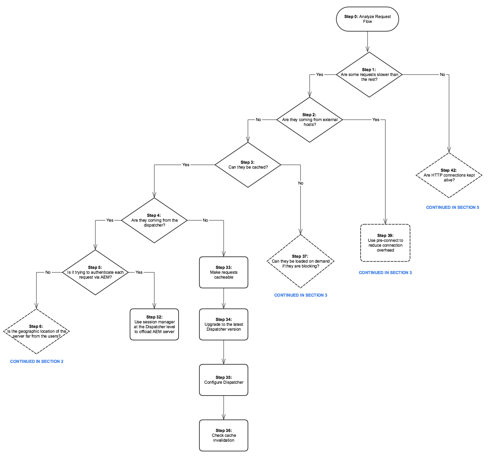

# Albero prestazioni{#performance-tree}

## Ambito {#scope}

Il diagramma seguente ha lo scopo di fornire indicazioni sui passaggi da eseguire per risolvere i problemi di prestazioni. È suddiviso in cinque sezioni per facilitarne la lettura.

Ogni passaggio nel diagramma è collegato a una risorsa di documentazione o a un consiglio.

## Prerequisiti e presupposti {#prerequisites-and-assumptions}

Si presume che in una determinata pagina (una console AEM o una pagina web) venga rilevato un problema di prestazioni che può essere riprodotto in modo coerente. Prima di avviare l’indagine è necessario disporre di un modo per testare o monitorare le prestazioni.

L’analisi inizia dal passaggio 0. L’obiettivo è determinare quale entità (Dispatcher, host esterno o AEM) è responsabile del problema di prestazioni, quindi determinare quale area (server o rete) deve essere esaminata.

### Sezione 1 {#section}

### Sezione 2 {#section-1}

### Sezione 3 {#section-2}

### Sezione 4 {#section-3}

### Sezione 5 {#section-4}

## Collegamenti di riferimento {#reference-links}

<table>
 <tbody>
  <tr>
   <td><strong>Passaggio</strong></td>
   <td><strong>Titolo</strong></td>
   <td><strong>Riferimenti</strong></td>
  </tr>
  <tr>
   <td><strong>Passaggio 0</strong></td>
   <td>Analizza flusso di richieste</td>
   <td>
Puoi utilizzare l’analisi standard delle richieste HTTP nel browser per analizzare il flusso delle richieste. Per ulteriori informazioni su come eseguire questa analisi su Chrome, consulta:  
 
<a href="https://developers.google.com/web/tools/chrome-devtools/profile/network-performance/resource-loading">https://developer.chrome.com/docs/devtools/</a>  
 </td>
  </tr>
  <tr>
   <td><strong>Passaggio 2</strong></td>
   <td>Le richieste provengono da host esterni?</td>
   <td>Puoi utilizzare l’analisi standard delle richieste HTTP nel browser per analizzare il flusso delle richieste. Consulta i collegamenti riportati sopra su come eseguire questa analisi su Chrome.  </td>
  </tr>
  <tr>
   <td><strong>Passaggio 3</strong></td>
   <td>Le richieste possono essere memorizzate nella cache?</td>
   <td>Per ulteriori informazioni sulle richieste memorizzabili in cache e consigli generali sull’ottimizzazione delle prestazioni di Dispatcher, consulta <a href="/help/sites-deploying/configuring-performance.md#optimizing-performance-when-using-the-dispatcher">Ottimizzazione delle prestazioni del Dispatcher</a>.</td>
  </tr>
  <tr>
   <td><strong>Passaggio 4</strong></td>
   <td>Le richieste provengono da Dispatcher?</td>
   <td>
Per verificare se le richieste sono memorizzate correttamente nella cache, seleziona la <a href="https://experienceleague.adobe.com/docs/experience-manager-dispatcher/using/configuring/dispatcher-configuration.html?lang=en#debugging">Documentazione sul debug di Dispatcher</a>.  
 </td>
  </tr>
  <tr>
   <td><strong>Passaggio 5</strong></td>
   <td>Dispatcher sta tentando di autenticare ogni richiesta tramite AEM?</td>
   <td>Controlla se Dispatcher invia <code>HEAD</code> richiede all’AEM l’autenticazione prima di consegnare la risorsa memorizzata in cache. Cerca <code>HEAD</code> Richieste in seno all'AEM <code>access.log</code>. Per ulteriori informazioni, consulta <a href="/help/sites-deploying/configure-logging.md">Registrazione</a>.  </td>
  </tr>
  <tr>
   <td><strong>Passaggio 6</strong></td>
   <td>La posizione geografica del Dispatcher è molto lontana dagli utenti?</td>
   <td>Avvicina Dispatcher agli utenti.</td>
  </tr>
  <tr>
   <td><strong>Passaggio 7</strong></td>
   <td>Il livello di rete del Dispatcher è corretto?</td>
   <td>  Esaminate il livello di rete per individuare eventuali problemi di saturazione e latenza.
 
 </td>
  </tr>
  <tr>
   <td><strong>Passaggio 8</strong></td>
   <td>La lentezza è riproducibile con un’istanza locale?</td>
   <td>  
Utilizzare <a href="/help/sites-developing/tough-day.md">Giornata difficile</a> per replicare condizioni "reali" dalle istanze di produzione. Se questo scenario non è realistico per lo spazio di sviluppo, assicurati di testare l’istanza di produzione (o un’istanza di staging identica) in un contesto di rete diverso.  
 </td>
  </tr>
  <tr>
   <td><strong>Passaggio 9</strong></td>
   <td>La posizione geografica del server è lontana dagli utenti?</td>
   <td>Avvicina il server agli utenti.</td>
  </tr>
  <tr>
   <td><strong>Passaggi 10 e 29</strong></td>
   <td>Analizzare il livello di rete</td>
   <td>
Esaminate il livello di rete per individuare eventuali problemi di saturazione e latenza.
 
Per il livello di authoring, si consiglia di non superare i 100 millisecondi.
 
Per ulteriori informazioni sui suggerimenti di ottimizzazione delle prestazioni, consulta <a href="https://helpx.adobe.com/customer-care-office-hours/aem/6x-performance-tuning-best-practices.html">questa pagina</a>.
 </td>
  </tr>
  <tr>
   <td><strong>Passaggio 11</strong></td>
   <td>Avvicinare il server o aggiungerne uno per area</td>
   <td> </td>
  </tr>
  <tr>
   <td><strong>Passaggio 12</strong></td>
   <td>Risoluzione dei problemi del server AEM</td>
   <td>Per ulteriori informazioni, controllare i seguenti passaggi secondari nel diagramma.</td>
  </tr>
  <tr>
   <td><strong>Passaggio 13</strong></td>
   <td>Verifica i requisiti hardware</td>
   <td>Consulta la documentazione su <a href="/help/managing/hardware-sizing-guidelines.md">Linee guida per il dimensionamento dell'hardware</a>.  </td>
  </tr>
  <tr>
   <td><strong>Passaggio 14</strong></td>
   <td>Verificare la presenza di cause frequenti di problemi di prestazioni</td>
   <td> </td>
  </tr>
  <tr>
   <td><strong>Passaggio 15</strong></td>
   <td>Trovare richieste lente</td>
   <td>
Puoi verificare la presenza di richieste lente analizzando <code>request.log</code> o utilizzando <code>rlog.jar</code>.
 
Per ulteriori informazioni sull’utilizzo di rlog.jar, consulta questa pagina.
 
Consulta <a href="/help/sites-deploying/monitoring-and-maintaining.md#using-rlog-jar-to-find-requests-with-long-duration-times">Trovare richieste con tempi di esecuzione lunghi utilizzando rlog.jar</a>.  
 
 
 </td>
  </tr>
  <tr>
   <td><strong>Passaggio 16</strong></td>
   <td>Server dei profili</td>
   <td>
Per informazioni sugli strumenti di profilatura utilizzabili con AEM, consulta <a href="/help/sites-deploying/monitoring-and-maintaining.md#tools-for-monitoring-and-analyzing-performance">Strumenti per il monitoraggio e l'analisi delle prestazioni</a>.  
 </td>
  </tr>
  <tr>
   <td><strong>Passaggio 17</strong></td>
   <td>Trovare metodi lenti nella profilatura</td>
   <td> </td>
  </tr>
  <tr>
   <td><strong>Passaggio 18</strong></td>
   <td>Scenari comuni di profilazione</td>
   <td>Consulta <a href="/help/sites-deploying/monitoring-and-maintaining.md#analyzing-specific-scenarios">Analisi di scenari specifici</a> nella sezione Ottimizzazione delle prestazioni.  </td>
  </tr>
  <tr>
   <td><strong>Passaggio 19</strong></td>
   <td>CPU 100%</td>
   <td><a href="/help/sites-deploying/monitoring-and-maintaining.md#monitoring-performance">https://experienceleague.adobe.com/docs/experience-manager-release-information/aem-release-updates/previous-updates/aem-previous-versions.html?lang=it</a></td>
  </tr>
  <tr>
   <td><strong>Passaggio 20</strong></td>
   <td>Memoria insufficiente</td>
   <td> 
    <ol>
     <li><a href="/help/sites-deploying/monitoring-and-maintaining.md#out-of-memory">Memoria insufficiente</a></li>
     <li><a href="/help/sites-deploying/troubleshooting.md">La mia applicazione genera errori di memoria insufficiente</a></li>
     <li><a href="https://experienceleague.adobe.com/docs/experience-cloud-kcs/kbarticles/KA-17482.html?lang=en">Analizzare i problemi di memoria.</a>  </li>
    </ol> </td>
  </tr>
  <tr>
   <td><strong>Passaggio 21</strong></td>
   <td>I/O disco</td>
   <td>
Consulta la <a href="/help/sites-deploying/monitoring-and-maintaining.md#disk-i-o">I/O disco</a> nella documentazione di Monitoraggio e manutenzione.
 </td>
  </tr>
  <tr>
   <td><strong>Passaggi 22 e 22.1</strong></td>
   <td>Proporzione cache</td>
   <td>Consulta <a href="/help/sites-deploying/configuring-performance.md#calculating-the-dispatcher-cache-ratio">Calcolo del rapporto della cache di Dispatcher</a>.    </td>
  </tr>
  <tr>
   <td><strong>Passaggio 23</strong></td>
   <td>Query lente</td>
   <td><a href="/help/sites-deploying/best-practices-for-queries-and-indexing.md">Best practice per query e indicizzazione</a></td>
  </tr>
  <tr>
   <td><strong>Passaggio 24</strong></td>
   <td>Ottimizzazione dell’archivio</td>
   <td>
    <ul>
     <li><a href="https://helpx.adobe.com/customer-care-office-hours/aem/6x-performance-tuning-best-practices.html">Suggerimenti per l'ottimizzazione delle prestazioni</a></li>
     <li><a href="/help/sites-deploying/configuring-performance.md#configuring-for-performance">Configurazione per le prestazioni</a></li>
     <li><a href="https://www.slideshare.net/jukka/repository-performance-tuning">Ottimizzazione prestazioni archivio</a></li>
    </ul> </td>
  </tr>
  <tr>
   <td><strong>Passaggio 25</strong></td>
   <td>Flussi di lavoro in esecuzione</td>
   <td>
    <ul>
     <li><a href="/help/sites-deploying/configuring-performance.md#concurrent-workflow-processing">Elaborazione flusso di lavoro simultaneo</a></li>
     <li><a href="/help/sites-deploying/configuring-performance.md#configure-the-queue-for-a-specific-workflow">Configurare la coda per un flusso di lavoro specifico</a></li>
     <li><a href="/help/sites-administering/workflows-administering.md#regular-purging-of-workflow-instances">Rimozione regolare delle istanze del flusso di lavoro</a></li>
     <li><a href="/help/sites-developing/workflows.md#transient-workflows">Flussi di lavoro transitori</a>  </li>
    </ul> 
 
 </td>
  </tr>
  <tr>
   <td><strong>Passaggio 26</strong></td>
   <td>Infrastruttura MSM</td>
   <td>
<a href="/help/sites-administering/msm-best-practices.md">Best practice per il gestore multisito</a>  
 </td>
  </tr>
  <tr>
   <td><strong>Passaggio 27</strong></td>
   <td>Ottimizzazione risorse</td>
   <td>
    <ol>
     <li><a href="/help/sites-deploying/configuring-performance.md#cq-dam-asset-synchronization-service">Servizio di sincronizzazione risorse</a></li>
     <li><a href="/help/sites-deploying/configuring-performance.md#multiple-dam-instances">Più istanze DAM</a></li>
     <li>Articolo sui suggerimenti per l’ottimizzazione delle prestazioni <a href="https://helpx.adobe.com/customer-care-office-hours/aem/6x-performance-tuning-best-practices.html">qui</a>.  </li>
    </ol> </td>
  </tr>
  <tr>
   <td><strong>Passaggio 28</strong></td>
   <td>Sessioni non chiuse</td>
   <td>
 
 
<a href="/help/sites-administering/troubleshoot.md#checking-for-unclosed-jcr-sessions">Verifica di sessioni JCR non chiuse</a>
 
 
 </td>
  </tr>
  <tr>
   <td><strong>Passaggio 30</strong></td>
   <td>Avvicinare il Dispatcher (aggiungerne uno per "area"?)</td>
   <td> </td>
  </tr>
  <tr>
   <td><strong>Passaggio 31</strong></td>
   <td>Utilizzare la rete CDN prima di Dispatcher</td>
   <td><a href="https://experienceleague.adobe.com/docs/experience-manager-dispatcher/using/dispatcher.html?lang=it#using-dispatcher-with-a-cdn">Utilizzo di Dispatcher con una rete CDN</a>  </td>
  </tr>
  <tr>
   <td><strong>Passaggio 32</strong></td>
   <td>Per scaricare il server AEM, utilizza la gestione delle sessioni a livello di Dispatcher</td>
   <td>
<a href="https://experienceleague.adobe.com/docs/experience-manager-dispatcher/using/configuring/dispatcher-configuration.html?lang=en#enabling-secure-sessions-sessionmanagement">Abilitazione di sessioni sicure</a>
 </td>
  </tr>
  <tr>
   <td><strong>Passaggio 33</strong></td>
   <td>Rendi le richieste memorizzabili in cache</td>
   <td>
    <ol>
     <li><a href="https://experienceleague.adobe.com/docs/experience-manager-dispatcher/using/dispatcher.html?lang=en">Configurazione generale del Dispatcher</a></li>
     <li><a href="https://experienceleague.adobe.com/docs/experience-manager-dispatcher/using/configuring/dispatcher-configuration.html?lang=en#configuring-the-dispatcher-cache-cache">Configurazione della cache di Dispatcher</a></li>
    </ol> 
Come migliorare il rapporto della cache; rendere le richieste memorizzabili in cache (best practice per Dispatcher)
 
Inoltre, considera le seguenti impostazioni per ottimizzare le configurazioni di memorizzazione in cache  

    <ol>
     <li>Imposta una regola senza cache per la richiesta HTTP che non è di GET</li>
     <li>Configurare le stringhe di query affinché non siano memorizzabili in cache</li>
     <li>Non memorizzare in cache gli URL con estensioni mancanti</li>
     <li>Intestazioni di autenticazione della cache (possibile dalla versione 4.1.10 di Dispatcher)</li>
    </ol> </td>
  </tr>
  <tr>
   <td><strong>Passaggio 34</strong></td>
   <td>Aggiorna versione di Dispatcher</td>
   <td>
Puoi scaricare la versione più recente di Dispatcher nella posizione seguente:
 
<a href="https://experienceleague.adobe.com/docs/experience-manager-dispatcher/using/getting-started/release-notes.html?lang=en">Segui collegamento</a>
 </td>
  </tr>
  <tr>
   <td><strong>Passaggio 35</strong></td>
   <td>Configurare Dispatcher</td>
   <td><a href="https://experienceleague.adobe.com/docs/experience-manager-dispatcher/using/configuring/dispatcher-configuration.html?lang=it">Configurazione del Dispatcher</a>  </td>
  </tr>
  <tr>
   <td><strong>Passaggio 36</strong></td>
   <td>Verifica annullamento validità cache</td>
   <td> 
    <ul>
     <li><a href="https://experienceleague.adobe.com/docs/experience-manager-dispatcher/using/configuring/page-invalidate.html?lang=en#invalidating-dispatcher-cache-from-the-authoring-environment">Annullamento della validità della cache per il livello di authoring;</a></li>
     <li><a href="https://experienceleague.adobe.com/docs/experience-manager-dispatcher/using/configuring/page-invalidate.html?lang=en#invalidating-dispatcher-cache-from-a-publishing-instance">Invalidamento della cache per il livello di pubblicazione.</a></li>
    </ul> </td>
  </tr>
  <tr>
   <td><strong>Passaggi 37 e 38</strong></td>
   <td>Caricamento lento</td>
   <td><a href="https://experienceleague.adobe.com/docs/experience-manager-gems-events/gems/gems2016/aem-web-performance.html?lang=en">Consulta la sessione Gem sulle prestazioni web AEM.</a>  </td>
  </tr>
  <tr>
   <td><strong>Passaggio 39</strong></td>
   <td>Utilizzare la preconnessione per ridurre il sovraccarico di connessione</td>
   <td>Vedi la precedente sezione Sessione Gem. Inoltre, documentazione aggiuntiva di pre-connessione su W3c:<a href="https://html.spec.whatwg.org/#linkTypes"> https://html.spec.whatwg.org/#linkTypes</a></td>
  </tr>
  <tr>
   <td><strong>Passaggi 40 e 41</strong>  </td>
   <td>Latenza e tempo di risposta degli host esterni</td>
   <td>Esaminare la latenza e il tempo di risposta per gli host esterni.</td>
  </tr>
  <tr>
   <td><strong>Passaggi 45  e 47</strong>  </td>
   <td>Utilizzo di HTTP/2</td>
   <td>Consulta la sessione Gem per i passaggi 37, 38 e 39. Inoltre, controlla <a href="https://help-forums.adobe.com/content/adobeforums/en/experience-manager-forum/adobe-experience-manager.topic.html/forum__kdzc-does_anyoneknowwhe.html">questo</a> post forum sul supporto HTTP/2.  </td>
  </tr>
  <tr>
   <td><strong>Passaggio 49</strong></td>
   <td>Riduci dimensione payload</td>
   <td><a href="/help/sites-deploying/osgi-configuration-settings.md">Abilita Gzip</a> e <a href="https://experienceleague.adobe.com/docs/experience-manager-gems-events/gems/gems2016/aem-web-performance.html?lang=en">ridurre le dimensioni dell'immagine</a>.  </td>
  </tr>
  <tr>
   <td><strong>Passaggi 42 e 43</strong></td>
   <td>Keep-Alive</td>
   <td>
È il <code>Keep-Alive</code> presente nelle diverse richieste di riutilizzo delle connessioni? In caso contrario, ciò significherebbe che ogni richiesta porta a un’altra connessione, il che introduce costi generali inutili. (Analisi delle richieste HTTP standard nel browser)
 
Puoi controllare la <a href="/help/sites-administering/proxy-jar.md">Strumento Server proxy</a> per verificare la presenza di connessioni Keep-Alive.  
 </td>
  </tr>
  <tr>
   <td><strong>Passaggio 44</strong></td>
   <td>Quante richieste vengono effettuate?</td>
   <td>Esegui l’analisi della richiesta HTTP standard nel browser.</td>
  </tr>
  <tr>
   <td><strong>Passaggio 46</strong></td>
   <td>Riduzione del numero di richieste</td>
   <td>
    <ol>
     <li>Concatenare risorse (immagini, sprite CSS, JSON)  </li>
     <li>Clientlibs che incorpora:
      <ol>
       <li><a href="/help/sites-developing/clientlibs.md#creating-client-library-folders">Creazione di cartelle di librerie client</a> - consulta l’intestazione Utilizzo dell’incorporamento per ridurre al minimo le richieste</li>
      </ol> </li>
    </ol> </td>
  </tr>
  <tr>
   <td><strong>Passaggio 48</strong></td>
   <td>Qual è la dimensione del payload?</td>
   <td>Analisi delle richieste HTTP standard nel browser</td>
  </tr>
  <tr>
   <td><strong>Passaggi 50 e 51</strong></td>
   <td>Blocco del codice JS</td>
   <td><a href="https://experienceleague.adobe.com/docs/experience-manager-gems-events/gems/gems2016/aem-web-performance.html?lang=en">https://experienceleague.adobe.com/docs/experience-manager-gems-events/gems/gems2016/aem-web-performance.html?lang=en</a></td>
  </tr>
 </tbody>
</table>
