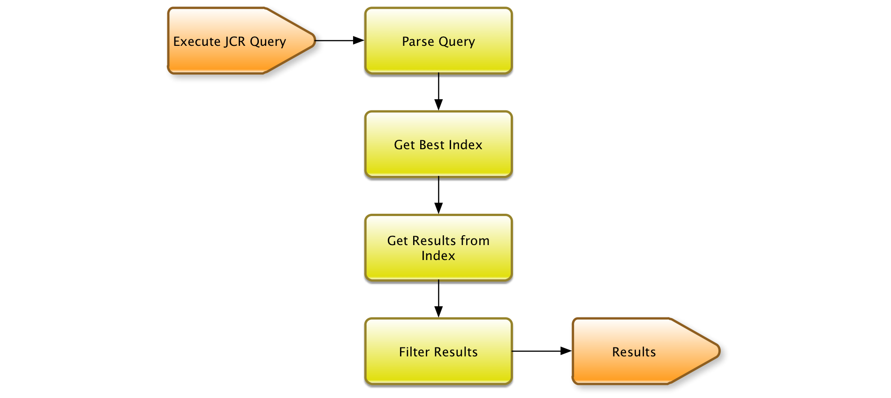

# Query e indicizzazione Oak{#oak-queries-and-indexing}

>[!NOTE]
>
>Questo articolo riguarda la configurazione degli indici nel AEM 6. Per le best practice sull’ottimizzazione delle prestazioni di query e indicizzazione, consulta [Tecniche consigliate per query e indicizzazione](/help/sites-deploying/best-practices-for-queries-and-indexing.md).

## Introduzione {#introduction}

A differenza di Jackrabbit 2, Oak non indicizza il contenuto per impostazione predefinita. Gli indici personalizzati devono essere creati quando necessario, proprio come con i database relazionali tradizionali. Se non è presente un indice per una query specifica, è possibile che molti nodi vengano attraversati. La query può ancora funzionare ma probabilmente è molto lenta.

Se Oak incontra una query senza un indice, viene stampato un messaggio di log a livello WARN:

```xml
*WARN* Traversed 1000 nodes with filter Filter(query=select ...) consider creating an index or changing the query
```

## Lingue di query supportate {#supported-query-languages}

Il motore di query Oak supporta le seguenti lingue:

* XPath (consigliato)
* SQL-2
* SQL (obsoleto)
* JQOM

## Tipi di indicizzatore e calcolo dei costi {#indexer-types-and-cost-calculation}

Il backend basato su Apache Oak consente di collegare diversi indicizzatori nell’archivio.

Un indicizzatore è **Indice proprietà**, per i quali la definizione dell’indice è memorizzata nell’archivio stesso.

Implementazioni per **Apache Lucene** e **Solr** sono disponibili anche per impostazione predefinita, che supportano entrambi l’indicizzazione full-text.

La **Indice trasversale** viene utilizzato se non è disponibile alcun altro indicizzatore. Ciò significa che il contenuto non è indicizzato e che i nodi di contenuto vengono attraversati per trovare corrispondenze alla query.

Se per una query sono disponibili più indicizzatori, ogni indicizzatore disponibile stima il costo di esecuzione della query. Oak sceglie quindi l&#39;indicizzatore con il costo stimato più basso.



Il diagramma di cui sopra è una rappresentazione di alto livello del meccanismo di esecuzione delle query di Apache Oak.

Innanzitutto, la query viene analizzata in un albero di sintassi astratto. Quindi, la query viene controllata e trasformata in SQL-2 che è la lingua nativa per le query Oak.

Successivamente, ogni indice viene consultato per stimare il costo della query. Una volta completato, vengono recuperati i risultati dell&#39;indice più economico. Infine, i risultati vengono filtrati, sia per garantire che l’utente corrente abbia accesso in lettura al risultato che il risultato corrisponda alla query completa.

## Configurazione degli indici {#configuring-the-indexes}

>[!NOTE]
>
>Per un archivio di grandi dimensioni, la creazione di un indice richiede molto tempo. Questo vale sia per la creazione iniziale di un indice che per la reindicizzazione (ricostruzione di un indice dopo la modifica della definizione). Vedi anche [Risoluzione dei problemi degli indici Oak](/help/sites-deploying/troubleshooting-oak-indexes.md) e [Impedire la reindicizzazione lenta](/help/sites-deploying/troubleshooting-oak-indexes.md#preventing-slow-re-indexing).

Se è necessaria la reindicizzazione in archivi di grandi dimensioni, specialmente quando si utilizza MongoDB e per gli indici full-text, considera la preestrazione del testo e utilizza oak-run per generare l&#39;indice iniziale e reindicizzarlo.

Gli indici sono configurati come nodi nell&#39;archivio sotto il **oak:index** nodo.

Il tipo del nodo indice deve essere **oak:QueryIndexDefinition.** Sono disponibili diverse opzioni di configurazione per ogni indicizzatore come proprietà del nodo. Per ulteriori informazioni, consulta i dettagli di configurazione per ogni tipo di indicizzatore qui sotto.

### Indice delle proprietà {#the-property-index}

L&#39;indice delle proprietà è generalmente utile per le query con vincoli di proprietà ma non con testo completo. Può essere configurato seguendo la procedura seguente:

1. Apri CRXDE andando in `http://localhost:4502/crx/de/index.jsp`
1. Crea un nuovo nodo sotto **oak:index**
1. Assegna un nome al nodo **PropertyIndex** e imposta il tipo di nodo su **oak:QueryIndexDefinition**
1. Imposta le seguenti proprietà per il nuovo nodo:

   * **tipo:**  `property` (di tipo String)
   * **propertyNames:**  `jcr:uuid` (di tipo Nome)

   Questo particolare esempio indicizza il `jcr:uuid` , il cui lavoro consiste nell&#39;esporre l&#39;identificatore universale univoco (UUID) del nodo a cui è associato.

1. Salva le modifiche.

L&#39;indice delle proprietà dispone delle seguenti opzioni di configurazione:

* La **type** specifica il tipo di indice e in questo caso deve essere impostato su **property**

* La **propertyNames** indica l&#39;elenco delle proprietà che verranno memorizzate nell&#39;indice. Se manca, il nome del nodo verrà utilizzato come valore di riferimento del nome della proprietà. In questo esempio, la **jcr:uuid** all&#39;indice viene aggiunta la proprietà il cui lavoro consiste nell&#39;esporre l&#39;identificatore univoco (UUID) del suo nodo.

* La **unico** che, se impostato su **true** aggiunge un vincolo di univocità all&#39;indice della proprietà.

* La **declaringNodeTypes** La proprietà ti consente di specificare un determinato tipo di nodo a cui l’indice si applica solo.
* La **reindicizzare** che, se impostato su **true**, attiva una reindicizzazione completa del contenuto.

### Indice ordinato {#the-ordered-index}

L&#39;indice ordinato è un&#39;estensione dell&#39;indice Property. Tuttavia, è stato dichiarato obsoleto. Gli indici di questo tipo devono essere sostituiti con [Indice della proprietà Lucene](#the-lucene-property-index).

### L&#39;indice a testo completo Lucene {#the-lucene-full-text-index}

Un indicizzatore full text basato su Apache Lucene è disponibile in AEM 6.

Se è configurato un indice full-text, tutte le query con una condizione full-text utilizzano l&#39;indice full-text, indipendentemente dal fatto che vi siano altre condizioni indicizzate e indipendentemente da eventuali restrizioni del percorso.

Se non è configurato alcun indice full-text, le query con condizioni full-text non funzioneranno come previsto.

Poiché l’indice viene aggiornato tramite un thread in background asincrono, alcune ricerche full-text non saranno disponibili per una piccola finestra di tempo fino al completamento dei processi in background.

Puoi configurare un indice full-text Lucene seguendo la procedura seguente:

1. Apri CRXDE e crea un nuovo nodo sotto **oak:index**.
1. Assegna un nome al nodo **LuceneIndex** e imposta il tipo di nodo su **oak:QueryIndexDefinition**
1. Aggiungi le seguenti proprietà al nodo :

   * **tipo:**  `lucene` (di tipo String)
   * **asincrono:**  `async` (di tipo String)

1. Salva le modifiche.

L&#39;indice Lucene dispone delle seguenti opzioni di configurazione:

* La **type** che specificherà il tipo di indice deve essere impostato su **lucene**
* La **async** proprietà che deve essere impostata su **async**. Questo invierà il processo di aggiornamento dell&#39;indice a un thread in background.
* La **includePropertyTypes** , che definirà quale sottoinsieme di tipi di proprietà sarà incluso nell&#39;indice.
* La **excludePropertyNames** proprietà che definirà un elenco di nomi di proprietà - proprietà che devono essere escluse dall&#39;indice.
* La **reindicizzare** che, se impostato su **true**, attiva una reindicizzazione completa del contenuto.

### Indice della proprietà Lucene {#the-lucene-property-index}

Da **Oak 1.0.8**, Lucene può essere utilizzato per creare indici che coinvolgono vincoli di proprietà non full-text.

Al fine di ottenere un indice di proprietà Lucene il **fulltextEnabled** deve sempre essere impostata su false.

Prendi la seguente query di esempio:

```xml
select * from [nt:base] where [alias] = '/admin'
```

Per definire un indice delle proprietà Lucene per la query precedente, puoi aggiungere la seguente definizione creando un nuovo nodo in **quercia:index:**

* **Nome:** `LucenePropertyIndex`
* **Tipo:** `oak:QueryIndexDefinition`

Una volta creato il nodo, aggiungi le seguenti proprietà:

* **tipo:**

   ```xml
   lucene (of type String)
   ```

* **asincrono:**

   ```xml
   async (of type String)
   ```

* **fulltextEnabled:**

   ```xml
   false (of type Boolean)
   ```

* **includePropertyNames:** `["alias"] (of type String)`

>[!NOTE]
>
>Rispetto al normale indice delle proprietà, l&#39;indice delle proprietà Lucene è sempre configurato in modalità asincrona. Pertanto, i risultati restituiti dall&#39;indice potrebbero non sempre riflettere lo stato più aggiornato dell&#39;archivio.

>[!NOTE]
>
>Per informazioni più specifiche sull&#39;indice delle proprietà Lucene, vedi la [Pagina della documentazione di Apache Jackrabbit Oak Lucene](https://jackrabbit.apache.org/oak/docs/query/lucene.html).

### Analisi Lucene {#lucene-analyzers}

A partire dalla versione 1.2.0, Oak supporta gli analizzatori Lucene.

Gli analisti vengono utilizzati sia quando un documento è indicizzato sia in fase di query. Un analizzatore esamina il testo dei campi e genera un flusso di token. Gli analizzatori Lucene sono composti da una serie di classi di tokenizer e filtri.

Gli analizzatori possono essere configurati tramite il `analyzers` nodo (di tipo `nt:unstructured`) all&#39;interno del `oak:index` definizione.

L&#39;analizzatore predefinito per un indice è configurato nel `default` figlio del nodo analizzatore.


>[!NOTE]
>
>Per un elenco degli analizzatori disponibili, consulta la documentazione API della versione Lucene in uso.

#### Specifica diretta della classe Analyzer {#specifying-the-analyzer-class-directly}

Se desideri utilizzare un analizzatore preconfigurato, puoi configurarlo seguendo la procedura seguente:

1. Individua l&#39;indice con cui desideri utilizzare l&#39;analizzatore sotto il `oak:index` nodo.

1. Sotto l&#39;indice, crea un nodo figlio denominato `default` di tipo `nt:unstructured`.

1. Aggiungi una proprietà al nodo predefinito con le seguenti proprietà:

   * **Nome:** `class`
   * **Tipo:** `String`
   * **Valore:** `org.apache.lucene.analysis.standard.StandardAnalyzer`

   Il valore è il nome della classe analizzatore che si desidera utilizzare.

   È inoltre possibile impostare l&#39;analizzatore da utilizzare con una versione lucene specifica utilizzando l&#39;opzione opzionale `luceneMatchVersion` proprietà string. Una sintassi valida per utilizzarla con Lucene 4.7 sarebbe:

   * **Nome:** `luceneMatchVersion`
   * **Tipo:** `String`
   * **Valore:** `LUCENE_47`

   Se `luceneMatchVersion` non viene fornito, Oak utilizzerà la versione di Lucene con cui viene spedito.

1. Se desideri aggiungere un file stopwords alle configurazioni dell&#39;analizzatore, puoi creare un nuovo nodo sotto il `default` con le seguenti proprietà:

   * **Nome:** `stopwords`
   * **Tipo:** `nt:file`

#### Creazione di analisi tramite composizione {#creating-analyzers-via-composition}

Gli analisti possono anche essere composti in base a `Tokenizers`, `TokenFilters` e `CharFilters`. A tale scopo, puoi specificare un analizzatore e creare nodi figlio dei relativi token e filtri facoltativi che verranno applicati nell’ordine elencato. Vedi anche [https://wiki.apache.org/solr/AnalyzersTokenizersTokenFilters#Specifying_an_Analyzer_in_the_schema](https://wiki.apache.org/solr/AnalyzersTokenizersTokenFilters#Specifying_an_Analyzer_in_the_schema)

Considera questa struttura del nodo come esempio:

* **Nome:** `analyzers`

   * **Nome:** `default`

      * **Nome:** `charFilters`
      * **Tipo:** `nt:unstructured`

         * **Nome:** `HTMLStrip`
         * **Nome:** `Mapping`
      * **Nome:** `tokenizer`

         * **Nome proprietà:** `name`

            * **Tipo:** `String`
            * **Valore:** `Standard`
      * **Nome:** `filters`
      * **Tipo:** `nt:unstructured`

         * **Nome:** `LowerCase`
         * **Nome:** `Stop`

            * **Nome proprietà:** `words`

               * **Tipo:** `String`
               * **Valore:** `stop1.txt, stop2.txt`
            * **Nome:** `stop1.txt`

               * **Tipo:** `nt:file`
            * **Nome:** `stop2.txt`

               * **Tipo:** `nt:file`


Il nome dei filtri, charFilters e token viene creato rimuovendo i suffissi di fabbrica. Pertanto:

* `org.apache.lucene.analysis.standard.StandardTokenizerFactory` diventa `standard`

* `org.apache.lucene.analysis.charfilter.MappingCharFilterFactory` diventa `Mapping`

* `org.apache.lucene.analysis.core.StopFilterFactory` diventa `Stop`

Qualsiasi parametro di configurazione richiesto per la fabbrica è specificato come proprietà di questo codice.

Per casi come il caricamento di parole di arresto in cui è necessario caricare il contenuto da file esterni, è possibile fornire il contenuto creando un nodo figlio di `nt:file` digitare il file in questione.

### Indice Solr {#the-solr-index}

Lo scopo dell&#39;indice Solr è principalmente ricerca full-text ma può anche essere utilizzato per indicizzare la ricerca per percorso, restrizioni di proprietà e restrizioni di tipo primario. Questo significa che l&#39;indice Solr in Oak può essere utilizzato per qualsiasi tipo di query JCR.

L’integrazione in AEM avviene a livello di archivio in modo che Solr sia uno dei possibili indici che possono essere utilizzati in Oak, la nuova implementazione dell’archivio fornita con AEM.

Può essere configurato per funzionare come server remoto con l&#39;istanza AEM.

### Configurazione di AEM con un singolo server Solr remoto {#configuring-aem-with-a-single-remote-solr-server}

AEM può anche essere configurato per lavorare con un&#39;istanza remota del server Solr:

1. Scarica ed estrai la versione più recente di Solr. Per ulteriori informazioni su come eseguire questa procedura, consulta la [Documentazione sull&#39;installazione di Apache Solr](https://cwiki.apache.org/confluence/display/solr/Installing+Solr).
1. Ora, crea due truffe Solr. Per farlo, crea cartelle per ogni frammento nella cartella in cui Solr è stato decompresso:

   * Per la prima condivisione, crea la cartella:

   `<solrunpackdirectory>\aemsolr1\node1`

   * Per la seconda parte, crea la cartella:

   `<solrunpackdirectory>\aemsolr2\node2`

1. Individua l&#39;istanza di esempio nel pacchetto Solr. In genere si trova in una cartella denominata &quot; `example`&quot; nella radice del pacchetto.
1. Copia le seguenti cartelle dall&#39;istanza di esempio alle due cartelle condivise ( `aemsolr1\node1` e `aemsolr2\node2`):

   * `contexts`
   * `etc`
   * `lib`
   * `resources`
   * `scripts`
   * `solr-webapp`
   * `webapps`
   * `start.jar`

1. Crea una nuova cartella denominata &quot; `cfg`&quot; in ciascuna delle due cartelle condivise.
1. Inserire i file di configurazione Solr e Zookeeper nella nuova creazione `cfg` cartelle.

   >[!NOTE]
   >
   >Per ulteriori informazioni sulla configurazione Solr e ZooKeeper, consulta la [Documentazione sulla configurazione del solr](https://wiki.apache.org/solr/ConfiguringSolr) e [Guida introduttiva di ZooKeeper](https://zookeeper.apache.org/doc/r3.1.2/zookeeperStarted.html).

1. Avvia la prima condivisione con il supporto di ZooKeeper andando a `aemsolr1\node1` ed eseguire il comando seguente:

   ```xml
   java -Xmx2g -Dbootstrap_confdir=./cfg/oak/conf -Dcollection.configName=myconf -DzkRun -DnumShards=2 -jar start.jar
   ```

1. Inizia la seconda parte andando `aemsolr2\node2` ed eseguire il comando seguente:

   ```xml
   java -Xmx2g -Djetty.port=7574 -DzkHost=localhost:9983 -jar start.jar
   ```

1. Dopo l&#39;avvio di entrambi i frammenti, verificare che tutto sia pronto e funzionante collegandosi all&#39;interfaccia Solr in `http://localhost:8983/solr/#/`
1. Avvia AEM e passa alla console Web all&#39;indirizzo `http://localhost:4502/system/console/configMgr`
1. Imposta la seguente configurazione in **Configurazione del server remoto Oak Solr**:

   * URL HTTP solr: `http://localhost:8983/solr/`

1. Scegli **Solr remoto** nell’elenco a discesa sotto **Oak Solr** provider di server.

1. Vai a CRXDE e accedi come amministratore.
1. Crea un nuovo nodo denominato **solrIndex** sotto **oak:index**, e imposta le seguenti proprietà:

   * **tipo:** solr (di tipo String)
   * **asincrono:** async (di tipo String)
   * **reindicizzazione:** true (di tipo booleano)

1. Salva le modifiche.

#### Configurazione consigliata per Solr {#recommended-configuration-for-solr}

Di seguito è riportato un esempio di configurazione di base che può essere utilizzata con tutte e tre le distribuzioni Solr descritte in questo articolo. Gestisce gli indici di proprietà dedicati già presenti in AEM e non devono essere utilizzati con altre applicazioni.

Per utilizzarlo correttamente, è necessario inserire il contenuto dell&#39;archivio direttamente nella directory principale Solr. Nel caso di implementazioni con più nodi, deve trovarsi direttamente nella cartella principale di ciascun nodo.

File di configurazione Solr consigliati

[Ottieni file](assets/recommended-conf.zip)

### Strumenti di indicizzazione AEM {#aem-indexing-tools}

AEM 6.1 integra anche due strumenti di indicizzazione presenti in AEM 6.0 come parte degli strumenti di Adobe Consulting Services Commons:

1. **Spiega query**, uno strumento progettato per aiutare gli amministratori a comprendere come vengono eseguite le query;
1. **Gestione indici Oak**, un&#39;interfaccia utente web per la manutenzione degli indici esistenti.

Ora puoi raggiungerli andando a **Strumenti - Operazioni - Dashboard - Diagnosi** dalla schermata di benvenuto AEM.

Per ulteriori informazioni su come utilizzarli, consulta la [Documentazione del dashboard delle operazioni](/help/sites-administering/operations-dashboard.md).

#### Creazione di indici di proprietà tramite OSGi {#creating-property-indexes-via-osgi}

Il pacchetto ACS Commons espone anche le configurazioni OSGi che possono essere utilizzate per creare indici di proprietà.

Puoi accedervi dalla console Web cercando &quot;**Assicurati l&#39;indice delle proprietà Oak**&quot;.


### Risoluzione dei problemi di indicizzazione {#troubleshooting-indexing-issues}

Potrebbero verificarsi situazioni in cui l’esecuzione delle query richiede molto tempo e il tempo di risposta generale del sistema è lento.

Questa sezione presenta una serie di raccomandazioni su ciò che è necessario fare per individuare la causa di tali problemi e consigli su come risolverli.

#### Preparazione delle informazioni di debug per l’analisi {#preparing-debugging-info-for-analysis}

Il modo più semplice per ottenere le informazioni richieste per la query eseguita è tramite la [Strumento Spiega query](/help/sites-administering/operations-dashboard.md#explain-query). Questo ti consente di raccogliere le informazioni precise necessarie per eseguire il debug di una query lenta senza la necessità di consultare le informazioni sul livello di log. Questa opzione è utile se si conosce la query di cui si sta eseguendo il debug.

Se questo non è possibile per alcun motivo, è possibile raccogliere i registri di indicizzazione in un singolo file e usarlo per risolvere il problema specifico.

#### Abilita registrazione {#enable-logging}

Per abilitare la registrazione, devi abilitare **DEBUG** registri di livello per le categorie relative all’indicizzazione e alle query Oak. Queste categorie sono:

* org.apache.jackrabbit.oak.plugins.index
* org.apache.jackrabbit.oak.query
* com.day.cq.search

La **com.day.cq.search** Questa categoria è applicabile solo se si utilizza l&#39;utility QueryBuilder AEM fornita.

>[!NOTE]
>
>È importante che i registri siano impostati su DEBUG solo per la durata dell’esecuzione della query che si desidera risolvere i problemi, altrimenti nel tempo verrà generata una grande quantità di eventi nei registri. Per questo motivo, una volta raccolti i registri richiesti, torna alla registrazione a livello INFO per le categorie sopra menzionate.

È possibile abilitare la registrazione seguendo questa procedura:

1. Posiziona il browser su `https://serveraddress:port/system/console/slinglog`
1. Fai clic sul pulsante **Aggiungi nuovo logger** nella parte inferiore della console.
1. Nella riga appena creata, aggiungi le categorie sopra menzionate. È possibile utilizzare **+** firma per aggiungere più di una categoria a un singolo logger.
1. Scegli **DEBUG** dal **Livello di log** elenco a discesa.
1. Imposta il file di output su `logs/queryDebug.log`. In questo modo tutti gli eventi DEBUG verranno correlati in un unico file di registro.
1. Esegui la query o esegui il rendering della pagina che utilizza la query di cui desideri eseguire il debug.
1. Dopo aver eseguito la query, torna alla console di registrazione e modifica il livello di log del logger appena creato in **INFORMAZIONI**.

#### Configurazione indice {#index-configuration}

Il modo in cui la query viene valutata è in gran parte influenzato dalla configurazione dell&#39;indice. È importante ottenere la configurazione dell&#39;indice per essere analizzata o inviata al supporto. Puoi ottenere la configurazione come pacchetto di contenuti o una rappresentazione JSON.

Poiché nella maggior parte dei casi, la configurazione di indicizzazione è memorizzata nella variabile `/oak:index` in CRXDE, puoi ottenere la versione JSON in:

`https://serveraddress:port/oak:index.tidy.-1.json`

Se l&#39;indice è configurato in una posizione diversa, cambia di conseguenza il percorso.

#### Uscita MBean {#mbean-output}

In alcuni casi è utile fornire l&#39;output di MBeans relativi all&#39;indice per il debug. Per farlo, segui questi passaggi:

1. Andando alla console JMX in:
   `https://serveraddress:port/system/console/jmx`

1. Cerca i seguenti MBeans:

   * Statistiche dell&#39;indice di Lucene
   * Statistiche di supporto di CopyOnRead
   * Statistiche query Oak
   * IndexStats

1. Fai clic su ciascuno dei MBeans per ottenere le statistiche sulle prestazioni. Crea uno screenshot o annotiamoli nel caso in cui sia necessario inviarli al supporto.

Puoi anche ottenere la variante JSON di queste statistiche ai seguenti URL:

* `https://serveraddress:port/system/sling/monitoring/mbeans/org/apache/jackrabbit/oak/%2522LuceneIndex%2522.tidy.-1.json`
* `https://serveraddress:port/system/sling/monitoring/mbeans/org/apache/jackrabbit/oak/%2522LuceneIndex%2522.tidy.-1.json`
* `https://serveraddress:port/system/sling/monitoring/mbeans/org/apache/jackrabbit/oak/%2522LuceneIndex%2522.tidy.-1.json`
* `https://serveraddress:port/system/sling/monitoring/mbeans/org/apache/jackrabbit/oak/%2522LuceneIndex%2522.tidy.-1.json`

È inoltre possibile fornire un output JMX consolidato tramite `https://serveraddress:port/system/sling/monitoring/mbeans/org/apache/jackrabbit/oak.tidy.3.json`. Questo includerebbe tutti i dettagli MBean relativi a Oak nel formato JSON.

#### Altri dettagli {#other-details}

Puoi raccogliere ulteriori dettagli per aiutarti a risolvere il problema, ad esempio:

1. Versione Oak su cui l&#39;istanza è in esecuzione. Per visualizzarlo, apri CRXDE e osserva la versione nell’angolo in basso a destra della pagina di benvenuto, oppure controlla la versione della `org.apache.jackrabbit.oak-core` pacchetto.
1. L&#39;output del debugger di QueryBuilder della query del problema. È possibile accedere al debugger all&#39;indirizzo: `https://serveraddress:port/libs/cq/search/content/querydebug.html`
