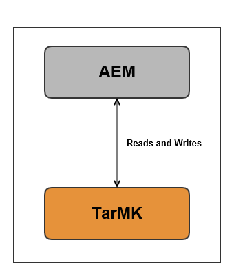

# Implementazioni consigliate{#recommended-deployments}

>[!NOTE]
>
>Questa pagina fa riferimento alle topologie consigliate per AEM. Per ulteriori informazioni sulle funzionalità di clustering e su come configurarle, consulta la sezione [Documentazione API per l&#39;individuazione di Apache Sling](https://sling.apache.org/documentation/bundles/discovery-api-and-impl.html).

I MicroKernel fungono da gestori di persistenza a partire da AEM 6.2. La scelta di uno per soddisfare le tue esigenze dipende dallo scopo della tua istanza e dal tipo di distribuzione che stai considerando.

Gli esempi seguenti sono intesi come un&#39;indicazione degli usi raccomandati nelle impostazioni di AEM più comuni.

## Scenari di distribuzione {#deployment-scenarios}

### Istanza singola TarMK {#single-tarmk-instance}

In questo scenario, una singola istanza TarMK viene eseguita su un singolo server.

**Questa è la distribuzione predefinita per le istanze di authoring.**

I vantaggi:

* Semplici
* Manutenzione semplice
* Buone prestazioni

Gli svantaggi:

* Non scalabile oltre i limiti di capacità del server
* Nessuna capacità di failover

### Standby a freddo TarMK {#tarmk-cold-standby}

Un&#39;istanza TarMK agisce come istanza primaria. L&#39;archivio dal primario viene replicato in un sistema di failover in standby.

Il meccanismo di standby a freddo può essere utilizzato anche come backup perché l&#39;archivio completo viene costantemente replicato nel server di failover. Il server di failover è in esecuzione in modalità standby a freddo, il che significa che è in esecuzione solo l&#39;HttpReceiver dell&#39;istanza.

I vantaggi:

* Semplicità
* Manutenzione
* Spettacolo
* Failover

Gli svantaggi:

* Non scalabile oltre i limiti della capacità del server
* Un server è inattivo per la maggior parte del tempo
* Il failover non è automatico. Deve essere rilevato esternamente prima che il sistema di failover possa iniziare a servire le richieste.

>[!NOTE]
>
>Per ulteriori informazioni su come configurare AEM con lo standby a freddo TarMK, vedi [questo](/help/sites-deploying/tarmk-cold-standby.md) articolo.

>[!NOTE]
>
>La distribuzione in standby a freddo in questo esempio TarMK richiede che sia le istanze primarie che quelle in standby siano concesse in licenza separatamente, in quanto vi è una replica costante per il server di failover. Per ulteriori informazioni sulle licenze, consulta la [Adobe Condizioni generali di licenza](https://www.adobe.com/legal/terms/enterprise-licensing.html).

### Fattoria TarMK {#tarmk-farm}

Più istanze Oak vengono eseguite ciascuna con un&#39;istanza TarMK. Gli archivi TarMK sono indipendenti e devono essere mantenuti sincronizzati.

Mantenere gli archivi sincronizzati viene fornito con il fatto che il server di authoring pubblica lo stesso contenuto su ogni membro della farm. Per ulteriori informazioni, consulta [Replica](/help/sites-deploying/replication.md).

Per AEM Communities, il contenuto generato dall’utente (UGC) non viene mai replicato. Per il supporto di UGC su un farm TarMK, vedi [considerazioni per AEM Communities](#considerations-for-aem-communities).

**Questa è la distribuzione predefinita per gli ambienti di pubblicazione.**

I vantaggi:

* Spettacolo
* Scalabilità per l&#39;accesso in lettura
* Failover

### Cluster Oak con failover MongoMK per un&#39;elevata disponibilità in un singolo centro dati {#oak-cluster-with-mongomk-failover-for-high-availability-in-a-single-datacenter}

Questo approccio implica l&#39;accesso di più istanze Oak a un set di repliche MongoDB all&#39;interno di un singolo data center, in effetti creando un cluster attivo-attivo per l&#39;ambiente di authoring AEM. I set di replica in MongoDB vengono utilizzati per fornire elevata disponibilità e ridondanza in caso di guasto dell&#39;hardware o della rete.

I vantaggi:

* Possibilità di scalare orizzontalmente con nuove istanze di authoring AEM
* Elevata disponibilità, ridondanza e failover automatizzato del livello dati

Gli svantaggi:

* Le prestazioni possono essere inferiori a quelle di TarMK per alcuni scenari

### Cluster Oak con failover MongoMK in più centri dati {#oak-cluster-with-mongomk-failover-across-multiple-datacenters}

Questo approccio implica l&#39;accesso di più istanze Oak a un set di repliche MongoDB su più data center, in effetti creando un cluster attivo-attivo per l&#39;ambiente di authoring AEM. Con più data center, la replica MongoDB fornisce la stessa elevata disponibilità e ridondanza, ma ora include la possibilità di gestire un&#39;interruzione del data center.

I vantaggi:

* Possibilità di scalare orizzontalmente con nuove istanze di authoring AEM
* Elevata disponibilità, ridondanza e failover automatizzato dei livelli dati (comprese le interruzioni dei centri dati)

>[!NOTE]
>
>Nel diagramma precedente, AEM Server 3 e AEM Server 4 vengono presentati con uno stato inattivo che assume una latenza di rete tra i server AEM in Data Center 2 e il nodo principale MongoDB in Data Center 1 che è superiore ai requisiti documentati [qui](/help/sites-deploying/aem-with-mongodb.md#checklists). Se la latenza massima è compatibile con i requisiti, ad esempio tramite l&#39;uso di aree di disponibilità, è possibile attivare anche i server AEM in Data Center 2, creando un cluster di AEM attivo-attivo su più datacenter.

>[!NOTE]
>
>Per ulteriori informazioni sui concetti architettonici MongoDB descritti in questa sezione, vedi [Replica MongoDB](https://docs.mongodb.org/manual/replication/).

## Microcanali: quale utilizzare {#microkernels-which-one-to-use}

La regola di base di cui tenere conto nella scelta tra i due micro kernel disponibili è che TarMK è progettato per le prestazioni, mentre MongoMK è utilizzato per la scalabilità.

Puoi utilizzare queste matrici decisionali per stabilire quale sia il tipo di distribuzione più adatto alle tue esigenze.

Adobe consiglia vivamente a TarMK di essere la tecnologia di persistenza predefinita utilizzata dai clienti in tutti gli scenari di implementazione, sia per le istanze di authoring e pubblicazione di AEM, eccetto nei casi d’uso descritti di seguito.

### Eccezioni per la scelta AEM MongoMK su TarMK sulle istanze di authoring {#exceptions-for-choosing-aem-mongomk-over-tarmk-on-author-instances}

La ragione principale per scegliere il backend di persistenza MongoMK su TarMK è la scalabilità orizzontale delle istanze. Ciò significa che due o più istanze di authoring attive vengono sempre in esecuzione e utilizzano MongoDB come sistema di storage di persistenza. La necessità di eseguire più di un&#39;istanza dell&#39;autore deriva generalmente dal fatto che la CPU e la capacità di memoria di un singolo server, che supportano tutte le attività di authoring simultanee, non sono più sostenibili.

È quasi impossibile prevedere quale sarà l&#39;esatto modello di concorrenza dopo la pubblicazione di un nuovo sito. Pertanto, l&#39;Adobe consiglia di considerare i seguenti criteri quando si valuta se utilizzare MongoMK e due o più nodi attivi Autore:

1. Numero di utenti denominati connessi in un giorno: in migliaia o più.
1. Numero di utenti simultanei: nelle centinaia o più.
1. Volume di ingestioni di risorse al giorno: a centinaia di migliaia o più.
1. Volume di modifiche alla pagina al giorno: in centinaia di migliaia o più (inclusi gli aggiornamenti automatizzati tramite Multi Site Manager o news feed, ad esempio).
1. Volume di ricerche al giorno: in decine di migliaia o più.

>[!NOTE]
>
>È possibile utilizzare un giorno difficile per valutare le prestazioni dell’applicazione del cliente nel contesto della configurazione hardware implementata. Sono disponibili ulteriori informazioni su questo strumento [qui](/help/sites-developing/tough-day.md).

Una distribuzione minima con MongoDB includerà in genere la seguente topologia:

* Un set di repliche MongoDB composto da un nodo primario, due nodi secondari con ciascuna delle istanze MongoDB in esecuzione in una zona di disponibilità con una latenza inferiore a 15 millisecondi in ciascun nodo;
* Un cluster di istanze di authoring con un nodo leader, un nodo non leader e entrambi attivi in ogni momento, con ciascuna delle istanze di authoring in esecuzione in ciascuno dei centri dati, dove le istanze principali e secondarie di MongoDB sono in esecuzione.

Inoltre, si consiglia vivamente di configurare l&#39;archivio dati su un file system condiviso o Amazon S3, in modo che le risorse o i file binari non vengano memorizzati in MongoDB. Questo garantisce prestazioni ottimali nell’ambito dell’implementazione.

Uno dei vantaggi aggiuntivi dell&#39;implementazione di un set di repliche MongoDB con un cluster di due o più istanze dell&#39;autore consiste nell&#39;avere uno scenario di ripristino automatico con tempi di inattività minimi in caso di istanze dell&#39;autore, replica MongoDB o un errore completo del centro dati. Tuttavia, la scelta di MongoMK su TarMK non dovrebbe essere esclusivamente guidata dal requisito di ripristino, in quanto TarMK può anche fornire una soluzione di downtime minima con un meccanismo di failover controllato.

Se i criteri di cui sopra non devono essere soddisfatti durante i primi diciotto mesi di distribuzione, si consiglia di distribuire prima AEM utilizzando TarMK, quindi di rivalutare la configurazione in un secondo momento quando si applicano i criteri di cui sopra e infine di determinare se rimanere su TarMK o migrare a MongoMK.

### Eccezioni per la scelta AEM MongoMK su TarMK su istanze di pubblicazione {#exceptions-for-choosing-aem-mongomk-over-tarmk-on-publish-instances}

Si sconsiglia di distribuire MongoMK per le istanze di pubblicazione. Il livello di pubblicazione della distribuzione viene quasi sempre distribuito come farm di istanze di pubblicazione completamente indipendenti che eseguono TarMK, che vengono mantenute in sincronia replicando il contenuto dalle istanze dell’autore. Questa architettura &quot;shared nothing&quot;, propria delle istanze di pubblicazione, consente l&#39;implementazione del livello di pubblicazione per scalare orizzontalmente in modo lineare. La topologia farm offre anche il vantaggio di applicare qualsiasi aggiornamento o aggiornamento per pubblicare le istanze su base continua, in modo che qualsiasi modifica al livello di pubblicazione non richieda tempi di inattività.

Questo non si applica ad AEM Communities che utilizza cluster MongoMK sul livello di pubblicazione ogni volta che vi sono più di un editore. Se scegli JSRP (vedi [Archiviazione dei contenuti della community](/help/communities/working-with-srp.md)), allora un cluster MongoMK sarebbe appropriato, come qualsiasi cluster lato pubblicazione indipendentemente dal MK scelto, come MongoDB o RDB.

### Prerequisiti e Recommendations durante la distribuzione di AEM con MongoMK {#prerequisites-and-recommendations-when-deploying-aem-with-mongomk}

È disponibile un set di prerequisiti e consigli se stai prendendo in considerazione una distribuzione MongoMK per AEM:

**Prerequisiti obbligatori per le distribuzioni MongoDB:**

1. L&#39;architettura e il dimensionamento dell&#39;implementazione MongoDB devono far parte dell&#39;implementazione del progetto con l&#39;aiuto di architetti Adobe Consulting o MongoDB che hanno familiarità con AEM;
1. Le competenze MongoDB devono essere presenti all&#39;interno del partner o del team di clienti per avere fiducia nell&#39;essere in grado di sostenere e mantenere un ambiente MongoDB esistente o nuovo;
1. Puoi scegliere di distribuire la versione commerciale o open source di MongoDB (AEM supporta entrambi), ma devi acquistare un contratto di manutenzione e supporto MongoDB direttamente da MongoDB Inc;
1. Le architetture e le infrastrutture globali AEM e MongoDB dovrebbero essere ben definite e convalidate da un architetto AEM Adobe;
1. È necessario esaminare il modello di supporto per le distribuzioni AEM che includono MongoDB.

**Raccomandazioni valide per le distribuzioni MongoDB:**

* Consulta MongoDB per Adobe Experience Manager [articolo](https://www.mongodb.com/lp/contact/mongodb-adobe-experience-manager);
* Esamina la produzione MongoDB [elenco a discesa](https://docs.mongodb.org/manual/administration/production-checklist/);
* Partecipa a una classe di certificazione su MongoDB disponibile online [qui](https://university.mongodb.com/).

>[!NOTE]
>
>Per tutte le domande aggiuntive su queste linee guida, prerequisiti e raccomandazioni, contatta [Adobe Customer Care](https://helpx.adobe.com/it/marketing-cloud/contact-support.html).

### Considerazioni per AEM Communities {#considerations-for-aem-communities}

Per i siti che prevedono di distribuire [AEM Communities](/help/communities/overview.md), si consiglia di [scegliere una distribuzione](/help/communities/working-with-srp.md#characteristicsofstorageoptions) ottimizzato per la gestione di contenuti generati dagli utenti pubblicati da membri della community dall’ambiente di pubblicazione.

Utilizzando un [negozio comune](/help/communities/working-with-srp.md), non è necessario replicare UGC tra l’autore e altre istanze di pubblicazione per ottenere una visualizzazione coerente dell’UGC.

Di seguito è riportato un set di matrici decisionali che possono aiutarti a scegliere il tipo migliore di persistenza per la distribuzione:

#### Scelta del tipo di distribuzione per le istanze dell’autore {#choosing-the-deployment-type-for-author-instances}

#### Scelta del tipo di distribuzione per le istanze di pubblicazione {#choosing-the-deployment-type-for-publish-instances}

>[!NOTE]
>
>MongoDB è un software di terze parti e non è incluso nel pacchetto di licenze AEM. Per ulteriori informazioni, consulta la sezione [Criteri di licenza MongoDB](https://www.mongodb.org/about/licensing/) pagina.
>
>Per ottenere il massimo dalla distribuzione di AEM, Adobe consiglia di concedere in licenza la versione Enterprise MongoDB al fine di beneficiare del supporto professionale.
>
>La licenza include un set di repliche standard, composto da una istanza primaria e due istanze secondarie che possono essere utilizzate per le distribuzioni di authoring o pubblicazione.
>
>Se desideri eseguire sia l’autore che la pubblicazione su MongoDB, devono essere acquistate due licenze separate.
>
>Per ulteriori informazioni, consulta la sezione [Pagina MongoDB per Adobe Experience Manager](https://www.mongodb.com/lp/contact/mongodb-adobe-experience-manager).
