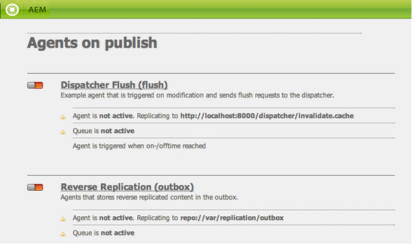
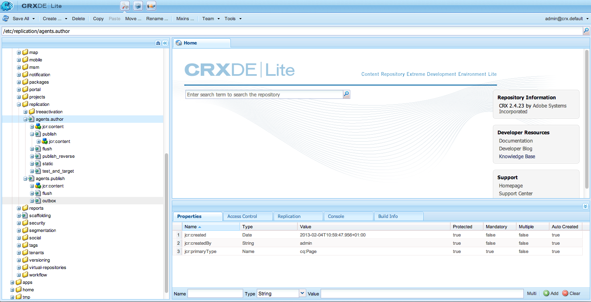

# Replica{#replication}

Gli agenti di replica sono centrali per Adobe Experience Manager (AEM) in quanto il meccanismo utilizzato per:

* [Pubblica (attiva)](/help/sites-authoring/publishing-pages.md#activatingcontent) contenuto da un ambiente Author a uno Publish.
* Svuota esplicitamente il contenuto dalla cache di Dispatcher.
* Restituisce l’input dell’utente (ad esempio, l’input del modulo) dall’ambiente di pubblicazione all’ambiente di authoring (sotto il controllo dell’ambiente di authoring).

Le richieste sono [in coda](/help/sites-deploying/osgi-configuration-settings.md#apacheslingjobeventhandler) all’agente incaricato dell’elaborazione.

>[!NOTE]
>
>I dati utente (utenti, gruppi di utenti e profili utente) non vengono replicati tra le istanze Author e Publish.
>
>Per più istanze Publish, i dati utente sono distribuiti tramite Sling quando [Sincronizzazione utente](/help/sites-administering/sync.md) è abilitato.

## Replica da authoring a pubblicazione {#replicating-from-author-to-publish}

La replica in un’istanza Publish o Dispatcher si svolge in diversi passaggi:

* l’Autore richiede che determinati contenuti siano pubblicati (attivati); questo può essere avviato da una richiesta manuale o da attivatori automatici preconfigurati.
* la richiesta viene passata all’agente di replica predefinito appropriato; un ambiente può avere diversi agenti predefiniti sempre selezionati per tali azioni.
* l’agente di replica &quot;crea pacchetti&quot; del contenuto e lo inserisce nella coda di replica.
* nella scheda Siti Web [indicatore di stato colorato](/help/sites-authoring/publishing-pages.md#determiningpagepublicationstatus) è impostato per le singole pagine.
* il contenuto viene rimosso dalla coda e trasportato nell’ambiente di pubblicazione utilizzando il protocollo configurato; in genere si tratta di HTTP.
* un servlet nell’ambiente di pubblicazione riceve la richiesta e pubblica il contenuto ricevuto; il servlet predefinito è `https://localhost:4503/bin/receive`.

* è possibile configurare più ambienti Author e Publish.

### Replica dalla pubblicazione all’authoring {#replicating-from-publish-to-author}

Alcune funzioni consentono agli utenti di immettere dati in un’istanza Publish.

A volte, per restituire questi dati all’ambiente di authoring da dove vengono ridistribuiti ad altri ambienti di pubblicazione, è necessario un tipo di replica noto come replica inversa. Per motivi di sicurezza, il traffico dall’ambiente di pubblicazione a quello di authoring deve essere controllato rigorosamente.

La replica inversa utilizza un agente nell’ambiente di pubblicazione che fa riferimento all’ambiente di authoring. Questo agente inserisce i dati in una casella in uscita. Questa casella in uscita corrisponde ai listener di replica nell’ambiente di authoring. I listener eseguono il polling delle caselle in uscita per raccogliere i dati immessi e quindi distribuirli in base alle esigenze. In questo modo l’ambiente di authoring controlla tutto il traffico.

In altri casi, come per le funzioni di Communities (ad esempio forum, blog, commenti e recensioni), è difficile sincronizzare in modo efficiente tra le istanze AEM tramite la replica la quantità di contenuti generati dagli utenti (UGC, User-Generated Content) immessi nell’ambiente di pubblicazione.

AEM [Community](/help/communities/overview.md) non utilizza mai la replica per UGC. Al contrario, la distribuzione per Communities richiede un archivio comune per UGC (vedi [Archiviazione contenuti community](/help/communities/working-with-srp.md)).

### Replica: funzioni pronte all’uso {#replication-out-of-the-box}

Il sito web we-retail incluso in un&#39;installazione standard di AEM può essere utilizzato per illustrare la replica.

Per seguire questo esempio e utilizzare gli agenti di replica predefiniti: [installare AEM](/help/sites-deploying/deploy.md) con:

* l’ambiente di authoring sulla porta `4502`
* l’ambiente Publish sulla porta `4503`

>[!NOTE]
>
>Opzione attivata per impostazione predefinita :
>
>* Agenti per creazione: agente predefinito (pubblicazione)
>
>Effettivamente disabilitati per impostazione predefinita (a partire da AEM 6.1) :
>
>* Agenti per creazione: agente di replica inversa (publish_reverse)
>* Agenti per pubblicazione : Replica inversa (casella in uscita)
>
>Per verificare lo stato dell&#39;agente o della coda, utilizzare **Strumenti** console.
>Consulta [Monitoraggio degli agenti di replica](#monitoring-your-replication-agents).

#### Replica (da autore a pubblicazione) {#replication-author-to-publish}

1. Passa alla pagina di supporto nell’ambiente di authoring.
   **https://localhost:4502/content/we-retail/us/en/experience.html** `<pi>`
1. Modifica la pagina in modo da poter aggiungere nuovo testo.
1. **Attiva pagina** in modo da poter pubblicare le modifiche.
1. Apri la pagina di supporto nell’ambiente di pubblicazione:
   **https://localhost:4503/content/we-retail/us/en/experience.html**
1. Ora puoi vedere le modifiche inserite al momento dell’authoring.

Questa replica viene eseguita dall’ambiente di authoring in base a:

* **Agente predefinito (pubblicazione)**
Questo agente replica il contenuto nell’istanza Publish predefinita.
I dettagli di questo (configurazione e registri) sono accessibili dalla console Strumenti dell’ambiente di authoring; oppure:
  `https://localhost:4502/etc/replication/agents.author/publish.html`.

#### Agenti di replica - Pronti all’uso {#replication-agents-out-of-the-box}

I seguenti agenti sono disponibili in un&#39;installazione standard per AEM:

* [Agente predefinito](#replication-author-to-publish)
Utilizzato per replicare da Author a Publish.

* Svuotamento del Dispatcher Viene utilizzato per gestire la cache di Dispatcher. Consulta [Invalidazione della cache di Dispatcher dall’ambiente di authoring](https://experienceleague.adobe.com/docs/experience-manager-dispatcher/using/configuring/page-invalidate.html?lang=en#invalidating-dispatcher-cache-from-the-authoring-environment) e [Annullamento della validità della cache di Dispatcher da un’istanza Publish](https://experienceleague.adobe.com/docs/experience-manager-dispatcher/using/configuring/page-invalidate.html?lang=en#invalidating-dispatcher-cache-from-a-publishing-instance) per ulteriori informazioni.

* [Replica inversa](#reverse-replication-publish-to-author)
Utilizzato per replicare da Publish a Author. La replica inversa non viene utilizzata per le funzioni di Communities, ad esempio forum, blog e commenti. Viene effettivamente disattivata in quanto la casella in uscita non è abilitata. L’utilizzo della replica inversa richiederebbe una configurazione personalizzata.

* Agente statico &quot;Agente che memorizza una rappresentazione statica di un nodo nel file system&quot;.
Ad esempio, con le impostazioni predefinite, le pagine di contenuto e le risorse DAM vengono memorizzate in `/tmp`, come HTML o nel formato risorsa appropriato. Consulta la `Settings` e `Rules` schede per la configurazione.
Questa richiesta consentiva di visualizzare il contenuto quando la pagina veniva richiesta direttamente dal server dell’applicazione. Si tratta di un agente specializzato e (probabilmente) non è necessario per la maggior parte delle istanze.

## Agenti di replica - Parametri di configurazione {#replication-agents-configuration-parameters}

Durante la configurazione di un agente di replica dalla console Strumenti, nella finestra di dialogo sono disponibili quattro schede:

### Impostazioni {#settings}

* **Nome**

  Nome univoco dell’agente di replica.

* **Descrizione**

  Una descrizione dello scopo fornito da questo agente di replica.

* **abilitato**

  Indica se l’agente di replica è abilitato.

  Quando l&#39;agente è **abilitato**, la coda viene visualizzata come:

   * **Attivo** quando gli elementi vengono elaborati.
   * **Inattivo** quando la coda è vuota.
   * **Bloccato** quando gli elementi sono in coda ma non possono essere elaborati, ad esempio quando la coda di ricezione è disabilitata.

* **Tipo di serializzazione**

  Tipo di serializzazione:

   * **Predefinito**: imposta se l’agente deve essere selezionato automaticamente.
   * **Scaricamento del Dispatcher**: selezionalo se l’agente deve essere utilizzato per scaricare la cache di Dispatcher.

* **Ritardo per riprovare**

  Ritardo (tempo di attesa in millisecondi) tra due tentativi, in caso di problema.

  Predefiniti: `60000`

* **ID utente agente**

  A seconda dell’ambiente, l’agente utilizza questo account utente per:

   * raccogliere e creare pacchetti di contenuti dall’ambiente di authoring;
   * creare e scrivere contenuti nell’ambiente di pubblicazione

  Lascia questo campo vuoto per utilizzare l’account utente di sistema (l’account definito in sling come utente amministratore); per impostazione predefinita è `admin`).

  >[!CAUTION]
  >
  >Per un agente nell’ambiente di authoring, questo account *deve* disporre dell&#39;accesso in lettura a tutti i percorsi che si desidera replicare.

  >[!CAUTION]
  >
  >Per un agente nell’ambiente di pubblicazione, questo account *deve* disporre dell&#39;accesso di creazione/scrittura necessario per replicare il contenuto.

  >[!NOTE]
  >
  >Può essere utilizzato come meccanismo per selezionare contenuti specifici da replicare.

* **Livello registro**

  Specifica il livello di dettaglio da utilizzare per i messaggi di registro.

   * `Error`: vengono registrati solo gli errori
   * `Info`: vengono registrati errori, avvisi e altri messaggi informativi
   * `Debug`: nei messaggi viene utilizzato un livello di dettaglio elevato, principalmente a scopo di debug

  Predefiniti: `Info`

* **Usa per replica inversa**

  Indica se questo agente viene utilizzato per la replica inversa; restituisce l&#39;input dell&#39;utente dall&#39;ambiente di pubblicazione all&#39;ambiente di authoring.

* **Aggiornamento alias**

  Se si seleziona questa opzione, in Dispatcher vengono abilitate le richieste di annullamento della validità di un alias o di un percorso personalizzato. Vedi anche [Configurazione di un agente di svuotamento del Dispatcher](/help/sites-deploying/replication.md#configuring-a-dispatcher-flush-agent).

#### Trasporto {#transport}

* **URI**

  Specifica il servlet di ricezione nella posizione di destinazione. In particolare, puoi specificare il nome host (o alias) e il percorso contestuale dell’istanza target qui.

  Ad esempio:

   * Un agente predefinito può replicare in `https://localhost:4503/bin/receive`
   * Un agente di Dispatcher Flush può replicarsi in `https://localhost:8000/dispatcher/invalidate.cache`

  Il protocollo qui specificato (HTTP o HTTPS) determina il metodo di trasporto.

  Per gli agenti di Dispatcher Flush, la proprietà URI viene utilizzata solo se utilizzi voci virtualhost basate sul percorso per differenziare le farm. Questo campo viene utilizzato per individuare la farm da invalidare. Ad esempio, la farm n. 1 ha l’host virtuale `www.mysite.com/path1/*` e la farm n. 2 ha l’host virtuale `www.mysite.com/path2/*`. Puoi utilizzare l’URL `/path1/invalidate.cache` per individuare la prima farm e `/path2/invalidate.cache` per individuare la seconda farm.

* **User**

  Il nome utente dell’account da utilizzare per accedere alla destinazione.

* **Password**

  Password per l’account da utilizzare per accedere alla destinazione.

* **Dominio NTLM**

  Dominio per autenticazione NTML.

* **Host NTLM**

  Host per autenticazione NTML.

* **Abilita SSL relaxed**

  Abilita questa opzione se desideri che i certificati SSL autocertificati vengano accettati.

* **Consenti certificati scaduti**

  Abilita questa opzione se desideri che vengano accettati i certificati SSL scaduti.

#### Proxy {#proxy}

Le seguenti impostazioni sono necessarie solo se è necessario un proxy:

* **Host proxy**

  Nome host del proxy utilizzato per il trasporto.

* **Porta proxy**

  Porta del proxy.

* **Utente proxy**

  Il nome utente dell’account da utilizzare.

* **Password proxy**

  Password dell’account da utilizzare.

* **Dominio proxy NTLM**

  Dominio proxy NTLM.

* **Host proxy NTLM**

  Dominio proxy NTLM.

#### Esteso {#extended}

* **Interfaccia**

  Qui puoi definire l’interfaccia socket a cui effettuare l’associazione.

  Consente di impostare l&#39;indirizzo locale da utilizzare per la creazione di connessioni. Se non è impostato, viene utilizzato l’indirizzo predefinito. Questo è utile per specificare l&#39;interfaccia da utilizzare su sistemi multi-homed o cluster.

* **Metodo HTTP**

  Il metodo HTTP da utilizzare.

  Per un agente di Dispatcher Flush, questo valore è quasi sempre GET e non deve essere modificato (POST sarebbe un altro valore possibile).

* **Intestazioni HTTP**

  Vengono utilizzati per gli agenti di Dispatcher Flush e specificano gli elementi che devono essere scaricati.

  Per un agente di Dispatcher Flush, non è necessario modificare le tre voci standard:

   * `CQ-Action:{action}`
   * `CQ-Handle:{path}`
   * `CQ-Path:{path}`

  Questi vengono utilizzati, a seconda dei casi, per indicare l&#39;azione da eseguire durante lo scaricamento dell&#39;handle o del percorso. I sottoparametri sono dinamici:

   * `{action}` indica un’azione di replica

   * `{path}` indica un percorso

  Sono sostituite dal percorso/azione pertinente alla richiesta e pertanto non devono essere &quot;hardcoded&quot;:

  >[!NOTE]
  >
  >Se hai installato AEM in un contesto diverso da quello predefinito consigliato, devi registrare il contesto nelle intestazioni HTTP. Ad esempio:
  >`CQ-Handle:/<*yourContext*>{path}`

* **Chiudi connessione**

  Abilita questa opzione in modo da poter chiudere la connessione dopo ogni richiesta.

* **Timeout di connessione**

  Timeout (in millisecondi) da applicare quando si tenta di stabilire una connessione.

* **Timeout socket**

  Timeout (in millisecondi) da applicare quando si attende il traffico dopo che è stata stabilita una connessione.

* **Versione protocollo**

  Versione del protocollo. Ad esempio: `1.0` per HTTP/1.0.

#### Attivatori {#triggers}

Queste impostazioni vengono utilizzate per definire i trigger per la replica automatizzata:

* **Ignora predefinito**

  Se selezionato, l&#39;agente viene escluso dalla replica predefinita, ovvero non viene utilizzato se un autore di contenuto esegue un&#39;azione di replica.

* **In caso di modifica**

  In questo caso, quando viene modificata una pagina, viene attivata automaticamente una replica da parte di questo agente. Utilizzato per gli agenti di Dispatcher Flush, ma anche per la replica inversa.

* **Al momento della distribuzione**

  Se selezionato, l&#39;agente replica automaticamente qualsiasi contenuto contrassegnato per la distribuzione quando viene modificato.

* **Ora di attivazione/disattivazione raggiunta**

  Questa funzione attiva la replica automatica (per attivare o disattivare una pagina in base alle esigenze) quando si verificano i tempi di attivazione o disattivazione definiti per una pagina. Viene utilizzato principalmente per gli agenti di Dispatcher Flush.

* **Al ricevimento**

  Se questa opzione è selezionata, le catene di agenti vengono replicate ogni volta che ricevono eventi di replica.

* **Nessun aggiornamento di stato**

  Se questa opzione è selezionata, l’agente non forza un aggiornamento dello stato di replica.

* **Nessun controllo delle versioni**

  Se questa opzione è selezionata, l&#39;agente non forza il controllo delle versioni delle pagine attivate.

## Configurazione degli agenti di replica {#configuring-your-replication-agents}

Per informazioni sulla connessione degli agenti di replica all’istanza Publish tramite MSSL, consulta [Replica tramite SSL reciproco](/help/sites-deploying/mssl-replication.md).

### Configurazione degli agenti di replica dall’ambiente di authoring {#configuring-your-replication-agents-from-the-author-environment}

Dalla scheda Strumenti dell’ambiente di authoring, è possibile configurare gli agenti di replica che risiedono nell’ambiente di authoring (**Agenti per creazione**) o l’ambiente di pubblicazione (**Agenti per pubblicazione**). Le procedure seguenti illustrano la configurazione di un agente per l’ambiente di authoring, ma possono essere utilizzate per entrambi.

>[!NOTE]
>
>Quando un Dispatcher gestisce le richieste HTTP per le istanze Author o Publish, la richiesta HTTP dell’agente di replica deve includere l’intestazione PATH. Oltre alla procedura seguente, devi aggiungere l’intestazione PATH all’elenco delle intestazioni client di Dispatcher. Consulta [/clientheaders (intestazioni client)](https://experienceleague.adobe.com/docs/experience-manager-dispatcher/using/configuring/dispatcher-configuration.html?lang=en#specifying-the-http-headers-to-pass-through-clientheaders).
>

1. Accedere a **Strumenti** nell’AEM.
1. Clic **Replica** (riquadro sinistro per aprire la cartella).
1. Doppio clic **Agenti per creazione** (riquadro sinistro o destro).
1. Fai clic sul nome dell’agente appropriato (che è un collegamento) per visualizzare informazioni dettagliate su tale agente.
1. Clic **Modifica** viene quindi aperta la finestra di dialogo configurazione:

   

1. I valori forniti devono essere sufficienti per un&#39;installazione predefinita. Se si apportano modifiche, fare clic su **OK** per salvarli (vedere [Agenti di replica - Parametri di configurazione](#replication-agents-configuration-parameters) per informazioni sui singoli parametri).

>[!NOTE]
>
>Un&#39;installazione standard di AEM specifica `admin` come utente per le credenziali trasporto all’interno degli agenti di replica predefiniti.
>
>Questo deve essere modificato in un account utente di replica specifico per il sito con i privilegi per replicare i percorsi richiesti.

### Configurazione della replica inversa {#configuring-reverse-replication}

La replica inversa viene utilizzata per riportare il contenuto dell’utente generato in un’istanza Publish a un’istanza Author. Questa funzione è comunemente utilizzata per funzioni quali sondaggi e moduli di registrazione.

Per motivi di sicurezza, la maggior parte delle topologie di rete non consente connessioni *da* la &quot;zona demilitarizzata&quot; (una sottorete che espone i servizi esterni a una rete non attendibile come Internet).

Poiché l’ambiente di pubblicazione si trova in genere nella zona demilitarizzata, per riportare il contenuto nell’ambiente di authoring la connessione deve essere avviata dall’istanza di authoring. Questa operazione viene eseguita con:

* un *posta in uscita* nell’ambiente di pubblicazione in cui viene inserito il contenuto.
* un agente (pubblicazione) nell’ambiente di authoring che esegue periodicamente il polling della casella in uscita per i nuovi contenuti.

>[!NOTE]
>
>Per AEM [Community](/help/communities/overview.md), la replica non viene utilizzata per i contenuti generati dall&#39;utente in un&#39;istanza Publish. Consulta [Archiviazione contenuti community](/help/communities/working-with-srp.md).

A questo scopo, è necessario:

**Agente di replica inversa nell’ambiente di authoring** - Agisce come componente attivo per raccogliere informazioni dalla casella in uscita nell’ambiente di pubblicazione:

Se desideri utilizzare la replica inversa, assicurati che questo agente sia attivato.

**Agente di replica inversa nell’ambiente di pubblicazione (casella in uscita)** - L’elemento passivo in quanto funge da &quot;casella in uscita&quot;. L’input dell’utente viene inserito qui, da dove viene raccolto dall’agente nell’ambiente di authoring.

### Configurazione della replica per più istanze di pubblicazione {#configuring-replication-for-multiple-publish-instances}

>[!NOTE]
>
>Viene replicato solo il contenuto, non i dati utente (utenti, gruppi di utenti e profili utente).
>
>Per sincronizzare i dati utente su più istanze Publish, abilita [Sincronizzazione utente](/help/sites-administering/sync.md).

Dopo l&#39;installazione, un agente predefinito è già configurato per la replica del contenuto in un&#39;istanza Publish in esecuzione sulla porta 4503 dell&#39;host locale.

Per configurare la replica dei contenuti per un’ulteriore istanza Publish, crea e configura un nuovo agente di replica:

1. Apri **Strumenti** nell’AEM.
1. Seleziona **Replica**, quindi **Agenti per creazione** nel pannello a sinistra.
1. Seleziona **Nuovo...**.
1. Imposta il **Titolo** e **Nome**, quindi seleziona **Agente di replica**.
1. Clic **Crea** quindi puoi creare l&#39;agente.
1. Fai doppio clic sul nuovo elemento agente per aprire il pannello di configurazione.
1. Clic **Modifica** - il **Impostazioni agente** viene visualizzata la finestra di dialogo **Tipo di serializzazione** è già definito come predefinito, questo deve rimanere tale.

   * In **Impostazioni** scheda:

      * Attiva **Abilitato**.
      * Immetti un **Descrizione**.
      * Imposta il **Ritardo per riprovare** a `60000`.

      * Lascia **Tipo di serializzazione** as `Default`.

   * In **Trasporto** scheda:

      * Immetti l’URI richiesto per la nuova istanza Publish; ad esempio,
        `https://localhost:4504/bin/receive`.

      * Immettere l&#39;account utente specifico del sito utilizzato per la replica.
      * Se necessario, puoi configurare altri parametri.

1. Fai clic su **OK**.

Puoi quindi verificare l’operazione aggiornando e pubblicando una pagina nell’ambiente di authoring.

Gli aggiornamenti vengono visualizzati in tutte le istanze Publish configurate come sopra.

In caso di problemi, puoi controllare i registri nell’istanza Autore. A seconda del livello di dettaglio richiesto, è inoltre possibile impostare **Livello registro** a `Debug` utilizzando **Impostazioni agente** come sopra.

>[!NOTE]
>
>Questo può essere combinato con l&#39;uso del [ID utente agente](#agentuserid) per selezionare contenuti diversi da replicare nei singoli ambienti di pubblicazione. Per ogni ambiente di pubblicazione:
>
>1. Configura un agente di replica per la replica nell’ambiente di pubblicazione.
>1. Configurare un account utente con i diritti di accesso necessari per leggere il contenuto replicato in tale ambiente di pubblicazione specifico.
>1. Assegna l’account utente come **ID utente agente** per l’agente di replica.
>

### Configurazione di un agente di Dispatcher Flush {#configuring-a-dispatcher-flush-agent}

Gli agenti predefiniti sono inclusi nell&#39;installazione. Tuttavia, è ancora necessaria una determinata configurazione e lo stesso vale se si sta definendo un nuovo agente:

1. Apri **Strumenti** nell’AEM.
1. Clic **Distribuzione**.
1. Seleziona **Replica** e poi **Agenti per pubblicazione**.
1. Fai doppio clic su **Scaricamento del Dispatcher** per aprire la panoramica.
1. Clic **Modifica** - il **Impostazioni agente** viene visualizzata la finestra di dialogo:

   * In **Impostazioni** scheda:

      * Attiva **Abilitato**.
      * Immetti un **Descrizione**.
      * Lascia **Tipo di serializzazione** as `Dispatcher Flush`, o impostarlo come tale se si crea un agente.

      * (facoltativo) Seleziona **Aggiornamento alias** per abilitare le richieste di annullamento della validità di alias o percorsi personalizzati in Dispatcher.

   * In **Trasporto** scheda:

      * Immetti l’URI richiesto per la nuova istanza Publish; ad esempio,
        `https://localhost:80/dispatcher/invalidate.cache`.

      * Immettere l&#39;account utente specifico del sito utilizzato per la replica.
      * Se necessario, puoi configurare altri parametri.

   Per gli agenti di Dispatcher Flush, la proprietà URI viene utilizzata solo se utilizzi voci virtualhost basate sul percorso per differenziare le farm. Questo campo viene utilizzato per individuare la farm da invalidare. Ad esempio, la farm n. 1 ha l’host virtuale `www.mysite.com/path1/*` e la farm n. 2 ha l’host virtuale `www.mysite.com/path2/*`. Puoi utilizzare l’URL `/path1/invalidate.cache` per individuare la prima farm e `/path2/invalidate.cache` per individuare la seconda farm.

   >[!NOTE]
   >
   >Se hai installato AEM in un contesto diverso da quello predefinito consigliato, configura il [Intestazioni HTTP](#extended) nel **Esteso** scheda.

1. Fai clic su **OK**.
1. Torna a **Strumenti** , da qui è possibile **Attiva** il **Scaricamento del Dispatcher** agente (**Agenti per pubblicazione**).

Il **Scaricamento del Dispatcher** l’agente di replica non è attivo nell’istanza di authoring. Puoi accedere alla stessa pagina nell’ambiente di pubblicazione utilizzando l’URI equivalente; ad esempio, `https://localhost:4503/etc/replication/agents.publish/flush.html`.

### Controllo dell’accesso agli agenti di replica {#controlling-access-to-replication-agents}

L’accesso alle pagine utilizzate per configurare gli agenti di replica può essere controllato utilizzando le autorizzazioni per le pagine utente e/o gruppo in `etc/replication` nodo.

>[!NOTE]
>
>L’impostazione di tali autorizzazioni non influisce sugli utenti che replicano il contenuto (ad esempio, dalla console Siti web o dall’opzione della barra laterale). Il framework di replica non utilizza la &quot;sessione utente&quot; dell’utente corrente per accedere agli agenti di replica durante la replica delle pagine.

### Configurazione degli agenti di replica da CRXDE Liti {#configuring-your-replication-agents-from-crxde-lite}

>[!NOTE]
>
>La creazione di agenti di replica è supportata solo nel `/etc/replication` posizione archivio. Questo è necessario per gestire correttamente gli ACL associati. La creazione di un agente di replica in un&#39;altra posizione della struttura potrebbe comportare l&#39;accesso non autorizzato.

Vari parametri degli agenti di replica possono essere configurati utilizzando CRXDE Liti.

Se si passa a `/etc/replication`, è possibile visualizzare i tre nodi seguenti:

* `agents.author`
* `agents.publish`
* `treeactivation`

I due `agents` contengono informazioni di configurazione sull’ambiente appropriato e sono attivi solo quando tale ambiente è in esecuzione. Ad esempio: `agents.publish` viene utilizzato solo nell’ambiente di pubblicazione. La schermata seguente mostra l’agente di pubblicazione nell’ambiente di authoring, incluso in WCM per AEM:

## Monitoraggio degli agenti di replica {#monitoring-your-replication-agents}

Per monitorare un agente di replica:

1. Accedere a **Strumenti** nell’AEM.
1. Clic **Replica**.
1. Fare doppio clic sul collegamento agli agenti per l&#39;ambiente appropriato (nel riquadro sinistro o destro). Ad esempio: **Agenti per creazione**.

   La finestra risultante mostra una panoramica di tutti gli agenti di replica per l’ambiente di authoring, inclusi la destinazione e lo stato.

1. Fai clic sul nome dell’agente appropriato (che è un collegamento) per visualizzare informazioni dettagliate su tale agente:

   

   Qui puoi effettuare le seguenti operazioni:

   * Verifica se l’agente è abilitato.
   * Visualizza la destinazione di qualsiasi replica.
   * Verifica se la coda di replica è attiva (abilitata).
   * Verifica se sono presenti elementi nella coda.
   * **Aggiorna** o **Cancella** per aggiornare la visualizzazione delle voci della coda. Questo ti aiuta a vedere che gli elementi entrano ed escono dalla coda.

   * **Visualizza registro** per accedere al registro di tutte le azioni eseguite dall’agente di replica.
   * **Verifica connessione** all’istanza di destinazione.
   * **Forza nuovo tentativo** su qualsiasi elemento della coda, se necessario.

   >[!CAUTION]
   >
   >Non utilizzare il collegamento &quot;Prova connessione&quot; per la cartella Posta in uscita di replica inversa in un&#39;istanza Publish.
   >
   >
   >Se viene eseguito un test di replica per una coda Posta in uscita, tutti gli elementi precedenti alla replica del test vengono rielaborati con ogni replica inversa.
   >
   >
   >Se tali elementi sono presenti in una coda, è possibile trovarli con la seguente query XPath JCR e devono essere rimossi.
   >
   >
   >`/jcr:root/var/replication/outbox//*[@cq:repActionType='TEST']`

## Replica in batch {#batch-replication}

La replica batch non replica singole pagine o risorse, ma attende l’attivazione della prima soglia delle due, in base al tempo o alle dimensioni.

Tutti gli elementi di replica vengono quindi inseriti in un pacchetto, che viene quindi replicato come un singolo file nel server di pubblicazione.

Il server di pubblicazione decomprime tutti gli elementi, li salva e riporta all&#39;autore.

### Configurazione della replica in batch {#configuring-batch-replication}

1. Passa a `http://serveraddress:serverport/siteadmin`
1. Premere il tasto **[!UICONTROL Strumenti]** nella parte superiore dello schermo
1. Dalla barra di navigazione a sinistra, vai a **[!UICONTROL Replica - Agenti per creazione]** e doppio clic **[!UICONTROL Agente predefinito]**.
   * Puoi anche raggiungere l’agente di replica di pubblicazione predefinito andando direttamente in `http://serveraddress:serverport/etc/replication/agents.author/publish.html`
1. Premere il tasto **[!UICONTROL Modifica]** sopra la coda di replica.
1. Nella finestra seguente, vai a **[!UICONTROL Batch]** scheda:
   
1. Configura l’agente.

### Parametri {#parameters}

* `[!UICONTROL Enable Batch Mode]` - abilita o disabilita la modalità di replica in batch
* `[!UICONTROL Max Wait Time]` - Tempo di attesa massimo, in secondi, per l&#39;avvio di una richiesta batch. Il valore predefinito è 2 secondi.
* `[!UICONTROL Trigger Size]` - Avvia la replica batch quando questo limite di dimensioni

## Risorse aggiuntive {#additional-resources}

Per informazioni dettagliate sulla risoluzione dei problemi, consultare [Risoluzione dei problemi di replica](/help/sites-deploying/troubleshoot-rep.md) pagina.
