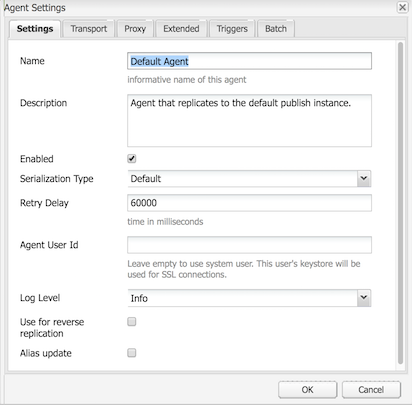

# Replica{#replication}

Gli agenti di replica sono centrali in Adobe Experience Manager (AEM) come meccanismo utilizzato per:

* [Pubblicare (attivare)](/help/sites-authoring/publishing-pages.md#activatingcontent) contenuti da un autore a un ambiente di pubblicazione.
* Esegui lo scaricamento esplicito del contenuto dalla cache del Dispatcher.
* Restituisci l’input dell’utente (ad esempio, l’input del modulo) dall’ambiente di pubblicazione all’ambiente di authoring (sotto il controllo dell’ambiente di authoring).

Le richieste sono [accodate](/help/sites-deploying/osgi-configuration-settings.md#apacheslingjobeventhandler) all’agente appropriato per l’elaborazione.

>[!NOTE]
>
>I dati utente (utenti, gruppi di utenti e profili utente) non vengono replicati tra le istanze di authoring e pubblicazione.
>
>Per più istanze di pubblicazione, i dati utente vengono distribuiti Sling quando [Sincronizzazione utente](/help/sites-administering/sync.md) è abilitato.

## Replicazione dall&#39;autore alla pubblicazione {#replicating-from-author-to-publish}

La replica, su un’istanza o un dispatcher di pubblicazione, avviene in diversi passaggi:

* l&#39;autore richiede la pubblicazione (attivazione) di determinati contenuti; questo può essere avviato da una richiesta manuale o da attivatori automatici preconfigurati.
* la richiesta viene trasmessa all’agente di replica predefinito appropriato; un ambiente può avere diversi agenti predefiniti che saranno sempre selezionati per tali azioni.
* l’agente di replica &quot;crea un pacchetto&quot; per il contenuto e lo inserisce nella coda di replica.
* nella scheda Siti web l&#39; [indicatore di stato colorato](/help/sites-authoring/publishing-pages.md#determiningpagepublicationstatus) è impostato per le singole pagine.
* il contenuto viene rimosso dalla coda e trasportato all’ambiente di pubblicazione utilizzando il protocollo configurato; di solito questo è HTTP.
* un servlet nell’ambiente di pubblicazione riceve la richiesta e pubblica il contenuto ricevuto; il servlet predefinito è `https://localhost:4503/bin/receive`.

* è possibile configurare più ambienti di authoring e pubblicazione.

### Replicazione da Pubblica all&#39;autore {#replicating-from-publish-to-author}

Alcune funzioni consentono agli utenti di immettere dati in un’istanza di pubblicazione.

In alcuni casi, è necessario un tipo di replica noto come replica inversa per restituire questi dati all’ambiente di authoring da cui viene ridistribuito ad altri ambienti di pubblicazione. Per motivi di sicurezza, il traffico dall’ambiente di pubblicazione a quello di authoring deve essere rigorosamente controllato.

La replica inversa utilizza un agente nell’ambiente di pubblicazione che fa riferimento all’ambiente di authoring. Questo agente inserisce i dati in una casella in uscita. A questa casella in uscita corrispondono ascoltatori di replica nell’ambiente di authoring. Gli ascoltatori raccolgono le caselle in uscita per raccogliere tutti i dati immessi e quindi li distribuiscono secondo necessità. In questo modo l’ambiente di authoring controlla tutto il traffico.

In altri casi, ad esempio per le funzioni di Communities (ad esempio, forum, blog, commenti e revisioni), è difficile sincronizzare in modo efficiente tra le istanze AEM utilizzando la replica la quantità di contenuto generato dall’utente (UGC) inserito nell’ambiente di pubblicazione.

AEM [Communities](/help/communities/overview.md) non utilizza mai la replica per UGC. Al contrario, la distribuzione per Communities richiede un archivio comune per UGC (consulta [Archiviazione dei contenuti della community](/help/communities/working-with-srp.md)).

### Replica - Predefinita {#replication-out-of-the-box}

Il sito web we-retail incluso in un&#39;installazione standard di AEM può essere utilizzato per illustrare la replica.

Per seguire questo esempio e utilizzare gli agenti di replica predefiniti è necessario [Installare AEM](/help/sites-deploying/deploy.md) con:

* ambiente di authoring sulla porta `4502`
* ambiente di pubblicazione sulla porta `4503`

>[!NOTE]
>
>Opzione attivata per impostazione predefinita :
>
>* Agenti sull&#39;autore : Agente predefinito (pubblicazione)
>
>
Effettivamente disattivato per impostazione predefinita (a partire dal AEM 6.1) :
>
>* Agenti sull&#39;autore : Agente di replica inversa (publish_reverse)
>* Agenti in pubblicazione : Replica inversa (in uscita)

>
>
Per controllare lo stato dell&#39;agente o della coda, utilizza la console **Strumenti** .
>Consulta [Monitoraggio degli agenti di replica](#monitoring-your-replication-agents).

#### Replica (da autore a pubblicazione) {#replication-author-to-publish}

1. Passa alla pagina di supporto nell’ambiente di authoring.
   **https://localhost:4502/content/we-retail/us/en/experience.html** `<pi>`
1. Modificare la pagina per aggiungere del nuovo testo.
1. **Attiva la** pagina per pubblicare le modifiche.
1. Apri la pagina di supporto nell’ambiente di pubblicazione:
   **https://localhost:4503/content/we-retail/us/en/experience.html**
1. È ora possibile visualizzare le modifiche inserite durante l’authoring.

Questa replica viene eseguita dall’ambiente di authoring tramite:

* **Agente predefinito (pubblicazione)**
Questo agente replica il contenuto nell&#39;istanza di pubblicazione predefinita.
I dettagli (configurazione e registri) sono accessibili dalla console Strumenti dell’ambiente di authoring; o:

   `https://localhost:4502/etc/replication/agents.author/publish.html`.

#### Agenti di replica: fuori dalla scatola {#replication-agents-out-of-the-box}

I seguenti agenti sono disponibili in un&#39;installazione standard AEM:

* [Default ](#replication-author-to-publish)
AgentUtilizzato per la replica dall&#39;autore alla pubblicazione.

* Flush del Dispatcher
Viene utilizzato per gestire la cache del Dispatcher. Per ulteriori informazioni, consulta [Annullamento della validità della cache del Dispatcher dall’ambiente di authoring](https://helpx.adobe.com/experience-manager/dispatcher/using/page-invalidate.html#invalidating-dispatcher-cache-from-the-authoring-environment) e [Annullamento della validità della cache del Dispatcher da un’istanza di pubblicazione](https://helpx.adobe.com/experience-manager/dispatcher/using/page-invalidate.html#invalidating-dispatcher-cache-from-a-publishing-instance) .

* [Replicazione inversaUtilizzata per la replica da pubblicazione a authoring. ](#reverse-replication-publish-to-author)
La replica inversa non viene utilizzata per le funzioni di Communities, ad esempio forum, blog e commenti. È disabilitata in modo efficace in quanto la casella in uscita non è abilitata. L&#39;utilizzo della replica inversa richiederebbe una configurazione personalizzata.

* Agente statico
Questo è un &quot;Agente che memorizza una rappresentazione statica di un nodo nel filesystem.&quot;
Ad esempio, con le impostazioni predefinite, le pagine di contenuto e le risorse dam vengono memorizzate in `/tmp`, come HTML o nel formato di risorsa appropriato. Consulta le schede `Settings` e `Rules` per la configurazione.
Questo è stato richiesto in modo che, quando la pagina viene richiesta direttamente dal server dell&#39;applicazione, il contenuto possa essere visualizzato. Si tratta di un agente specializzato e (probabilmente) non sarà necessario per la maggior parte delle istanze.

## Agenti di replica: parametri di configurazione {#replication-agents-configuration-parameters}

Durante la configurazione di un agente di replica dalla console Strumenti, nella finestra di dialogo sono disponibili quattro schede:

### Impostazioni {#settings}

* **Nome**

   Un nome univoco per l&#39;agente di replica.

* **Descrizione**

   Descrizione dello scopo che verrà utilizzato da questo agente di replica.

* **Abilitato**

   Indica se l&#39;agente di replica è attualmente abilitato.

   Quando l’agente è **abilitato** la coda viene visualizzata come:

   * **** Attiva quando gli elementi vengono elaborati.
   * **** Inattivo quando la coda è vuota.
   * **** Bloccato quando gli elementi sono in coda, ma non possono essere elaborati; ad esempio, quando la coda ricevente è disabilitata.

* **Tipo di serializzazione**

   Tipo di serializzazione:

   * **Predefinito**: Imposta se l&#39;agente deve essere selezionato automaticamente.
   * **Flush** del Dispatcher: Seleziona questa opzione se l’agente deve essere utilizzato per lo scaricamento della cache del dispatcher.

* **Ritardo per riprovare**

   Il ritardo (in millisecondi) tra due tentativi, in caso di problemi.

   Impostazione predefinita: `60000`

* **ID utente agente**

   A seconda dell’ambiente, l’agente utilizza questo account utente per:

   * raccogliere e creare pacchetti di contenuti dall’ambiente di authoring
   * creare e scrivere i contenuti nell’ambiente di pubblicazione

   Lascia vuoto questo campo per utilizzare l’account utente di sistema (l’account definito in sling come utente amministratore); per impostazione predefinita è `admin`).

   >[!CAUTION]
   >
   >Per un agente nell&#39;ambiente di authoring, questo account *deve* deve avere accesso in lettura a tutti i percorsi che si desidera replicare.

   >[!CAUTION]
   >
   >Per un agente nell&#39;ambiente di pubblicazione, questo account *deve* disporre dell&#39;accesso di creazione/scrittura necessario per replicare il contenuto.

   >[!NOTE]
   >
   >Può essere utilizzato come meccanismo per selezionare contenuti specifici per la replica.

* **Livello registro**

   Specifica il livello di dettaglio da utilizzare per i messaggi di log.

   * `Error`: verranno registrati solo gli errori
   * `Info`: verranno registrati errori, avvisi e altri messaggi informativi
   * `Debug`: nei messaggi verrà utilizzato un alto livello di dettaglio, principalmente a scopo di debug

   Impostazione predefinita: `Info`

* **Usa per replica inversa**

   Indica se questo agente verrà utilizzato per la replica inversa; restituisce l’input dell’utente dall’ambiente di pubblicazione a quello di authoring.

* **Aggiornamento alias**

   Selezionando questa opzione, le richieste di annullamento della validità di un alias o di un percorso personalizzato vengono abilitate in Dispatcher. Inoltre, consulta [Configurazione di un agente di svuotamento del dispatcher](/help/sites-deploying/replication.md#configuring-a-dispatcher-flush-agent).

#### Trasporto {#transport}

* **URI**

   Specifica il servlet di ricezione nella posizione di destinazione. In particolare, qui puoi specificare il nome host (o alias) e il percorso contestuale dell’istanza di destinazione.

   Esempio:

   * Un agente predefinito può replicare in `https://localhost:4503/bin/receive`
   * Un agente di svuotamento del dispatcher può replicarsi in `https://localhost:8000/dispatcher/invalidate.cache`

   Il metodo di trasporto sarà determinato dal protocollo qui specificato (HTTP o HTTPS).

   Per gli agenti Dispatcher Flush, la proprietà URI viene utilizzata solo se si utilizzano voci virtualhost basate sul percorso per differenziare tra le farm, utilizzando questo campo per indirizzare la farm per annullare la validità. Ad esempio, la farm n. 1 ha un host virtuale di `www.mysite.com/path1/*` e la farm n. 2 ha un host virtuale di `www.mysite.com/path2/*`. Puoi utilizzare un URL di `/path1/invalidate.cache` per eseguire il targeting della prima farm e `/path2/invalidate.cache` per la seconda farm.

* **User**

   Nome utente dell’account da utilizzare per accedere alla destinazione.

* **Password**

   Password dell’account da utilizzare per accedere alla destinazione.

* **Dominio NTLM**

   Dominio per l’autenticazione NTML.

* **Host NTLM**

   Host per l’autenticazione NTML.

* **Abilita SSL relaxed**

   Abilita questa opzione se desideri che i certificati SSL autocertificati siano accettati.

* **Consenti certificati scaduti**

   Abilita questa opzione se desideri che i certificati SSL scaduti siano accettati.

#### Proxy {#proxy}

Le seguenti impostazioni sono necessarie solo se è necessario un proxy:

* **Host proxy**

   Nome host del proxy utilizzato per il trasporto.

* **Porta proxy**

   Porta del proxy.

* **Utente proxy**

   Nome utente dell’account da utilizzare.

* **Password proxy**

   Password dell’account da utilizzare.

* **Dominio proxy NTLM**

   Dominio proxy NTLM.

* **Host proxy NTLM**

   Dominio proxy NTLM.

#### Esteso {#extended}

* **Interfaccia**

   Qui è possibile definire l&#39;interfaccia socket a cui eseguire il binding.

   Imposta l’indirizzo locale da utilizzare per la creazione di connessioni. Se non è impostato, verrà utilizzato l’indirizzo predefinito. Questa opzione è utile per specificare l’interfaccia da utilizzare su sistemi multihomed o cluster.

* **Metodo HTTP**

   Il metodo HTTP da utilizzare.

   Per un agente Dispatcher Flush questo è quasi sempre GET e non deve essere modificato (POST sarebbe un altro valore possibile).

* **Intestazioni HTTP**

   Questi vengono utilizzati per gli agenti di svuotamento del dispatcher e specificano gli elementi che devono essere scaricati.

   Per un agente Dispatcher Flush le tre voci standard non devono essere modificate:

   * `CQ-Action:{action}`
   * `CQ-Handle:{path}`
   * `CQ-Path:{path}`

   Questi vengono utilizzati, a seconda dei casi, per indicare l&#39;azione da utilizzare per lo scaricamento della maniglia o del percorso. I sottoparametri sono dinamici:

   * `{action}` indica un&#39;azione di replica

   * `{path}` indica un percorso

   Sono sostituiti dal percorso/azione pertinente alla richiesta e quindi non devono essere &quot;hardcoded&quot;:

   >[!NOTE]
   >
   >Se hai installato AEM in un contesto diverso da quello predefinito consigliato, dovrai registrare il contesto nelle intestazioni HTTP. Esempio:
   >`CQ-Handle:/<*yourContext*>{path}`

* **Chiudi connessione**

   Abilita la chiusura della connessione dopo ogni richiesta.

* **Timeout connessione**

   Timeout (in millisecondi) da applicare durante il tentativo di stabilire una connessione.

* **Timeout socket**

   Timeout (in millisecondi) da applicare in attesa del traffico dopo l’impostazione di una connessione.

* **Versione protocollo**

   Versione del protocollo; ad esempio `1.0` per HTTP/1.0.

#### Attivatori {#triggers}

Queste impostazioni vengono utilizzate per definire i trigger per la replica automatizzata:

* **Ignora predefinito**

   Se questa opzione è selezionata, l’agente viene escluso dalla replica predefinita; ciò significa che non verrà utilizzato se un autore di contenuti rilascia un’azione di replica.

* **In caso di modifica**

   In questo caso, una replica di questo agente verrà attivata automaticamente quando una pagina viene modificata. Viene utilizzato principalmente per gli agenti Dispatcher Flush, ma anche per la replica inversa.

* **Al momento della distribuzione**

   Se questa opzione è selezionata, l’agente replicherà automaticamente qualsiasi contenuto contrassegnato per la distribuzione al momento della modifica.

* **Raggiunto On/Offtime**

   Questo attiverà la replica automatica (per attivare o disattivare una pagina a seconda delle necessità) quando si verificano i tempi di attivazione o disattivazione definiti per una pagina. Viene utilizzato principalmente per gli agenti Dispatcher Flush.

* **Al ricevimento**

   Se questa opzione è selezionata, l’agente eseguirà la replica a catena ogni volta che riceve eventi di replica.

* **Nessun aggiornamento di stato**

   Quando questa opzione è selezionata, l&#39;agente non forza un aggiornamento dello stato di replica.

* **Nessun controllo delle versioni**

   Se questa opzione è selezionata, l’agente non forza il controllo delle versioni delle pagine attivate.

## Configurazione degli agenti di replica {#configuring-your-replication-agents}

Per informazioni sulla connessione degli agenti di replica all&#39;istanza di pubblicazione utilizzando MSSL, consulta [Replicazione utilizzando Mutual SSL](/help/sites-deploying/mssl-replication.md).

### Configurazione degli agenti di replica dall’ambiente di authoring {#configuring-your-replication-agents-from-the-author-environment}

Dalla scheda Strumenti nell’ambiente di authoring è possibile configurare gli agenti di replica che risiedono nell’ambiente di authoring (**Agenti sull’autore**) o nell’ambiente di pubblicazione (**Agenti su pubblicazione**). Le procedure seguenti illustrano la configurazione di un agente per l’ambiente di authoring, ma possono essere utilizzate per entrambi.

>[!NOTE]
>
>Quando un dispatcher gestisce le richieste HTTP per le istanze di authoring o pubblicazione, la richiesta HTTP dell’agente di replica deve includere l’intestazione PATH. Oltre alla procedura seguente, devi aggiungere l’intestazione PATH all’elenco del dispatcher delle intestazioni client. (Vedere [/clientheaders (intestazioni client)](https://helpx.adobe.com/experience-manager/dispatcher/using/dispatcher-configuration.html#specifying-the-http-headers-to-pass-through-clientheaders). 

1. Accedi alla scheda **Strumenti** in AEM.
1. Fare clic su **Replica** (riquadro a sinistra per aprire la cartella).
1. Fare doppio clic su **Agenti sull&#39;autore** (nel riquadro a sinistra o a destra).
1. Fai clic sul nome dell’agente appropriato (che è un collegamento) per visualizzare informazioni dettagliate su tale agente.
1. Fai clic su **Modifica** per aprire la finestra di dialogo di configurazione:

   

1. I valori forniti devono essere sufficienti per un&#39;installazione predefinita. Se apporti modifiche fai clic su **OK** per salvarle (per ulteriori informazioni sui singoli parametri, consulta [Agenti di replica - Parametri di configurazione](#replication-agents-configuration-parameters) ).

>[!NOTE]
>
>Un&#39;installazione standard di AEM specifica `admin` come utente per le credenziali di trasporto all&#39;interno degli agenti di replica predefiniti.
>
>Questo deve essere modificato in un account utente di replica specifico per il sito con i privilegi per replicare i percorsi richiesti.

### Configurazione della replica inversa {#configuring-reverse-replication}

La replica inversa viene utilizzata per riportare il contenuto dell’utente generato in un’istanza di pubblicazione a un’istanza di authoring. Questa funzione è comunemente utilizzata per funzioni quali sondaggi e moduli di registrazione.

Per motivi di sicurezza, la maggior parte delle topologie di rete non consente connessioni *da* alla &quot;Zona demilitarizzata&quot; (una sottorete che espone i servizi esterni a una rete non attendibile, come Internet).

Poiché l’ambiente di pubblicazione si trova in genere nella DMZ, per riportare i contenuti all’ambiente di authoring la connessione deve essere avviata dall’istanza di authoring. Questa operazione viene eseguita con:

* una *casella in uscita* nell’ambiente di pubblicazione in cui è posizionato il contenuto.
* nell’ambiente di authoring, un agente (pubblicazione) che controlla periodicamente la casella in uscita per i nuovi contenuti.

>[!NOTE]
>
>Per AEM [Communities](/help/communities/overview.md), la replica non viene utilizzata per i contenuti generati dall&#39;utente in un&#39;istanza di pubblicazione. Consulta [Archiviazione dei contenuti della community](/help/communities/working-with-srp.md).

A questo scopo è necessario:

**Agente di replica inversa nell’** ambiente di authoringQuesto agisce come componente attivo per raccogliere informazioni dalla casella in uscita nell’ambiente di pubblicazione:

Se desideri utilizzare la replica inversa, assicurati che questo agente sia attivato.

**Un agente di replica inversa nell’ambiente di pubblicazione (una casella in uscita)** Questo è l’elemento passivo in quanto agisce come una &quot;casella in uscita&quot;. L’input dell’utente viene inserito qui, da dove viene raccolto dall’agente nell’ambiente di authoring.

### Configurazione della replica per più istanze di pubblicazione {#configuring-replication-for-multiple-publish-instances}

>[!NOTE]
>
>Viene replicato solo il contenuto - i dati utente non lo sono (utenti, gruppi di utenti e profili utente).
>
>Per sincronizzare i dati utente tra più istanze di pubblicazione, abilita [Sincronizzazione utente](/help/sites-administering/sync.md).

Al momento dell’installazione, è già configurato un agente predefinito per la replica del contenuto in un’istanza di pubblicazione in esecuzione sulla porta 4503 del localhost.

Per configurare la replica dei contenuti per un’istanza di pubblicazione aggiuntiva è necessario creare e configurare un nuovo agente di replica:

1. Apri la scheda **Strumenti** in AEM.
1. Seleziona **Replica**, quindi **Agenti sull&#39;autore** nel pannello a sinistra.
1. Seleziona **Nuovo...**.
1. Imposta i valori **Titolo** e **Nome**, quindi seleziona **Agente di replica**.
1. Fai clic su **Crea** per creare il nuovo agente.
1. Fai doppio clic sul nuovo elemento dell&#39;agente per aprire il pannello di configurazione.
1. Fai clic su **Modifica** - si aprirà la finestra di dialogo **Impostazioni agente** - il **Tipo di serializzazione** è già definito come Predefinito, questo deve rimanere tale.

   * Nella scheda **Impostazioni** :

      * Attivare **Enabled**.
      * Inserire una **descrizione**.
      * Imposta **Ritardo tentativi** su `60000`.

      * Lascia **Tipo di serializzazione** come `Default`.
   * Nella scheda **Trasporto** :

      * Inserisci l’URI richiesto per la nuova istanza di pubblicazione; ad esempio,
         `https://localhost:4504/bin/receive`.

      * Immettere l&#39;account utente specifico del sito utilizzato per la replica.
      * Puoi configurare altri parametri come necessario.

1. Fare clic su **OK** per salvare le impostazioni.

Puoi quindi testare l’operazione aggiornando e pubblicando una pagina nell’ambiente di authoring.

Gli aggiornamenti vengono visualizzati su tutte le istanze di pubblicazione configurate come sopra.

In caso di problemi, puoi controllare i registri nell’istanza di authoring. A seconda del livello di dettaglio richiesto, è anche possibile impostare il **Livello di log** su `Debug` utilizzando la finestra di dialogo **Impostazioni agente** come indicato sopra.

>[!NOTE]
>
>Questo può essere combinato con l&#39;uso dell&#39; [ID utente agente](#agentuserid) per selezionare contenuti diversi per la replica nei singoli ambienti di pubblicazione. Per ogni ambiente di pubblicazione:
>
>1. Configura un agente di replica per la replica in tale ambiente di pubblicazione.
>1. Configurare un account utente; con i diritti di accesso necessari per leggere il contenuto che verrà replicato in tale ambiente di pubblicazione specifico.
>1. Assegna l&#39;account utente come **ID utente agente** per l&#39;agente di replica.

>

### Configurazione di un agente di svuotamento del dispatcher {#configuring-a-dispatcher-flush-agent}

Gli agenti predefiniti sono inclusi nell’installazione. Tuttavia, è ancora necessaria una certa configurazione e lo stesso vale se definisci un nuovo agente:

1. Apri la scheda **Strumenti** in AEM.
1. Fare clic su **Deployment**.
1. Seleziona **Replica**, quindi **Agenti su pubblicazione**.
1. Fai doppio clic sull’elemento **Dispatcher Flush** per aprire la panoramica.
1. Fai clic su **Modifica** - si aprirà la finestra di dialogo **Impostazioni agente**:

   * Nella scheda **Impostazioni** :

      * Attivare **Enabled**.
      * Inserire una **descrizione**.
      * Lascia **Tipo di serializzazione** come `Dispatcher Flush` o impostalo come tale se crei un nuovo agente.

      * (Facoltativo) Seleziona **Aggiornamento alias** per abilitare le richieste di invalidazione di alias o percorsi personalizzati a Dispatcher.
   * Nella scheda **Trasporto** :

      * Inserisci l’URI richiesto per la nuova istanza di pubblicazione; ad esempio,
         `https://localhost:80/dispatcher/invalidate.cache`.

      * Immettere l&#39;account utente specifico del sito utilizzato per la replica.
      * Puoi configurare altri parametri come necessario.

   Per gli agenti Dispatcher Flush, la proprietà URI viene utilizzata solo se si utilizzano voci virtualhost basate sul percorso per differenziare tra le farm, utilizzando questo campo per indirizzare la farm per annullare la validità. Ad esempio, la farm n. 1 ha un host virtuale di `www.mysite.com/path1/*` e la farm n. 2 ha un host virtuale di `www.mysite.com/path2/*`. Puoi utilizzare un URL di `/path1/invalidate.cache` per eseguire il targeting della prima farm e `/path2/invalidate.cache` per la seconda farm.

   >[!NOTE]
   >
   >Se hai installato AEM in un contesto diverso da quello predefinito consigliato, devi configurare le [intestazioni HTTP](#extended) nella scheda **Extended** .

1. Fate clic su **OK** per salvare le modifiche.
1. Torna alla scheda **Strumenti**, da qui puoi **Attivare** l’ **Agente di svuotamento del dispatcher** (**Agenti su pubblicazione**).

L&#39;agente di replica **Dispatcher Flush** non è attivo sull&#39;autore. È possibile accedere alla stessa pagina nell’ambiente di pubblicazione utilizzando l’URI equivalente; ad esempio, `https://localhost:4503/etc/replication/agents.publish/flush.html`.

### Controllo dell&#39;accesso agli agenti di replica {#controlling-access-to-replication-agents}

L&#39;accesso alle pagine utilizzate per configurare gli agenti di replica può essere controllato utilizzando le autorizzazioni di pagina utente e/o gruppo sul nodo `etc/replication`.

>[!NOTE]
>
>L’impostazione di tali autorizzazioni non avrà alcun effetto sugli utenti che replicano il contenuto (ad esempio, dalla console Siti web o dall’opzione della barra laterale). Il framework di replica non utilizza la &quot;sessione utente&quot; dell&#39;utente corrente per accedere agli agenti di replica durante la replica delle pagine.

### Configurazione degli agenti di replica da CRXDE Lite {#configuring-your-replication-agents-from-crxde-lite}

>[!NOTE]
>
>La creazione di agenti di replica è supportata solo nel percorso dell&#39;archivio `/etc/replication`. Questo è necessario per gestire correttamente le ACL associate. La creazione di un agente di replica in un&#39;altra posizione della struttura potrebbe causare l&#39;accesso non autorizzato.

È possibile configurare diversi parametri degli agenti di replica utilizzando CRXDE Lite.

Se passi a `/etc/replication` puoi vedere i seguenti tre nodi:

* `agents.author`
* `agents.publish`
* `treeactivation`

I due `agents` contengono informazioni di configurazione sull&#39;ambiente appropriato e sono attivi solo quando tale ambiente è in esecuzione. Ad esempio, `agents.publish` verrà utilizzato solo nell’ambiente di pubblicazione. La schermata seguente mostra l’agente di pubblicazione nell’ambiente di authoring, come incluso in AEM WCM:

## Monitoraggio degli agenti di replica {#monitoring-your-replication-agents}

Per monitorare un agente di replica:

1. Accedi alla scheda **Strumenti** in AEM.
1. Fate clic su **Replica**.
1. Fare doppio clic sul collegamento agli agenti per l’ambiente appropriato (nel riquadro a sinistra o a destra); ad esempio **Agenti su author**.

   La finestra risultante mostra una panoramica di tutti gli agenti di replica per l’ambiente di authoring, inclusi la destinazione e lo stato.

1. Fai clic sul nome dell&#39;agente appropriato (che è un collegamento) per visualizzare informazioni dettagliate su tale agente:

   

   È possibile:

   * Controlla se l&#39;agente è abilitato.
   * Visualizza il target di qualsiasi replica.
   * Controlla se la coda di replica è attualmente attiva (abilitata).
   * Controlla se ci sono elementi nella coda.
   * **** Aggiorna o  **** cancella per aggiornare la visualizzazione delle voci della coda; questo consente di vedere gli elementi entrare e uscire dalla coda.

   * **Visualizza** Logper accedere al registro di eventuali azioni dell’agente di replica.
   * **Testa** la connessione all&#39;istanza target.
   * **Se necessario, forza** ritrasmettere gli elementi della coda.

   >[!CAUTION]
   >
   >Non utilizzare il collegamento &quot;Prova connessione&quot; per la casella in uscita Replicazione inversa in un&#39;istanza di pubblicazione.
   >
   >
   >Se viene eseguito un test di replica per una coda in uscita, tutti gli elementi più vecchi della replica di test verranno rielaborati con ogni replica inversa.
   >
   >
   >Se tali elementi esistono già in una coda, possono essere trovati con la seguente query XPath JCR e devono essere rimossi.
   >
   >
   >`/jcr:root/var/replication/outbox//*[@cq:repActionType='TEST']`

## Replica batch {#batch-replication}

La replica batch non replica singole pagine o risorse, ma attende l’attivazione della prima soglia dei due, in base a tempo o dimensioni.

Poi comprime tutti gli elementi di replica in un pacchetto, che viene replicato come un singolo file all&#39;editore.

L&#39;editore decomprime tutti gli elementi, li salva e crea un rapporto all&#39;autore.

### Configurazione della replica in batch {#configuring-batch-replication}

1. Passa a `http://serveraddress:serverport/siteadmin`
1. Premere l&#39;icona **[!UICONTROL Strumenti]** nella parte superiore dello schermo
1. Dalla barra di navigazione a sinistra, vai a **[!UICONTROL Replica - Agenti su Autore]** e fai doppio clic su **[!UICONTROL Agente predefinito]**.
   * Puoi anche raggiungere l&#39;agente di replica di pubblicazione predefinito andando direttamente a `http://serveraddress:serverport/etc/replication/agents.author/publish.html`
1. Premere il tasto **[!UICONTROL Edit]** sopra la coda di replica.
1. Nella finestra seguente, vai alla scheda **[!UICONTROL Batch]** :
   
1. Configura l&#39;agente.

### Parametri {#parameters}

* `[!UICONTROL Enable Batch Mode]` - abilita o disabilita la modalità di replica batch
* `[!UICONTROL Max Wait Time]` - Tempo massimo di attesa per l&#39;avvio di una richiesta batch, in secondi. Il valore predefinito è 2 secondi.
* `[!UICONTROL Trigger Size]` - Avvia la replica batch quando questo limite di dimensioni

## Risorse aggiuntive {#additional-resources}

Per informazioni dettagliate sulla risoluzione dei problemi, consulta la pagina [Risoluzione dei problemi di replica](/help/sites-deploying/troubleshoot-rep.md) .