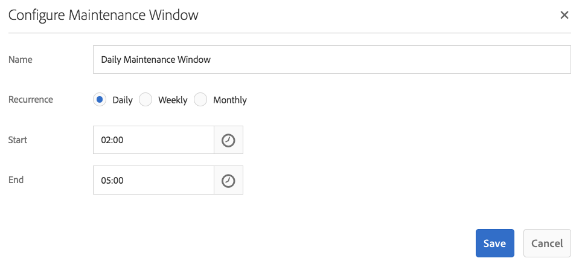
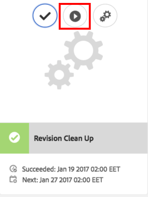

# Pulizia revisioni{#revision-cleanup}

## Introduzione {#introduction}

Ogni aggiornamento del repository crea una nuova revisione del contenuto. Di conseguenza, con ogni aggiornamento le dimensioni dell&#39;archivio crescono. Per evitare una crescita incontrollata dell&#39;archivio, è necessario ripulire le vecchie revisioni per liberare le risorse del disco. Questa funzionalità di manutenzione è denominata Revision Cleanup (Pulizia delle revisioni). È disponibile come routine offline dal AEM 6.0.

Con AEM 6.3 e versioni successive, è stata introdotta una versione online di questa funzionalità chiamata Pulizia revisioni online. Rispetto al cleanup delle revisioni offline in cui l&#39;istanza AEM deve essere chiusa, il cleanup delle revisioni online può essere eseguito mentre l&#39;istanza AEM è online. Il cleanup delle revisioni online è attivato per impostazione predefinita ed è il modo consigliato per eseguire una pulizia delle revisioni.

**Nota**: [Guarda il video](https://helpx.adobe.com/experience-manager/kt/platform-repository/using/revision-cleanup-technical-video-use.html) per un&#39;introduzione e come utilizzare il cleanup delle revisioni online.

Il processo di pulizia della revisione si articola in tre fasi: **stima**, **compattazione** e **pulire**. La stima determina se eseguire la fase successiva (compattazione) o meno in base alla quantità di rifiuti che potrebbero essere raccolti. Durante la fase di compattazione i segmenti e i file tar vengono riscritti lasciando fuori qualsiasi contenuto non utilizzato. La fase di pulizia rimuove successivamente i vecchi segmenti, compresi eventuali rifiuti che potrebbero contenere. In genere, la modalità offline può recuperare più spazio perché la modalità online deve tenere conto AEM set di lavoro che mantiene i segmenti aggiuntivi da raccogliere.

Per ulteriori dettagli sul cleanup delle revisioni, vedere i seguenti collegamenti:

* [Come eseguire il cleanup delle revisioni online](/help/sites-deploying/revision-cleanup.md#how-to-run-online-revision-cleanup)
* [Domande frequenti sul cleanup delle revisioni online](/help/sites-deploying/revision-cleanup.md#online-revision-cleanup-frequently-asked-questions)
* [Come eseguire il cleanup delle revisioni offline](/help/sites-deploying/revision-cleanup.md#how-to-run-offline-revision-cleanup)

Inoltre, puoi anche leggere il [documentazione ufficiale Oak.](https://jackrabbit.apache.org/oak/docs/nodestore/segment/overview.html)

### Quando utilizzare il cleanup delle revisioni online anziché il cleanup delle revisioni offline? {#when-to-use-online-revision-cleanup-as-opposed-to-offline-revision-cleanup}

**Pulizia revisioni online è il modo consigliato per eseguire la pulizia revisioni.** Il cleanup delle revisioni offline deve essere utilizzato solo su base eccezionale, ad esempio prima di eseguire la migrazione al nuovo formato di archiviazione o se l&#39;Assistenza clienti Adobe ti richiede di farlo.

## Come eseguire il cleanup delle revisioni online {#how-to-run-online-revision-cleanup}

Il cleanup delle revisioni online è configurato per impostazione predefinita per essere eseguito automaticamente una volta al giorno sia sulle istanze di AEM Author che Publish. È sufficiente definire la finestra di manutenzione durante un periodo con la minore attività dell’utente. È possibile configurare l&#39;attività Pulizia revisioni online come segue:

1. Nella finestra AEM principale, vai a **Strumenti - Operazioni - Dashboard - Manutenzione** o rivolgiti al tuo browser per: `https://serveraddress:serverport/libs/granite/operations/content/maintenance.html`

   

1. Passa il cursore **Finestra Manutenzione giornaliera** e fai clic su **Impostazioni** icona.

   

1. Immetti i valori desiderati (ricorrenza, ora di inizio, ora di fine) e fai clic su **Salva**.

   

In alternativa, se si desidera eseguire manualmente l&#39;attività di pulizia della revisione, è possibile:

1. Vai a **Strumenti - Operazioni - Dashboard - Manutenzione** o sfogliare direttamente in `https://serveraddress:serverport/libs/granite/operations/content/maintenance.html`
1. Fai clic sul pulsante **Finestra Manutenzione giornaliera**.
1. Passa il puntatore del mouse **Pulizia revisioni** icona.
1. Fai clic su **Esegui**.

   

### Esecuzione del cleanup delle revisioni online dopo il cleanup delle revisioni offline {#running-online-revision-cleanup-after-offline-revision-cleanup}

Il processo di pulizia revisioni recupera vecchie revisioni per generazioni. Ciò significa che ogni volta che si esegue il cleanup delle revisioni viene creata e mantenuta una nuova generazione sul disco. Esiste tuttavia una differenza tra i due tipi di pulizia revisioni: la pulizia revisioni offline mantiene una generazione mentre la pulizia revisioni online mantiene due generazioni. Quindi, quando esegui la pulizia revisioni online **dopo** la pulizia della revisione offline avviene come segue:

1. Dopo la prima esecuzione di pulizia della revisione online, la dimensione dell&#39;archivio raddoppierà. Questo accade perché ci sono due generazioni che vengono conservate sul disco.
1. Durante le esecuzioni successive, l&#39;archivio cresce temporaneamente durante la creazione della nuova generazione e quindi si stabilizza di nuovo alle dimensioni che aveva dopo la prima esecuzione, in quanto il processo di pulizia della revisione online rireclama la generazione precedente.

Inoltre, ricorda che a seconda del tipo e del numero di commit, ogni generazione può variare in dimensione rispetto a quella precedente, in modo che la dimensione finale possa variare da un&#39;esecuzione all&#39;altra.

A causa di questo fatto, si raccomanda di dimensionare il disco almeno due o tre volte più grande della dimensione dell&#39;archivio inizialmente stimata.

## Modalità Di Compattazione Completa E Dettagliata  {#full-and-tail-compaction-modes}

**AEM 6.5** Introduce **due nuove modalità** per **compattazione** fase del processo di pulizia delle revisioni online:

* La **compattazione completa** la modalità riscrive tutti i segmenti e i file tar nell&#39;intero archivio. La successiva fase di pulizia può quindi rimuovere la quantità massima di rifiuti nel repository. Dal momento che la compattazione completa interessa l&#39;intero archivio, richiede una notevole quantità di risorse di sistema e tempo per essere completata. La compattazione completa corrisponde alla fase di compattazione del AEM 6.3.
* La **compattazione della coda** la modalità riscrive solo i segmenti e i file tar più recenti nell’archivio. I segmenti e i file tar più recenti sono quelli che sono stati aggiunti dopo l’ultima esecuzione della compattazione completa o tail. La successiva fase di pulizia può quindi rimuovere solo i rifiuti contenuti nella parte recente dell&#39;archivio. Poiché la compattazione di coda influisce solo su una parte dell&#39;archivio, richiede notevolmente meno risorse di sistema e tempo per completare la compattazione completa.

Tali modalità di compattazione costituiscono un compromesso tra efficienza e consumo di risorse: mentre la compattazione della coda è meno efficace, ha anche un minore impatto sul normale funzionamento del sistema. Al contrario, la compattazione completa è più efficace ma ha un impatto maggiore sul normale funzionamento del sistema.

AEM 6.5 introduce anche un meccanismo di deduplicazione dei contenuti più efficiente durante la compattazione, che riduce ulteriormente l’impronta su disco dell’archivio.

I due grafici qui di seguito, presentano i risultati di prove interne di laboratorio che illustrano la riduzione dei tempi medi di esecuzione e l&#39;impronta media su disco nella AEM 6.5 rispetto alla AEM 6.3:

 

### Come configurare la compattazione completa e dettagliata {#how-to-configure-full-and-tail-compaction}

La configurazione predefinita esegue la compattazione della coda nei giorni della settimana e la compattazione completa la domenica. La configurazione predefinita può essere modificata utilizzando il nuovo valore di configurazione `full.gc.days` del `RevisionCleanupTask` [operazione di manutenzione](/help/sites-deploying/revision-cleanup.md#how-to-run-online-revision-cleanup).

Quando configuri le `full.gc.days` Il valore indica che la compattazione completa verrà eseguita durante i giorni definiti nel valore e la compattazione tail verrà eseguita nei giorni non definiti nel valore. Ad esempio, se configuri la compattazione completa da eseguire domenica, la compattazione della coda viene eseguita dal lunedì al sabato. Se, ad esempio, si configura la compattazione completa per l&#39;esecuzione ogni giorno della settimana, la compattazione della coda non verrà eseguita affatto.

Inoltre, prendere in considerazione che:

* **Compattazione della coda** è meno efficace e ha un minore impatto sulle normali operazioni del sistema. Esso è pertanto destinato ad essere eseguito nei giorni lavorativi.
* **Compattazione completa** è più efficace, ma ha anche un impatto maggiore sulle normali operazioni del sistema. È pertanto destinato ad essere utilizzato fuori dei giorni lavorativi.
* La compattazione della coda e la compattazione completa dovrebbero essere programmate per funzionare durante le ore di punta.

### Risoluzione dei problemi {#troubleshooting}

Quando si utilizzano le nuove modalità di compattazione, tenere presente quanto segue:

* Puoi monitorare l’attività di input/output (I/O), ad esempio: Operazioni I/O, CPU in attesa di IO, dimensione della coda di commit. Questo aiuta a determinare se il sistema sta diventando legato a I/O e richiede l&#39;upsize.
* La `RevisionCleanupTaskHealthCheck` indica lo stato di integrità generale del cleanup delle revisioni online. Funziona come nel AEM 6.3 e non distingue tra compattazione completa e compattazione della coda.
* I messaggi di log contengono informazioni pertinenti sulle modalità di compattazione. Ad esempio, all&#39;avvio del cleanup delle revisioni online, i messaggi di log corrispondenti indicheranno la modalità di compattazione. Inoltre, in alcuni casi d’angolo, il sistema ripristina la compattazione completa quando è stato pianificato l’esecuzione di una compattazione di coda e i messaggi di log indicheranno questa modifica. I campioni di log qui sotto indicano la modalità di compattazione e il passaggio dalla coda alla completa compattazione:

```
TarMK GC: running tail compaction
TarMK GC: no base state available, running full compaction instead
```

### Limitazioni note {#known-limitations}

In alcuni casi, alternando tra la coda e le modalità di compattazione completa ritarda il processo di pulizia. Più precisamente, l’archivio crescerà dopo una compattazione completa (raddoppierà le dimensioni). Lo spazio aggiuntivo verrà recuperato nella successiva compattazione tail, quando l’archivio scende al di sotto della dimensione di compattazione precompleta. È inoltre necessario evitare l’esecuzione di operazioni di manutenzione parallele.

**Si consiglia di ridimensionare il disco almeno due o tre volte più grande della dimensione dell&#39;archivio inizialmente stimata.**

## Domande frequenti sul cleanup delle revisioni online {#online-revision-cleanup-frequently-asked-questions}

### Considerazioni sull&#39;aggiornamento a AEM 6.5 {#aem-upgrade-considerations}

<table style="table-layout:auto">
 <tbody>
  <tr>
   <td>Domande </td>
   <td>Risposte</td>
  </tr>
  <tr>
   <td>Cosa devo sapere quando eseguo l’aggiornamento a AEM 6.5?</td>
   <td><p>Il formato di persistenza di TarMK cambierà con AEM 6.5. Queste modifiche non richiedono un passaggio di migrazione proattivo. Gli archivi esistenti passeranno attraverso una migrazione continua, trasparente per l’utente. Il processo di migrazione viene avviato la prima volta AEM 6.5 (o strumenti correlati) accedono all’archivio.</p> <p><strong>Una volta avviata la migrazione al formato di persistenza AEM 6.5, l’archivio non può essere ripristinato al precedente formato di persistenza AEM 6.3.</strong></p> </td>
  </tr>
 </tbody>
</table>

### Migrazione a Oak Segment Tar {#migrating-to-oak-segment-tar}

<table style="table-layout:auto">
 <tbody>
  <tr>
   <td><strong>Domande</strong></td>
   <td><strong>Risposte</strong></td>
   <td> </td>
  </tr>
  <tr>
   <td><strong>Perché devo migrare l’archivio?</strong></td>
   <td><p>In AEM 6.3 erano necessarie modifiche al formato di storage, soprattutto per migliorare le prestazioni e l'efficacia del cleanup delle revisioni online. Queste modifiche non sono compatibili con le versioni precedenti e gli archivi creati con il vecchio segmento Oak (AEM 6.2 e precedenti) devono essere migrati.</p> <p>Ulteriori vantaggi della modifica del formato di storage:</p>
    <ul>
     <li>Migliore scalabilità (dimensioni del segmento ottimizzate).</li>
     <li>Più veloce <a href="/help/sites-administering/data-store-garbage-collection.md" target="_blank">Raccolta rifiuti dell'archivio dati</a>.<br /> </li>
     <li>Lavori a terra per miglioramenti futuri.</li>
    </ul> </td>
   <td> </td>
  </tr>
  <tr>
   <td><strong>Il formato Tar precedente è ancora supportato?</strong></td>
   <td>È supportato solo il nuovo Segment Tar di Oak con AEM 6.3 o versione successiva.</td>
   <td> </td>
  </tr>
  <tr>
   <td><strong>La migrazione dei contenuti è sempre obbligatoria?</strong></td>
   <td>Sì. A meno che non inizi con una nuova istanza, dovrai sempre eseguire la migrazione del contenuto.</td>
   <td> </td>
  </tr>
  <tr>
   <td><strong>Posso effettuare l’aggiornamento alla versione 6.3 o successiva e la migrazione in un secondo momento (ad esempio, utilizzando un’altra finestra di manutenzione)?</strong></td>
   <td>No, come spiegato in precedenza, la migrazione dei contenuti è obbligatoria.</td>
   <td> </td>
  </tr>
  <tr>
   <td><strong>È possibile evitare i tempi di inattività durante la migrazione?</strong></td>
   <td>No. Questo è uno sforzo una tantum che non può essere fatto su un'istanza in esecuzione.</td>
   <td> </td>
  </tr>
  <tr>
   <td><strong>Cosa succede se accidentalmente eseguo con un formato di archivio errato?</strong></td>
   <td>Se tenti di eseguire il modulo oak-segment su un archivio oak-segment-tar (o viceversa), l'avvio avrà esito negativo con un <em>EccezioneStatoIllegale</em> con il messaggio "Formato del segmento non valido". Non si verificherà alcun danneggiamento dei dati.</td>
   <td> </td>
  </tr>
  <tr>
   <td><strong>Sarà necessaria una reindicizzazione degli indici di ricerca?</strong></td>
   <td>No. La migrazione da oak-segment a oak-segment-tar introduce modifiche nel formato del contenitore. I dati contenuti non sono interessati e non verranno modificati.</td>
   <td> </td>
  </tr>
  <tr>
   <td><strong>Come calcolare al meglio lo spazio su disco previsto necessario durante e dopo la migrazione?</strong></td>
   <td>La migrazione equivale a ricreare l’archivio segmenti nel nuovo formato. Questo può essere utilizzato per stimare lo spazio su disco aggiuntivo necessario durante la migrazione. Dopo la migrazione, il vecchio archivio segmenti può essere eliminato per recuperare spazio.</td>
   <td> </td>
  </tr>
  <tr>
   <td><strong>Come stimare al meglio la durata della migrazione?</strong></td>
   <td>Le prestazioni di migrazione possono essere notevolmente migliorate se <a href="/help/sites-deploying/revision-cleanup.md#how-to-run-offline-revision-cleanup">pulizia revisioni offline</a> viene eseguito prima della migrazione. Tutti i clienti sono invitati a eseguirlo come prerequisito del processo di aggiornamento. In generale, la durata della migrazione dovrebbe essere simile alla durata dell’attività di pulizia della revisione offline, partendo dal presupposto che l’attività di pulizia della revisione offline sia stata eseguita prima della migrazione.</td>
   <td> </td>
  </tr>
 </tbody>
</table>

### Esecuzione del cleanup delle revisioni online {#running-online-revision-cleanup}

<table style="table-layout:auto">
 <tbody>
  <tr>
   <td><strong>Domande</strong></td>
   <td><strong>Risposte</strong></td>
   <td> </td>
  </tr>
  <tr>
   <td><strong>Con quale frequenza deve essere eseguito il cleanup delle revisioni online?</strong></td>
   <td>Una volta al giorno. Questa è la configurazione predefinita nel dashboard delle operazioni.</td>
   <td> </td>
  </tr>
  <tr>
   <td><strong>Come posso configurare l'ora di inizio dell'attività di manutenzione Pulizia revisioni online?</strong></td>
   <td>Consulta la sezione <a href="/help/sites-deploying/revision-cleanup.md#how-to-run-online-revision-cleanup">Come eseguire il cleanup delle revisioni online</a> sezione . </td>
   <td> </td>
  </tr>
  <tr>
   <td><strong>Esiste una frequenza massima che non deve essere superata per il cleanup delle revisioni online?</strong></td>
   <td>Si consiglia di eseguire il cleanup delle revisioni online una volta al giorno, come configurato per impostazione predefinita.<br /> </td>
   <td> </td>
  </tr>
  <tr>
   <td><strong>Quali sono gli indicatori chiave che determinano la frequenza con cui deve essere eseguito il cleanup delle revisioni online?</strong></td>
   <td>Non è necessario determinare la frequenza in quanto il cleanup delle revisioni online è configurato come attività di manutenzione e viene eseguito automaticamente ogni giorno.</td>
   <td> </td>
  </tr>
  <tr>
   <td><strong>Perché il cleanup delle revisioni online non recupera spazio quando viene eseguito per la prima volta?</strong></td>
   <td>Pulizia revisioni online recupera vecchie revisioni per generazioni. Viene generata una nuova generazione ogni volta che viene eseguita la pulizia della revisione. Solo il contenuto che ha almeno due generazioni sarà recuperato, il che significa che in una prima fase non c'è nulla da recuperare.</td>
   <td> </td>
  </tr>
  <tr>
   <td><strong>Perché il primo cleanup delle revisioni online non recupera spazio quando viene eseguito dopo il cleanup delle revisioni offline?</strong></td>
   <td><p>Il cleanup delle revisioni offline sta reclamando tutto tranne l'ultima generazione rispetto alle ultime due generazioni per il cleanup delle revisioni online. Nel caso di un nuovo archivio, il cleanup delle revisioni online non recupererà spazio quando viene eseguito per la prima volta dopo il cleanup delle revisioni offline perché non c'è generazione abbastanza vecchia da essere recuperata.</p> <p>Inoltre, leggere la sezione "Esecuzione del cleanup delle revisioni online dopo il cleanup delle revisioni offline" in <a href="/help/sites-deploying/revision-cleanup.md#how-to-run-online-revision-cleanup">presente capitolo</a>.</p> </td>
   <td> </td>
  </tr>
  <tr>
   <td><strong>In genere le finestre di Pulizia revisioni in linea sono diverse per Author e Publish?</strong></td>
   <td>Questo dipende dagli orari dell'ufficio e dai modelli di traffico della presenza online del cliente. Le finestre di manutenzione devono essere configurate al di fuori dei principali tempi di produzione per consentire la migliore efficacia di pulizia. Per più istanze di pubblicazione AEM (TarMK Farm), le finestre di manutenzione per il cleanup delle revisioni online devono essere scaglionate.</td>
   <td> </td>
  </tr>
  <tr>
   <td><strong>Ci sono dei prerequisiti prima di eseguire il cleanup delle revisioni online?</strong></td>
   <td><p>Il cleanup delle revisioni online è disponibile solo con le versioni AEM 6.3 e successive. Inoltre, se utilizzi una versione precedente di AEM, devi effettuare la migrazione al nuovo <a href="/help/sites-deploying/revision-cleanup.md#migrating-to-oak-segment-tar">Oak Segment Tar</a>.</p> </td>
   <td> </td>
  </tr>
  <tr>
   <td><strong>Quali sono i fattori che determinano la durata del cleanup delle revisioni online?</strong></td>
   <td>I fattori sono:<br />
    <ul>
     <li>Dimensione archivio</li>
     <li>Carica sul sistema (richieste al minuto, in particolare operazioni di scrittura)</li>
     <li>Pattern di attività (letture e scritture)</li>
     <li>Specifiche hardware (prestazioni CPU, memoria, IOPS)</li>
    </ul> </td>
   <td> </td>
  </tr>
  <tr>
   <td><strong>Gli autori possono continuare a lavorare mentre è in esecuzione il cleanup delle revisioni online?</strong></td>
   <td>Sì, il cleanup delle revisioni online può far fronte alle scritture simultanee. Tuttavia, il cleanup delle revisioni online funziona in modo più rapido ed efficiente senza transazioni di scrittura simultanee. Si consiglia di pianificare l'attività di manutenzione Pulizia revisioni online in un tempo relativamente tranquillo senza traffico molto intenso.</td>
   <td> </td>
  </tr>
  <tr>
   <td><strong>Quali sono i requisiti minimi per lo spazio su disco e la memoria heap quando si esegue il cleanup delle revisioni online?</strong></td>
   <td><p>Lo spazio su disco viene costantemente monitorato durante il cleanup delle revisioni online. Se lo spazio su disco disponibile scende al di sotto di un valore critico, il processo verrà annullato. Il valore critico è pari al 25% dell'attuale spazio su disco dell'archivio e non è configurabile.</p> <p><strong>Si consiglia di ridimensionare il disco almeno due o tre volte più grande della dimensione dell'archivio inizialmente stimata.</strong></p> <p>Lo spazio libero di heap viene monitorato continuamente durante il processo di pulizia. Se lo spazio heap libero scende al di sotto di un valore critico, il processo viene annullato. Il valore critico è configurato tramite org.apache.jackrabbit.oak.segment.SegmentNodeStoreService#MEMORY_THRESHOLD. Il valore predefinito è 15%.</p> <p>Recommendations per il dimensionamento minimo dell'heap di compattazione non è separato dai consigli di dimensionamento della memoria AEM. Come regola generale: <strong>Se un'istanza AEM ha dimensioni sufficienti per far fronte ai casi d'uso e al relativo payload previsto, il processo di pulizia otterrà memoria sufficiente.</strong></p> </td>
   <td> </td>
  </tr>
  <tr>
   <td><strong>Qual è l'impatto previsto sulle prestazioni durante l'esecuzione del cleanup delle revisioni online?</strong></td>
   <td>Il cleanup delle revisioni online è un processo in background che legge e scrive nell'archivio contemporaneamente alle normali operazioni di sistema. In particolare, potrebbe essere necessario acquisire l’accesso esclusivo all’archivio per un breve periodo di tempo, impedendo ad altri thread di scrivere nell’archivio.</td>
   <td> </td>
  </tr>
  <tr>
   <td><strong>Quanto tempo è previsto per l'esecuzione del cleanup delle revisioni online?</strong></td>
   <td>L’esecuzione non dovrebbe richiedere più di 2 ore in base agli ultimi test delle prestazioni eseguiti internamente.</td>
   <td> </td>
  </tr>
  <tr>
   <td><strong>Cosa fare se il cleanup delle revisioni online richiede più tempo?</strong></td>
   <td>
    <ul>
     <li>Assicurati che venga eseguito ogni giorno.<br /> </li>
     <li>Assicurati che venga eseguito durante attività di repository minime configurando le finestre di manutenzione in Dashboard operazioni di conseguenza.</li>
     <li>Scala le risorse di sistema (CPU, memoria, I/O).</li>
    </ul> </td>
   <td> </td>
  </tr>
  <tr>
   <td><strong>Cosa succede se il cleanup delle revisioni online supera le finestre di manutenzione configurate?</strong></td>
   <td>Assicurati che altre attività di manutenzione non ne ritardino l’esecuzione. Ciò potrebbe accadere se più attività di manutenzione rispetto a Pulizia revisioni online vengono eseguite all'interno della stessa finestra di manutenzione. Le attività di manutenzione vengono eseguite in sequenza senza un ordine configurabile.</td>
   <td> </td>
  </tr>
  <tr>
   <td><strong>Perché la revisione della raccolta degli oggetti inattivi viene ignorata?</strong></td>
   <td><p>Revision Cleanup si basa su una fase di stima per decidere se ci sono abbastanza rifiuti da pulire. Il calcolatore confronta la dimensione corrente rispetto alla dimensione dell’archivio dopo l’ultima compattazione. Se la dimensione supera il delta configurato, verrà eseguita la pulizia. Il delta della dimensione è impostato a 1 GB. Ciò significa che, se la dimensione dell’archivio non è cresciuta di 1 GB dall’ultima esecuzione di pulizia, la nuova iterazione di pulizia della revisione verrà saltata. </p> <p>Di seguito sono riportate le voci di log pertinenti per la fase di stima:</p>
    <ul>
     <li>Revision GC verrà eseguita: <em>Il delta delle dimensioni è N% o N/N (N/N byte), quindi la compattazione in esecuzione</em></li>
     <li>Revisione GC <strong>not</strong> esegui: <em>Il delta delle dimensioni è N% o N/N (N/N byte), pertanto per il momento la compattazione viene saltata</em></li>
    </ul> </td>
   <td> </td>
  </tr>
  <tr>
   <td><strong>È possibile interrompere in modo sicuro la compattazione automatica se l'impatto sulle prestazioni è troppo alto?</strong></td>
   <td>Sì. A partire da AEM 6.3 può essere arrestato in modo sicuro tramite la finestra Attività di manutenzione all'interno del dashboard delle operazioni o tramite JMX.</td>
   <td> </td>
  </tr>
  <tr>
   <td><strong>Se l'istanza di AEM viene chiusa durante un'attività di pulizia pianificata, il processo si interrompe in modo sicuro o l'arresto viene bloccato fino al termine della compattazione?</strong></td>
   <td>Il cleanup delle revisioni verrà interrotto e l'archivio verrà chiuso in modo sicuro.</td>
   <td> </td>
  </tr>
  <tr>
   <td><strong>Cosa succede quando il sistema si blocca durante il cleanup delle revisioni online?</strong></td>
   <td>In tali casi non vi è alcun rischio di corruzione dei dati. Gli avanzi dei rifiuti verranno ripuliti da una successiva esecuzione.</td>
   <td> </td>
  </tr>
  <tr>
   <td><strong>Qual è l'impatto dell'impossibilità di eseguire il cleanup delle revisioni online?</strong></td>
   <td>Degradazione delle prestazioni nel tempo.</td>
   <td> </td>
  </tr>
  <tr>
   <td><strong>Quali revisioni vengono raccolte?</strong></td>
   <td>Per impostazione predefinita, il cleanup delle revisioni online raccoglie solo revisioni di almeno 24 ore.</td>
   <td> </td>
  </tr>
  <tr>
   <td><strong>Cosa succede in caso di troppa interferenza da scritture simultanee al repository?</strong></td>
   <td><p>Se nel sistema è presente una concorrenza di scrittura, la pulizia di revisione online potrebbe richiedere l'accesso in scrittura esclusivo per eseguire il commit delle modifiche alla fine di un ciclo di compattazione. Il sistema entrerà in <strong>modalità forceCompact</strong>, come spiegato più in dettaglio nella sezione <a href="https://jackrabbit.apache.org/oak/docs/nodestore/segment/overview.html" target="_blank">documentazione oak</a>. Durante la forza compatta, viene acquisito un blocco di scrittura esclusivo per commettere finalmente le modifiche senza interferenze di scrittura simultanea. Per limitare l’impatto sui tempi di risposta è possibile definire un valore di timeout. Questo valore è impostato su 1 minuto per impostazione predefinita, il che significa che se il compatto della forza non viene completato entro 1 minuto il processo di compattazione verrà interrotto in favore dei commit simultanei.</p> <p>La durata della forza compatta dipende dai seguenti fattori:</p>
    <ul>
     <li>hardware: IOPS. La durata diminuisce con più IOPS.</li>
     <li>dimensioni archivio segmenti: La durata aumenta con le dimensioni dell’archivio segmenti.</li>
    </ul> </td>
   <td> </td>
  </tr>
  <tr>
   <td><p><strong>Come viene eseguito il cleanup delle revisioni online su un'istanza in standby?</strong></p> </td>
   <td><p>In una configurazione in standby a freddo, solo l'istanza principale deve essere configurata per eseguire il cleanup delle revisioni online. Nell'istanza di standby non è necessario pianificare in modo specifico il cleanup delle revisioni online.</p> <p>L'operazione corrispondente in un'istanza di standby è il cleanup automatico, corrispondente alla fase di pulizia del cleanup delle revisioni online. Il cleanup automatico viene eseguito sull'istanza di standby dopo l'esecuzione del cleanup delle revisioni online sull'istanza primaria.</p> <p>Le fasi di stima e compattazione non verranno eseguite in un'istanza di standby.</p> </td>
   <td> </td>
  </tr>
  <tr>
   <td><strong>Il cleanup delle revisioni offline è in grado di liberare più spazio su disco rispetto al cleanup delle revisioni online?</strong></td>
   <td><p>Il cleanup delle revisioni offline può rimuovere immediatamente le vecchie revisioni mentre il cleanup delle revisioni online deve tenere conto delle vecchie revisioni a cui lo stack dell'applicazione fa ancora riferimento. Il primo può così rimuovere i rifiuti in modo più aggressivo rispetto a quest'ultimo dove l'effetto è ammortizzato nel corso di alcuni cicli di raccolta dei rifiuti.</p> <p>Inoltre, leggere la sezione "Esecuzione del cleanup delle revisioni online dopo il cleanup delle revisioni offline" in <a href="/help/sites-deploying/revision-cleanup.md#how-to-run-online-revision-cleanup">presente capitolo</a>.</p> </td>
   <td> </td>
  </tr>
  <tr>
   <td>Considerazioni sulle operazioni dei file mappati in memoria?</td>
   <td>
    <ul>
     <li><strong>In ambienti Windows</strong>, l’accesso regolare ai file viene sempre applicato, pertanto l’accesso mappato alla memoria non viene utilizzato. Come consiglio generale, tutta la RAM disponibile dovrebbe essere assegnata all'heap e la dimensione segmentCache dovrebbe essere aumentata. Aumenta il segmentCache aggiungendo l'opzione segmentCache.size all'org.apache.jackrabbit.oak.segment.SegmentNodeStoreService.config (per esempio, segmentCache.size=20480). Ricordarsi di lasciare fuori un po' di RAM per il sistema operativo e altri processi.</li>
     <li><strong>In ambienti non Windows</strong>, aumenta le dimensioni della memoria fisica per migliorare la mappatura della memoria dell'archivio.</li>
    </ul> </td>
   <td>
    <ul>
     <li> </li>
    </ul> </td>
  </tr>
 </tbody>
</table>

### Monitoraggio del cleanup delle revisioni online {#monitoring-online-revision-cleanup}

<table style="table-layout:auto">
 <tbody>
  <tr>
   <td><strong>Cosa è necessario monitorare durante il cleanup delle revisioni online?</strong></td>
   <td>
    <ul>
     <li>Lo spazio su disco deve essere monitorato quando il cleanup delle revisioni online è abilitato. La pulizia non verrà eseguita o verrà interrotta in modo preventivo quando lo spazio su disco non è sufficiente.</li>
     <li>Controllare i registri per l'orario di completamento del cleanup delle revisioni online. Non dovrebbe richiedere più di 2 ore.</li>
     <li>Numero di punti di controllo. Se durante l’esecuzione della compattazione sono presenti più di 3 punti di controllo, è consigliabile ripulire i punti di controllo.</li>
    </ul> </td>
   <td> </td>
  </tr>
  <tr>
   <td><strong>Come verificare se il cleanup delle revisioni online è stato completato con successo?</strong></td>
   <td><p>È possibile verificare se il cleanup delle revisioni online è stato completato correttamente controllando i registri.</p> <p>Ad esempio, "<code>TarMK GC #{}: compaction completed in {} ({} ms), after {} cycles</code>" indica la fase di compattazione completata con successo, a meno che non sia preceduta dal messaggio "<code>TarMK GC #{}: compaction gave up compacting concurrent commits after {} cycles</code>", il che significa che c'era troppo carico simultaneo.</p> <p>Di conseguenza c'è un messaggio "<code>TarMK GC #{}: cleanup completed in {} ({} ms</code>" per il completamento del passaggio di pulizia.</p> </td>
   <td><p> </p> </td>
  </tr>
  <tr>
   <td><strong>Dove possiamo trovare le statistiche delle ultime esecuzioni di Pulizia revisioni online?</strong></td>
   <td><p>Lo stato, il progresso e le statistiche sono esposti tramite JMX (<code>SegmentRevisionGarbageCollection</code> MBean). Per ulteriori dettagli sulla <code>SegmentRevisionGarbageCollection</code> MBean, leggi il <a href="https://jackrabbit.apache.org/oak/docs/nodestore/segment/overview.html#monitoring-via-jmx" target="_blank">paragrafo seguente</a>.</p> <p>L’avanzamento può essere tracciato tramite il <code>EstimatedRevisionGCCompletion</code> dell'attributo <code>SegmentRevisionGarbageCollection MBean.</code></p> <p>È possibile ottenere un riferimento a MBean utilizzando <code>ObjectName org.apache.jackrabbit.oak:name="Segment node store revision garbage collection",type="SegmentRevisionGarbageCollection"</code>.</p> <p>Le statistiche sono disponibili solo dall’ultimo avvio del sistema. È possibile sfruttare gli strumenti di monitoraggio esterni per mantenere i dati oltre il tempo AEM. Vedi <a href="/help/sites-administering/operations-dashboard.md#monitoring-with-nagios" target="_blank">la documentazione AEM relativa all'allegato dei controlli sanitari a Nagios come esempio per uno strumento di monitoraggio esterno</a>.</p> </td>
   <td> </td>
  </tr>
  <tr>
   <td><strong>Quali sono le voci di registro rilevanti?</strong></td>
   <td>
    <ul>
     <li>Pulizia revisioni online avviata/interrotta
      <ul>
       <li>Il cleanup delle revisioni online si articola in tre fasi: stima, compattazione e pulizia. La stima può forzare la compattazione e la pulizia per saltare se l'archivio non contiene abbastanza rifiuti. Nell'ultima versione di AEM, il messaggio "<code>TarMK GC #{}: estimation started</code>" segna l'inizio della stima, "<code>TarMK GC #{}: compaction started, strategy={}</code>" indica l'inizio della compattazione e "T<code>arMK GC #{}: cleanup started. Current repository size is {} ({} bytes</code>" indica l'inizio della pulizia.</li>
      </ul> </li>
     <li>Spazio su disco ottenuto dalla pulizia revisioni
      <ul>
       <li>Lo spazio viene recuperato solo al completamento della fase di pulizia. Il completamento della fase di pulizia è contrassegnato dal messaggio di log "T<code>arMK GC #{}: cleanup completed in {} ({} ms</code>". La dimensione della pulizia del post è {} ({} byte) e lo spazio è stato recuperato {} ({} byte). Peso/profondità della mappa di compattazione: {}/{} ({} byte/{}).".</li>
      </ul> </li>
     <li>Si è verificato un problema durante la pulizia della revisione
      <ul>
       <li>Ci sono molte condizioni di errore, tutte sono contrassegnate da messaggi di log WARN o ERROR che fissano con "TarMK GC".</li>
      </ul> </li>
    </ul> <p>Inoltre, consulta la sezione <a href="/help/sites-deploying/revision-cleanup.md#troubleshooting-based-on-error-messages">Risoluzione dei problemi in base ai messaggi di errore</a> di seguito.</p> </td>
   <td> </td>
  </tr>
  <tr>
   <td><strong>Come controllare quanto spazio è stato recuperato dopo il completamento del cleanup delle revisioni online?</strong></td>
   <td>Nel registro è presente un messaggio alla fine del ciclo di pulizia: "<code>TarMK GC #3: cleanup completed</code>" che include le dimensioni dell'archivio e la quantità di rifiuti recuperati.</td>
   <td> </td>
  </tr>
  <tr>
   <td><strong>Come verificare l'integrità dell'archivio dopo il completamento del cleanup delle revisioni online?</strong></td>
   <td><p>Dopo il cleanup delle revisioni online non è necessario un controllo dell'integrità dell'archivio. </p> <p>Tuttavia, puoi eseguire le seguenti azioni per controllare lo stato dell’archivio dopo la pulizia:</p>
    <ul>
     <li>Un archivio <a href="/help/sites-deploying/consistency-check.md" target="_blank">controllo traversale</a></li>
     <li>Usa lo strumento oak-run dopo che il processo di pulizia è stato completato per verificare la presenza di incongruenze. Per ulteriori informazioni su come eseguire questa operazione, controlla il <a href="https://github.com/apache/jackrabbit-oak/blob/trunk/oak-doc/src/site/markdown/nodestore/segment/overview.md#check" target="_blank">Documentazione di Apache.</a> Non è necessario arrestare AEM per eseguire lo strumento.</li>
    </ul> </td>
   <td> </td>
  </tr>
  <tr>
   <td><strong>Come rilevare se il cleanup delle revisioni online non è riuscito e quali sono i passaggi da recuperare?</strong></td>
   <td>Le condizioni di errore sono contrassegnate dai messaggi di log WARN o ERROR che iniziano con "TarMK GC". Inoltre, consulta la sezione <a href="/help/sites-deploying/revision-cleanup.md#troubleshooting-based-on-error-messages">Risoluzione dei problemi in base ai messaggi di errore</a> di seguito.</td>
   <td> </td>
  </tr>
  <tr>
   <td><strong>Quali informazioni sono esposte nel controllo dello stato del cleanup delle revisioni? Come e quando contribuiscono ai livelli di stato codificati del colore? </strong></td>
   <td><p>Il controllo dello stato di pulizia delle revisioni fa parte del <a href="/help/sites-administering/operations-dashboard.md#health-reports" target="_blank">Dashboard delle operazioni</a>.<br /> </p> <p>Lo stato sarà <strong>VERDE</strong> se l'ultima esecuzione dell'attività di manutenzione Pulizia revisioni online è stata completata con successo.</p> <p>Sarà <strong>GIALLO</strong> se l'attività di manutenzione Pulizia revisioni online è stata annullata una volta.<br /> </p> <p>Sarà <strong>ROSSO</strong> se l'attività di manutenzione Pulizia revisioni online è stata annullata tre volte di seguito. <strong>In questo caso è necessaria un'interazione manuale</strong> È probabile che il cleanup delle revisioni online non riesca di nuovo. Per ulteriori informazioni, consulta la sezione <a href="/help/sites-deploying/revision-cleanup.md#troubleshooting-online-revision-cleanup">Risoluzione dei problemi</a> di seguito.<br /> </p> <p>Inoltre, lo stato di Verifica stato verrà ripristinato dopo il riavvio del sistema. Quindi, un'istanza appena riavviata mostrerà uno stato verde sul controllo di integrità del cleanup delle revisioni. È possibile sfruttare gli strumenti di monitoraggio esterni per mantenere i dati oltre il tempo AEM. Vedi <a href="/help/sites-administering/operations-dashboard.md#monitoring-with-nagios">la documentazione AEM relativa all'allegato dei controlli sanitari a Nagios come esempio per uno strumento di monitoraggio esterno</a>.</p> </td>
   <td> </td>
  </tr>
  <tr>
   <td><p><strong>Come monitorare il cleanup automatico in un'istanza di standby?</strong></p> </td>
   <td><p>Lo stato, il progresso e le statistiche sono esposti tramite JMX utilizzando <code>SegmentRevisionGarbageCollection</code> MBean. Vedi anche quanto segue <a href="https://jackrabbit.apache.org/oak/docs/nodestore/segment/overview.html#monitoring-via-jmx" target="_blank">Documentazione Oak</a>. </p> <p>È possibile ottenere un riferimento a MBean utilizzando il <code>ObjectName org.apache.jackrabbit.oak:name="Segment node store revision garbage collection",type="SegmentRevisionGarbageCollection"</code>.</p> <p>Le statistiche sono disponibili solo dall’ultimo avvio del sistema. È possibile sfruttare strumenti di monitoraggio esterni per mantenere i dati oltre il tempo di attività AEM. Vedi anche <a href="/help/sites-administering/operations-dashboard.md#monitoring-with-nagios" target="_blank">la documentazione AEM relativa all'allegato dei controlli sanitari a Nagios come esempio per uno strumento di monitoraggio esterno</a>.</p> <p>I file di registro possono inoltre essere utilizzati per controllare lo stato, l'avanzamento e le statistiche del cleanup automatico.</p> </td>
   <td> </td>
  </tr>
  <tr>
   <td><p><strong>Cosa è necessario monitorare durante il cleanup automatico in un'istanza di standby?</strong></p> </td>
   <td>
    <ul>
     <li>Lo spazio su disco deve essere monitorato quando si esegue il cleanup automatico.</li>
     <li>Tempo di completamento (tramite i registri) per garantire che non vengano superate le 2 ore.</li>
     <li>Dimensione dell'archivio segmenti dopo l'esecuzione del cleanup automatico. La dimensione del segmentstore sull'istanza di standby deve essere approssimativamente la stessa di quella sull'istanza primaria.</li>
    </ul> </td>
   <td> </td>
  </tr>
 </tbody>
</table>

### Risoluzione dei problemi del cleanup delle revisioni online {#troubleshooting-online-revision-cleanup}

<table style="table-layout:auto">
 <tbody>
  <tr>
   <td><strong>Qual è il peggio che può accadere se non si esegue il cleanup delle revisioni online?</strong></td>
   <td>Lo spazio su disco nell'istanza AEM verrà esaurito, causando interruzioni nella produzione.</td>
   <td> </td>
  </tr>
  <tr>
   <td><strong>L'elevato traffico degli utenti è problematico per l'esecuzione del cleanup delle revisioni online su un'istanza di pubblicazione ?</strong></td>
   <td>L’elevato traffico degli utenti influisce sulla capacità o meno della fase di compattazione di terminare con successo.<br /> </td>
   <td> </td>
  </tr>
  <tr>
   <td><strong>In base al controllo dello stato e alle voci di registro, il cleanup delle revisioni online non è stato completato con successo tre volte di fila. Cosa è necessario per completare il cleanup delle revisioni online con successo?</strong></td>
   <td>Puoi intraprendere diversi passaggi per trovare e risolvere il problema:<br />
    <ul>
     <li>Per prima cosa, controlla le voci del registro<br /> </li>
     <li>A seconda delle informazioni contenute nei registri, adotta le azioni appropriate:
      <ul>
       <li>Se i registri mostrano cinque cicli compatti persi e un timeout sul <code>forceCompact</code> ciclo, pianificare la finestra di manutenzione in un momento tranquillo quando la quantità di scritture del repository è bassa. Puoi controllare le scritture dell'archivio nello strumento di monitoraggio delle metriche dell'archivio che si trova in <em>https://serveraddress:serverport/libs/granite/operations/content/monitoring/page.html</em></li>
       <li>Se la pulizia viene interrotta alla fine della finestra di manutenzione, verificare che la configurazione della finestra di manutenzione nell'interfaccia utente Attività di manutenzione sia sufficientemente grande</li>
       <li>Se la memoria heap disponibile non è sufficiente, assicurati che l'istanza disponga di memoria sufficiente.</li>
       <li>In caso di reazione tardiva, il segmentstore potrebbe crescere troppo per il completamento del cleanup delle revisioni online anche all'interno di una finestra di manutenzione più lunga. Ad esempio, se non è stato completato con successo il cleanup delle revisioni online nell'ultima settimana, si consiglia di pianificare una manutenzione offline ed eseguire il cleanup delle revisioni offline per riportare il segmenstore a una dimensione gestibile.</li>
      </ul> </li>
    </ul> </td>
   <td> </td>
  </tr>
  <tr>
   <td><strong>Cosa fare una volta attivato l'avviso di Healthcheck?</strong></td>
   <td>Vedi il punto precedente.</td>
   <td> </td>
  </tr>
  <tr>
   <td><strong>Cosa succede se il cleanup delle revisioni online esaurisce il tempo durante la finestra di manutenzione programmata?</strong></td>
   <td>Il cleanup delle revisioni online verrà annullato e gli avanzi saranno rimossi. La finestra di manutenzione verrà riavviata al successivo avvio.</td>
   <td> </td>
  </tr>
  <tr>
   <td><strong>Cosa causa <code>SegmentNotFoundException</code> istanze da registrare nel <code>error.log</code> e come posso recuperare?</strong></td>
   <td><p>A <code>SegmentNotFoundException</code> viene registrato da TarMK quando tenta di accedere a un'unità di archiviazione (un segmento) che non trova. Ci sono tre scenari che potrebbero causare questo problema:</p>
    <ol>
     <li>Un’applicazione che aggira i meccanismi di accesso consigliati (come Sling e l’API JCR) e utilizza un’API/SPI di livello inferiore per accedere all’archivio e quindi supera il tempo di conservazione di un segmento. In altre parole, mantiene un riferimento a un'entità più lungo del tempo di conservazione consentito dal cleanup delle revisioni online (24 ore per impostazione predefinita). Questo caso è transitorio e non causa corruzione dei dati. Per recuperare, lo strumento oak-run deve essere utilizzato per confermare la natura transitoria dell'eccezione (il controllo oak-run non dovrebbe segnalare alcun errore). Per farlo, l’istanza deve essere portata offline e riavviata in seguito.</li>
     <li>Un evento esterno ha causato la corruzione dei dati sul disco. Può trattarsi di un errore del disco, di uno spazio su disco insufficiente o di una modifica accidentale dei file di dati richiesti. In questo caso, l'istanza deve essere portata offline e riparata utilizzando il controllo oak-run. Per ulteriori dettagli su come eseguire il controllo oak-run, leggi quanto segue <a href="https://github.com/apache/jackrabbit-oak/blob/trunk/oak-doc/src/site/markdown/nodestore/segment/overview.md#check" target="_blank">Documentazione di Apache</a>.</li>
     <li>Tutte le altre occorrenze devono essere affrontate tramite la <a href="https://helpx.adobe.com/it/marketing-cloud/contact-support.html" target="_blank">Adobe Customer Care</a>.</li>
    </ol> </td>
   <td> </td>
  </tr>
 </tbody>
</table>

### Risoluzione Dei Problemi In Base Ai Messaggi Di Errore {#troubleshooting-based-on-error-messages}

Il file error.log sarà dettagliato se si verificano incidenti durante il processo di pulizia della revisione online. La seguente matrice ha lo scopo di spiegare i messaggi più comuni e fornire soluzioni possibili:

<!---| **Phase** |**Log Messages** |**Explanation** |**Next Steps** |
|---|---|---|---|
|   |  |  |  |
| Estimation |TarMK GC #2: estimation skipped because compaction is paused |The estimation phase is skipped when compaction is disabled on the system by configuration. |Enable Online Revision Cleanup. |
|   |TarMK GC #2: estimation interrupted: ${REASON}. Skipping compaction. |The estimation phase terminated prematurely. Some examples of events that could interrupt the estimation phase: not enough memory or disk space on the host system. |Depends on the given reason. |
| Compaction |TarMK GC #2: compaction paused |As long as the compaction phase is paused by configuration, neither the estimation phase nor the compaction phase will be executed. |Enable online revision cleanup. |
|   |TarMK GC #2: compaction cancelled: ${REASON}. |The compaction phase terminated prematurely. Some examples of events that could interrupt the compaction phase: not enough memory or disk space on the host system. Moreover, compaction can also be cancelled by shutting down the system or by explicitly cancelling it via administrative interfaces such as the Maintenance Window within the Operations Dashobard. |Depends on the given reason. |
|   |TarMK GC #2: compaction failed in 32.902 min (1974140 ms), after 5 cycles |This message doesn’t mean that there was an unrecoverable error, but only that compaction was terminated after a certain amount of attempts. Also, read the [following paragraph](https://jackrabbit.apache.org/oak/docs/nodestore/segment/overview.html#how-does-compaction-works-with-concurrent-writes). |Read the following [Oak documentation](https://jackrabbit.apache.org/oak/docs/nodestore/segment/overview.html#how-does-compaction-works-with-concurrent-writes), and the last question of the [Running Online Revision Cleanup](/help/sites-deploying/revision-cleanup.md#running-online-revision-cleanup) section. |
| Cleanup |TarMK GC #2: cleanup interrupted |Cleanup has been cancelled by shutting down the repository. No impact on consistency is expected. Also, disk space is most likely not reclaimed to full extent. It will be reclaimed during next revision cleanup cycle. |Investigate why repository has been shut down and going forward try to avoid shutting down the repository during maintenance windows. |-->

<table style="table-layout:auto">
 <tbody>
  <tr>
    <th>Fase</th>
    <th>Messaggi del registro</th>
    <th>Spiegazione</th>
    <th>Passaggi successivi</th>
  </tr>  
  <tr>
    <td>Stima</td>
    <td>TarMK GC #2: stima ignorata perché la compattazione è in pausa.</td>
    <td>La fase di stima viene saltata quando la compattazione è disabilitata sul sistema dalla configurazione.</td>
    <td>Abilita Pulizia revisioni online.</td>
  </td>
  </tr>
  <tr>
    <td>N/D</td>
    <td>TarMK GC #2: stima interrotta: ${REASON}. Salta la compattazione.</td>
    <td>La fase di stima è terminata prematuramente. Alcuni esempi di eventi che potrebbero interrompere la fase di stima: memoria o spazio su disco insufficiente nel sistema host.</td>
    <td>Dipende dal motivo dato.</td>
  </td>
  </tr>
  <tr>
    <td>Compattazione</td>
    <td>TarMK GC #2: compattazione sospesa.</td>
    <td>Se la fase di compattazione viene sospesa dalla configurazione, non verrà eseguita né la fase di stima né la fase di compattazione.</td>
    <td>Abilita la pulizia revisioni online.</td>
  </td>
  </tr>
   <tr>
    <td>N/D</td>
    <td>TarMK GC #2: compattazione annullata: ${REASON}.</td>
    <td>La fase di compattazione è terminata prematuramente. Alcuni esempi di eventi che potrebbero interrompere la fase di compattazione: memoria o spazio su disco insufficiente nel sistema host. Inoltre, la compattazione può essere annullata anche chiudendo il sistema o cancellandolo esplicitamente tramite interfacce amministrative come la finestra di manutenzione all'interno del dashboard delle operazioni.</td>
    <td>Dipende dal motivo dato.</td>
  </td>
  </tr>
  <tr>
    <td>N/D</td>
    <td>TarMK GC #2: compattazione fallita in 32.902 min (1974140 ms), dopo 5 cicli.</td>
    <td>Questo messaggio non significa che si sia verificato un errore irreversibile, ma solo che la compattazione è stata terminata dopo un certo numero di tentativi. Inoltre, leggi il <a href="https://jackrabbit.apache.org/oak/docs/nodestore/segment/overview.html#how-does-compaction-works-with-concurrent-writes">paragrafo seguente.</a></td>
    <td>Leggi quanto segue <a href="https://jackrabbit.apache.org/oak/docs/nodestore/segment/overview.html#how-does-compaction-works-with-concurrent-writes">Documentazione Oak</a>, e l'ultima domanda della sezione Running Online Revision Cleanup (Pulizia delle revisioni online in esecuzione).</a></td>
  </td>
  </tr>
  <tr>
    <td>Pulizia</td>
    <td>TarMK GC #2: pulizia interrotta.</td>
    <td>Il cleanup è stato annullato chiudendo l'archivio. Non è previsto alcun impatto sulla coerenza. Inoltre, molto probabilmente lo spazio su disco non verrà recuperato completamente. Verrà ririchiesto durante il prossimo ciclo di pulizia della revisione.</td>
    <td>Scopri perché l’archivio è stato chiuso e in futuro cerca di evitare di chiudere l’archivio durante le finestre di manutenzione.</td>
  </td>
  </tr>
  </tbody>
</table>

## Come eseguire il cleanup delle revisioni offline {#how-to-run-offline-revision-cleanup}

>[!CAUTION]
>
>È necessario utilizzare diverse versioni dello strumento Oak-run a seconda della versione Oak utilizzata con l&#39;installazione AEM. Prima di utilizzare lo strumento, controlla l’elenco dei requisiti di versione riportato di seguito:
>
>* Per le versioni Oak **Da 1.0.0 a 1.0.11** o **Da 1.1.0 a 1.1.6**, utilizza la versione oak-run** 1.0.11**
>
>* Per le versioni Oak **più recente di quanto sopra**, utilizza la versione di Oak-run che corrisponde al nucleo Oak dell&#39;installazione di AEM.
>


Adobe fornisce uno strumento chiamato **corsa Oak** per eseguire la pulizia revisioni. Può essere scaricato nel seguente percorso:

[https://repo1.maven.org/maven2/org/apache/jackrabbit/oak-run/](https://repo1.maven.org/maven2/org/apache/jackrabbit/oak-run/)

Lo strumento è un jar eseguibile che può essere eseguito manualmente per compattare l&#39;archivio. Il processo viene chiamato pulizia revisioni offline perché l&#39;archivio deve essere chiuso per eseguire correttamente lo strumento. Pianifica la pulizia in base alla finestra di manutenzione.

Per suggerimenti su come aumentare le prestazioni del processo di pulizia, vedi [Aumento delle prestazioni del cleanup delle revisioni offline](/help/sites-deploying/revision-cleanup.md#increasing-the-performance-of-offline-revision-cleanup).

>[!NOTE]
>
>È inoltre possibile eliminare i vecchi checkpoint prima della manutenzione (passaggi 2 e 3 nella procedura seguente). Questa opzione è consigliata solo per le istanze con più di 100 punti di controllo.

1. Assicurati sempre di avere un backup recente dell&#39;istanza AEM.

   AEM.

1. (Facoltativo) Utilizza lo strumento per trovare i vecchi checkpoint:

   ```xml
   java -jar oak-run.jar checkpoints install-folder/crx-quickstart/repository/segmentstore
   ```

1. (Facoltativo) Quindi, elimina i punti di controllo senza riferimento:

   ```xml
   java -jar oak-run.jar checkpoints install-folder/crx-quickstart/repository/segmentstore rm-unreferenced
   ```

1. Esegui la compattazione e attendine il completamento:

   ```xml
   java -jar -Dsun.arch.data.model=32 oak-run.jar compact install-folder/crx-quickstart/repository/segmentstore
   ```

### Aumento delle prestazioni del cleanup delle revisioni offline {#increasing-the-performance-of-offline-revision-cleanup}

Lo strumento oak-run introduce diverse funzioni che mirano ad aumentare le prestazioni del processo di pulizia della revisione e ridurre al minimo la finestra di manutenzione.

L’elenco include diversi parametri della riga di comando, come descritto di seguito:

* **Mappa.** È possibile impostare questo valore come true o false. Se impostato su true, viene utilizzato l&#39;accesso mappato alla memoria. Se impostato su false, viene utilizzato l&#39;accesso ai file. Se non specificato, l&#39;accesso mappato alla memoria viene utilizzato su sistemi a 64 bit e l&#39;accesso ai file viene utilizzato su sistemi a 32 bit. In Windows, l’accesso regolare ai file viene sempre applicato e questa opzione viene ignorata. **Questo parametro ha sostituito il parametro -Dtar.memoryMapped .**

* **-Dupdate.limit**. Definisce la soglia per lo scaricamento su disco di una transazione temporanea. Il valore predefinito è 10000.

* **-Intervallo depressa**. Numero di voci della mappa di compattazione da mantenere fino alla compressione della mappa corrente. Il valore predefinito è 1000000. Se è disponibile una quantità sufficiente di memoria heap, è necessario aumentare questo valore a un numero ancora più alto per il throughput più rapido. **Questo parametro è stato rimosso nella versione 1.6 di Oak e non ha alcun effetto.**

* **-Dcompaction-progress-log**. Il numero di nodi compatti che verranno registrati. Il valore predefinito è 150000, il che significa che i primi 150000 nodi compattati verranno registrati durante l&#39;operazione. Utilizza questo insieme al parametro successivo documentato di seguito.

* **-Dtar.PersistCompactionMap.** Imposta questo parametro su true per utilizzare lo spazio su disco invece della memoria heap per la persistenza della mappa di compattazione. Richiede lo strumento oak-run **versioni 1.4** e superiore. Per ulteriori dettagli, cfr. la domanda 3 nel [Domande frequenti sul cleanup delle revisioni offline](/help/sites-deploying/revision-cleanup.md#offline-revision-cleanup-frequently-asked-questions) sezione . **Questo parametro è stato rimosso nella versione 1.6 di Oak e non ha alcun effetto.**

* **—forza.** Forza la compattazione e ignora una versione non corrispondente dell’archivio segmenti.

>[!CAUTION]
>
>Utilizzo della `--force` Il parametro aggiornerà l’archivio segmenti alla versione più recente, incompatibile con le versioni Oak precedenti. Inoltre, prendere in considerazione che non è possibile alcun downgrade. Come regola generale, è necessario utilizzare questi parametri con cautela e solo se si è esperti su come utilizzarli.

Esempio dei parametri in uso:

```xml
java -Dupdate.limit=10000 -Dcompaction-progress-log=150000 -Dlogback.configurationFile=logback.xml -Xmx8g -jar oak-run-*.jar checkpoints <repository>
```

### Metodi aggiuntivi per attivare il cleanup delle revisioni {#additional-methods-of-triggering-revision-cleanup}

Oltre ai metodi descritti in precedenza, puoi anche attivare il meccanismo di pulizia revisioni utilizzando la console JMX come segue:

1. Apri la console JMX da [http://localhost:4502/system/console/jmx](http://localhost:4502/system/console/jmx)
1. Fai clic sul pulsante **RevisionGarbageCollection** MBean.
1. Nella finestra successiva, fai clic su **startRevisionGC()** e poi **Richiama** per avviare il processo Revision Garbage Collection.

### Domande frequenti sul cleanup delle revisioni offline {#offline-revision-cleanup-frequently-asked-questions}

<table style="table-layout:auto">
 <tbody>
  <tr>
   <td><strong>Quali sono i fattori che determinano la durata del cleanup delle revisioni offline?</strong></td>
   <td><p>La dimensione del repository e la quantità di revisioni da pulire determinano la durata della pulizia.</p> </td>
  </tr>
  <tr>
   <td><strong>Qual è la differenza tra una revisione e una versione di pagina?</strong></td>
   <td>
    <ul>
     <li><strong>Revisione Oak:</strong> Oak organizza tutto il contenuto in una grande gerarchia ad albero costituita da nodi e proprietà. Ogni istantanea o revisione di questa struttura di contenuto è immutabile e le modifiche alla struttura sono espresse come una sequenza di nuove revisioni. In genere, ogni modifica del contenuto attiva una nuova revisione. Vedi anche <a href="https://jackrabbit.apache.org/dev/ngp.html" target="_blank"> Segui collegamento</a>.</li>
     <li><strong>Versione pagina:</strong> Il controllo delle versioni crea uno "snapshot" di una pagina in un momento specifico. In genere, quando una pagina viene attivata viene creata una nuova versione. Per ulteriori informazioni, consulta <a href="/help/sites-authoring/working-with-page-versions.md" target="_blank">Utilizzo delle versioni di una pagina</a>.</li>
    </ul> </td>
  </tr>
  <tr>
   <td><strong>Come accelerare l'attività di pulizia revisioni offline se non viene completata entro 8 ore?</strong></td>
   <td>Se l'attività di revisione non viene completata entro 8 ore e la <a href="/help/sites-administering/operations-dashboard.md#diagnosis-tools" target="_blank">immagini di thread</a> rivelare che il punto attivo principale è <code>InMemoryCompactionMap.findEntry</code>, utilizza il seguente parametro con lo strumento oak-run <strong>versioni 1.4 </strong>o superiore: <code>-Dtar.PersistCompactionMap=true</code>. Tieni presente che <code>-Dtar.PersistCompactionMap</code> Il parametro è stato rimosso nella versione 1.6 di Oak.</td>
  </tr>
 </tbody>
</table>
