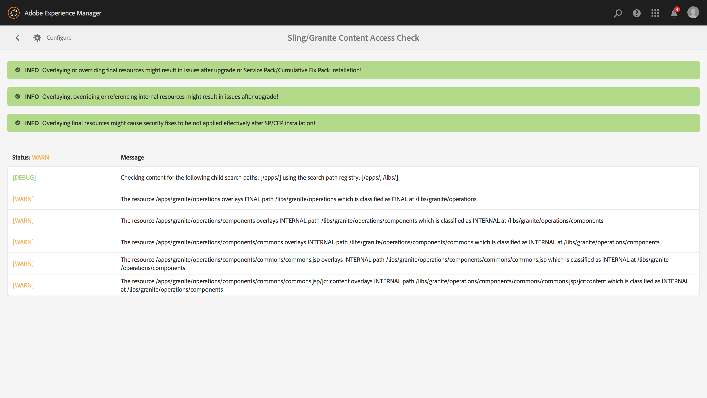

# Aggiornamenti sostenibili{#sustainable-upgrades}

## Framework di personalizzazione {#customization-framework}

### Architettura (funzionale/infrastruttura/contenuto/applicazione) {#architecture-functional-infrastructure-content-application}

La funzione di Customization Framework è progettata per contribuire a ridurre le violazioni nelle aree non estensibili del codice (come APIS) o del contenuto (come le sovrapposizioni) che non sono compatibili con l’aggiornamento.

Sono disponibili due componenti del framework di personalizzazione: **Superficie API** e **Classificazione dei contenuti**.

#### Superficie API {#api-surface}

Nelle versioni precedenti di AEM molte API sono state esposte tramite il Jar Uber. Alcune di queste API non erano destinate ai clienti, ma erano esposte al supporto della funzionalità AEM tra i bundle. In futuro, le API Java saranno contrassegnate come pubbliche o private per indicare ai clienti quali API possono essere utilizzate in modo sicuro nel contesto degli aggiornamenti. Altre specifiche includono:

* Le API Java contrassegnate come `Public` possono essere utilizzate e a cui fanno riferimento i bundle di implementazione personalizzati.

* Le API pubbliche saranno compatibili con l’installazione di un pacchetto di compatibilità.
* Il pacchetto di compatibilità conterrà un file JAR Uber compatibile per garantire la compatibilità con le versioni precedenti
* Le API Java contrassegnate come `Private` sono destinate ad essere utilizzate solo AEM bundle interni e non devono essere utilizzate da bundle personalizzati.

>[!NOTE]
>
>Il concetto di `Private` e `Public` in questo contesto non deve essere confuso con le nozioni Java di classi pubbliche e private.

#### Classificazioni di contenuto {#content-classifications}

AEM utilizza da tempo l’entità principale delle sovrapposizioni e di Sling Resource Merger per consentire ai clienti di estendere e personalizzare AEM funzionalità. Le funzionalità predefinite per l&#39;attivazione delle console AEM e dell&#39;interfaccia utente sono memorizzate in **/libs**. I clienti non devono mai modificare nulla sotto **/libs** ma possono aggiungere contenuto aggiuntivo sotto **/apps** per sovrapporre ed estendere la funzionalità definita in **/libs** (per ulteriori informazioni, consulta Sviluppo con sovrapposizioni ). Ciò ha comunque causato numerosi problemi durante l&#39;aggiornamento AEM come contenuto in **/libs** che potrebbero cambiare, causando un&#39;interruzione della funzionalità di sovrapposizione in modi imprevisti. I clienti possono anche estendere AEM componenti tramite ereditarietà tramite `sling:resourceSuperType`, o semplicemente fare riferimento a un componente in **/libs** direttamente tramite sling:resourceType. Problemi simili possono verificarsi con casi di utilizzo di riferimento e di sostituzione.

Per rendere più sicuro e facile per i clienti capire quali aree di **/libs** sono sicure per utilizzare e sovrapporre il contenuto in **/libs** è stato classificato con i seguenti mixin:

* **Public (granite:PublicArea)**  - Definisce un nodo come pubblico in modo che possa essere sovrapposto, ereditato (  `sling:resourceSuperType`) o utilizzato direttamente (  `sling:resourceType`). I nodi sotto /libs contrassegnati come pubblici saranno sicuri da aggiornare con l’aggiunta di un pacchetto di compatibilità. In generale, i clienti devono sfruttare solo i nodi contrassegnati come pubblici.

* **Abstract (granite:AbstractArea)**  - Definisce un nodo come astratto. I nodi possono essere sovrapposti o ereditati ( `sling:resourceSupertype`) ma non devono essere utilizzati direttamente ( `sling:resourceType`).

* **Final (granite:FinalArea)**  - Definisce un nodo come finale. I nodi classificati come finali idealmente non devono essere sovrapposti o ereditati. I nodi finali possono essere utilizzati direttamente tramite `sling:resourceType`. I sottonodi sotto il nodo finale sono considerati interni per impostazione predefinita.

* ***Interno (granite:InternalArea)*** *- *Definisce un nodo come interno. I nodi classificati come interni idealmente non devono essere sovrapposti, ereditati o utilizzati direttamente. Questi nodi sono destinati solo alla funzionalità interna di AEM

* **Nessuna annotazione** : i nodi ereditano la classificazione in base alla gerarchia ad albero. Il / root è per impostazione predefinita Public. **Anche i nodi con una controllante classificata come interni o finali devono essere trattati come interni.**

>[!NOTE]
>
>Questi criteri vengono applicati solo rispetto ai meccanismi basati sul percorso di ricerca Sling. Altre aree di **/libs** come una libreria lato client possono essere contrassegnate come `Internal`, ma possono ancora essere utilizzate con l&#39;inclusione clientlib standard. È importante che un cliente continui a rispettare la classificazione interna in questi casi.

#### Indicatori del tipo di contenuto di CRXDE Lite {#crxde-lite-content-type-indicators}

Le combinazioni applicate in CRXDE Lite mostrano nodi di contenuto e alberi contrassegnati come `INTERNAL` grigi. Per `FINAL` solo l&#39;icona è disattivata. Anche gli elementi secondari di questi nodi appariranno grigi. La funzionalità Sovrapponi nodo è disabilitata in entrambi i casi.

**Pubblico**

**Finale**

**Interno**

**Verifica dello stato del contenuto**

>[!NOTE]
>
>A partire AEM 6.5, Adobe consiglia di utilizzare il rilevatore pattern per rilevare le violazioni dell’accesso ai contenuti. I rapporti del rilevatore pattern sono più dettagliati, rilevano più problemi e riducono la probabilità di falsi positivi.
>
>Per ulteriori informazioni, consulta [Valutare la complessità dell&#39;aggiornamento con il rilevatore pattern](/help/sites-deploying/pattern-detector.md).

AEM 6.5 verrà fornito con un controllo dello stato di salute per avvisare i clienti se il contenuto sovrapposto o di riferimento viene utilizzato in modo non coerente con la classificazione del contenuto.

Il** Sling/Granite Content Access Check** è una nuova verifica dello stato di salute che controlla l&#39;archivio per vedere se il codice cliente accede in modo errato ai nodi protetti in AEM.

Questa operazione eseguirà la scansione di **/apps** e in genere richiede diversi secondi per essere completata.

Per accedere a questo nuovo controllo di integrità, è necessario effettuare le seguenti operazioni:

1. Dalla schermata iniziale AEM, passa a **Strumenti > Operazioni > Rapporti di stato**
1. Fai clic su **Sling/Granite Content Access Check** come mostrato di seguito:

   

Una volta completata la scansione, verrà visualizzato un elenco di avvisi che avvisano un utente finale del nodo protetto a cui viene fatto riferimento in modo improprio:

Dopo aver riparato le violazioni, tornerà allo stato verde:

Il controllo dello stato di salute visualizza le informazioni raccolte da un servizio in background che controlla in modo asincrono ogni volta che una sovrapposizione o un tipo di risorsa viene utilizzato in tutti i percorsi di ricerca Sling. Se i mixin di contenuto vengono utilizzati in modo errato, segnala una violazione.
