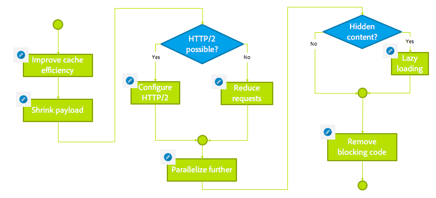

# Risoluzione dei problemi di installazione di AEM{#troubleshooting}

Questa sezione include informazioni dettagliate sui registri disponibili per aiutarti a risolvere i problemi e include anche informazioni su alcuni dei problemi che potresti incontrare con AEM.

## Risolvere i problemi relativi alle prestazioni dell’autore {#troubleshoot-author-performance}

L’analisi delle prestazioni lente sull’istanza di authoring può diventare complessa. Come primo passo è necessario capire su quale livello dello stack di tecnologia le prestazioni stanno diminuendo.

Il seguente albero decisionale fornisce indicazioni per limitare il collo di bottiglia.

## Ottimizzazione di base {#basic-optimization}

## Configurazione dei file di registro e dei registri di controllo {#configuring-log-files-and-audit-logs}

AEM i registri dettagliati che puoi configurare per risolvere i problemi di installazione. Per informazioni, consulta la sezione [Utilizzo dei record di controllo e dei file di registro](/help/sites-deploying/monitoring-and-maintaining.md#working-with-audit-records-and-log-files) sezione .

## Utilizzo dell’opzione Verbose {#using-the-verbose-option}

Quando si avvia AEM WCM, è possibile aggiungere l&#39;opzione -v (verbose) alla riga di comando come in: java -jar cq-wcm-quickstart-&lt;version>.jar -v.

L’opzione dettagliata visualizza alcuni degli output del registro Quickstart sulla console, in modo che possa essere utilizzato per la risoluzione dei problemi.

## Problemi comuni di installazione {#common-installation-issues}

La sezione seguente descrive alcuni problemi di installazione e le relative soluzioni.

### Fare doppio clic sul jar Quickstart non ha alcun effetto o apre il file jar con un altro programma (ad esempio, gestore di archivi) {#double-clicking-the-quickstart-jar-does-not-have-any-effect-or-opens-the-jar-file-with-another-program-for-example-archive-manager}

Questo problema di solito indica un problema con la configurazione dell&#39;ambiente desktop del sistema operativo per l&#39;apertura di file con estensione .jar. Potrebbe anche indicare che non hai installato Java™ o che stai utilizzando una versione non supportata di Java™.

Poiché i file jar utilizzano il formato ZIP onnipresente, alcuni dei programmi di archiviazione possono configurare automaticamente il desktop per aprire i file jar come file di archivio.

Per risolvere i problemi, procedi come segue:

* Verifica di aver installato almeno Java™ versione 1.6.
* Prova un menu di scelta rapida (solitamente con il pulsante destro del mouse) sul AEM WCM Quickstart e seleziona &quot;Apri con....&quot;
* Controlla se Java™ o Sun Java™ sono elencati e prova a eseguire AEM WCM con esso. Se hai installato più versioni Java™, seleziona quella supportata.

   Se questo passaggio viene completato e il sistema operativo offre un&#39;opzione per utilizzare sempre il programma selezionato per eseguire i file .jar, selezionarlo. Il doppio clic dovrebbe funzionare da ora in poi.

* A volte la reinstallazione della versione Java™ supportata aiuta a ripristinare la corretta associazione.
* È sempre possibile eseguire CRX utilizzando la riga di comando o gli script start/stop come descritto in precedenza in questo documento.

### La mia applicazione in esecuzione su CRX genera errori di memoria esaurita {#my-application-running-on-crx-throws-out-of-memory-errors}

>[!NOTE]
>
>Vedi anche [Analisi dei problemi di memoria](https://experienceleague.adobe.com/docs/experience-cloud-kcs/kbarticles/KA-17482.html?lang=en).

Lo stesso CRX ha un basso ingombro di memoria. Se l&#39;applicazione in esecuzione all&#39;interno di CRX ha requisiti di memoria più grandi o richiede operazioni con molta memoria (per esempio, grandi transazioni), l&#39;istanza JVM in cui viene eseguito CRX deve essere avviata con le impostazioni di memoria appropriate.

Usa le opzioni del comando Java™ per definire le impostazioni di memoria della JVM (ad esempio, java -Xmx512m -jar crx&amp;ast;.jar per impostare l&#39;heapsize a 512 MB).

Specificare l&#39;opzione di impostazione della memoria quando si avvia AEM WCM dalla riga di comando. È inoltre possibile modificare gli script di avvio/arresto di WCM AEM o gli script personalizzati per la gestione AEM&#39;avvio di WCM per definire le impostazioni di memoria richieste.

Se hai già definito l’heapsize a 512 MB, puoi analizzare ulteriormente il problema di memoria creando un’immagine heap:

Per creare automaticamente un’immagine heap in caso di esaurimento della memoria, utilizza il seguente comando:

java -Xmx256m -XX:+HeapDumpOnOutOfMemoryError -jar &amp;ast;.jar

Questo metodo genera un file immagine heap (**java_...prof**) ogni volta che il processo esaurisce la memoria. Il processo potrebbe continuare a essere eseguito dopo la generazione dell&#39;immagine heap. Di solito, un file immagine heap è sufficiente per analizzare il problema.

### La schermata di benvenuto AEM non viene visualizzata nel browser dopo aver fatto doppio clic AEM Quickstart {#the-aem-welcome-screen-does-not-display-in-the-browser-after-double-clicking-aem-quickstart}

In alcune situazioni, le schermate di benvenuto AEM WCM non vengono visualizzate automaticamente anche se l&#39;archivio stesso è in esecuzione correttamente. Questo problema può dipendere dalla configurazione del sistema operativo, dalla configurazione del browser o da fattori simili.

Il sintomo comune è che nella finestra di WCM Quickstart AEM viene visualizzato &quot;Avvio di WCM AEM in attesa dell&#39;avvio del server....&quot; Se il messaggio viene visualizzato per un periodo di tempo relativamente lungo, immetti manualmente l’URL WCM AEM nella finestra del browser utilizzando la porta 4502 predefinita o la porta su cui l’istanza è in esecuzione: http://localhost:4502/.

Inoltre, i registri potrebbero rivelare il motivo per cui il browser non si avvia.

A volte, la finestra AEM WCM Quickstart ha il messaggio &quot;AEM WCM in esecuzione su http://localhost:port/&quot; e il browser non si avvia automaticamente. In questo caso, fai clic sull’URL nella finestra di avvio rapido AEM WCM (si tratta di un collegamento ipertestuale) o immetti manualmente l’URL nel browser.

Se tutto il resto non riesce, controlla i log per scoprire cosa è successo.

### Il sito Web non viene caricato o non viene caricato in modo intermittente con Java™ 11 {#the-website-does-not-load-or-fails-intermittently-with-java11}

Esiste un problema noto con AEM 6.5 in esecuzione su Java™ 11 a causa del quale il sito web potrebbe non essere caricato o non riuscire a intermittenza.

Se si verifica questo problema, procedi come segue:

1. Apri `sling.properties` file sotto `crx-quickstart/conf/` cartella
1. Individua la seguente riga:

   `org.osgi.framework.bootdelegation=sun.,com.sun.`

1. Sostituiscilo con quanto segue:

   `org.osgi.framework.bootdelegation=sun.,com.sun.,jdk.internal.reflect,jdk.internal.reflect.*`

1. Riavvia l&#39;istanza.

## Risoluzione dei problemi relativi alle installazioni con un server applicazioni {#troubleshooting-installations-with-an-application-server}

### Pagina non trovata restituita quando si richiede una pagina geometrixx-outdoor {#page-not-found-returned-when-requesting-a-geometrixx-outdoor-page}

**Si applica a WebLogic 10.3.5 e JBoss® 5.1**

Quando una richiesta alla pagina geometrixx-outdoors/en restituisce un 404 (Pagina non trovata), è possibile ricontrollare l&#39;impostazione della proprietà sling aggiuntiva nel file sling.properties necessario per questi Application Server specifici.

Vedi in *Distribuzione AEM applicazione Web* passaggi per i dettagli.

### La dimensione dell&#39;intestazione di risposta può essere maggiore di 4 KB {#response-header-size-can-be-greater-than-kb}

502 errori possono indicare che il server web non è in grado di gestire le dimensioni dell&#39;intestazione di risposta HTTP AEM. AEM generare intestazioni di risposta HTTP che includono cookie di dimensioni superiori a 4 KB. Assicurati che il contenitore del servlet sia configurato in modo che la dimensione massima dell’intestazione di risposta possa superare i 4 KB.

Ad esempio, per Tomcat 7.0, l&#39;attributo maxHttpHeaderSize del [Connettore HTTP](https://tomcat.apache.org/tomcat-7.0-doc/config/http.html) controlla le limitazioni della dimensione dell&#39;intestazione.

## Disinstallazione di Adobe Experience Manager {#uninstalling-adobe-experience-manager}

Poiché AEM installato in una singola directory, non è necessaria un&#39;utilità di disinstallazione. La disinstallazione può essere semplice come l&#39;eliminazione dell&#39;intera directory di installazione, anche se la modalità di disinstallazione AEM dipende da ciò che si desidera ottenere e da quale memoria permanente si utilizza.

Se l&#39;archiviazione permanente è incorporata nella directory di installazione, ad esempio, nell&#39;installazione predefinita di TarPM, l&#39;eliminazione delle cartelle rimuove anche i dati.

>[!NOTE]
>
>Adobe consiglia di eseguire il backup dell&#39;archivio prima di eliminare AEM. Se si elimina l&#39;intero &lt;cq-installation-directory>, elimina anche l’archivio. Per mantenere i dati del repository prima di eliminare, spostare o copiare il &lt;cq-installation-directory>/crx-quickstart/repository cartella da qualche altra parte prima di eliminare le altre cartelle.

Se l&#39;installazione di AEM utilizza lo storage esterno, ad esempio un server di database, la rimozione della cartella non rimuove automaticamente i dati, ma rimuove la configurazione di archiviazione, il che rende difficile il ripristino del contenuto JCR.

### I file JSP non sono compilati su JBoss® {#jsp-files-are-not-compiled-on-jboss}

Se installi o aggiorni i file JSP su Experience Manager su JBoss® e i corrispondenti servlet non sono compilati, assicurati che il compilatore JSP JBoss® sia configurato correttamente. Per informazioni, consulta la sezione
[Problemi di compilazione JSP in JBoss®](https://helpx.adobe.com/experience-manager/kb/jsps-dont-compile-jboss.html) articolo.
