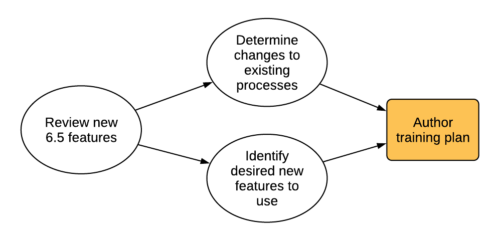

# Pianificazione dell&#39;aggiornamento{#planning-your-upgrade}

## Panoramica del progetto AEM {#aem-project-overview}

L’AEM viene spesso utilizzato in implementazioni ad alto impatto che potrebbero servire milioni di utenti. In genere, nelle istanze vengono distribuite applicazioni personalizzate che aumentano la complessità. Qualsiasi sforzo per aggiornare tale implementazione deve essere gestito in modo metodologico.

Questa guida aiuta a stabilire chiari obiettivi, fasi e risultati finali durante la pianificazione dell’aggiornamento. Si concentra sull&#39;esecuzione complessiva del progetto e sulle linee guida. Pur fornendo una panoramica dei passaggi effettivi di aggiornamento, fa riferimento alle risorse tecniche disponibili, ove opportuno. Esso dovrebbe essere utilizzato con le risorse tecniche disponibili di cui al documento.

Il processo di aggiornamento dell’AEM richiede una gestione accurata delle fasi di pianificazione, analisi ed esecuzione, con la definizione dei principali risultati finali per ogni fase.

È possibile effettuare l’aggiornamento direttamente dalle versioni 6.0 e 6.5 dell’AEM. I clienti che eseguono la versione 5.6.x e successive devono prima eseguire l’aggiornamento alla versione 6.0 o successiva, consigliando 6.0 (SP3). Inoltre, il nuovo formato Tar del segmento di Oak è ora utilizzato per l’archivio dei nodi di segmento a partire dalla versione 6.3 e la migrazione dell’archivio a questo nuovo formato è obbligatoria anche per le versioni 6.0, 6.1 e 6.2.

>[!CAUTION]
>
>Se si esegue l&#39;aggiornamento da AEM 6.2 a 6.3, è necessario eseguire l&#39;aggiornamento dalle versioni (**6.2-SP1-CFP1 - -6.2SP1-CFP12.1**) o **6.2SP1-CFP15** in avanti. In caso contrario, se si esegue l&#39;aggiornamento da **6.2SP1-CFP13/6.2SP1CFP14** a AEM 6.3, è necessario eseguire l&#39;aggiornamento almeno alla versione **6.3.2.2**. In caso contrario, AEM Sites avrebbe esito negativo dopo l’aggiornamento.

## Ambito e requisiti dell&#39;aggiornamento {#upgrade-scope-requirements}

Di seguito è riportato un elenco delle aree interessate da un tipico progetto di aggiornamento AEM:

<table>
 <tbody>
  <tr>
   <td><strong>Componente</strong></td>
   <td><strong>Impatto</strong></td>
   <td><strong>Descrizione</strong></td>
  </tr>
  <tr>
   <td>Sistema operativo</td>
   <td>Effetti incerti ma delicati</td>
   <td>Al momento dell’aggiornamento dell’AEM, potrebbe essere giunto il momento di aggiornare anche il sistema operativo e questo potrebbe avere un certo impatto.</td>
  </tr>
  <tr>
   <td>Java™ Runtime</td>
   <td>Impatto moderato</td>
   <td>AEM 6.3 richiede JRE 1.7.x (64 bit) o versione successiva. JRE 1.8 è l'unica versione attualmente supportata da Oracle.</td>
  </tr>
  <tr>
   <td>Hardware</td>
   <td>Impatto moderato</td>
   <td>La funzione di pulizia delle revisioni online richiede uno spazio libero su disco   pari al 25% delle dimensioni dell'archivio e al 15% dello spazio disponibile per l'heap  per essere completata correttamente. Potrebbe essere necessario aggiornare l'hardware a   per garantire risorse sufficienti per l'esecuzione completa di Pulizia revisioni in linea . Inoltre, se si esegue l'aggiornamento da una versione precedente a AEM 6, potrebbero essere necessari ulteriori requisiti di storage  .</td>
  </tr>
  <tr>
   <td>Archivio dei contenuti (CRX o Oak)</td>
   <td>Impatto elevato</td>
   <td>A partire dalla versione 6.1, l'AEM non supporta CRX2, pertanto è necessaria una migrazione a   Oak (CRX3) se si esegue l'aggiornamento da una versione precedente. AEM 6.3 ha implementato   un nuovo archivio nodi di segmenti che richiede anche una migrazione. Lo strumento crx2oak   viene utilizzato per questo scopo.</td>
  </tr>
  <tr>
   <td>Componenti/contenuti AEM</td>
   <td>Impatto moderato</td>
   <td><code>/libs</code> e <code>/apps</code> sono facilmente gestibili tramite l'aggiornamento, ma <code>/etc</code> in genere richiede la riapplicazione manuale delle personalizzazioni.</td>
  </tr>
  <tr>
   <td>Servizi AEM</td>
   <td>Impatto ridotto</td>
   <td>La maggior parte dei servizi di base dell’AEM sono testati per l’aggiornamento. Si tratta di un’area di impatto limitato.</td>
  </tr>
  <tr>
   <td>Servizi applicativi personalizzati</td>
   <td>Impatto da basso a alto</td>
   <td>A seconda dell'applicazione e della personalizzazione, potrebbero esserci   dipendenze da JVM, versioni del sistema operativo e alcune modifiche correlate all'indicizzazione , in quanto gli indici non vengono generati automaticamente in Oak.</td>
  </tr>
  <tr>
   <td>Contenuto applicazione personalizzato</td>
   <td>Impatto da basso a alto</td>
   <td>Prima di eseguire l'aggiornamento è possibile eseguire il backup del contenuto che non verrà gestito tramite l'aggiornamento  e quindi spostarlo nuovamente nell'archivio.  La maggior parte dei contenuti può essere gestita tramite lo strumento di migrazione.</td>
  </tr>
 </tbody>
</table>

È importante assicurarsi di eseguire un sistema operativo supportato, Java™ Runtime, httpd e la versione Dispatcher. Per ulteriori informazioni, vedere la [pagina Requisiti tecnici di AEM 6.5](/help/sites-deploying/technical-requirements.md). L’aggiornamento di questi componenti deve essere considerato nel piano di progetto e deve avvenire prima dell’aggiornamento dell’AEM.

## Fasi progetto {#project-phases}

Molto lavoro è dedicato alla pianificazione e all&#39;esecuzione di un aggiornamento AEM. Per chiarire i diversi sforzi che entrano in questa fase, Adobe ha suddiviso gli esercizi di pianificazione ed esecuzione in fasi separate. Nelle sezioni seguenti, ogni fase determina un risultato finale che viene spesso utilizzato in una fase futura del progetto.

### Pianificazione per la formazione dell’autore {#planning-for-author-training}

Con qualsiasi nuova versione, possono essere introdotte modifiche potenziali all’interfaccia utente e ai flussi di lavoro degli utenti. Inoltre, le nuove versioni introducono nuove funzioni che possono essere utili per l’azienda. L’Adobe consiglia di rivedere le modifiche funzionali introdotte e di organizzare un piano di formazione per consentire agli utenti di utilizzarle in modo efficace.

Le nuove funzionalità di AEM 6.5 sono disponibili nella [sezione AEM di adobe.com](/help/release-notes/release-notes.md). Nota eventuali modifiche all’interfaccia utente o alle funzioni del prodotto comunemente utilizzate nell’organizzazione. Esaminando le nuove funzioni, prendi nota anche di quelle che possono essere di valore per la tua organizzazione. Dopo aver analizzato i cambiamenti di AEM 6.5, sviluppa un piano di formazione per gli autori. Ciò potrebbe comportare l&#39;utilizzo di risorse liberamente disponibili, come i video delle funzionalità di aiuto o i corsi di formazione formali offerti tramite [Adobe Digital Learning Services](https://learning.adobe.com/).

### Creazione di un piano di test {#creating-a-test-plan}

L&#39;implementazione di AEM da parte di ogni cliente è unica ed è stata personalizzata in base ai requisiti aziendali. Di conseguenza, è importante determinare tutte le personalizzazioni apportate al sistema in modo che possano essere incluse in un piano di test. Questo piano di test alimenta il processo di controllo qualità eseguito da Adobe sull’istanza aggiornata.

È necessario duplicare l’ambiente di produzione esatto e sottoporlo a test dopo l’aggiornamento per assicurarsi che tutte le applicazioni e il codice personalizzato vengano ancora eseguiti come desiderato. Ripristina tutte le tue personalizzazioni ed esegui test di prestazioni, carico e sicurezza. Quando organizzi il piano di test, assicurati di coprire tutte le personalizzazioni apportate al sistema, oltre alle interfacce utente e ai flussi di lavoro predefiniti utilizzati nelle operazioni quotidiane. Questi possono includere servizi e servlet OSGI personalizzati, integrazioni a Adobe Experience Cloud, integrazioni con terze parti tramite connettori AEM, integrazioni personalizzate di terze parti, componenti e modelli personalizzati, sovrapposizioni di interfaccia utente personalizzate in AEM e flussi di lavoro personalizzati. Per i clienti che eseguono la migrazione da una versione precedente a AEM 6, è necessario analizzare tutte le query personalizzate, in quanto potrebbero dover essere indicizzate. Per i clienti che utilizzano già una versione AEM 6.x, queste query devono essere ancora testate per garantire che i loro indici continuino a funzionare in modo efficace dopo l’aggiornamento.

### Determinazione delle modifiche di architettura e infrastruttura necessarie {#determining-architectural-and-infrastructure-changes-needed}

Durante l’aggiornamento, è possibile che sia necessario aggiornare anche altri componenti dello stack tecnico, come il sistema operativo o JVM. Inoltre, è possibile che, a causa di modifiche nella composizione dell’archivio, sia necessario hardware aggiuntivo. Questo problema viene fuori solo per i clienti che eseguono la migrazione da istanze precedenti a 6.x, ma è importante da considerare. Infine, potrebbero essere necessarie modifiche alle procedure operative, inclusi i processi di monitoraggio, manutenzione, backup e disaster recovery.

Rivedi i requisiti tecnici per AEM 6.5 e assicurati che l’hardware e il software attuali siano sufficienti. Per le potenziali modifiche ai processi operativi, consulta i seguenti documenti:

**Monitoraggio e manutenzione:**

[Dashboard operazioni](/help/sites-administering/operations-dashboard.md)

[Best practice per il monitoraggio in Assets](/help/assets/assets-monitoring-best-practices.md)

[Monitoraggio delle risorse del server tramite la console JMX](/help/sites-administering/jmx-console.md)

[Pulizia revisioni](/help/sites-deploying/revision-cleanup.md)

**Backup/ripristino e ripristino di emergenza:**

[Backup e ripristino](/help/sites-administering/backup-and-restore.md)

[Prestazioni e scalabilità](/help/sites-deploying/performance.md)

[Come eseguire l’AEM con TarMK Cold Standby](/help/sites-deploying/tarmk-cold-standby.md)

#### Considerazioni sulla ristrutturazione dei contenuti {#content-restructuring-considerations}

L’AEM ha introdotto modifiche alla struttura dell’archivio che contribuiranno a rendere gli aggiornamenti più fluidi. Le modifiche comportano lo spostamento di contenuto dalla cartella /etc alle cartelle, tra cui /libs, /apps e /content, a seconda che il contenuto sia di proprietà di un Adobe o di un cliente, limitando così le possibilità di sovrascrittura del contenuto durante le versioni. La ristrutturazione dell&#39;archivio è stata eseguita in modo tale da non richiedere modifiche al codice al momento dell&#39;aggiornamento 6.5, anche se si consiglia di rivedere i dettagli in [Ristrutturazione dell&#39;archivio in AEM](/help/sites-deploying/repository-restructuring.md) durante la pianificazione di un aggiornamento.

### Valutazione della complessità dell&#39;aggiornamento {#assessing-upgrade-complexity}

A causa dell’ampia varietà di tipi e tipi di personalizzazioni che i clienti Adobe applicano ai loro ambienti AEM, è importante trascorrere del tempo prima di determinare il livello complessivo di impegno che dovrebbe essere previsto nell’aggiornamento.

Esistono due approcci per valutare la complessità dell’aggiornamento: una fase preliminare può utilizzare il rilevatore pattern appena introdotto, disponibile per l’esecuzione sulle istanze AEM 6.1, 6.2 e 6.3. Il rilevatore pattern è il modo più semplice per valutare la complessità complessiva dell’aggiornamento che ci si aspetta utilizzando i pattern riportati. Il rapporto del rilevatore pattern include pattern per l’identificazione delle API non disponibili utilizzate dalla base di codice personalizzata (questa operazione è stata eseguita utilizzando i controlli di compatibilità pre-aggiornamento nella versione 6.3).

Dopo la valutazione iniziale, un passo successivo più completo potrebbe essere quello di eseguire un aggiornamento su un&#39;istanza di prova ed eseguire alcune prove di fumo di base. L’Adobe fornisce anche alcuni . Inoltre, l&#39;elenco delle [funzionalità obsolete e rimosse](/help/release-notes/deprecated-removed-features.md) deve essere rivisto non solo per la versione a cui si sta effettuando l&#39;aggiornamento, ma anche per tutte le versioni tra la versione di origine e quella di destinazione. Ad esempio, per l’aggiornamento da AEM 6.2 a 6.5, è importante rivedere le funzioni obsolete e rimosse dell’AEM 6.3 oltre a quelle per AEM 6.5.

Il rilevatore pattern introdotto di recente dovrebbe fornire una stima abbastanza accurata di ciò che ci si aspetta da un aggiornamento nella maggior parte dei casi. Tuttavia, per personalizzazioni e implementazioni più complesse in cui sono presenti modifiche non compatibili, è possibile aggiornare un&#39;istanza di sviluppo a AEM 6.5 in base alle istruzioni contenute in [Esecuzione di un aggiornamento sul posto](/help/sites-deploying/in-place-upgrade.md). Una volta completato, eseguire alcune prove di fumo di alto livello in questo ambiente. L&#39;obiettivo di questo esercizio non è quello di completare in modo esaustivo l&#39;inventario dei test case e produrre un inventario formale dei difetti, ma di fornire una stima approssimativa della quantità di lavoro necessaria per aggiornare il codice per la compatibilità 6.5. In combinazione con il [rilevamento pattern](/help/sites-deploying/pattern-detector.md) e le modifiche dell&#39;architettura determinate nella sezione precedente, è possibile fornire una stima approssimativa al team di gestione del progetto per pianificare l&#39;aggiornamento.

### Creazione del Runbook di aggiornamento e rollback {#building-the-upgrade-and-rollback-runbook}

Sebbene Adobe abbia documentato la procedura di aggiornamento di un’istanza AEM, il layout di rete, l’architettura di distribuzione e le personalizzazioni di ogni cliente richiedono l’ottimizzazione e la personalizzazione di questo approccio. Per questo motivo, Adobe ti incoraggia a rivedere tutta la documentazione fornita e a utilizzarla per informare un runbook specifico per il progetto che illustra le procedure specifiche di aggiornamento e rollback che seguirai nel tuo ambiente. In caso di aggiornamento da CRX2, è necessario valutare il tempo necessario per la migrazione dei contenuti durante il passaggio da CRX2 ad Oak. Per gli archivi di grandi dimensioni, potrebbe essere sostanziale.

L&#39;Adobe ha fornito procedure di aggiornamento e rollback in [Procedura di aggiornamento](/help/sites-deploying/upgrade-procedure.md) e istruzioni dettagliate per l&#39;applicazione dell&#39;aggiornamento in Esecuzione di un [aggiornamento sul posto](/help/sites-deploying/in-place-upgrade.md). Queste istruzioni devono essere esaminate e prese in considerazione insieme all&#39;architettura del sistema, alle personalizzazioni e alla tolleranza ai tempi di inattività per determinare le procedure di switch-over e rollback appropriate che verranno eseguite durante l&#39;aggiornamento. Eventuali modifiche all’architettura o alle dimensioni dei server devono essere incluse durante la creazione del runbook personalizzato. E&#39; importante notare che questa proposta dovrebbe essere trattata come una prima bozza. Quando il team completa i cicli di QA e sviluppo e distribuisce l’aggiornamento all’ambiente di staging, è probabile che siano necessari alcuni passaggi aggiuntivi. Idealmente, questo documento dovrebbe contenere informazioni sufficienti in modo tale che, se fosse consegnato a un membro del personale operativo, sarebbe in grado di completare l&#39;aggiornamento completamente dalle informazioni contenute in.

### Sviluppo di un piano di progetto {#developing-a-project-plan}

L’output degli esercizi precedenti può essere utilizzato per creare un piano di progetto che copre le tempistiche previste per le attività di test o sviluppo, la formazione e l’esecuzione effettiva dell’aggiornamento.

Un piano di progetto completo dovrebbe includere:

* Completamento dei piani di sviluppo e di prova
* Aggiornamento degli ambienti di sviluppo e controllo qualità
* Aggiornamento della base di codice personalizzato per AEM 6.5
* Un test di controllo qualità e un ciclo di correzione
* Aggiornamento dell’ambiente di staging
* Integrazione, prestazioni e test di carico
* Certificazione dell’ambiente
* Pubblicazione

### Esecuzione di attività di sviluppo e controllo qualità {#performing-development-and-qa}

L&#39;Adobe ha fornito le procedure per [l&#39;aggiornamento del codice e delle personalizzazioni](/help/sites-deploying/upgrading-code-and-customizations.md) affinché siano compatibili con AEM 6.5. Durante l’esecuzione di questo processo iterativo, è necessario apportare le modifiche necessarie al runbook. Vedi anche [Compatibilità con le versioni precedenti in AEM 6.5](/help/sites-deploying/backward-compatibility.md) per informazioni su come le personalizzazioni possono rimanere compatibili con le versioni precedenti in genere senza richiedere lo sviluppo immediatamente dopo l&#39;aggiornamento.

Il processo di sviluppo e test è solitamente iterativo. A causa delle personalizzazioni, le modifiche apportate durante l’aggiornamento potrebbero potenzialmente rendere inutilizzabile un’intera sezione del prodotto. Una volta che gli sviluppatori hanno affrontato la causa principale del problema e il team di test ha accesso a testare queste funzioni, esiste la possibilità di individuare ulteriori problemi. Quando vengono rilevati problemi che richiedono modifiche al processo di aggiornamento, assicurati di aggiungerli al runbook di aggiornamento personalizzato. Dopo diverse iterazioni di test e correzione, la base di codice deve essere completamente convalidata e pronta per la distribuzione nell’ambiente di staging.

### Test finale {#final-testing}

L’Adobe consiglia un ciclo finale di test dopo che il codebase è stato certificato dal team di controllo qualità della tua organizzazione. Questo ciclo di test prevede la convalida del runbook in un ambiente di staging, seguita da cicli di test di accettazione, prestazioni e sicurezza da parte dell’utente.

Questo passaggio è fondamentale in quanto è l’unico momento in cui puoi convalidare i passaggi nel runbook rispetto a un ambiente di produzione. Dopo l’aggiornamento dell’ambiente, è importante concedere agli utenti finali un po’ di tempo per accedere e svolgere le attività che svolgono quando utilizzano il sistema nelle attività quotidiane. Non è raro che gli utenti utilizzino una parte del sistema che non era stata considerata in precedenza. L’individuazione e la correzione dei problemi in queste aree prima della pubblicazione possono contribuire a evitare costose interruzioni della produzione. Poiché una nuova versione dell’AEM contiene modifiche significative alla piattaforma sottostante, è importante anche eseguire test di prestazioni, carico e sicurezza sul sistema come se fosse stato avviato per la prima volta.

### Esecuzione dell&#39;aggiornamento {#performing-the-upgrade}

Una volta ricevuto l’approvazione finale da tutte le parti interessate, è ora di eseguire le procedure del runbook definite. L&#39;Adobe fornisce i passaggi per l&#39;aggiornamento e il rollback nella [Procedura di aggiornamento](/help/sites-deploying/upgrade-procedure.md) e i passaggi di installazione nell&#39;esecuzione di un [aggiornamento sul posto](/help/sites-deploying/in-place-upgrade.md) come punto di riferimento.

L’Adobe fornisce alcuni passaggi nelle istruzioni di aggiornamento per la convalida dell’ambiente. Questi includono controlli di base come la scansione dei registri di aggiornamento e la verifica che tutti i bundle OSGi siano stati avviati correttamente, ma Adobe consiglia anche di eseguire la convalida con casi di test personalizzati in base ai processi aziendali. L&#39;Adobe consiglia inoltre di controllare la pianificazione della pulizia delle revisioni online dell&#39;AEM e le relative routine per assicurarsi che vengano eseguite durante un periodo di inattività per l&#39;azienda. Queste routine sono essenziali per le prestazioni a lungo termine dell’AEM.
