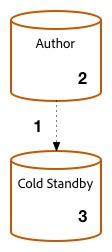

# Procedura di aggiornamento {#upgrade-procedure}

>[!NOTE]
>
>L’aggiornamento richiede tempi di inattività per il livello di authoring, in quanto la maggior parte degli aggiornamenti Adobe Experience Manager (AEM) viene eseguita sul posto. Seguendo queste best practice, è possibile ridurre o eliminare i tempi di inattività del livello di pubblicazione.

Durante l’aggiornamento degli ambienti AEM, è necessario tenere conto delle differenze di approccio tra l’aggiornamento degli ambienti di authoring e di pubblicazione per ridurre al minimo i tempi di inattività sia per gli autori che per gli utenti finali. Questa pagina illustra la procedura di alto livello per l’aggiornamento di una topologia AEM attualmente in esecuzione su una versione di AEM 6.x. Poiché il processo varia tra i livelli di authoring e pubblicazione e le distribuzioni basate su Mongo e TarMK, ogni livello e microkernel è stato elencato in una sezione separata. Durante l’esecuzione della distribuzione, Adobe consiglia innanzitutto di aggiornare l’ambiente di authoring, determinare il successo e quindi procedere con gli ambienti di pubblicazione.

<!--
>[!IMPORTANT]
>
>The downtime during the upgrade can be significally reduced by indexing the repository before performing the upgrade. For more information, see [Using Offline Reindexing To Reduce Downtime During an Upgrade](/help/sites-deploying/upgrade-offline-reindexing.md)
-->

## Livello di authoring TarMK {#tarmk-author-tier}

### Topologia iniziale {#starting-topology}

La topologia ipotizzata per questa sezione è costituita da un server di authoring in esecuzione su TarMK con uno standby a freddo. La replica viene eseguita dal server di authoring alla farm di pubblicazione TarMK. Anche se non illustrato qui, questo approccio può essere utilizzato per le distribuzioni che utilizzano lo scaricamento. Assicurati di aggiornare o ricreare l’istanza di offload nella nuova versione dopo aver disabilitato gli agenti di replica nell’istanza di authoring e prima di riabilitarli.

### Preparazione all’aggiornamento {#upgrade-preparation}

1. Interrompere l&#39;authoring dei contenuti.

1. Arresta l&#39;istanza in standby.

1. Disattiva gli agenti di replica sull’autore.

1. Esegui il [attività di manutenzione pre-aggiornamento](/help/sites-deploying/pre-upgrade-maintenance-tasks.md).

### Esecuzione dell’aggiornamento {#upgrade-execution}

1. Esegui il [aggiornamento sul posto](/help/sites-deploying/in-place-upgrade.md).
1. Aggiornare il modulo Dispatcher *se necessario*.

1. Il controllo qualità convalida l’aggiornamento.

1. Arresta l&#39;istanza di authoring.

### In caso di esito positivo {#if-successful}

1. Copiare l&#39;istanza aggiornata per creare un Cold Standby.

1. Avvia l’istanza di authoring.

1. Avvia l&#39;istanza Standby.

### In caso di esito negativo (rollback) {#if-unsuccessful-rollback}

1. Avviare l&#39;istanza di standby a freddo come nuova istanza principale.

1. Rigenerare l&#39;ambiente di authoring dal Cold Standby.

## Cluster di authoring MongoMK {#mongomk-author-cluster}

### Topologia iniziale {#starting-topology-1}

La topologia ipotizzata per questa sezione è costituita da un cluster di authoring MongoMK con almeno due istanze di authoring AEM, supportate da almeno due database MongoMK. Tutte le istanze dell’Autore condividono un archivio dati. Questi passaggi devono essere applicati sia agli archivi dati S3 che a quelli di file. La replica viene eseguita dai server di authoring alla farm di pubblicazione TarMK.

### Preparazione all’aggiornamento {#upgrade-preparation-1}

1. Interrompere l&#39;authoring dei contenuti.
1. Clonare l&#39;archivio dati per il backup.
1. Arresta tutte le istanze di AEM Author tranne una, ovvero l’istanza Autore principale.
1. Rimuovi tutti i nodi MongoDB tranne uno dal set di repliche, l’istanza principale di Mongo.
1. Aggiornare il `DocumentNodeStoreService.cfg` nell&#39;istanza Autore principale per riflettere il set di repliche a membro singolo.
1. Riavvia l’Autore primario per assicurarti che venga riavviato correttamente.
1. Disabilita gli agenti di replica nell’istanza di authoring primaria.
1. Esegui [attività di manutenzione pre-aggiornamento](/help/sites-deploying/pre-upgrade-maintenance-tasks.md) sull’istanza Autore primaria.
1. Se necessario, aggiorna MongoDB sull’istanza Mongo principale alla versione 3.2 con WiredTiger.

### Esecuzione dell’aggiornamento {#Upgrade-execution-1}

1. Esegui un [aggiornamento sul posto](/help/sites-deploying/in-place-upgrade.md) sull’autore primario.
1. Aggiornare il Dispatcher o il modulo web *se necessario*.
1. Il controllo qualità convalida l’aggiornamento.

### In caso di esito positivo {#if-successful-1}

1. Crea nuove istanze di authoring 6.5, connesse all’istanza di Mongo aggiornata.

1. Rigenera i nodi MongoDB rimossi dal cluster.

1. Aggiornare il `DocumentNodeStoreService.cfg` file per riflettere l&#39;intero set di repliche.

1. Riavvia le istanze di authoring, una alla volta.

1. Rimuovi l’archivio dati clonato.

### In caso di esito negativo (rollback)  {#if-unsuccessful-rollback-2}

1. Riconfigura le istanze di authoring secondarie per la connessione all’archivio dati clonato.

1. Arresta l&#39;istanza principale di authoring aggiornata.

1. Arresta l&#39;istanza primaria Mongo aggiornata.

1. Avvia le istanze Mongo secondarie con una di queste come nuova istanza primaria.

1. Configurare `DocumentNodeStoreService.cfg` file nelle istanze di authoring secondarie per puntare al set di repliche delle istanze di Mongo non ancora aggiornate.

1. Avvia le istanze di authoring secondarie.

1. Rimuovi le istanze di authoring, il nodo Mongo e l’archivio dati aggiornati.

## Farm di pubblicazione TarMK {#tarmk-publish-farm}

### Farm di pubblicazione TarMK {#tarmk-publish-farm-1}

La topologia ipotizzata per questa sezione è costituita da due istanze di pubblicazione TarMK, precedute da Dispatcher che sono a loro volta precedute da un load balancer. La replica viene eseguita dal server di authoring alla farm di pubblicazione TarMK.

### Esecuzione dell’aggiornamento {#upgrade-execution-2}

1. Arresta il traffico verso l&#39;istanza Publish 2 nel load balancer.
1. Esegui [manutenzione pre-aggiornamento](/help/sites-deploying/pre-upgrade-maintenance-tasks.md) alla pubblicazione 2.
1. Esegui un [aggiornamento sul posto](/help/sites-deploying/in-place-upgrade.md) alla pubblicazione 2.
1. Aggiornare il Dispatcher o il modulo web *se necessario*.
1. Svuota la cache di Dispatcher.
1. Il controllo qualità convalida la pubblicazione 2 tramite Dispatcher, dietro il firewall.
1. Chiudi pubblicazione 2.
1. Copia l’istanza Publish 2.
1. Avvia pubblicazione 2.

### In caso di esito positivo {#if-successful-2}

1. Attiva traffico per Pubblicazione 2.
1. Arresta il traffico per la pubblicazione 1.
1. Arresta l&#39;istanza Publish 1.
1. Sostituisci l’istanza Publish 1 con una copia di Publish 2.
1. Aggiornare il Dispatcher o il modulo web *se necessario*.
1. Svuota la cache di Dispatcher per la pubblicazione 1.
1. Avvia pubblicazione 1.
1. Il controllo qualità convalida la pubblicazione 1 tramite Dispatcher, dietro il firewall.

### In caso di esito negativo (rollback) {#if-unsuccessful-rollback-1}

1. Crea una copia di Publish 1.
1. Sostituisci l’istanza Publish 2 con una copia di Publish 1.
1. Svuota la cache del Dispatcher per la pubblicazione 2.
1. Avvia pubblicazione 2.
1. Il controllo qualità convalida la pubblicazione 2 tramite Dispatcher, dietro il firewall.
1. Attiva traffico per Pubblicazione 2.

## Passaggi per l&#39;aggiornamento finale {#final-upgrade-steps}

1. Attiva traffico per Pubblicazione 1.
1. Il controllo qualità esegue la convalida finale da un URL pubblico.
1. Abilita gli agenti di replica dall’ambiente di authoring.
1. Riprendi l’authoring dei contenuti.
1. Esegui [controlli post-aggiornamento](/help/sites-deploying/post-upgrade-checks-and-troubleshooting.md).

