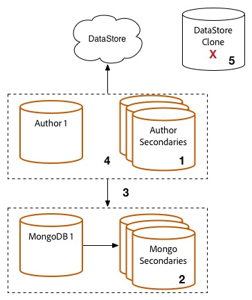

# Procedura di aggiornamento {#upgrade-procedure}

>[!NOTE]
>
>L&#39;aggiornamento richiederà tempi di inattività per il livello Author, in quanto la maggior parte degli aggiornamenti AEM vengono eseguiti sul posto. Seguendo queste procedure ottimali, i tempi di inattività dei livelli di pubblicazione possono essere ridotti o eliminati.

Quando eseguite l’aggiornamento degli ambienti AEM, è necessario considerare le differenze di approccio tra l’aggiornamento degli ambienti di authoring e di pubblicazione, al fine di ridurre al minimo i tempi di inattività sia per gli autori che per gli utenti finali. Questa pagina illustra la procedura di alto livello per aggiornare una topologia AEM attualmente in esecuzione su una versione di AEM 6.x. Poiché il processo varia a seconda dei livelli di creazione e pubblicazione, nonché delle distribuzioni basate su Mongo e TarMK, ciascun livello e ciascun microkernel è stato elencato in una sezione separata. Quando eseguite la distribuzione, è consigliabile aggiornare prima l’ambiente di authoring, determinare il successo e quindi procedere con gli ambienti di pubblicazione.

<!--
>[!IMPORTANT]
>
>The downtime during the upgrade can be significally reduced by indexing the repository before performing the upgrade. For more information, see [Using Offline Reindexing To Reduce Downtime During an Upgrade](/help/sites-deploying/upgrade-offline-reindexing.md)
-->

## Livello autore TarMK {#tarmk-author-tier}

### Avvio della topologia {#starting-topology}

La topologia presunta per questa sezione è costituita da un server Author in esecuzione su TarMK con un sistema Cold Standby. La replica si verifica dal server Author alla farm di pubblicazione TarMK. Anche se non illustrato qui, questo approccio può essere utilizzato anche per le distribuzioni che utilizzano lo scaricamento. Accertatevi di aggiornare o ricreare l&#39;istanza di offload sulla nuova versione dopo aver disattivato gli agenti di replica nell&#39;istanza Author e prima di riabilitarli.

### Preparazione all&#39;aggiornamento {#upgrade-preparation}

1. Interruzione dell&#39;authoring dei contenuti

1. Arrestare l&#39;istanza standby

1. Disattivazione degli agenti di replica sull&#39;autore

1. Eseguire le attività di manutenzione [pre-aggiornamento](/help/sites-deploying/pre-upgrade-maintenance-tasks.md).

### Esecuzione aggiornamento {#upgrade-execution}

1. Eseguire l&#39;aggiornamento [locale](/help/sites-deploying/in-place-upgrade.md)
1. Aggiorna il modulo dispatcher *se necessario*

1. QA convalida l&#39;aggiornamento

1. Arrestate l’istanza di creazione.

### In caso di esito positivo {#if-successful}

1. Copiare l’istanza aggiornata per creare un nuovo Cold Standby

1. Avviare l&#39;istanza Author

1. Avviate l’istanza Standby.

### Se non riuscito (rollback) {#if-unsuccessful-rollback}

1. Avviare l&#39;istanza Cold Standby come nuova istanza Primaria

1. Ricostruite l&#39;ambiente Authoring dal Cold Standby.

## MongoMK Author Cluster {#mongomk-author-cluster}

### Avvio della topologia {#starting-topology-1}

La topologia presunta per questa sezione è costituita da un cluster MongoMK Author con almeno due istanze AEM Author, con il supporto di almeno due database MongoMK. Tutte le istanze Author condividono un archivio dati. Questi passaggi devono essere applicabili sia ai database S3 che ai file. La replica si verifica dai server Author alla farm TarMK Publish.

### Preparazione all&#39;aggiornamento {#upgrade-preparation-1}

1. Interruzione dell&#39;authoring dei contenuti
1. Duplicare l&#39;archivio dati per il backup
1. Interrompi tutte le istanze di AEM Author tranne una, l’autore principale
1. Rimuovere tutti i nodi MongoDB tranne uno dal set di repliche, l&#39;istanza Mongo principale
1. Aggiornare il `DocumentNodeStoreService.cfg` file sull&#39;autore principale in modo che rifletta il set di repliche per membro singolo
1. Riavviate l&#39;autore principale per assicurarvi che si riavvii correttamente
1. Disattivazione degli agenti di replica sull&#39;autore principale
1. Eseguire attività di manutenzione [pre-aggiornamento](/help/sites-deploying/pre-upgrade-maintenance-tasks.md) sull&#39;istanza Author principale
1. Se necessario, aggiornare MongoDB sull&#39;istanza Mongo principale alla versione 3.2 con WiredTiger

### Esecuzione aggiornamento {#Upgrade-execution-1}

1. Eseguire un aggiornamento  locale sull&#39;autore principale
1. Aggiornare il dispatcher o il modulo Web *se necessario*
1. QA convalida l&#39;aggiornamento

### In caso di esito positivo {#if-successful-1}

1. Creare nuove istanze Author 6.5, collegate all&#39;istanza Mongo aggiornata

1. Rigenerare i nodi MongoDB rimossi dal cluster

1. Aggiornare i `DocumentNodeStoreService.cfg` file per riflettere l&#39;intero set di repliche

1. Riavviate le istanze Author, una per volta

1. Rimuovere l&#39;archivio dati duplicato.

### Se non riuscito (rollback)  {#if-unsuccessful-rollback-2}

1. Riconfigurare le istanze Autore secondarie per collegarsi all&#39;archivio dati clonato

1. Arrestare l&#39;istanza principale Author aggiornata

1. Chiudere l&#39;istanza principale Mongo aggiornata.

1. Avvia le istanze Mongo secondarie con una di esse come nuova istanza principale

1. Configurare i `DocumentNodeStoreService.cfg` file sulle istanze Autore secondarie per puntare al set di repliche delle istanze Mongo non ancora aggiornate

1. Avvio delle istanze Autore secondarie

1. Pulizia delle istanze di creazione aggiornate, del nodo Mongo e dell&#39;archivio dati.

## TarMK Publish Farm {#tarmk-publish-farm}

### TarMK Publish Farm {#tarmk-publish-farm-1}

La topologia presunta per questa sezione è costituita da due istanze di pubblicazione TarMK, precedute dai Dispatcher che sono a loro volta frontati da un sistema di bilanciamento del carico. La replica si verifica dal server Author alla farm TarMK Publish.

### Esecuzione aggiornamento {#upgrade-execution-2}

1. Arrestare il traffico all’istanza Pubblica 2 in corrispondenza del sistema di bilanciamento del carico
1. Eseguire la manutenzione  pre-aggiornamento su Publish 2
1. Eseguire un aggiornamento [locale](/help/sites-deploying/in-place-upgrade.md) su Pubblica 2
1. Aggiornare il dispatcher o il modulo Web *se necessario*
1. Svuotare la cache del dispatcher
1. QA convalida Publish 2 tramite il dispatcher, dietro il firewall
1. Arresta pubblicazione 2
1. Copiare l’istanza Pubblica 2
1. Avvia pubblicazione 2

### In caso di esito positivo {#if-successful-2}

1. Abilita il traffico per Pubblica 2
1. Arrestare il traffico su Pubblica 1
1. Arrestare l’istanza Pubblica 1
1. Sostituisce l’istanza Pubblica 1 con una copia di Pubblica 2
1. Aggiornare il dispatcher o il modulo Web *se necessario*
1. Svuotare la cache del dispatcher per Pubblica 1
1. Avvia pubblicazione 1
1. QA convalida Publish 1 tramite il dispatcher, dietro il firewall

### Se non riuscito (rollback) {#if-unsuccessful-rollback-1}

1. Creare una copia di Publish 1
1. Sostituisce l’istanza Pubblica 2 con una copia di Pubblica 1
1. Svuotare la cache del dispatcher per Pubblica 2
1. Avvia pubblicazione 2
1. QA convalida Publish 2 tramite il dispatcher, dietro il firewall
1. Abilita il traffico per Pubblica 2

## Passaggi per l&#39;aggiornamento finale {#final-upgrade-steps}

1. Abilita il traffico per la pubblicazione 1
1. Il QA esegue la convalida finale da un URL pubblico
1. Abilitare gli agenti di replica dall&#39;ambiente Authoring
1. Riprendere l&#39;authoring dei contenuti
1. Eseguire controlli [successivi all&#39;aggiornamento](/help/sites-deploying/post-upgrade-checks-and-troubleshooting.md).

