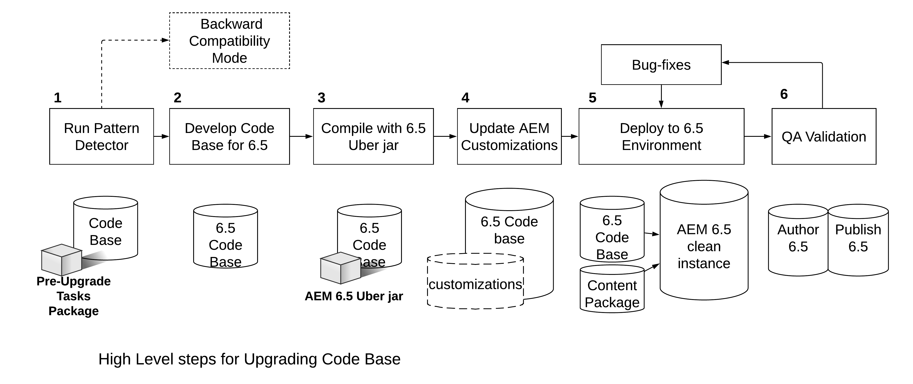

# Aggiornamento del codice e delle personalizzazioni{#upgrading-code-and-customizations}

Durante la pianificazione di un aggiornamento, è necessario esaminare e risolvere le seguenti aree di un’implementazione.

* [Aggiorna base codice](#upgrade-code-base)
* [Allinea alla struttura dell’archivio 6.5](#align-repository-structure)
* [Personalizzazioni AEM](#aem-customizations)
* [Procedura di prova](#testing-procedure)

## Panoramica {#overview}

1. **Rilevatore pattern** : esegui il rilevatore pattern come descritto in pianificazione dell’aggiornamento e descritto in dettaglio [questa pagina](/help/sites-deploying/pattern-detector.md). Ottieni un report del rilevatore pattern che contiene più dettagli sulle aree che devono essere trattate oltre alle API/bundle non disponibili nella versione Target dell’AEM. Il rapporto Pattern Detection (Rilevamento pattern) fornisce un’indicazione di eventuali incompatibilità nel codice. Se non ne esiste alcuna, la distribuzione è già compatibile con la versione 6.5. Puoi comunque scegliere di eseguire un nuovo sviluppo per l’utilizzo della funzionalità 6.5, ma non è necessario solo per mantenere la compatibilità. Se vengono segnalate incompatibilità, puoi scegliere di eseguire in modalità di compatibilità e posticipare lo sviluppo per le nuove funzioni 6.5 o per la compatibilità. In alternativa, puoi decidere di eseguire lo sviluppo dopo l’aggiornamento e passare al passaggio 2. Consulta [Compatibilità con le versioni precedenti in AEM 6.5](/help/sites-deploying/backward-compatibility.md) per ulteriori dettagli.

1. **Develop Code Base for 6.5 **- Crea un ramo o archivio dedicato per la base di codice per la versione di Target. Utilizza le informazioni di Compatibilità pre-aggiornamento per pianificare le aree di codice da aggiornare.
1. **Compilare con file jar 6.5 Uber **- Aggiornare i POM della base di codice in modo che puntino al file jar 6.5 Uber e compilare il codice in base a esso.
1. **Aggiornare le personalizzazioni AEM*** - *Tutte le personalizzazioni o estensioni dell&#39;AEM devono essere aggiornate/convalidate per funzionare nella versione 6.5 e aggiunte alla base di codice 6.5. Include la Forms di ricerca dell’interfaccia utente, le personalizzazioni delle risorse e tutto ciò che utilizza /mnt/overlay

1. **Implementare in ambiente 6.5** - Un’istanza pulita dell’AEM 6.5 (Author + Publish) deve essere rilevata in un ambiente di sviluppo/controllo qualità. È necessario distribuire una base di codice aggiornata e un campione rappresentativo di contenuti (dalla produzione corrente).
1. **Convalida QA e correzione di bug** - Il controllo qualità deve convalidare l’applicazione nelle istanze Author e Publish di 6.5. Eventuali bug rilevati devono essere corretti e inseriti nella base di codice 6.5. Ripeti Dev-Cycle secondo necessità fino a quando tutti i bug non vengono risolti.

Prima di procedere con un aggiornamento, è necessario disporre di una base di codice dell’applicazione stabile che sia stata accuratamente testata rispetto alla versione di destinazione dell’AEM. In base alle osservazioni effettuate nei test, ci potrebbero essere modi per ottimizzare il codice personalizzato. Ad esempio, potrebbe includere il refactoring del codice per evitare l’attraversamento dell’archivio, l’indicizzazione personalizzata per ottimizzare la ricerca o l’utilizzo di nodi non ordinati in JCR, tra gli altri.

Oltre ad aggiornare facoltativamente la base di codice e le personalizzazioni per lavorare con la nuova versione dell’AEM, la versione 6.5 consente anche di gestire le personalizzazioni in modo più efficiente con la funzione di compatibilità con le versioni precedenti come descritto in [questa pagina](/help/sites-deploying/backward-compatibility.md).

Come indicato sopra e mostrato nel diagramma seguente, eseguendo il comando [Rilevatore pattern](/help/sites-deploying/pattern-detector.md) nel primo passaggio può aiutarti a valutare la complessità complessiva dell’aggiornamento. Può anche aiutarti a decidere se desideri eseguire in modalità di compatibilità o aggiornare le personalizzazioni per utilizzare tutte le nuove funzioni di AEM 6.5. Consulta la [Compatibilità con le versioni precedenti in AEM 6.5](/help/sites-deploying/backward-compatibility.md) per ulteriori dettagli.
[](assets/upgrade-code-base-highlevel.png)

## Aggiorna base codice {#upgrade-code-base}

### Creare un ramo dedicato per il codice 6.5 nel controllo della versione {#create-a-dedicated-branch-for-6.5-code-in-version-control}

Tutto il codice e le configurazioni necessari per l’implementazione dell’AEM devono essere gestiti utilizzando una qualche forma di controllo della versione. È necessario creare un ramo dedicato nel controllo della versione per gestire eventuali modifiche necessarie per la base di codice nella versione di destinazione dell’AEM. In questo ramo vengono gestiti i test iterativi della base di codice rispetto alla versione di destinazione dell’AEM e le successive correzioni di bug.

### Aggiornare la versione del file JAR Uber dell’AEM {#update-the-aem-uber-jar-version}

Il file jar Uber dell’AEM include tutte le API AEM come una singola dipendenza nel file del progetto Maven `pom.xml`. È sempre consigliabile includere il file JAR di Uber come una singola dipendenza invece di includere singole dipendenze API dell’AEM. Quando si aggiorna la base di codice, modifica la versione del file JAR Uber in modo che punti alla versione di destinazione dell’AEM. Se il progetto è stato sviluppato su una versione dell’AEM prima dell’esistenza del file JAR Uber, rimuovi tutte le dipendenze API dell’AEM. Sostituiscili con una singola inclusione del JAR Uber per la versione di destinazione dell’AEM. Ricompila la base di codice rispetto alla nuova versione del file JAR Uber. Aggiorna eventuali API o metodi obsoleti in modo che siano compatibili con la versione di destinazione dell’AEM.

```
<dependency>
    <groupId>com.adobe.aem</groupId>
    <artifactId>uber-jar</artifactId>
    <version>6.5.0</version>
    <classifier>apis</classifier>
    <scope>provided</scope>
</dependency>
```

### Eliminazione graduale dell&#39;utilizzo di Risolutore risorse amministrative {#phase-out-use-of-administrative-resource-resolver}

Utilizzo di una sessione amministrativa tramite `SlingRepository.loginAdministrative()` e `ResourceResolverFactory.getAdministrativeResourceResolver()` era prevalente nelle basi di codice prima di AEM 6.0. Questi metodi sono stati dichiarati obsoleti per motivi di sicurezza in quanto concedono un livello di accesso troppo ampio. [Nelle versioni future di Sling, questi metodi verranno rimossi](https://sling.apache.org/documentation/the-sling-engine/service-authentication.html#deprecation-of-administrative-authentication). Si consiglia vivamente di eseguire il refactoring del codice per utilizzare al suo posto gli utenti del servizio. Ulteriori informazioni su Utenti del servizio e [per informazioni su come eliminare gradualmente le sessioni amministrative, visita questa pagina](/help/sites-administering/security-service-users.md#how-to-phase-out=admin-sessions).

### Query e indici Oak {#queries-and-oak-indexes}

Qualsiasi utilizzo di query nella base di codice deve essere testato accuratamente come parte dell’aggiornamento della base di codice. Per i clienti che eseguono l’aggiornamento da Jackrabbit 2 (versioni di AEM precedenti alla 6.0), questo test è particolarmente importante in quanto Oak non indicizza il contenuto automaticamente e occorre creare indici personalizzati. Se si esegue l’aggiornamento da una versione AEM 6.x, le definizioni predefinite dell’indice Oak potrebbero essere cambiate e influire sulle query esistenti.

Sono disponibili i seguenti strumenti per l’analisi e l’analisi delle prestazioni delle query:

* [Strumenti di indice AEM](/help/sites-deploying/queries-and-indexing.md)

* [Strumenti di diagnostica operazioni - Prestazioni query](/help/sites-administering/operations-dashboard.md#diagnosis-tools)

<!-- URL is 404 as of 04/24/23; commenting out * [Oak Utils](https://oakutils.appspot.com/). This is an open source tool that is not maintained by Adobe. -->

### Authoring con interfaccia classica {#classic-ui-authoring}

L’authoring dell’interfaccia classica è ancora disponibile in AEM 6.5 ma è ora obsoleto. Ulteriori informazioni sono disponibili [qui](/help/release-notes/deprecated-removed-features.md#pre-announcement-for-next-release). Se l’applicazione è in esecuzione nell’ambiente di authoring dell’interfaccia classica, si consiglia di eseguire l’aggiornamento a AEM 6.5 e continuare a utilizzare tale interfaccia. La migrazione all’interfaccia utente touch può quindi essere pianificata come progetto separato da completare in diversi cicli di sviluppo. Per utilizzare l’interfaccia classica in AEM 6.5, è necessario eseguire il commit di diverse configurazioni OSGi nella base di codice. Ulteriori dettagli su come eseguire la configurazione sono disponibili [qui](/help/sites-administering/enable-classic-ui.md).

## Allinea alla struttura dell’archivio 6.5 {#align-repository-structure}

Per semplificare gli aggiornamenti e garantire che le configurazioni non vengano sovrascritte durante un aggiornamento, l’archivio viene ristrutturato in 6.4 per separare i contenuti dalla configurazione.

Pertanto, è necessario spostare diverse impostazioni per non risiedere più in `/etc` come in passato. Per esaminare l’insieme completo dei problemi di ristrutturazione dell’archivio che devono essere esaminati e risolti nell’aggiornamento all’AEM 6.4, vedi [Ristrutturazione dell’archivio in AEM 6.4](/help/sites-deploying/repository-restructuring.md).

## Personalizzazioni AEM  {#aem-customizations}

Devono essere identificate tutte le personalizzazioni dell’ambiente di authoring AEM nella versione sorgente dell’AEM. Una volta identificate, si consiglia di archiviare ogni personalizzazione nel controllo della versione o almeno di eseguirne il backup come parte di un pacchetto di contenuti. Tutte le personalizzazioni devono essere distribuite e convalidate in un ambiente di controllo qualità o di staging che esegue la versione di destinazione dell’AEM prima di un aggiornamento della produzione.

### Sovrapposizioni in generale {#overlays-in-general}

È una pratica comune estendere la funzionalità predefinita dell’AEM sovrapponendo nodi e/o file in /libs con nodi aggiuntivi in /apps. Queste sovrapposizioni devono essere tracciate nel controllo della versione e testate rispetto alla versione target dell’AEM. Se un file (come JS, JSP, HTL) è sovrapposto, l’Adobe consiglia di lasciare un commento su quale funzionalità è stata migliorata per facilitare il test di regressione sulla versione di destinazione dell’AEM. Ulteriori informazioni sulle sovrapposizioni in generale sono disponibili qui [qui](/help/sites-developing/overlays.md). Le istruzioni per specifiche sovrapposizioni AEM sono riportate di seguito.

### Aggiornamento del Forms di ricerca personalizzato {#upgrading-custom-search-forms}

I facet di ricerca personalizzati richiedono alcune regolazioni manuali dopo l’aggiornamento per funzionare correttamente. Per ulteriori dettagli, consulta [Aggiornamento del Forms di ricerca personalizzato](/help/sites-deploying/upgrading-custom-search-forms.md).

### Personalizzazioni dell’interfaccia utente di Assets {#assets-ui-customizations}

>[!NOTE]
>
>Questa procedura è necessaria solo per gli aggiornamenti da versioni precedenti a AEM 6.2.

Le istanze con distribuzioni di Assets personalizzate devono essere preparate per l’aggiornamento. Questa azione è necessaria per garantire che tutto il contenuto personalizzato sia compatibile con la nuova struttura a 6,4 nodi.

Puoi preparare le personalizzazioni per l’interfaccia utente di Assets effettuando le seguenti operazioni:

1. Nell’istanza che viene aggiornata, apri CRXDE Liti da *https://server:port/crx/de/index.jsp*

1. Vai al seguente nodo:

   * `/apps/dam/content`

1. Rinomina il nodo di contenuto in **content_backup** facendo clic con il pulsante destro del mouse sul riquadro dell&#39;elenco delle cartelle nella parte sinistra della finestra e scegliendo **Rinomina**.

1. Una volta rinominato il nodo, crea un nodo denominato content in `/apps/dam` denominato **contenuto** e imposta il relativo tipo di nodo su **sling:Cartella**.

1. Sposta tutti i nodi figlio di **content_backup** al nodo di contenuto appena creato facendo clic con il pulsante destro del mouse su ogni nodo figlio nel riquadro di esplora risorse e selezionando **Sposta**.

1. Elimina **content_backup** nodo.

1. I nodi sotto aggiornati `/apps/dam` con il tipo di nodo corretto di `sling:Folder` dovrebbero essere salvate idealmente nel controllo della versione e distribuite con la base di codice o come minimo di backup come pacchetto di contenuti.

### Generazione degli ID risorsa per le risorse esistenti {#generating-asset-ids-for-existing-assets}

Per generare ID risorsa per le risorse esistenti, aggiorna le risorse quando aggiorni l’istanza AEM per eseguire AEM 6.5. Questo passaggio è necessario per abilitare [Funzione Assets Insights](/help/assets/asset-insights.md). Per ulteriori dettagli, consulta [Aggiungi codice di incorporamento](/help/assets/use-page-tracker.md#add-embed-code).

Per aggiornare le risorse, configura il pacchetto Associa ID risorse nella console JMX. A seconda del numero di risorse nell’archivio, `migrateAllAssets` può richiedere molto tempo. I test interni di Adobe stimano circa un’ora per 125000 risorse su TarMK.


Se hai bisogno degli ID risorsa per un sottoinsieme di tutte le risorse, utilizza `migrateAssetsAtPath` API.

Per tutti gli altri scopi, utilizza `migrateAllAssets()` API.

### Personalizzazioni degli script InDesign {#indesign-script-customizations}

L’Adobe consiglia di inserire script personalizzati `/apps/settings/dam/indesign/scripts` posizione. Ulteriori informazioni sulle personalizzazioni degli script di InDesign sono disponibili [qui](/help/assets/indesign.md#configuring-the-aem-assets-workflow).

### Ripristino configurazioni ContextHub {#recovering-contexthub-configurations}

Un aggiornamento influisce sulle configurazioni ContextHub. Puoi trovare le istruzioni su come ripristinare le configurazioni ContextHub esistenti. [qui](/help/sites-developing/ch-configuring.md#recovering-contexthub-configurations-after-upgrading).

### Personalizzazioni flusso di lavoro {#workflow-customizations}

È prassi comune modificare i flussi di lavoro preconfigurati per aggiungere o rimuovere funzionalità non necessarie. Un flusso di lavoro comune personalizzato è [!UICONTROL Aggiorna risorsa DAM] flusso di lavoro. Tutti i flussi di lavoro necessari per un’implementazione personalizzata devono essere sottoposti a backup e memorizzati nel controllo della versione, in quanto potrebbero essere sovrascritti durante un aggiornamento.

### Modelli modificabili {#editable-templates}

>[!NOTE]
>
>Questa procedura è necessaria solo per gli aggiornamenti Sites che utilizzano modelli modificabili di AEM 6.2

La struttura dei modelli modificabili è cambiata tra AEM 6.2 e 6.3. Se si esegue l&#39;aggiornamento da 6.2 o versioni precedenti e il contenuto del sito viene creato utilizzando modelli modificabili, è necessario utilizzare [Strumento di pulizia dei nodi reattivi](https://github.com/Adobe-Marketing-Cloud/aem-sites-template-migration). Lo strumento deve essere eseguito **dopo** un aggiornamento per pulire il contenuto. Eseguirlo sia sul livello Author che Publish.

### Modifiche all’implementazione CUG {#cug-implementation-changes}

L’implementazione di gruppi chiusi di utenti è cambiata in modo significativo per affrontare i limiti di prestazioni e scalabilità delle versioni precedenti dell’AEM. La versione precedente di CUG è stata dichiarata obsoleta nella versione 6.3 e la nuova implementazione è supportata solo nell’interfaccia utente touch. Se aggiorni dalla versione 6.2 o precedenti, puoi trovare le istruzioni per migrare alla nuova implementazione CUG [qui](/help/sites-administering/closed-user-groups.md#upgradetoaem63).

## Procedura di prova {#testing-procedure}

Per testare gli aggiornamenti è necessario preparare un piano di test completo. Il test della base di codice e dell’applicazione aggiornate deve essere eseguito prima in ambienti inferiori. Eventuali bug trovati devono essere corretti in modo iterativo fino a quando la base di codice non è stabile, solo in questo caso gli ambienti di livello superiore dovrebbero essere aggiornati.

### Verifica della procedura di aggiornamento {#testing-the-upgrade-procedure}

La procedura di aggiornamento qui descritta deve essere testata in ambienti di sviluppo e controllo qualità come documentato nel manuale di esecuzione personalizzato (consulta [Pianificazione dell&#39;aggiornamento](/help/sites-deploying/upgrade-planning.md)). La procedura di aggiornamento deve essere ripetuta fino a quando tutti i passaggi non sono documentati nel registro di esecuzione dell&#39;aggiornamento e il processo di aggiornamento non è graduale.

### Aree di prova dell’implementazione  {#implementation-test-areas-}

Di seguito sono riportate le aree critiche di qualsiasi implementazione AEM che devono essere coperte dal piano di test dopo l’aggiornamento dell’ambiente e la distribuzione della base di codice aggiornata.

<table>
 <tbody>
  <tr>
   <td><strong>Area di prova funzionale</strong></td>
   <td><strong>Descrizione</strong></td>
  </tr>
  <tr>
   <td>Siti pubblicati</td>
   <td>Verifica dell’implementazione dell’AEM e del codice associato sul livello di pubblicazione<br /> tramite Dispatcher. Deve includere criteri per gli aggiornamenti di pagina e<br /> annullamento della validità della cache.</td>
  </tr>
  <tr>
   <td>Authoring</td>
   <td>Verifica dell’implementazione dell’AEM e del codice associato sul livello di authoring. Deve includere la creazione di pagine, componenti e finestre di dialogo.</td>
  </tr>
  <tr>
   <td>Integrazioni con le soluzioni Experience Cloud</td>
   <td>Convalida delle integrazioni con prodotti come Analytics, DTM e Target.</td>
  </tr>
  <tr>
   <td>Integrazioni con sistemi di terze parti</td>
   <td>Convalida qualsiasi integrazione di terze parti sia sul livello Author che Publish.</td>
  </tr>
  <tr>
   <td>Autenticazione, sicurezza e autorizzazioni</td>
   <td>Qualsiasi meccanismo di autenticazione come LDAP/SAML deve essere convalidato.<br /> Le autorizzazioni e i gruppi devono essere testati sia su Author che Publish<br /> livelli.</td>
  </tr>
  <tr>
   <td>Query</td>
   <td>Gli indici e le query personalizzati devono essere testati insieme alle prestazioni delle query.</td>
  </tr>
  <tr>
   <td>Personalizzazioni interfaccia utente</td>
   <td>Eventuali estensioni o personalizzazioni dell’interfaccia utente AEM nell’ambiente di authoring.</td>
  </tr>
  <tr>
   <td>Flussi di lavoro</td>
   <td>Flussi di lavoro e funzionalità personalizzati e/o predefiniti.</td>
  </tr>
  <tr>
   <td>Test delle prestazioni</td>
   <td>Il test di carico deve essere eseguito sui livelli Author e Publish che simulano scenari reali.</td>
  </tr>
 </tbody>
</table>

### Documenta piano di test e risultati {#document-test-plan-and-results}

È necessario creare un piano di test che copra le aree di test di implementazione di cui sopra. Spesso è utile separare il piano di test dagli elenchi delle attività Autore e Pubblica. Questo piano di test deve essere eseguito sugli ambienti di sviluppo, controllo qualità e staging prima dell’aggiornamento degli ambienti di produzione. I risultati dei test e le metriche delle prestazioni devono essere acquisiti in ambienti inferiori per fornire confronti durante l’aggiornamento degli ambienti di staging e produzione.
